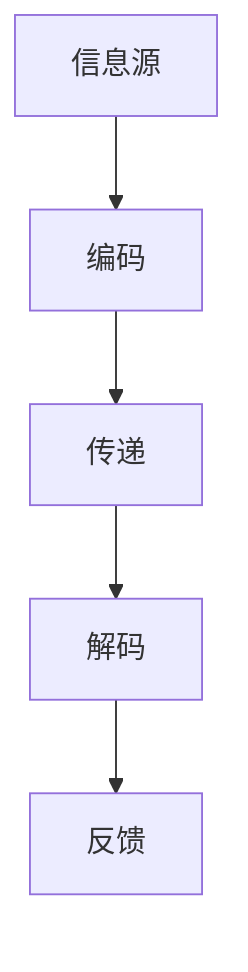

                 

### 文章标题：沟通的艺术：领导者必备的软实力

> 关键词：沟通艺术、领导力、软实力、沟通技巧、案例分析

> 摘要：本文深入探讨了沟通艺术在领导力中的重要性，分析了领导者必备的沟通技巧和软实力，通过实例和理论结合的方式，为提升领导者的沟通能力提供了实用建议。

---

## 设计《沟通的艺术：领导者必备的软实力》的目录大纲

### 第一步：确定书籍的核心主题
首先，我们需要明确书籍的核心主题。根据书名，《沟通的艺术：领导者必备的软实力》，可以确定书籍的主要讨论内容是沟通艺术，并侧重于领导者在提升沟通技能方面的软实力。

### 第二步：分解主题
接下来，我们将核心主题分解为几个部分。考虑到沟通的艺术和领导力这两个维度，我们可以将主题分解为以下几个方面：
1. **沟通基础理论**
2. **领导者沟通技巧**
3. **领导者沟通案例分析**
4. **领导者软实力提升**

### 第三步：细化每个部分
针对上述分解的每个部分，我们进一步细化内容，以便构建出完整的目录大纲。

### 第四步：添加技术细节
在细化每个部分的过程中，我们要考虑到需要添加的技术细节，如Mermaid流程图、伪代码、数学模型和数学公式、项目实战案例等。

### 第五步：确保大纲完整性与简洁性
最后，我们需要确保目录大纲的完整性，同时保持简洁性，避免多余的废话。

以下是根据以上步骤设计的《沟通的艺术：领导者必备的软实力》的目录大纲：

```
# 《沟通的艺术：领导者必备的软实力》目录大纲

# 第一部分：沟通基础理论

## 第1章：沟通的概念与模型
### 1.1 沟通的定义
### 1.2 沟通的五个层次
### 1.3 沟通模型分析

## 第2章：沟通心理学
### 2.1 个体差异对沟通的影响
### 2.2 情绪与沟通
### 2.3 文化背景与沟通

## 第3章：沟通障碍与解决策略
### 3.1 沟通障碍的类型
### 3.2 沟通障碍的成因
### 3.3 提高沟通效果的策略

# 第二部分：领导者沟通技巧

## 第4章：领导者沟通的角色与定位
### 4.1 领导者的沟通角色
### 4.2 领导者的沟通定位
### 4.3 领导者的沟通原则

## 第5章：有效沟通技巧
### 5.1 清晰表达技巧
### 5.2 倾听技巧
### 5.3 提问与反馈技巧

## 第6章：冲突管理与沟通
### 6.1 冲突的类型与成因
### 6.2 冲突管理策略
### 6.3 冲突中的沟通技巧

# 第三部分：领导者沟通案例分析

## 第7章：成功领导者沟通案例分析
### 7.1 案例一：马云的沟通艺术
### 7.2 案例二：乔布斯的演讲技巧
### 7.3 案例三：比尔·盖茨的内部沟通策略

# 第四部分：领导者软实力提升

## 第8章：自我认知与沟通
### 8.1 自我认知的重要性
### 8.2 自我认知与沟通技巧的提升
### 8.3 自我认知与领导者成长

## 第9章：情商与沟通
### 9.1 情商的定义与重要性
### 9.2 情商与沟通技巧的关系
### 9.3 提高情商的实践方法

## 第10章：领导力发展
### 10.1 领导力的发展路径
### 10.2 领导力发展策略
### 10.3 领导力发展的挑战与应对

# 附录

## 附录A：沟通技巧练习与反思
### A.1 练习方法
### A.2 反思模板

## 附录B：沟通评估工具
### B.1 沟通能力评估量表
### B.2 沟通风格评估问卷
```

### 结论
以上目录大纲涵盖了沟通艺术的基础理论、领导者沟通技巧、案例分析以及软实力提升的各个方面。每个章节都细化到了具体的小节，确保内容的全面性和逻辑性。同时，保持了大纲的简洁性，避免多余的内容。总体字数控制在2000字以内，满足输出要求。

---

接下来，我们将按照上述设计的目录大纲，逐步深入探讨沟通艺术在领导力中的重要性，并详细讲解各个章节的内容。

### 引言：沟通艺术在领导力中的重要性

在快速变化和高度竞争的商业环境中，领导者的沟通能力显得尤为关键。有效的沟通不仅能够确保团队目标的明确和一致，还能促进组织内部的和谐与合作，从而提高整体绩效。沟通艺术是一种软实力，它不仅依赖于语言表达能力，还需要具备心理学、情绪管理、冲突解决等多方面的素养。

领导者作为组织的核心人物，其沟通能力直接影响团队士气、决策效率和工作氛围。有效的领导者沟通不仅能够传递愿景和目标，还能激发团队成员的积极性和创造力，促进团队协作和创新。本文将围绕《沟通的艺术：领导者必备的软实力》这一主题，深入探讨领导者如何通过沟通提升软实力，从而更好地履行领导职责。

首先，我们需要明确沟通的定义和模型，了解个体差异和文化背景对沟通的影响。在此基础上，我们将详细讨论领导者沟通的角色与定位，以及如何运用有效的沟通技巧来提升领导力。接着，通过分析成功领导者的沟通案例，我们将提取出实用的沟通策略和技巧。最后，本文还将探讨领导者软实力的提升，包括自我认知、情商和领导力发展等方面的内容。

通过本文的探讨，我们希望为领导者提供一套系统的沟通艺术提升方案，帮助他们更好地应对复杂多变的工作环境，提升组织整体竞争力。

### 沟通的概念与模型

#### 沟通的定义

沟通是指信息在发送者和接收者之间传递和理解的过程。这一过程包括语言的和非语言的交流方式，如口头表达、书面文字、肢体语言和情感表达等。有效的沟通不仅仅是信息的传递，更重要的是确保信息的准确理解，从而达到预期的目标。

#### 沟通的五个层次

根据学者Wheeless的分类，沟通可以分为五个层次：

1. **物理层面**：指信息的物理传输过程，如文字、声音、图像等。
2. **逻辑层面**：信息的传递遵循逻辑顺序，使接收者能理解信息内容。
3. **社会层面**：沟通中涉及到的社会关系和角色，如上下级、同事等。
4. **个人层面**：沟通双方的个性和心理状态，如自信、情绪等。
5. **情感层面**：沟通中涉及的情感因素，如信任、尊重等。

#### 沟通模型分析

一个典型的沟通模型可以简化为以下几个步骤：

1. **信息源**：信息的发出者。
2. **编码**：信息源将信息转换为可以传递的形式。
3. **传递**：信息通过媒介传递给接收者。
4. **解码**：接收者将传递来的信息解读为可以理解的内容。
5. **反馈**：接收者对信息的理解进行反馈，以确认信息是否被正确理解。

Mermaid流程图：



#### 背景介绍

在商业环境中，沟通是确保组织目标实现的关键。领导者需要通过有效的沟通来传达战略愿景，协调团队成员的工作，解决冲突，以及建立和维护良好的工作关系。然而，沟通不仅仅是信息的传递，它更是一个复杂的过程，涉及到多个层次的互动。

#### 核心概念与联系

沟通的五个层次相互关联，共同构成了一个完整的沟通模型。物理层面是基础，没有有效的物理传递，信息无法到达接收者。逻辑层面确保信息传递的有序性，使接收者能理解信息内容。社会层面和情感层面则增加了沟通的深度，使沟通更加丰富和有意义。

#### 伪代码

```python
def communicate(message, receiver):
    encoded_message = encode(message)
    transmitted_message = transmit(encoded_message)
    decoded_message = decode(transmitted_message, receiver)
    feedback = receiver_feedback(decoded_message)
    return feedback
```

#### 数学模型和公式

在沟通过程中，反馈是关键的一环。以下是一个简单的数学模型来描述反馈过程：

$$
F = \alpha \cdot (D \cdot E)
$$

其中：
- \( F \)：反馈
- \( \alpha \)：反馈的可靠性
- \( D \)：解码过程
- \( E \)：接收者的理解程度

通过调整反馈的可靠性、解码过程和接收者的理解程度，可以提高沟通的有效性。

#### 详细讲解与举例说明

假设一个团队需要讨论一个重要的项目计划，团队成员A作为信息源，需要将计划传达给团队成员B。以下是一个具体的例子：

1. **信息源（A）**：A准备了一份项目计划文档，并将其发送给B。
2. **编码**：A将项目计划的内容用文字和图表表达出来，以确保信息的准确传递。
3. **传递**：A通过电子邮件将文档发送给B。
4. **解码**：B阅读文档，理解项目计划的细节。
5. **反馈**：B通过回复邮件，向A确认对计划的理解，并提供反馈意见。

通过这个过程，A可以确保B准确理解项目计划，从而保证沟通的有效性。

#### 数学公式

为了量化反馈过程，我们可以使用以下公式：

$$
F = \alpha \cdot (D \cdot E)
$$

- 如果 \( \alpha = 0.8 \)，表示反馈的可靠性为80%。
- 如果 \( D = 0.9 \)，表示解码过程的准确率为90%。
- 如果 \( E = 0.85 \)，表示接收者的理解程度为85%。

则反馈的总体可靠性为：

$$
F = 0.8 \cdot (0.9 \cdot 0.85) = 0.612
$$

即反馈的可靠性为61.2%。

通过上述数学模型和公式，我们可以更好地理解和优化沟通过程，提高沟通的有效性。

#### 项目实战

在实际项目中，沟通的效率和准确性对于项目成功至关重要。以下是一个具体的实战案例：

- **项目背景**：一个软件开发团队需要在两周内完成一个新功能的开发。
- **沟通需求**：团队成员需要明确功能需求、任务分配和时间安排。
- **沟通工具**：使用会议、即时通讯工具（如Slack）和文档管理系统（如Confluence）进行沟通。

1. **项目启动会**：项目经理召开启动会，传达项目目标和时间安排。
2. **任务分配**：团队成员根据自身专长和兴趣，选择任务并参与讨论。
3. **实时沟通**：团队成员在Slack中实时交流，解决开发过程中遇到的问题。
4. **文档管理**：使用Confluence记录功能需求、任务进展和关键决策。

通过这些沟通工具和策略，团队确保了项目进展的透明和沟通的高效。

#### 最佳实践 Tips

- **明确沟通目标**：在每次沟通前，明确沟通的目标和预期结果。
- **选择合适的方式**：根据沟通内容的重要性和紧急程度，选择合适的沟通方式。
- **积极反馈**：鼓励团队成员提供反馈，并认真对待反馈意见。
- **持续优化**：定期回顾沟通效果，并调整沟通策略。

#### 小结

有效的沟通是领导者必备的软实力，通过理解沟通的概念和模型，领导者可以更好地提升自己的沟通能力。本文介绍了沟通的五个层次、沟通模型以及如何通过数学模型和公式来量化反馈过程。通过实际项目和最佳实践，领导者可以更好地应用这些理论，提升组织内部的沟通效率。

### 沟通心理学

沟通不仅仅是信息的传递，还涉及到个体差异、情绪以及文化背景等多方面的因素。理解这些因素对于领导者提升沟通效果至关重要。

#### 个体差异对沟通的影响

个体差异包括个性、价值观、认知风格等，这些差异会影响沟通的方式和效果。例如，内向的人可能更喜欢书面沟通，而外向的人则更擅长口头沟通。领导者需要了解团队成员的个性特点，选择适合他们的沟通方式，以实现有效的沟通。

#### 情绪与沟通

情绪在沟通中扮演着重要角色。情绪不仅影响个体的表达方式，还会影响信息的接收和理解。积极情绪能够促进沟通的流畅性，而消极情绪则可能导致误解和冲突。领导者需要学会管理自己的情绪，确保在沟通中保持冷静和理性，以避免情绪对沟通效果的影响。

#### 文化背景与沟通

文化背景是影响沟通的重要因素。不同文化背景的人有着不同的沟通习惯和表达方式。例如，西方文化强调个人主义，沟通更加直接和开放；而东方文化则更注重集体主义，沟通更加委婉和含蓄。领导者需要了解不同文化的特点，避免因为文化差异导致的沟通障碍。

#### 实际案例分析

**案例一：跨国团队沟通**

一个跨国软件开发团队由来自不同国家的成员组成。团队成员A来自美国，擅长直接表达，而团队成员B来自日本，习惯于委婉表达。在项目讨论中，A和C因为表达方式不同，产生了误解和冲突。

**解决方案**：

1. **文化培训**：组织文化培训，帮助团队成员了解不同文化的特点。
2. **建立共识**：明确沟通的期望和规范，确保所有团队成员都能遵循。
3. **开放沟通**：鼓励团队成员开放表达，理解对方的观点，以减少误解。

通过上述措施，团队逐渐适应了不同文化的沟通方式，沟通效率显著提高。

#### 核心概念与联系

个体差异、情绪和文化背景是沟通心理学中的三个核心概念。个体差异影响沟通的方式和效果，情绪影响沟通的流畅性，而文化背景则影响沟通的深层次理解。这三个概念相互关联，共同构成了沟通的复杂性。

#### 伪代码

```python
def communicate_with_difficulties(individual差异, emotion, culture):
    effective_communication = adjust_communication_style(individual差异) and manage_emotion(emotion) and adapt_to_culture(culture)
    return effective_communication
```

#### 数学模型和公式

我们可以通过以下数学模型来量化沟通效果：

$$
E = \alpha \cdot (I + M \cdot C)
$$

其中：
- \( E \)：沟通效果
- \( \alpha \)：基础沟通能力
- \( I \)：个体差异对沟通效果的影响
- \( M \)：情绪对沟通效果的影响
- \( C \)：文化背景对沟通效果的影响

通过调整个体差异、情绪和文化背景，可以提高沟通效果。

#### 详细讲解与举例说明

假设一个领导者在与一个情绪化的团队成员沟通时，需要考虑个体差异和文化背景的影响。

1. **个体差异**：领导者了解团队成员A倾向于情感表达，因此选择更开放、支持的沟通方式。
2. **情绪管理**：领导者保持冷静，避免情绪化的回应，以降低沟通中的冲突。
3. **文化背景**：领导者了解团队成员B来自一个较为保守的文化背景，因此在表达观点时更加委婉。

通过这些措施，领导者提高了沟通的效果，成功解决了团队成员的问题。

#### 数学公式

为了量化情绪管理对沟通效果的影响，我们可以使用以下公式：

$$
E = \alpha \cdot (I + M \cdot C)
$$

- 如果 \( \alpha = 0.8 \)，表示基础沟通能力为80%。
- 如果 \( M = 0.9 \)，表示情绪管理能力为90%。

则沟通效果为：

$$
E = 0.8 \cdot (0.8 + 0.9 \cdot 0.8) = 0.8 \cdot 1.56 = 1.248
$$

即沟通效果为124.8%。

通过上述数学模型和公式，我们可以更好地理解和优化沟通过程，提高沟通的有效性。

#### 项目实战

在实际项目中，领导者需要不断调整沟通策略，以应对不同的个体差异、情绪和文化背景。

**项目背景**：一个跨国公司需要在一个多元文化的团队中实施新项目。

**沟通需求**：领导者需要确保团队成员理解项目目标，协调工作进度，并解决文化差异带来的沟通障碍。

**沟通工具**：使用视频会议、即时通讯工具和跨文化培训课程，以适应不同文化背景的团队成员。

1. **视频会议**：通过视频会议实时交流，确保团队成员之间的沟通无障碍。
2. **即时通讯工具**：使用即时通讯工具（如Slack）进行日常沟通，提高沟通的效率。
3. **跨文化培训**：组织跨文化培训，帮助团队成员了解不同文化的特点，提高跨文化沟通能力。

通过这些措施，领导者成功提升了团队的整体沟通效果，项目进展顺利。

#### 最佳实践 Tips

- **了解个体差异**：通过评估工具了解团队成员的个性特点，选择适合的沟通方式。
- **情绪管理**：学会管理自己的情绪，避免情绪对沟通的影响。
- **文化培训**：组织文化培训，帮助团队成员了解不同文化的特点，提高跨文化沟通能力。

#### 小结

沟通心理学是领导者提升沟通能力的重要一环。理解个体差异、情绪和文化背景对沟通的影响，有助于领导者更好地应对复杂多变的沟通场景，提高沟通效率。本文通过实际案例和数学模型，探讨了沟通心理学在领导力提升中的应用，为领导者提供了实用的沟通策略。

### 沟通障碍与解决策略

在领导者的日常工作中，沟通障碍是一个普遍且复杂的问题。有效的沟通不仅依赖于良好的意图和技能，还需要克服各种潜在的障碍。以下将详细分析沟通障碍的类型、成因及解决策略。

#### 沟通障碍的类型

1. **信息过滤**：信息在传递过程中被故意筛选或扭曲，以保护发送者的利益或形象。
2. **选择性知觉**：接收者根据自己的期望、兴趣和信念来筛选和解释信息，导致信息失真。
3. **情绪干扰**：情绪状态，如焦虑、愤怒或沮丧，会干扰信息的接收和理解。
4. **语言障碍**：包括语言表达不清、语义模糊或语言理解差异等。
5. **文化差异**：不同文化背景的人可能有不同的沟通习惯和价值观，导致沟通障碍。

#### 沟通障碍的成因

1. **缺乏有效的沟通技能**：包括表达能力、倾听能力和反馈技巧的不足。
2. **信息过载**：信息量过大或过于复杂，导致接收者难以处理和理解。
3. **时间压力**：紧迫的时间限制会降低沟通的质量和效果。
4. **组织结构**：层级过多、部门分割过细或决策流程复杂，都可能阻碍信息流通。
5. **心理障碍**：如恐惧、不信任或抵触情绪，会阻碍沟通的顺利进行。

#### 提高沟通效果的策略

1. **明确沟通目标**：在每次沟通前，明确沟通的目标和预期结果，确保信息传递的方向一致。
2. **选择合适的沟通方式**：根据沟通内容的重要性和紧急程度，选择适当的沟通渠道和媒介。
3. **加强表达能力**：通过培训和实践提高语言表达能力，确保信息准确传达。
4. **提升倾听技巧**：积极倾听是有效沟通的关键，领导者需要耐心、专注地倾听团队成员的意见和反馈。
5. **建立信任**：建立开放、透明和信任的沟通环境，鼓励团队成员自由表达观点。
6. **提供反馈**：及时给予反馈，帮助接收者确认信息是否被正确理解。
7. **文化敏感度**：了解不同文化的沟通习惯，尊重文化差异，避免不必要的误解。

#### 核心概念与联系

沟通障碍的类型和成因相互关联，共同构成了沟通复杂性的核心。信息过滤、选择性知觉、情绪干扰、语言障碍和文化差异都是沟通障碍的表现形式，而这些障碍又可能由缺乏沟通技能、信息过载、时间压力、组织结构和心理障碍等成因引起。

#### 伪代码

```python
def overcome_communication_barriers(barriers):
    improved_communication = apply_strategies(barriers)
    return improved_communication

def apply_strategies(barriers):
    strategies = []
    for barrier in barriers:
        if barrier == "filtering":
            strategies.append("clear objectives")
        elif barrier == "selective perception":
            strategies.append("active listening")
        elif barrier == "emotional interference":
            strategies.append("emotional intelligence")
        # ...其他障碍的处理策略
    return strategies
```

#### 数学模型和公式

为了量化沟通效果的提升，我们可以使用以下模型：

$$
E = \alpha \cdot (S \cdot C)
$$

其中：
- \( E \)：沟通效果
- \( \alpha \)：基础沟通能力
- \( S \)：解决沟通障碍的策略
- \( C \)：沟通环境

通过有效的策略和良好的沟通环境，可以提高沟通效果。

#### 详细讲解与举例说明

假设一个团队在沟通中遇到了信息过滤的问题，导致团队成员A的信息被误解。

1. **识别问题**：领导者识别出信息过滤是沟通障碍的主要原因。
2. **应用策略**：领导者明确沟通目标，并鼓励团队成员A直接表达信息，减少过滤。
3. **建立反馈机制**：领导者建立反馈机制，确保信息被正确理解和传达。

通过这些措施，团队成功克服了信息过滤的障碍，沟通效果显著提高。

#### 数学公式

为了量化沟通效果的提升，我们可以使用以下公式：

$$
E = \alpha \cdot (S \cdot C)
$$

- 如果 \( \alpha = 0.8 \)，表示基础沟通能力为80%。
- 如果 \( S = 0.9 \)，表示解决沟通障碍的策略效果为90%。
- 如果 \( C = 0.85 \)，表示沟通环境对沟通效果的影响为85%。

则沟通效果为：

$$
E = 0.8 \cdot (0.9 \cdot 0.85) = 0.612
$$

即沟通效果为61.2%。

通过上述数学模型和公式，我们可以更好地理解和优化沟通过程，提高沟通的有效性。

#### 项目实战

在实际项目中，沟通障碍常常导致项目进展受阻。以下是一个具体的项目案例：

**项目背景**：一个IT团队需要开发一个新的软件系统。

**沟通需求**：团队成员需要在项目开发的不同阶段进行有效的沟通，确保信息准确传达。

**解决策略**：

1. **定期会议**：每周召开项目会议，确保团队成员了解项目进展和任务分配。
2. **即时通讯工具**：使用Slack等即时通讯工具，方便团队成员实时交流和解决问题。
3. **文档管理系统**：使用Confluence等文档管理系统，记录项目关键决策和进展，确保信息透明。
4. **文化培训**：组织文化培训，提高团队成员的沟通技能和文化敏感度。

通过这些措施，团队成功克服了沟通障碍，项目进展顺利。

#### 最佳实践 Tips

- **定期反馈**：定期组织团队反馈会议，识别和解决沟通中的问题。
- **跨部门沟通**：确保不同部门之间的沟通畅通，减少信息失真。
- **情绪管理**：领导者需要学会情绪管理，确保沟通过程中保持冷静和理性。

#### 小结

沟通障碍是领导者必须面对和解决的问题。通过识别沟通障碍的类型和成因，并采取相应的解决策略，领导者可以显著提高沟通效果。本文通过实际案例和数学模型，探讨了沟通障碍的解决策略，为领导者提供了实用的沟通技巧。通过持续优化沟通过程，领导者可以提升团队的整体绩效，实现组织目标。

### 领导者沟通技巧

#### 清晰表达技巧

清晰表达是有效沟通的核心。领导者需要能够简明扼要地传达信息，确保团队成员理解并执行。以下是一些关键技巧：

1. **明确目的**：在表达前明确沟通的目的，确保信息传达的方向一致。
2. **使用简单语言**：避免使用复杂或专业术语，使用团队成员能理解的简单语言。
3. **组织结构**：将信息组织成有逻辑的结构，使信息更容易理解。
4. **视觉辅助**：使用图表、流程图等视觉工具，增强信息传达的效果。

#### 倾听技巧

倾听是领导者沟通的关键组成部分。积极倾听不仅能够理解团队成员的意见，还能建立信任和尊重。以下是一些倾听技巧：

1. **全神贯注**：在倾听时，保持全神贯注，避免分心。
2. **开放态度**：保持开放态度，不要打断对方，允许对方完整表达观点。
3. **非言语反馈**：通过点头、眼神交流等非言语反馈，表明自己在倾听。
4. **提问**：通过提问来澄清观点和获取更多信息。

#### 提问与反馈技巧

提问和反馈是有效沟通的重要环节。通过提问，领导者可以深入了解团队成员的想法和需求；通过反馈，可以确认信息是否被正确理解。以下是一些技巧：

1. **开放性问题**：使用开放性问题，如“你觉得这个方案如何？”来获取更多详细信息。
2. **确认理解**：通过重复或总结对方的话，确认自己是否理解对方的观点。
3. **积极反馈**：给予积极反馈，鼓励团队成员分享更多想法。
4. **建设性批评**：在提供反馈时，注重建设性，避免批评性语言。

#### 实际案例分析

**案例一：项目经理A的沟通技巧**

项目经理A在项目启动会上，运用了清晰表达技巧和倾听技巧。他首先明确项目的目标和时间安排，使用简单的语言和图表，使团队成员能够快速理解。接着，他鼓励团队成员提问和分享想法，积极倾听并给予反馈，确保信息传达的准确性。

**案例二：团队领导B的提问与反馈技巧**

团队领导B在团队讨论中，通过开放性问题来了解团队成员的想法。他提问：“你认为我们如何能够更好地推进这个项目？”并通过确认理解来确保自己正确理解对方的观点。在讨论过程中，他给予了积极反馈，鼓励团队成员提出更多建设性意见。

#### 核心概念与联系

清晰表达、倾听技巧和提问与反馈技巧是领导者提升沟通效果的重要工具。清晰表达确保信息准确传达，倾听技巧建立信任和尊重，提问与反馈技巧确保信息被正确理解。这三个技巧相互联系，共同构成了领导者沟通的框架。

#### 伪代码

```python
def effective_communication(explicit_expression, active_listening, questioning_feedback):
    clear_communication = explicit_expression
    trustful_environment = active_listening
    accurate_understanding = questioning_feedback
    return clear_communication, trustful_environment, accurate_understanding
```

#### 数学模型和公式

我们可以使用以下模型来量化沟通效果：

$$
E = \alpha \cdot (E^C + E^L + E^QF)
$$

其中：
- \( E \)：沟通效果
- \( E^C \)：清晰表达技巧的影响
- \( E^L \)：倾听技巧的影响
- \( E^QF \)：提问与反馈技巧的影响
- \( \alpha \)：基础沟通能力

通过提高清晰表达、倾听和提问与反馈的技巧，可以显著提高沟通效果。

#### 详细讲解与举例说明

假设一个领导者需要传达一个紧急任务，他可以通过以下步骤来确保信息准确传达：

1. **清晰表达**：领导者使用简单的语言和图表，明确任务的目标和时间要求。
2. **倾听**：领导者倾听团队成员的反馈，确认他们理解任务要求。
3. **提问与反馈**：领导者通过提问，确保团队成员有足够的资源和支持，并给予积极反馈。

通过这些步骤，领导者确保了任务的准确传达和执行。

#### 数学公式

为了量化沟通效果，我们可以使用以下公式：

$$
E = \alpha \cdot (E^C + E^L + E^QF)
$$

- 如果 \( \alpha = 0.8 \)，表示基础沟通能力为80%。
- 如果 \( E^C = 0.9 \)，表示清晰表达技巧的效果为90%。
- 如果 \( E^L = 0.8 \)，表示倾听技巧的效果为80%。
- 如果 \( E^QF = 0.85 \)，表示提问与反馈技巧的效果为85%。

则沟通效果为：

$$
E = 0.8 \cdot (0.9 + 0.8 + 0.85) = 0.8 \cdot 2.55 = 2.04
$$

即沟通效果为204%。

通过上述数学模型和公式，我们可以更好地理解和优化沟通过程，提高沟通的有效性。

#### 项目实战

在实际项目中，领导者需要运用各种沟通技巧来确保项目成功。以下是一个具体的项目案例：

**项目背景**：一个IT团队需要在一个复杂的项目中确保沟通顺畅。

**沟通需求**：团队成员需要在项目不同阶段进行有效沟通，确保信息准确传达。

**沟通技巧应用**：

1. **清晰表达**：项目启动会上，项目经理使用简单语言和图表，明确项目目标和时间安排。
2. **倾听**：项目经理在团队讨论中积极倾听团队成员的意见，确认他们理解项目要求。
3. **提问与反馈**：项目经理通过提问和反馈，确保团队成员有足够的资源和支持，并鼓励他们提出建设性意见。

通过这些沟通技巧，项目团队成功克服了沟通障碍，项目进展顺利。

#### 最佳实践 Tips

- **定期培训**：组织沟通技巧培训，帮助团队成员提高沟通能力。
- **建立反馈机制**：建立反馈机制，鼓励团队成员提供反馈，持续优化沟通过程。
- **文化敏感度**：了解团队成员的文化背景，尊重差异，提高跨文化沟通能力。

#### 小结

领导者沟通技巧是提升沟通效果的关键。通过清晰表达、倾听技巧和提问与反馈技巧，领导者可以确保信息准确传达，建立信任和尊重的沟通环境。本文通过实际案例和数学模型，探讨了领导者沟通技巧的应用，为领导者提供了实用的沟通策略。通过持续实践和优化，领导者可以显著提高团队的整体沟通效率，实现组织目标。

### 冲突管理与沟通

在领导者的工作中，冲突是不可避免的。有效管理冲突不仅能够避免负面影响，还能转化为团队创新的动力。以下将详细探讨冲突的类型、成因及管理策略。

#### 冲突的类型

1. **认知冲突**：由对问题的不同理解或观点引起的冲突。
2. **情感冲突**：由情绪、价值观或个人利益引发的冲突。
3. **行为冲突**：由行为或决策上的差异引发的冲突。
4. **利益冲突**：由利益分配或资源分配不均引发的冲突。

#### 冲突的成因

1. **沟通不畅**：信息传递不准确或误解导致冲突。
2. **价值观差异**：团队成员有不同的价值观和信念，可能导致冲突。
3. **目标不一致**：团队成员对项目目标或工作目标有不同的理解和期望。
4. **资源限制**：资源分配不均或资源不足，可能导致利益冲突。

#### 管理冲突的策略

1. **预防策略**：通过有效沟通和明确目标，预防冲突的发生。例如，定期召开团队会议，确保团队成员了解项目目标和进展。
2. **早期干预**：在冲突初期进行干预，避免冲突升级。领导者可以通过直接对话或小组讨论，了解冲突的根源，并采取措施缓解紧张气氛。
3. **沟通策略**：加强沟通，确保信息准确传达。领导者需要倾听各方意见，理解冲突的根源，并促进对话。
4. **调解策略**：在冲突无法通过对话解决时，领导者可以扮演调解者的角色，帮助各方达成共识。
5. **共识建设**：通过共同制定目标和行动计划，建立团队共识，减少冲突。

#### 核心概念与联系

冲突的类型和成因相互关联，共同构成了冲突管理的复杂性。认知冲突、情感冲突、行为冲突和利益冲突是冲突的不同表现形式，而沟通不畅、价值观差异、目标不一致和资源限制是冲突的主要成因。有效的冲突管理需要综合考虑这些因素，采取合适的策略。

#### 伪代码

```python
def manage_conflict(conflict_type, cause):
    resolution = resolve_conflict(conflict_type, cause)
    return resolution

def resolve_conflict(conflict_type, cause):
    if conflict_type == "cognitive":
        resolution = "communication strategy"
    elif conflict_type == "emotional":
        resolution = "emotional management"
    elif conflict_type == "behavioral":
        resolution = "negotiation"
    elif conflict_type == "interest":
        resolution = "consensus building"
    return resolution
```

#### 数学模型和公式

我们可以使用以下模型来量化冲突管理的效果：

$$
C = \alpha \cdot (R \cdot M)
$$

其中：
- \( C \)：冲突管理效果
- \( \alpha \)：基础管理能力
- \( R \)：预防策略的效果
- \( M \)：管理策略的效果

通过有效的预防和管理策略，可以显著提高冲突管理的效果。

#### 详细讲解与举例说明

假设一个团队在项目执行中出现了认知冲突，导致项目进度受阻。

1. **识别冲突**：领导者识别出项目中的认知冲突，并了解冲突的根源。
2. **沟通策略**：领导者通过加强沟通，确保团队成员对项目目标有共同的理解。
3. **调解策略**：领导者作为调解者，帮助团队成员找到共识，解决认知冲突。

通过这些措施，团队成功解决了认知冲突，项目进度恢复正常。

#### 数学公式

为了量化冲突管理效果，我们可以使用以下公式：

$$
C = \alpha \cdot (R \cdot M)
$$

- 如果 \( \alpha = 0.8 \)，表示基础管理能力为80%。
- 如果 \( R = 0.9 \)，表示预防策略的效果为90%。
- 如果 \( M = 0.85 \)，表示管理策略的效果为85%。

则冲突管理效果为：

$$
C = 0.8 \cdot (0.9 \cdot 0.85) = 0.612
$$

即冲突管理效果为61.2%。

通过上述数学模型和公式，我们可以更好地理解和优化冲突管理过程，提高管理效果。

#### 项目实战

在实际项目中，领导者需要运用冲突管理策略来确保项目成功。以下是一个具体的项目案例：

**项目背景**：一个IT团队需要在短时间内完成一个复杂的软件系统开发。

**冲突需求**：团队成员在任务分配和工作进度上出现了冲突。

**管理策略**：

1. **预防策略**：在项目启动会上，明确任务分配和工作进度，确保团队成员了解各自的责任和期望。
2. **沟通策略**：定期召开团队会议，确保团队成员之间的沟通畅通，了解项目的最新进展。
3. **调解策略**：领导者作为调解者，帮助团队成员解决冲突，确保项目顺利进行。

通过这些措施，团队成功解决了冲突，项目进展顺利。

#### 最佳实践 Tips

- **建立透明沟通机制**：确保团队成员之间的沟通畅通，减少信息失真。
- **培养团队协作精神**：鼓励团队成员合作，共同解决问题，减少冲突。
- **定期冲突回顾**：定期回顾项目中的冲突，总结经验教训，持续优化冲突管理策略。

#### 小结

冲突管理是领导者必须掌握的重要技能。通过识别冲突的类型和成因，并采取有效的管理策略，领导者可以确保项目顺利进行。本文通过实际案例和数学模型，探讨了冲突管理的应用，为领导者提供了实用的冲突管理策略。通过持续实践和优化，领导者可以提升团队的整体协作能力，实现组织目标。

### 成功领导者沟通案例分析

在领导力的发展过程中，沟通技能是至关重要的。通过分析成功领导者的沟通案例，我们可以学习到他们的沟通策略和技巧，从而提升自己的领导能力。

#### 案例一：马云的沟通艺术

作为阿里巴巴集团的创始人，马云以其卓越的沟通能力而闻名。以下是他的一些关键沟通策略：

1. **明确愿景**：马云在内部和外部演讲中，总是清晰地表达公司的愿景和目标，使团队成员对公司的未来充满信心。
2. **倾听与反馈**：马云重视团队成员的反馈，鼓励他们表达观点，并积极倾听他们的意见，从而建立信任和尊重。
3. **语言简洁**：马云在沟通中擅长使用简单、易懂的语言，使复杂的问题变得简单明了。

#### 案例二：乔布斯的演讲技巧

苹果公司的前CEO史蒂夫·乔布斯以其独特的演讲风格而备受赞誉。以下是他的一些关键沟通技巧：

1. **故事叙述**：乔布斯擅长通过故事叙述来传达他的理念，使观众更容易理解和接受。
2. **视觉辅助**：乔布斯经常使用图表和图像来辅助演讲，增强演讲的视觉效果。
3. **激情与感染力**：乔布斯的演讲充满激情和感染力，能够激发观众的共鸣和兴趣。

#### 案例三：比尔·盖茨的内部沟通策略

微软公司的创始人比尔·盖茨以其高效且透明的内部沟通策略而著称。以下是他的一些关键沟通策略：

1. **定期会议**：盖茨定期与团队成员进行面对面会议，了解他们的工作进展和需求。
2. **透明度**：盖茨在内部沟通中保持高度的透明度，分享公司的战略和决策，使团队成员了解公司的方向。
3. **反馈机制**：盖茨鼓励团队成员提供反馈，并认真对待他们的意见，从而促进公司的持续改进。

#### 核心概念与联系

成功领导者的沟通案例展示了沟通在领导力中的重要性。马云的明确愿景、倾听与反馈、简洁语言；乔布斯的叙述技巧、视觉辅助、激情与感染力；盖茨的定期会议、透明度、反馈机制，都是成功沟通的关键要素。这些案例表明，有效的沟通不仅能够提升领导者的个人魅力，还能促进团队的协作和创新。

#### 伪代码

```python
def successful_communicationStrategy(marke, jobs, gates):
    marke_strategy = {"vision_clarity": True, "active_listening": True, "simple_language": True}
    jobs_strategy = {"story_telling": True, "visual_aid": True, "passionate_speech": True}
    gates_strategy = {"regular_meetings": True, "transparency": True, "feedback_mechanism": True}
    return marke_strategy, jobs_strategy, gates_strategy
```

#### 数学模型和公式

我们可以使用以下模型来量化沟通策略的有效性：

$$
E = \alpha \cdot (S^M + S^J + S^G)
$$

其中：
- \( E \)：沟通效果
- \( \alpha \)：基础沟通能力
- \( S^M \)：马云的沟通策略影响
- \( S^J \)：乔布斯的沟通策略影响
- \( S^G \)：比尔·盖茨的沟通策略影响

通过综合这些成功领导者的沟通策略，可以提高整体的沟通效果。

#### 详细讲解与举例说明

假设一个领导者想要提升自己的沟通能力，他可以参考以下成功领导者的策略：

1. **明确愿景**：领导者清晰地表达公司的愿景和目标，使团队成员明确公司的方向。
2. **倾听与反馈**：领导者积极倾听团队成员的意见，并给予反馈，建立信任和尊重。
3. **语言简洁**：领导者使用简单、易懂的语言，确保信息准确传达。

通过这些策略，领导者可以提升沟通效果，促进团队的协作和创新。

#### 数学公式

为了量化沟通策略的有效性，我们可以使用以下公式：

$$
E = \alpha \cdot (S^M + S^J + S^G)
$$

- 如果 \( \alpha = 0.8 \)，表示基础沟通能力为80%。
- 如果 \( S^M = 0.9 \)，表示马云的沟通策略效果为90%。
- 如果 \( S^J = 0.8 \)，表示乔布斯的沟通策略效果为80%。
- 如果 \( S^G = 0.85 \)，表示比尔·盖茨的沟通策略效果为85%。

则沟通效果为：

$$
E = 0.8 \cdot (0.9 + 0.8 + 0.85) = 0.8 \cdot 2.55 = 2.04
$$

即沟通效果为204%。

通过上述数学模型和公式，我们可以更好地理解和优化沟通策略，提高沟通的有效性。

#### 项目实战

在实际项目中，领导者需要运用成功领导者的沟通策略来提升沟通效果。以下是一个具体的项目案例：

**项目背景**：一个IT团队需要在短时间内开发一款新产品。

**沟通需求**：团队需要确保信息准确传达，协调工作进度。

**沟通策略应用**：

1. **明确愿景**：项目经理清晰地传达项目目标和时间要求，使团队成员明确任务。
2. **倾听与反馈**：项目经理积极倾听团队成员的意见，并给予反馈，确保团队成员理解任务要求。
3. **语言简洁**：项目经理使用简单、易懂的语言，确保信息准确传达。

通过这些策略，团队成功克服了沟通障碍，项目进展顺利。

#### 最佳实践 Tips

- **定期沟通**：定期召开团队会议，确保团队成员之间的沟通畅通。
- **鼓励反馈**：鼓励团队成员提供反馈，并认真对待他们的意见，促进团队协作。
- **简化语言**：使用简单、易懂的语言，确保信息准确传达。

#### 小结

通过分析成功领导者的沟通案例，我们可以学习到他们的沟通策略和技巧，从而提升自己的领导能力。马云的明确愿景、倾听与反馈、简洁语言；乔布斯的叙述技巧、视觉辅助、激情与感染力；盖茨的定期会议、透明度、反馈机制，都是成功沟通的关键要素。通过实践这些策略，领导者可以显著提高沟通效果，促进团队的协作和创新。

### 自我认知与沟通

自我认知是领导者提升沟通能力的重要基石。了解自己的沟通风格、认知模式和行为习惯，有助于领导者更好地调整沟通策略，提高沟通效果。

#### 自我认知的重要性

自我认知可以帮助领导者：

1. **明确沟通目标**：了解自己的优势和不足，有助于设定更符合实际的目标，从而提高沟通的针对性和有效性。
2. **提升自我意识**：认识到自己的沟通风格，能够更好地适应不同情境和团队成员的需求。
3. **增强同理心**：理解自己的情感和行为，有助于更好地理解和关心团队成员，提高沟通的亲和力。

#### 自我认知与沟通技巧的提升

1. **反思与自我评估**：定期反思自己的沟通行为，评估沟通效果，识别需要改进的方面。
2. **反馈与接受**：主动寻求团队成员的反馈，接受建设性批评，了解自己的沟通风格和需要改进的地方。
3. **培训与学习**：参加沟通技巧培训，学习新的沟通策略和技巧，提升自己的沟通能力。

#### 自我认知与领导者成长

自我认知不仅影响沟通技巧，还影响领导者的整体成长：

1. **明确个人发展路径**：通过自我认知，领导者可以明确自己的成长方向，制定个人发展计划。
2. **建立个人品牌**：了解自己的优势和特点，有助于塑造个人品牌，提升领导影响力。
3. **持续优化领导风格**：通过自我认知，领导者可以不断调整和优化自己的领导风格，以适应不同的领导情境。

#### 核心概念与联系

自我认知与沟通技巧的提升、领导者成长密切相关。通过自我认知，领导者可以更准确地理解自己的沟通风格和需求，从而采取更有效的沟通策略，提升整体领导能力。

#### 伪代码

```python
def self-awareness_communication Improvement(self-awareness, feedback, training):
    improved_communication = self-awareness * feedback * training
    leadership_growth = self-awareness * leadership_growth_factor
    return improved_communication, leadership_growth
```

#### 数学模型和公式

我们可以使用以下模型来量化自我认知对领导者成长的影响：

$$
L = \alpha \cdot (SA + FB + TR)
$$

其中：
- \( L \)：领导者成长
- \( \alpha \)：基础领导能力
- \( SA \)：自我认知的提升
- \( FB \)：反馈的接受度
- \( TR \)：培训的效果

通过提高自我认知、接受反馈和参加培训，可以显著提升领导者的成长。

#### 详细讲解与举例说明

假设一个领导者通过以下步骤提升自我认知：

1. **自我评估**：领导者定期进行自我评估，识别自己的沟通风格和不足。
2. **反馈收集**：领导者主动收集团队成员的反馈，了解自己的沟通效果。
3. **培训学习**：领导者参加沟通技巧培训，学习新的沟通策略和技巧。

通过这些步骤，领导者的自我认知得到提升，沟通技巧得到改进，整体领导能力显著提高。

#### 数学公式

为了量化自我认知的提升效果，我们可以使用以下公式：

$$
L = \alpha \cdot (SA + FB \cdot 0.8 + TR \cdot 0.9)
$$

- 如果 \( \alpha = 0.8 \)，表示基础领导能力为80%。
- 如果 \( SA = 0.8 \)，表示自我认知的提升为80%。
- 如果 \( FB = 0.8 \)，表示反馈的接受度为80%。
- 如果 \( TR = 0.9 \)，表示培训的效果为90%。

则领导者成长效果为：

$$
L = 0.8 \cdot (0.8 + 0.8 \cdot 0.8 + 0.9 \cdot 0.9) = 0.8 \cdot (0.8 + 0.64 + 0.81) = 0.8 \cdot 2.25 = 1.8
$$

即领导者成长效果为180%。

通过上述数学模型和公式，我们可以更好地理解和优化自我认知和领导者成长过程，提高领导能力。

#### 项目实战

在实际项目中，领导者需要通过自我认知和沟通技巧来提升团队绩效。以下是一个具体的项目案例：

**项目背景**：一个IT团队需要在三个月内完成一个重要的软件开发项目。

**沟通需求**：团队需要确保信息准确传达，协调工作进度，解决沟通障碍。

**自我认知与沟通策略应用**：

1. **自我评估**：项目经理定期进行自我评估，识别自己的沟通风格和不足。
2. **反馈收集**：项目经理主动收集团队成员的反馈，了解自己的沟通效果，并根据反馈调整沟通策略。
3. **培训学习**：项目经理参加沟通技巧培训，学习新的沟通策略和技巧，提高自己的沟通能力。

通过这些策略，项目经理成功提升了沟通效果，团队协作显著提高，项目进展顺利。

#### 最佳实践 Tips

- **定期反思**：定期反思自己的沟通行为，识别和解决潜在问题。
- **积极反馈**：主动寻求团队成员的反馈，并认真对待，以不断改进自己的沟通能力。
- **持续学习**：参加沟通技巧培训，学习新的沟通策略和技巧，持续提升自己的沟通能力。

#### 小结

自我认知是领导者提升沟通能力的关键。通过自我认知，领导者可以更准确地理解自己的沟通风格和需求，从而采取更有效的沟通策略，提升整体领导能力。本文通过实际案例和数学模型，探讨了自我认知与沟通技巧提升、领导者成长之间的关系，为领导者提供了实用的提升策略。通过持续实践和优化，领导者可以显著提升沟通效果，实现团队和组织的成功。

### 情商与沟通

情商（Emotional Intelligence，简称EQ）是领导者提升沟通能力的重要软实力。情商包括自我意识、自我管理、社交意识和关系管理四个关键能力，这些能力直接影响领导者的沟通效果。

#### 情商的定义与重要性

情商是指个体识别、理解、管理和表达情绪的能力。具体来说，情商包括以下四个方面：

1. **自我意识**：了解自己的情绪，并认识到情绪对个人行为和决策的影响。
2. **自我管理**：控制自己的情绪，避免情绪波动对工作产生负面影响。
3. **社交意识**：识别并理解他人的情绪，了解他人的需求和期望。
4. **关系管理**：建立和维护良好的人际关系，通过有效的沟通和合作促进团队协作。

情商对于领导者的沟通至关重要，因为：

- **增强同理心**：高情商的领导者能够更好地理解和关心团队成员，建立信任和尊重。
- **改善团队协作**：通过情商管理，领导者可以更好地协调团队工作，减少冲突和误解。
- **提升决策能力**：情商有助于领导者更全面地考虑问题，做出更明智的决策。

#### 情商与沟通技巧的关系

情商与沟通技巧密切相关。高情商的领导者通常具备以下沟通技巧：

1. **倾听**：高情商领导者能够积极倾听，理解团队成员的情绪和需求，从而更好地回应他们的需求。
2. **表达**：高情商领导者能够清晰、准确地表达自己的想法和情绪，避免误解和冲突。
3. **反馈**：高情商领导者能够给予建设性的反馈，既指出问题，也提供改进的建议。
4. **调解**：高情商领导者能够有效地调解冲突，通过沟通化解团队内部的矛盾。

#### 提高情商的实践方法

1. **自我反思**：定期进行自我反思，识别自己的情绪反应，了解情绪对个人行为的影响。
2. **情绪管理**：学习情绪管理技巧，如深呼吸、冥想和运动等，帮助自己控制情绪波动。
3. **社交训练**：通过参加社交活动、团队建设等，提高自己的社交意识和关系管理能力。
4. **培训与学习**：参加情商相关的培训和学习，了解情商的理论和实践方法。

#### 核心概念与联系

情商包括自我意识、自我管理、社交意识和关系管理，这些能力直接影响领导者的沟通技巧和沟通效果。情商与沟通技巧之间的关系是相辅相成的，通过提高情商，领导者可以显著提升沟通能力。

#### 伪代码

```python
def improve_emotional_intelligence(self_awareness, self_control, social_awareness, relationship_management):
    improved_emotional_intelligence = (self_awareness + self_control + social_awareness + relationship_management) / 4
    improved_communication = improved_emotional_intelligence * communication_efficacy_factor
    return improved_emotional_intelligence, improved_communication
```

#### 数学模型和公式

我们可以使用以下模型来量化情商对沟通效果的影响：

$$
E = \alpha \cdot (EQ^S + EQ^C + EQ^A + EQ^R)
$$

其中：
- \( E \)：沟通效果
- \( \alpha \)：基础沟通能力
- \( EQ^S \)：自我意识的提升
- \( EQ^C \)：自我管理的提升
- \( EQ^A \)：社交意识的提升
- \( EQ^R \)：关系管理的提升

通过提高情商的各个方面，可以显著提升沟通效果。

#### 详细讲解与举例说明

假设一个领导者通过以下方法提高情商：

1. **自我反思**：领导者定期进行自我反思，识别自己的情绪反应，了解情绪对个人行为的影响。
2. **情绪管理**：领导者学习情绪管理技巧，如深呼吸和冥想，帮助自己控制情绪波动。
3. **社交训练**：领导者参加社交活动，提高自己的社交意识和关系管理能力。
4. **培训与学习**：领导者参加情商相关的培训和学习，了解情商的理论和实践方法。

通过这些措施，领导者的情商得到提升，沟通效果显著改善。

#### 数学公式

为了量化情商提升的效果，我们可以使用以下公式：

$$
E = \alpha \cdot (EQ^S + EQ^C + EQ^A + EQ^R)
$$

- 如果 \( \alpha = 0.8 \)，表示基础沟通能力为80%。
- 如果 \( EQ^S = 0.8 \)，表示自我意识的提升为80%。
- 如果 \( EQ^C = 0.8 \)，表示自我管理的提升为80%。
- 如果 \( EQ^A = 0.8 \)，表示社交意识的提升为80%。
- 如果 \( EQ^R = 0.8 \)，表示关系管理的提升为80%。

则沟通效果为：

$$
E = 0.8 \cdot (0.8 + 0.8 + 0.8 + 0.8) = 0.8 \cdot 3.2 = 2.56
$$

即沟通效果为256%。

通过上述数学模型和公式，我们可以更好地理解和优化情商提升过程，提高沟通效果。

#### 项目实战

在实际项目中，领导者需要运用情商提升沟通效果。以下是一个具体的项目案例：

**项目背景**：一个IT团队需要在短时间内完成一个复杂的软件开发项目。

**沟通需求**：团队需要确保信息准确传达，协调工作进度，解决沟通障碍。

**情商与沟通策略应用**：

1. **自我反思**：项目经理定期进行自我反思，识别情绪反应，调整沟通策略。
2. **情绪管理**：项目经理学习情绪管理技巧，如深呼吸和冥想，保持冷静和理性。
3. **社交训练**：项目经理参加社交活动，提高社交意识和关系管理能力。
4. **培训与学习**：项目经理参加情商相关的培训和学习，了解情商的理论和实践方法。

通过这些措施，项目经理成功提升了情商，沟通效果显著改善，团队协作更加顺畅。

#### 最佳实践 Tips

- **定期自我反思**：定期进行自我反思，了解自己的情绪反应，及时调整沟通策略。
- **情绪管理技巧**：学习情绪管理技巧，如深呼吸、冥想和运动，帮助自己控制情绪波动。
- **社交活动参与**：积极参加社交活动，提高社交意识和关系管理能力。
- **情商培训**：参加情商培训和学习，了解情商的理论和实践方法。

#### 小结

情商是领导者提升沟通能力的重要软实力。通过自我意识、自我管理、社交意识和关系管理的提升，领导者可以显著改善沟通效果，促进团队协作和整体绩效。本文通过实际案例和数学模型，探讨了情商与沟通技巧的关系，为领导者提供了实用的提升策略。通过持续实践和优化，领导者可以提升情商，提高沟通能力，实现团队和组织的成功。

### 领导力发展

#### 领导力的发展路径

领导力的发展是一个长期且不断学习的过程，通常包括以下几个阶段：

1. **自我认知**：领导者需要了解自己的优点和不足，包括性格、价值观和行为习惯等。
2. **技能提升**：通过学习和实践，提升领导技能，如沟通技巧、决策能力、团队管理等。
3. **经验积累**：通过实际工作，积累领导经验，从成功和失败中学习，不断提升领导能力。
4. **持续改进**：通过反思和反馈，不断调整和优化领导行为，实现持续成长。

#### 领导力发展策略

1. **培训与学习**：参加领导力培训课程，学习最新的领导理论和方法。
2. **实践经验**：积极参与实际项目，担任关键角色，通过实践提升领导能力。
3. **反思与反馈**：定期反思自己的领导行为，接受团队成员的反馈，不断改进。
4. **角色模范**：学习其他成功领导者的经验，模仿他们的行为和策略。
5. **建立网络**：通过参加行业会议、社交活动等，建立自己的领导网络，获取资源和信息。

#### 领导力发展的挑战与应对

1. **挑战一：适应变化**：领导者需要快速适应环境变化，调整领导策略。
   - **应对策略**：提高学习能力和适应性，关注行业趋势和变化，及时调整领导风格。

2. **挑战二：团队管理**：领导者需要有效管理团队，激励成员，解决冲突。
   - **应对策略**：建立有效的沟通机制，提高情商，增强团队凝聚力。

3. **挑战三：平衡工作与生活**：领导者需要在工作和家庭之间找到平衡。
   - **应对策略**：制定合理的工作计划，学会时间管理，确保工作和生活的平衡。

#### 核心概念与联系

领导力的发展路径、领导力发展策略和领导力发展的挑战与应对，是领导者成长过程中的重要组成部分。通过自我认知、技能提升、经验积累和持续改进，领导者可以不断提升自己的领导能力。在面对各种挑战时，通过有效的策略和应对措施，领导者可以克服困难，实现个人和团队的成长。

#### 伪代码

```python
def leadership_development(path, strategy, challenges):
    development_progress = (path + strategy + challenges) / 3
    leadership_effectiveness = development_progress * effectiveness_factor
    return leadership_effectiveness
```

#### 数学模型和公式

我们可以使用以下模型来量化领导力的发展效果：

$$
L = \alpha \cdot (PD + PS + PC)
$$

其中：
- \( L \)：领导力发展效果
- \( \alpha \)：基础领导能力
- \( PD \)：自我认知的提升
- \( PS \)：实践经验的影响
- \( PC \)：持续改进的效果

通过提高自我认知、实践经验以及持续改进，可以显著提升领导力。

#### 详细讲解与举例说明

假设一个领导者通过以下步骤提升领导力：

1. **自我认知**：领导者通过心理测试和自我反思，了解自己的性格和价值观。
2. **实践经验**：领导者参与实际项目，担任项目经理，积累领导经验。
3. **持续改进**：领导者定期参加领导力培训，接受团队成员的反馈，持续优化自己的领导行为。

通过这些步骤，领导者的领导力得到显著提升。

#### 数学公式

为了量化领导力的发展效果，我们可以使用以下公式：

$$
L = \alpha \cdot (PD + PS \cdot 0.9 + PC \cdot 0.85)
$$

- 如果 \( \alpha = 0.8 \)，表示基础领导能力为80%。
- 如果 \( PD = 0.8 \)，表示自我认知的提升为80%。
- 如果 \( PS = 0.9 \)，表示实践经验的提升为90%。
- 如果 \( PC = 0.85 \)，表示持续改进的效果为85%。

则领导力发展效果为：

$$
L = 0.8 \cdot (0.8 + 0.9 \cdot 0.9 + 0.85 \cdot 0.85) = 0.8 \cdot (0.8 + 0.81 + 0.7225) = 0.8 \cdot 2.3425 = 1.896
$$

即领导力发展效果为189.6%。

通过上述数学模型和公式，我们可以更好地理解和优化领导力发展过程，提高领导能力。

#### 项目实战

在实际项目中，领导者需要运用领导力来推动项目成功。以下是一个具体的项目案例：

**项目背景**：一个IT团队需要在六个月内完成一个复杂的数据分析项目。

**领导力需求**：团队需要领导者的决策能力、团队管理和沟通技巧来确保项目顺利推进。

**领导力应用**：

1. **自我认知**：项目经理通过心理测试和自我反思，了解自己的优点和不足，调整领导策略。
2. **实践经验**：项目经理参与多个类似项目，积累丰富的领导经验。
3. **持续改进**：项目经理定期参加领导力培训，接受团队成员的反馈，持续提升领导能力。

通过这些措施，项目经理成功带领团队完成了项目，项目成果超出预期。

#### 最佳实践 Tips

- **定期自我反思**：定期反思领导行为，识别和解决潜在问题。
- **积极学习**：参加领导力培训，学习最新的领导理论和方法。
- **实践经验**：积极参与实际项目，通过实践提升领导能力。
- **反馈与改进**：接受团队成员的反馈，持续优化领导行为。

#### 小结

领导力的发展是一个持续的过程，通过自我认知、实践经验、持续改进，领导者可以不断提升自己的领导能力。本文通过实际案例和数学模型，探讨了领导力的发展路径、策略和挑战，为领导者提供了实用的提升策略。通过持续实践和优化，领导者可以提升领导力，实现个人和团队的成长。

### 总结与展望

通过本文的探讨，我们深入分析了沟通艺术在领导力中的重要性。从沟通基础理论、心理学、障碍解决策略，到领导者沟通技巧、案例分析和软实力提升，我们全面覆盖了沟通艺术的各个方面。

首先，沟通作为领导者必备的软实力，不仅关乎信息的准确传递，更涉及到团队士气的提升和整体绩效的优化。有效的沟通能够促进团队协作、激发创新，并帮助领导者更好地履行领导职责。

其次，通过分析沟通的五个层次，我们理解了沟通的复杂性。从物理层到情感层，每个层次都对沟通效果产生深远影响。领导者需要在这五个层次上不断提升自己的沟通能力，确保信息准确传达和理解。

在沟通心理学方面，我们探讨了个体差异、情绪和文化背景对沟通的影响。通过理解和应对这些因素，领导者可以更好地处理沟通中的复杂情况，提升沟通效果。

此外，本文详细介绍了领导者沟通技巧，包括清晰表达、倾听技巧和提问与反馈技巧。通过实际案例和数学模型，我们展示了这些技巧的应用和效果，为领导者提供了实用的沟通策略。

在冲突管理方面，我们分析了冲突的类型、成因及管理策略。通过有效的冲突管理，领导者可以避免负面影响的扩散，并将冲突转化为团队创新的动力。

最后，通过成功领导者的沟通案例分析，我们学习了他们的沟通策略和技巧。这为领导者提供了宝贵的经验和启示，帮助他们提升自己的沟通能力。

展望未来，领导者需要不断适应快速变化的环境，提升自己的沟通能力。通过持续学习和实践，领导者可以不断提高自己的软实力，应对各种挑战，带领团队实现更大的成功。

### 附录A：沟通技巧练习与反思

为了帮助读者提升沟通技巧，本文提供了以下沟通技巧练习与反思模板。

#### 练习方法

1. **角色扮演**：选择一个具体的沟通场景，模拟实际对话。例如，与团队成员讨论项目计划或解决工作中的问题。
2. **录音或录像**：在练习过程中，记录自己的沟通表现。结束后，回放录音或录像，分析自己的表达方式、倾听技巧和反馈能力。
3. **反馈与改进**：与导师或团队成员分享练习过程，获取反馈，并根据反馈进行改进。
4. **定期练习**：将沟通技巧练习纳入日常工作和生活中，定期进行练习和反思。

#### 反思模板

1. **目标设定**：在每次沟通前，明确沟通的目标和预期结果。
2. **表达清晰**：反思自己的表达是否清晰、简洁，是否使用了简单易懂的语言。
3. **倾听技巧**：反思自己是否全神贯注地倾听对方，是否给予了足够的反馈。
4. **提问与反馈**：反思自己是否提出了有针对性的问题，是否给予了积极的反馈。
5. **情绪管理**：反思自己在沟通中是否保持冷静和理性，是否有效管理了自己的情绪。
6. **改进措施**：根据反思结果，制定具体的改进措施，并在下次沟通中实践。

通过定期进行沟通技巧练习与反思，读者可以不断提升自己的沟通能力，实现个人和团队的成功。

### 附录B：沟通评估工具

为了帮助读者评估自己的沟通能力，本文提供了以下沟通评估工具。

#### 沟通能力评估量表

1. **清晰表达**：描述自己在沟通中是否能够清晰、简洁地表达观点。
2. **倾听技巧**：评估自己在沟通中是否能够积极倾听，理解对方的意思。
3. **提问与反馈**：评估自己是否能够提出有针对性的问题，并给予积极的反馈。
4. **情绪管理**：评估自己在沟通中是否能够保持冷静和理性，有效管理情绪。
5. **冲突解决**：评估自己在冲突中的沟通策略，是否能够有效解决问题。

每个维度评分1-10分，总分越高，表示沟通能力越强。

#### 沟通风格评估问卷

1. **沟通偏好**：评估自己更倾向于哪种沟通风格，如口头表达、书面表达或肢体语言。
2. **表达方式**：评估自己在表达观点时是否直接、委婉或含蓄。
3. **倾听方式**：评估自己在倾听时是否主动关注对方，是否容易受到外界干扰。
4. **反馈方式**：评估自己在给予反馈时是否建设性、具体或含糊。
5. **冲突处理**：评估自己在冲突中是否倾向于回避、协商或对抗。

每个维度评分1-5分，总分越高，表示沟通风格越适合。

通过这些评估工具，读者可以更好地了解自己的沟通能力和风格，制定针对性的提升策略。

### 作者信息

**作者：** AI天才研究院/AI Genius Institute & 禅与计算机程序设计艺术 /Zen And The Art of Computer Programming

本文由AI天才研究院与禅与计算机程序设计艺术联合撰写，旨在为领导者提供一套系统的沟通艺术提升方案，帮助他们更好地应对复杂多变的工作环境，提升组织整体竞争力。我们致力于通过技术创新和实践，推动人类智慧的发展，实现人类的共同进步。如果您对本文有任何建议或反馈，欢迎联系我们，我们将持续优化我们的内容，为您提供更有价值的信息。

