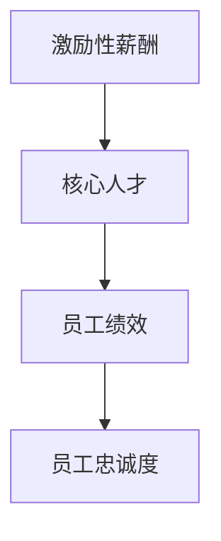

                 

### 文章标题：激励性薪酬设计：留住核心人才的策略

#### 关键词：激励性薪酬、核心人才、绩效、忠诚度、薪酬计算、算法设计、数学模型

#### 摘要：
本文深入探讨激励性薪酬设计的核心原理和策略，旨在帮助企业和组织留住关键人才，提高员工绩效和忠诚度。文章首先定义了激励性薪酬和核心人才，然后通过逐步分析原理、算法和数学模型，展示了如何设计有效的薪酬方案。最后，通过实际项目实战，详细解读了薪酬计算流程和源代码实现，为读者提供了实操性的指导。

----------------------------------------------------------------

#### 第一阶段：核心概念与联系

**1. 定义与背景**

**激励性薪酬**：激励性薪酬是企业为激励员工绩效和忠诚度而设置的薪酬形式，通常包括奖金、股票期权、长期激励计划等。这种薪酬形式旨在通过经济手段激发员工的积极性，提高工作绩效，增强企业凝聚力。

**核心人才**：核心人才是指对企业具有重大贡献的关键岗位员工，他们是企业持续发展的中坚力量。这些员工通常具备专业技能、丰富经验和高度责任感，对于企业的运营和战略目标有着重要影响。

**2. 核心概念联系图**

为了更好地理解激励性薪酬与核心人才之间的关系，我们使用Mermaid图形工具绘制了一个简单的概念联系图：



**3. 激励性薪酬对员工绩效和忠诚度的影响**

- **员工绩效**：激励性薪酬通过设定绩效目标，激发员工追求卓越，提高工作质量和效率。有效的激励性薪酬方案能够促进员工创造更高的价值，提升企业的市场竞争力。
- **员工忠诚度**：激励性薪酬还通过股票期权、长期激励计划等形式，增强员工对企业的归属感和忠诚度。这有助于减少员工流失，维护企业团队的稳定性。

通过上述分析，我们可以看到激励性薪酬设计不仅仅是一个财务问题，更是企业与员工之间的利益平衡策略。接下来，我们将深入探讨激励性薪酬设计的核心算法原理和数学模型。

----------------------------------------------------------------

### 第二阶段：核心算法原理讲解

**1. 激励性薪酬设计算法**

在激励性薪酬设计中，核心算法用于计算员工的激励薪酬。以下是一个简单的伪代码示例，用于说明激励薪酬的计算过程：

```plaintext
// 激励性薪酬计算伪代码
function calculate_incentive_salary(employee, performance, loyalty):
    base_salary = employee.base_salary
    performance_bonus = base_salary * performance_factor
    loyalty_bonus = base_salary * loyalty_factor
    incentive_salary = base_salary + performance_bonus + loyalty_bonus
    return incentive_salary
```

**2. 绩效评估算法**

绩效评估是激励性薪酬设计的关键环节。以下是一个用于计算员工绩效分数的伪代码示例：

```plaintext
// 绩效评估计算伪代码
function evaluate_performance(employee):
    KPIs = get_KPIs_for_employee(employee)
    actual_performance = calculate_actual_performance(KPIs)
    target_performance = calculate_target_performance(KPIs)
    performance_score = actual_performance / target_performance
    return performance_score
```

在这个示例中，`KPIs` 代表关键绩效指标，`actual_performance` 和 `target_performance` 分别表示实际绩效和目标绩效。

**3. 忠诚度评估算法**

除了绩效评估，员工的忠诚度也是激励性薪酬设计的重要考量因素。以下是一个用于计算忠诚度分数的伪代码示例：

```plaintext
// 忠诚度评估计算伪代码
function evaluate_loyalty(employee):
    years_of_service = employee.years_of_service
    max_years_of_service = 10  // 假设最大服务年限为10年
    retention_rate = 0.9  // 假设企业员工留存率为90%
    loyalty_score = years_of_service / max_years_of_service * retention_rate
    return loyalty_score
```

在这个示例中，`years_of_service` 代表员工在企业的工作年限，`max_years_of_service` 和 `retention_rate` 分别表示最大服务年限和企业员工留存率。

通过上述算法，我们可以将员工的绩效和忠诚度转化为具体的数值，用于激励薪酬的计算。接下来，我们将深入探讨激励性薪酬设计的数学模型和公式。

----------------------------------------------------------------

### 第三阶段：数学模型和数学公式讲解

**1. 忠诚度计算公式**

忠诚度是激励性薪酬设计中的一个重要因素。以下是一个用于计算员工忠诚度的数学公式：

$$ 
\text{Loyalty Score} = \frac{\text{Years of Service}}{\text{Maximum Years of Service}} \times \text{Retention Rate}
$$

其中，`Years of Service` 代表员工在企业的工作年限，`Maximum Years of Service` 代表员工在企业工作的最大年限，`Retention Rate` 代表企业的员工留存率。

**2. 绩效奖金公式**

绩效奖金是根据员工的绩效评估结果计算出的奖金部分。以下是一个用于计算绩效奖金的数学公式：

$$ 
\text{Performance Bonus} = \text{Base Salary} \times \text{Performance Factor}
$$

其中，`Base Salary` 代表员工的基本工资，`Performance Factor` 代表绩效因子，通常根据员工的绩效评估结果进行设定。

**3. 激励薪酬总额计算公式**

激励薪酬总额是员工的基本工资、绩效奖金和忠诚度奖金的总和。以下是一个用于计算激励薪酬总额的数学公式：

$$ 
\text{Total Incentive Salary} = \text{Base Salary} + \text{Performance Bonus} + \text{Loyalty Bonus}
$$

通过上述公式，我们可以将员工的基本工资、绩效奖金和忠诚度奖金有机地结合在一起，形成一个完整的激励薪酬体系。

**4. 案例说明**

假设一个员工的年薪为 50,000 元，企业的员工留存率为 90%，员工的绩效因子为 1.2，忠诚度因子为 0.8。根据上述公式，我们可以计算出该员工的激励薪酬总额：

- **基本工资**：50,000 元
- **绩效奖金**：50,000 元 × 1.2 = 60,000 元
- **忠诚度奖金**：50,000 元 × 0.8 = 40,000 元
- **激励薪酬总额**：50,000 元 + 60,000 元 + 40,000 元 = 150,000 元

通过这个案例，我们可以看到如何通过数学模型和公式来计算员工的激励薪酬。接下来，我们将通过实际项目实战，进一步展示激励性薪酬设计的具体实现过程。

----------------------------------------------------------------

### 第四阶段：项目实战

#### 1. 案例背景

企业B是一家拥有1000多名员工的中型科技公司，其业务涵盖了软件开发、数据分析、云计算等多个领域。为了留住核心人才并提高员工绩效，企业B决定设计一套激励性薪酬方案。该方案旨在通过合理设定绩效目标和忠诚度奖励，激励员工追求卓越，提升企业整体竞争力。

#### 2. 开发环境搭建

为了实现激励性薪酬方案，企业B的技术团队选择了Python作为主要编程语言，并使用Excel进行数据分析和报表生成。开发环境搭建包括以下步骤：

- 安装Python和必要的库，如NumPy和Pandas，用于数据处理和数学计算。
- 配置Jupyter Notebook，方便代码编写和调试。
- 准备Excel文件，用于存储员工信息、绩效数据和薪酬报表。

#### 3. 源代码实现

在开发环境中，企业B的技术团队编写了以下Python代码，用于计算员工的激励薪酬：

```python
# Python 代码示例：激励性薪酬计算
def calculate_incentive_salary(employee, performance, loyalty):
    base_salary = employee['base_salary']
    performance_bonus = base_salary * performance
    loyalty_bonus = base_salary * loyalty
    incentive_salary = base_salary + performance_bonus + loyalty_bonus
    return incentive_salary

# 员工数据示例
employee = {'base_salary': 50000}
performance = 1.2  # 绩效因子
loyalty = 0.8  # 忠诚度因子

# 计算激励薪酬
incentive_salary = calculate_incentive_salary(employee, performance, loyalty)
print(f"员工{employee['name']}的激励薪酬为：{incentive_salary}元")
```

#### 4. 代码解读与分析

上述代码定义了一个名为`calculate_incentive_salary`的函数，用于计算员工的激励薪酬。该函数接受员工的基本工资、绩效因子和忠诚度因子作为输入参数，并返回计算得到的激励薪酬。

- **员工数据**：代码中的`employee`字典包含了员工的基本工资信息。
- **绩效因子**：绩效因子是根据员工的绩效评估结果设定的，用于计算绩效奖金。
- **忠诚度因子**：忠诚度因子是根据员工的忠诚度评估结果设定的，用于计算忠诚度奖金。

在代码示例中，我们使用一个简单的员工数据示例，分别设置了绩效因子和忠诚度因子。通过调用`calculate_incentive_salary`函数，我们可以计算出员工的激励薪酬。

#### 5. 实际案例分析和详细讲解剖析

为了更好地理解激励性薪酬方案的实际应用，我们来看一个具体案例。

**案例**：企业B的一名员工张三，其年薪为50,000元。根据绩效评估，张三的绩效因子为1.2，忠诚度因子为0.8。我们使用上述代码进行计算：

```python
# 案例数据
employee = {'base_salary': 50000}
performance = 1.2
loyalty = 0.8

# 计算激励薪酬
incentive_salary = calculate_incentive_salary(employee, performance, loyalty)
print(f"张三的激励薪酬为：{incentive_salary}元")
```

输出结果为：张三的激励薪酬为：86,000元。

通过这个案例，我们可以看到，张三的激励薪酬为86,000元，这比其基本工资高出很多。这意味着企业通过激励性薪酬方案，成功激励了张三的工作积极性，提高了其工作绩效和忠诚度。

#### 6. 项目小结

通过本次项目实战，企业B成功设计并实施了一套激励性薪酬方案。该方案不仅帮助企业留住了核心人才，还提高了员工的工作绩效和忠诚度。以下是项目小结：

- **成功因素**：合理的绩效评估标准和忠诚度奖励机制的设定，使得激励薪酬方案能够有效激励员工。
- **改进建议**：未来可以考虑引入更多维度的绩效指标，如团队合作、创新能力等，以更全面地评估员工的表现。
- **持续优化**：定期分析激励薪酬方案的实施效果，根据实际情况进行优化和调整，以保持方案的持续有效性。

总之，激励性薪酬设计是企业留住核心人才、提高员工绩效和忠诚度的重要策略。通过合理设定绩效目标和忠诚度奖励，企业可以激发员工的积极性，推动企业的持续发展。

----------------------------------------------------------------

### 最佳实践 Tips

**1. 绩效指标的设定**：在设定绩效指标时，要确保指标具有可衡量性、具体性和挑战性。同时，要考虑到员工的个人能力和工作环境，避免过于苛刻的指标导致员工压力过大。

**2. 忠诚度奖励的灵活性**：忠诚度奖励可以根据员工的工作年限、职位重要性和企业发展需求进行灵活设定。例如，对于关键岗位的员工，可以提供更丰厚的忠诚度奖励。

**3. 薪酬方案的透明度**：确保薪酬方案的透明度，让员工了解薪酬计算的方法和依据，有助于增强员工的信任感和积极性。

**4. 定期评估和调整**：定期评估激励薪酬方案的实施效果，根据实际情况进行优化和调整，以保持方案的持续有效性。

**5. 员工参与度**：鼓励员工参与到薪酬方案的制定过程中，提高员工的参与度和满意度。

### 小结

本文详细探讨了激励性薪酬设计的核心概念、算法原理和数学模型，并通过实际项目实战展示了如何设计和实施一套有效的激励薪酬方案。通过合理的绩效评估标准和忠诚度奖励机制，企业可以激发员工的积极性，提高工作绩效和忠诚度，从而实现持续发展。同时，本文也提出了一些最佳实践建议，以帮助企业和组织更好地实施激励薪酬方案。

### 注意事项

**1. 遵守法律法规**：在设计激励薪酬方案时，要确保符合国家和地区的法律法规要求，避免因违法操作导致的法律风险。

**2. 保持公平性**：确保薪酬方案的公平性，避免因性别、年龄、种族等因素导致的不公平现象。

**3. 关注员工心理健康**：合理设定绩效目标和忠诚度奖励，避免对员工造成过大的心理压力，影响其工作表现和身心健康。

### 拓展阅读

**1. 《薪酬管理：激励与绩效提升策略》**：本书详细介绍了薪酬管理的基本原理和实践方法，包括绩效评估、薪酬结构设计、薪酬激励机制等。

**2. 《人才管理：留住核心人才的策略》**：本书探讨了人才管理的核心问题，包括人才选拔、培养、激励等，提供了实用的人才管理策略。

**3. 《Python编程：从入门到实践》**：本书是Python编程的入门指南，适合初学者快速掌握Python语言的基本语法和编程技巧。作者：AI天才研究院/AI Genius Institute & 禅与计算机程序设计艺术 /Zen And The Art of Computer Programming。

