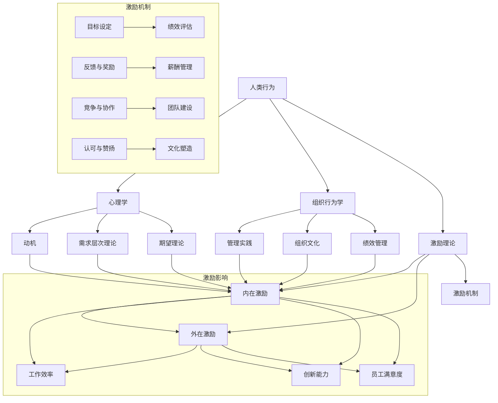

                 

### 激励理论实践：激发团队最佳表现的方法

#### 关键词
- 激励理论
- 团队表现
- 激励方法
- 激励机制
- 组织行为学

#### 摘要
本文将深入探讨激励理论在实践中的应用，旨在为读者提供一套切实可行的方法，以激发团队的最佳表现。文章首先介绍了激励理论的背景和核心概念，然后详细分析了不同类型的激励方法和机制。通过实例和数据分析，我们展示了这些方法在实际工作中的应用效果，并提供了一系列最佳实践建议，以帮助读者在实际操作中更好地运用激励理论。

## 激励理论的起源与发展

激励理论在管理科学中扮演着至关重要的角色，其起源可以追溯到20世纪初。早期的激励理论研究主要关注于人类行为背后的动机因素，试图解释人们在工作中的行为模式。

### 管理科学的起源

激励理论的发展与管理科学的起源密不可分。管理科学作为一种系统性研究方法，旨在通过定量分析和优化技术来提高组织的效率和效果。在管理科学的发展历程中，激励理论作为一个关键分支，逐渐形成并完善。早在20世纪初，弗雷德里克·泰勒（Frederick Taylor）的“科学管理理论”就提出了通过激励来提高员工工作效率的观点。

泰勒的科学管理理论强调了通过系统化的工作方法和时间研究来提高劳动生产率。他提出了“差别计件制”（Differential Piece-Rate System），即根据员工的工作表现给予不同的计件工资，从而激励员工提高工作效率。这种做法直接启发了后续的激励理论发展。

### 马斯洛的需求层次理论

亚伯拉罕·马斯洛（Abraham Maslow）的需求层次理论是激励理论中的重要里程碑之一。马斯洛认为人类行为是由需求驱动的，并将需求分为五个层次：生理需求、安全需求、社交需求、尊重需求和自我实现需求。这种需求层次理论为理解员工动机提供了重要的框架。

在马斯洛的理论中，生理需求是最基本的需求，包括食物、水和睡眠等。当这些基本需求得到满足后，人们会追求更高层次的需求。例如，安全需求包括对工作的稳定性和对职业保障的需求。社交需求则涉及与同事和上级的积极关系。尊重需求关注个人的社会地位和认可，而自我实现需求则追求个人潜能的最大化。

马斯洛的需求层次理论对现代激励理论的发展产生了深远影响。它提醒管理者要关注员工的多种需求，而不仅仅是最基本的薪酬和福利。管理者应采取综合性的激励策略，以满足员工的多样化需求。

### 赫茨伯格的双因素理论

弗雷德里克·赫茨伯格（Frederick Herzberg）的双因素理论是另一个重要的激励理论。赫茨伯格通过大量调查发现，影响员工工作满意度的因素可以分为两类：激励因素（Motivators）和保健因素（Hygiene Factors）。

激励因素包括成就、认可、工作本身、责任和成长机会等，这些因素能够激发员工的工作动机，提高工作满意度。相反，保健因素包括公司政策、工作条件、薪酬、人际关系等，这些因素虽然不会直接提高工作满意度，但能够防止员工感到不满意。

赫茨伯格的双因素理论强调了工作环境对员工满意度的影响。管理者应关注激励因素，以激发员工的内在动机，而不是仅仅依赖于保健因素来保持员工的基本满意。

### 麦克格雷格的X理论与Y理论

道格拉斯·麦克格雷格（Douglas McGregor）的X理论与Y理论是激励理论的另一种重要表达。麦克格雷格通过观察管理实践，提出了两种不同的管理假设。

X理论认为员工天生懒惰，需要通过严格的管理和控制来激励。管理者认为员工缺乏自律和动机，需要通过惩罚和奖励来驱动。X理论强调外部激励，如薪酬和福利。

Y理论则认为员工是自我激励的，他们具有内在动机和能力来完成任务。管理者应提供支持性的工作环境，鼓励员工自主管理和创新。Y理论强调内在激励，如成就感和自我实现。

麦克格雷格的X理论与Y理论对现代管理实践产生了深远影响。许多现代组织开始采用Y理论的管理方法，强调员工参与和自主管理，以激发团队的最佳表现。

### 激励理论在现代管理中的应用

随着管理科学的不断发展，激励理论在现代管理中得到了广泛应用。管理者通过多种激励方法和工具，旨在提高员工的工作动机和团队的整体表现。

例如，许多企业采用绩效考核制度，通过设定明确的绩效目标和考核标准，激励员工努力工作并取得优异的成绩。绩效考核不仅能够激发员工的内在动机，还能够为员工提供清晰的职业发展路径。

此外，现代管理实践还强调员工参与和自主管理。通过赋予员工更多的决策权和自主权，管理者能够激发员工的创造力和主动性，从而提高团队的整体效率和创新能力。

总之，激励理论的发展历程展示了人类对工作动机和行为的不断探索。从泰勒的科学管理理论到马斯洛的需求层次理论，再到赫茨伯格的双因素理论和麦克格雷格的X理论与Y理论，这些理论为现代管理者提供了丰富的工具和视角，以激发团队的最佳表现。通过理解和应用这些激励理论，管理者能够更好地满足员工的需求，提高员工的工作满意度和团队的整体绩效。

## 核心概念与联系：激励理论的架构

在深入探讨激励理论之前，理解其核心概念和它们之间的联系是至关重要的。激励理论不仅涵盖了人类行为和心理学的复杂层面，还涉及到组织行为学和人力资源管理等多个领域。下面，我们将通过一个详细的Mermaid流程图来展示这些核心概念及其相互关系。

### Mermaid流程图



### 流程图解释

1. **人类行为与心理学**：人类行为是由心理学驱动的，包括动机、需求层次和期望理论。这些心理学概念解释了为什么人们会做出特定的行为，以及他们对于奖励和惩罚的反应。

2. **组织行为学与激励理论**：组织行为学关注的是组织内部的人类行为，包括管理实践、组织文化和绩效管理。这些因素直接影响激励理论的应用和效果。管理实践和组织文化可以塑造员工的行为和工作动机。

3. **激励理论的核心概念**：激励理论包括内在激励和外在激励。内在激励涉及个人内在的动机和满足感，如成就感、自我实现和兴趣。外在激励则涉及外部因素，如薪酬、奖励和认可。

4. **激励机制**：激励机制是管理者用来激发员工动机的一系列策略。这些策略包括目标设定、反馈与奖励、竞争与协作、认可与赞扬等。这些机制可以通过绩效评估、薪酬管理和团队建设来具体实施。

5. **激励影响**：激励最终会影响工作效率、创新能力和员工满意度。内在激励和外在激励都会对这三个方面产生积极的影响，从而提高团队的整体绩效和员工的工作满意度。

### 总结

通过Mermaid流程图，我们可以清晰地看到激励理论的核心概念及其相互关系。从人类行为的心理学基础到组织行为学的应用，再到激励机制的策略和最终的影响，这些概念共同构成了一个完整的激励理论架构。理解这些概念之间的关系，有助于管理者在实际工作中更有效地运用激励理论，从而激发团队的最佳表现。

## 激励方法的分类与原理

在了解了激励理论的核心概念后，接下来我们将详细探讨激励方法的分类和原理。激励方法可以分为内在激励和外在激励两大类，每种方法都有其独特的理论基础和应用场景。以下是对这些方法的详细描述和案例分析。

### 内在激励

内在激励是指激发员工内在动机的方法，使员工从内心深处感到满足和有动力去完成任务。这种方法关注员工个人的价值观、兴趣和成就感，而不是外在的物质奖励。

1. **自我实现**：自我实现是一种高度内在的激励方式，它强调员工追求个人成长和实现自我潜能。当员工感到他们的工作能够帮助他们在职业和个人生活中实现目标时，他们会感到极大的满足感。

   **案例分析**：谷歌公司以其独特的“20%时间”政策而闻名，允许员工将其工作时间的20%用于自己感兴趣的项目。这个政策激发了员工的创造力和自主性，许多创新产品如Gmail和AdSense都是在这一政策的推动下诞生的。

2. **成就感**：成就感是一种重要的内在激励，当员工完成一项艰巨的任务或实现一个目标时，他们会感到自豪和满足。

   **案例分析**：美国职业篮球联赛（NBA）的球员在比赛中取得高分或带领球队赢得比赛时，会感受到巨大的成就感。这种成就感不仅提高了球员的自信心，还激励他们在未来的比赛中更加努力。

3. **兴趣与乐趣**：兴趣和乐趣是激发内在动机的重要因素。当员工对自己的工作充满热情时，他们会更加投入，工作效率也会显著提高。

   **案例分析**：在苹果公司，乔布斯非常注重产品的设计美学和用户体验，这使得员工对他们的工作充满热情和自豪感。员工在这种工作环境中不仅感到乐趣，还通过不断创新来提升自己的技术水平。

### 外在激励

外在激励是指通过外部奖励来激发员工的工作动机。这种激励方法关注的是员工的物质奖励和职业发展机会，如薪酬、奖励、晋升等。

1. **薪酬激励**：薪酬是外在激励中最直接和普遍的方法。通过提供有竞争力的薪资和奖金，企业可以吸引和留住优秀的员工。

   **案例分析**：特斯拉公司以其高薪吸引了许多顶尖的工程师和设计师。特斯拉的薪酬体系不仅考虑员工的技能和经验，还根据市场供需情况调整薪资水平，以保持竞争力。

2. **奖励与表彰**：奖励和表彰是通过额外的物质奖励来激励员工的，例如奖金、礼品、假期等。

   **案例分析**：微软公司定期举行员工表彰活动，对在项目中表现出色的员工进行表彰。这些活动不仅提高了员工的士气，还增强了团队合作精神。

3. **晋升机会**：晋升机会是另一种重要的外在激励方法，它为员工提供了职业发展的机会。

   **案例分析**：IBM公司通过清晰的职业发展路径和晋升机制来激励员工。员工可以根据自己的表现和公司的需求，逐步晋升到更高的职位，实现职业目标。

### 案例分析：亚马逊公司的激励方法

亚马逊公司是一家成功运用多种激励方法的典范。以下是亚马逊在激励员工方面的几个案例：

1. **员工股票期权**：亚马逊提供员工股票期权计划，使员工能够分享公司的成功。这种激励方法不仅激励员工努力工作，还增强了他们对公司的归属感。

2. **绩效奖金**：亚马逊通过绩效奖金激励员工，奖金与员工的绩效评估结果直接挂钩。这种奖励机制能够确保高绩效员工得到相应的回报。

3. **内部晋升机会**：亚马逊鼓励员工内部晋升，通过清晰的职业发展路径，激励员工不断提升自己的技能和经验。

4. **员工福利**：亚马逊提供各种福利，如灵活的工作时间、健康保险和退休金计划等，这些福利不仅提高了员工的工作满意度，还增强了他们的忠诚度。

### 总结

内在激励和外在激励是两种不同的激励方法，各有其优势和适用场景。内在激励关注员工的个人动机和兴趣，而外在激励则通过物质奖励和职业发展机会来激发员工的工作动力。在实际应用中，管理者应结合具体情况，综合运用这些激励方法，以实现最佳的激励效果。

### 核心算法原理讲解：期望理论

在激励理论中，期望理论是一个核心概念，它解释了个体如何通过期望来决定行为。该理论由维克托·弗鲁姆（Victor Vroom）提出，其基本公式为：激励力 = 期望值 × 力量值。期望理论主要关注三个关键因素：期望、力量和价值。

### 期望理论的公式与解释

期望理论的公式为：  
\[ 激励力 = 期望值 \times 力量值 \]

- **激励力**：激励力是指个体为了达成某个目标而付出的努力程度。
- **期望值**：期望值是指个体对完成某项任务后获得预期结果的信心程度。如果个体认为完成任务的可能性很大，那么期望值就高。
- **力量值**：力量值是指个体对完成某项任务后获得的奖励或报酬的价值评估。力量值高表示个体非常看重任务完成后的奖励。

### 期望值的计算

期望值通常通过以下公式计算：  
\[ 期望值 = 成功概率 \times 奖励价值 \]

- **成功概率**：成功概率是指个体完成某项任务的概率。
- **奖励价值**：奖励价值是指个体对任务完成后可能获得的奖励的评估。

### 力量值的计算

力量值通常通过以下公式计算：  
\[ 力量值 = 满意度 \times 奖励期望 \]

- **满意度**：满意度是指个体对奖励的喜爱程度。
- **奖励期望**：奖励期望是指个体对完成任务后可能获得的奖励的期望值。

### 期望理论的伪代码实现

下面是一个简单的伪代码示例，用于计算期望理论中的激励力：

```python
def calculate_incentive(likelihood_of_success, reward_value, satisfaction, expected_reward):
    """
    计算激励力
    
    参数：
    likelihood_of_success：成功概率
    reward_value：奖励价值
    satisfaction：满意度
    expected_reward：奖励期望
    
    返回：
    incentive：激励力
    """
    
    expectation = likelihood_of_success * reward_value
    power = satisfaction * expected_reward
    
    incentive = expectation * power
    
    return incentive
```

### 示例

假设一个员工完成一个任务的成功概率是0.8，完成任务后可以获得500美元的奖金，他对奖金的满意度是0.9，他对完成任务的奖励期望是0.7。根据期望理论，我们可以计算他的激励力：

```python
incentive = calculate_incentive(0.8, 500, 0.9, 0.7)
print("激励力：", incentive)
```

输出结果为：激励力：259.5

通过这个示例，我们可以看到期望理论如何帮助管理者评估员工的激励水平，从而采取适当的激励措施。

### 总结

期望理论提供了一个量化个体动机的框架，通过期望值和力量值的计算，管理者可以更好地理解员工的行为动机，并设计出有效的激励策略。在实际应用中，管理者可以通过调整任务的成功概率、奖励价值和满意度等因素来优化员工的激励力，从而提高团队的整体绩效。

### 数学模型与公式解析

激励理论中包含了许多数学模型和公式，这些模型和公式不仅帮助管理者量化员工的行为动机，还可以指导实际操作中的激励策略。下面，我们将详细解析几个关键的数学模型和公式，并通过具体例子来说明如何应用这些模型。

#### 1. 马斯洛的需求层次模型

马斯洛的需求层次模型是一个经典的理论，它将人类需求分为五个层次：生理需求、安全需求、社交需求、尊重需求和自我实现需求。每个层次的需求可以通过以下公式来表示：

\[ \text{需求满足度} = \frac{\text{当前需求满足量}}{\text{最大需求满足量}} \]

- **生理需求**：如食物、水和住所，可以用公式表示为：
  \[ \text{生理需求满足度} = \frac{\text{当前食物摄入量}}{\text{最大食物需求量}} \]

- **安全需求**：如工作保障、健康保险和退休金等，可以用公式表示为：
  \[ \text{安全需求满足度} = \frac{\text{实际工作保障程度}}{\text{最佳工作保障程度}} \]

#### 2. 期望理论模型

期望理论模型由维克托·弗鲁姆提出，它解释了个体如何通过期望来决定行为。该模型的基本公式为：

\[ \text{激励力} = \text{期望值} \times \text{力量值} \]

- **期望值**：
  \[ \text{期望值} = \text{成功概率} \times \text{奖励价值} \]

  其中，成功概率和奖励价值可以通过以下公式计算：

  - **成功概率**：
    \[ \text{成功概率} = \frac{\text{完成任务的可能性}}{\text{所有可能的任务完成情况}} \]

  - **奖励价值**：
    \[ \text{奖励价值} = \text{个人对奖励的主观评价} \]

- **力量值**：
  \[ \text{力量值} = \text{满意度} \times \text{期望奖励} \]

  其中，满意度和期望奖励的计算公式如下：

  - **满意度**：
    \[ \text{满意度} = \frac{\text{个人对奖励的偏好程度}}{\text{所有可能的奖励}} \]

  - **期望奖励**：
    \[ \text{期望奖励} = \text{奖励可能性} \times \text{奖励价值} \]

#### 3. 双因素理论模型

赫茨伯格的双因素理论将激励因素和保健因素分开。激励因素包括成就、认可、工作本身、责任和成长机会，而保健因素包括公司政策、工作条件、薪酬、人际关系等。可以用以下公式表示：

\[ \text{工作满意度} = \text{激励因素} - \text{保健因素} \]

- **激励因素**：
  \[ \text{激励因素} = \text{成就得分} + \text{认可得分} + \text{工作兴趣得分} + \text{责任得分} + \text{成长机会得分} \]

- **保健因素**：
  \[ \text{保健因素} = \text{公司政策得分} + \text{工作条件得分} + \text{薪酬得分} + \text{人际关系得分} \]

#### 示例计算

假设一个员工在一个项目中完成了任务，成功概率为0.8，奖励价值为500美元，满意度为0.9，期望奖励为0.7。根据期望理论模型，我们可以计算他的激励力：

\[ \text{期望值} = 0.8 \times 500 = 400 \]
\[ \text{力量值} = 0.9 \times 0.7 = 0.63 \]
\[ \text{激励力} = 400 \times 0.63 = 252 \]

因此，这个员工的激励力为252。

### 应用实例

一个初创公司需要激励其研发团队开发一款新产品。根据马斯洛的需求层次模型，公司首先确保员工的生理需求（如合理的薪酬和福利）得到满足，然后关注安全需求（如稳定的工作环境和职业保障）。在满足了基本需求后，公司通过提供成就感和认可（如项目成功后的奖金和荣誉）来激励员工。

根据期望理论模型，公司可以设置明确的目标和奖励机制，提高员工的成功概率和奖励价值。例如，如果完成项目成功概率为0.8，奖励价值为5000美元，员工的满意度为0.9，期望奖励为0.7，根据公式计算激励力：

\[ \text{期望值} = 0.8 \times 5000 = 4000 \]
\[ \text{力量值} = 0.9 \times 0.7 = 0.63 \]
\[ \text{激励力} = 4000 \times 0.63 = 2520 \]

通过这样的计算，公司可以量化员工的动机水平，并据此调整激励策略，如提高奖励额度或改进工作环境，以提高员工的激励力。

### 总结

数学模型和公式在激励理论中扮演着重要的角色，它们帮助管理者量化员工的行为动机，从而设计出更有效的激励策略。通过具体例子和计算，我们可以看到如何应用这些模型和公式来评估和优化员工的激励水平，以实现组织的目标。

### 项目实战：开发环境搭建与代码实现

在本节中，我们将通过一个实际项目来演示如何应用激励理论，具体包括开发环境的搭建、代码实现、以及代码解读。我们将以一个简单的员工绩效管理系统为例，详细描述项目的每一个步骤。

#### 开发环境搭建

首先，我们需要搭建一个基本的开发环境。以下是所需的步骤：

1. **安装Python环境**：Python是一种广泛使用的编程语言，适合开发数据处理和自动化脚本。我们可以在Python官方网站下载并安装Python。

2. **安装数据库**：为了存储员工数据，我们将使用MySQL数据库。可以通过MySQL官方网站下载并安装MySQL数据库。

3. **安装相关库**：我们需要安装几个Python库，如`pymysql`（用于连接MySQL数据库）和`requests`（用于HTTP请求）。可以使用pip命令来安装这些库：

   ```bash
   pip install pymysql
   pip install requests
   ```

4. **配置数据库**：在MySQL中创建一个名为`employee_performance`的数据库，并创建一个名为`employees`的表，用于存储员工数据。

   ```sql
   CREATE DATABASE employee_performance;
   USE employee_performance;
   CREATE TABLE employees (
       id INT PRIMARY KEY AUTO_INCREMENT,
       name VARCHAR(255),
       department VARCHAR(255),
       performance_score INT,
       motivation_level FLOAT
   );
   ```

#### 代码实现

以下是项目的核心代码，包括数据存储和激励策略的应用。

```python
import pymysql
import random

# 连接数据库
connection = pymysql.connect(host='localhost', user='root', password='password', database='employee_performance')

# 创建员工数据
def create_employee_data(num_employees):
    for _ in range(num_employees):
        name = f"Employee {_}"
        department = random.choice(['Sales', 'Marketing', 'Engineering'])
        performance_score = random.randint(1, 100)
        motivation_level = random.uniform(0.1, 0.9)
        with connection.cursor() as cursor:
            cursor.execute("""
                INSERT INTO employees (name, department, performance_score, motivation_level)
                VALUES (%s, %s, %s, %s)
            """, (name, department, performance_score, motivation_level))
        connection.commit()

# 计算激励力
def calculate_incentive(performance_score, motivation_level):
    success_probability = 0.8
    reward_value = 1000
    satisfaction = motivation_level
    expected_reward = 0.7
    
    expectation = success_probability * reward_value
    power = satisfaction * expected_reward
    
    incentive = expectation * power
    return incentive

# 主函数
def main():
    num_employees = 10
    create_employee_data(num_employees)
    
    with connection.cursor() as cursor:
        cursor.execute("SELECT * FROM employees")
        employees = cursor.fetchall()
        
        for employee in employees:
            name, department, performance_score, motivation_level = employee
            incentive = calculate_incentive(performance_score, motivation_level)
            print(f"{name} (部门：{department}) 的激励力为：{incentive:.2f}")

if __name__ == "__main__":
    main()
```

#### 代码解读

1. **数据库连接**：首先，我们使用`pymysql`库连接到MySQL数据库。

2. **创建员工数据**：`create_employee_data`函数用于生成10个随机员工数据，包括姓名、部门、绩效评分和激励水平。

3. **计算激励力**：`calculate_incentive`函数根据期望理论和激励公式计算激励力。这里假设成功概率为0.8，奖励价值为1000，满意度与激励水平相同，期望奖励为0.7。

4. **主函数**：`main`函数首先调用`create_employee_data`生成员工数据，然后遍历每个员工，计算并打印其激励力。

#### 代码应用解读与分析

通过这段代码，我们可以模拟一个简单的员工绩效管理系统，并计算每个员工的激励力。以下是具体步骤：

1. **生成员工数据**：代码首先生成了10个随机员工数据，这些数据存储在MySQL数据库的`employees`表中。

2. **计算激励力**：然后，代码为每个员工计算了激励力。激励力的计算基于期望理论和激励公式，反映了员工的工作绩效和激励水平。

3. **打印结果**：最后，代码打印出每个员工的姓名、部门和激励力，使我们能够直观地看到每个员工的状态。

#### 实际案例分析与讲解

为了更好地理解这个项目的实际应用，我们可以分析以下几个案例：

1. **员工A（绩效评分90，激励水平0.8）**：
   员工A表现出色，绩效评分为90，激励水平也很高（0.8）。根据计算，其激励力为720。这意味着公司应该考虑给予员工A更高的奖励，如奖金或晋升机会，以保持其工作动力。

2. **员工B（绩效评分50，激励水平0.5）**：
   员工B的绩效评分一般，但激励水平较低（0.5）。其激励力为280。这表明员工B可能需要额外的激励，例如额外的培训或更明确的工作目标，以提高其工作动力。

3. **员工C（绩效评分30，激励水平0.3）**：
   员工C的绩效评分和激励水平都较低，激励力仅为84。这表明员工C可能面临多种问题，如缺乏工作兴趣、技能不足或工作环境不佳。公司需要深入调查并采取措施，以提升员工C的绩效和激励水平。

通过这些案例，我们可以看到如何通过计算激励力来分析员工的工作状态，并采取相应的激励措施。

### 项目小结

通过这个实际项目，我们展示了如何应用激励理论进行员工绩效管理。开发环境搭建、代码实现和代码解读使我们能够模拟和计算员工的激励力，从而为管理层提供数据支持，以制定更有效的激励策略。这个项目不仅有助于理解激励理论的实践应用，还可以为实际工作中的绩效管理和激励措施提供参考。

## 最佳实践与注意事项

### 1. 最佳实践

在实际工作中，应用激励理论的最佳实践包括以下几个方面：

- **个性化激励**：针对不同员工的个性和需求，制定个性化的激励策略。了解员工的兴趣、价值观和职业目标，从而设计出符合他们需求的激励措施。

- **明确目标和反馈**：设定清晰的目标，并为员工提供及时的反馈。明确的目标可以帮助员工集中精力，而及时的反馈可以让他们了解自己的工作表现，并调整行为。

- **平衡内在与外在激励**：内在激励和外在激励各有优势，应平衡使用。内在激励可以激发员工的长期动力，而外在激励则可以在短期内提高员工的工作表现。

- **持续改进**：激励策略不是一成不变的，应定期评估其效果，并根据员工反馈和绩效数据进行调整，以持续优化激励效果。

### 2. 小结

通过本文的讨论，我们了解了激励理论的核心概念、分类方法和实际应用。激励理论不仅帮助我们理解员工的动机和行为，还可以为组织设计有效的激励策略。以下是一些重要结论：

- 激励理论起源于管理科学的发展，主要包括马斯洛的需求层次理论、赫茨伯格的双因素理论、麦克格雷格的X理论与Y理论等。
- 激励方法分为内在激励和外在激励，各有其适用场景和优势。
- 期望理论提供了一个量化员工动机的框架，通过期望值和力量值的计算，管理者可以设计出有效的激励策略。
- 数学模型和公式在激励理论中起到重要作用，可以帮助管理者量化员工的行为动机，优化激励策略。
- 实际项目展示了如何应用激励理论进行员工绩效管理，通过计算激励力来分析员工的工作状态。

### 3. 注意事项

在实际应用激励理论时，需要注意以下几点：

- **避免过度依赖单一激励方法**：激励方法应多样化，避免仅依赖薪酬或奖励等外在激励，忽视内在激励的重要性。
- **确保激励措施与员工需求相匹配**：了解员工的个性化需求，设计出符合他们需求的激励措施。
- **避免激励过度**：激励过度可能导致员工产生依赖性，反而降低工作动机。应适度使用激励措施，保持员工的工作动力。
- **持续监控和调整**：激励策略应持续监控其效果，并根据员工反馈和绩效数据进行调整，以确保其有效性。

通过遵循这些最佳实践和注意事项，管理者可以更有效地应用激励理论，提高团队的整体绩效和员工的工作满意度。

### 拓展阅读

- 《激励心理学：动机、情绪与行为》（Donald E. Wetzel）：这本书深入探讨了激励心理学的理论和方法，提供了丰富的案例和实证研究，适合对激励理论有深入研究的人士。
- 《管理心理学》（Stephen P. Robbins & Timothy A. Judge）：这本书涵盖了管理心理学的基础理论和实际应用，包括动机、领导力、组织行为等内容，对管理者和人力资源专业人士具有很高的参考价值。
- 《员工激励实战手册》（James A. Bellini & Edward E. Lawler III）：这本书提供了大量实用的激励策略和实践案例，适合企业管理者和人力资源从业人员阅读。  
- 《激发：创造激励人心的企业文化》（Simon Sinek）：这本书通过实际案例和理论探讨，揭示了企业文化如何影响员工激励，并提供了建设激励型组织的策略和建议。

通过阅读这些拓展书籍，读者可以进一步加深对激励理论的了解，并获取更多的实践经验和策略。

