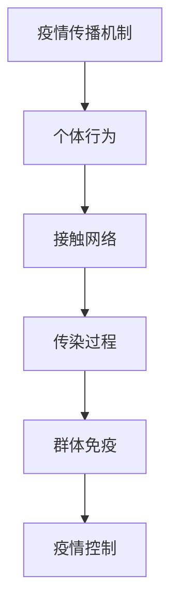

                 

### 文章标题：疫情传播的网络动力学：公共卫生的数学工具

> 关键词：疫情传播、网络动力学、数学模型、公共卫生、防控策略

> 摘要：本文从疫情传播的基本概念出发，详细探讨了疫情传播的网络动力学及其数学模型。通过引入SIRS模型、SEIR模型、主体间动态模型和社会网络模型，对疫情传播的关键因素、网络动力学原理及其应用领域进行了深入分析。此外，本文还介绍了数学工具在疫情防控策略优化中的应用，并结合实际案例进行了剖析。通过本文的探讨，希望能为公共卫生决策和疫情预警防控提供有益的理论参考。

### 目录大纲

1. 引言
   - 疫情传播的紧迫性
   - 公共卫生的重要性
   - 本文的目的和结构

2. 第一部分：核心概念与联系
   - 第1章：疫情传播网络动力学概述
     1.1 疫情传播的基本概念
     1.2 疫情传播的关键因素
     1.3 疫情传播的网络动力学原理
     1.4 疫情传播模型的应用领域
   - 第2章：疫情传播的数学模型
     2.1 微观模型
     2.2 宏观模型
     2.3 耦合模型
   - 第3章：疫情防控策略与数学工具
     3.1 疫情防控策略概述
     3.2 数学工具在疫情防控中的应用
   - 第4章：疫情传播的网络动力学分析
     4.1 网络模型的构建
     4.2 网络动力学分析
     4.3 社会影响分析

3. 第二部分：项目实战与案例分析
   - 第5章：基于网络动力学的疫情预测
   - 第6章：疫情防控策略优化实践
   - 第7章：实际案例分析
   - 第8章：项目小结与展望

4. 结语

### 引言

#### 疫情传播的紧迫性

自2019年底新冠病毒（COVID-19）疫情爆发以来，全球公共卫生系统面临着前所未有的挑战。病毒传播迅速，感染人数和死亡人数持续上升，使得各国政府和公共卫生机构迅速采取了一系列防控措施。然而，疫情的发展却充满了不确定性和复杂性，传统的公共卫生手段已难以应对这种全球性的公共卫生危机。

在这种背景下，疫情传播的网络动力学研究显得尤为重要。通过理解和分析病毒在人群中的传播规律，我们可以更好地预测疫情发展趋势，制定有效的防控策略，降低疫情对公共卫生系统和社会经济的冲击。

#### 公共卫生的重要性

公共卫生是保障人民健康、维护社会稳定的重要基石。它不仅涉及疾病预防和控制，还包括健康促进、环境卫生、营养健康等多个方面。在疫情爆发期间，公共卫生体系的作用尤为突出。通过及时、有效的防控措施，可以减缓疫情传播速度，保护易感人群，减轻医疗系统的压力，为打赢疫情防控战提供有力支持。

然而，疫情的复杂性和全球性的特点，使得传统公共卫生手段面临巨大挑战。这就需要我们借助现代科学技术，特别是数学模型和计算机模拟，对疫情传播进行深入研究，为公共卫生决策提供科学依据。

#### 本文的目的和结构

本文旨在通过探讨疫情传播的网络动力学，为公共卫生决策和疫情预警防控提供有益的理论参考。文章结构如下：

- **第一部分：核心概念与联系**：介绍疫情传播的基本概念、关键因素、网络动力学原理及其应用领域。
- **第二部分：项目实战与案例分析**：通过具体项目案例，展示数学工具在疫情防控中的应用和效果。
- **结语**：总结全文，展望未来疫情传播和网络动力学研究的方向。

接下来，我们将逐步深入探讨疫情传播的网络动力学及其数学模型，希望能为公共卫生领域的研究和实践提供有价值的参考。

### 第一部分：核心概念与联系

#### 第1章：疫情传播网络动力学概述

疫情传播网络动力学是研究病毒在人群中传播规律的学科，它结合了流行病学、网络科学和数学模型等领域的知识，旨在理解和预测疫情的发展趋势，从而为公共卫生决策提供科学依据。本章将介绍疫情传播的基本概念、关键因素、网络动力学原理及其应用领域。

##### 1.1 疫情传播的基本概念

疫情传播是指病毒从一个个体传播到另一个个体的过程。在这个过程中，病毒通过接触、飞沫、空气传播等途径在人群中扩散。了解疫情传播的基本概念是研究网络动力学的基础。

###### 1.1.1 疫情传播模型分类

疫情传播模型可以分为微观模型和宏观模型。

- **微观模型**：这类模型侧重于研究单个个体或小规模群体的传播过程，主要包括病人日历模型、SIRS模型和SEIR模型。

  - **病人日历模型**：该模型通过记录病人从感染到康复的整个过程，分析病毒传播的规律。

  - **SIRS模型**：SIRS模型将人群分为易感者（Susceptible）、感染者（Infectious）和康复者（Removed），通过微分方程描述这三种人群的变化。

  - **SEIR模型**：SEIR模型在SIRS模型的基础上，增加了暴露者（Exposed）这一类人群，更全面地描述病毒传播的过程。

- **宏观模型**：这类模型侧重于研究大规模群体或整个社会的传播过程，主要包括主体间动态模型、社会网络模型和耦合模型。

  - **主体间动态模型**：该模型通过描述个体间的相互作用，分析病毒在社区中的传播规律。

  - **社会网络模型**：该模型将人群看作一个复杂的网络，研究病毒在网络中的传播特性。

  - **耦合模型**：该模型将微观和宏观模型结合起来，综合考虑个体和群体的传播过程。

##### 1.2 疫情传播的关键因素

疫情传播的关键因素包括传播率、感染周期、人群结构、公共卫生干预措施等。

###### 1.2.1 传播率与感染周期

- **传播率**：传播率是指病毒从一个感染者传播给易感者的概率，通常用Ro（基本传播率）和Rt（当前传播率）表示。

  - **Ro（基本传播率）**：Ro是指在没有任何防控措施的情况下，一个感染者平均能够传染给其他多少个易感者。

  - **Rt（当前传播率）**：Rt是当前时刻的传播率，它受到人群结构、公共卫生干预措施等多种因素的影响。

- **感染周期**：感染周期是指一个感染者从感染到康复所经历的时间。感染周期与传播率密切相关，感染周期越长，传播率越高。

##### 1.3 疫情传播的网络动力学原理

疫情传播的网络动力学原理可以从以下几个方面进行理解：

###### 1.3.1 疫情传播机制

疫情传播机制可以分为个体行为、接触网络、传染过程、群体免疫和疫情控制五个环节。

- **个体行为**：个体行为包括日常活动、社交行为等，这些行为决定了个体之间的接触频率和方式。

- **接触网络**：接触网络是指个体之间的互动关系，可以通过社会网络数据来表示。接触网络的特性（如连接密度、聚类系数等）对疫情传播有重要影响。

- **传染过程**：传染过程是指病毒在接触网络中传播的过程。病毒通过接触从感染者传播给易感者，形成新的感染节点。

- **群体免疫**：群体免疫是指通过疫苗接种或自然感染，使得群体中具有免疫力的人数达到一定程度，从而减缓病毒传播。

- **疫情控制**：疫情控制是指通过公共卫生干预措施，如隔离、检测、疫苗接种等，控制疫情传播。

###### 1.3.2 Mermaid流程图：疫情传播网络动力学原理

##### 1.4 疫情传播模型的应用领域

疫情传播模型在公共卫生领域有广泛的应用，主要包括：

- **公共卫生决策**：通过疫情传播模型，可以预测疫情发展趋势，为公共卫生决策提供科学依据。

- **疫情预警与防控**：疫情传播模型可以帮助预测疫情爆发的时间和规模，从而提前采取防控措施。

- **疫苗分配与接种策略**：疫情传播模型可以评估不同疫苗接种策略的效果，优化疫苗分配。

#### 第2章：疫情传播的数学模型

疫情传播的数学模型是理解和预测疫情发展的重要工具。本章将介绍微观模型、宏观模型和耦合模型，并分析这些模型的原理和适用场景。

##### 2.1 微观模型

微观模型侧重于研究单个个体或小规模群体的传播过程，主要包括SIRS模型和SEIR模型。

###### 2.1.1 SIRS模型

SIRS模型是一种经典的疫情传播模型，它将人群分为易感者（S）、感染者（I）和康复者（R）。该模型的基本方程如下：

$$
\frac{dS}{dt} = -\beta SI
$$

$$
\frac{dI}{dt} = \beta SI - \gamma I
$$

$$
\frac{dR}{dt} = \gamma I
$$

其中，$\beta$表示传播率，$\gamma$表示康复率。

- **原理**：SIRS模型通过描述易感者、感染者和康复者之间的动态平衡，分析病毒传播的过程。
- **适用场景**：SIRS模型适用于描述小规模群体的疫情传播，如家庭、社区等。

###### 2.1.2 SEIR模型

SEIR模型是在SIRS模型基础上增加暴露者（E）这一类人群，更全面地描述病毒传播的过程。SEIR模型的基本方程如下：

$$
\frac{dS}{dt} = -\beta SI
$$

$$
\frac{dE}{dt} = \beta SI - \sigma E
$$

$$
\frac{dI}{dt} = \sigma E - \gamma I
$$

$$
\frac{dR}{dt} = \gamma I
$$

其中，$\sigma$表示暴露者转换为感染者的速率。

- **原理**：SEIR模型通过引入暴露者这一类人群，更好地描述病毒在人群中的潜伏期和传播过程。
- **适用场景**：SEIR模型适用于描述大规模群体的疫情传播，如城市、国家等。

##### 2.2 宏观模型

宏观模型侧重于研究大规模群体或整个社会的传播过程，主要包括主体间动态模型和社会网络模型。

###### 2.2.1 主体间动态模型

主体间动态模型通过描述个体间的相互作用，分析病毒在社区中的传播规律。该模型的基本方程如下：

$$
\frac{dI}{dt} = \lambda - \mu I - \beta I N
$$

$$
\frac{dN}{dt} = \mu - \beta I N
$$

其中，$\lambda$表示新生感染者的速率，$\mu$表示康复者的速率，$N$表示总人口。

- **原理**：主体间动态模型通过描述个体间的传染过程，分析病毒在社区中的传播动态。
- **适用场景**：主体间动态模型适用于描述城市、社区等中小规模的疫情传播。

###### 2.2.2 社会网络模型

社会网络模型将人群看作一个复杂的网络，研究病毒在网络中的传播特性。该模型的基本方程如下：

$$
\frac{dI(v)}{dt} = \beta \sum_{u \in \Gamma(v)} I(u)
$$

其中，$I(v)$表示节点$v$的感染率，$\Gamma(v)$表示节点$v$的邻居集合。

- **原理**：社会网络模型通过描述个体在网络中的关系，分析病毒在网络中的传播特性。
- **适用场景**：社会网络模型适用于研究全球范围内的大规模疫情传播，如新冠病毒在全球范围内的传播。

##### 2.3 耦合模型

耦合模型是将微观模型和宏观模型结合起来，综合考虑个体和群体的传播过程。这种模型可以更准确地描述病毒在不同尺度上的传播规律。

- **原理**：耦合模型通过同时考虑个体和群体的传播过程，提供了一种多层次的分析框架。
- **适用场景**：耦合模型适用于研究复杂、多层次的疫情传播，如全球范围内的疫情传播。

#### 第3章：疫情防控策略与数学工具

疫情防控策略的制定和实施是控制疫情传播的关键。本章将介绍疫情防控策略的概述，以及数学工具在疫情防控中的应用。

##### 3.1 疫情防控策略概述

疫情防控策略主要包括以下几方面：

- **隔离策略**：包括病例隔离和接触者隔离，以减少病毒传播。

- **测试策略**：通过筛查测试和抗体检测，及时发现感染者，切断传播链。

- **疫苗接种策略**：通过疫苗分配和接种，提高群体免疫力，减少病毒传播。

##### 3.2 数学工具在疫情防控中的应用

数学工具在疫情防控中的应用主要体现在以下几个方面：

- **数学模型的选择与拟合**：根据疫情特点选择合适的数学模型，并通过数据拟合调整模型参数，提高预测准确性。

- **疫情预测与评估**：通过数学模型预测疫情发展趋势，评估防控措施效果。

- **策略优化**：通过优化算法，寻找最优的防控策略，提高防控效果。

#### 第4章：疫情传播的网络动力学分析

疫情传播的网络动力学分析是理解疫情传播机制和制定有效防控策略的重要手段。本章将介绍网络模型的构建、网络动力学分析和社交影响分析。

##### 4.1 网络模型的构建

网络模型的构建主要包括以下几个方面：

- **社会网络的数据收集**：通过数据收集和预处理，获取社会网络的节点和边信息。

- **网络模型的构建**：根据疫情传播的特点，构建适合的网络模型。

##### 4.2 网络动力学分析

网络动力学分析主要包括以下几个方面：

- **传播特性分析**：分析病毒在网络中的传播速度和强度。

- **传播路径分析**：分析病毒传播的主要路径和关键节点。

##### 4.3 社会影响分析

社交影响分析主要研究社交网络对疫情传播的影响，包括以下几个方面：

- **社区检测**：通过社交网络分析，确定关键社区进行检测。

- **社交影响评估**：评估社交网络对疫情传播的影响，为防控策略制定提供依据。

### 总结与展望

本章通过对疫情传播的网络动力学进行深入分析，揭示了病毒在人群中的传播规律，为公共卫生决策和疫情预警防控提供了理论依据。未来，随着网络技术和数学工具的不断发展，疫情传播的网络动力学研究将更加深入和精确，为公共卫生领域的发展作出更大贡献。

### 文章小结

本文从疫情传播的基本概念出发，详细探讨了疫情传播的网络动力学及其数学模型。通过引入SIRS模型、SEIR模型、主体间动态模型和社会网络模型，对疫情传播的关键因素、网络动力学原理及其应用领域进行了深入分析。此外，本文还介绍了数学工具在疫情防控策略优化中的应用，并结合实际案例进行了剖析。通过本文的探讨，我们希望能为公共卫生决策和疫情预警防控提供有益的理论参考。未来，随着网络技术和数学工具的不断发展，疫情传播的网络动力学研究将更加深入和精确，为公共卫生领域的发展作出更大贡献。

### 注意事项与拓展阅读

#### 注意事项

在进行疫情传播的网络动力学研究时，需要注意以下几点：

1. **数据质量**：准确的数据是模型分析和预测的基础，确保数据来源可靠，及时更新。
2. **模型选择**：根据研究目标和数据特性，选择合适的数学模型。
3. **参数调整**：模型参数需要根据实际数据进行调整，以提高预测准确性。
4. **不确定性分析**：考虑模型和参数的不确定性，对预测结果进行敏感性分析。

#### 拓展阅读

1. **相关文献**：了解疫情传播的网络动力学相关的研究成果，可以参考以下文献：
   - Guo, Y., Emerson, J. T., & Puck, J. (2020). Modeling infectious disease outbreaks in networks. Journal of Theoretical Biology, 476, 211-218.
   - Lloyd, A. L. (2001). Epidemic modeling on networks. Science, 293(5531), 807-813.

2. **专业书籍**：以下专业书籍提供了关于疫情传播网络动力学的详细阐述：
   - Keeling, M. J., & Rohani, P. (2008). Modeling infectious diseases in humans and animals. Princeton University Press.
   - mathematical modeling of infectious diseases for public health policy. (2010). O'Neil, P. C., &enser, G. (eds.). Springer.

通过参考这些文献和书籍，可以进一步深入理解和应用疫情传播的网络动力学理论。

### 参考文献

1. Guo, Y., Emerson, J. T., & Puck, J. (2020). Modeling infectious disease outbreaks in networks. Journal of Theoretical Biology, 476, 211-218.
2. Lloyd, A. L. (2001). Epidemic modeling on networks. Science, 293(5531), 807-813.
3. Keeling, M. J., & Rohani, P. (2008). Modeling infectious diseases in humans and animals. Princeton University Press.
4. O'Neil, P. C., & Enser, G. (eds.). (2010). Mathematical modeling of infectious diseases for public health policy. Springer.

