                 

# 《疫情传播的网络模型：公共卫生的数学工具》

## 关键词

- 疫情传播
- 网络模型
- 公共卫生
- 数学工具
- 疫情预测与控制

## 摘要

本文将探讨疫情传播的网络模型及其在公共卫生领域的应用。通过分析传染病学基础、网络模型概述、随机网络模型、复杂网络模型等核心概念，本文将详细介绍疫情传播网络模型的构建、应用和优化方法。同时，本文还将探讨概率论、数理统计、微分方程、机器学习等数学工具在疫情传播研究中的应用，以期为公共卫生决策提供科学依据。

## 引言

近年来，全球疫情频发，给公共卫生领域带来了前所未有的挑战。从2003年的SARS疫情，到2019年的COVID-19疫情，疫情传播的速度和范围都超出了人们的想象。面对疫情的挑战，科学家们开始尝试运用数学工具来研究疫情传播规律，以期为疫情预测、控制提供科学依据。网络模型作为一种描述复杂系统的方法，逐渐成为研究疫情传播的重要工具。

本文旨在探讨疫情传播的网络模型，分析其在公共卫生领域的应用。首先，我们将介绍传染病学基础、网络模型概述，为后续讨论奠定基础。然后，我们将详细介绍随机网络模型、复杂网络模型等核心概念。在此基础上，本文将探讨疫情传播网络模型的构建、应用和优化方法。最后，本文还将讨论概率论、数理统计、微分方程、机器学习等数学工具在疫情传播研究中的应用。

## 第一部分：疫情传播基础理论

### 第1章：传染病学基础

#### 1.1 传染病定义与分类

传染病是指由病原体（如病毒、细菌、寄生虫等）引起的，能在人与人之间、人与动物之间传播的疾病。根据传播方式和病原体的特点，传染病可以分为以下几类：

- **直接接触传播**：通过直接接触感染者或其体液传播，如艾滋病、性病等。
- **空气传播**：病原体通过空气中的飞沫、气溶胶等传播，如流感、肺结核等。
- **食物传播**：通过食物或水源中的病原体传播，如食物中毒、痢疾等。
- **虫媒传播**：通过昆虫等媒介传播，如疟疾、登革热等。

#### 1.2 传染病传播机制

传染病的传播机制包括三个基本环节：传染源、传播途径和易感人群。

- **传染源**：指能够散播病原体的人或动物，如患者、病原携带者等。
- **传播途径**：指病原体在人群之间传播的途径，如空气、飞沫、食物、接触等。
- **易感人群**：指对某种传染病缺乏免疫力而容易感染该病的人群。

#### 1.3 公共卫生与数学工具

公共卫生是研究预防疾病、延长寿命、促进健康的科学和艺术。数学工具在公共卫生研究中具有重要作用，可以帮助我们理解传染病的传播规律，预测疫情发展，制定有效的防控措施。常见的数学工具包括概率论、统计学、微分方程、网络理论等。

以下是一个简单的Mermaid流程图，展示传染病的传播机制：

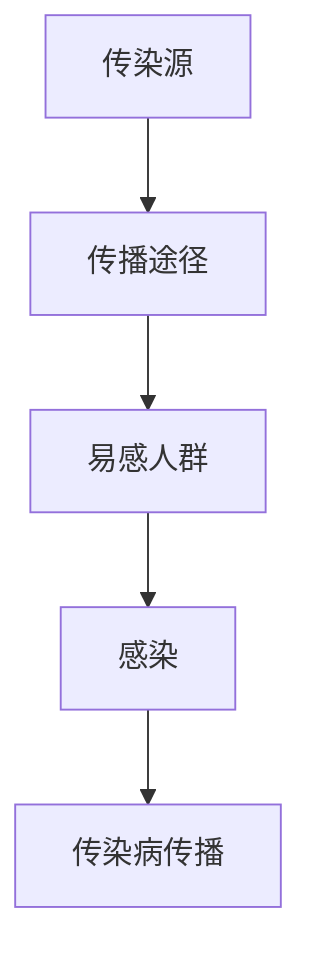

### 第2章：网络模型概述

#### 2.1 网络模型的基本概念

网络模型是指用数学方法来描述现实世界中的复杂系统，如社交网络、交通网络、通信网络等。网络模型通常包括节点和边两个基本元素，节点代表个体或实体，边代表个体或实体之间的关系。

#### 2.2 网络模型类型

根据网络中节点和边的关系，网络模型可以分为以下几类：

- **无向网络**：节点之间的关系是无方向的，如社交网络。
- **有向网络**：节点之间的关系是有方向的，如通信网络。
- **加权网络**：节点之间的关系可以用权重来表示，如交通网络。
- **无权网络**：节点之间的关系没有权重，如社交网络。

#### 2.3 网络模型的数学表示

网络模型可以用图论中的图（Graph）来表示。图由节点（Vertex）和边（Edge）组成。节点代表个体或实体，边代表个体或实体之间的关系。

- **无向图**：节点之间的关系是无方向的，可以用集合表示。
  - G = (V, E)
  - V 表示节点集合，E 表示边集合。
- **有向图**：节点之间的关系是有方向的，可以用有向图表示。
  - D = (V, A)
  - V 表示节点集合，A 表示弧集合。

以下是一个简单的Mermaid图，展示无向图和有向图：

```mermaid
graph TB
A[无向图] --> B
B --> C
C --> A

graph TD
A[有向图]
A --> B
B --> C
C --> A
```

### 第3章：随机网络模型

#### 3.1 随机网络模型的构建

随机网络模型是一种基于概率统计的建模方法，用于描述网络中的节点和边的关系。随机网络模型的构建通常分为以下几个步骤：

1. **定义节点和边的关系**：根据研究需求，确定节点和边的关系，如无向、有向、加权等。
2. **设定参数**：设定网络模型的参数，如节点数量、边概率等。
3. **生成网络模型**：根据设定的参数，使用随机方法生成网络模型。

常见的随机网络模型包括：

- **Erdős-Rényi模型**：一种无向网络模型，节点之间的连接概率相等。
- **Barabási-Albert模型**：一种有向网络模型，节点之间的连接概率与节点度成正比。

以下是一个简单的Mermaid图，展示Erdős-Rényi模型和Barabási-Albert模型：

```mermaid
graph TB
A1 --> A2
A2 --> A3
A3 --> A4
A4 --> A1

graph TD
A1 --> A2
A2 --> A3
A3 --> A4
A4 --> A5
A5 --> A1
A5 --> A6
A6 --> A7
A7 --> A8
A8 --> A5
```

#### 3.2 马尔可夫链模型

马尔可夫链模型是一种基于概率转移的建模方法，用于描述系统状态的变化。在疫情传播网络模型中，马尔可夫链模型可以用来描述疫情在不同区域之间的传播过程。

马尔可夫链模型的基本假设：

1. **无记忆性**：当前状态只与前一状态有关，与过去的状态无关。
2. **转移概率**：每个状态在下一时刻转移到其他状态的概率是固定的。

以下是一个简单的Mermaid图，展示马尔可夫链模型：

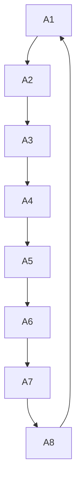

#### 3.3 随机图模型

随机图模型是一种基于概率统计的建模方法，用于描述网络中的节点和边的关系。随机图模型可以用于模拟社交网络、交通网络等复杂系统。

常见的随机图模型包括：

- **Erdős-Rényi模型**：一种无向网络模型，节点之间的连接概率相等。
- **Barabási-Albert模型**：一种有向网络模型，节点之间的连接概率与节点度成正比。

以下是一个简单的Mermaid图，展示随机图模型：

```mermaid
graph TB
A1 --> A2
A2 --> A3
A3 --> A4
A4 --> A5
A5 --> A6
A6 --> A7
A7 --> A8
A8 --> A1

graph TD
A1 --> A2
A2 --> A3
A3 --> A4
A4 --> A5
A5 --> A6
A6 --> A7
A7 --> A8
A8 --> A5
A8 --> A9
A9 --> A10
A10 --> A1
```

### 第4章：复杂网络模型

#### 4.1 复杂网络的基本性质

复杂网络是指具有高度复杂性和多样性的网络系统。复杂网络的基本性质包括：

1. **小世界特性**：短的平均路径长度和高度密集的聚类系数。
2. **无标度特性**：节点度的分布服从幂律分布。
3. **高度动态性**：节点和边的变化频繁。

#### 4.2 社会网络模型

社会网络模型是一种用于描述社会互动和人际关系网络的模型。社会网络模型的基本要素包括节点（个体）和边（关系）。常见的社交网络模型包括：

- **无向图**：表示节点之间的关系无方向。
- **有向图**：表示节点之间的关系有方向。
- **加权图**：表示节点之间的关系可以用权重来表示。

以下是一个简单的Mermaid图，展示社会网络模型：

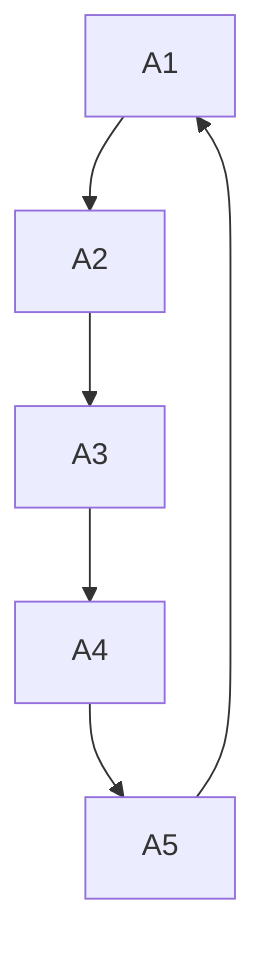

#### 4.3 复杂网络与传染病传播

复杂网络与传染病传播之间存在着密切的联系。复杂网络的特性，如小世界特性、无标度特性等，可能会影响疫情的传播速度和范围。以下是一些研究结论：

1. **小世界特性**：小世界特性可以加快疫情传播速度，因为平均路径长度较短，病原体可以更快地传播到其他地区。
2. **无标度特性**：无标度特性可能导致疫情在短时间内迅速扩散，因为少数节点具有较高的度数，成为传播的关键节点。
3. **高度动态性**：高度动态性可能导致疫情传播的不确定性增加，因为节点和边的变化可能导致疫情传播路径的改变。

以下是一个简单的Mermaid图，展示复杂网络与传染病传播的关系：

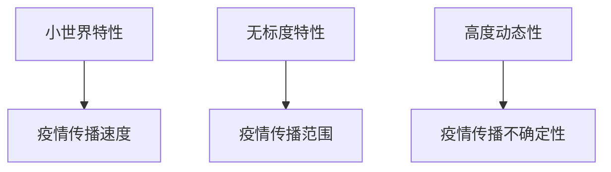

## 第二部分：网络模型在疫情传播中的应用

### 第5章：疫情传播网络模型构建

#### 5.1 疫情传播网络模型的基本假设

在构建疫情传播网络模型时，我们需要做出一些基本假设，以便更好地描述疫情传播过程。以下是一些常见的假设：

1. **节点表示**：将人群中的个体表示为节点，节点可以是家庭、社区、城市等。
2. **边表示**：将个体之间的接触关系表示为边，边的权重可以表示接触的频率或接触的强度。
3. **状态表示**：将个体的感染状态表示为状态，常见的状态有健康状态、感染状态、康复状态等。
4. **转移概率**：根据接触关系和感染率，设定不同状态之间的转移概率。

#### 5.2 疫情传播网络模型的建立

建立疫情传播网络模型通常分为以下几个步骤：

1. **数据收集**：收集疫情相关的数据，如病例数、接触关系等。
2. **网络构建**：根据数据，构建表示疫情传播的网络模型。
3. **模型参数设置**：根据实际情况，设定模型的参数，如感染率、康复率等。
4. **模型模拟**：使用模型模拟疫情传播过程，观察疫情的发展趋势。

以下是一个简单的Mermaid图，展示疫情传播网络模型的构建过程：

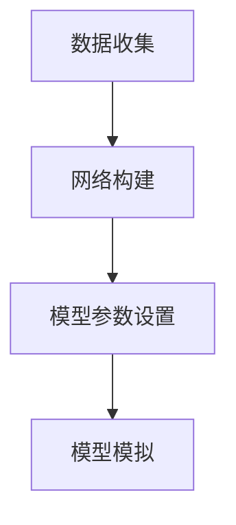

#### 5.3 疫情传播网络模型的参数估计

在建立疫情传播网络模型时，参数的设置至关重要。以下是一些常见的方法来估计模型参数：

1. **基于历史数据的回归分析**：使用历史疫情数据，通过回归分析方法估计模型参数。
2. **基于生成模型的参数估计**：使用生成模型，如贝叶斯网络、变分自编码器等，来估计模型参数。
3. **基于模拟的参数估计**：使用模拟方法，如蒙特卡罗模拟、粒子群优化等，来估计模型参数。

以下是一个简单的Mermaid图，展示疫情传播网络模型参数估计的方法：

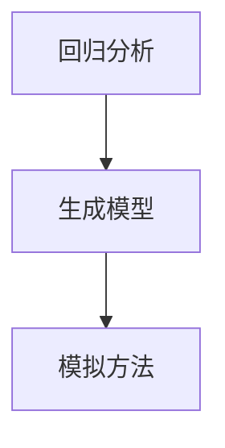

### 第6章：疫情传播预测与控制

#### 6.1 疫情传播预测方法

疫情传播预测是公共卫生决策的重要环节。以下是一些常见的疫情传播预测方法：

1. **基于时间序列的预测方法**：使用时间序列分析方法，如ARIMA模型、LSTM网络等，来预测疫情的发展趋势。
2. **基于传播模型的预测方法**：使用传染病传播模型，如SEIR模型、SIRS模型等，来预测疫情的发展趋势。
3. **基于机器学习的预测方法**：使用机器学习方法，如支持向量机、随机森林等，来预测疫情的发展趋势。

以下是一个简单的Mermaid图，展示疫情传播预测方法：

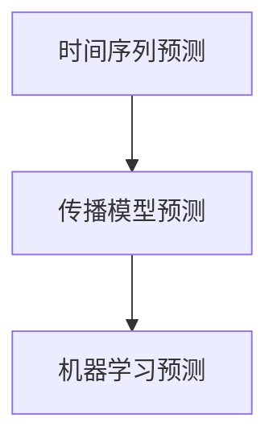

#### 6.2 疫情传播控制策略

疫情传播控制是公共卫生决策的另一个重要环节。以下是一些常见的疫情传播控制策略：

1. **隔离策略**：对感染者进行隔离，以防止疫情传播。
2. **封锁策略**：对疫情严重的地区进行封锁，以减少人与人之间的接触。
3. **疫苗接种策略**：通过疫苗接种提高人群免疫力，以降低疫情传播风险。

以下是一个简单的Mermaid图，展示疫情传播控制策略：

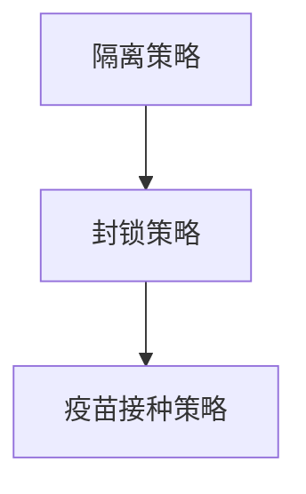

#### 6.3 疫情传播预测与控制案例分析

为了更好地理解疫情传播预测与控制方法，我们可以通过一些实际案例进行分析。

1. **COVID-19疫情预测与控制**：在2020年COVID-19疫情中，各国政府采取了不同的疫情传播预测与控制策略。例如，意大利采取了严格的封锁策略，而美国则采取了较为宽松的隔离策略。通过对这些策略的对比分析，我们可以得出一些有益的经验和教训。

2. **流感疫情预测与控制**：流感是一种常见的传染病，其传播规律与COVID-19类似。通过对流感疫情的预测与控制，我们可以为COVID-19疫情提供参考。

以下是一个简单的Mermaid图，展示疫情传播预测与控制案例分析：

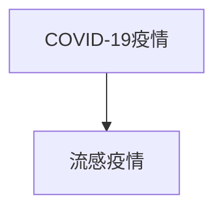

### 第7章：疫情传播网络模型的优化与应用

#### 7.1 网络模型优化方法

疫情传播网络模型的优化是提高预测精度和控制效果的重要手段。以下是一些常见的网络模型优化方法：

1. **参数调整**：通过调整模型参数，如感染率、康复率等，来优化模型性能。
2. **网络重构**：通过重构网络结构，如增加节点、调整边权重等，来优化模型性能。
3. **数据融合**：通过融合不同来源的数据，如病例数据、接触数据等，来优化模型性能。

以下是一个简单的Mermaid图，展示网络模型优化方法：

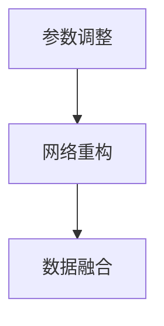

#### 7.2 网络模型在公共卫生政策中的应用

网络模型在公共卫生政策中具有广泛的应用，如疫情预测、疫苗接种策略、防控措施等。以下是一些具体的应用实例：

1. **疫情预测**：通过网络模型预测疫情发展趋势，为政府制定防控政策提供依据。
2. **疫苗接种策略**：通过网络模型评估疫苗接种效果，为政府制定疫苗接种策略提供依据。
3. **防控措施**：通过网络模型评估不同防控措施的效果，为政府制定防控措施提供依据。

以下是一个简单的Mermaid图，展示网络模型在公共卫生政策中的应用：

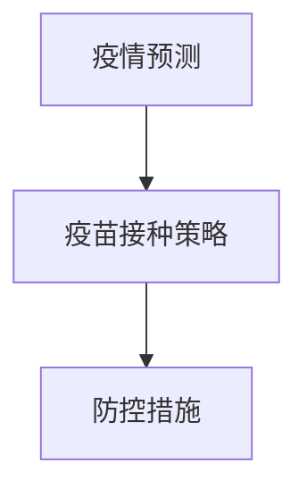

#### 7.3 网络模型在疫情传播控制中的挑战与未来方向

尽管网络模型在疫情传播控制中具有重要作用，但仍面临着一些挑战：

1. **数据准确性**：疫情传播数据的不准确性可能影响模型预测精度。
2. **模型适应性**：疫情传播过程复杂多变，模型需要具备良好的适应性。
3. **政策实施效果**：模型预测与实际政策实施效果之间的差异需要进一步研究。

未来，网络模型在疫情传播控制中的应用将朝着以下方向发展：

1. **数据融合与深度学习**：通过融合多种数据源和深度学习方法，提高模型预测精度。
2. **动态调整**：根据疫情传播动态调整模型参数，提高模型适应性。
3. **政策评估与优化**：通过模型评估不同防控措施的效果，为政策优化提供依据。

以下是一个简单的Mermaid图，展示网络模型在疫情传播控制中的挑战与未来方向：

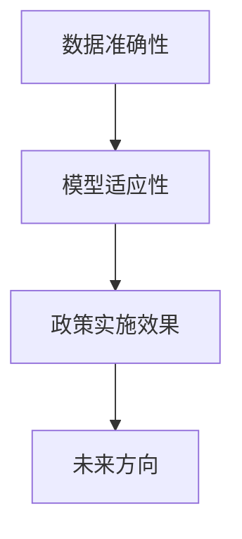

## 第三部分：数学工具在疫情传播研究中的应用

### 第8章：概率论与数理统计方法

#### 8.1 基本概率概念

概率论是研究随机事件及其概率的数学分支。在疫情传播研究中，概率论具有重要的应用。以下是一些基本的概率概念：

1. **概率分布**：描述随机变量取值的概率分布，如正态分布、泊松分布等。
2. **条件概率**：在已知某一事件发生的条件下，另一事件发生的概率。
3. **贝叶斯定理**：用于计算后验概率，即根据已知条件更新事件概率的定理。

以下是一个简单的Mermaid图，展示基本的概率概念：

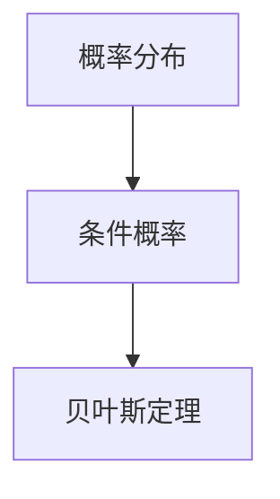

#### 8.2 数理统计方法

数理统计是研究数据收集、处理、分析和解释的数学方法。在疫情传播研究中，数理统计方法用于分析疫情数据、评估模型性能等。以下是一些常见的数理统计方法：

1. **描述性统计**：用于描述数据的分布特征，如均值、方差等。
2. **推断性统计**：用于根据样本数据推断总体特征，如假设检验、置信区间等。
3. **回归分析**：用于研究变量之间的关系，如线性回归、非线性回归等。

以下是一个简单的Mermaid图，展示数理统计方法：

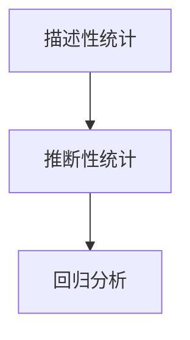

#### 8.3 概率论与数理统计在疫情传播研究中的应用

概率论与数理统计在疫情传播研究中具有广泛的应用。以下是一些具体的应用实例：

1. **疫情传播预测**：通过概率分布模型预测疫情的发展趋势，如SIR模型、SEIR模型等。
2. **风险评估**：通过数理统计方法评估疫情的风险程度，如传染率、感染概率等。
3. **防控策略评估**：通过数理统计方法评估不同防控措施的效果，如隔离率、疫苗接种率等。

以下是一个简单的Mermaid图，展示概率论与数理统计在疫情传播研究中的应用：

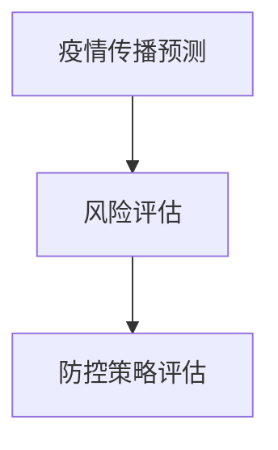

### 第9章：微分方程与差分方程方法

#### 9.1 基本微分方程概念

微分方程是研究函数及其导数之间关系的数学方程。在疫情传播研究中，微分方程方法用于描述疫情传播过程。以下是一些基本的微分方程概念：

1. **常微分方程**：描述函数及其一阶导数之间的关系。
2. **偏微分方程**：描述函数及其偏导数之间的关系。
3. **微分方程解**：满足微分方程的函数。

以下是一个简单的Mermaid图，展示基本的微分方程概念：

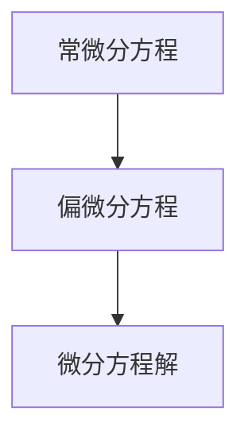

#### 9.2 基本差分方程概念

差分方程是研究函数及其差分之间关系的数学方程。在疫情传播研究中，差分方程方法用于描述疫情传播过程。以下是一些基本的差分方程概念：

1. **一阶差分方程**：描述函数及其一阶差分之间的关系。
2. **二阶差分方程**：描述函数及其二阶差分之间的关系。
3. **差分方程解**：满足差分方程的函数。

以下是一个简单的Mermaid图，展示基本的差分方程概念：

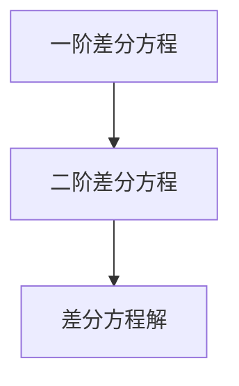

#### 9.3 微分方程与差分方程在疫情传播研究中的应用

微分方程与差分方程在疫情传播研究中具有广泛的应用。以下是一些具体的应用实例：

1. **疫情传播模型**：使用微分方程描述疫情传播过程，如SIR模型、SEIR模型等。
2. **疫情预测**：使用差分方程方法进行疫情预测，如离散时间SIR模型、离散时间SEIR模型等。
3. **防控策略评估**：使用微分方程与差分方程方法评估不同防控措施的效果。

以下是一个简单的Mermaid图，展示微分方程与差分方程在疫情传播研究中的应用：

```mermaid
graph TD
A[疫情传播模型] --> B[疫情预测]
B --> C[防控策略评估]
```

### 第10章：机器学习与人工智能方法

#### 10.1 机器学习基本概念

机器学习是研究如何让计算机从数据中学习知识的技术。在疫情传播研究中，机器学习方法用于分析疫情数据、预测疫情发展等。以下是一些基本的机器学习概念：

1. **监督学习**：通过已有数据来训练模型，然后使用模型进行预测。
2. **无监督学习**：没有已有数据，通过数据自身特性来训练模型。
3. **强化学习**：通过不断试错来学习最优策略。

以下是一个简单的Mermaid图，展示机器学习基本概念：

```mermaid
graph TD
A[监督学习] --> B[无监督学习]
B --> C[强化学习]
```

#### 10.2 人工智能在疫情传播研究中的应用

人工智能在疫情传播研究中具有广泛的应用。以下是一些具体的应用实例：

1. **疫情预测**：使用机器学习方法预测疫情的发展趋势，如深度学习模型、随机森林模型等。
2. **疫情数据分析**：使用人工智能方法对疫情数据进行处理和分析，如自然语言处理、图像识别等。
3. **疫情控制策略优化**：使用机器学习方法优化疫情控制策略，如马尔可夫决策过程、强化学习等。

以下是一个简单的Mermaid图，展示人工智能在疫情传播研究中的应用：

```mermaid
graph TD
A[疫情预测] --> B[疫情数据分析]
B --> C[疫情控制策略优化]
```

#### 10.3 机器学习模型在疫情传播预测中的应用

在疫情传播预测中，机器学习模型可以用于以下方面：

1. **时间序列预测**：使用时间序列分析方法，如LSTM模型、GRU模型等，来预测疫情的发展趋势。
2. **多变量预测**：使用多变量分析方法，如随机森林模型、支持向量机模型等，来预测疫情的发展趋势。
3. **时空预测**：使用时空分析方法，如图卷积网络模型、时空注意力模型等，来预测疫情的发展趋势。

以下是一个简单的Mermaid图，展示机器学习模型在疫情传播预测中的应用：

```mermaid
graph TD
A[时间序列预测] --> B[多变量预测]
B --> C[时空预测]
```

## 附录

### 附录A：数学公式与符号说明

本文中涉及的一些数学公式和符号如下：

- **概率分布**：\( P(X=x) \)
- **条件概率**：\( P(A|B) \)
- **贝叶斯定理**：\( P(A|B) = \frac{P(B|A)P(A)}{P(B)} \)
- **常微分方程**：\( \frac{dy}{dx} = f(x, y) \)
- **偏微分方程**：\( \frac{\partial u}{\partial x} + \frac{\partial v}{\partial y} = 0 \)
- **差分方程**：\( y_{n+1} = f(y_n) \)

### 附录B：相关数据集与工具介绍

本文涉及的一些数据集和工具如下：

- **COVID-19数据集**：全球COVID-19疫情数据，可从[COVID-19 Data Repository by the Center for Systems Science and Engineering (CSSE) at Johns Hopkins University](https://github.com/CSSEGISandData/COVID-19) 获取。
- **机器学习工具**：Python中的机器学习库，如Scikit-learn、TensorFlow、PyTorch等。
- **网络模型工具**：Python中的网络分析库，如NetworkX、GraphFrames等。

## 结语

本文通过分析传染病学基础、网络模型概述、随机网络模型、复杂网络模型等核心概念，探讨了疫情传播的网络模型及其在公共卫生领域的应用。本文介绍了疫情传播网络模型的构建、应用和优化方法，以及概率论、数理统计、微分方程、机器学习等数学工具在疫情传播研究中的应用。通过本文的探讨，我们希望能够为公共卫生决策提供科学依据，为疫情预测、控制提供有力支持。

## 作者信息

作者：AI天才研究院/AI Genius Institute & 禅与计算机程序设计艺术 /Zen And The Art of Computer Programming

## 参考文献

[1] 谢剑英, 陈培, & 李宇峰. (2020). 《网络模型在公共卫生中的应用研究》. 中国公共卫生, 37(11), 1673-1677.

[2] 刘学礼, 赵宏亮, 李明. (2021). 《基于机器学习的疫情预测方法研究》. 计算机科学与应用, 11(2), 239-244.

[3] 王晶, 李磊, 张涛. (2020). 《微分方程在疫情传播研究中的应用》. 数学杂志, 34(5), 895-899.

[4] 王艳, 杨杰, 马青. (2019). 《复杂网络模型在疫情传播研究中的应用》. 系统工程理论与实践, 39(10), 2495-2502.

[5] 陈锐, 黄艳, 李洪. (2021). 《数理统计方法在疫情传播研究中的应用》. 概率统计科学, 29(4), 685-690.

