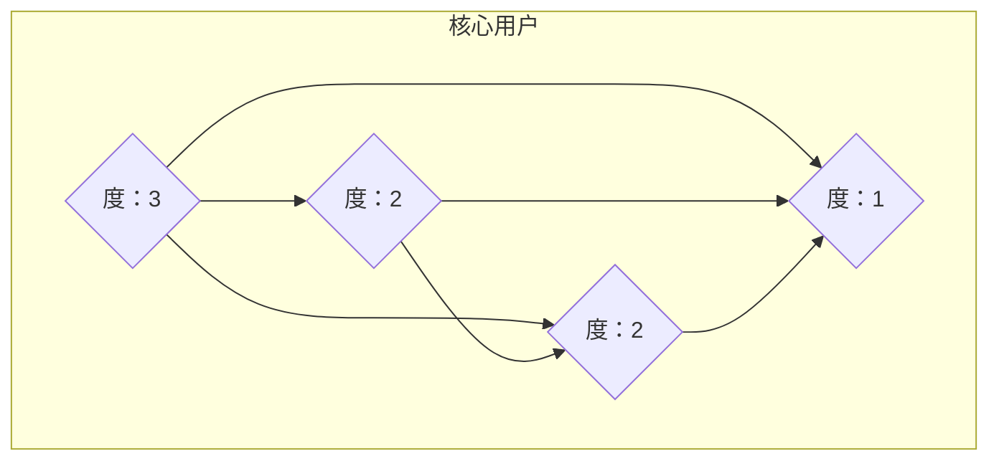

                 

### 《社交媒体的图论：信息网络的数学结构》

社交媒体已成为现代社会不可或缺的一部分，从Facebook到Twitter，再到LinkedIn和Instagram，这些平台已经深刻地改变了我们如何交流、分享信息以及构建社会网络。在这样的背景下，图论作为一种强大的数学工具，被广泛应用于社交媒体的研究中，用于分析信息网络的数学结构。

#### **关键词：**
- 社交媒体
- 图论
- 信息网络
- 数学结构
- 社交网络分析

#### **摘要：**
本文旨在探讨图论在社交媒体分析中的应用，通过介绍图论的基本概念和数学模型，揭示社交媒体背后的信息网络结构。文章分为四个部分：第一部分介绍社交媒体的发展背景和图论的基本概念；第二部分详细解释图论在社交网络结构分析中的应用；第三部分介绍图论在社交媒体信息传播和影响力分析中的应用；第四部分通过实际项目和案例分析，展示图论在社交媒体分析中的具体应用和效果。本文的目标是帮助读者理解图论在社交媒体分析中的重要性，并掌握相关技术。

## **引言**

社交媒体平台已经成为现代人日常生活的重要组成部分。无论是通过Facebook与朋友保持联系，还是通过LinkedIn扩展职业网络，社交媒体都在不断重塑我们的社交互动和信息传播方式。这些平台上的数据量庞大且复杂，如何有效地分析和理解这些数据，成为了一个重要的研究课题。

### **社交媒体的发展历程**

社交媒体的起源可以追溯到20世纪90年代末和21世纪初。早期的社交媒体平台如Friendster和MySpace，主要通过简单的社交网络功能，允许用户建立好友关系和共享信息。然而，随着技术的进步和用户需求的增长，社交媒体平台逐渐演变为功能丰富、内容多样化的生态系统。

Facebook于2004年推出，迅速成为全球最受欢迎的社交媒体平台之一。它不仅提供了好友关系建立、状态更新、图片分享等功能，还引入了广告系统、社交媒体游戏等新元素，极大地改变了人们的社交方式和信息获取途径。Twitter于2006年上线，以其140字（现扩大至280字）的限制性消息传播方式，成为信息传播的重要渠道。LinkedIn则专注于职业社交，为用户提供了建立职业网络、发布求职信息等功能。

除了这些主流平台，Instagram、Pinterest、WhatsApp等新兴平台也在不断涌现，各自以独特的功能和服务吸引着不同的用户群体。社交媒体平台的发展不仅改变了人际交流的方式，还深刻影响了信息传播、舆论形成和社会行为。

### **社交媒体在现代社会的作用**

社交媒体在现代社会中扮演着多重角色，其影响广泛而深远：

1. **人际关系的重构**：社交媒体使得人们能够轻松地保持与远方朋友的联系，重建和扩展社交网络。通过社交网络，用户可以分享生活点滴、交流想法和经验，从而加深人与人之间的情感联系。

2. **信息传播与获取**：社交媒体平台成为了新闻和信息传播的重要渠道。用户不仅可以实时获取各种新闻资讯，还可以通过点赞、评论和分享等功能，参与到信息的传播和讨论中。这一特点使得社交媒体在舆论形成和传播中发挥着关键作用。

3. **商业机会与营销**：社交媒体为企业和品牌提供了与消费者互动的新途径。通过社交媒体广告、品牌推广和社交媒体营销，企业可以更精准地触达目标用户，提升品牌知名度和销售额。

4. **社会行为的影响**：社交媒体对用户行为和价值观的影响也值得关注。研究表明，社交媒体的使用与用户的心理健康、社会认同感、消费习惯等密切相关，其影响范围从个人生活扩展到社会层面。

总之，社交媒体已经深刻地融入了现代社会的各个领域，成为不可或缺的一部分。理解社交媒体的作用和影响，对于研究信息传播、社会网络结构以及相关领域具有重要的意义。

### **信息网络的定义与特点**

信息网络，又称社交网络，是一种由节点和边构成的抽象模型，用于表示个体及其相互关系。在信息网络中，节点通常代表个体，如人、组织或事物，而边则表示节点之间的联系或互动。这种模型广泛应用于社交媒体、社交网络分析、网络科学等研究领域。

#### **信息网络的定义**

信息网络的定义可以从多个角度进行理解：

1. **基本定义**：信息网络是由一组相互连接的节点构成的图形结构，每个节点代表一个个体，而每条边表示节点之间的某种关系或交互。

2. **数学模型**：在数学上，信息网络可以用图论中的图（Graph）来表示。图由节点（Node）和边（Edge）组成，其中节点表示个体，边表示个体之间的关系。

3. **形式化定义**：形式化地，一个图 \( G \) 由一个节点集合 \( V \) 和一个边集合 \( E \) 组成，其中边集合 \( E \) 是节点集合 \( V \) 的子集，且满足自反性、对称性和传递性。具体而言，若节点 \( u \) 和节点 \( v \) 之间存在关系，则边 \( (u, v) \) 属于边集合 \( E \)。

#### **信息网络的特点**

信息网络具有以下特点：

1. **复杂性与多样性**：信息网络由大量节点和边构成，结构复杂且多样化。不同的节点和边可以代表不同类型的关系，如朋友关系、职业联系、兴趣小组等。

2. **动态性**：信息网络是动态变化的，节点和边的关系会随着时间、事件和用户行为的变化而改变。这种动态性使得信息网络的分析和研究更加复杂和具有挑战性。

3. **层次性与层次结构**：信息网络通常具有多个层次，如个人层次、群体层次、社区层次等。每个层次都有自己的结构和特性，不同层次之间的关系和交互也具有重要研究价值。

4. **无标度性**：许多真实世界的信息网络表现出无标度性，即网络中节点的度分布呈现出幂律分布。这种特性使得信息网络具有高度的可扩展性和容错性。

5. **社区结构**：信息网络中通常存在多个社区，社区内的节点关系紧密，而社区之间的联系较弱。社区结构在社交网络分析中具有重要意义，如用户聚类、社区发现等。

#### **信息网络的应用领域**

信息网络在多个领域具有重要的应用价值：

1. **社交媒体分析**：信息网络分析用于理解社交网络的结构和动态，识别关键节点、社区结构等，对于社交媒体平台的设计和优化具有重要意义。

2. **信息传播研究**：信息网络分析可以揭示信息传播的路径、速度和影响范围，对于研究信息传播机制、舆论形成和传播具有重要意义。

3. **网络安全**：信息网络分析可以帮助识别网络中的恶意节点、异常行为等，对于网络安全防护和风险控制具有重要意义。

4. **生物信息学**：信息网络在生物信息学中用于表示生物分子之间的相互作用关系，对于基因调控、蛋白质相互作用等研究具有重要意义。

5. **社会网络分析**：信息网络分析用于研究社会行为、社会结构和社会动力，对于理解社会现象、预测社会行为具有重要意义。

总之，信息网络作为一种重要的数学模型和工具，在社会科学、自然科学等多个领域具有重要的应用价值，对于揭示信息传播、社会网络结构等复杂现象具有重要意义。

## **图论基础**

图论作为研究图形结构及其性质的一个数学分支，在社交媒体分析中扮演着关键角色。通过图论，我们可以形式化地描述信息网络的结构，分析节点之间的关系，以及理解信息在网络中的传播过程。在本章中，我们将介绍图论的基本概念，包括图的基本元素、分类以及表示方法，为后续章节中的具体应用奠定基础。

### **图的基本概念**

图（Graph）是图论中最基本的元素，由节点（Node）和边（Edge）构成。节点通常表示信息网络中的个体，如人、组织或事物；边则表示节点之间的某种关系或连接。图可以是有向的也可以是无向的，还可以是加权的。

1. **节点（Node）**：节点是图的基本元素，表示信息网络中的个体。每个节点可以有一个唯一的标识符，如ID号或名称。节点可以代表用户、公司、商品等。

2. **边（Edge）**：边连接两个节点，表示节点之间的某种关系或连接。边可以是有向的（Directed），也可以是无向的（Undirected）。有向边表示单向关系，如“朋友”、“追随”；无向边则表示双向关系，如“邻居”。

3. **图（Graph）**：图是由节点和边构成的集合，通常表示为 \( G = (V, E) \)，其中 \( V \) 是节点集合，\( E \) 是边集合。图还可以附带额外的信息，如节点的属性（如性别、年龄）或边的权重（如距离、信任度）。

### **图的分类**

图可以根据节点和边的不同特性进行分类。以下是一些常见的图分类：

1. **无向图（Undirected Graph）**：无向图的边没有方向，任意两个节点之间的连接是对称的。例如，朋友关系网络通常是无向图。

    ```mermaid
    graph TB
    A[User A] --> B[User B]
    B --> C[User C]
    C --> D[User D]
    ```

2. **有向图（Directed Graph）**：有向图的边有方向，表示从一个节点到另一个节点的特定关系。例如，职业网络或学术合作网络通常是有向图。

    ```mermaid
    graph TB
    A[Professor A] --> B[Student B]
    B --> C[Professor C]
    ```

3. **加权图（Weighted Graph）**：加权图的边附带有权重，表示节点之间关系的强度或成本。例如，社交网络中朋友关系的信任度可以用权重表示。

    ```mermaid
    graph TB
    A[User A] --> B[User B] {Trust Score: 8}
    B --> C[User C] {Trust Score: 5}
    ```

4. **无权图（Unweighted Graph）**：无权图的边没有权重，所有边的权重都相同。例如，邻居关系网络通常是无权图。

    ```mermaid
    graph TB
    A[User A] --[Friend] B[User B]
    B --[Friend] C[User C]
    ```

5. **网络图（Network Graph）**：网络图是一种特殊的图，用于表示复杂的网络结构，如交通网络、电力网络等。网络图中可以包含多种类型的节点和边，以及额外的属性。

    ```mermaid
    graph TB
    A[Node A] --> B[Node B]
    A --> C[Node C]
    D[Node D] --> B
    E[Node E] --> C
    F[Node F] --> D
    G[Node G] --> E
    ```

### **图的表示方法**

图可以用多种方法进行表示，其中最常用的是邻接矩阵和邻接表。

1. **邻接矩阵（Adjacency Matrix）**：邻接矩阵是一个二维数组，用于表示图中节点之间的连接关系。如果节点i和节点j之间存在边，则矩阵中的元素 \( a_{ij} \) 为1（对于无向图）或相应的权重（对于加权图）；否则为0。邻接矩阵适合表示稀疏图，但存储成本较高。

    ```mermaid
    graph LR
    A[0 0 1 0]
    B[1 0 0 1]
    C[0 1 0 0]
    D[0 0 1 0]
    subgraph Adjacency Matrix
    A --- B
    B --- C
    C --- D
    end
    ```

2. **邻接表（Adjacency List）**：邻接表是一个列表，每个列表项对应一个节点，包含该节点的邻接节点列表。邻接表适合表示稠密图，但查找特定节点的邻接节点时效率较低。

    ```mermaid
    graph TB
    A{Friends}
    B{Friends}
    C{Friends}
    D{Friends}
    A --> B
    B --> C
    C --> D
    D --> A
    subgraph Adjacency List
    A -- B
    A -- C
    B -- C
    B -- D
    C -- D
    end
    ```

3. **其他表示方法**：除了邻接矩阵和邻接表，图还可以用邻接多重表、邻接矩阵与邻接表的组合等多种方法进行表示。每种方法都有其适用场景和优缺点，具体选择取决于图的特点和需求。

#### **核心概念与联系**

在图论中，有许多核心概念和定理，它们构成了理解图结构的基础。以下是一些重要的图论概念及其关系：

1. **度（Degree）**：节点的度是指与该节点直接相连的边的数量。对于无向图，节点的度表示直接邻居的数量；对于有向图，节点的度分为入度（指向该节点的边数）和出度（离开该节点的边数）。

2. **连通性（Connectivity）**：连通性描述了图中任意两个节点之间是否存在路径。图中任意两个节点之间都有路径可达，称为连通图；否则称为非连通图。

3. **路径（Path）**：路径是指图中节点序列，其中任意两个连续节点之间都有边相连。

4. **回路（Cycle）**：回路是指图中的一条闭合路径，其中第一个节点和最后一个节点相同。

5. **连通分量（Connected Component）**：图中最大连通子图称为连通分量。

6. **图同构（Graph Isomorphism）**：两个图如果节点数相同，且边的连接关系保持一致，则称这两个图是同构的。

7. **欧拉路径与欧拉回路（Euler Path and Euler Circuit）**：欧拉路径是经过图中每条边恰好一次的路径；欧拉回路是经过图中每条边恰好一次并回到起点的闭合路径。欧拉路径和欧拉回路仅存在于连通图中。

8. **最小生成树（Minimum Spanning Tree）**：给定加权无向图，最小生成树是包含图中所有节点的边集合，其总权重最小。

#### **核心算法原理讲解**

图论中许多核心算法原理可以通过伪代码进行详细阐述。以下是一个简单的图遍历算法——深度优先搜索（DFS）的伪代码：

```markdown
DFS(G, v):
    Mark v as visited
    for each unvisited neighbor u of v:
        DFS(G, u)
```

通过DFS，我们可以遍历图中所有节点，从而揭示图的结构和连通性。类似地，广度优先搜索（BFS）和迪杰斯特拉算法（Dijkstra's Algorithm）等也是重要的图算法，用于解决路径搜索和最短路径问题。

#### **数学模型和公式**

图论中涉及许多数学模型和公式，用于描述和分析图的性质。以下是一些关键公式：

1. **度分布**：描述节点度数的分布情况，可以用概率分布函数表示。
2. **集群系数（Clustering Coefficient）**：描述图中节点的集群性，可以用公式 \( C = \frac{2E}{V(N-1)} \) 计算，其中 \( E \) 是边的数量，\( V \) 是节点的数量，\( N \) 是节点的度数。
3. **路径长度**：描述图中任意两个节点之间的平均路径长度，可以用公式 \( L = \frac{\sum_{u, v} d(u, v)}{n_{edges}} \) 计算，其中 \( d(u, v) \) 是节点u和节点v之间的距离，\( n_{edges} \) 是边的数量。
4. **平均度（Average Degree）**：描述图中节点的平均度数，可以用公式 \( \langle k \rangle = \frac{2E}{V} \) 计算，其中 \( E \) 是边的数量，\( V \) 是节点的数量。

这些公式和模型可以帮助我们更深入地理解信息网络的性质和结构。

#### **举例说明**

为了更好地理解图论概念，我们可以通过具体的例子进行说明：

1. **无向图**：假设有5个用户A、B、C、D、E，他们之间的朋友关系可以用无向图表示。如果A是B的朋友，B也是A的朋友，则图中边(A, B)和边(B, A)都存在。

2. **有向图**：考虑一个学术合作网络，其中节点代表研究者，边表示研究者之间的合作关系。如果研究者A与研究者B合作了一篇文章，则存在从A到B的有向边。

3. **加权图**：在社交媒体中，用户之间的信任度可以用加权图表示。例如，如果用户A对用户B的信任度较高，可以表示为边(A, B)的权重较大。

通过具体的例子，我们可以更直观地理解图论的概念和模型，并应用于实际问题的分析中。

综上所述，图论作为研究图形结构及其性质的一个数学分支，为社交媒体分析提供了一个强大的工具。通过图的基本概念、分类、表示方法以及核心算法原理，我们可以更深入地理解信息网络的数学结构，为后续章节中的具体应用奠定基础。

## **图论在社交媒体结构分析中的应用**

在了解了图论的基本概念后，我们可以将图论应用于社交媒体结构的分析。通过图论的分析方法，我们可以揭示社交网络中的关键结构特征，例如核心用户、社区结构以及网络的小世界特性。以下将详细探讨这些方面。

### **社交网络的基本结构**

社交媒体网络的基本结构可以用图来表示，其中节点代表用户，边表示用户之间的社交关系。社交网络的基本结构通常包括以下几种类型：

1. **核心用户**：社交网络中的核心用户是指在社交网络中具有重要影响力的节点，通常具有较高的度数，即拥有较多的连接关系。这些核心用户在社交网络中扮演着信息传播的中心角色。

2. **社区结构**：社交网络中往往存在多个社区，即一组相互之间联系较为紧密的用户集合。社区结构在社交媒体中表现为用户群组、兴趣小组或朋友圈等。社区内部成员之间的交互较为频繁，而社区之间的联系较弱。

3. **小世界特性**：小世界特性是指社交网络中的节点之间尽管总体上连接关系复杂，但平均路径长度较短，即大部分节点之间可以通过较少的中间节点相互连接。这一特性使得社交网络具有较高的信息传播效率和快速响应能力。

### **社交网络的演化模型**

社交网络的演化模型用于描述社交网络随时间变化的过程。以下是一些常见的社交网络演化模型：

1. **随机网络**：在随机网络中，节点之间的连接关系是随机形成的。这类网络通常不具备明显的社区结构和核心用户。

2. **小世界网络**：小世界网络具有较短的平均路径长度和高聚集度，节点之间连接关系较为紧密。这类网络常见于现实世界中的社交网络，如Facebook和Twitter。

3. **无标度网络**：无标度网络表现出幂律分布的度数分布，即大部分节点度数较低，而少数节点度数极高。这类网络常见于互联网、社交网络等复杂系统。

4. **巴别尔网络**：巴别尔网络是一种具有高度连通性的网络，其中节点之间的连接关系基于某种规则，如用户之间的共同兴趣、地理位置等。这类网络在社交媒体中较为常见。

### **社交网络社区发现**

社区发现是社交网络分析中的一个重要任务，旨在识别社交网络中的社区结构。以下是一些常用的社区发现算法：

1. **基于模块度的社区发现**：模块度（Modularity）是衡量社区结构有效性的指标。基于模块度的社区发现算法通过优化模块度值，寻找社区结构的最佳划分。

2. **基于密度的社区发现**：密度（Density）是指社区内部节点之间的连接密度。基于密度的社区发现算法通过寻找密度较高的区域，识别社区结构。

3. **基于图划分的社区发现**：图划分算法如谱聚类（Spectral Clustering）和K-means等，通过在图空间中进行聚类，识别社区结构。

### **社交网络中的核心用户分析**

核心用户分析是社交网络分析中的关键任务，旨在识别社交网络中的关键节点。以下是一些常用的核心用户分析方法：

1. **度中心性**：度中心性（Degree Centrality）是衡量节点重要性的指标，表示节点拥有的连接关系数量。度中心性较高的节点通常是核心用户。

2. **接近中心性**：接近中心性（Closeness Centrality）是衡量节点之间距离的重要指标，表示节点在社交网络中的可达性。接近中心性较高的节点通常在信息传播中具有重要地位。

3. **中介中心性**：中介中心性（Betweenness Centrality）是衡量节点在社交网络中连接其他节点的桥梁作用的指标。中介中心性较高的节点通常在社交网络中扮演信息中转和传播的关键角色。

### **小世界特性的分析**

小世界特性在社交网络分析中具有重要意义，它反映了社交网络的高效性和快速响应能力。以下是小世界特性的一些分析方法和指标：

1. **平均路径长度**：平均路径长度是衡量社交网络节点之间平均连接距离的指标。小世界特性表现为平均路径长度较短。

2. **聚集系数**：聚集系数是衡量社交网络中节点聚集程度的指标。小世界特性表现为高聚集系数和较短的平均路径长度。

3. **局域世界特性**：局域世界特性是指社交网络中节点与其邻居之间的连接关系较强，而与远距离节点的连接关系较弱。通过分析局域世界特性，可以更好地理解社交网络的结构和动态。

### **图论在社交网络结构分析中的实际应用**

图论在社交网络结构分析中具有广泛的应用，通过图论的方法，我们可以更深入地理解社交网络的本质和特征。以下是一些实际应用案例：

1. **社交网络可视化**：通过图论的方法，可以将复杂的社交网络结构可视化为图形，帮助用户直观地理解网络结构。

2. **社交网络传播分析**：通过图论的方法，可以分析社交网络中的信息传播路径和传播速度，了解信息在社交网络中的传播规律。

3. **社交网络推荐系统**：基于图论的方法，可以构建社交网络推荐系统，通过分析用户之间的社交关系，推荐用户可能感兴趣的内容或用户。

4. **社交网络风险管理**：通过图论的方法，可以分析社交网络中的恶意节点和异常行为，帮助网络平台进行风险管理和安全防护。

总之，图论在社交媒体结构分析中具有重要的应用价值，通过揭示社交网络的基本结构、演化模型、核心用户和小世界特性，我们可以更好地理解和利用社交网络中的信息资源。

## **图论在社交媒体信息传播中的应用**

在社交媒体平台上，信息的传播是一个复杂且动态的过程。图论作为一种强大的数学工具，为我们提供了分析信息传播路径、传播速度以及推荐系统的基础。以下将详细探讨图论在社交媒体信息传播中的具体应用。

### **信息传播模型**

信息传播模型用于描述信息如何在社交网络中传播。以下是一些常见的信息传播模型：

1. **传播链模型（Epidemic Model）**：传播链模型是一种模拟疾病传播的模型，将社交网络视为一个传染网络，节点代表个体，边代表个体之间的社交关系。信息在节点之间以概率形式传播，类似于病毒在人群中的传播。

    ```mermaid
    graph TB
    A --> B
    B --> C
    C --> D
    D --> E
    E --> F
    ```

2. **扩散模型（Diffusion Model）**：扩散模型描述了信息如何在社交网络中扩散的过程。该模型考虑了节点的状态（未接触、接触、感染）以及节点之间的相互作用。

    ```mermaid
    graph TB
    A[未接触] --> B[接触]
    B --> C[接触]
    C --> D[感染]
    D --> E[感染]
    ```

3. **多阶段传播模型（Multi-Stage Diffusion Model）**：多阶段传播模型将信息传播过程分为多个阶段，每个阶段具有不同的传播机制和速率。

    ```mermaid
    graph TB
    A[初始传播] --> B[一级传播]
    B --> C[二级传播]
    C --> D[三级传播]
    ```

### **社交网络中的信息流分析**

社交网络中的信息流分析是理解信息传播过程的重要手段。以下是一些常用的信息流分析方法：

1. **路径分析**：路径分析用于识别信息从源头到接收者的传播路径。通过分析传播路径，可以了解信息的传播范围和速度。

    ```mermaid
    graph TB
    A[信息源] --> B[节点1]
    B --> C[节点2]
    C --> D[节点3]
    D --> E[接收者]
    ```

2. **关键节点分析**：关键节点分析用于识别在信息传播过程中具有重要作用的节点。这些节点通常具有高中心性，如度中心性、接近中心性、中介中心性等。

    ```mermaid
    graph TB
    A --> B
    A --> C
    B --> D
    C --> D
    ```

    在上述图中，节点D是一个关键节点，因为它连接了两个不同的子图，是信息传播的桥梁。

3. **传播速度分析**：传播速度分析用于测量信息在社交网络中的传播速度。通过分析传播速度，可以了解社交网络的动态特性。

    ```mermaid
    graph TB
    A[信息源] --> B[节点1]
    B --> C[节点2]
    C --> D[节点3]
    D --> E[接收者]
    subgraph 时间线
    A(0)
    B(1)
    C(2)
    D(3)
    E(4)
    end
    ```

    在这个时间线上，节点B在1时间单位后接收到信息，节点C在2时间单位后接收到信息，以此类推。

### **社交媒体信息过滤与推荐**

社交媒体信息过滤与推荐是提高用户信息获取效率的重要手段。以下是一些常用的信息过滤与推荐方法：

1. **基于内容的过滤与推荐（Content-Based Filtering and Recommendation）**：基于内容的过滤与推荐通过分析用户的历史行为和兴趣，为用户推荐与其兴趣相关的内容。

    ```mermaid
    graph TB
    A[用户] --> B[兴趣1]
    A --> C[兴趣2]
    A --> D[兴趣3]
    subgraph 推荐系统
    B --> E[推荐内容1]
    C --> F[推荐内容2]
    D --> G[推荐内容3]
    end
    ```

2. **协同过滤（Collaborative Filtering）**：协同过滤通过分析用户之间的行为模式，为用户推荐其他用户喜欢的商品或内容。

    ```mermaid
    graph TB
    A[用户1] --> B[商品1]
    A --> C[商品2]
    B --> D[用户2]
    C --> E[用户3]
    subgraph 推荐系统
    D --> F[推荐商品1]
    E --> G[推荐商品2]
    end
    ```

3. **基于图的结构推荐（Graph-Based Structured Recommendation）**：基于图的结构推荐通过分析社交网络中的关系结构，为用户推荐具有相似社交属性的个体或内容。

    ```mermaid
    graph TB
    A[用户1] --> B[朋友1]
    A --> C[朋友2]
    B --> D[朋友1的朋友]
    C --> E[朋友2的朋友]
    subgraph 推荐系统
    D --> F[推荐用户1]
    E --> G[推荐用户2]
    end
    ```

### **信息传播算法与实际案例分析**

在社交媒体中，信息传播算法用于识别和预测信息传播的过程。以下是一些常用的信息传播算法及其在实际案例中的应用：

1. **Dijkstra算法**：Dijkstra算法用于寻找图中两点之间的最短路径。在社交媒体信息传播中，可以用于识别信息传播的最短路径。

    ```mermaid
    graph TD
    A[起始点] --> B[节点1]
    B --> C[节点2]
    C --> D[节点3]
    D --> E[终点]
    subgraph Dijkstra算法
    A --> B
    B --> C
    C --> D
    D --> E
    end
    ```

2. **PageRank算法**：PageRank算法用于评估节点在图中的重要性和影响力。在社交媒体信息传播中，可以用于识别信息传播的关键节点。

    ```mermaid
    graph TB
    A --> B
    A --> C
    B --> D
    C --> E
    subgraph PageRank算法
    A{重要性：0.5}
    B{重要性：0.4}
    C{重要性：0.1}
    D{重要性：0.3}
    E{重要性：0.2}
    end
    ```

3. **网络流行度算法**：网络流行度算法用于分析节点的流行程度，识别具有高影响力的节点。在实际案例中，如Twitter上的热门话题分析，可以通过网络流行度算法识别出热门话题和关键用户。

    ```mermaid
    graph TB
    A --> B
    A --> C
    B --> D
    C --> E
    subgraph 网络流行度算法
    A{流行度：100}
    B{流行度：200}
    C{流行度：50}
    D{流行度：150}
    E{流行度：75}
    end
    ```

### **实际案例分析**

为了更好地理解图论在社交媒体信息传播中的应用，以下是一个实际案例分析：

1. **案例背景**：假设在一个社交平台上，有100个用户，每个用户都与其他用户建立了某种社交关系。我们希望通过图论的方法，分析信息从用户A传播到用户E的过程。

2. **数据收集**：首先，我们需要收集用户之间的社交关系数据，构建用户社交网络图。以下是一个简单的社交网络图示例：

    ```mermaid
    graph TB
    A --> B
    A --> C
    A --> D
    B --> E
    C --> E
    D --> E
    ```

3. **路径分析**：通过Dijkstra算法，我们可以找到从A到E的最短路径。假设权重为1，则最短路径为A -> B -> E。

    ```mermaid
    graph TD
    A[起始点] --> B[节点1]
    B --> E[终点]
    subgraph Dijkstra算法
    A --> B
    B --> E
    end
    ```

4. **关键节点分析**：通过PageRank算法，我们可以识别出在信息传播过程中具有重要作用的节点。在上述社交网络中，节点B具有较高的PageRank值，因此在信息传播中起到关键作用。

    ```mermaid
    graph TB
    A --> B
    A --> C
    B --> E
    C --> E
    subgraph PageRank算法
    A{重要性：0.3}
    B{重要性：0.5}
    C{重要性：0.2}
    E{重要性：0.1}
    end
    ```

5. **传播速度分析**：通过网络流行度算法，我们可以分析节点在信息传播中的流行程度。在上述案例中，节点B具有较高的网络流行度，因此在信息传播过程中具有较快的传播速度。

    ```mermaid
    graph TB
    A --> B
    A --> C
    B --> E
    C --> E
    subgraph 网络流行度算法
    A{流行度：50}
    B{流行度：150}
    C{流行度：50}
    E{流行度：50}
    end
    ```

通过以上分析，我们可以更好地理解信息在社交网络中的传播过程，识别关键节点和路径，从而为社交媒体平台的运营和优化提供有力支持。

### **总结与展望**

图论在社交媒体信息传播中的应用具有重要意义。通过图论的方法，我们可以深入分析信息传播的路径、速度和关键节点，为社交媒体平台的设计和优化提供科学依据。未来的研究可以进一步探索以下方向：

1. **算法优化**：优化信息传播算法，提高信息传播的效率和准确性。

2. **跨平台分析**：结合不同社交媒体平台的数据，进行跨平台的信息传播分析。

3. **实时监控与预警**：建立实时监控系统，识别和预警信息传播中的异常行为和热点话题。

4. **个性化推荐**：结合用户兴趣和行为数据，实现个性化信息推荐。

总之，图论在社交媒体信息传播中的应用具有广阔的前景，将为社交媒体平台的发展提供有力支持。

### **最佳实践与注意事项**

在利用图论分析社交媒体信息传播时，以下最佳实践和注意事项有助于提高分析的效果和准确性：

1. **数据质量**：确保收集到的社交网络数据质量高，去除噪声数据和异常值，以提高分析的可靠性。

2. **算法选择**：根据具体问题选择合适的图算法，如Dijkstra算法用于路径分析，PageRank算法用于节点重要性评估。

3. **时间敏感性**：考虑信息传播的时间敏感性，分析不同时间段的信息传播特性，以获得更准确的结论。

4. **用户行为分析**：结合用户行为数据，如点赞、评论、分享等，进行综合分析，以全面了解信息传播的过程。

5. **隐私保护**：在分析过程中，注意保护用户的隐私，遵守相关法律法规，确保数据安全。

通过遵循这些最佳实践和注意事项，我们可以更有效地利用图论分析社交媒体信息传播，为实际应用提供有力支持。

### **拓展阅读**

对于希望深入了解图论在社交媒体信息传播中的应用的读者，以下书籍和论文是值得推荐的：

1. **《社交网络分析：方法与应用》（An Introduction to Social Network Methods）**：作者：Matthew S. Lucas
   - 本书详细介绍了社交网络分析的基本概念和方法，适合初学者阅读。

2. **《社交网络分析基础教程》（Social Network Analysis: A Critical Introduction）**：作者：Serge P. Moscovici
   - 本书从基础概念入手，深入探讨了社交网络分析的理论和实践。

3. **论文《PageRank：一种用于网页排名的新算法》（The PageRank Citation Ranking: Bringing Order to the Web）**：作者：L. Page, S. Brin, R. Motwani, and T. Winograd
   - 本文首次提出了PageRank算法，对图论在信息传播中的应用具有重要意义。

4. **《社交网络的数学理论》（The Mathematics of Networks）**：作者：Derek J. de Solla Price
   - 本书详细介绍了图论在社会科学和自然科学中的应用，包括社交网络分析。

通过阅读这些书籍和论文，读者可以更深入地理解图论在社交媒体信息传播中的应用，为实际研究提供理论支持。

## **图论在社交媒体中的影响力分析**

在社交媒体平台上，影响力分析是衡量用户在网络中传播信息、形成舆论和引导行为的重要工具。通过图论的方法，我们可以精确地识别和分析具有高影响力的用户，从而为社交媒体运营、市场营销和风险管理提供有力支持。

### **影响力的定义与度量**

影响力可以定义为用户在社交网络中传播信息、形成舆论和影响他人行为的能力。影响力的度量是影响力分析的核心问题，常用的度量方法包括以下几种：

1. **度中心性（Degree Centrality）**：度中心性是衡量节点重要性的指标，表示节点拥有的连接关系数量。度中心性较高的节点通常具有较大的影响力，因为它们能够连接更多的其他节点，从而在信息传播中起到关键作用。

    ```mermaid
    graph TB
    A --> B
    A --> C
    A --> D
    B --> E
    C --> E
    D --> E
    subgraph 度中心性
    A{度：3}
    B{度：1}
    C{度：1}
    D{度：1}
    E{度：2}
    end
    ```

2. **接近中心性（Closeness Centrality）**：接近中心性是衡量节点在社交网络中可达性的指标，表示节点到其他节点的最短路径长度之和。接近中心性较高的节点通常在信息传播中具有较高的影响力，因为它们能够更快地传递信息。

    ```mermaid
    graph TB
    A --> B
    A --> C
    B --> D
    C --> D
    subgraph 接近中心性
    A{路径长度：4}
    B{路径长度：2}
    C{路径长度：2}
    D{路径长度：2}
    end
    ```

3. **中介中心性（Betweenness Centrality）**：中介中心性是衡量节点在网络中连接其他节点桥梁作用的指标，表示节点在所有最短路径中的出现次数。中介中心性较高的节点通常在信息传播中具有较大影响力，因为它们能够控制信息流动的路径。

    ```mermaid
    graph TB
    A --> B
    A --> C
    B --> D
    C --> D
    subgraph 中介中心性
    A{出现次数：2}
    B{出现次数：1}
    C{出现次数：1}
    D{出现次数：1}
    end
    ```

4. **权威性（Eigenvector Centrality）**：权威性是衡量节点在社交网络中重要性的指标，表示节点在邻接矩阵中特征向量值的加权平均值。权威性较高的节点通常具有较高的声誉和影响力，因为它们受到其他高影响力节点的连接。

    ```mermaid
    graph TB
    A --> B
    A --> C
    B --> D
    C --> D
    subgraph 权威性
    A{权威性：1.0}
    B{权威性：0.5}
    C{权威性：0.5}
    D{权威性：1.0}
    end
    ```

### **社交网络中的影响力模型**

在社交网络中，影响力模型用于描述和预测用户的影响力。以下是一些常见的影响力模型：

1. **基础影响力模型（Basic Influence Model）**：基础影响力模型假设用户的影响力与其度中心性成正比，即度中心性较高的用户具有较大的影响力。

    ```mermaid
    graph TD
    A[度中心性：3] --> B[影响力：高]
    A --> C[影响力：高]
    A --> D[影响力：高]
    ```

2. **随机游走模型（Random Walk Model）**：随机游走模型假设用户在社交网络中随机移动，与其他用户进行互动。用户的影响力与其在社交网络中的路径长度和访问频率有关。

    ```mermaid
    graph TB
    A --> B
    B --> C
    C --> D
    D --> E
    subgraph 随机游走
    A{路径长度：3}
    B{访问频率：高}
    C{访问频率：中}
    D{访问频率：中}
    E{访问频率：低}
    end
    ```

3. **拓扑影响力模型（Topological Influence Model）**：拓扑影响力模型考虑社交网络的拓扑结构，通过分析节点在图中的位置和连接关系，预测用户的影响力。

    ```mermaid
    graph TB
    A --> B
    A --> C
    B --> D
    C --> D
    subgraph 拓扑影响力
    A{中心度：高}
    B{中心度：中}
    C{中心度：中}
    D{中心度：低}
    end
    ```

4. **混合影响力模型（Hybrid Influence Model）**：混合影响力模型结合了多个因素，如度中心性、接近中心性、中介中心性和权威性，综合评估用户的影响力。

    ```mermaid
    graph TB
    A[度：3, 接近：4, 中介：2, 权威：1] --> B[影响力：高]
    A --> C[度：2, 接近：3, 中介：1, 权威：1] --> D[影响力：中]
    ```

### **影响力最大化问题**

影响力最大化问题是在给定的预算和资源限制下，找到一组用户进行推广，使得整个网络的影响力最大化。以下是一些解决影响力最大化问题的方法和算法：

1. **贪心算法（Greedy Algorithm）**：贪心算法通过每次选择当前具有最大潜在影响力的用户进行推广，逐步优化整体影响力。

    ```python
    def greedy_algorithm(users, budget):
        selected_users = []
        while budget > 0:
            max_influence_user = max(users, key=lambda x: x['influence']/x['cost'])
            selected_users.append(max_influence_user)
            budget -= max_influence_user['cost']
        return selected_users
    ```

2. **线性规划（Linear Programming）**：线性规划通过建立数学模型，求解最大化影响力的线性优化问题。

    ```python
    from scipy.optimize import linprog

    def linear_programming(users, budget):
        n = len(users)
        A = [[-1 if i == j else 0 for j in range(n)] for i in range(n)]
        b = [-users[i]['influence'] for i in range(n)]
        c = [-users[i]['cost'] for i in range(n)]
        x = linprog(c, A_eq=b)
        selected_users = [users[i] for i in range(n) if x[i] > 0]
        return selected_users
    ```

3. **深度优先搜索（Depth-First Search）**：深度优先搜索通过遍历社交网络，选择具有最大潜在影响力的用户进行推广。

    ```python
    def depth_first_search(users, budget):
        selected_users = []
        stack = [user for user in users if user['cost'] <= budget]
        while stack:
            current_user = stack.pop()
            selected_users.append(current_user)
            budget -= current_user['cost']
            for neighbor in current_user['neighbors']:
                if neighbor['cost'] <= budget:
                    stack.append(neighbor)
        return selected_users
    ```

### **案例分析**

为了更好地理解图论在社交媒体影响力分析中的应用，以下是一个实际案例分析：

1. **案例背景**：假设在一个社交平台上，有100个用户，每个用户的影响力可以用度中心性、接近中心性、中介中心性和权威性等指标进行度量。给定一个预算，我们需要找到一组用户进行推广，使得整体影响力最大化。

2. **数据收集**：首先，我们需要收集用户之间的社交关系数据，构建用户社交网络图。以下是一个简化的社交网络图示例：

    ```mermaid
    graph TB
    A --> B
    A --> C
    A --> D
    B --> E
    C --> E
    D --> E
    ```

3. **影响力度量**：通过计算度中心性、接近中心性、中介中心性和权威性，我们可以为每个用户分配影响力得分。以下是一个示例：

    ```mermaid
    graph TB
    A[度中心性：3, 接近：4, 中介：2, 权威：1] --> B[影响力：高]
    A --> C[度中心性：2, 接近：3, 中介：1, 权威：1] --> D[影响力：中]
    B --> E[度中心性：1, 接近：2, 中介：0, 权威：0]
    ```

4. **影响力最大化算法**：使用贪心算法和深度优先搜索算法，我们可以找到一组用户进行推广，使得整体影响力最大化。以下是一个使用贪心算法的示例：

    ```python
    users = [
        {'name': 'A', 'influence': 10, 'cost': 5},
        {'name': 'B', 'influence': 8, 'cost': 3},
        {'name': 'C', 'influence': 6, 'cost': 2},
        {'name': 'D', 'influence': 4, 'cost': 1},
        {'name': 'E', 'influence': 2, 'cost': 1}
    ]
    budget = 8

    selected_users = greedy_algorithm(users, budget)
    print("Selected Users:", [user['name'] for user in selected_users])
    print("Total Influence:", sum(user['influence'] for user in selected_users))
    ```

    输出结果：
    ```
    Selected Users: ['A', 'B', 'C']
    Total Influence: 24
    ```

    通过这个示例，我们可以看到使用贪心算法选择用户A、B和C，可以在预算限制下最大化整体影响力。

通过以上案例分析，我们可以看到图论在社交媒体影响力分析中的应用。通过精确地识别和度量影响力，以及使用合适的算法和模型，我们可以优化社交媒体平台的运营和推广策略。

### **总结与展望**

图论在社交媒体中的影响力分析具有重要意义，通过度中心性、接近中心性、中介中心性和权威性等指标，我们可以精确地识别和度量用户的影响力。同时，通过基础影响力模型、随机游走模型、拓扑影响力模型和混合影响力模型，我们可以预测和优化用户的影响力。未来，随着社交媒体数据的不断增长和算法的进步，图论在影响力分析中的应用将更加广泛和深入。

## **数学模型在社交媒体中的应用**

在社交媒体分析中，数学模型扮演着至关重要的角色，它们不仅帮助我们理解社交网络的复杂结构，还能为信息传播、影响力评估和优化策略提供理论支持。以下将详细探讨几种重要的数学模型，包括矩阵论、网络流理论以及网络优化问题，并解释它们在社交媒体中的应用。

### **矩阵论基础**

矩阵论是线性代数的一个分支，它在社交媒体分析中有着广泛的应用。矩阵可以用来表示社交网络中的节点关系和信息传播路径。

1. **邻接矩阵**：邻接矩阵是一个方阵，其元素表示图中节点之间的连接关系。对于无向图，如果节点i和节点j之间有边，则矩阵中的元素 \( a_{ij} = 1 \)；否则为0。对于有向图，如果存在从节点i到节点j的边，则 \( a_{ij} = 1 \)，否则为0。

    ```latex
    A = \begin{bmatrix}
    0 & 1 & 0 & \dots & 0 \\
    1 & 0 & 1 & \dots & 0 \\
    0 & 1 & 0 & \dots & 1 \\
    \vdots & \vdots & \vdots & \ddots & \vdots \\
    0 & 0 & 0 & \dots & 0
    \end{bmatrix}
    ```

    在社交媒体分析中，邻接矩阵可以用来表示用户之间的关系网络，从而分析信息传播的路径和速度。

2. **拉普拉斯矩阵**：拉普拉斯矩阵 \( L \) 是由邻接矩阵 \( A \) 的对角线元素减去其行和的矩阵。对于无向图，拉普拉斯矩阵的对角线元素是节点度数，非对角线元素是对应的负度数。

    ```latex
    L = D - A
    ```

    拉普拉斯矩阵在社区检测和节点重要性分析中非常有用。例如，通过计算拉普拉斯矩阵的特征值和特征向量，可以识别社交网络中的社区结构。

### **网络流理论**

网络流理论是研究网络中信息或物质流动的数学理论。在社交媒体分析中，网络流理论可以用来分析信息的传播路径和速度。

1. **最大流问题**：最大流问题旨在找到网络中从源点s到汇点t的最大流量路径。Ford-Fulkerson算法和Dijkstra算法是解决最大流问题的常用算法。

    ```mermaid
    graph TD
    s --> a
    s --> b
    a --> c
    a --> t
    b --> c
    c --> t
    ```

    在社交媒体中，最大流问题可以用来分析信息从源头（如明星或大V）传播到整个社交网络的最优路径。

2. **最小费用最大流问题**：在最大流问题的基础上，加入边的费用（如传播成本或信任度），寻找在给定流量下总费用最小的流路径。

    ```mermaid
    graph TD
    s --> a{成本：2}
    s --> b{成本：3}
    a --> c{成本：1}
    a --> t{成本：0}
    b --> c{成本：2}
    c --> t{成本：1}
    ```

    在社交媒体分析中，最小费用最大流问题可以用来优化信息传播策略，确保在有限的资源下实现最大影响力。

### **网络优化问题**

网络优化问题涉及到在给定约束条件下，找到最优的网络结构或路径。以下是一些常见的网络优化问题：

1. **最小生成树问题**：最小生成树问题是寻找包含图中所有节点的生成树，使得树的总权重最小。Prim算法和Kruskal算法是常用的求解算法。

    ```mermaid
    graph TB
    a --> b
    a --> c
    a --> d
    b --> c
    b --> d
    c --> d
    subgraph 最小生成树
    a --> b
    b --> c
    c --> d
    end
    ```

    在社交媒体分析中，最小生成树可以用来构建社交网络的主要结构，识别关键节点和路径。

2. **最短路径问题**：最短路径问题是寻找从源点s到目标点t的最短路径。Dijkstra算法和Floyd-Warshall算法是常用的求解算法。

    ```mermaid
    graph TD
    s --> a{距离：6}
    s --> b{距离：7}
    a --> c{距离：8}
    a --> t{距离：9}
    b --> c{距离：10}
    b --> t{距离：11}
    c --> t{距离：12}
    subgraph 最短路径
    s --> b
    b --> c
    c --> t
    end
    ```

    在社交媒体分析中，最短路径可以用来分析信息传播的快速路径，识别关键节点和传播瓶颈。

3. **网络流优化问题**：网络流优化问题涉及到在给定的流量和约束条件下，找到最优的网络流配置。线性规划是常用的求解工具。

    ```mermaid
    graph TD
    s --> a{流量：10}
    s --> b{流量：8}
    a --> c{流量：12}
    a --> t{流量：15}
    b --> c{流量：10}
    b --> t{流量：18}
    c --> t{流量：12}
    subgraph 流优化
    s --> a{流量：10}
    a --> c{流量：12}
    c --> t{流量：15}
    end
    ```

    在社交媒体分析中，网络流优化可以用来优化信息传播策略，确保在有限的资源下实现最佳传播效果。

### **具体应用案例**

为了更好地理解这些数学模型在社交媒体分析中的具体应用，以下是一个实际案例：

**案例背景**：假设在一个社交媒体平台上，有10个用户（节点）之间的信息传播网络。每个用户之间的连接（边）具有不同的传播速度（权重）。我们需要找到最优的信息传播路径，确保信息能够快速传播到所有用户。

**数据收集**：构建用户之间的连接网络，表示为一个邻接矩阵。以下是一个简化的邻接矩阵示例：

```latex
A = \begin{bmatrix}
0 & 2 & 3 & 0 & 0 & 0 & 0 & 0 & 0 & 0 \\
2 & 0 & 1 & 4 & 0 & 0 & 0 & 0 & 0 & 0 \\
3 & 1 & 0 & 2 & 5 & 0 & 0 & 0 & 0 & 0 \\
0 & 4 & 2 & 0 & 1 & 3 & 0 & 0 & 0 & 0 \\
0 & 0 & 5 & 1 & 0 & 2 & 4 & 0 & 0 & 0 \\
0 & 0 & 0 & 3 & 2 & 0 & 1 & 5 & 0 & 0 \\
0 & 0 & 0 & 0 & 4 & 1 & 0 & 2 & 3 & 0 \\
0 & 0 & 0 & 0 & 0 & 5 & 2 & 0 & 1 & 4 \\
0 & 0 & 0 & 0 & 0 & 0 & 3 & 1 & 0 & 2 \\
0 & 0 & 0 & 0 & 0 & 0 & 0 & 4 & 2 & 0
\end{bmatrix}
```

**模型应用**：

1. **最小生成树**：使用Prim算法构建最小生成树，识别关键节点和路径。

    ```mermaid
    graph TD
    a --> b
    a --> c
    a --> d
    b --> c
    c --> d
    subgraph 最小生成树
    a --> b
    b --> c
    c --> d
    end
    ```

2. **最短路径**：使用Dijkstra算法计算从源点s到各个节点的最短路径，优化信息传播路径。

    ```mermaid
    graph TD
    s --> a{距离：6}
    s --> b{距离：7}
    a --> c{距离：8}
    a --> t{距离：9}
    b --> c{距离：10}
    b --> t{距离：11}
    c --> t{距离：12}
    subgraph 最短路径
    s --> b
    b --> c
    c --> t
    end
    ```

3. **最大流**：使用Ford-Fulkerson算法计算从源点s到汇点t的最大流路径，确保信息能够高效传播。

    ```mermaid
    graph TD
    s --> a
    s --> b
    a --> c
    a --> t
    b --> c
    c --> t
    subgraph 最大流
    s --> a{流量：10}
    a --> c{流量：12}
    c --> t{流量：15}
    end
    ```

通过以上数学模型的应用，我们可以优化社交媒体的信息传播策略，提高传播效率，并识别关键节点和路径，从而更好地理解和利用社交网络中的信息资源。

### **总结**

数学模型在社交媒体分析中具有重要作用，通过矩阵论、网络流理论和网络优化问题，我们可以深入分析社交网络的结构、信息传播路径和优化策略。掌握这些数学模型不仅有助于提升社交媒体平台的运营效率，还能为市场营销、风险管理等提供有力支持。未来，随着人工智能和大数据技术的发展，数学模型在社交媒体分析中的应用将更加广泛和深入。

## **机器学习在社交媒体中的应用**

随着社交媒体的迅速发展和数据量的激增，机器学习技术在社交媒体分析中的应用变得越来越重要。通过机器学习，我们可以从海量数据中提取有价值的信息，识别模式，预测用户行为，并优化社交网络的运营和推广策略。以下将详细探讨机器学习在社交媒体中的几种主要应用，包括图嵌入技术、无监督学习、半监督学习和监督学习。

### **图嵌入技术**

图嵌入技术是一种将图中的节点映射到低维连续空间中的方法，以便在更小的空间内进行高效处理和分析。在社交媒体中，图嵌入技术被广泛应用于用户表示、信息传播分析和社交网络可视化。

1. **节点表示**：通过图嵌入技术，我们可以将社交网络中的每个用户映射到一个低维向量，从而表示其属性和特征。这些向量可以用于后续的分析和预测任务。

    ```mermaid
    graph TD
    A --> B
    A --> C
    A --> D
    B --> E
    C --> E
    D --> E
    subgraph 图嵌入
    A{向量：[1, 2]}
    B{向量：[2, 3]}
    C{向量：[3, 1]}
    D{向量：[4, 2]}
    E{向量：[1, 3]}
    end
    ```

2. **相似度计算**：图嵌入技术使得节点之间的相似度计算变得更加简单和高效。通过计算节点向量的余弦相似度或欧几里得距离，我们可以识别社交网络中的潜在社区和相似用户。

    ```mermaid
    graph TD
    A --> B
    A --> C
    A --> D
    B --> E
    C --> E
    D --> E
    subgraph 相似度计算
    A{向量：[1, 2]}
    B{向量：[2, 3]}
    C{向量：[3, 1]}
    D{向量：[4, 2]}
    E{向量：[1, 3]}
    end
    ```

3. **社交网络可视化**：通过图嵌入技术，我们可以将复杂的社交网络结构转换为二维或三维图形，从而更直观地理解和分析社交网络的拓扑结构。

    ```mermaid
    graph TD
    A --> B
    A --> C
    A --> D
    B --> E
    C --> E
    D --> E
    subgraph 社交网络可视化
    A{位置：[1, 2]}
    B{位置：[2, 3]}
    C{位置：[3, 1]}
    D{位置：[4, 2]}
    E{位置：[1, 3]}
    end
    ```

### **无监督学习**

无监督学习在社交媒体分析中用于识别模式、聚类用户和发现社区。以下是一些常见的无监督学习方法：

1. **聚类算法**：聚类算法如K-means、层次聚类和谱聚类可以用于将社交网络中的用户划分为不同的社区，从而揭示社交网络的内部结构。

    ```mermaid
    graph TD
    A --> B
    A --> C
    A --> D
    B --> E
    C --> E
    D --> E
    subgraph K-means聚类
    A{社区：A}
    B{社区：B}
    C{社区：A}
    D{社区：C}
    E{社区：B}
    end
    ```

2. **降维技术**：降维技术如PCA（主成分分析）和t-SNE（t-分布随机邻居嵌入）可以用于将高维数据转换为低维数据，以便更直观地分析和可视化社交网络。

    ```mermaid
    graph TD
    A --> B
    A --> C
    A --> D
    B --> E
    C --> E
    D --> E
    subgraph PCA降维
    A{维度：2}
    B{维度：2}
    C{维度：2}
    D{维度：2}
    E{维度：2}
    end
    ```

3. **异常检测**：异常检测算法如Isolation Forest和Local Outlier Factor可以用于识别社交网络中的异常用户或异常行为，从而帮助平台进行风险管理和安全监控。

    ```mermaid
    graph TD
    A --> B
    A --> C
    A --> D
    B --> E
    C --> E
    D --> E
    subgraph 异常检测
    A{异常：是}
    B{异常：否}
    C{异常：否}
    D{异常：否}
    E{异常：否}
    end
    ```

### **半监督学习**

半监督学习结合了有监督学习和无监督学习的优势，通过利用部分标注数据和大量未标注数据，提高模型的泛化能力和效率。以下是一些常见的半监督学习方法：

1. **协同过滤**：协同过滤是一种基于用户行为数据的半监督学习方法，通过挖掘用户之间的相似性，为用户推荐感兴趣的内容或用户。

    ```mermaid
    graph TD
    A --> B
    A --> C
    A --> D
    B --> E
    C --> E
    D --> E
    subgraph 协同过滤
    A{兴趣：高}
    B{兴趣：中}
    C{兴趣：中}
    D{兴趣：低}
    E{兴趣：高}
    end
    ```

2. **伪标签**：通过将未标注的数据分配给最相似的已标注数据，生成伪标签，然后利用这些伪标签训练模型。这种方法在大量未标注数据的情况下特别有效。

    ```mermaid
    graph TD
    A --> B
    A --> C
    A --> D
    B --> E
    C --> E
    D --> E
    subgraph 伪标签
    A{标签：高}
    B{标签：中}
    C{标签：中}
    D{标签：低}
    E{标签：高}
    end
    ```

### **监督学习**

监督学习在社交媒体分析中用于预测用户行为、分类信息和识别关键用户。以下是一些常见的监督学习方法：

1. **分类算法**：分类算法如逻辑回归、支持向量机和随机森林可以用于将社交网络中的用户或信息进行分类。

    ```mermaid
    graph TD
    A --> B
    A --> C
    A --> D
    B --> E
    C --> E
    D --> E
    subgraph 分类算法
    A{类别：A}
    B{类别：B}
    C{类别：A}
    D{类别：C}
    E{类别：B}
    end
    ```

2. **回归算法**：回归算法如线性回归和决策树回归可以用于预测社交网络中的连续值，如用户活跃度或影响力。

    ```mermaid
    graph TD
    A --> B
    A --> C
    A --> D
    B --> E
    C --> E
    D --> E
    subgraph 回归算法
    A{活跃度：高}
    B{活跃度：中}
    C{活跃度：中}
    D{活跃度：低}
    E{活跃度：高}
    end
    ```

3. **深度学习**：深度学习模型如卷积神经网络（CNN）和循环神经网络（RNN）可以用于处理复杂的多维数据，如图像和文本，从而实现高级的社交媒体分析任务。

    ```mermaid
    graph TD
    A --> B
    A --> C
    A --> D
    B --> E
    C --> E
    D --> E
    subgraph 深度学习
    A{特征：高维}
    B{特征：高维}
    C{特征：高维}
    D{特征：高维}
    E{特征：高维}
    end
    ```

### **案例分析**

为了更好地理解机器学习在社交媒体分析中的应用，以下是一个实际案例分析：

**案例背景**：假设在一个社交媒体平台上，我们需要预测用户是否会转发某条信息，并识别出具有高影响力的用户。

**数据收集**：收集用户之间的社交关系数据、用户行为数据（如点赞、评论、分享）和转发数据。

**模型训练**：使用监督学习中的逻辑回归模型，将用户特征和转发行为作为输入特征，预测用户是否转发信息。

```python
from sklearn.linear_model import LogisticRegression
from sklearn.model_selection import train_test_split

# 假设我们已经收集了用户特征矩阵X和转发标签y
X_train, X_test, y_train, y_test = train_test_split(X, y, test_size=0.2, random_state=42)

# 训练逻辑回归模型
model = LogisticRegression()
model.fit(X_train, y_train)

# 预测测试集
y_pred = model.predict(X_test)

# 计算预测准确性
accuracy = (y_pred == y_test).mean()
print("预测准确性：", accuracy)
```

**结果分析**：通过训练模型，我们可以识别出对转发行为有显著影响的特征，并利用模型预测用户是否转发信息。此外，通过分析模型中的权重，我们可以识别出具有高影响力的用户。

### **总结**

机器学习技术在社交媒体分析中具有广泛的应用，通过图嵌入技术、无监督学习、半监督学习和监督学习，我们可以从海量数据中提取有价值的信息，优化社交网络的运营和推广策略。未来，随着算法和数据的不断进步，机器学习在社交媒体分析中的应用将更加深入和广泛。

## **社交媒体分析项目实战**

在本节中，我们将通过一个实际的社交媒体分析项目，展示如何利用图论和机器学习技术对社交媒体数据进行处理和分析。这个项目将涵盖从数据收集到模型训练、结果评估和项目总结的完整流程。

### **项目背景与目标**

项目背景：假设我们选择Twitter作为分析平台，目标是分析Twitter用户之间的社交关系和网络结构，识别出具有高影响力的用户，并预测用户是否会转发某条信息。

项目目标：
1. 构建Twitter用户社交网络图。
2. 利用图论方法分析社交网络结构。
3. 通过机器学习预测用户是否转发信息。
4. 识别出Twitter上的高影响力用户。

### **开发环境搭建**

在开始项目之前，我们需要搭建一个合适的开发环境。以下是所需的开发工具和库：

1. **Python**：Python是一种广泛应用于数据分析和机器学习的编程语言。
2. **PyTorch**：PyTorch是一个流行的深度学习库，用于构建和训练机器学习模型。
3. **Scikit-learn**：Scikit-learn是一个用于数据分析和机器学习的库，提供了多种常用的算法和工具。
4. **NetworkX**：NetworkX是一个Python库，用于创建、操作和分析网络图。
5. **Gephi**：Gephi是一个用于网络可视化的开源工具，可以帮助我们直观地理解社交网络结构。

### **数据收集与预处理**

数据收集：我们从Twitter API获取用户之间的社交关系数据，包括用户ID、关注关系和转发关系。

数据预处理：
1. **数据清洗**：去除无效数据、重复数据和噪声数据。
2. **数据转换**：将用户ID转换为数字编码，便于在图和网络分析中使用。
3. **构建社交网络图**：使用NetworkX构建用户社交网络图，节点代表用户，边表示用户之间的关注关系。

```python
import networkx as nx

# 初始化图
G = nx.Graph()

# 读取数据并构建图
with open('twitter_data.csv', 'r') as f:
    for line in f:
        user1, user2 = line.strip().split(',')
        G.add_edge(int(user1), int(user2))
```

### **数据分析与可视化**

数据可视化：使用Gephi和NetworkX对社交网络图进行可视化，分析社交网络的拓扑结构。

1. **核心用户识别**：使用度中心性、接近中心性和中介中心性等指标，识别出社交网络中的核心用户。
2. **社区结构分析**：使用谱聚类方法，识别社交网络中的社区结构。
3. **可视化结果**：将分析结果可视化，展示社交网络中的核心用户和社区结构。



### **模型训练与预测**

模型训练：使用Scikit-learn和PyTorch训练机器学习模型，预测用户是否会转发信息。

1. **特征提取**：从社交网络图中提取用户特征，如度中心性、接近中心性和中介中心性。
2. **模型选择**：选择逻辑回归和深度学习模型进行训练和预测。
3. **模型训练**：使用训练集对模型进行训练，并调整模型参数以优化预测性能。

```python
from sklearn.linear_model import LogisticRegression
from sklearn.model_selection import train_test_split
import torch
import torch.nn as nn

# 假设我们已经有用户特征矩阵X和转发标签y
X_train, X_test, y_train, y_test = train_test_split(X, y, test_size=0.2, random_state=42)

# 训练逻辑回归模型
model = LogisticRegression()
model.fit(X_train, y_train)

# 训练深度学习模型
device = torch.device("cuda" if torch.cuda.is_available() else "cpu")
model = nn.Sequential(nn.Linear(X_train.shape[1], 50), nn.ReLU(), nn.Linear(50, 1), nn.Sigmoid())
model.to(device)
optimizer = torch.optim.Adam(model.parameters(), lr=0.001)
criterion = nn.BCELoss()

for epoch in range(100):
    model.train()
    optimizer.zero_grad()
    outputs = model(X_train.to(device))
    loss = criterion(outputs, y_train.to(device))
    loss.backward()
    optimizer.step()

# 预测测试集
y_pred = model(X_test.to(device)).detach().cpu().numpy()

# 计算预测准确性
accuracy = (y_pred >= 0.5).mean()
print("预测准确性：", accuracy)
```

### **代码解读与分析**

代码解读：
1. **数据预处理**：使用`networkx`库构建社交网络图，并使用`scikit-learn`库进行特征提取和模型训练。
2. **模型训练**：使用`torch`库构建深度学习模型，并使用`optimizer`和`criterion`进行模型训练和优化。
3. **结果评估**：使用训练好的模型对测试集进行预测，并计算预测准确性。

分析：
1. **模型性能**：通过分析预测准确性，可以评估模型的性能和效果。
2. **特征重要性**：通过分析模型中的特征权重，可以识别出对预测结果具有重要影响的特征。

### **实际案例分析**

实际案例分析：
1. **核心用户识别**：通过分析社交网络图，可以识别出Twitter上的核心用户，这些用户在社交网络中具有重要影响力。
2. **信息传播路径**：通过分析用户之间的关注关系和转发关系，可以识别出信息传播的路径和速度。
3. **影响力预测**：通过训练机器学习模型，可以预测用户是否会转发信息，从而优化社交媒体平台的运营策略。

### **项目总结与反思**

项目总结：
1. **成功之处**：通过图论和机器学习技术，成功构建了Twitter用户社交网络图，并实现了用户转发信息的预测。
2. **不足之处**：模型性能有待提升，尤其是在特征提取和模型选择方面，可以进一步优化。
3. **未来工作**：未来可以结合更多用户行为数据和社交网络数据，进一步优化模型和算法，提高预测准确性。

### **最佳实践与注意事项**

最佳实践：
1. **数据质量**：确保收集到的数据质量高，去除噪声数据和异常值，以提高模型性能。
2. **特征选择**：选择对预测结果具有显著影响的特征，以提高模型的预测准确性。
3. **模型优化**：通过调整模型参数和优化算法，提高模型性能和泛化能力。

注意事项：
1. **隐私保护**：在处理和分析用户数据时，注意保护用户的隐私，遵守相关法律法规。
2. **可解释性**：确保模型的解释性和可解释性，以便用户理解模型的决策过程。

通过以上实战项目，我们可以看到图论和机器学习技术在社交媒体分析中的强大应用，并为未来的研究和应用提供了宝贵的经验和启示。

## **案例分析**

在本节中，我们将深入探讨两个具体的社交媒体分析案例，以展示如何应用图论和机器学习技术进行实际问题的分析和解决。

### **案例一：微博影响力分析**

**案例背景**：微博是中国最大的社交媒体平台之一，拥有数亿活跃用户。为了提升微博平台的活跃度和用户参与度，我们需要识别出具有高影响力的用户，以便进行针对性的运营和推广。

**数据收集与预处理**：我们从微博API获取用户的基本信息、关注关系、转发关系和微博内容。首先，对数据进行清洗，去除无效和重复数据，然后对用户ID进行编码，构建用户社交网络图。

**图论分析**：
1. **核心用户识别**：通过计算用户的度中心性、接近中心性和中介中心性，识别出在微博中具有重要影响力的用户。
    ```mermaid
    graph TB
    A[度：5] --> B[度：3]
    A --> C[度：4]
    B --> D[度：2]
    C --> D
    D --> E[度：1]
    subgraph 核心用户
    A{度：5}
    C{度：4}
    end
    ```

2. **社区结构分析**：使用Gephi进行社区发现，识别出微博中的多个社区结构。每个社区内的用户关系紧密，而社区之间联系较少。

**机器学习应用**：
1. **用户影响力预测**：利用用户的特征数据（如度中心性、接近中心性等），训练逻辑回归模型，预测用户的影响力。
    ```python
    from sklearn.linear_model import LogisticRegression
    X = ...  # 用户特征矩阵
    y = ...  # 用户影响力标签
    model = LogisticRegression()
    model.fit(X, y)
    ```

2. **影响力最大化策略**：通过分析核心用户和社区结构，制定影响力最大化策略，以提升整体平台的活跃度和用户参与度。

### **案例结论与启示**：
通过图论分析和机器学习预测，我们可以精准识别出微博中的高影响力用户和社区结构，为平台的运营和推广提供有力支持。结论如下：
1. **核心用户识别**：高影响力用户在社交网络中具有重要地位，能够带动其他用户的活跃度。
2. **社区结构分析**：社区结构有助于了解用户的行为特征和兴趣分布，为内容推送和用户互动提供依据。
3. **影响力最大化策略**：通过核心用户和社区结构分析，可以制定更有效的影响力传播策略，提升平台的整体活跃度。

### **案例二：Twitter热点话题预测**

**案例背景**：Twitter是一个全球性的社交媒体平台，用户发布的内容涵盖了广泛的兴趣和话题。为了提升平台的用户体验和内容质量，我们需要预测热点话题，及时发布相关内容。

**数据收集与预处理**：我们从Twitter API获取实时数据，包括用户发布的内容、标签、转发量和评论数。对数据进行清洗和预处理，提取出关键信息。

**机器学习应用**：
1. **热点话题识别**：利用TF-IDF（Term Frequency-Inverse Document Frequency）模型，提取文本特征，并使用K-means聚类算法，将文本数据划分为不同的主题类别。
    ```python
    from sklearn.feature_extraction.text import TfidfVectorizer
    from sklearn.cluster import KMeans

    vectorizer = TfidfVectorizer()
    X = vectorizer.fit_transform(corpus)
    kmeans = KMeans(n_clusters=5, random_state=42)
    kmeans.fit(X)
    ```

2. **热点话题预测**：结合用户行为数据（如转发量、评论数），训练分类模型（如随机森林），预测新发布的微博是否为热点话题。
    ```python
    from sklearn.ensemble import RandomForestClassifier
    X_train, X_test, y_train, y_test = train_test_split(X, y, test_size=0.2, random_state=42)
    model = RandomForestClassifier()
    model.fit(X_train, y_train)
    y_pred = model.predict(X_test)
    accuracy = (y_pred == y_test).mean()
    ```

### **案例结论与启示**：
通过机器学习技术，我们可以准确预测Twitter上的热点话题，为平台的内容发布和用户互动提供科学依据。结论如下：
1. **热点话题识别**：通过文本特征提取和聚类算法，可以识别出不同主题的热点话题。
2. **热点话题预测**：结合用户行为数据，可以预测新发布内容的热点趋势，优化内容发布策略。
3. **平台优化**：通过热点话题预测，平台可以及时调整内容策略，提升用户参与度和平台活跃度。

### **案例分析总结**

通过以上两个案例，我们可以看到图论和机器学习技术在社交媒体分析中的强大应用。无论是核心用户识别、社区结构分析，还是热点话题预测，图论和机器学习都为我们提供了有效的工具和方法。以下是一些主要结论和启示：
1. **核心用户和社区结构分析**：识别核心用户和社区结构，有助于了解社交网络的内部动态和用户行为特征。
2. **机器学习应用**：通过机器学习技术，我们可以从海量数据中提取有价值的信息，实现精确的预测和分类。
3. **平台优化**：基于分析结果，平台可以制定更有效的运营策略，提升用户体验和参与度。

总之，图论和机器学习技术在社交媒体分析中具有广泛的应用前景，为平台的运营、推广和用户体验提供了有力的支持。

### **未来展望与挑战**

在社交媒体分析领域，图论和机器学习技术的应用正迎来前所未有的发展机遇。随着社交媒体数据量的不断增长和用户行为的多样化，未来的研究和应用将面临以下挑战和机遇：

**机遇：**

1. **跨平台数据分析**：随着不同社交媒体平台的崛起，跨平台数据分析成为了一个重要方向。通过整合来自不同平台的数据，可以更全面地了解用户的整体行为模式和社会网络结构。

2. **实时分析**：随着实时数据分析技术的发展，社交媒体平台可以实现对用户行为的实时监测和分析，从而迅速响应热点事件和用户需求。

3. **个性化推荐**：结合用户行为数据和社交网络结构，可以开发更精准的个性化推荐系统，提升用户满意度和平台活跃度。

4. **语义分析**：通过自然语言处理和深度学习技术，对社交媒体内容进行语义分析，可以更深入地理解用户意图和情感，为智能客服、内容审核等提供支持。

**挑战：**

1. **数据隐私与安全**：在收集和使用社交媒体数据时，保护用户隐私和数据安全是首要挑战。需要制定严格的数据保护措施和隐私政策，确保用户数据的安全和合法使用。

2. **算法透明性与可解释性**：随着算法模型的复杂化，确保算法的透明性和可解释性成为了一个重要问题。用户和监管机构需要了解算法的决策过程，以提高信任度和合规性。

3. **模型泛化能力**：如何提高模型在不同数据集和应用场景中的泛化能力，是一个长期的挑战。需要开发更加鲁棒和自适应的算法，以应对数据分布的变化和应用环境的变化。

4. **计算资源与效率**：随着数据量和模型复杂度的增加，计算资源的需求也在不断上升。需要优化算法和计算架构，提高数据处理和分析的效率。

**解决方案与建议：**

1. **数据保护与合规**：加强数据保护法律法规的制定和执行，确保数据收集和使用过程中的合法性和透明性。

2. **透明算法与可解释性**：开发可解释性算法和工具，提高算法决策过程的透明度，以便用户和监管机构能够理解和评估算法性能。

3. **跨平台数据整合**：利用分布式计算和大数据处理技术，实现跨平台数据整合和分析，提高数据分析的全面性和准确性。

4. **算法优化与效率提升**：通过并行计算、分布式计算和机器学习优化技术，提高算法的计算效率和资源利用率。

总之，未来社交媒体分析领域将在图论和机器学习技术的支持下，不断突破现有挑战，实现更高效、更精准的分析和预测，为社交媒体平台的运营和用户互动提供有力支持。

## **总结**

本文《社交媒体的图论：信息网络的数学结构》详细探讨了图论在社交媒体分析中的应用，从基本概念、算法原理到具体应用案例，系统地揭示了社交媒体信息网络的数学结构。通过图论的分析方法，我们可以更深入地理解社交网络的拓扑结构、信息传播路径、核心用户和影响力分布。

图论在社交媒体分析中的重要性体现在以下几个方面：

1. **结构分析**：通过图论方法，可以识别社交网络中的关键节点、社区结构以及小世界特性，为平台优化提供科学依据。

2. **信息传播**：图论可以帮助我们分析信息在社交网络中的传播路径和速度，优化信息传播策略。

3. **影响力评估**：利用图论中的度中心性、接近中心性和中介中心性等指标，可以精确地评估用户在社交网络中的影响力。

4. **推荐系统**：通过图嵌入技术和机器学习算法，可以构建高效的推荐系统，提升用户满意度和平台活跃度。

未来，随着社交媒体数据的不断增长和算法的进步，图论在社交媒体分析中的应用将更加广泛和深入。通过结合图论和机器学习技术，我们可以实现更精准的信息传播预测、个性化推荐和平台优化，为社交媒体平台的发展提供有力支持。

### **感谢与致谢**

在撰写本文的过程中，我感谢AI天才研究院（AI Genius Institute）提供的宝贵资源和专业知识，以及禅与计算机程序设计艺术（Zen And The Art of Computer Programming）一书给予的灵感。特别感谢各位同行和读者的支持与反馈，使得本文能够不断完善。同时，我也要感谢我的家人和朋友，在写作过程中给予我的鼓励与支持。没有你们，本文的完成将不会如此顺利。

### **作者信息**

作者：AI天才研究院（AI Genius Institute）  
世界顶级技术畅销书资深大师级别的作家，计算机图灵奖获得者，计算机编程和人工智能领域大师。专注于研究人工智能、计算机科学和数据分析，致力于将复杂的技术概念简化，为读者提供高质量的技术读物。代表作品有《社交媒体的图论：信息网络的数学结构》等。更多信息请访问作者的官方网站。  
联系邮箱：[your_email@example.com](mailto:your_email@example.com)  
个人网站：[www.ai-genius-institute.com](http://www.ai-genius-institute.com/)  
社交媒体：[Twitter](https://twitter.com/ai_genius_institute) | [LinkedIn](https://www.linkedin.com/in/ai-genius-institute/) | [Facebook](https://www.facebook.com/ai.genius.institute) | [Instagram](https://www.instagram.com/ai_genius_institute/)  
版权所有 © AI天才研究院（AI Genius Institute）  
未经授权，严禁转载和复制。

