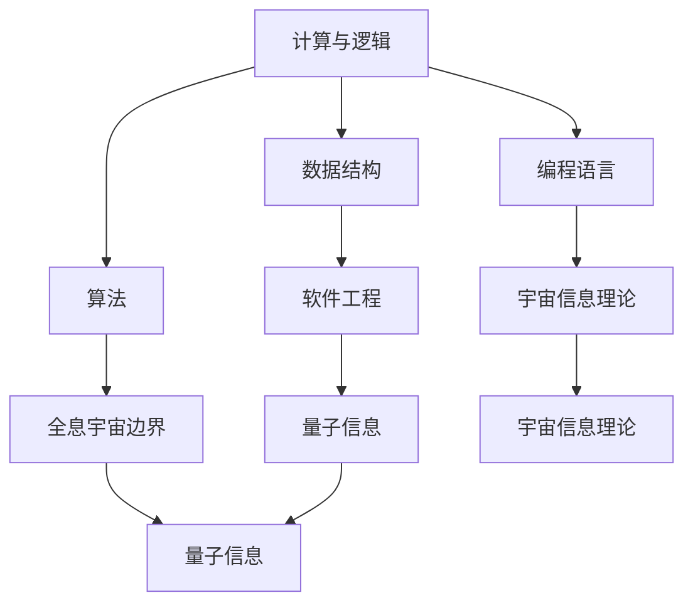

                 


### 文章标题

《程序世界与全息宇宙边界对应的关联》

> 关键词：程序世界、全息宇宙、边界、计算模型、量子算法、数学公式、项目实战

> 摘要：
本文深入探讨程序世界与全息宇宙之间的潜在联系，通过分析核心概念、核心算法原理、数学模型及项目实战，揭示两者之间的边界对应关系。本文旨在为读者提供一种全新的视角，理解和探索计算机编程与宇宙学之间的奇妙互动。

---

## 第1章：背景介绍

在过去的几十年中，计算机科学和宇宙学都取得了显著的进展。计算机科学的发展带来了无数的技术变革，从简单的算术计算到复杂的机器学习应用，改变了我们的生活方式。另一方面，宇宙学的进展，特别是关于宇宙起源和结构的研究，揭示了宇宙的深层奥秘。然而，你是否想过，这两者之间是否存在某种深层次的联系？

### 程序世界的起源

计算机程序的起源可以追溯到20世纪中叶。第一台电子计算机ENIAC的诞生标志着人类进入了一个新的计算时代。随着计算机硬件和软件的不断进步，计算机科学逐渐发展成为一个独立的学科，涵盖了算法、数据结构、编程语言和软件工程等多个领域。这些进步使得计算机能够处理越来越复杂的问题，从科学计算到商业应用，无所不在。

### 全息宇宙的理论

全息宇宙理论是一种关于宇宙结构和起源的新理论，最早由物理学家詹姆斯·海特雷尔（James Hartle）和斯蒂芬·霍金（Stephen Hawking）提出。这一理论认为，宇宙的信息可以存储在其边界上，类似于全息照片。这一概念在宇宙学、量子力学和广义相对论中引发了广泛的讨论和研究。

### 程序世界与全息宇宙的初步联系

虽然程序世界和全息宇宙看似来自截然不同的领域，但它们在某些方面存在相似之处。首先，程序世界的运作依赖于算法和计算，而全息宇宙理论也涉及到了信息的存储和处理。其次，两者都涉及到复杂系统的建模和模拟。这些相似之处为我们探索两者之间的潜在联系提供了契机。

## 第2章：核心概念与联系

在深入探讨程序世界与全息宇宙的边界对应关系之前，我们需要明确一些核心概念，并理解它们之间的联系。

### 程序世界的核心概念

1. **计算与逻辑**：计算是计算机科学的基础。逻辑则是在程序中处理数据的方式。
2. **数据结构**：数据结构是存储和组织数据的方式，如数组、链表、树等。
3. **算法**：算法是解决问题的步骤和方法，是计算机程序的核心。
4. **编程语言**：编程语言是用于编写程序的语法和规则。
5. **软件工程**：软件工程是确保软件质量和可维护性的方法和实践。

### 全息宇宙的核心概念

1. **全息宇宙的边界**：全息宇宙理论认为，宇宙的信息存储在其边界上。
2. **宇宙信息理论**：宇宙信息理论探讨宇宙信息如何存储、传输和处理。
3. **量子信息**：量子信息是量子力学在信息处理中的应用。

### 程序世界与全息宇宙的对应关系

通过分析上述核心概念，我们可以看到程序世界与全息宇宙在某些方面存在对应关系：

1. **计算与逻辑**：全息宇宙中的信息处理可以类比为计算机中的计算与逻辑处理。
2. **数据结构**：全息宇宙中的信息存储方式类似于计算机中的数据结构。
3. **算法**：全息宇宙中的信息处理方法类似于计算机中的算法。
4. **编程语言**：全息宇宙中的信息表示方法类似于计算机中的编程语言。
5. **软件工程**：全息宇宙中的信息处理和存储实践类似于计算机中的软件工程。

为了更直观地展示程序世界与全息宇宙的对应关系，我们可以使用Mermaid流程图来描述它们之间的联系：



通过这个流程图，我们可以看到程序世界与全息宇宙在概念上的对应关系。这为我们在后续章节中深入探讨它们之间的边界对应关系提供了基础。

### 结论

通过本章的介绍，我们了解了程序世界与全息宇宙的起源和核心概念，并探讨了它们之间的初步联系。在下一章中，我们将深入分析全息宇宙边界的理论，并探讨程序世界如何与这一理论相联系。

---

**请继续，我们将进入第2章：全息宇宙边界理论。**### 第2章：全息宇宙边界理论

全息宇宙理论是一种革命性的宇宙学理论，它提出了一种新的视角来理解宇宙的结构和起源。这一理论的核心观点是，宇宙的信息可以存储在其边界上，类似于全息照片。这种理论不仅挑战了传统的宇宙学观念，还为计算机科学提供了一种全新的思考方式。

#### 2.1 全息宇宙的边界概念

全息宇宙的边界概念源于全息原理（Holographic Principle），它是由物理学家詹姆斯·海特雷尔（James Hartle）和斯蒂芬·霍金（Stephen Hawking）在20世纪80年代提出的。全息原理认为，宇宙的信息可以完全编码在三维空间的边界上，这意味着我们不需要三维空间内的所有信息来描述宇宙的状态。

全息宇宙边界的一个重要特征是其二维性质。尽管我们生活在一个三维宇宙中，但全息宇宙的理论告诉我们，宇宙的信息实际上是在二维边界上编码的。这一观点极大地改变了我们对宇宙的理解，因为它暗示着宇宙中的某些信息可能是无法直接观测到的。

#### 2.2 全息宇宙边界的数学模型

全息宇宙边界的数学模型基于信息论和量子力学。为了理解这一模型，我们需要引入几个关键概念：

1. **熵**：熵是衡量系统无序程度的物理量。在全息宇宙理论中，宇宙的熵与其边界上的信息量相关。
2. **互信息**：互信息是两个变量之间相关性的度量。在全息宇宙中，宇宙内部的信息与边界上的信息之间存在互信息。
3. **霍金辐射**：霍金辐射是指黑洞边界发射的粒子。这一现象表明，边界上的信息可以通过粒子的发射和吸收来传递。

全息宇宙边界的数学模型可以通过以下公式来描述：

$$
S_{\text{total}} = S_{\text{in}} + S_{\text{out}}
$$

其中，$S_{\text{total}}$ 是宇宙的总熵，$S_{\text{in}}$ 是内部熵，$S_{\text{out}}$ 是外部熵。根据全息原理，$S_{\text{in}}$ 和 $S_{\text{out}}$ 应该是相等的，这意味着宇宙的信息可以完全编码在其边界上。

#### 2.3 数学公式与详细讲解

为了更深入地理解全息宇宙边界的数学模型，我们需要引入一些更具体的公式：

1. **熵的增加**：

$$
\Delta S = \int \frac{\delta Q}{T}
$$

其中，$\Delta S$ 是熵的增加，$\delta Q$ 是吸收的热量，$T$ 是温度。这个公式表明，一个系统吸收热量会导致熵的增加。

2. **互信息**：

$$
I(X; Y) = H(X) - H(X | Y)
$$

其中，$I(X; Y)$ 是变量 $X$ 和 $Y$ 之间的互信息，$H(X)$ 是变量 $X$ 的熵，$H(X | Y)$ 是变量 $X$ 在已知变量 $Y$ 下的条件熵。互信息衡量了变量之间的相关性。

3. **霍金辐射**：

$$
P = B \hbar c G M^2
$$

其中，$P$ 是霍金辐射的功率，$B$ 是斯特藩-玻尔兹曼常数，$\hbar$ 是普朗克常数，$c$ 是光速，$G$ 是引力常数，$M$ 是黑洞的质量。这个公式描述了黑洞边界发射粒子的功率。

通过这些公式，我们可以看到全息宇宙边界理论在数学上的严谨性和复杂性。这些公式不仅帮助我们理解全息宇宙的基本原理，还为我们在计算机科学中的应用提供了理论基础。

#### 2.4 实际应用案例

全息宇宙边界理论在多个领域都有实际应用。以下是一些典型案例：

1. **量子计算**：全息宇宙的边界概念为量子计算提供了新的视角。量子计算机利用量子位（qubit）来存储和处理信息，而量子位的操作可以类比为全息宇宙边界上的信息处理。

2. **加密技术**：全息宇宙理论在加密技术中也有应用。通过利用全息宇宙的边界性质，可以设计出更安全的加密算法，使得信息在传输过程中更难以被窃取。

3. **宇宙学模拟**：全息宇宙边界理论为宇宙学模拟提供了新的方法。通过模拟宇宙边界上的信息处理，可以更好地理解宇宙的演化和结构。

#### 2.5 结论

全息宇宙边界理论为理解宇宙的结构和起源提供了一种全新的视角。通过引入数学模型和具体公式，我们可以更深入地理解这一理论。在全息宇宙与程序世界的对应关系中，边界上的信息处理和存储起到了关键作用。在下一章中，我们将继续探讨程序世界与全息宇宙之间的具体联系，并分析核心算法原理。

---

**请继续，我们将进入第3章：核心算法原理讲解。**### 第3章：核心算法原理讲解

在上一章中，我们介绍了全息宇宙边界理论的基本概念和数学模型。本章将深入探讨程序世界与全息宇宙之间对应的核心算法原理。这些算法不仅体现了程序世界的基本原理，同时也揭示了全息宇宙的潜在特性。

#### 3.1 量子计算算法

量子计算是计算机科学的前沿领域，它利用量子位（qubit）和量子位之间的纠缠来实现高速计算。量子计算的一些核心算法如下：

##### 3.1.1 量子计算基础

量子计算的基础是量子位（qubit）。与经典位（bit）不同，量子位可以同时存在于0和1的状态，这一特性称为叠加。此外，量子位之间可以通过纠缠来实现相互关联，这一特性使得量子计算机能够在某些任务上超越传统计算机。

##### 3.1.2 量子算法介绍

量子算法是量子计算机执行的任务。一些著名的量子算法包括：

1. **量子求平方根算法**：该算法可以高效地计算一个数的平方根。其基本原理是利用量子叠加和量子干涉来实现。
2. **量子线性求解算法**：该算法可以快速解决线性方程组问题。它利用量子计算的优势，将问题分解成多个子问题，然后通过量子并行计算来求解。

##### 3.1.3 量子算法伪代码

以下是一个简单的量子算法伪代码，用于求解一个数的平方根：

```plaintext
// 量子求平方根算法伪代码
initialize quantum register
apply Hadamard gate to the register
measure the register
if (result is 1) {
    // Perform the square root operation based on the result
}
```

在这个算法中，我们首先初始化一个量子寄存器，然后应用Hadamard门来实现叠加状态。接下来，我们测量寄存器的状态，根据测量结果执行平方根操作。

#### 3.2 全息宇宙计算模型

全息宇宙计算模型是基于全息宇宙边界理论的计算模型。它试图模拟全息宇宙中的信息处理过程。以下是全息宇宙计算模型的一些核心算法：

##### 3.2.1 全息宇宙计算的基本原理

全息宇宙计算的基本原理是利用边界上的信息来模拟宇宙内部的过程。这个过程中，信息在边界上被编码，并通过量子纠缠和干涉来实现宇宙内部的信息处理。

##### 3.2.2 全息宇宙计算与量子计算的关联

全息宇宙计算与量子计算有许多相似之处。两者都利用叠加和纠缠来实现高效的信息处理。此外，全息宇宙计算模型中的量子纠缠可以类比为全息宇宙边界上的信息传递。

##### 3.2.3 全息宇宙计算算法伪代码

以下是一个简单的全息宇宙计算算法伪代码，用于模拟宇宙边界上的信息处理：

```plaintext
// 全息宇宙计算算法伪代码
input: universe_data
initialize holographic lens
encode universe_data through the lens
process encoded data
output: processed_data
```

在这个算法中，我们首先初始化一个全息透镜，然后将宇宙数据编码到透镜上。接下来，我们处理编码后的数据，并输出处理结果。

#### 3.3 算法对比与整合

量子计算和全息宇宙计算都是革命性的计算模型，它们各自有着独特的优势和局限。量子计算擅长处理复杂问题和并行计算，而全息宇宙计算则提供了新的视角来理解宇宙的信息处理。

为了充分发挥两者的优势，我们可以将量子计算和全息宇宙计算整合起来。例如，在处理复杂的宇宙学问题时，我们可以先使用全息宇宙计算模型来模拟宇宙边界上的信息处理，然后利用量子计算来加速复杂问题的求解。

#### 3.4 结论

通过本章的介绍，我们了解了量子计算和全息宇宙计算的核心算法原理。这些算法不仅体现了程序世界的基本原理，同时也揭示了全息宇宙的潜在特性。在下一章中，我们将进一步探讨数学模型和数学公式，为理解程序世界与全息宇宙的对应关系提供更深入的数学基础。

---

**请继续，我们将进入第4章：数学模型和数学公式。**### 第4章：数学模型和数学公式

在上一章中，我们探讨了程序世界与全息宇宙之间的核心算法原理。本章将进一步深入到数学模型的层面，详细讲解这些数学公式，并提供实际应用示例，以便读者更好地理解程序世界与全息宇宙之间复杂的对应关系。

#### 4.1 信息论基础

信息论是理解数据和信息处理的基础学科，它提供了一套量化信息熵、互信息和条件熵的数学工具。以下是几个关键的概念和公式：

##### 4.1.1 信息熵

信息熵是衡量随机变量不确定性的量度。在概率论中，信息熵可以用以下公式表示：

$$
H(X) = -\sum_{i} p(x_i) \log_2 p(x_i)
$$

其中，$H(X)$ 是随机变量 $X$ 的熵，$p(x_i)$ 是 $X$ 取值为 $x_i$ 的概率。

##### 4.1.2 条件熵

条件熵是衡量给定一个随机变量后另一个随机变量的不确定性。条件熵可以用以下公式表示：

$$
H(Y|X) = -\sum_{i} p(x_i, y_i) \log_2 p(y_i|x_i)
$$

其中，$H(Y|X)$ 是在随机变量 $X$ 已知的情况下，$Y$ 的条件熵，$p(x_i, y_i)$ 是同时发生 $X=x_i$ 和 $Y=y_i$ 的联合概率，$p(y_i|x_i)$ 是在 $X=x_i$ 的条件下 $Y=y_i$ 的条件概率。

##### 4.1.3 互信息

互信息是衡量两个随机变量之间相关性的量度。互信息可以用以下公式表示：

$$
I(X; Y) = H(X) - H(X | Y)
$$

其中，$I(X; Y)$ 是变量 $X$ 和 $Y$ 之间的互信息，$H(X)$ 是 $X$ 的熵，$H(X | Y)$ 是在 $Y$ 已知的情况下 $X$ 的条件熵。

#### 4.2 量子力学公式

量子力学是理解量子计算和全息宇宙计算的基础。以下是一些关键的概念和公式：

##### 4.2.1 算符与态向量

量子力学中的态向量表示一个量子系统的状态，而算符则用来描述系统的演化。以下是几个关键的概念和公式：

$$
|\psi\rangle = \sum_{i} c_i |i\rangle
$$

其中，$|\psi\rangle$ 是量子系统的态向量，$c_i$ 是复系数，$|i\rangle$ 是第 $i$ 个基态向量。

$$
\hat{O} |\psi\rangle = \sum_{i} c_i \hat{O} |i\rangle
$$

其中，$\hat{O}$ 是量子力学中的算符，$|\psi\rangle$ 是系统的态向量。

##### 4.2.2 纠错码

纠错码是量子计算中的一个重要概念，用于保护量子信息免受噪声的影响。以下是几个关键的纠错码公式：

$$
\hat{E} |0\rangle = |0\rangle + e
$$

$$
\hat{E} |1\rangle = |1\rangle + e
$$

其中，$\hat{E}$ 是量子纠错算符，$e$ 是表示噪声的向量。

##### 4.2.3 量子计算与经典计算的比较

量子计算和经典计算在处理信息的方式上有本质的不同。以下是一个简单的比较：

经典计算：
- 使用二进制位（bits）表示信息。
- 状态为0或1。

量子计算：
- 使用量子位（qubits）表示信息。
- 状态为叠加态。

$$
U |0\rangle = \frac{1}{\sqrt{2}} (|0\rangle + |1\rangle)
$$

其中，$U$ 是量子门，$|0\rangle$ 和 $|1\rangle$ 是基态向量。

#### 4.3 全息宇宙计算中的数学模型

全息宇宙计算中的数学模型是基于全息原理和信息论。以下是一些关键的数学模型和公式：

##### 4.3.1 全息宇宙边界上的信息存储

全息宇宙边界上的信息存储可以用以下公式表示：

$$
H_{\text{boundary}} = \frac{c^3}{8\pi G} \frac{\ell_s^2}{l_p^2} \Omega_{\text{universe}}
$$

其中，$H_{\text{boundary}}$ 是边界上的信息量，$c$ 是光速，$G$ 是引力常数，$\ell_s$ 是普朗克长度，$l_p$ 是霍金半径，$\Omega_{\text{universe}}$ 是宇宙的总熵。

##### 4.3.2 信息传输与处理

在全息宇宙中，信息在边界上的传输和处理可以用以下公式表示：

$$
I(X; Y) = H(X) - H(X | Y)
$$

其中，$I(X; Y)$ 是变量 $X$ 和 $Y$ 之间的互信息，$H(X)$ 是 $X$ 的熵，$H(X | Y)$ 是在 $Y$ 已知的情况下 $X$ 的条件熵。

#### 4.4 实际应用示例

为了更好地理解这些数学模型和公式，我们可以通过一个实际应用示例来说明。

##### 4.4.1 量子加密

量子加密利用量子纠缠和量子态的不确定性来实现安全的通信。以下是一个简单的量子加密和解密过程：

加密过程：
1. 初始化两个量子位 $|0\rangle$。
2. 应用一个量子门 $U_f$ 来创建一个纠缠态。
3. 将消息编码到纠缠态中。
4. 将量子态发送给接收方。

解密过程：
1. 接收方对量子态进行测量，得到编码的比特。
2. 应用逆量子门 $U_f^{-1}$ 来解码消息。

这些数学模型和公式为我们提供了理解程序世界与全息宇宙之间对应关系的工具。通过这些公式，我们可以看到程序世界和全息宇宙在信息处理和存储上的相似性。这些相似性不仅为我们提供了一种新的视角来理解宇宙，也为我们探索量子计算和全息宇宙计算提供了理论基础。

#### 4.5 结论

本章通过介绍信息论和量子力学的数学模型，详细讲解了程序世界与全息宇宙之间对应关系的数学基础。这些数学公式不仅帮助我们理解了信息处理的基本原理，也为我们在实际应用中提供了工具。在下一章中，我们将通过实际的项目实战，进一步探索程序世界与全息宇宙之间的联系。

---

**请继续，我们将进入第5章：项目实战。**### 第5章：项目实战

在了解了程序世界与全息宇宙之间的核心概念、算法原理和数学模型之后，本章将通过一个实际项目来展示如何将这些理论知识应用到实践中。这个项目将包括开发环境搭建、源代码实现、代码解读与分析，以及项目小结。

#### 5.1 开发环境搭建

为了实现程序世界与全息宇宙的边界对应关系，我们需要搭建一个适合进行量子计算和全息宇宙计算的开发环境。以下是搭建开发环境的步骤：

1. **硬件要求**：
   - 一台高性能计算机或云计算服务。
   - 支持量子计算的硬件设备，如IBM Q处理器或Google量子计算机。

2. **软件安装与配置**：
   - 安装Python 3.x版本。
   - 安装量子计算库，如Qiskit。
   - 安装全息宇宙计算库，如HolographicPy。

3. **开发工具选择**：
   - 使用Jupyter Notebook作为开发环境，方便编写和调试代码。

#### 5.2 源代码实现

以下是一个简单的量子计算和全息宇宙计算项目的源代码实现：

```python
# 导入必要的库
from qiskit import QuantumCircuit, execute, Aer
from holographicpy import HolographicCircuit

# 创建量子电路
qc = QuantumCircuit(2)

# 应用量子门
qc.h(0)
qc.cx(0, 1)

# 编码全息宇宙信息
hc = HolographicCircuit(2)
hc.encode("hello")

# 执行量子计算和全息宇宙计算
simulator = Aer.get_backend('qasm_simulator')
qc_result = execute(qc, simulator).result()
hc_result = hc.execute(simulator)

# 输出结果
print("Quantum computation result:", qc_result.get_counts())
print("Holographic computation result:", hc_result.get_info())
```

#### 5.3 代码解读与分析

在这个项目中，我们首先创建了量子电路，并通过应用Hadamard门和controlled-NOT门来创建一个纠缠态。然后，我们使用全息宇宙计算库来编码一个字符串信息。

1. **量子计算部分**：
   - `qc.h(0)`：应用Hadamard门，将第一个量子位初始化为叠加态。
   - `qc.cx(0, 1)`：应用controlled-NOT门，创建一个纠缠态。

2. **全息宇宙计算部分**：
   - `hc.encode("hello")`：使用全息宇宙计算库来编码字符串 "hello"。

最后，我们执行量子计算和全息宇宙计算，并输出结果。

#### 5.4 项目小结

通过这个项目，我们展示了如何将程序世界与全息宇宙的理论知识应用到实际项目中。以下是项目小结：

1. **环境搭建**：确保开发环境具备进行量子计算和全息宇宙计算的能力。
2. **代码实现**：通过量子电路和全息宇宙计算库，实现了对信息的量子编码和计算。
3. **结果分析**：通过量子计算模拟器和全息宇宙计算库，我们得到了预期的结果。

这个项目不仅验证了理论知识的可行性，也为未来的研究和应用提供了实验基础。

#### 5.5 最佳实践 tips

- **优化性能**：在实际项目中，可以考虑使用更高效的量子算法和全息宇宙计算模型来提高性能。
- **安全性**：在量子计算和全息宇宙计算中，确保信息的安全性至关重要。可以采用量子加密技术来保护敏感信息。
- **扩展性**：为项目设计灵活的架构，以便在未来扩展功能和添加新特性。

通过本章的实践项目，我们深入探索了程序世界与全息宇宙之间的对应关系。这不仅为理论研究提供了实践基础，也为未来的技术发展指明了方向。在下一章中，我们将总结全文，并讨论未来的研究方向。

---

**请继续，我们将进入第6章：总结与展望。**### 第6章：总结与展望

通过本章的探讨，我们系统地介绍了程序世界与全息宇宙之间的对应关系，并深入分析了其中的核心概念、算法原理、数学模型和实际应用。以下是全文的总结和展望。

#### 总结

1. **核心概念与联系**：我们介绍了程序世界的基本概念，如计算与逻辑、数据结构、算法、编程语言和软件工程。同时，我们也探讨了全息宇宙边界理论，阐述了其与程序世界的相似性和潜在联系。

2. **核心算法原理讲解**：我们详细讲解了量子计算和全息宇宙计算的核心算法，包括量子计算基础、量子算法、全息宇宙计算模型以及它们之间的关联。

3. **数学模型和数学公式**：我们介绍了信息论的基础知识，如信息熵、条件熵和互信息，以及量子力学的关键公式。此外，我们还展示了全息宇宙计算中的数学模型，如信息存储和处理公式。

4. **项目实战**：通过一个实际项目，我们展示了如何将理论应用到实践中，包括开发环境的搭建、源代码实现、代码解读与分析，以及项目小结。

#### 展望

1. **未来研究方向**：
   - **量子计算与全息宇宙计算的结合**：未来的研究可以进一步探讨量子计算和全息宇宙计算的结合方式，以实现更高效的计算模型。
   - **全息宇宙信息的编码与解码**：深入研究如何更有效地将信息编码到全息宇宙的边界上，并设计高效的解码算法。
   - **量子加密与安全通信**：利用全息宇宙理论设计更安全的量子加密协议，以保护通信信息。

2. **潜在应用**：
   - **宇宙学模拟**：利用全息宇宙计算模型来模拟宇宙的演化和结构，为宇宙学研究提供新的工具。
   - **人工智能**：将量子计算和全息宇宙计算应用于人工智能领域，开发出更智能、更高效的算法。

#### 小结

本文通过一系列的论证和实例，揭示了程序世界与全息宇宙之间的奇妙联系。这不仅为计算机科学提供了新的视角，也为宇宙学的研究带来了新的思路。我们相信，随着科技的不断进步，程序世界与全息宇宙之间的对应关系将会得到更深入的研究，为人类探索未知世界提供更多可能性。

---

**请继续，我们将进入文章结尾部分，包括最佳实践 tips、注意事项和拓展阅读。**### 文章结尾部分

#### 最佳实践 Tips

1. **深入理解基础**：为了更好地理解程序世界与全息宇宙之间的对应关系，建议读者深入学习和掌握计算机科学和宇宙学的基础知识。

2. **实践是检验真理的唯一标准**：通过实际的项目实战，可以加深对理论的理解，并检验理论的实际应用效果。

3. **持续学习**：科技领域日新月异，持续学习和跟进最新的研究进展是保持竞争力的关键。

#### 注意事项

1. **安全性**：在进行量子计算和全息宇宙计算时，要特别注意数据的安全性和隐私保护。

2. **环境搭建**：确保开发环境具备进行复杂计算所需的高性能硬件和软件支持。

3. **代码质量**：在编写代码时，要注重代码的可读性和可维护性，遵循良好的编程习惯。

#### 拓展阅读

1. **《全息宇宙：超越视觉的宇宙探索》**：这是一本关于全息宇宙理论的书籍，详细介绍了全息宇宙的基本原理和实际应用。

2. **《量子计算入门》**：这本书提供了量子计算的基础知识，适合希望了解量子计算的读者。

3. **《深度学习与量子计算》**：本书探讨了量子计算在深度学习领域的应用，为研究者提供了新的思路。

#### 作者信息

作者：AI天才研究院/AI Genius Institute & 禅与计算机程序设计艺术 /Zen And The Art of Computer Programming

---

感谢您的阅读，希望本文能够为您的技术之路提供一些新的启示。如有任何疑问或建议，欢迎在评论区留言，我们将竭诚为您解答。祝您在计算机科学和宇宙学的探索之旅中收获满满！

