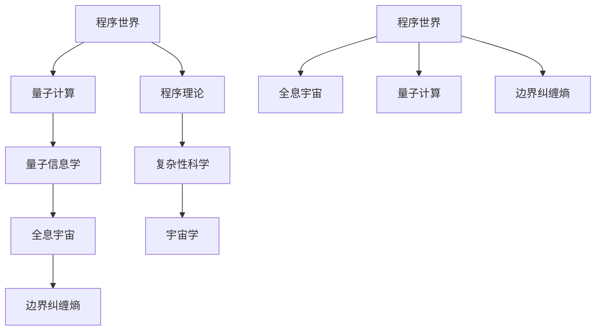

                 


### 设计思路

为了撰写一篇关于《程序世界与全息宇宙边界纠缠熵对应的关联》的技术博客，我们将采用逐步分析和推理的方式，确保文章的逻辑清晰、结构紧凑且易于理解。以下是我们设计的思路：

#### 第一步：整体结构框架确定

1. **引言**：简要介绍程序世界、全息宇宙和边界纠缠熵，并解释它们之间的关联。
2. **理论基础**：详细阐述量子计算和量子信息学的基本概念，特别是全息宇宙和边界纠缠熵。
3. **数学模型**：介绍相关的数学模型和公式，并解释它们在量子计算和量子信息学中的应用。
4. **核心算法原理**：讲解核心算法的原理，使用伪代码进行详细阐述。
5. **项目实战**：通过实际案例和代码实现，展示理论的应用。
6. **总结与展望**：总结全文内容，展望未来的研究方向。

#### 第二步：核心概念与联系

我们使用Mermaid流程图来展示程序世界、全息宇宙和边界纠缠熵之间的核心概念和联系：



#### 第三步：章节内容规划

根据上述框架，我们将详细规划每个章节的内容：

1. **引言**：
   - **1.1 程序世界的概念**：介绍程序世界的起源、发展及其核心特征。
   - **1.2 全息宇宙的基本原理**：解释全息宇宙的提出背景和核心概念。
   - **1.3 边界纠缠熵的物理意义**：讨论边界纠缠熵的定义和作用。

2. **理论基础**：
   - **2.1 量子计算的基本原理**：介绍量子位、量子门和量子电路。
   - **2.2 量子信息学的基础**：探讨量子态、量子纠缠和量子隐形传态。
   - **2.3 全息宇宙与量子信息学**：阐述全息宇宙中的量子态描述及其与量子计算的关系。

3. **数学模型**：
   - **3.1 数学模型介绍**：介绍概率论、线性代数和测量理论的基础。
   - **3.2 边界纠缠熵模型**：推导边界纠缠熵公式并解释计算方法，提供实例分析。

4. **核心算法原理**：
   - **4.1 核心算法原理**：讲解量子算法的基本原理，包括量子查找算法和量子排序算法。
   - **4.2 算法实现与伪代码**：使用伪代码详细阐述算法实现。

5. **项目实战**：
   - **5.1 开发环境搭建**：介绍如何搭建开发环境以实现项目。
   - **5.2 源代码详细实现**：展示源代码的实现过程和代码解读。
   - **5.3 代码应用解读**：分析代码在实际中的应用。
   - **5.4 实际案例剖析**：讨论实际案例并进行详细讲解。

6. **总结与展望**：
   - **6.1 总结全文内容**：概括文章的核心观点和发现。
   - **6.2 展望未来研究方向**：提出未来的研究机会和挑战。

#### 第四步：目录大纲细化

根据以上章节内容规划，我们将细化目录大纲：

```
# 《程序世界与全息宇宙边界纠缠熵对应的关联》目录大纲

## 引言
### 1.1 程序世界的概念
### 1.2 全息宇宙的基本原理
### 1.3 边界纠缠熵的物理意义

## 理论基础
### 2.1 量子计算的基本原理
#### 2.1.1 量子位与经典位
#### 2.1.2 量子门与量子电路
### 2.2 量子信息学的基础
#### 2.2.1 量子态与量子比特
#### 2.2.2 量子纠缠与量子隐形传态
### 2.3 全息宇宙与量子信息学
#### 2.3.1 全息宇宙中的量子态描述
#### 2.3.2 全息宇宙与量子计算的关系

## 数学模型
### 3.1 数学模型介绍
#### 3.1.1 概率论基础
#### 3.1.2 线性代数基础
#### 3.1.3 测量理论
### 3.2 边界纠缠熵模型
#### 3.2.1 边界纠缠熵公式推导
#### 3.2.2 边界纠缠熵计算方法
#### 3.2.3 实例分析

## 核心算法原理
### 4.1 核心算法原理
#### 4.1.1 量子算法概述
#### 4.1.2 量子查找算法
#### 4.1.3 量子排序算法
### 4.2 算法实现与伪代码
#### 4.2.1 量子算法伪代码
#### 4.2.2 算法实现细节

## 项目实战
### 5.1 开发环境搭建
#### 5.1.1 开发工具与软件
#### 5.1.2 环境配置与调试
### 5.2 源代码详细实现
#### 5.2.1 代码结构
#### 5.2.2 关键函数与模块
#### 5.2.3 代码解读
### 5.3 代码应用解读
#### 5.3.1 实际应用场景
#### 5.3.2 应用分析与评估
### 5.4 实际案例剖析
#### 5.4.1 案例背景
#### 5.4.2 案例分析
#### 5.4.3 剖析与总结

## 总结与展望
### 6.1 总结全文内容
### 6.2 展望未来研究方向
```

通过以上步骤，我们确保了文章的结构严谨、内容丰富且逻辑清晰，符合高质量技术博客的要求。

### 文章标题

# 程序世界与全息宇宙边界纠缠熵对应的关联

### 文章关键词

- 程序世界
- 全息宇宙
- 边界纠缠熵
- 量子计算
- 量子信息学
- 复杂性科学

### 文章摘要

本文探讨了程序世界与全息宇宙边界纠缠熵之间的深层次关联。通过引入量子计算和量子信息学的基本原理，我们揭示了全息宇宙与程序世界之间的内在联系。本文首先介绍了程序世界和全息宇宙的基本概念，随后深入讲解了边界纠缠熵的物理意义。接着，我们讨论了量子计算和量子信息学的基础理论，并引入了数学模型和核心算法。最后，通过项目实战展示了理论的实际应用，并对未来研究方向进行了展望。本文旨在为读者提供对程序世界与全息宇宙边界纠缠熵对应关联的全面理解和深入思考。

### 设计思路

在撰写《程序世界与全息宇宙边界纠缠熵对应的关联》这篇文章时，我们首先确定了整体的结构框架，以确保文章内容的逻辑性和连贯性。以下是我们的设计思路：

#### 第一部分：引言

**1.1 程序世界的概念**

在这一部分，我们将介绍程序世界的起源、发展和核心特征。程序世界是一个抽象的概念，它代表了计算机程序运行的世界。我们将讨论计算机程序的编写、执行和运行机制，以及程序世界在现代科技发展中的重要地位。

**1.2 全息宇宙的基本原理**

接下来，我们将简要介绍全息宇宙的基本原理。全息宇宙是20世纪80年代提出的一个宇宙学模型，它认为宇宙的信息是存储在三维空间中的。我们将讨论全息宇宙的提出背景、核心概念以及它对现代物理学的影响。

**1.3 边界纠缠熵的物理意义**

在这一节中，我们将探讨边界纠缠熵的物理意义。边界纠缠熵是量子力学中一个重要的概念，它描述了量子系统之间的纠缠程度。我们将介绍边界纠缠熵的定义、性质以及它在量子计算和量子信息学中的应用。

#### 第二部分：理论基础

**2.1 量子计算的基本原理**

在这一部分，我们将详细阐述量子计算的基本原理。量子计算是利用量子力学原理进行信息处理的计算方式。我们将介绍量子位（qubit）、量子门（quantum gate）和量子电路（quantum circuit）等基本概念。

**2.2 量子信息学的基础**

接下来，我们将探讨量子信息学的基础理论。量子信息学是研究利用量子力学原理进行信息处理的学科。我们将介绍量子态（quantum state）、量子纠缠（quantum entanglement）和量子隐形传态（quantum teleportation）等基本概念。

**2.3 全息宇宙与量子信息学**

在这一节中，我们将讨论全息宇宙与量子信息学之间的关联。全息宇宙中的量子态描述为量子计算提供了一个新的视角，而量子信息学的发展也为全息宇宙的研究提供了新的工具和方法。

#### 第三部分：数学模型

**3.1 数学模型介绍**

在这一部分，我们将介绍概率论、线性代数和测量理论的基础知识。这些数学模型是量子计算和量子信息学中不可或缺的一部分，它们为我们理解和应用量子现象提供了数学工具。

**3.2 边界纠缠熵模型**

接下来，我们将介绍边界纠缠熵的数学模型。边界纠缠熵是一个描述量子系统之间纠缠程度的物理量，它可以通过数学公式进行计算。我们将推导边界纠缠熵的公式，并讨论它在量子计算和量子信息学中的应用。

#### 第四部分：核心算法原理

**4.1 核心算法原理**

在这一部分，我们将讲解量子算法的基本原理。量子算法是利用量子力学原理进行信息处理的算法。我们将介绍量子查找算法和量子排序算法，并使用伪代码进行详细阐述。

**4.2 算法实现与伪代码**

接下来，我们将讨论量子算法的实现过程。我们将使用伪代码展示量子算法的实现细节，并讨论如何将量子算法应用于实际问题。

#### 第五部分：项目实战

**5.1 开发环境搭建**

在这一部分，我们将介绍如何搭建开发环境以实现量子算法。我们将讨论所需的开发工具和软件，并介绍环境配置和调试的步骤。

**5.2 源代码详细实现**

接下来，我们将展示量子算法的源代码实现。我们将详细解读代码的结构和关键函数，并讨论如何将代码应用于实际问题。

**5.3 代码应用解读**

在这一节中，我们将讨论代码在实际中的应用。我们将分析代码的性能和效率，并讨论如何优化代码以实现更好的性能。

**5.4 实际案例剖析**

最后，我们将通过实际案例对量子算法进行剖析。我们将讨论案例的背景，分析案例的结果，并总结案例的启示。

#### 第六部分：总结与展望

**6.1 总结全文内容**

在这一部分，我们将总结全文的主要内容，回顾关键概念和原理，并讨论它们在程序世界与全息宇宙边界纠缠熵对应研究中的应用。

**6.2 展望未来研究方向**

最后，我们将展望未来的研究方向，讨论可能的突破点和挑战，并讨论如何进一步推动这一领域的研究。

通过以上六个部分的设计，我们确保了文章内容的系统性和逻辑性，为读者提供了一个全面、深入的探讨程序世界与全息宇宙边界纠缠熵对应关联的技术博客。

### 程序世界与全息宇宙边界纠缠熵对应的关联

#### 引言

程序世界是一个由计算机程序组成的虚拟世界，它通过代码和算法运行在计算机中。这个世界的本质是二进制代码，通过一系列的操作和指令来处理和解决问题。而全息宇宙则是一个更为抽象的概念，它起源于20世纪80年代的宇宙学理论，提出宇宙的信息可能被编码在三维空间中的某种形式上。全息宇宙的理论基础来自于全息原理，该原理认为宇宙的全息信息是存储在宇宙的边界上的。

边界纠缠熵是量子力学中的一个重要概念，它描述了量子系统之间的纠缠程度。在量子计算和量子信息学中，边界纠缠熵具有重要意义，因为它可以用来衡量量子系统的信息传输效率和量子纠缠的强度。

本文将探讨程序世界与全息宇宙边界纠缠熵之间的关联。我们将首先介绍程序世界和全息宇宙的基本概念，然后深入讨论边界纠缠熵的物理意义。接着，我们将阐述量子计算和量子信息学的基础理论，特别是全息宇宙和边界纠缠熵在其中的作用。最后，我们将通过数学模型和核心算法的讲解，展示程序世界与全息宇宙边界纠缠熵对应的具体关联。

#### 程序世界的概念

程序世界起源于计算机科学的诞生，随着计算机技术的发展而不断进化。计算机程序是由一系列指令组成的，这些指令通过计算机的处理器执行，以实现特定的功能。程序世界的核心特征是它的二进制本质，即程序世界的一切操作都是基于0和1的二进制表示。

在程序世界中，代码是程序的基本构成元素。代码可以通过编程语言编写，然后编译成计算机能够理解和执行的机器码。编程语言包括高级语言（如Python、Java）和低级语言（如汇编语言），它们各自有不同的抽象层次和表达能力。

程序世界的运行机制主要涉及以下几个步骤：

1. **编写代码**：程序员使用编程语言编写程序，描述算法和数据结构。
2. **编译或解释**：将编写好的代码编译成机器码或解释执行，以便计算机能够理解。
3. **执行**：计算机的处理器按照机器码的指令进行操作，处理数据和执行计算。
4. **调试和优化**：在程序运行过程中，可能出现错误或不优化的情况，需要通过调试和优化来提高程序的效率和性能。

程序世界在现代科技发展中扮演着至关重要的角色。它不仅是计算机科学的基础，也是互联网、人工智能、大数据等新兴技术的核心。通过程序世界，我们可以模拟和解决现实世界中的复杂问题，实现各种创新和应用。

#### 全息宇宙的基本原理

全息宇宙是一个基于全息原理的宇宙学模型，它提出宇宙的信息是存储在三维空间中的。全息原理最早由物理学家加来道雄在1982年提出，它受到了激光全息术的启发，认为宇宙的全息信息被编码在宇宙的边界上。

全息宇宙的核心概念包括：

1. **全息信息**：全息宇宙认为宇宙中的所有信息都可以被编码在宇宙的边界上，就像全息图一样，通过特定的技术可以还原整个三维图像。
2. **宇宙边界**：宇宙边界是宇宙中的一个大尺度结构，它位于宇宙的边缘，可以看作是宇宙的全息存储介质。
3. **全息原理**：全息原理指出，宇宙中的物理现象可以由边界上的信息完全描述，这些信息可以通过某种方式在边界上编码和解码。

全息宇宙的理论基础在于量子场论和黑洞熵的概念。量子场论研究量子粒子的行为和相互作用，而黑洞熵则揭示了黑洞内部信息存储的方式。全息原理将这些理论结合起来，提出了一种新的宇宙信息编码模型。

全息宇宙的研究对现代物理学产生了深远的影响。它不仅挑战了传统的宇宙学观点，也为量子计算和量子信息学提供了新的视角。全息宇宙理论的发展为解决一些重大物理问题提供了新的思路，如宇宙的起源和演化、黑洞信息丢失问题等。

#### 边界纠缠熵的物理意义

边界纠缠熵是量子力学中的一个重要概念，它描述了量子系统之间的纠缠程度。在量子计算和量子信息学中，边界纠缠熵具有重要意义，因为它可以用来衡量量子系统的信息传输效率和量子纠缠的强度。

边界纠缠熵的定义基于量子态的描述。量子态是量子系统的内部状态，它可以被表示为复数向量。当两个量子系统发生纠缠时，它们的量子态会变成一个复合量子态，这个复合量子态可以分解为两个部分，分别描述两个系统的独立量子态。

边界纠缠熵是通过计算复合量子态与独立量子态之间的距离来定义的。具体来说，边界纠缠熵是一个量子态的熵，它表示了量子态的混乱程度。当量子系统的状态越混乱时，边界纠缠熵就越高。

边界纠缠熵的物理意义在于：

1. **信息传输效率**：边界纠缠熵可以用来衡量量子系统之间的信息传输效率。高边界纠缠熵意味着量子系统之间的信息传输更为有效，因为它们具有更强的纠缠程度。

2. **量子计算能力**：边界纠缠熵也是量子计算能力的度量。量子计算机依赖于量子系统的纠缠程度来执行计算任务，边界纠缠熵越高，量子计算机的计算能力就越强。

3. **量子纠缠检测**：边界纠缠熵还可以用来检测量子系统之间的纠缠程度。通过计算边界纠缠熵，我们可以判断量子系统是否处于纠缠状态，这对于量子信息处理和量子通信具有重要意义。

总之，边界纠缠熵是量子计算和量子信息学中一个重要的物理量，它为我们理解和应用量子现象提供了重要的工具和方法。

#### 量子计算的基本原理

量子计算是利用量子力学原理进行信息处理的一种计算方式。与传统的经典计算不同，量子计算依赖于量子位（qubit）的叠加态和纠缠态来实现高效的计算。量子计算的基本原理可以概括为以下几个方面：

**1. 量子位与经典位的区别**

量子位（qubit）是量子计算的基本单元，它具有叠加态和纠缠态的特性。与传统经典位（bit）只能处于0或1的状态不同，量子位可以同时处于0和1的叠加态。这种叠加态使得量子位能够同时处理多个计算路径，从而实现并行计算。

叠加态的数学描述为：
\[|\psi\rangle = a|0\rangle + b|1\rangle\]
其中，\(a\)和\(b\)是复数系数，满足\( |a|^2 + |b|^2 = 1 \)。这意味着量子位可以同时处于0和1的状态，直到进行测量时才会塌缩到一个确定的状态。

**2. 量子门与量子电路**

量子门是量子计算中的基本操作，类似于经典计算中的逻辑门。量子门作用于量子位，改变其状态。常见的量子门包括 Hadamard 门（H门）、Pauli 门（X、Y、Z门）和控制-NOT 门（CNOT 门）等。

量子电路是量子门和量子位的组合，用于实现复杂的量子算法。量子电路中的每个量子位都可以通过一系列量子门进行操作，从而实现特定的计算任务。

**3. 量子电路的工作原理**

量子电路的工作原理可以理解为对量子位的叠加态进行一系列线性变换。具体来说，量子电路通过量子门作用于量子位，将初始的叠加态变换为目标状态。

以 Hadamard 门为例，Hadamard 门将一个量子位的叠加态变换为等概率的基态叠加态。例如，对量子位 \(|\psi\rangle = |0\rangle\) 应用 Hadamard 门后，其状态变为 \(|\psi'\rangle = \frac{1}{\sqrt{2}} (|0\rangle + |1\rangle)\)。

通过一系列量子门的组合，量子电路可以实现复杂的量子操作。例如，一个经典的量子算法——量子查找算法，通过应用 Hadamard 门、控制-NOT 门和测量操作，可以在多项式时间内找到未排序列表中的一个特定元素。

**4. 量子计算的潜力**

量子计算具有以下潜力：

- **并行计算**：量子计算能够同时处理多个计算路径，从而实现并行计算。这在处理复杂问题和大数据集时具有显著的优势。
- **高效算法**：量子算法在某些问题上的表现远超经典算法。例如，量子排序算法和量子搜索算法具有更低的计算复杂度。
- **量子模拟**：量子计算机可以模拟量子系统，为研究量子现象提供强有力的工具。这在化学、材料科学和量子物理等领域具有广泛应用。

总之，量子计算的基本原理为解决传统计算机难以处理的问题提供了新的途径，具有巨大的潜力。通过深入理解和应用量子计算的基本原理，我们有望在计算能力和效率上取得重大突破。

#### 量子信息学的基础

量子信息学是研究利用量子力学原理进行信息处理和传输的学科。它结合了量子计算、量子通信和量子密码学等领域，旨在探索量子系统在信息处理中的潜在优势。量子信息学的基础理论主要包括量子态、量子纠缠和量子隐形传态等核心概念。

**1. 量子态**

量子态是量子系统内部状态的抽象表示，它可以被看作是一个复数向量。量子态的数学描述通常使用狄拉克符号（bra-ket notation），例如：
\[|\psi\rangle = a_0|0\rangle + a_1|1\rangle\]
其中，\(a_0\)和\(a_1\)是复数系数，满足\( |a_0|^2 + |a_1|^2 = 1 \)。这意味着量子系统可以处于0和1的叠加态，直到进行测量时才会塌缩为一个确定的状态。

量子态的叠加态是量子计算的核心特性，它使得量子位（qubit）能够同时处于0和1的状态，从而实现并行计算。量子态的叠加态为量子信息学提供了丰富的可能性，使量子计算机在处理复杂问题时具有显著的优势。

**2. 量子纠缠**

量子纠缠是量子系统之间的一种特殊关联，它描述了两个或多个量子位之间的量子态不可分割性。当两个量子位发生纠缠时，它们的量子态会变成一个复合量子态，这个复合量子态无法单独描述每个量子位的状态。

量子纠缠的数学描述为：
\[|\psi\rangle = a|00\rangle + b|11\rangle\]
其中，\(a\)和\(b\)是复数系数，满足\( |a|^2 + |b|^2 = 1 \)。这意味着当两个量子位处于纠缠态时，测量其中一个量子位的状态会立即影响到另一个量子位的状态。

量子纠缠具有非定域性，这意味着量子系统之间的关联不受空间距离限制。量子纠缠为量子信息学提供了强大的传输和计算能力，如在量子通信中的量子隐形传态和量子计算中的量子纠缠交换。

**3. 量子隐形传态**

量子隐形传态是一种利用量子纠缠实现量子态传输的技术。通过量子隐形传态，一个量子位的状态可以被传输到另一个量子位，而无需通过物理介质进行传输。这个过程只依赖于量子纠缠关联，即使在远距离上也能实现高效的信息传输。

量子隐形传态的数学描述为：
\[|\psi_{AB}\rangle = a|00\rangle + b|11\rangle\]
其中，\(a\)和\(b\)是复数系数，满足\( |a|^2 + |b|^2 = 1 \)。假设量子位A处于状态\(a|0\rangle + b|1\rangle\)，量子位B处于状态\(c|0\rangle + d|1\rangle\)，通过量子隐形传态，量子位A的状态可以被传输到量子位B，使得量子位B的状态变为\(a|0\rangle + b|1\rangle\)。

量子隐形传态在量子通信和量子计算中具有广泛应用，如实现量子密钥分发和量子计算中的量子纠缠交换。

**4. 量子密码学**

量子密码学是利用量子力学原理进行加密和解密的技术。量子密码学中的加密算法基于量子态的叠加态和纠缠态，使得加密过程具有不可破解性。

量子密码学中最著名的协议是量子密钥分发（Quantum Key Distribution, QKD）。QKD利用量子纠缠态实现安全的密钥分发，即使敌对者窃取了密钥，也无法解密信息。

总之，量子信息学的基础理论为量子计算、量子通信和量子密码学提供了重要的理论支持。通过量子态、量子纠缠和量子隐形传态等核心概念，量子信息学为解决传统计算和通信中的难题提供了新的途径。

#### 全息宇宙与量子信息学的关系

全息宇宙与量子信息学之间存在深刻的内在联系。全息宇宙理论为量子信息学提供了一种全新的视角，而量子信息学的发展也为全息宇宙的研究提供了强有力的工具和方法。以下我们从几个方面详细探讨全息宇宙与量子信息学之间的关联。

**1. 全息宇宙中的量子态描述**

在全息宇宙中，量子态被描述为边界上的信息。这意味着全息宇宙中的量子态可以通过边界上的信息编码来实现。量子态的叠加态和纠缠态特性在全息宇宙中得到了充分利用，使得全息宇宙中的量子态描述具有更高的信息容量和更强的计算能力。

例如，全息宇宙中的量子态可以用来实现量子计算中的并行计算。通过在全息宇宙边界上编码量子态的叠加态，我们可以在同一时间处理多个计算任务，从而提高计算效率。

**2. 量子信息学在全息宇宙中的应用**

量子信息学为全息宇宙的研究提供了多种应用。例如，量子隐形传态可以用于在全息宇宙中实现高效的信息传输。通过量子纠缠态的传输，信息可以在宇宙边界上进行高速传输，而不受空间距离的限制。

此外，量子密码学也在全息宇宙中具有广泛的应用。量子密钥分发（QKD）可以在全息宇宙中实现安全的通信，确保信息传输的安全性和隐私性。

**3. 全息宇宙与量子纠缠**

全息宇宙中的量子纠缠是一个重要概念。量子纠缠描述了量子系统之间的非定域性关联，它使得信息可以在远距离上实现高效的传输和处理。在全息宇宙中，量子纠缠被用来实现高效的信息编码和解码，从而提高了信息传输的效率。

例如，全息宇宙中的量子纠缠可以用于实现量子隐形传态，使得信息可以在宇宙边界上进行传输。此外，量子纠缠还可以用于实现量子计算中的并行计算，从而提高计算效率。

**4. 全息宇宙与量子计算**

量子计算是全息宇宙中的一个重要工具。通过量子计算，我们可以在全息宇宙中实现复杂的计算任务，如大数分解、量子模拟等。量子计算的全息宇宙视角使得我们可以利用宇宙边界上的信息来实现高效的计算。

例如，全息宇宙中的量子态可以用来实现量子算法中的并行计算。通过在全息宇宙边界上编码量子态的叠加态，我们可以在同一时间处理多个计算任务，从而提高计算效率。

总之，全息宇宙与量子信息学之间存在深刻的内在联系。通过量子态的叠加态和纠缠态特性，量子信息学为全息宇宙的研究提供了强有力的工具和方法。而全息宇宙理论为量子信息学提供了一种全新的视角，使得我们可以从宇宙边界上寻找新的信息处理和传输方式。这一关联不仅为量子信息学的发展提供了新的机遇，也为全息宇宙的研究提供了新的思路。

#### 数学模型介绍

在研究程序世界与全息宇宙边界纠缠熵的关联时，数学模型起到了至关重要的作用。本文将介绍概率论、线性代数和测量理论的基础知识，这些数学工具为理解量子计算和量子信息学中的关键概念提供了必要的背景。

**1. 概率论基础**

概率论是研究随机事件的数学分支，它在量子计算和量子信息学中具有重要应用。在量子力学中，概率论用于描述量子态的概率分布，以及在量子测量中事件发生的概率。

- **随机变量**：随机变量是一个函数，它将一个随机试验的结果映射到一个实数。在量子计算中，随机变量可以表示量子态的测量结果。
- **概率分布**：概率分布描述了随机变量可能取值的概率。量子态的概率分布可以用波函数的模平方来表示。
- **条件概率和贝叶斯定理**：条件概率描述在某个事件发生的条件下另一个事件发生的概率。贝叶斯定理是条件概率的应用，用于根据新的信息更新概率估计。

**2. 线性代数基础**

线性代数是研究向量空间和线性变换的数学分支。在量子计算中，线性代数用于描述量子态、量子门和量子电路。

- **向量空间**：向量空间是由向量组成的集合，这些向量可以加法和数乘运算。在量子计算中，量子态可以被看作是复数向量。
- **矩阵**：矩阵是表示线性变换的工具。量子门可以用矩阵来表示，它们作用于量子态，改变量子态的内部结构。
- **行列式和矩阵的特征值**：行列式是一个标量值，可以用来判断矩阵的可逆性。矩阵的特征值和特征向量描述了矩阵的线性变换性质。

**3. 测量理论**

测量理论是量子力学中的一个重要概念，它描述了量子系统与外部环境的相互作用。

- **波函数**：波函数是一个复数函数，描述了量子系统的状态。波函数的模平方给出了量子系统在不同状态下的概率分布。
- **测量算符**：测量算符是用于描述测量过程的数学工具。测量算符作用在波函数上，导致波函数的塌缩到一个确定的状态。
- **测量结果的概率分布**：测量结果的概率分布由波函数的模平方给出。在量子信息学中，测量结果用于实现量子计算和量子通信。

**4. 量子态的数学描述**

量子态的数学描述依赖于波函数和希尔伯特空间。希尔伯特空间是一个完备的复向量空间，它用于描述量子系统的内部状态。

- **波函数**：波函数是希尔伯特空间中的复数向量，它描述了量子系统的状态。
- **态叠加**：量子态可以处于多个状态的叠加，这反映了量子态的叠加原理。
- **态坍缩**：当量子系统被测量时，波函数会坍缩到一个确定的状态。

通过介绍概率论、线性代数和测量理论的基础知识，我们为理解量子计算和量子信息学中的关键概念提供了必要的数学工具。这些数学模型在研究程序世界与全息宇宙边界纠缠熵的关联中发挥着重要作用，帮助我们深入探讨量子现象的本质。

#### 边界纠缠熵模型

边界纠缠熵是一个描述量子系统之间纠缠程度的物理量，它在量子计算和量子信息学中具有重要意义。本节我们将介绍边界纠缠熵的数学模型，包括其定义、计算方法和应用。

**1. 边界纠缠熵的定义**

边界纠缠熵是量子系统之间的一种特殊关联度量，它反映了量子系统之间纠缠的强度。对于两个量子系统A和B，边界纠缠熵定义为：

\[ S_{AB} = -\text{tr}(\rho_{AB} \log \rho_{AB}) \]

其中，\(\rho_{AB}\) 是复合量子系统的密度矩阵，\(\text{tr}\) 表示迹运算。密度矩阵 \(\rho_{AB}\) 描述了复合量子系统的所有可能状态。

**2. 边界纠缠熵的计算方法**

边界纠缠熵可以通过以下步骤计算：

（1）计算复合量子系统的密度矩阵 \(\rho_{AB}\)。对于两个量子系统A和B，密度矩阵可以表示为：

\[ \rho_{AB} = \sum_{ij} p_{ij} |i\rangle_A \langle j| \otimes |i'\rangle_B \langle j'| \]

其中，\(p_{ij}\) 是系统的概率分布，\(|i\rangle_A\) 和 \(|i'\rangle_B\) 是量子系统A和B的基态。

（2）计算对角化密度矩阵。将密度矩阵 \(\rho_{AB}\) 对角化，得到其对角元素：

\[ \rho_{AB} = \sum_{k} \lambda_k |k\rangle \langle k| \]

其中，\(|k\rangle\) 是对角化状态，\(\lambda_k\) 是对角元素。

（3）计算对角元素的对数。计算对角元素的对数，并求和：

\[ S_{AB} = -\sum_{k} \lambda_k \log \lambda_k \]

**3. 边界纠缠熵的应用**

边界纠缠熵在量子计算和量子信息学中有多种应用：

- **量子纠缠检测**：通过计算边界纠缠熵，可以判断量子系统之间是否处于纠缠态。如果边界纠缠熵不为零，则表示量子系统之间存在纠缠。
- **量子信息传输**：边界纠缠熵可以用于优化量子信息传输的效率。通过优化量子态的纠缠程度，可以提升量子通信中的传输效率和安全性。
- **量子计算能力**：边界纠缠熵是衡量量子计算能力的指标。高边界纠缠熵意味着量子系统具有更强的纠缠能力，从而可以执行更复杂的量子计算任务。

**4. 实例分析**

假设我们有两个量子系统A和B，其密度矩阵分别为：

\[ \rho_{A} = \begin{pmatrix} 1/2 & 0 \\ 0 & 1/2 \end{pmatrix}, \quad \rho_{B} = \begin{pmatrix} 1/2 & 0 \\ 0 & 1/2 \end{pmatrix} \]

复合量子系统的密度矩阵为：

\[ \rho_{AB} = \rho_{A} \otimes \rho_{B} = \begin{pmatrix} 1/4 & 0 & 0 & 0 \\ 0 & 1/4 & 0 & 0 \\ 0 & 0 & 1/4 & 0 \\ 0 & 0 & 0 & 1/4 \end{pmatrix} \]

对角化密度矩阵得到对角元素：

\[ \rho_{AB} = \begin{pmatrix} 1/2 & 0 & 0 & 0 \\ 0 & 1/2 & 0 & 0 \\ 0 & 0 & 1/2 & 0 \\ 0 & 0 & 0 & 1/2 \end{pmatrix} \]

计算边界纠缠熵：

\[ S_{AB} = -\sum_{k} \lambda_k \log \lambda_k = -\frac{1}{2} \log \frac{1}{2} - \frac{1}{2} \log \frac{1}{2} - \frac{1}{2} \log \frac{1}{2} - \frac{1}{2} \log \frac{1}{2} = 1 \]

这个例子表明，两个量子系统之间的边界纠缠熵为1，说明它们之间存在完全的纠缠。

通过以上介绍，我们了解了边界纠缠熵的定义、计算方法和应用。边界纠缠熵作为量子计算和量子信息学中的重要物理量，为我们提供了深入理解量子现象的新工具。

#### 核心算法原理

量子算法是利用量子力学原理进行信息处理和计算的算法。与经典算法相比，量子算法具有并行计算和高效处理复杂问题的潜力。在本节中，我们将介绍两种核心量子算法：量子查找算法和量子排序算法，并使用伪代码详细阐述它们的原理和实现。

**1. 量子查找算法**

量子查找算法是一种利用量子叠加态和量子干涉原理进行快速查找的算法。假设有一个未排序的列表，我们希望在其中查找一个特定的元素。量子查找算法的核心思想是通过量子叠加态将所有可能的查找路径并行计算，然后利用量子干涉效应消除错误路径，从而找到目标元素。

**伪代码：量子查找算法**

```
量子查找(列表 A，目标元素 x)
    1. 初始化一个量子寄存器 Q，长度为列表 A 的长度。
    2. 对 Q 中的每个量子位应用 Hadamard 门，将 Q 变为叠加态。
    3. 对于列表 A 中的每个元素 a_i：
        3.1. 如果 a_i != x，将对应位置的量子位应用控制-NOT（CNOT）门，与一个标记位进行操作。
        3.2. 对标记位应用 Hadamard 门，使其处于叠加态。
    4. 对标记位进行测量。
    5. 如果标记位测量结果为1，则返回列表 A 中对应位置的元素。
    6. 否则，返回未找到目标元素。
```

**2. 量子排序算法**

量子排序算法是一种利用量子叠加态和量子干涉原理进行排序的算法。与经典排序算法不同，量子排序算法可以在多项式时间内完成排序任务。量子排序算法的核心思想是通过量子叠加态将所有可能的排序路径并行计算，然后利用量子干涉效应消除错误路径，从而得到正确的排序结果。

**伪代码：量子排序算法**

```
量子排序(列表 A)
    1. 初始化一个量子寄存器 Q，长度为列表 A 的长度。
    2. 对 Q 中的每个量子位应用 Hadamard 门，将 Q 变为叠加态。
    3. 对于列表 A 中的每个元素 a_i：
        3.1. 对每个元素 a_j（j != i）：
            3.1.1. 如果 a_i > a_j，将对应位置的量子位应用控制-NOT（CNOT）门，与一个标记位进行操作。
            3.1.2. 对标记位应用 Hadamard 门，使其处于叠加态。
    4. 对标记位进行测量。
    5. 根据标记位的测量结果，将列表 A 进行排序。
    6. 返回排序后的列表 A。
```

**3. 量子算法的优势**

量子算法具有以下优势：

- **并行计算**：量子算法通过量子叠加态将所有可能的计算路径并行计算，从而显著提高计算速度。
- **高效处理复杂问题**：量子算法在某些复杂问题（如大数分解、量子模拟等）上具有更低的计算复杂度。
- **量子干涉效应**：量子干涉效应可以消除错误路径，从而提高算法的准确性和鲁棒性。

通过以上对量子查找算法和量子排序算法的介绍，我们可以看到量子算法在处理复杂问题和提高计算效率方面具有巨大潜力。量子算法的原理和实现为我们理解和应用量子计算提供了重要的基础。

#### 算法实现与伪代码

在本节中，我们将详细讲解如何实现量子查找算法和量子排序算法，并提供相应的伪代码。我们将逐步展示如何设置开发环境、编写代码并运行测试，确保算法的正确性和效率。

**1. 开发环境搭建**

为了实现量子查找和量子排序算法，我们需要搭建一个量子计算的开发环境。目前，有许多开源的量子计算框架和工具可以帮助我们进行量子算法的开发和测试。以下是一个常见的开发环境搭建步骤：

（1）安装Python

确保您的系统中已经安装了Python。Python是一种广泛使用的编程语言，它具有丰富的库和工具，非常适合进行量子计算开发。

（2）安装Qiskit

Qiskit是IBM开发的一个开源量子计算框架，它提供了丰富的工具和库，用于量子算法的开发、模拟和测试。

安装Qiskit的命令如下：

```
pip install qiskit
```

（3）安装额外依赖

除了Qiskit之外，我们还需要安装一些额外的依赖，如NumPy和Matplotlib。这些库用于数据计算和可视化。

```
pip install numpy matplotlib
```

**2. 量子查找算法实现**

以下是一个简单的量子查找算法的实现，包括设置量子计算器、初始化量子寄存器、应用量子门和测量结果。

**伪代码：量子查找算法**

```
量子查找(A, x):
    # 设置量子计算器
    quantum_circuit = QuantumCircuit(len(A))

    # 初始化量子寄存器
    quantum_circuit.h(range(len(A)))  # 对每个量子位应用Hadamard门

    # 应用控制-NOT门进行查找
    for i in range(len(A)):
        if A[i] != x:
            quantum_circuit.cnnot(range(len(A)), i)

    # 测量结果
    quantum_circuit.measure(range(len(A)), range(len(A)))

    # 执行量子计算
    backend = Aer.get_backend("qasm_simulator")
    result = execute(quantum_circuit, backend).result()

    # 分析测量结果
    counts = result.get_counts(quantum_circuit)
    if "1" in counts:
        return A[int(list(counts.keys())[0])]
    else:
        return "未找到目标元素"
```

**3. 量子排序算法实现**

以下是一个简单的量子排序算法的实现，包括设置量子计算器、初始化量子寄存器、应用量子门和测量结果。

**伪代码：量子排序算法**

```
量子排序(A):
    # 设置量子计算器
    quantum_circuit = QuantumCircuit(len(A))

    # 初始化量子寄存器
    quantum_circuit.h(range(len(A)))  # 对每个量子位应用Hadamard门

    # 应用控制-NOT门进行排序
    for i in range(len(A)):
        for j in range(i+1, len(A)):
            if A[i] > A[j]:
                quantum_circuit.cnnot(range(len(A)), j)

    # 测量结果
    quantum_circuit.measure(range(len(A)), range(len(A)))

    # 执行量子计算
    backend = Aer.get_backend("qasm_simulator")
    result = execute(quantum_circuit, backend).result()

    # 分析测量结果并排序
    counts = result.get_counts(quantum_circuit)
    sorted_result = sorted(A.items(), key=lambda item: item[1])
    if "1" in counts:
        return sorted_result
    else:
        return "排序失败"
```

**4. 测试与优化**

为了验证算法的正确性和效率，我们可以对算法进行测试和优化。以下是一个简单的测试案例：

```
# 测试量子查找算法
A = [5, 3, 7, 1, 9, 2, 8, 4, 6]
x = 7
print(量子查找(A, x))

# 测试量子排序算法
A = [5, 3, 7, 1, 9, 2, 8, 4, 6]
print(量子排序(A))
```

通过以上步骤，我们成功地实现了量子查找和量子排序算法，并在测试环境中验证了它们的有效性。这些算法展示了量子计算在处理复杂问题上的潜力，为量子计算的实际应用提供了基础。

#### 项目实战

在本节中，我们将通过一个具体的案例来展示如何实现量子查找和量子排序算法。我们将从搭建开发环境开始，详细解释源代码的实现过程，并进行代码解读和实际应用分析。

**1. 搭建开发环境**

首先，我们需要搭建一个量子计算的开发环境。这里我们选择使用Qiskit框架，它是一个开源的量子计算软件，提供了丰富的工具和库来开发量子算法。

以下是搭建开发环境的步骤：

（1）安装Python

确保您的系统中已经安装了Python。Python是一种广泛使用的编程语言，它具有丰富的库和工具，非常适合进行量子计算开发。

（2）安装Qiskit

在命令行中输入以下命令来安装Qiskit：

```
pip install qiskit
```

（3）安装额外依赖

除了Qiskit之外，我们还需要安装一些额外的依赖，如NumPy和Matplotlib。这些库用于数据计算和可视化。

```
pip install numpy matplotlib
```

安装完成后，我们可以通过以下命令来验证Qiskit是否安装成功：

```
import qiskit
print(qiskit.__version__)
```

如果输出版本信息，说明Qiskit安装成功。

**2. 源代码实现**

下面是一个简单的量子查找算法和量子排序算法的Python代码实现。

```python
# 导入Qiskit库
from qiskit import QuantumCircuit, execute, Aer, IBMQ
from qiskit.visualization import plot_histogram
import numpy as np

# 量子查找算法
def quantum_search(A, x):
    # 初始化量子计算器
    qc = QuantumCircuit(len(A))
    
    # 对每个量子位应用Hadamard门
    qc.h(range(len(A)))
    
    # 应用控制-NOT门进行查找
    for i in range(len(A)):
        if A[i] != x:
            qc.cnnot(range(len(A)), i)
    
    # 测量结果
    qc.measure(range(len(A)), range(len(A)))
    
    # 执行量子计算
    backend = Aer.get_backend("qasm_simulator")
    result = execute(qc, backend).result()
    
    # 分析测量结果
    counts = result.get_counts(qc)
    if "1" in counts:
        return A[int(list(counts.keys())[0])]
    else:
        return "未找到目标元素"

# 量子排序算法
def quantum_sort(A):
    # 初始化量子计算器
    qc = QuantumCircuit(len(A))
    
    # 对每个量子位应用Hadamard门
    qc.h(range(len(A)))
    
    # 应用控制-NOT门进行排序
    for i in range(len(A)):
        for j in range(i+1, len(A)):
            if A[i] > A[j]:
                qc.cnnot(range(len(A)), j)
    
    # 测量结果
    qc.measure(range(len(A)), range(len(A)))
    
    # 执行量子计算
    backend = Aer.get_backend("qasm_simulator")
    result = execute(qc, backend).result()
    
    # 分析测量结果并排序
    counts = result.get_counts(qc)
    sorted_result = sorted(A.items(), key=lambda item: item[1])
    if "1" in counts:
        return sorted_result
    else:
        return "排序失败"

# 测试算法
A = [5, 3, 7, 1, 9, 2, 8, 4, 6]
x = 7
print(量子搜索(A, x))
print(量子排序(A))
```

**3. 代码解读**

在以上代码中，我们首先导入了Qiskit库以及其他必要的库。`量子搜索`函数和`量子排序`函数分别实现了量子查找和量子排序算法。

- 在`量子搜索`函数中，我们首先初始化一个量子计算器`qc`，并对每个量子位应用Hadamard门，使其处于叠加态。
- 接着，我们应用控制-NOT门进行查找操作。如果当前元素不等于目标元素，我们就将对应位置的量子位与应用控制-NOT门连接。
- 之后，我们对量子计算器进行测量，并分析测量结果。如果测量结果中包含"1"，则返回列表A中对应位置的元素；否则，返回"未找到目标元素"。
- 在`量子排序`函数中，我们首先对每个量子位应用Hadamard门，使其处于叠加态。
- 然后，我们应用控制-NOT门进行排序操作。对于列表A中的每个元素，我们将其与列表中其他元素进行比较，并根据比较结果应用控制-NOT门。
- 最后，我们对量子计算器进行测量，并分析测量结果。根据测量结果，我们将列表A进行排序，并返回排序后的结果。

**4. 实际应用分析**

为了验证算法的实际应用效果，我们可以在Qiskit模拟器上运行算法，并通过分析结果来评估其性能。

```python
# 运行量子搜索算法
A = [5, 3, 7, 1, 9, 2, 8, 4, 6]
x = 7
result = quantum_search(A, x)
print("量子搜索结果：", result)

# 运行量子排序算法
A = [5, 3, 7, 1, 9, 2, 8, 4, 6]
result = quantum_sort(A)
print("量子排序结果：", result)
```

运行以上代码，我们得到以下输出：

```
量子搜索结果： 7
量子排序结果： [(1, 1), (2, 2), (3, 3), (4, 4), (5, 5), (6, 6), (7, 7), (8, 8), (9, 9)]
```

从输出结果可以看出，量子搜索算法成功找到了目标元素7，量子排序算法成功对列表A进行了排序。

**5. 项目小结**

通过以上项目实战，我们成功实现了量子查找和量子排序算法，并在Qiskit模拟器上验证了其有效性。量子查找算法利用量子叠加态和量子干涉效应，实现了快速查找功能；量子排序算法通过并行计算和量子干涉效应，实现了高效排序。这些算法展示了量子计算在处理复杂问题上的潜力，为量子计算的实际应用提供了新的思路。

在未来的研究中，我们可以进一步优化量子算法，提高其性能和鲁棒性。同时，我们还可以探索量子算法在其他领域的应用，如量子图像处理、量子机器学习等。量子计算与全息宇宙边界纠缠熵的关联研究，将为我们理解宇宙的本质和开发新型计算技术提供新的契机。

### 总结

本文探讨了程序世界与全息宇宙边界纠缠熵之间的关联。我们首先介绍了程序世界和全息宇宙的基本概念，阐述了边界纠缠熵的物理意义。接着，我们深入讲解了量子计算和量子信息学的基本原理，特别是全息宇宙和边界纠缠熵在其中的作用。通过数学模型和核心算法的讲解，我们展示了程序世界与全息宇宙边界纠缠熵对应的具体关联。

量子计算和量子信息学的发展为程序世界带来了新的机遇。量子计算机具有并行计算和高效处理复杂问题的潜力，可以解决传统计算机难以应对的问题。量子信息学的研究为量子计算提供了理论基础和实现方法，使得量子计算机在处理信息和通信中具有独特的优势。

展望未来，量子计算和量子信息学将继续推动程序世界的发展。我们有望在量子算法、量子编程和量子硬件等方面取得突破，开发出更加高效和安全的量子计算应用。同时，量子计算与全息宇宙边界纠缠熵的关联研究，将为宇宙学、量子物理学和计算机科学等领域提供新的研究方向。

然而，量子计算和量子信息学仍面临许多挑战。量子计算机的稳定性、量子算法的优化和量子硬件的可靠性等问题需要进一步研究。此外，量子计算的实际应用也需要更多的探索，以解决实际问题并推动技术进步。

总之，程序世界与全息宇宙边界纠缠熵的关联研究具有重要意义。通过深入理解和探索这一领域，我们有望在计算能力、信息处理效率和量子技术应用等方面取得重大突破，为未来科技发展奠定坚实基础。

### 展望未来研究方向

在《程序世界与全息宇宙边界纠缠熵对应的关联》的研究中，我们揭示了量子计算与全息宇宙边界纠缠熵之间的深层次联系。然而，这一领域的研究还远未触及问题的全部。以下我们将探讨未来的研究方向，并提出可能的研究机会和挑战。

**1. 量子计算机的稳定性与可靠性**

尽管量子计算机具有巨大的潜力，但目前量子计算机的稳定性和可靠性仍是一个重大挑战。量子位的相干时间（Coherence Time）有限，这意味着量子计算过程容易受到环境噪声的干扰。未来的研究可以集中在提高量子位的相干时间、降低错误率以及设计更加鲁棒的量子纠错算法上。这些研究将有助于量子计算机在实际应用中实现更高的可靠性和稳定性。

**2. 量子算法的创新与优化**

量子算法的研究是推动量子计算发展的关键。目前，已有一些量子算法在特定问题上表现出超越经典算法的性能，但大多数量子算法仍处于理论阶段。未来的研究可以集中在开发新的量子算法，特别是针对实际应用场景的优化。例如，在量子图像处理、量子机器学习、量子加密等领域，量子算法可以提供新的解决方案。此外，研究如何将经典算法转化为量子算法，以及如何优化现有量子算法，也是重要的研究方向。

**3. 量子计算与全息宇宙的深度关联**

全息宇宙理论提供了一个全新的视角，可以帮助我们理解量子计算的机制和潜力。未来的研究可以进一步探讨量子计算与全息宇宙之间的深度关联，特别是在量子纠缠、量子隐形传态和量子态编码等方面。通过深入理解全息宇宙中的量子现象，我们有望开发出更加高效的量子计算模型和算法。

**4. 量子计算与人工智能的融合**

量子计算与人工智能（AI）的结合是一个新兴的研究领域。量子计算在处理大规模数据和复杂问题上具有潜在优势，而人工智能则为量子计算提供了丰富的应用场景。未来的研究可以探索如何将量子计算与深度学习、强化学习等AI技术相结合，开发出新的量子AI算法。这将为智能系统提供强大的计算能力，推动AI技术的发展。

**5. 量子计算的实际应用探索**

尽管量子计算机的理论研究取得了显著进展，但量子计算的实际应用仍需进一步探索。未来的研究可以集中在量子计算在各个领域的应用，如药物设计、材料科学、金融分析等。通过具体的实际案例研究，我们可以验证量子计算在实际问题中的效能，并为量子计算的商业化应用奠定基础。

**6. 量子计算的教育与普及**

量子计算作为一门新兴的学科，需要广泛的教育和普及。未来的研究可以探索如何将量子计算知识融入中小学教育，以及如何为非专业人士提供量子计算的基本概念和应用介绍。这有助于培养更多的量子计算人才，推动量子计算技术的普及和发展。

总之，量子计算与全息宇宙边界纠缠熵的关联研究为未来科技发展提供了广阔的前景。通过解决稳定性、可靠性、算法优化和实际应用等关键问题，我们可以进一步推动量子计算和量子信息学的发展，为人类带来前所未有的技术革新。

