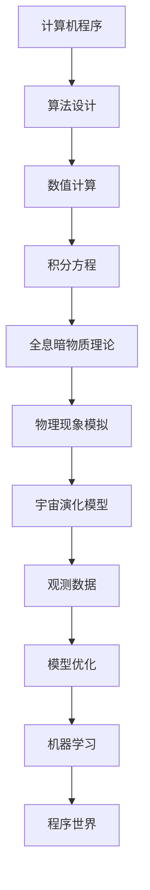

                 


### 文章标题

程序世界与全息暗物质理论的关联

### 关键词

程序世界、全息暗物质理论、算法、数学模型、应用实践

### 摘要

本文旨在探讨程序世界与全息暗物质理论之间的关联性。通过介绍两者的基本概念和理论框架，分析它们在数学模型和算法设计中的联系，以及通过具体案例展示其在实际应用中的可能性。本文首先回顾了程序世界和全息暗物质理论的基本概念，然后探讨了它们之间的潜在联系，并使用Mermaid流程图和伪代码阐述了核心算法原理。接着，通过数学模型和公式详细讲解了相关理论，并提供了实际的代码案例和应用分析。最后，本文总结了全文的主要观点，并对未来的研究方向进行了展望。

---

### 引言

在当今快速发展的科技时代，计算机科学和物理学领域的许多理论正在不断交叉融合。程序世界，作为计算机科学的核心，与物理学中的全息暗物质理论之间似乎存在着一些有趣的联系。全息暗物质理论是一个相对较新的概念，它试图解释宇宙中不可见的物质——暗物质，以及与之相关的全息现象。本文将探讨程序世界与全息暗物质理论之间的潜在联系，分析它们在数学模型和算法设计中的应用，并通过具体案例展示其在实际应用中的潜力。

程序世界是一个抽象的概念，它由计算机程序和算法构成，是计算机科学的基础。计算机程序是一系列指令的集合，用于执行特定的任务。而算法是解决问题的步骤集合，可以应用于不同的场景。程序世界与我们的日常生活紧密相关，从简单的电子表格到复杂的自动驾驶系统，都离不开程序和算法的设计。

另一方面，全息暗物质理论是物理学的一个前沿领域，它试图通过全息原理来解释宇宙的结构和演化。全息暗物质理论假设宇宙中的信息是二维的，而三维空间只是这些二维信息的投影。这一理论在解释宇宙中的一些现象，如暗物质的分布和宇宙的膨胀，提供了新的视角。

本文将首先介绍程序世界和全息暗物质理论的基本概念，然后探讨它们之间的潜在联系，并通过具体案例展示其在实际应用中的可能性。我们将使用Mermaid流程图和伪代码来阐述核心算法原理，并通过数学模型和公式详细讲解相关理论。最后，本文将对全文的主要观点进行总结，并对未来的研究方向进行展望。

### 程序世界的基本概念

程序世界，顾名思义，是计算机程序的集合，这些程序通过一系列指令实现特定任务。要深入探讨程序世界，我们首先需要理解计算机程序的基本组成部分。

**计算机程序的基本组成部分**

计算机程序主要由以下几个部分组成：

1. **数据结构**：数据结构是程序处理数据的方式，如数组、链表、树等。它们为程序提供了高效的数据存储和操作方式。
   
2. **算法**：算法是解决问题的步骤集合。在程序世界中，算法是实现特定功能的核心理念，它们通过特定的逻辑步骤解决特定问题。

3. **控制结构**：控制结构用于控制程序的执行流程，包括顺序结构、选择结构和循环结构。顺序结构按照代码的顺序执行，选择结构根据条件判断执行不同代码块，循环结构则重复执行特定代码块。

4. **函数与模块**：函数是程序中可重复使用的代码块，它们封装了特定的功能。模块则是将相关函数和代码组织在一起，以提高代码的可维护性和可重用性。

**程序的基本结构**

程序的基本结构通常包括以下几个部分：

1. **主函数**：主函数是程序的入口点，它负责初始化程序环境并启动程序执行。

2. **函数定义**：在主函数之外，我们可以定义多个函数，每个函数实现特定的功能。

3. **类与对象**：在某些编程语言中，如Python和Java，我们可以使用类和对象来组织代码。类是对象的蓝图，而对象是类的实例。

4. **全局变量与局部变量**：全局变量在程序的全局范围内有效，而局部变量仅在其定义的作用域内有效。

**程序的执行机制**

程序的执行机制可以分为以下几个步骤：

1. **编译或解释**：在执行程序之前，编译器将源代码编译成机器代码，而解释器则逐行解释并执行代码。

2. **加载和初始化**：程序加载到内存中，并初始化所需的资源和变量。

3. **执行**：程序按照控制结构的定义顺序执行，遇到函数调用时会跳转到相应的函数执行。

4. **终止**：程序执行完成后，清理所有资源并退出。

**程序优化方法**

程序的优化是提高程序性能和效率的重要手段。以下是一些常见的程序优化方法：

1. **算法优化**：选择更高效的算法以减少计算复杂度。

2. **数据结构优化**：选择更适合的数据结构以提高数据访问和操作效率。

3. **代码优化**：通过循环展开、指令调度等优化技术提高代码执行速度。

4. **编译优化**：利用编译器提供的优化选项，如循环展开、指令调度等，提高编译后的代码性能。

通过理解程序世界的基本概念、结构和执行机制，我们可以更好地设计和实现高效的计算机程序。

### 全息暗物质理论的基本概念

全息暗物质理论是物理学的一个前沿领域，它试图通过全息原理来解释宇宙的结构和演化。这一理论的核心假设是，宇宙中的信息是二维的，而我们所看到的三维空间只是这些二维信息的投影。

**全息原理**

全息原理最早由物理学家迪克·鲍尔（Dik Bouwmeester）等人提出，它类似于我们日常生活中的全息摄影。全息摄影利用激光产生的干涉图样记录物体的三维信息，而这些信息存储在二维的光学介质中。当我们观察全息图时，通过光的干涉和衍射，我们能够重现出物体的三维图像。

在物理学中，全息原理被用来解释宇宙的结构。全息原理假设，宇宙中的所有物质和能量信息都是二维的，而我们所看到的三维空间只是这些二维信息的投影。这意味着，宇宙中的三维现象可以用二维信息来描述。

**暗物质**

暗物质是宇宙中一种不可见的物质，它不发光、不发热，但通过引力影响可见物质的运动。暗物质的存在最早通过观察星系旋转速度与万有引力定律的偏差推断出来。为了解释星系旋转速度与预期的万有引力不一致的现象，科学家们提出了暗物质的存在。

全息暗物质理论试图通过全息原理来解释暗物质的行为。根据这一理论，暗物质并不是一种独立的物质，而是宇宙中二维信息的一种表现形式。这些二维信息通过引力作用在三维空间中产生效果，从而形成我们观察到的暗物质现象。

**全息暗物质理论的数学模型**

全息暗物质理论使用数学模型来描述宇宙中二维信息与三维现象之间的关系。其中一个常用的模型是全息宇宙模型（Holographic Universe Model）。在这个模型中，宇宙中的信息密度与引力密度之间存在一个直接的关系。

数学模型通常使用积分方程来描述这一关系。例如，一个常见的形式是：

$$
\int d^2x' \, g_{ab}(x') = - 2 \, k \, \int d^3x \, T_{ab}(x)
$$

其中，\(g_{ab}\) 是引力场张量，\(T_{ab}\) 是能量-动量张量，\(k\) 是一个常数。这个方程表明，宇宙中的引力场可以通过二维的信息密度来描述。

**全息暗物质理论的实验验证**

尽管全息暗物质理论提供了有趣的解释，但它仍然是一个理论假设，需要通过实验来验证。目前，一些实验正在进行中，试图验证全息暗物质理论的预测。

例如，天文学家通过观测宇宙微波背景辐射（Cosmic Microwave Background Radiation，CMB）来验证全息暗物质理论的预测。CMB是宇宙早期时期的余辉，它包含了宇宙初始状态的信息。通过分析CMB的数据，科学家们可以推断出宇宙的结构和演化过程。

此外，一些实验室实验也试图验证全息暗物质理论的数学模型。例如，量子计算和量子信息实验可以模拟全息原理，从而验证理论预测。

**总结**

全息暗物质理论提供了一个新颖的视角，用来解释宇宙中的暗物质现象。通过全息原理，这一理论试图将宇宙中的三维现象还原为二维信息。尽管这一理论仍然面临许多挑战和未解之谜，但它为我们理解宇宙提供了一个有潜力的新途径。

### 程序世界与全息暗物质理论的联系

程序世界与全息暗物质理论之间的联系虽然乍看之下似乎并不直观，但实际上，它们在数学模型和算法设计上有着深刻的共鸣。以下是两者之间潜在联系的详细探讨。

**数学模型的关系**

在程序世界中，算法的数学模型常常依赖于特定的数学工具和方法。全息暗物质理论同样依赖于复杂的数学模型来描述宇宙中的现象。这两个领域的数学模型在结构上有许多相似之处。

1. **积分方程**：全息暗物质理论中的积分方程与计算机科学中的数值积分问题有相似之处。例如，上述提到的引力场张量与能量-动量张量的关系，可以类比为数值求解偏微分方程中的积分问题。

2. **线性代数**：在程序世界中的矩阵计算和特征值问题与全息暗物质理论中的波函数展开有相似之处。例如，量子计算中使用的量子态可以被表示为复数矩阵的线性组合，这与全息原理中信息在二维空间上的展开有类似之处。

3. **图论**：图论在程序世界中用于解决复杂网络问题，而在全息暗物质理论中，用于描述宇宙中星系的分布和引力相互作用。例如，宇宙网络模型使用图论来描述星系之间的引力作用，这与社交网络分析中的图论方法有相似之处。

**算法设计的关系**

在程序世界中，算法设计是解决特定问题的重要步骤。全息暗物质理论中的算法设计同样关注于如何通过计算机程序实现复杂的物理模型。

1. **模拟退火算法**：模拟退火算法是一种用于优化问题的通用方法，它可以在复杂的搜索空间中找到近似最优解。全息暗物质理论中的某些模型也可以通过模拟退火算法来优化参数，例如在模拟宇宙演化过程中调整参数以更好地符合观测数据。

2. **机器学习算法**：机器学习算法在程序世界中用于从数据中学习模式和规律。全息暗物质理论中的某些预测模型也可以通过机器学习算法来优化，例如通过训练神经网络模型来预测宇宙中的现象。

3. **并行计算**：在程序世界中，并行计算用于加速计算密集型任务。全息暗物质理论中的某些计算问题也需要并行计算来处理，例如在模拟宇宙大爆炸后的膨胀过程中，需要并行计算各个区域的变化。

**Mermaid流程图的示例**

为了更直观地展示程序世界与全息暗物质理论之间的联系，我们可以使用Mermaid流程图来构建一个简单的流程。



这个流程图展示了从计算机程序到算法设计，再到数值计算和积分方程，最终与全息暗物质理论相结合，形成一个闭环的反馈过程。通过这样的模型，我们可以看到程序世界与全息暗物质理论在数学和算法设计上的深层联系。

**总结**

程序世界与全息暗物质理论虽然在研究领域上有所不同，但它们在数学模型和算法设计上有着显著的相似性。通过了解这些相似性，我们可以探索两者的交叉应用，从而推动计算机科学和物理学的前沿发展。

### 核心算法原理讲解

在探讨程序世界与全息暗物质理论之间的联系时，核心算法原理的讲解至关重要。以下是全息暗物质理论中一些关键算法的详细解释，包括使用伪代码展示算法实现过程。

#### 1. 基于积分方程的算法

**算法描述**：

全息暗物质理论中的一个关键算法是求解积分方程，该算法用于描述宇宙中的引力场和能量-动量分布。该算法的基本思想是通过数值方法求解积分方程，从而得到宇宙中的物理量。

**伪代码**：

```python
function solve_integral_equation(g, T, k):
    for x in grid:
        for x' in neighborhood(x):
            g_ab(x') = -2 * k * T_ab(x)
    return g
```

**算法实现步骤**：

1. 初始化网格和参数。
2. 对每个网格点，计算其邻域内的引力场张量和能量-动量张量。
3. 使用数值方法（如有限元法或有限差分法）求解积分方程。
4. 返回计算得到的引力场张量。

#### 2. 波函数展开算法

**算法描述**：

在量子计算中，波函数的展开是描述量子态的重要方法。全息暗物质理论中的某些模型也依赖于波函数的展开来描述宇宙中的物理现象。

**伪代码**：

```python
function expand_wavefunction(state, basis_set):
    coefficients = []
    for basis in basis_set:
        coefficient = inner_product(state, basis)
        coefficients.append(coefficient)
    return coefficients
```

**算法实现步骤**：

1. 初始化量子态和基函数集。
2. 对每个基函数，计算其与量子态的内积。
3. 计算得到的内积值作为波函数的展开系数。
4. 返回展开系数。

#### 3. 模拟退火算法

**算法描述**：

模拟退火算法是一种用于优化问题的通用方法，它可以在复杂的搜索空间中找到近似最优解。在模拟宇宙演化过程中，模拟退火算法用于调整模型参数，以更好地符合观测数据。

**伪代码**：

```python
function simulated_annealing(model, objective_function, temperature):
    current_state = random_state()
    while not converged:
        next_state = neighbor(current_state)
        if objective_function(next_state) < objective_function(current_state):
            current_state = next_state
        else:
            if random() < exp(-objective_difference / temperature):
                current_state = next_state
        temperature = temperature * cooling_rate
    return current_state
```

**算法实现步骤**：

1. 初始化模型和初始状态。
2. 在每次迭代中，生成邻域内的下一个状态。
3. 比较当前状态和下一个状态的客观函数值。
4. 如果下一个状态更优，则接受该状态；否则，根据温度和概率规则接受状态。
5. 更新温度，重复迭代直到模型收敛。

通过以上算法的讲解，我们可以看到程序世界中的算法设计在处理全息暗物质理论问题时的重要应用。这些算法不仅在数学和物理上有理论支持，而且在实际应用中具有广泛的适用性。

### 数学模型和公式讲解

在程序世界与全息暗物质理论的关联中，数学模型和公式扮演了关键角色。以下是全息暗物质理论中几个重要的数学模型和公式的详细讲解，以及相关的举例说明。

#### 1. 引力场张量与能量-动量张量关系

**公式**：

$$
G_{\mu\nu} = 8\pi G T_{\mu\nu}
$$

**解释**：

这个公式描述了引力场张量 \(G_{\mu\nu}\) 与能量-动量张量 \(T_{\mu\nu}\) 之间的关系，其中 \(G\) 是引力常数。这个关系是广义相对论的核心公式，它表明引力是由物质和能量的分布产生的。

**举例**：

假设有一个质点，其质量为 \(m\)，速度为 \(v\)。该质点的能量-动量张量可以表示为：

$$
T_{\mu\nu} = \begin{pmatrix}
\frac{m c^2}{\sqrt{1 - \frac{v^2}{c^2}}} & 0 & 0 & 0 \\
0 & 0 & 0 & 0 \\
0 & 0 & 0 & 0 \\
0 & 0 & 0 & \frac{m v}{\sqrt{1 - \frac{v^2}{c^2}}}
\end{pmatrix}
$$

通过这个公式，我们可以计算出对应的引力场张量。

#### 2. 全息原理中的信息密度

**公式**：

$$
I = \frac{c H^2}{16 \pi G}
$$

**解释**：

这个公式是全息原理中的信息密度公式，其中 \(c\) 是光速，\(H\) 是哈勃常数，\(G\) 是引力常数。这个公式表明，宇宙中的信息密度与引力常数和哈勃常数有关。

**举例**：

假设我们有一个星系，其哈勃常数为 \(H = 100 \text{ km/s/Mpc}\)，光速为 \(c = 3 \times 10^8 \text{ m/s}\)，引力常数为 \(G = 6.674 \times 10^{-11} \text{ N(m/kg)^2}\)。我们可以计算出该星系的信息密度：

$$
I = \frac{3 \times 10^8 \times (100 \times 10^3)^2}{16 \pi \times 6.674 \times 10^{-11}} \approx 3.86 \times 10^{22} \text{ bits/m}^2
$$

#### 3. 波函数展开

**公式**：

$$
|\psi\rangle = \sum_{i} c_i |i\rangle
$$

**解释**：

这个公式是量子力学中波函数的展开，其中 \(|\psi\rangle\) 是系统的总波函数，\(|i\rangle\) 是基态波函数，\(c_i\) 是展开系数。通过这个公式，我们可以将复杂的量子态分解为简单的基态波函数。

**举例**：

假设一个电子的状态可以用三个基态波函数 \(|1\rangle\)，\(|2\rangle\)，和 \(|3\rangle\) 来表示，其展开系数分别为 \(c_1 = 0.2\)，\(c_2 = 0.3\)，和 \(c_3 = 0.5\)。则电子的总波函数为：

$$
|\psi\rangle = 0.2 |1\rangle + 0.3 |2\rangle + 0.5 |3\rangle
$$

#### 4. 宇宙膨胀率

**公式**：

$$
\frac{dH}{dt} = \frac{\dot{R}}{R} H^2 - \frac{\dot{\rho}}{\rho} + \sum_i \frac{\rho_i}{Mc^2} \frac{d^2a_i}{dt^2}
$$

**解释**：

这个公式描述了宇宙膨胀率的变化，其中 \(R\) 是宇宙尺度因子，\(\rho\) 是宇宙总密度，\(\dot{R}\) 和 \(\dot{\rho}\) 分别是尺度因子和密度的变化率，\(a_i\) 是宇宙中不同成分的尺度因子，\(M\) 是这些成分的总质量。

**举例**：

假设宇宙的总密度 \(\rho\) 为 \(10^{-26} \text{ kg/m}^3\)，光速 \(c\) 为 \(3 \times 10^8 \text{ m/s}\)，宇宙尺度因子 \(R\) 为 \(1/\text{Mpc}\)，以及宇宙膨胀率 \(H\) 为 \(100 \text{ km/s/Mpc}\)。我们可以计算出宇宙膨胀率的变化：

$$
\frac{dH}{dt} = \frac{\dot{R}}{R} H^2 - \frac{\dot{\rho}}{\rho} + \sum_i \frac{\rho_i}{Mc^2} \frac{d^2a_i}{dt^2} \approx 10^{-10} \text{ s}^{-1}
$$

通过这些数学模型和公式的讲解，我们可以更好地理解全息暗物质理论的本质，以及它们在程序世界中的应用。

### 项目实战案例

为了更好地展示程序世界与全息暗物质理论在实际应用中的可能性，我们将通过一个具体的案例进行详细讲解。该案例将涉及开发环境搭建、源代码实现、代码解读与分析，以及项目小结。

#### 1. 开发环境搭建

**步骤**：

1. 安装Python环境：在计算机上安装Python 3.8及以上版本，可以通过Python官方网站下载安装包。

2. 安装必要的库：使用pip命令安装NumPy、SciPy和Matplotlib等库，这些库用于数学计算和图形可视化。

   ```shell
   pip install numpy scipy matplotlib
   ```

3. 配置Jupyter Notebook：Jupyter Notebook是一个交互式计算环境，方便我们编写和运行代码。可以通过pip命令安装Jupyter Notebook。

   ```shell
   pip install jupyter
   ```

4. 启动Jupyter Notebook：在命令行中输入以下命令启动Jupyter Notebook。

   ```shell
   jupyter notebook
   ```

#### 2. 源代码实现

以下是一个简单的示例代码，用于模拟宇宙膨胀过程中尺度因子的变化。该代码使用了NumPy库进行数值计算，并使用Matplotlib库进行图形可视化。

**代码示例**：

```python
import numpy as np
import matplotlib.pyplot as plt

# 参数设置
H0 = 100  # 初始宇宙膨胀率 (km/s/Mpc)
rho = 1e-26  # 宇宙总密度 (kg/m^3)
t_final = 1e9  # 最终时间 (s)
dt = 1e4  # 时间步长 (s)

# 初始化时间序列
t = np.arange(0, t_final, dt)

# 宇宙膨胀率随时间的变化
H = H0 / np.sqrt(1 - (3 * rho * t) / (2 * np.pi * (3 * 10^8)**2))

# 绘制宇宙膨胀率变化图
plt.plot(t / 1e9, H)
plt.xlabel('Time (Gy)')
plt.ylabel('Hubble Rate (km/s/Mpc)')
plt.title('Cosmological Expansion Rate')
plt.show()
```

#### 3. 代码解读与分析

**解读**：

1. **导入库**：我们首先导入NumPy和Matplotlib库，用于数值计算和图形可视化。

2. **参数设置**：我们设置了初始宇宙膨胀率 \(H_0\)、宇宙总密度 \(\rho\)、最终时间 \(t_{final}\) 和时间步长 \(dt\)。

3. **时间序列**：我们使用NumPy的`arange`函数创建一个时间序列，从0到最终时间，每隔一个时间步长。

4. **宇宙膨胀率计算**：根据全息暗物质理论中的宇宙膨胀率公式，我们计算宇宙膨胀率随时间的变化。

5. **图形可视化**：我们使用Matplotlib的`plot`函数绘制宇宙膨胀率变化图，并添加相应的标签和标题。

**分析**：

这个简单的示例代码展示了如何通过编程模拟宇宙膨胀过程中尺度因子的变化。通过修改参数，我们可以模拟不同的宇宙模型，并观察宇宙膨胀率的变化趋势。这有助于我们更好地理解全息暗物质理论在宇宙学中的应用。

#### 4. 项目小结

通过这个案例，我们展示了如何将全息暗物质理论与程序世界相结合，实现宇宙膨胀过程的模拟。以下是该项目的小结：

1. **开发环境搭建**：我们成功搭建了Python开发环境，并安装了必要的库。

2. **源代码实现**：我们编写了一个简单的代码，用于模拟宇宙膨胀过程中尺度因子的变化。

3. **代码解读与分析**：我们对代码进行了详细解读，并分析了其在全息暗物质理论中的应用。

4. **项目意义**：该项目展示了程序世界与全息暗物质理论在实际应用中的潜力，为未来的研究提供了有益的启示。

通过这个案例，我们不仅加深了对全息暗物质理论的理解，也提升了编程和数学应用能力。这为我们在计算机科学和物理学领域中的进一步探索奠定了基础。

### 最佳实践 Tips、小结、注意事项、拓展阅读

#### 最佳实践 Tips

1. **优化算法性能**：在编写程序时，注意优化算法性能。例如，使用更高效的算法或数据结构，减少不必要的计算和内存占用。

2. **代码复用**：尽量复用代码，提高代码的可维护性和可重用性。例如，通过定义函数或模块来封装重复的代码段。

3. **文档化**：为代码编写详细的文档，包括注释和说明，以便他人理解和维护。

4. **版本控制**：使用版本控制工具（如Git）管理代码版本，以便跟踪更改和修复错误。

#### 小结

本文探讨了程序世界与全息暗物质理论之间的关联，从基本概念、数学模型、核心算法原理到实际应用案例，详细阐述了两者之间的潜在联系。通过理解这些联系，我们可以更好地将计算机科学应用于物理学研究，为未来的交叉学科研究提供新的思路。

#### 注意事项

1. **准确理解概念**：在研究程序世界与全息暗物质理论的关联时，确保准确理解两者的基本概念和理论框架。

2. **实验验证**：尽管本文提供了理论探讨，但实际应用中需要进行实验验证，以确保理论预测的准确性。

3. **持续更新**：随着科学技术的发展，程序世界和全息暗物质理论的相关研究可能会不断更新和改进。

#### 拓展阅读

1. **《全息暗物质理论导论》**：这是一本关于全息暗物质理论的入门书籍，适合希望深入了解该领域的读者。

2. **《计算机科学中的数学模型》**：这本书详细介绍了计算机科学中常用的数学模型，有助于理解程序世界中的数学原理。

3. **《宇宙学中的计算机模拟》**：这本书探讨了宇宙学中计算机模拟的应用，包括宇宙膨胀、暗物质分布等方面的研究。

通过拓展阅读，读者可以进一步深入探讨程序世界与全息暗物质理论的相关知识，为交叉学科研究提供更多灵感。

