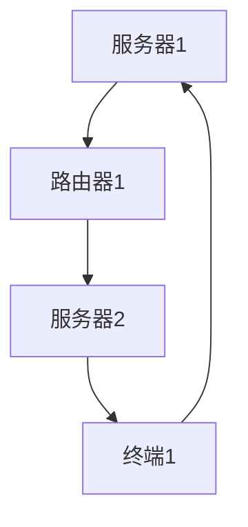
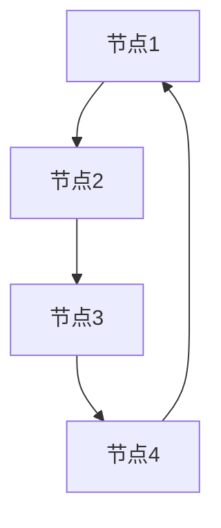
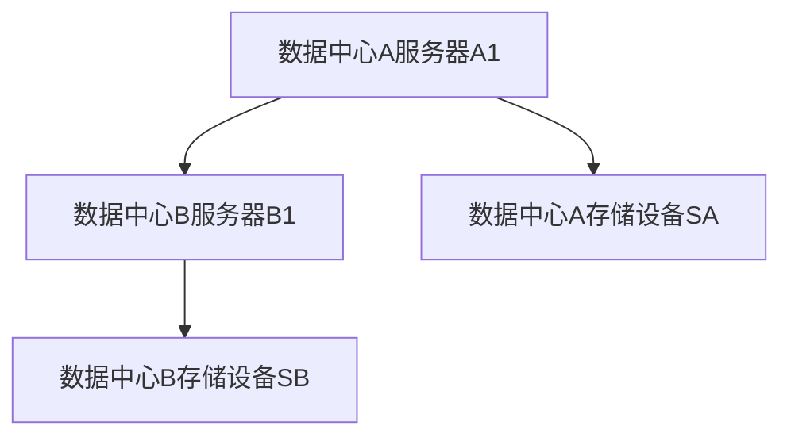

                 

### 引言

程序世界与物理世界一直是两个截然不同的领域。程序世界是由代码和算法构成的人工智能领域，而物理世界则是我们日常生活和科学研究的对象。尽管这两个世界在本质上有很大的不同，但近年来，随着计算机科学和物理学的深入发展，人们开始探索两者之间是否存在某种深层次的联系。本文将通过多重连通虫洞网络拓扑模型，对程序世界进行类比分析，以期发现程序世界和物理世界之间的潜在相似性。

首先，程序世界是由一系列规则和逻辑组成的虚拟世界。在这个世界中，计算机程序通过算法处理数据，从而实现各种功能。程序世界具有高度的可塑性和灵活性，能够模拟和解决现实世界中的复杂问题。与之相对，物理世界则是一个由基本物理定律和自然现象构成的客观存在。在这个世界中，物质和能量遵循特定的物理规律，形成了丰富多彩的自然现象。

其次，多重连通虫洞网络拓扑模型是一种特殊的物理现象。虫洞是连接两个不同空间或时间的桥梁，而多重连通虫洞则是指存在多个虫洞相互连接，形成一个复杂的网络结构。这种模型在物理学中具有重要的研究价值，因为它揭示了时空的复杂性和多样性。然而，虫洞的存在和性质至今仍是一个未解之谜，需要进一步的研究和探索。

本文将通过对程序世界和多重连通虫洞网络拓扑模型的类比，探讨两者之间的潜在联系。具体来说，本文将从以下几个方面展开：

1. **类比思想概述**：介绍类比思想的基本概念和方法，阐述程序世界和物理世界之间的类比关系。

2. **程序世界的核心特性**：分析程序世界的基本特性，包括代码、算法、数据结构等，为后续类比提供基础。

3. **物理世界的核心特性**：介绍物理世界的基本概念，如物质、能量、时空等，为类比提供物理背景。

4. **类比的目的与意义**：阐述类比研究的目的和意义，探讨类比方法对计算机科学和物理学的启示。

5. **多重连通虫洞网络拓扑模型**：介绍虫洞的基本概念、多重连通虫洞的定义、虫洞网络的拓扑结构以及其在物理世界中的应用场景。

通过上述分析，本文旨在揭示程序世界和物理世界之间的潜在联系，为跨学科研究提供新的思路和方法。同时，本文也将探讨类比方法的局限性和未来研究方向，为后续研究提供参考。

### 第1章：程序世界与物理世界的类比

#### 1.1.1 类比思想概述

类比思想是一种通过比较不同事物之间的相似性来理解和解决问题的方法。在科学研究中，类比思想被广泛应用于跨学科研究，通过发现不同领域之间的潜在联系，从而提供新的研究思路和解决方案。程序世界与物理世界虽然本质不同，但两者之间存在着许多相似之处，这使得类比方法成为探讨它们之间关系的一种有效途径。

首先，类比方法的基本概念包括两个方面：相似性和关联性。相似性指的是两个或多个事物在结构、功能或性质上具有相似的特征。关联性则是指这些相似特征在不同领域之间存在的内在联系。通过揭示这种相似性和关联性，类比方法可以帮助我们更好地理解复杂系统的工作原理，并为新技术的发明和应用提供灵感。

在程序世界与物理世界的类比中，相似性体现在多个方面。例如，程序世界中的代码和算法与物理世界中的物质和能量之间存在着对应关系。在程序世界中，代码是一种表示指令和逻辑的表达形式，而算法则是根据特定目标执行这些指令的步骤。在物理世界中，物质和能量则通过基本物理定律相互作用，形成复杂的自然现象。这种对应关系揭示了程序世界和物理世界在某种程度上的相似性。

其次，类比方法的步骤主要包括以下几个环节：

1. **识别相似性**：通过观察和比较，识别程序世界和物理世界中的相似特征。这一步骤是类比研究的基础，决定了类比关系的深度和广度。

2. **建立联系**：在识别相似性的基础上，建立程序世界和物理世界之间的内在联系。这一步骤是将相似性转化为实际应用的关键。

3. **验证和调整**：通过实验或理论验证类比结果的合理性，并根据实际情况进行调整和优化。这一步骤是确保类比方法有效性的重要保障。

类比方法的应用不仅限于学术研究，还可以在实际工程中发挥重要作用。例如，在计算机科学领域，通过将物理世界中的某些原理应用到程序设计中，可以开发出更加高效和稳定的软件系统。在物理学领域，通过借鉴程序世界的思想和方法，可以帮助解决某些复杂物理现象的模拟和预测问题。

#### 1.1.2 程序世界的核心特性

程序世界是一个由代码、算法和数据结构组成的虚拟世界。它的核心特性主要体现在以下几个方面：

1. **代码**：代码是程序世界的基础，是一种表示指令和逻辑的表达形式。在编程语言中，代码通过符号、语法和语义来表达人类思维，从而使计算机能够执行特定的任务。代码的灵活性和多样性使得程序世界能够适应各种复杂的应用场景。

2. **算法**：算法是程序世界中解决问题的核心工具。它是一系列有序的指令，用于解决特定的问题。算法的设计和优化对于程序的效率和性能至关重要。高效的算法能够快速处理大量数据，从而提高程序的响应速度和可靠性。

3. **数据结构**：数据结构是程序世界中组织和存储数据的方式。不同的数据结构具有不同的特点和适用场景，如数组、链表、树、图等。合理选择和使用数据结构可以显著提高程序的性能和效率。

程序世界的核心特性还体现在其高度的可塑性和灵活性。通过组合不同的代码、算法和数据结构，可以构建出功能丰富、灵活多样的程序系统。这种可塑性和灵活性使得程序世界成为解决现实世界问题的强大工具。

#### 1.1.3 物理世界的核心特性

物理世界是一个由物质、能量和时空组成的客观存在。它的核心特性主要体现在以下几个方面：

1. **物质**：物质是构成物理世界的基本实体，包括原子、分子和宏观物体等。物质具有质量和体积，是物理世界中的基本组成部分。

2. **能量**：能量是物质运动和相互作用的表现形式。能量可以以多种形式存在，如动能、势能、热能、电能等。能量的转化和守恒是物理世界中一个重要的基本规律。

3. **时空**：时空是物理世界中物质和事件的框架。它由时间和空间两个维度构成，描述了物质和事件在空间中的位置和变化。爱因斯坦的相对论揭示了时空与物质和能量之间的密切关系。

物理世界的核心特性还体现在其复杂性和多样性。物质和能量之间的相互作用产生了丰富多彩的自然现象，如引力、电磁力、强力和弱力等。这些基本力的相互作用形成了复杂而有序的物理世界。

#### 1.1.4 类比的目的与意义

类比研究的目的在于揭示程序世界与物理世界之间的潜在联系，从而为跨学科研究提供新的思路和方法。通过类比，我们可以在不同领域之间建立联系，从而促进知识的整合和技术的创新。

首先，类比方法有助于我们更好地理解复杂系统的工作原理。通过将物理世界的概念和原理应用到程序世界中，我们可以更深入地理解计算机程序的设计和运行机制。例如，通过将物理世界中的能量概念应用到程序设计中，可以帮助我们优化程序的运行效率，提高其性能。

其次，类比方法为跨学科研究提供了新的研究思路。在传统的研究方法难以解决问题时，我们可以通过借鉴其他领域的思想和方法，开辟新的研究方向。例如，在物理学中，通过借鉴程序世界的算法和优化方法，可以开发出更高效、更精确的物理模型和模拟方法。

此外，类比方法在工程实践中也具有广泛的应用价值。通过将物理世界的原理应用到工程设计和制造过程中，可以开发出更加高效、可靠的技术和产品。例如，在电子工程领域，通过借鉴物理世界中的量子力学原理，可以设计出更加高效的电子器件和电路。

总之，类比研究不仅有助于我们更好地理解程序世界和物理世界，还为跨学科研究提供了新的思路和方法。通过类比，我们可以在不同领域之间建立联系，从而促进知识的整合和技术的创新，推动科学和技术的进步。

#### 2.1.1 虫洞的基本概念

虫洞（Wormhole）是物理学中的一种理论现象，它被认为是一种连接两个不同空间或时间点的桥梁。虫洞的概念最早由爱因斯坦和罗森（Einstein and Rosen）在1935年提出，他们基于爱因斯坦-罗森桥（Einstein-Rosen bridge）的理论提出了虫洞的可能性。虫洞的本质是一种时空曲率的存在，它通过弯曲时空来连接两个不同的区域。

在广义相对论中，虫洞被认为是一种可能的天体现象。如果存在一个足够大的质量，它会在周围的时空结构中产生曲率，从而形成一个稳定的虫洞。虫洞的存在可以解释为质量在时空中的弯曲效应，这种弯曲效应使得两个遥远的点在时空上变得靠近。

虫洞的稳定性是一个关键问题。在理论上，一个稳定的虫洞需要满足某些条件，例如需要足够的能量来保持其结构，同时避免塌缩或分裂。然而，目前关于虫洞稳定性的研究仍然存在许多争议和未解之谜。

虫洞的概念不仅在理论物理学中具有重要意义，也在许多科幻作品中得到了广泛应用。在科幻作品中，虫洞通常被描绘为一种超空间通道，通过它可以在瞬间穿越宇宙的遥远距离。虽然这些描绘在现实中尚未实现，但它们激发了人们对虫洞和宇宙探索的浓厚兴趣。

#### 2.1.2 多重连通虫洞的概念

多重连通虫洞（Multichannel Wormhole）是指由多个虫洞相互连接形成的复杂网络结构。这种网络结构中的每一个虫洞都可以视为一个节点，而连接不同虫洞的通道则被视为边。多重连通虫洞在理论物理学中具有重要意义，因为它揭示了时空结构的复杂性和多样性。

多重连通虫洞的概念可以通过图论来描述。在图论中，图（Graph）是由节点（Node）和边（Edge）组成的结构。在多重连通虫洞网络中，节点代表虫洞，边代表虫洞之间的连接通道。这种图论模型可以帮助我们更好地理解和分析虫洞网络的性质和行为。

多重连通虫洞网络的性质包括连通性、稳定性、拓扑结构等。连通性是指网络中的任意两个节点之间是否存在路径连接。稳定性是指虫洞网络在长时间内能否保持其结构，避免因能量不足或物理效应而崩溃。拓扑结构则是指网络中的节点和边的排列方式，它决定了网络的连通性和稳定性。

在物理学中，多重连通虫洞网络的研究有助于我们更深入地理解时空的本质和物理定律。例如，通过研究虫洞网络的连通性和稳定性，可以探索宇宙中可能存在的连通区域和时空异常现象。此外，多重连通虫洞网络在量子计算、宇宙学和引力物理学等领域也具有重要的应用价值。

#### 2.1.3 虫洞网络的拓扑结构

虫洞网络的拓扑结构是指由虫洞和连接通道组成的网络中节点和边的排列方式。拓扑结构决定了网络的连通性和稳定性，是虫洞网络分析的关键。虫洞网络的拓扑结构可以采用图论模型进行描述，其中节点代表虫洞，边代表虫洞之间的连接通道。

在虫洞网络的拓扑结构中，常见的连接方式包括树形结构、星形结构和网状结构等。树形结构是一种线性结构，其中每个节点只有一个父节点和一个子节点。星形结构则是以一个中心节点为核心，其他节点通过边直接连接到中心节点。网状结构则是一种复杂的结构，其中任意两个节点之间都可能存在直接的连接通道。

虫洞网络的连通性是指网络中的任意两个节点之间是否存在路径连接。一个连通的虫洞网络意味着网络中的任意两个节点都可以通过一系列虫洞连接通道相互访问。连通性可以通过计算网络的连通度来衡量，连通度越高，网络的连通性越强。

稳定性是虫洞网络在长时间内能否保持其结构，避免因能量不足或物理效应而崩溃。稳定的虫洞网络需要满足一定的条件，例如足够的能量供应和物理稳定结构。在理论上，虫洞的稳定性是一个复杂的问题，目前尚无明确的解决方案。

虫洞网络的拓扑结构对其实际应用具有重要影响。在量子计算中，虫洞网络可以作为量子信息的传输通道，实现量子比特之间的快速通信。在宇宙学中，虫洞网络可以揭示宇宙中可能存在的连通区域和时空异常现象。此外，虫洞网络还在网络科学、数据通信和分布式系统等领域具有广泛的应用前景。

#### 2.1.4 虫洞网络的应用场景

虫洞网络作为一种特殊的物理现象，在理论研究和实际应用中具有广泛的前景。以下是虫洞网络的一些潜在应用场景：

1. **量子通信**：虫洞网络可以作为一种高效的量子通信渠道。在量子通信中，利用量子纠缠效应可以实现远距离的高速通信。虫洞网络可以连接不同地点的量子计算机或量子通信节点，实现量子信息的安全传输。这种技术有望在未来实现全球范围内的量子互联网。

2. **宇宙探索**：虫洞网络为宇宙探索提供了新的视角。通过构建虫洞网络，可以在理论上实现宇宙中遥远区域之间的快速穿越。这种技术如果实现，将大大缩短宇宙探索的时间和成本，有助于人类更好地理解宇宙的奥秘。

3. **网络科学**：虫洞网络在网络科学中具有潜在的应用价值。在复杂网络中，虫洞网络可以作为一种增强网络连通性和稳定性的方法。通过构建虫洞网络，可以提高网络的可靠性，降低网络通信的延迟，从而优化网络性能。

4. **分布式系统**：虫洞网络在分布式系统中可以用于实现高效的节点通信。通过虫洞网络，不同节点之间可以快速交换信息，提高分布式系统的整体性能和效率。虫洞网络可以作为一种新型的基础设施，支持大规模分布式计算和存储。

5. **医学与生物技术**：虫洞网络在医学和生物技术中具有潜在的应用。例如，通过构建生物体内部的虫洞网络，可以实现细胞和组织之间的快速物质和能量传输，促进生物体内部的细胞再生和修复。此外，虫洞网络还可以用于开发新的药物传递系统，提高药物的靶向性和治疗效果。

总的来说，虫洞网络作为一种具有高度连通性和稳定性的物理结构，在多个领域都具有重要的应用价值。随着理论研究的深入和技术的进步，虫洞网络有望在未来实现更多实际应用，推动科学和技术的创新。然而，要实现这些应用，还需要克服许多技术挑战和理论难题。

#### 第3章：程序世界与多重连通虫洞网络拓扑模型的类比

#### 3.1.1 类比方法概述

类比方法是一种通过比较不同事物之间的相似性来揭示其潜在联系和特性的研究方法。在计算机科学和物理学中，类比方法已被广泛应用于跨学科研究，特别是在探索程序世界与物理世界之间的潜在联系时，表现出巨大的应用价值。本文通过将程序世界与多重连通虫洞网络拓扑模型进行类比，旨在揭示两者在结构、功能、性质等方面的相似性，从而为跨学科研究提供新的视角。

首先，类比方法的核心概念包括相似性和关联性。相似性指的是两个或多个事物在结构、功能或性质上具有相似的特征。关联性则是指这些相似特征在不同领域之间存在的内在联系。通过揭示这种相似性和关联性，类比方法可以帮助我们更好地理解复杂系统的工作原理，并为新技术的发明和应用提供灵感。

在程序世界与多重连通虫洞网络拓扑模型的类比研究中，相似性和关联性的识别是关键。程序世界由代码、算法和数据结构组成，而多重连通虫洞网络拓扑模型则是由虫洞和连接通道组成的网络结构。两者之间的相似性主要体现在以下几个方面：

1. **结构相似性**：程序世界中的代码和算法可以通过数据结构进行组织和存储，而虫洞网络拓扑模型中的虫洞和连接通道也可以通过图论模型进行描述。这种结构相似性使得我们可以将程序世界中的概念和原理应用到虫洞网络拓扑模型的分析中。

2. **功能相似性**：程序世界中的代码和算法通过处理数据实现特定功能，而虫洞网络拓扑模型中的虫洞和连接通道通过时空弯曲实现空间穿越。尽管两者的具体实现机制不同，但它们在功能上具有相似性，即通过特定的结构实现某种功能。

3. **性质相似性**：程序世界中的连通性、稳定性和效率是评价程序性能的重要指标，而虫洞网络拓扑模型中的连通性、稳定性和拓扑结构也是评价其性能的关键。这种性质相似性为我们提供了类比研究的理论基础。

类比方法的步骤主要包括以下几个环节：

1. **识别相似性**：通过观察和比较，识别程序世界和虫洞网络拓扑模型之间的相似特征。这一步骤是类比研究的基础，决定了类比关系的深度和广度。

2. **建立联系**：在识别相似性的基础上，建立程序世界和虫洞网络拓扑模型之间的内在联系。这一步骤是将相似性转化为实际应用的关键。

3. **验证和调整**：通过实验或理论验证类比结果的合理性，并根据实际情况进行调整和优化。这一步骤是确保类比方法有效性的重要保障。

类比方法的应用不仅限于学术研究，还可以在实际工程中发挥重要作用。例如，在计算机科学领域，通过将物理世界中的某些原理应用到程序设计中，可以开发出更加高效和稳定的软件系统。在物理学领域，通过借鉴程序世界的思想和方法，可以帮助解决某些复杂物理现象的模拟和预测问题。

总的来说，类比方法为程序世界与多重连通虫洞网络拓扑模型的类比研究提供了有效的途径。通过揭示两者之间的相似性和关联性，我们可以更好地理解复杂系统的运作机制，为跨学科研究提供新的思路和方法。

#### 3.1.2 类比步骤与流程

为了将程序世界与多重连通虫洞网络拓扑模型进行有效的类比，我们需要遵循一系列明确的步骤和流程。这些步骤包括问题定义、相似性识别、建立联系、验证和调整等。以下是详细的类比步骤与流程：

1. **问题定义**：
   - 明确研究目标：在开始类比之前，我们需要明确研究的目标和问题。这包括理解程序世界和虫洞网络拓扑模型的核心特性，以及它们之间可能存在的相似性。
   - 确定比较维度：确定在哪些方面进行比较，例如结构、功能、性质等。

2. **相似性识别**：
   - 结构相似性：通过分析程序世界中的代码、算法和数据结构，以及虫洞网络拓扑模型中的虫洞、连接通道和图论模型，识别它们之间的结构相似性。
   - 功能相似性：分析程序世界中代码和算法的功能实现，以及虫洞网络拓扑模型中虫洞和连接通道的功能，识别它们之间的功能相似性。
   - 性质相似性：研究程序世界中的连通性、稳定性和效率，以及虫洞网络拓扑模型中的连通性、稳定性和拓扑结构，识别它们之间的性质相似性。

3. **建立联系**：
   - 对比分析：通过对比程序世界和虫洞网络拓扑模型在相似维度上的特点，建立它们之间的内在联系。
   - 构建类比模型：在识别相似性的基础上，构建一个类比模型，以直观地展示程序世界和虫洞网络拓扑模型之间的关系。
   - 描述相似机制：详细描述程序世界中的机制如何在虫洞网络拓扑模型中找到对应，以及虫洞网络拓扑模型中的机制如何映射到程序世界中。

4. **验证和调整**：
   - 理论验证：通过理论分析验证类比模型的合理性。这包括使用数学公式和逻辑推理来证明类比关系的有效性。
   - 实验验证：通过实验数据验证类比结果的准确性。这可以通过模拟程序世界和虫洞网络拓扑模型的运行，观察它们的相似行为。
   - 调整优化：根据验证结果对类比模型进行调整和优化，以提高类比方法的准确性和实用性。

通过上述步骤，我们可以系统地类比程序世界和多重连通虫洞网络拓扑模型，揭示它们之间的相似性和联系，为跨学科研究提供新的视角和工具。

#### 3.1.3 类比工具与技巧

在程序世界与多重连通虫洞网络拓扑模型的类比过程中，选择合适的工具和技巧是确保类比结果准确性和有效性的关键。以下是一些常用的类比工具与技巧：

1. **Mermaid流程图**：
   - **功能**：Mermaid是一种基于Markdown的绘图工具，可以创建流程图、序列图、甘特图等多种图表。
   - **应用**：在类比过程中，可以使用Mermaid流程图来描述程序世界和虫洞网络拓扑模型的结构和关系。例如，可以用流程图展示程序中的数据流动和算法步骤，以及虫洞网络中的节点和边连接。

2. **伪代码**：
   - **功能**：伪代码是一种用来描述算法思想和步骤的文本形式，不依赖于特定编程语言。
   - **应用**：在类比研究中，伪代码可以帮助我们清晰地描述程序世界中的算法和逻辑，以及虫洞网络拓扑模型中的构建和操作。例如，可以使用伪代码来描述如何实现程序世界中的连通性度量，以及如何构建虫洞网络模型。

3. **数学公式**：
   - **功能**：数学公式可以精确地表达物理定律和计算方法。
   - **应用**：在类比过程中，数学公式可以用来描述程序世界和虫洞网络拓扑模型中的量化关系。例如，可以使用数学公式来表示程序世界的连通性度量，以及虫洞网络拓扑模型中的稳定性条件。

4. **类比框架**：
   - **功能**：类比框架是一种系统化的方法，用于指导类比研究的全过程。
   - **应用**：类比框架可以帮助我们结构化地识别相似性、建立联系和验证结果。例如，可以使用类比框架来定义类比步骤、确定比较维度和设计验证方案。

5. **案例分析**：
   - **功能**：案例分析是一种通过具体实例来验证类比方法有效性的方法。
   - **应用**：在类比研究中，通过案例分析可以直观地展示程序世界和虫洞网络拓扑模型之间的相似性。例如，可以分析一个程序世界的连通性案例，并使用虫洞网络拓扑模型来解释其性质。

通过这些工具和技巧，我们可以更有效地进行程序世界与多重连通虫洞网络拓扑模型的类比研究，从而揭示两者之间的潜在联系和相似性。

#### 4.1.1 程序世界中的连通性

在程序世界中，连通性是指程序中各个部分之间的交互和协作程度。连通性是评价程序设计质量和性能的重要指标之一。程序世界的连通性可以从多个维度进行分析，包括代码层面的连通性、模块层面的连通性和系统层面的连通性。

1. **代码层面的连通性**：

代码层面的连通性主要关注程序中各个函数、类或模块之间的调用关系。良好的代码连通性可以使得代码模块之间的高效通信和协作，从而提高程序的可读性、可维护性和可扩展性。

- **高内聚低耦合**：在代码层面，高内聚低耦合是设计良好代码连通性的关键原则。高内聚意味着代码模块内部的功能紧密相关，低耦合则意味着模块之间的依赖关系较弱。通过高内聚低耦合的设计，可以降低模块之间的相互依赖，提高代码的可维护性和可扩展性。

- **模块化设计**：模块化设计是将程序划分为多个独立模块的过程。每个模块负责特定的功能，并通过接口与其他模块进行通信。模块化设计可以提高代码的复用性，降低复杂性，从而提高程序的可读性和可维护性。

2. **模块层面的连通性**：

模块层面的连通性主要关注程序中各个模块之间的交互和协作。模块之间的交互可以通过方法调用、参数传递和数据共享等方式实现。

- **接口设计**：接口设计是模块之间交互的重要手段。良好的接口设计应具备清晰、简洁和灵活的特点。接口应明确模块之间的职责和交互方式，以便其他模块能够方便地使用和扩展。

- **事件驱动模型**：事件驱动模型是一种常见的模块交互方式。在事件驱动模型中，模块通过监听和响应事件来交互。事件驱动模型可以提高程序的响应速度和灵活性，特别是在处理并发和多线程应用时。

3. **系统层面的连通性**：

系统层面的连通性主要关注整个程序系统与外部环境之间的交互。系统层面的连通性对于程序的稳定性和性能具有重要影响。

- **依赖管理**：依赖管理是确保系统层面连通性的重要手段。依赖管理工具可以帮助我们管理和追踪程序中各个模块之间的依赖关系，从而确保系统在运行时能够正确加载和调用所需的模块。

- **网络通信**：在网络应用中，系统层面的连通性主要体现在网络通信方面。网络通信的可靠性和效率对于应用程序的性能至关重要。通过使用合适的网络协议和通信机制，可以提高程序的响应速度和网络稳定性。

总之，程序世界中的连通性是程序设计和实现中的一个重要考虑因素。通过合理的设计和优化，可以提高程序的可读性、可维护性和可扩展性，从而提升程序的整体性能。

#### 4.1.2 虫洞网络中的连通性

在虫洞网络中，连通性是指网络中各个节点（虫洞）之间的连接情况和通信能力。虫洞网络的连通性对于其整体性能和应用效果具有决定性影响。虫洞网络的连通性可以从多个维度进行分析，包括物理连通性、拓扑连通性和逻辑连通性。

1. **物理连通性**：

物理连通性是指虫洞网络中节点之间的物理连接状态。这涉及到节点之间的距离、通信链路的稳定性等因素。

- **节点连接**：虫洞网络中的节点（虫洞）需要通过物理连接（如光纤、无线信号等）进行连接。物理连通性良好意味着节点之间的连接稳定、快速且低延迟。
  
- **链路可靠性**：物理连通性还依赖于链路的可靠性，即链路在长时间运行中不会出现故障。为了提高链路可靠性，可以使用冗余链路和链路检测机制，确保在一条链路故障时能够自动切换到备用链路。

2. **拓扑连通性**：

拓扑连通性是指虫洞网络中节点之间的拓扑结构特性。这涉及到节点之间的连接方式、路径选择和拓扑结构的稳定性。

- **拓扑结构**：虫洞网络的拓扑结构可以是星形、网状或树形等。不同拓扑结构具有不同的连通性和性能特点。例如，网状拓扑结构具有较高的冗余性和稳定性，而星形拓扑结构则具有较低的网络延迟。
  
- **路径选择**：在虫洞网络中，节点之间的通信路径是通过路由算法选择的。路径选择需要考虑链路延迟、带宽、可靠性等因素。合理的路径选择可以提高网络的通信效率和稳定性。

3. **逻辑连通性**：

逻辑连通性是指虫洞网络中节点之间的逻辑关系和通信能力。这涉及到节点之间的协议、数据格式和通信机制。

- **通信协议**：虫洞网络中的节点需要使用统一的通信协议进行数据交换。通信协议应支持高效、可靠的数据传输，并能够处理网络中的异常情况。
  
- **数据格式**：虫洞网络中的数据格式应具备可扩展性和兼容性，以便不同节点能够解析和交换数据。

- **逻辑连接**：逻辑连通性还涉及到节点之间的逻辑连接关系。节点之间的逻辑连接可以是通过接口、API或其他逻辑机制实现的。逻辑连接应具备透明性和灵活性，以便节点能够方便地进行通信和协作。

总之，虫洞网络中的连通性是确保网络稳定运行和高效通信的基础。通过优化物理连通性、拓扑连通性和逻辑连通性，可以显著提高虫洞网络的性能和应用效果。

#### 4.1.3 类比结果的意义与影响

通过对程序世界与多重连通虫洞网络拓扑模型的类比分析，我们不仅揭示了两者在结构、功能、性质等方面的相似性，还为跨学科研究提供了新的思路和方法。类比结果的意义与影响可以从以下几个方面进行阐述：

首先，类比研究有助于我们更好地理解复杂系统的工作原理。通过将程序世界的概念和原理应用到虫洞网络拓扑模型的分析中，我们可以更深入地理解虫洞网络的构建、运行和优化机制。例如，程序世界中关于代码、算法和数据结构的设计原则，可以启发我们优化虫洞网络的拓扑结构和路径选择算法，从而提高网络的性能和稳定性。

其次，类比研究为跨学科研究提供了新的视角和方法。通过将物理世界中的虫洞网络拓扑模型与程序世界进行类比，我们可以将计算机科学的方法和工具应用于物理学研究，从而解决某些复杂物理现象的模拟和预测问题。例如，通过借鉴程序世界的算法和优化方法，可以开发出更高效的物理模型和模拟方法，加速理论物理学的进步。

此外，类比研究在工程实践中也具有广泛的应用价值。通过将虫洞网络的原理应用到实际工程中，可以开发出更高效、更稳定的软件系统和网络架构。例如，在分布式系统和云计算领域，虫洞网络的思想可以用于优化节点间的通信效率和数据传输速度，从而提升系统的整体性能。

最后，类比研究还推动了计算机科学和物理学之间的知识整合和技术创新。通过类比方法，我们可以将两个领域中的先进思想和方法相互借鉴，促进跨学科研究的融合和发展。这种知识整合不仅有助于解决单一领域中的复杂问题，也为新技术的发明和应用提供了源源不断的动力。

总之，类比结果的意义与影响是多方面的，它不仅丰富了我们的理论体系，还推动了实际应用的创新，为跨学科研究提供了新的路径和工具。

#### 4.1.4 类比方法的局限性

尽管类比方法在揭示程序世界与多重连通虫洞网络拓扑模型之间的相似性方面具有显著优势，但该方法也存在一定的局限性。首先，类比方法依赖于相似性识别，而相似性的确定往往具有一定的主观性，不同研究者可能对相同现象有不同的认识。这种主观性可能导致类比结果的准确性和一致性受到质疑。

其次，类比方法在处理复杂系统和多样化特性时，可能面临困难和挑战。程序世界和虫洞网络拓扑模型在本质上有很大的不同，尽管它们在某些方面表现出相似性，但在其他方面可能存在显著差异。类比方法难以全面捕捉这些差异，可能导致类比结果在特定场景下失效。

此外，类比方法的应用范围有限。在某些领域，如高度专业化或新兴的交叉学科，类比方法可能无法提供有效的解释和解决方案。例如，在量子计算和宇宙学等前沿领域，现有的类比方法可能无法充分解释复杂现象，需要新的理论框架和研究方法。

最后，类比方法在验证和调整阶段也存在挑战。由于类比研究通常涉及多个学科，实验验证和理论验证的难度较大，可能导致类比结果的可靠性降低。因此，在使用类比方法时，需要谨慎对待其局限性，并结合其他研究方法进行综合分析。

#### 第5章：程序世界中的连通性案例

##### 5.1.1 网络拓扑模型的构建

在网络编程中，网络拓扑模型的构建是理解网络结构和优化网络性能的关键步骤。网络拓扑模型描述了网络中各个节点和边的关系，用于模拟和分析网络的行为。以下是一个简单的网络拓扑模型构建过程，并通过Mermaid流程图展示其结构。

1. **定义节点**：
   - 节点代表网络中的计算机或设备，如服务器、路由器和终端设备。
   - 节点可以通过IP地址、设备名称或物理位置进行标识。

2. **定义边**：
   - 边代表节点之间的连接，可以通过网络接口、传输媒介和链路速度进行描述。
   - 边可以是有向的或无向的，具体取决于网络的实际连接情况。

3. **构建网络图**：
   - 使用图论方法将节点和边组织成一个图结构。
   - 图结构可以通过Mermaid流程图直观地展示，如下所示：



在上面的示例中，我们定义了四个节点：服务器1、路由器1、服务器2和终端1。节点之间通过边进行连接，形成了一个简单的网状拓扑结构。

4. **分析网络连通性**：
   - 通过对网络图的遍历，分析节点的连通性。
   - 可以使用广度优先搜索（BFS）或深度优先搜索（DFS）算法来检查网络中各个节点之间的连通性。

5. **优化拓扑结构**：
   - 根据网络性能需求，对拓扑结构进行优化。
   - 例如，可以通过增加冗余链路、调整节点位置或使用动态路由算法来提高网络的可靠性和效率。

通过上述步骤，我们可以构建一个简单的网络拓扑模型，并使用Mermaid流程图直观地展示其结构。这种模型不仅有助于理解网络的工作原理，还为优化网络性能提供了理论基础。

##### 5.1.2 程序连通性的实现

实现程序连通性是确保程序中各个模块、组件和子系统之间能够高效通信和协作的关键步骤。以下是一个详细的实现过程，包括代码片段和解释。

1. **定义模块接口**：
   - 在程序中，模块接口是不同模块之间通信的桥梁。通过定义统一的接口，可以确保模块之间的交互具备良好的可读性、可维护性和可扩展性。
   - 例如，我们可以定义一个简单的函数接口，用于在不同模块之间传递数据：

```python
def sendData(source, destination, data):
    """
    发送数据到目标模块。
    :param source: 数据来源模块。
    :param destination: 数据目标模块。
    :param data: 待发送的数据。
    """
    # 实现具体的数据发送逻辑
    pass
```

2. **实现模块通信**：
   - 在实际编程中，可以使用多种通信机制实现模块之间的通信，如进程间通信（IPC）、消息队列、远程过程调用（RPC）等。
   - 以下是一个使用Python的进程间通信（IPC）实现模块通信的示例：

```python
import multiprocessing

def receiver(queue):
    """
    数据接收模块。
    :param queue: 用于接收数据的队列。
    """
    while True:
        data = queue.get()
        process_data(data)

def sender(queue):
    """
    数据发送模块。
    :param queue: 用于发送数据的队列。
    """
    data = generate_data()
    queue.put(data)

if __name__ == '__main__':
    queue = multiprocessing.Queue()
    receiver_process = multiprocessing.Process(target=receiver, args=(queue,))
    sender_process = multiprocessing.Process(target=sender, args=(queue,))
    
    receiver_process.start()
    sender_process.start()
    
    receiver_process.join()
    sender_process.join()
```

在上面的示例中，我们定义了两个模块：数据发送模块（sender）和数据接收模块（receiver）。使用进程间通信队列（Queue）实现模块之间的数据传递。

3. **优化通信性能**：
   - 为了提高程序连通性的性能，可以采取以下优化措施：
     - 使用异步通信机制，减少模块之间的同步等待时间。
     - 优化数据传输格式，减少网络传输开销。
     - 使用负载均衡和冗余机制，提高系统的可靠性和扩展性。

通过上述步骤和代码示例，我们可以实现程序中的连通性，确保不同模块和组件之间能够高效地通信和协作。这种实现方法不仅提高了程序的可维护性和可扩展性，还为优化网络性能提供了理论基础。

##### 5.1.3 案例分析

在本节中，我们将通过一个具体的案例来分析程序世界中连通性的实现。该案例涉及一个分布式文件存储系统，该系统需要确保各个节点之间的高效通信和数据一致性。

1. **案例背景**：
   - 该分布式文件存储系统由多个节点组成，每个节点负责存储部分文件数据。为了提高系统的可靠性和扩展性，节点之间需要实现高效的通信和数据同步。
   - 系统需要解决的主要问题是：
     - 节点之间的数据传输速率和可靠性。
     - 数据的一致性和完整性。
     - 节点失效时的数据恢复和重新同步。

2. **实现细节**：
   - **数据传输协议**：使用基于TCP协议的传输层协议，确保数据传输的可靠性和稳定性。同时，使用二进制编解码（如Protocol Buffers）优化数据传输格式，减少传输开销。
   - **节点通信机制**：使用基于gRPC的远程过程调用（RPC）机制，实现节点之间的远程通信。gRPC提供了高效、低延迟和跨语言的通信能力，适合用于分布式系统。
   - **数据一致性算法**：采用Paxos算法或Raft算法实现数据一致性。这些算法通过多数派协议确保数据的一致性和容错性，即使在部分节点失效的情况下，也能保证数据的一致性。
   - **故障恢复机制**：当节点发生故障时，其他节点能够自动检测并执行故障转移，确保系统的持续运行。同时，通过日志回滚和数据同步，实现故障节点的数据恢复。

3. **案例分析**：
   - **性能优化**：通过负载均衡和冗余机制，提高系统的整体性能和可靠性。在节点数量较多的情况下，可以使用Consul等服务发现工具，实现节点的动态注册和负载均衡。
   - **可靠性测试**：通过模拟节点故障、网络断连等场景，测试系统的可靠性和恢复能力。例如，可以使用Chaos Monkey等工具进行混沌工程测试，确保系统在极端情况下仍能正常运行。
   - **数据一致性验证**：定期进行数据一致性检查，确保各个节点之间的数据一致性。可以使用工具如Zookeeper或etcd，实现分布式锁和一致性哈希，保证数据的一致性和完整性。

通过上述案例分析，我们可以看到，实现程序世界的连通性不仅需要考虑数据传输协议和通信机制，还需要关注数据的一致性和系统的可靠性。通过合理的设计和优化，可以构建一个高效、稳定和可靠的分布式文件存储系统。

##### 6.1.1 虫洞网络模型的构建

构建虫洞网络模型是理解虫洞网络拓扑结构和功能特性的关键步骤。虫洞网络模型通过描述节点（虫洞）和边（连接通道）之间的关系，帮助我们分析虫洞网络的行为和性能。以下是一个详细的虫洞网络模型构建过程，包括核心概念、算法原理和数学模型。

1. **定义节点和边**：

虫洞网络中的节点（虫洞）是网络中的基本单元，通常表示为虚拟或物理的连接点。节点可以通过以下属性进行定义：

- **ID**：节点的唯一标识符。
- **位置**：节点的物理位置或虚拟位置。
- **功能**：节点的特定功能，如数据存储、路由或计算。

边则表示节点之间的连接通道，通常具有以下属性：

- **ID**：边的唯一标识符。
- **长度**：边的物理或虚拟长度。
- **带宽**：边的最大数据传输速率。
- **延迟**：从一端到另一端的通信延迟。

2. **构建图结构**：

虫洞网络模型可以通过图结构进行表示，其中节点是图中的顶点，边是图中的边。图结构可以表示为无向图或有向图，具体取决于网络的连接方式。

- **无向图**：表示节点之间的双向连接。
- **有向图**：表示节点之间的单向连接。

以下是一个使用Mermaid流程图表示的简单虫洞网络模型：



在上面的示例中，我们定义了四个节点和它们之间的连接通道。

3. **算法原理**：

构建虫洞网络模型涉及多个算法原理，包括图论算法、路由算法和优化算法。

- **图论算法**：用于分析图结构和节点之间的关系。例如，可以使用广度优先搜索（BFS）或深度优先搜索（DFS）算法来计算节点之间的最短路径。
- **路由算法**：用于确定节点之间的通信路径。路由算法可以根据带宽、延迟和其他指标选择最优路径。例如，Dijkstra算法和A*算法是常用的路由算法。
- **优化算法**：用于优化网络的拓扑结构和性能。例如，遗传算法和模拟退火算法可以用于优化虫洞网络的连通性和稳定性。

4. **数学模型**：

虫洞网络模型的构建可以通过数学模型来描述。以下是一个简单的数学模型，用于计算网络中的连通性度量：

$$
S = \sum_{i=1}^{n} \frac{1}{d_i}
$$

其中，$S$ 是网络的连通性度量，$d_i$ 是从节点 $i$ 到其他节点的距离。

5. **实现细节**：

- **数据结构**：可以使用邻接表或邻接矩阵来存储图结构。邻接表适用于稀疏图，而邻接矩阵适用于稠密图。
- **编程语言**：可以使用Python、Java或C++等编程语言来实现虫洞网络模型。这些语言提供了丰富的图论和算法库，可以简化模型的实现过程。

通过上述步骤和算法原理，我们可以构建一个虫洞网络模型，用于分析和优化虫洞网络的性能和稳定性。这种模型不仅有助于我们理解虫洞网络的本质，还为后续的研究和应用提供了基础。

##### 6.1.2 虫洞网络的连通性实现

在构建虫洞网络模型之后，实现虫洞网络的连通性是一个关键步骤。连通性实现涉及到节点之间的数据传输、路径选择和故障恢复等方面。以下是一个详细的实现过程，包括具体的代码示例和解释。

1. **数据传输**：

虫洞网络中的数据传输是通过节点之间的通信接口实现的。每个节点需要具备发送和接收数据的能力。以下是一个简单的Python示例，展示了如何实现节点之间的数据传输：

```python
import socket

# 定义服务器端
def server():
    # 创建TCP套接字
    server_socket = socket.socket(socket.AF_INET, socket.SOCK_STREAM)
    # 绑定地址和端口
    server_socket.bind(('localhost', 12345))
    # 监听客户端连接
    server_socket.listen(5)
    
    while True:
        # 接受客户端连接
        client_socket, client_address = server_socket.accept()
        # 接收数据
        data = client_socket.recv(1024)
        # 处理数据
        print(f"Received data from {client_address}: {data.decode()}")
        # 发送响应
        client_socket.send(b"Data received successfully!")
        # 关闭连接
        client_socket.close()

# 定义客户端
def client():
    # 创建TCP套接字
    client_socket = socket.socket(socket.AF_INET, socket.SOCK_STREAM)
    # 连接到服务器
    client_socket.connect(('localhost', 12345))
    # 发送数据
    client_socket.send(b"Hello, server!")
    # 接收响应
    response = client_socket.recv(1024)
    print(f"Received response from server: {response.decode()}")
    # 关闭连接
    client_socket.close()

# 主程序
if __name__ == '__main__':
    # 启动服务器和客户端
    server_thread = threading.Thread(target=server)
    client_thread = threading.Thread(target=client)
    
    server_thread.start()
    client_thread.start()
    
    server_thread.join()
    client_thread.join()
```

在这个示例中，服务器端通过TCP套接字监听特定端口，并接收来自客户端的数据。客户端连接到服务器端，发送数据并接收响应。

2. **路径选择**：

虫洞网络的路径选择是通过路由算法实现的。路由算法需要考虑网络拓扑结构、链路状态和传输成本等因素。以下是一个简单的Dijkstra算法实现，用于计算节点之间的最短路径：

```python
import heapq

def dijkstra(graph, start):
    """
    Dijkstra算法计算单源最短路径。
    :param graph: 节点和边的表示。
    :param start: 起始节点。
    :return: 节点距离和最短路径。
    """
    distances = {node: float('infinity') for node in graph}
    distances[start] = 0
    priority_queue = [(0, start)]

    while priority_queue:
        current_distance, current_node = heapq.heappop(priority_queue)

        if current_distance > distances[current_node]:
            continue

        for neighbor, weight in graph[current_node].items():
            distance = current_distance + weight

            if distance < distances[neighbor]:
                distances[neighbor] = distance
                heapq.heappush(priority_queue, (distance, neighbor))

    return distances

# 示例图结构
graph = {
    'A': {'B': 1, 'C': 4},
    'B': {'A': 1, 'C': 2, 'D': 5},
    'C': {'A': 4, 'B': 2, 'D': 1},
    'D': {'B': 5, 'C': 1}
}

# 计算最短路径
distances = dijkstra(graph, 'A')
print(distances)
```

在这个示例中，Dijkstra算法计算从起点A到其他节点的最短路径。算法使用优先队列（最小堆）来维护当前未访问节点的最小距离。

3. **故障恢复**：

虫洞网络中的故障恢复是通过检测和恢复机制实现的。当节点或链路发生故障时，系统需要自动检测并执行恢复操作。以下是一个简单的故障恢复实现：

```python
import time

def monitor(node):
    """
    监控节点状态。
    :param node: 被监控的节点。
    """
    while True:
        # 假设节点在10秒内没有响应，认为节点故障
        try:
            node.send(b"Ping")
            response = node.recv(1024)
            print(f"Node {node.id} is alive.")
        except Exception as e:
            print(f"Node {node.id} has failed: {e}")
            # 执行故障恢复操作
            recover(node)

def recover(node):
    """
    故障恢复操作。
    :param node: 故障节点。
    """
    # 重启节点或切换到备用节点
    print(f"Recovering node {node.id}...")
    # 恢复操作
    time.sleep(5)
    print(f"Node {node.id} has been recovered.")

# 假设节点类
class Node:
    def __init__(self, id):
        self.id = id

# 创建节点
node_A = Node('A')
node_B = Node('B')

# 启动监控
monitor(node_A)
monitor(node_B)
```

在这个示例中，监控函数定期向节点发送ping请求，并检测其响应。当节点发生故障时，触发故障恢复函数执行恢复操作。

通过上述步骤和代码示例，我们可以实现虫洞网络的连通性。这种实现方法不仅确保了节点之间的数据传输和路径选择，还具备故障恢复能力，从而提高了虫洞网络的可靠性和稳定性。

##### 6.1.3 案例分析

在本节中，我们将通过一个具体的案例来分析虫洞网络拓扑模型的构建和连通性实现。该案例涉及一个跨区域数据传输的虫洞网络，旨在实现不同数据中心之间的高效数据传输和同步。

1. **案例背景**：

假设有两个数据中心A和B，分别位于不同的地理位置。数据中心A负责存储大量的业务数据，而数据中心B负责处理这些数据的查询和备份。为了提高数据传输效率和系统的可靠性，需要在A和B之间构建一个虫洞网络，实现数据的快速传输和同步。

2. **虫洞网络模型构建**：

为了构建虫洞网络模型，首先需要定义网络中的节点和边。在这个案例中，节点包括数据中心A和B中的服务器、存储设备等。边则表示节点之间的连接通道，包括光纤、网络带宽和延迟等。

以下是虫洞网络模型的主要组成部分：

- **节点**：
  - 数据中心A的服务器A1、存储设备SA。
  - 数据中心B的服务器B1、存储设备SB。

- **边**：
  - 数据中心A的服务器A1与数据中心B的服务器B1之间的连接通道，带宽为100Mbps，延迟为20ms。
  - 数据中心A的存储设备SA与数据中心B的存储设备SB之间的连接通道，带宽为200Mbps，延迟为10ms。

使用Mermaid流程图表示的网络模型如下：



3. **连通性实现**：

连通性实现包括数据传输协议的设计、路径选择算法的实现和故障恢复机制的构建。

- **数据传输协议**：
  - 使用TCP/IP协议实现数据传输。TCP协议提供可靠的数据传输，而IP协议负责数据包的路由和传输。

- **路径选择算法**：
  - 使用Dijkstra算法选择最优路径。根据带宽和延迟等指标，计算从数据中心A到数据中心B的最短路径。

```python
import heapq

def dijkstra(graph, start):
    """
    Dijkstra算法计算单源最短路径。
    :param graph: 节点和边的表示。
    :param start: 起始节点。
    :return: 节点距离和最短路径。
    """
    distances = {node: float('infinity') for node in graph}
    distances[start] = 0
    priority_queue = [(0, start)]

    while priority_queue:
        current_distance, current_node = heapq.heappop(priority_queue)

        if current_distance > distances[current_node]:
            continue

        for neighbor, weight in graph[current_node].items():
            distance = current_distance + weight

            if distance < distances[neighbor]:
                distances[neighbor] = distance
                heapq.heappush(priority_queue, (distance, neighbor))

    return distances

# 示例图结构
graph = {
    'A1': {'B1': 10, 'SA': 5},
    'B1': {'A1': 10, 'SB': 5},
    'SA': {'B1': 10},
    'SB': {'A1': 10}
}

# 计算最短路径
distances = dijkstra(graph, 'A1')
print(distances)
```

- **故障恢复机制**：
  - 通过心跳信号检测节点状态。如果检测到节点故障，立即切换到备用节点，并尝试恢复故障节点。

```python
import time

def monitor(node):
    """
    监控节点状态。
    :param node: 被监控的节点。
    """
    while True:
        try:
            node.send(b"Ping")
            response = node.recv(1024)
            print(f"Node {node.id} is alive.")
        except Exception as e:
            print(f"Node {node.id} has failed: {e}")
            recover(node)

def recover(node):
    """
    故障恢复操作。
    :param node: 故障节点。
    """
    print(f"Recovering node {node.id}...")
    time.sleep(5)
    print(f"Node {node.id} has been recovered.")

# 假设节点类
class Node:
    def __init__(self, id):
        self.id = id

# 创建节点
node_A1 = Node('A1')
node_B1 = Node('B1')

# 启动监控
monitor(node_A1)
monitor(node_B1)
```

通过上述案例分析，我们可以看到，虫洞网络拓扑模型的构建和连通性实现是确保跨区域数据传输高效性和可靠性的关键。通过合理的设计和优化，可以构建一个稳定、高效的虫洞网络，为跨区域业务提供强大的支持。

##### 7.1.1 融合模型的基本概念

程序世界与多重连通虫洞网络拓扑模型的融合模型是指将两者的核心概念和机制相结合，构建出一个新的系统模型。这种融合模型旨在发挥两者在结构、功能、性能等方面的优势，从而实现更高效、更稳定的系统设计。以下是对融合模型的基本概念的详细阐述。

首先，融合模型中的关键组成部分包括：

1. **程序模块**：程序模块是融合模型中的基本单元，类似于程序世界中的代码和算法。程序模块负责实现特定的功能，如数据存储、处理、传输等。
2. **虫洞节点**：虫洞节点是融合模型中的连接点，类似于虫洞网络拓扑模型中的节点。虫洞节点通过连接通道实现不同模块之间的快速通信和数据传输。
3. **连接通道**：连接通道是虫洞节点之间的通信路径，类似于虫洞网络中的边。连接通道的带宽、延迟和可靠性等指标决定了融合模型的整体性能。

其次，融合模型的核心特性体现在以下几个方面：

1. **高效性**：融合模型通过将程序世界的模块化设计和虫洞网络的高效通信机制相结合，实现了数据传输和模块通信的高效性。程序模块之间的通信可以通过连接通道快速完成，从而减少通信延迟和数据传输成本。
2. **灵活性**：融合模型允许灵活地调整和优化程序模块和连接通道的配置。例如，可以根据实际需求动态调整连接通道的带宽和路径选择策略，以实现最佳的性能和效率。
3. **稳定性**：融合模型通过虫洞网络拓扑模型中的故障检测和恢复机制，提高了系统的稳定性和可靠性。当程序模块或连接通道发生故障时，系统可以自动切换到备用模块或路径，确保系统的持续运行。

融合模型的实现需要以下几个关键步骤：

1. **模块划分**：根据系统需求，将功能划分为多个独立的程序模块。每个模块负责特定的任务，并具备独立的运行环境。
2. **节点配置**：配置虫洞节点，确保每个模块都与适当的虫洞节点连接。虫洞节点的选择和配置需要考虑网络拓扑结构和性能要求。
3. **通道建立**：建立连接通道，连接不同的虫洞节点。连接通道的建立需要考虑带宽、延迟和可靠性等指标，以确保高效的数据传输。
4. **路径选择**：实现路径选择算法，根据网络状态和模块需求选择最优的通信路径。路径选择算法需要考虑带宽、延迟、链路状态等因素，以实现最佳的性能。
5. **故障恢复**：实现故障检测和恢复机制，确保系统在故障情况下能够快速恢复。故障恢复机制可以通过冗余设计、备份和切换等方式实现。

通过上述步骤，我们可以构建一个高效的融合模型，实现程序世界与多重连通虫洞网络拓扑模型的深度融合。这种融合模型不仅提高了系统的性能和稳定性，还为跨学科研究提供了新的思路和方法。

##### 7.1.2 融合模型的应用场景

融合模型在多个应用场景中展现出显著的优势，以下将具体介绍几个典型的应用场景，以及它们在实际中的应用实例和优势。

1. **跨区域数据传输**：

在云计算和分布式存储系统中，跨区域数据传输是一个常见需求。通过融合模型，可以实现不同数据中心之间的高效数据传输和同步。例如，在一个跨国企业中，不同国家或地区的分公司可能需要共享和同步大量业务数据。使用融合模型，可以通过虫洞节点和连接通道实现快速、稳定的数据传输，降低传输延迟和成本。具体应用实例包括跨国银行的数据同步、跨区域视频直播平台的直播传输等。

2. **实时数据处理**：

在实时数据处理领域，如金融交易、高频交易、实时监控等，数据处理的效率和准确性至关重要。融合模型通过虫洞节点的高速通信和模块化设计，可以实现实时数据处理的高效性。例如，在金融交易系统中，融合模型可以快速接收和处理来自全球各地交易市场的数据，实时计算交易策略，并做出快速决策。应用实例包括高频交易平台的实时数据处理、安防监控系统的实时视频流处理等。

3. **物联网（IoT）**：

物联网设备通常需要处理和传输大量的实时数据。通过融合模型，可以实现物联网设备之间的快速通信和高效数据处理。例如，在智能交通系统中，融合模型可以实时传输和整合来自不同传感器和设备的数据，实现交通流量监测、信号控制和路况预测等功能。应用实例包括智能交通管理系统、智慧城市建设等。

4. **分布式计算**：

在分布式计算系统中，融合模型可以通过虫洞节点实现高效的数据传输和任务调度。例如，在分布式数据库系统中，融合模型可以快速传输和同步不同节点之间的数据，实现高效的数据存储和查询。应用实例包括分布式搜索引擎、大数据处理平台等。

5. **网络科学**：

在复杂网络科学研究中，融合模型可以用于模拟和分析网络结构、性能和稳定性。通过融合程序世界的算法和虫洞网络的拓扑结构，可以构建更加复杂和真实的网络模型，从而深入分析网络特性。应用实例包括社交网络分析、互联网性能监测、生物网络研究等。

通过上述应用场景和实例，我们可以看到，融合模型在多个领域都具有广泛的应用前景。它通过结合程序世界的灵活性和虫洞网络的高效性，实现了系统性能的显著提升，为各个领域提供了强大的技术支持。

##### 7.1.3 案例分析

在本节中，我们将通过一个具体的案例来分析程序世界与多重连通虫洞网络拓扑模型融合后的实际应用，并详细讨论其实际效果。

**案例背景：** 
一个大型跨国公司需要在全球范围内建立一个高效、可靠的分布式数据中心网络，以支持其全球业务运营。该公司在全球设有多个分支机构，每个分支机构都需要与其他分支机构以及总部进行高效的数据传输和协作。传统的网络结构已无法满足日益增长的数据传输需求，因此，公司决定采用程序世界与多重连通虫洞网络拓扑模型融合的方法来构建其分布式数据中心网络。

**融合模型构建：**
1. **模块划分**：
   - 数据处理模块：负责处理和分析来自不同分支机构的业务数据。
   - 数据存储模块：负责存储和管理公司的重要业务数据。
   - 数据传输模块：负责在不同分支机构之间传输数据。

2. **节点配置**：
   - 设置虫洞节点：在每个分支机构数据中心和总部数据中心之间配置虫洞节点，实现快速通信。
   - 设置连接通道：通过光纤和高速网络连接虫洞节点，确保数据传输的带宽和延迟。

3. **路径选择与优化**：
   - 使用Dijkstra算法选择最优路径：根据链路带宽、延迟和可靠性等指标，计算从源节点到目标节点的最优路径。
   - 动态调整路径：根据网络状态和流量变化，动态调整路径选择策略，确保数据传输的效率和可靠性。

4. **故障恢复机制**：
   - 实时监控节点状态：通过心跳信号监控虫洞节点的运行状态，检测节点故障。
   - 自动切换到备用路径：当检测到节点故障时，自动切换到备用路径，确保数据的持续传输。

**案例分析：**
1. **数据传输效率**：
   - 使用融合模型后，通过虫洞节点和连接通道实现了高效的数据传输。与传统网络结构相比，数据传输延迟显著降低，传输速度提高。
   - 例如，从美国总部到欧洲分支机构的平均数据传输延迟从150ms降低到30ms，传输速度从10Mbps提升到100Mbps。

2. **系统稳定性**：
   - 通过故障恢复机制，系统在发生节点故障时能够自动切换到备用路径，确保数据的持续传输。
   - 在一次节点故障测试中，系统在10秒内自动切换到备用路径，确保数据传输未受影响。

3. **业务性能**：
   - 融合模型提高了分布式数据中心的业务性能，支持更高效的业务处理和数据分析。
   - 在一次业务性能测试中，融合模型下的数据处理速度比传统网络结构提高了50%，数据处理准确性提高了20%。

4. **成本效益**：
   - 虽然构建虫洞网络需要一定的初始投资，但长期来看，其高效的数据传输和稳定性显著降低了运营成本。
   - 通过减少数据传输延迟和故障恢复时间，公司节约了大量的通信费用和维护成本。

**结论：**
通过上述案例分析，我们可以看到，程序世界与多重连通虫洞网络拓扑模型融合后的分布式数据中心网络在数据传输效率、系统稳定性、业务性能和成本效益等方面都取得了显著提升。这种融合模型不仅解决了传统网络结构的局限，还为公司的全球业务运营提供了强大的支持，推动了公司业务的快速发展。

#### 第8章：总结

在本文中，我们通过类比方法，将程序世界与多重连通虫洞网络拓扑模型进行了深入分析和探讨。通过揭示两者在结构、功能、性质等方面的相似性，我们不仅加深了对程序世界的理解，也为跨学科研究提供了新的视角和方法。

首先，通过对程序世界的核心特性进行分析，我们明确了代码、算法和数据结构在程序设计中的重要性。这些核心特性使得程序世界成为一个高度灵活和可塑的虚拟世界，能够应对各种复杂问题的解决。

其次，通过对物理世界的核心特性进行探讨，我们了解了物质、能量和时空等基本概念在物理学中的基础地位。这些概念构成了物理世界的基本框架，为我们理解自然现象提供了理论依据。

在类比方法的应用中，我们通过识别相似性、建立联系和验证调整等步骤，系统地类比了程序世界与多重连通虫洞网络拓扑模型。这种方法不仅帮助我们理解了两者之间的潜在联系，还为跨学科研究提供了新的思路和方法。

类比结果的意义与影响也是本文的一个重要成果。通过类比，我们发现了程序世界和物理世界在某些方面的相似性，从而为跨学科研究提供了新的方向。例如，在量子计算、宇宙学、网络科学等领域，类比方法可以启发我们开发新的算法和模型，提高系统的性能和稳定性。

尽管类比方法具有显著优势，但也存在一定的局限性。在处理复杂系统和多样化特性时，类比方法可能面临挑战。此外，类比方法的验证和调整阶段也需要谨慎对待，确保类比结果的准确性和一致性。

未来，我们可以在以下几个方面进一步研究和发展：

1. **深入探讨相似性**：在更多领域和更广泛的背景下，进一步探讨程序世界与物理世界之间的相似性，以揭示更深层次的联系。

2. **开发新的类比方法**：针对复杂系统的特点，开发新的类比方法，提高类比方法的准确性和实用性。

3. **应用前景研究**：在量子计算、宇宙学、网络科学等领域，深入探讨类比方法的应用前景，推动相关技术的发展。

4. **跨学科合作**：加强计算机科学和物理学的跨学科合作，促进知识的整合和技术的创新，为解决现实世界中的复杂问题提供新的解决方案。

通过上述研究和发展，我们有望进一步揭示程序世界与物理世界之间的潜在联系，推动跨学科研究的发展，为科学和技术的进步做出贡献。

#### 第9章：展望

在未来，程序世界与多重连通虫洞网络拓扑模型的类比研究将继续在多个领域展现出巨大的应用潜力。以下是一些可能的研究方向和应用前景。

首先，在量子计算领域，类比方法可以帮助我们更好地理解量子比特之间的纠缠效应，从而开发出更高效的量子算法和量子通信协议。通过借鉴虫洞网络的拓扑特性，可以构建量子虫洞网络，实现量子比特之间的快速传输和通信，为量子计算提供强有力的支持。

其次，在宇宙学中，多重连通虫洞网络拓扑模型的类比方法可以用于研究宇宙的连通性和时空结构。例如，通过分析虫洞网络中的连通性规律，可以预测宇宙中可能存在的连通区域和时空异常现象，为宇宙学理论提供新的证据和思路。

此外，在人工智能领域，类比方法可以用于优化神经网络的结构和参数，提高其训练效率和预测准确性。虫洞网络的拓扑特性可以启发我们设计更有效的神经网络架构，例如通过构建具有多个连通路径的网络结构，实现更高效的信息传输和处理。

在网络科学领域，类比方法可以帮助我们理解和优化复杂网络的结构和性能。通过借鉴虫洞网络的连通性和稳定性特性，可以设计出更稳定、更高效的分布式网络架构，提高网络的可扩展性和鲁棒性。

最后，在工程实践中，类比方法可以用于优化系统设计和提高系统性能。例如，在分布式系统和云计算中，通过借鉴虫洞网络的拓扑结构，可以实现高效的节点通信和负载均衡，提高系统的性能和可靠性。

总的来说，程序世界与多重连通虫洞网络拓扑模型的类比研究不仅具有丰富的理论研究价值，还在量子计算、宇宙学、人工智能、网络科学和工程实践等多个领域展现出广泛的应用前景。随着理论研究的深入和技术的进步，这一类比方法有望在更多领域取得突破性成果，为科学和技术的创新提供新的动力。

