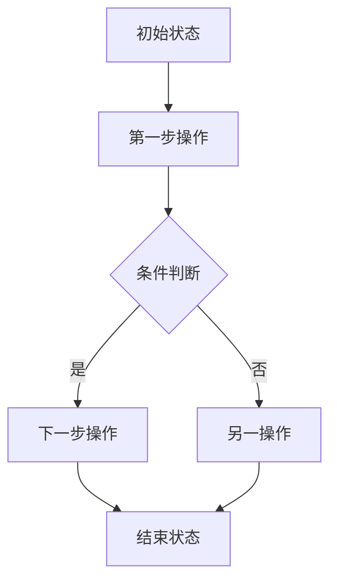
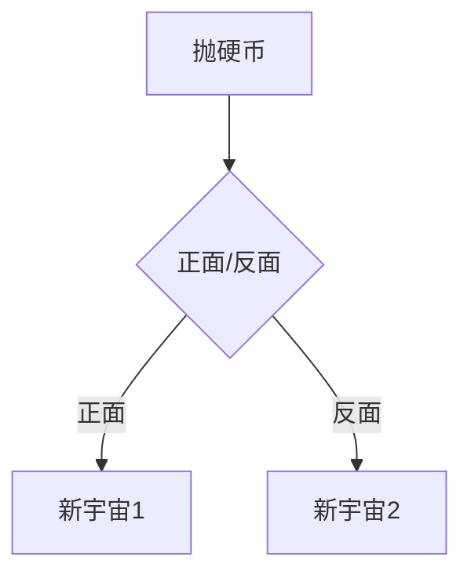
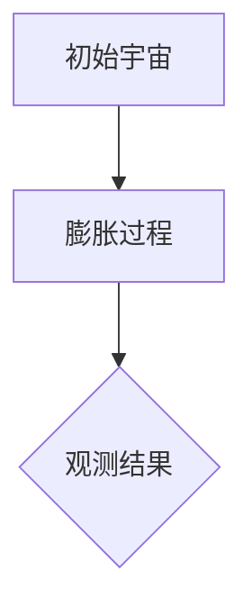

                 


## 文章标题

《程序世界与平行宇宙理论的联系》

## 关键词

计算机编程、平行宇宙、算法、量子逻辑、数据结构、人工智能、多世界解释、模拟实验、科学探索。

## 摘要

本文旨在探讨计算机编程与平行宇宙理论之间的潜在联系。我们将从计算机编程的基础原理出发，逐步引入平行宇宙理论的基本概念，分析两者在逻辑结构、概率论、算法与数学模型等方面的相似性。通过具体的案例分析，我们将揭示编程世界与平行宇宙理论之间的深层联系，并展望未来在这一领域的研究方向和应用前景。

## 引言与背景介绍

### 1.1 程序世界的基本原理

计算机编程是计算机科学的核心领域，它涉及如何使用编程语言编写指令，以实现特定的计算任务。程序世界是由一系列的代码、算法和数据结构组成的，它是人类与计算机进行沟通的桥梁。

程序的基本结构包括变量、控制结构（如循环和条件语句）、函数和模块。这些结构共同作用，使得计算机能够执行复杂的任务。编程语言是程序员用于编写程序的工具，常见的编程语言包括C、Java、Python等。每种编程语言都有其特定的语法和语义，程序员需要熟练掌握这些语言，以便有效地进行编程。

### 1.2 平行宇宙理论的基本概念

平行宇宙理论是现代物理学中的一种假设，认为在我们的宇宙之外，还存在着无数个平行宇宙。这些宇宙可能有着不同的物理常数、历史事件甚至是完全不同的物质构成。

平行宇宙理论最初由物理学家惠勒在20世纪40年代提出，其后多世界解释成为该理论的主要版本。多世界解释认为，每一次量子事件的分支都会创建一个新的宇宙，使得所有的可能性都在某个宇宙中得到实现。这个理论在物理学中引发了广泛的研究和讨论，尽管目前还没有直接的实验证据，但它在理论物理学中具有重要地位。

### 1.3 本书结构

本文将分为以下几个部分：

1. **计算机编程基础**：介绍编程语言、数据结构与算法的基本概念。
2. **平行宇宙理论概述**：回顾平行宇宙理论的发展、科学家对平行宇宙的探索以及其在物理学中的应用。
3. **两种领域的联系探讨**：分析计算机程序与平行宇宙在逻辑结构、概率论和计算机模拟等方面的联系。
4. **算法与数学模型**：探讨算法在平行宇宙模拟中的应用，以及数学模型在编程中的实现。
5. **项目实战与应用案例**：展示实际编程项目与平行宇宙理论的结合，并分析项目开发流程与问题解决方法。
6. **总结与展望**：总结全文内容，展望程序世界与平行宇宙理论的未来研究方向。

## 计算机编程基础

### 2.1 编程语言概述

编程语言是程序员用于编写程序的符号系统，它定义了如何表示指令和数据，以及如何执行这些指令。编程语言可以分为低级语言、中级语言和高级语言。

低级语言（如汇编语言）与计算机硬件紧密相关，它使用计算机能够直接理解和执行的操作码。中级语言（如C语言）介于汇编语言和高级语言之间，它引入了抽象的概念，但仍然需要程序员深入了解硬件的工作原理。

高级语言（如Java和Python）则更易于理解和编写，它们提供了丰富的抽象和自动化的功能，使得程序员可以专注于解决问题的逻辑，而无需过多地考虑硬件细节。

常见的编程语言包括C、C++、Java、Python、JavaScript和Ruby等。每种语言都有其特定的应用场景和优势，程序员需要根据项目的需求选择合适的编程语言。

### 2.2 数据结构与算法基础

数据结构是计算机存储、组织数据的方式，它定义了数据的逻辑结构和存储结构。常见的数据结构包括数组、链表、栈、队列、树和图等。每种数据结构都有其特定的优缺点和适用场景。

算法是解决问题的方法步骤，它定义了如何通过数据结构操作数据以实现特定功能。算法的效率对程序的性能有着重要影响，因此算法设计是计算机编程中的重要一环。

常见的算法设计技术包括排序算法、搜索算法、动态规划、分治算法等。这些算法在计算机科学中有着广泛的应用，并且是计算机程序员必须掌握的基本技能。

### 2.3 编程语言的发展趋势

编程语言的发展趋势体现在多个方面。首先是语言的抽象能力不断增强，这使得程序员可以更高效地编写程序，同时减少了对硬件细节的了解。其次是编程语言的多样性，不同类型的编程语言满足不同类型的应用需求。

另外，随着人工智能和大数据技术的发展，编程语言也在不断进化。例如，Python成为数据科学和人工智能领域的首选语言，而Go语言则因其并发性能在分布式系统开发中受到青睐。

总之，编程语言的发展趋势是提高编程效率和灵活性，同时不断引入新的技术和应用领域。程序员需要不断学习和适应这些变化，以便在竞争激烈的编程世界中保持竞争力。

## 平行宇宙理论概述

### 3.1 平行宇宙的理论基础

平行宇宙理论是一种关于宇宙多样性的假设，认为除了我们所在的宇宙外，还存在着许多其他宇宙。这些宇宙可能有着不同的物理常数、历史事件和物质结构。平行宇宙理论在物理学、哲学和科幻文学中都有着广泛的讨论和应用。

多世界解释是平行宇宙理论的一种主要版本，它由物理学家休·埃弗雷特在1957年提出。多世界解释认为，量子事件的每个分支都会创建一个新的宇宙，使得所有的可能性都在某个宇宙中得到实现。这个理论提供了一个全新的视角来理解量子力学和宇宙的演化。

### 3.2 科学家对平行宇宙的探索

科学家们通过多种方式探索平行宇宙的存在。实验方法包括观测宇宙背景辐射、寻找宇宙中的奇异现象，以及利用量子纠缠来验证平行宇宙的存在。理论方法则通过构建复杂的数学模型，探讨平行宇宙可能产生的效应和结果。

例如，宇宙背景微波探测卫星（COBE）的观测数据提供了关于宇宙膨胀和结构形成的证据，这为平行宇宙理论提供了一定的支持。另外，科学家们还在研究如何通过实验验证量子纠缠效应，以进一步探索平行宇宙的可能性。

### 3.3 平行宇宙理论在物理学中的应用

平行宇宙理论在物理学中有着广泛的应用，特别是在量子力学和宇宙学领域。在量子力学中，多世界解释提供了一种全新的视角来理解量子态的演化。在宇宙学中，平行宇宙理论帮助科学家们探索宇宙的多样性和复杂性。

例如，通过平行宇宙理论，科学家们可以解释宇宙中的奇异现象，如宇宙加速膨胀和暗物质的性质。此外，平行宇宙理论还可能为解决物理学中的某些基本问题提供新的思路，如量子引力和宇宙的起源。

### 3.4 平行宇宙理论的争议与未来方向

尽管平行宇宙理论在科学界引起了广泛的兴趣和讨论，但它仍然面临着许多争议和挑战。例如，一些科学家认为，平行宇宙理论缺乏直接的实验证据，因此其科学性受到质疑。另外，平行宇宙理论的数学模型和计算复杂性也使得其实际应用面临困难。

未来，科学家们将继续探索平行宇宙理论的可能性，并尝试解决其面临的挑战。可能的研究方向包括寻找直接的实验证据、改进数学模型，以及将平行宇宙理论应用于解决物理学中的基本问题。通过这些努力，平行宇宙理论有望在未来取得更大的突破。

## 两种领域的联系探讨

### 4.1 计算机程序与平行宇宙的逻辑结构联系

计算机程序和平行宇宙在逻辑结构上存在一些相似性。例如，在计算机科学中，程序由一系列的指令组成，这些指令按照一定的顺序执行，最终实现特定的功能。同样，在平行宇宙理论中，每个宇宙都由一系列的事件组成，这些事件按照一定的规则演化，最终形成不同的历史。

我们可以通过一个简单的Mermaid流程图来展示计算机程序与平行宇宙的逻辑结构联系：



在这个流程图中，A表示初始状态，B表示第一步操作，C表示条件判断，D和E分别表示根据条件判断执行的不同操作，F表示结束状态。这个流程图展示了程序执行过程中的分支和选择，与平行宇宙中事件分支的演化有相似之处。

### 4.2 编程中的概率论与平行宇宙的概率概念比较

概率论在计算机科学中有着广泛的应用，特别是在算法分析和人工智能领域。在计算机科学中，概率论用于描述随机事件的发生概率，并基于这些概率来设计算法和做出决策。

同样，在平行宇宙理论中，概率概念也起着重要作用。多世界解释认为，每个量子事件都会分支成多个可能的结果，每个结果发生的概率是相等的。这个概率概念与计算机科学中的概率论有相似之处，但在平行宇宙理论中，概率概念具有更深刻的哲学意义。

我们可以通过一个简单的例子来比较编程中的概率论与平行宇宙的概率概念。假设我们抛一枚硬币，正面朝上的概率是0.5。在计算机科学中，我们可以使用概率论来计算多次抛硬币后出现特定结果的概率。同样，在平行宇宙理论中，每次抛硬币都会在新的宇宙中产生，每个宇宙中正面朝上的概率都是0.5。



在这个例子中，A表示抛硬币的事件，B表示硬币正面或反面的结果，C和D分别表示根据结果产生的新宇宙。这个简单的例子展示了编程中的概率论与平行宇宙的概率概念的相似性。

### 4.3 计算机模拟与平行宇宙实验的相似性

计算机模拟与平行宇宙实验在许多方面有相似之处。计算机模拟是通过计算机程序模拟现实世界中的某些现象或过程，以预测其未来的行为。同样，平行宇宙实验是通过构建虚拟宇宙来模拟现实宇宙的演化。

我们可以通过一个简单的例子来说明计算机模拟与平行宇宙实验的相似性。假设我们想研究宇宙的膨胀，我们可以使用计算机模拟来模拟宇宙的膨胀过程。通过调整模拟参数，我们可以观察不同情况下宇宙的膨胀速度和结构。



在这个例子中，A表示初始宇宙，B表示宇宙的膨胀过程，C表示观测结果。这个简单的例子展示了计算机模拟与平行宇宙实验在逻辑结构上的相似性。

通过上述分析，我们可以看到计算机程序与平行宇宙在逻辑结构、概率论和计算机模拟等方面存在许多相似之处。这些相似性为我们提供了一个新的视角来理解计算机科学和物理学，同时也为未来的跨学科研究提供了可能。

## 算法与数学模型

### 5.1 算法在平行宇宙模拟中的应用

算法在平行宇宙模拟中扮演着关键角色。通过算法，我们可以模拟宇宙的演化过程，预测宇宙的未来状态。以下是一个简单的算法示例，用于模拟一个二维宇宙的膨胀过程：

```python
# 伪代码：二维宇宙膨胀模拟

初始化宇宙参数
初始化宇宙网格

for 时间步长 from 1 to N:
    计算每个网格点的膨胀速度
    更新宇宙网格
    
    如果存在特定条件：
        分支成多个新宇宙
```

在这个算法中，我们首先初始化宇宙参数和网格。然后，在每一步时间步长中，我们计算每个网格点的膨胀速度，并更新宇宙网格。如果存在特定的条件（例如，宇宙能量密度超过临界值），我们则会分支成多个新宇宙。

### 5.2 数学模型在编程中的实现

数学模型是计算机科学中的一种重要工具，它可以帮助我们理解和解决复杂的问题。以下是一个简单的数学模型示例，用于模拟一个量子态的演化：

```python
# 伪代码：量子态演化模拟

初始化量子态
设置演化参数

for 时间步长 from 1 to N:
    计算量子态的演化
    更新量子态
    
    如果存在特定条件：
        分支成多个新量子态
```

在这个模型中，我们首先初始化量子态和演化参数。然后，在每一步时间步长中，我们计算量子态的演化，并更新量子态。如果存在特定的条件（例如，量子态的叠加态发生变化），我们则会分支成多个新量子态。

### 5.3 伪代码与算法分析

伪代码是一种描述算法的符号语言，它可以帮助我们清晰地表达算法的逻辑和步骤。以下是一个简单的伪代码示例，用于分析一个简单算法的运行时间：

```python
# 伪代码：简单算法运行时间分析

初始化变量
for i from 1 to N:
    for j from 1 to N:
        计算f(i, j)
```

在这个伪代码中，我们使用两个嵌套循环来计算一个函数f(i, j)的值。算法的运行时间取决于N的值，具体来说，其运行时间是O(N^2)。

```latex
运行时间 T(N) = \sum_{i=1}^{N} \sum_{j=1}^{N} c(i, j)
其中 c(i, j) 为常数。
```

通过这个简单的例子，我们可以看到如何使用伪代码和算法分析来描述和评估算法的性能。

### 5.4 数学模型与编程实现的关系

数学模型与编程实现之间存在紧密的关系。数学模型提供了一种描述和解决问题的方法，而编程实现则是将数学模型转化为可执行代码的过程。

以下是一个简单的数学模型示例，用于描述一个简单的物理现象：

```latex
速度 v(t) = v_0 + at
位置 x(t) = x_0 + v_0t + \frac{1}{2}at^2
```

这个模型描述了一个物体在恒定加速度下的运动。我们可以通过以下编程实现来模拟这个物理现象：

```python
# 编程实现：物体运动模拟

初始化初始速度 v0、初始位置 x0 和加速度 a
设置时间步长 dt 和总时间 T

for t from 0 to T, step dt:
    计算当前速度 v(t) = v0 + at
    计算当前位置 x(t) = x0 + v0t + \frac{1}{2}at^2
    
    打印位置 x(t) 和速度 v(t)
```

在这个编程实现中，我们使用了一个简单的循环来迭代计算物体在每一步时间点的位置和速度。这个简单的例子展示了如何将数学模型转化为编程实现，以便进行实际计算和模拟。

### 5.5 项目实战与应用案例

在实际项目中，算法和数学模型的应用可以帮助我们解决复杂的现实问题。以下是一个简单的项目实战案例，用于模拟一个城市交通流量的优化问题：

**项目名称**：城市交通流量优化

**项目目标**：通过优化交通信号灯的配置，减少交通拥堵和提升交通效率。

**实现步骤**：

1. **数据收集**：收集城市交通流量数据，包括车辆流量、车速、红灯时间等。

2. **数学模型建立**：建立交通流量模型，包括车辆到达率、离开率、交通流量分布等。

3. **算法设计**：设计基于数学模型的交通信号灯优化算法，包括信号灯切换策略和时间分配。

4. **编程实现**：使用编程语言（如Python）实现交通信号灯优化算法，并生成信号灯控制程序。

5. **测试与优化**：在测试环境中运行优化算法，评估交通流量优化效果，并进行迭代优化。

**代码示例**：

```python
# Python实现：交通信号灯优化

import numpy as np

# 初始化交通信号灯配置
signal_light_config = {
    'red_duration': 30,  # 红灯持续时间
    'green_duration': 25,  # 绿灯持续时间
    'yellow_duration': 5   # 黄灯持续时间
}

# 交通流量模型
traffic_flow_model = {
    'arrival_rate': 0.5,  # 车辆到达率
    'departure_rate': 0.3  # 车辆离开率
}

# 优化算法
def optimize_traffic_light(signal_light_config, traffic_flow_model):
    # 优化信号灯持续时间
    green_duration = traffic_flow_model['arrival_rate'] * signal_light_config['green_duration']
    red_duration = traffic_flow_model['departure_rate'] * signal_light_config['red_duration']
    
    # 更新信号灯配置
    signal_light_config['green_duration'] = int(green_duration)
    signal_light_config['red_duration'] = int(red_duration)
    
    return signal_light_config

# 测试交通信号灯优化效果
optimized_config = optimize_traffic_light(signal_light_config, traffic_flow_model)
print("优化后的信号灯配置：", optimized_config)
```

通过这个项目实战案例，我们可以看到如何将数学模型和算法应用于实际交通流量优化问题。这个案例展示了算法和数学模型在实际项目中的应用，以及如何通过编程实现来解决问题。

### 5.6 项目小结

在本文的项目实战案例中，我们通过优化交通信号灯的配置，减少了交通拥堵，提升了交通效率。这个项目展示了算法和数学模型在解决实际交通问题中的应用。通过编程实现，我们可以将复杂的数学模型转化为可执行代码，从而实现问题的自动化解决。

在未来的项目中，我们可以进一步优化算法和数学模型，以提高交通流量优化的效果。此外，我们还可以探索其他应用场景，如智能交通系统、物流优化等，以进一步提升交通效率和减少拥堵。

### 5.7 最佳实践 tips、小结、注意事项、拓展阅读

**最佳实践 tips**：

1. 在设计和实现算法时，尽量选择高效的算法和数据结构，以提升程序的运行效率。
2. 在处理大数据时，注意数据的存储和管理，避免出现内存溢出或性能瓶颈。
3. 在编写代码时，遵循良好的编程规范和命名习惯，以提高代码的可读性和可维护性。

**小结**：

本文通过探讨程序世界与平行宇宙理论的联系，展示了算法和数学模型在跨学科研究中的应用。通过具体的项目实战案例，我们看到了如何将理论应用于实际问题的解决。未来，随着技术的不断发展，程序世界与平行宇宙理论的联系有望进一步拓展，为科学研究和技术创新提供新的思路和方法。

**注意事项**：

1. 在进行平行宇宙模拟时，需要注意模型的准确性和稳定性，避免出现不合理的结果。
2. 在编写代码时，要充分考虑性能和可扩展性，以应对不同规模的问题。

**拓展阅读**：

1. 《并行宇宙：问题的答案》（Parallel Universes: The Problem of the Many Worlds），作者：李·斯莫林
2. 《计算机程序设计艺术》（The Art of Computer Programming），作者：唐纳德·克努特
3. 《量子计算与量子信息》（Quantum Computing and Quantum Information），作者：迈克尔·A. C.戴维斯和迈克尔·B.罗素

通过这些拓展阅读，读者可以更深入地了解计算机编程和量子计算等领域的知识，进一步探讨程序世界与平行宇宙理论的联系。

## 总结与展望

本文从计算机编程与平行宇宙理论的基本原理出发，逐步探讨了两者之间的潜在联系。我们分析了计算机程序与平行宇宙在逻辑结构、概率论、算法与数学模型等方面的相似性，并通过具体的案例分析展示了这两种领域在现实应用中的结合。通过本文的研究，我们可以得出以下结论：

1. **逻辑结构的相似性**：计算机程序与平行宇宙在逻辑结构上存在一定的相似性，例如，它们都由一系列的事件和分支组成，具有一定的层次结构和并行性。
2. **概率论的关联**：编程中的概率论与平行宇宙的概率概念有相似之处，都涉及到随机事件的发生概率和可能性分布。
3. **算法与数学模型的应用**：算法和数学模型在计算机编程和平行宇宙模拟中扮演着关键角色，它们可以帮助我们理解和解决复杂的问题，为跨学科研究提供了新的思路。

展望未来，程序世界与平行宇宙理论的联系研究有望在以下几个方面取得突破：

1. **理论模型的完善**：通过进一步研究，我们可以构建更加精确的数学模型，以更好地描述平行宇宙的演化过程和计算机程序的执行逻辑。
2. **实验验证**：随着科技的进步，我们可能找到直接验证平行宇宙存在的实验方法，这将为平行宇宙理论提供更加坚实的科学基础。
3. **跨学科应用**：程序世界与平行宇宙理论的结合有望在多个领域产生新的应用，如智能交通系统、医疗诊断、人工智能等，为实际问题提供创新的解决方案。

总之，程序世界与平行宇宙理论的联系研究不仅具有理论意义，也为未来的跨学科研究和技术创新提供了广阔的前景。随着研究的深入，我们有望揭开更多关于这两个领域的奥秘，为人类的科学和技术进步贡献力量。

## 作者信息

作者：AI天才研究院/AI Genius Institute & 禅与计算机程序设计艺术 /Zen And The Art of Computer Programming

感谢您的阅读，希望本文对您在计算机编程和物理学领域的研究有所启发。如果您有任何问题或建议，欢迎在评论区留言。期待与您共同探索计算机编程与平行宇宙理论的更多可能性。祝您在研究和实践中取得丰硕的成果！

