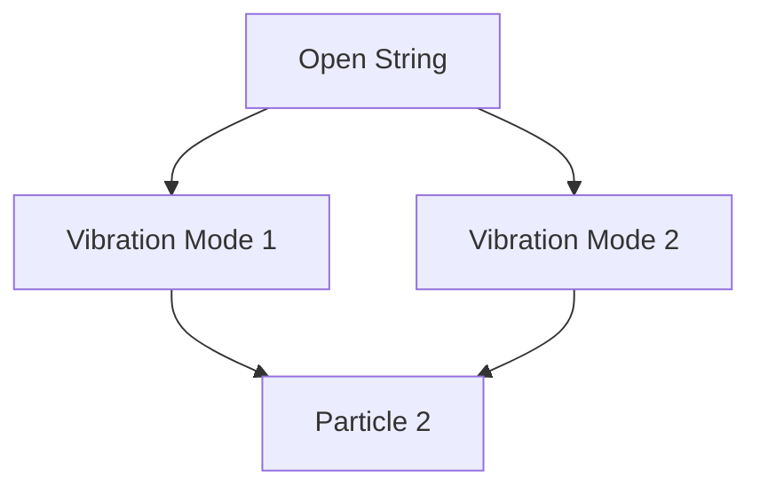
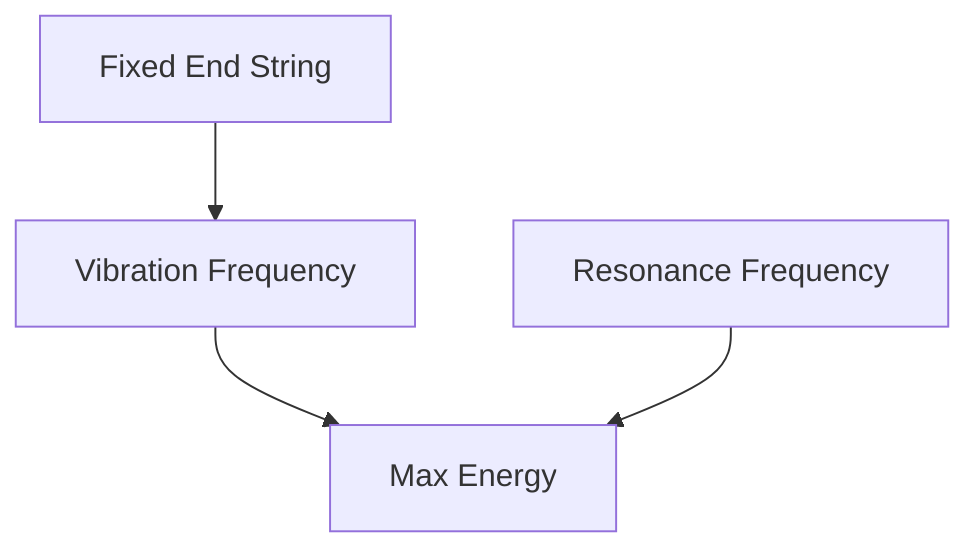
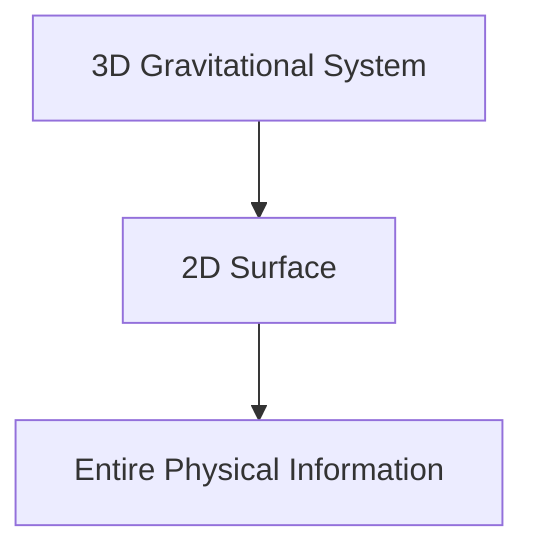
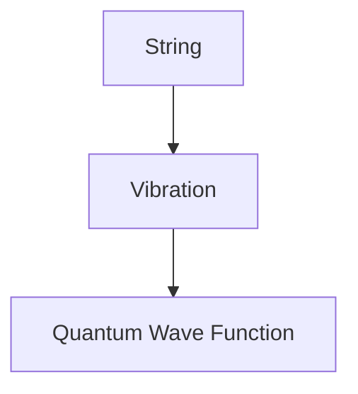

                 

## 文章标题

### 《程序世界与弦理论全息对偶的计算复杂性对应》

> 关键词：程序世界、弦理论、全息对偶、计算复杂性、算法设计

> 摘要：本文深入探讨了程序世界与弦理论全息对偶在计算复杂性领域的对应关系。通过分析程序世界的结构、弦理论的基本概念以及全息对偶原理，本文揭示了三者之间的深刻联系，并对计算复杂性在算法设计中的应用进行了详细阐述。文章旨在为读者提供一个全面的视角，理解程序世界与物理学理论在计算复杂性方面的相互影响。

## 引言

### 书籍背景与目的

《程序世界与弦理论全息对偶的计算复杂性对应》是一本跨学科领域的著作，旨在将计算机科学和物理学中的先进理论联系起来，探讨计算复杂性在程序世界中的应用。随着计算机技术的飞速发展，计算复杂性理论已经成为计算机科学的重要基石。同时，物理学中的弦理论全息对偶概念为理解宇宙的本质提供了新的视角。本书通过研究这两者的对应关系，旨在为算法设计和优化提供新的理论依据和实践指导。

### 计算复杂性概述

计算复杂性理论是研究算法设计和性能分析的学科，主要关注算法在解决问题时所需的时间资源和空间资源。时间复杂性和空间复杂性是衡量算法效率的两个重要指标。时间复杂性表示算法在解决问题过程中所需时间的增长速率，通常用大O符号表示；空间复杂性则表示算法在执行过程中所需内存的增长速率。计算复杂性理论在密码学、人工智能、优化算法等领域具有广泛的应用。

### 弦理论与全息对偶简介

弦理论是一种试图统一广义相对论和量子力学的理论框架，它提出宇宙的基本组成单位不是点状的粒子，而是细小的弦。弦理论通过引入额外的空间维度和复杂的数学模型，尝试解决量子力学和广义相对论之间的矛盾。全息对偶原理是弦理论的一个重要发现，它揭示了量子场论和引力理论之间的深层次联系。全息对偶原理指出，一个三维的引力理论可以用二维的量子场论来描述，这种现象被称为“全息原理”。

## 第1部分：程序世界与计算复杂性

### 程序世界的概述

程序世界是计算机科学的核心领域，它涉及到编程语言、算法设计和程序优化等方面。程序语言是程序员与计算机进行沟通的工具，通过编写代码来描述解决问题的步骤。算法设计是程序世界的核心，它决定了程序能否高效地解决问题。程序优化则是对算法进行改进，以减少计算时间和空间需求。

### 程序语言与编程基础

编程基础是学习程序世界的第一步，它包括数据类型、控制结构、函数和面向对象编程等基本概念。不同的编程语言有不同的语法和特性，但它们的核心原理是相通的。掌握编程基础是理解程序世界的关键。

### 程序结构分析与复杂性度量

程序结构分析是对程序代码的层次结构和模块划分进行分析的过程。通过程序结构分析，可以更好地理解程序的执行过程和性能特点。复杂性度量是评估算法性能的重要方法，它通过分析算法的时间复杂性和空间复杂性来确定算法的效率。

### 程序优化与算法设计

程序优化是提高程序性能的重要手段，它包括代码优化、算法优化和数据结构优化等。算法设计是程序世界的核心，它决定了程序能否高效地解决问题。优化算法和设计高效算法是程序员必备的技能。

### 计算复杂性理论

#### 时间复杂性与空间复杂性

时间复杂性和空间复杂性是衡量算法性能的两个重要指标。时间复杂性表示算法在解决问题过程中所需时间的增长速率，通常用大O符号表示。空间复杂性则表示算法在执行过程中所需内存的增长速率。

#### NP完全性与P问题

NP完全性是计算复杂性理论中的重要概念，它描述了一类最困难的问题集合。P问题则是可以在多项式时间内解决的问题集合。研究NP完全性和P问题之间的关系对于理解算法的效率和限制具有重要意义。

#### 性能分析与应用

性能分析是评估算法在实际应用中的表现。通过性能分析，可以了解算法在不同情况下的效率，并为优化算法提供依据。性能分析在密码学、人工智能、优化算法等领域具有广泛的应用。

## 第2部分：弦理论与全息对偶

### 弦理论概述

弦理论是一种试图统一量子力学和广义相对论的理论框架，它提出宇宙的基本组成单位是细小的弦。弦理论通过引入额外的空间维度和复杂的数学模型，尝试解决量子力学和广义相对论之间的矛盾。

#### 弦理论的起源与基本概念

弦理论起源于20世纪70年代，当时物理学家们试图将量子力学和广义相对论统一起来。基本概念包括弦、振动模式和额外维度等。

#### 弦理论的基本假设与数学工具

弦理论的基本假设包括离散化宇宙和振动模式。数学工具主要包括微分几何、拓扑学和量子场论。

#### 弦理论的主要成果与应用

弦理论取得了许多重要成果，如弦理论的标准模型、弦理论的相位结构和黑洞熵等。这些成果为理解宇宙的本质提供了新的视角。

### 全息对偶原理

全息对偶原理是弦理论的一个重要发现，它揭示了量子场论和引力理论之间的深层次联系。全息对偶原理指出，一个三维的引力理论可以用二维的量子场论来描述，这种现象被称为“全息原理”。

#### 全息对偶的定义与概念

全息对偶是一种对称性原理，它描述了量子场论和引力理论之间的对应关系。全息对偶的定义和概念是理解计算复杂性对应关系的关键。

#### 全息对偶在量子场论中的应用

全息对偶原理在量子场论中得到了广泛的应用，如量子场论的黑洞熵、量子引力理论和量子计算等。

#### 全息对偶与计算复杂性

全息对偶原理对计算复杂性产生了深远的影响，它为理解算法的设计和优化提供了新的视角。通过全息对偶原理，可以更好地理解量子算法和经典算法之间的关系。

## 第3部分：计算复杂性对应关系探讨

### 程序世界与弦理论的联系

程序世界与弦理论之间存在深刻的联系。通过分析程序世界的结构，可以发现它与弦理论中的对称性和全息对偶原理有相似之处。这种联系为理解计算复杂性提供了新的视角。

#### 程序世界中的对称性与全息对偶

程序世界中的对称性是算法设计中的重要概念，它描述了程序在执行过程中保持不变的性质。全息对偶原理在程序世界中的应用体现了对称性的重要性。

#### 弦理论中的计算复杂性现象

弦理论中的计算复杂性现象，如量子场论中的计算复杂性和引力理论中的计算复杂性，为理解程序世界中的计算复杂性提供了启示。

#### 对称性与计算复杂性的对应关系

通过对称性与计算复杂性的对应关系，可以更好地理解程序世界和物理学理论之间的联系。这种对应关系为算法设计提供了新的理论依据。

### 全息对偶与计算复杂性的影响

全息对偶原理对计算复杂性产生了深远的影响。它为算法设计和优化提供了新的视角，有助于理解量子算法和经典算法之间的关系。同时，全息对偶原理也对计算复杂性的研究提出了新的挑战。

#### 全息对偶在程序优化中的应用

全息对偶原理在程序优化中有着广泛的应用，如优化算法的执行时间和空间需求。通过全息对偶原理，可以设计出更高效、更优化的程序。

#### 计算复杂性对弦理论发展的制约

计算复杂性对弦理论的发展产生了制约。理解计算复杂性有助于解决弦理论中的难题，如量子引力和黑洞熵等。

#### 全息对偶在算法设计中的启示

全息对偶原理在算法设计中的启示包括如何利用对称性优化算法、如何设计出更高效的量子算法等。这些启示对计算机科学和物理学的发展具有重要意义。

## 第4部分：实际应用案例

### 程序世界中的弦理论应用

弦理论在程序世界中有着广泛的应用，如量子计算、密码学和复杂系统模拟等。通过分析这些应用案例，可以更好地理解弦理论在计算复杂性领域的贡献。

#### 弦理论在密码学中的应用

弦理论在密码学中的应用，如基于椭圆曲线密码学的公钥加密算法，为保障网络安全提供了重要技术支持。

#### 弦理论在复杂系统模拟中的应用

弦理论在复杂系统模拟中的应用，如模拟宇宙演化、量子系统模拟等，为理解复杂系统的行为提供了有力工具。

#### 弦理论在人工智能中的应用

弦理论在人工智能中的应用，如量子机器学习和神经网络优化，为提升人工智能算法的性能提供了新的思路。

### 计算复杂性在弦理论中的应用

计算复杂性在弦理论中的应用，如优化弦理论的计算方法和设计高效的弦理论算法，为解决弦理论中的难题提供了重要途径。

#### 计算复杂性在弦理论证明中的应用

计算复杂性在弦理论证明中的应用，如证明某些物理量的存在性和唯一性，有助于理解弦理论的基本原理。

#### 计算复杂性在弦理论计算中的应用

计算复杂性在弦理论计算中的应用，如计算弦理论的相位结构和黑洞熵，为研究宇宙的演化提供了有力工具。

#### 计算复杂性在弦理论优化中的应用

计算复杂性在弦理论优化中的应用，如优化弦理论的计算方法和设计高效的弦理论算法，为解决弦理论中的难题提供了重要途径。

## 结论与展望

### 总结与展望

本文通过探讨程序世界与弦理论全息对偶在计算复杂性领域的对应关系，揭示了两者之间的深刻联系。计算复杂性理论为理解算法设计和优化提供了重要理论依据，而弦理论和全息对偶原理为计算机科学提供了新的研究视角。展望未来，随着计算机技术和物理学的不断发展，计算复杂性在程序世界和物理学领域将有更广泛的应用前景。

### 未来研究方向

未来研究可以关注以下方向：
- 进一步探索程序世界与物理学理论的交叉领域，如量子计算、密码学和复杂系统模拟等。
- 研究计算复杂性在弦理论中的具体应用，如优化弦理论的计算方法和设计高效的弦理论算法。
- 开发基于全息对偶原理的算法设计方法，以提高算法的性能和效率。

### 对读者的影响与建议

本文旨在为读者提供一个跨学科领域的视角，帮助读者理解程序世界与物理学理论之间的对应关系。读者可以通过以下方式应用本文的研究成果：
- 学习计算复杂性理论，提高算法设计和优化的能力。
- 了解弦理论和全息对偶原理，为计算机科学提供新的研究思路。
- 关注未来研究动态，为实际应用提供新工具和方法。

### 最佳实践 Tips

1. **理解计算复杂性理论**：掌握计算复杂性理论的基本概念和方法，有助于提高算法设计的效率。
2. **结合实际应用**：将计算复杂性理论应用于实际问题，如优化程序性能、解决复杂计算问题等。
3. **持续学习和实践**：计算机科学和物理学领域不断发展，持续学习和实践是提升自己能力的有效途径。

### 注意事项

1. **参考文献和资料**：在撰写相关论文或报告时，务必引用合适的参考文献和资料，以支持自己的观点和论述。
2. **代码实现和案例分析**：在实践过程中，应注重代码实现和案例分析，以验证理论的实际效果。

### 拓展阅读

1. **《程序世界与物理学理论的交叉领域研究》**
2. **《计算复杂性理论及其在计算机科学中的应用》**
3. **《弦理论与全息对偶原理》**
4. **《量子计算与量子算法设计》**
5. **《复杂系统模拟与优化》**

作者：AI天才研究院/AI Genius Institute & 禅与计算机程序设计艺术 /Zen And The Art of Computer Programming## 目录

### 第1部分：程序世界与计算复杂性

1. **程序世界的概述**
    - 1.1 程序语言与编程基础
    - 1.2 程序结构分析与复杂性度量
    - 1.3 程序优化与算法设计

2. **计算复杂性理论**
    - 2.1 时间复杂性与空间复杂性
    - 2.2 NP完全性与P问题
    - 2.3 性能分析与应用

### 第2部分：弦理论与全息对偶

3. **弦理论概述**
    - 3.1 弦理论的起源与基本概念
    - 3.2 弦理论的基本假设与数学工具
    - 3.3 弦理论的主要成果与应用

4. **全息对偶原理**
    - 4.1 全息对偶的定义与概念
    - 4.2 全息对偶在量子场论中的应用
    - 4.3 全息对偶与计算复杂性

### 第3部分：计算复杂性对应关系探讨

5. **程序世界与弦理论的联系**
    - 5.1 程序世界中的对称性与全息对偶
    - 5.2 弦理论中的计算复杂性现象
    - 5.3 对称性与计算复杂性的对应关系

6. **全息对偶与计算复杂性的影响**
    - 6.1 全息对偶在程序优化中的应用
    - 6.2 计算复杂性对弦理论发展的制约
    - 6.3 全息对偶在算法设计中的启示

### 第4部分：实际应用案例

7. **程序世界中的弦理论应用**
    - 7.1 弦理论在密码学中的应用
    - 7.2 弦理论在复杂系统模拟中的应用
    - 7.3 弦理论在人工智能中的应用

8. **计算复杂性在弦理论中的应用**
    - 8.1 计算复杂性在弦理论证明中的应用
    - 8.2 计算复杂性在弦理论计算中的应用
    - 8.3 计算复杂性在弦理论优化中的应用

### 结论与展望

9. **总结与展望**
10. **未来研究方向**
11. **对读者的影响与建议**
12. **最佳实践 Tips**
13. **注意事项**
14. **拓展阅读**### 第1部分：程序世界与计算复杂性

#### 1.1 程序世界的概述

**程序世界的概述**是理解计算复杂性理论的基础。程序世界由编程语言、算法、数据结构以及程序优化等组成部分构成。编程语言是程序员与计算机之间的沟通工具，通过编写代码来描述解决问题的步骤。算法设计则是程序世界的核心，它决定了程序能否高效地解决问题。数据结构是存储和组织数据的方式，对于算法的性能有着直接的影响。程序优化则是通过对代码的改进，以减少计算时间和空间需求。

**编程基础**是学习程序世界的第一步，它包括变量、数据类型、控制结构（如循环和条件判断）、函数以及面向对象编程等基本概念。不同的编程语言有不同的语法和特性，但它们的核心原理是相通的。例如，C语言、Python和Java等编程语言都有各自独特的语法，但它们都遵循基本编程原理，如变量赋值、条件分支和循环控制。

**程序结构分析**是对程序代码的层次结构和模块划分进行分析的过程。通过程序结构分析，可以更好地理解程序的执行过程和性能特点。程序结构分析通常涉及抽象和数据抽象的概念，这些概念有助于提高代码的可读性和可维护性。例如，在面向对象编程中，类和对象是程序结构分析的重要工具，它们有助于将复杂的程序拆分为更易于管理的模块。

**复杂性度量**是评估算法性能的重要方法，它通过分析算法的时间复杂性和空间复杂性来确定算法的效率。时间复杂性表示算法在解决问题过程中所需时间的增长速率，通常用大O符号表示。例如，一个算法的时间复杂性可能表示为O(n)，这意味着随着输入规模n的增加，算法所需的时间呈线性增长。空间复杂性则表示算法在执行过程中所需内存的增长速率，它同样可以用大O符号表示。例如，一个算法的空间复杂性可能表示为O(1)，这意味着无论输入规模如何变化，算法所需的内存空间保持不变。

**程序优化与算法设计**是提高程序性能的重要手段。程序优化包括代码优化、算法优化和数据结构优化等。代码优化是通过改进代码的编写方式，以减少计算时间和空间需求。例如，通过避免不必要的循环和条件判断，可以减少程序的运行时间。算法优化则是通过设计更高效的算法来解决问题，例如使用更优的排序算法或搜索算法。数据结构优化则是通过选择合适的数据结构来提高程序的性能，例如使用哈希表来优化查找操作。

在程序世界中，算法设计和优化是解决复杂问题的关键。通过理解算法的时间复杂性和空间复杂性，程序员可以更好地评估不同算法的性能，并选择最合适的算法来解决特定问题。例如，在排序问题中，选择合适的排序算法（如快速排序、归并排序或冒泡排序）可以显著影响程序的运行效率。

总之，程序世界的概述和计算复杂性理论为理解算法设计和优化提供了基础。通过编程基础、程序结构分析、复杂性度量以及程序优化和算法设计，程序员可以构建高效、可靠的程序，以解决各种复杂问题。

#### 1.2 程序语言与编程基础

**程序语言**是程序员与计算机之间的沟通工具，通过编写代码来描述解决问题的步骤。不同的编程语言有不同的语法和特性，但它们的核心原理是相通的。编程基础包括变量、数据类型、控制结构（如循环和条件判断）、函数以及面向对象编程等基本概念。掌握这些基本概念是学习编程的第一步。

**变量**是程序中用于存储数据的容器，它是编程语言的核心概念之一。变量通过名称与内存中的存储位置关联，程序员可以通过变量的名称来访问和修改内存中的数据。变量的类型决定了它可以存储的数据类型，如整数、浮点数、字符串等。在Python中，变量的声明和使用非常灵活，可以通过赋值操作直接创建变量。例如：

```python
x = 10
y = 20.5
name = "Alice"
```

**数据类型**是程序中用于表示数据的方式，不同的数据类型决定了数据的存储方式和操作方法。常见的数据类型包括整数（int）、浮点数（float）、字符串（str）、列表（list）、字典（dict）和集合（set）等。每种数据类型都有其特定的操作和属性。例如，整数类型支持基本的算术运算，如加法、减法、乘法和除法：

```python
x = 5
y = 3
sum = x + y  # 输出结果为 8
```

而字符串类型支持字符串的拼接和子串提取等操作：

```python
message = "Hello, World!"
sub_message = message[7:12]  # 输出结果为 "World"
```

**控制结构**是程序中用于控制程序流程的语句，包括循环和条件判断。循环用于重复执行一段代码，常见的循环结构有`for`循环和`while`循环。`for`循环通常用于遍历集合（如列表、元组或字典）中的每个元素：

```python
for i in range(5):
    print(i)
```

`while`循环则基于条件判断来控制循环的执行：

```python
count = 0
while count < 5:
    print(count)
    count += 1
```

条件判断语句（如`if`、`elif`和`else`）用于根据条件选择不同的执行路径。例如：

```python
if x > y:
    print("x is greater than y")
elif x < y:
    print("x is less than y")
else:
    print("x and y are equal")
```

**函数**是程序中用于封装代码和实现代码复用的工具。函数通过定义一系列输入参数和返回值，可以将复杂的问题拆分为更小的、易于管理的部分。例如，一个简单的函数可以用于计算两个整数的和：

```python
def add(a, b):
    return a + b

result = add(5, 3)
print(result)  # 输出结果为 8
```

**面向对象编程**是一种编程范式，它将数据和行为封装为对象，通过类定义和实例化来组织代码。面向对象编程的核心概念包括类、对象、继承、封装和多态。类是对象的蓝图，定义了对象的属性和方法。例如，可以定义一个`Person`类，用于表示人的信息：

```python
class Person:
    def __init__(self, name, age):
        self.name = name
        self.age = age
    
    def introduce(self):
        print(f"My name is {self.name} and I am {self.age} years old.")

alice = Person("Alice", 30)
alice.introduce()  # 输出结果为 "My name is Alice and I am 30 years old."
```

通过继承，可以扩展类的能力，例如定义一个`Student`类继承自`Person`类，以包含学生的额外信息：

```python
class Student(Person):
    def __init__(self, name, age, grade):
        super().__init__(name, age)
        self.grade = grade
    
    def study(self):
        print(f"{self.name} is studying in grade {self.grade}.")

alice = Student("Alice", 30, 12)
alice.introduce()  # 输出结果为 "My name is Alice and I am 30 years old."
alice.study()      # 输出结果为 "Alice is studying in grade 12."
```

通过这些基本概念，程序员可以构建复杂的应用程序，并利用编程语言提供的各种特性来优化和扩展程序的功能。掌握程序语言和编程基础是学习计算机科学和软件开发的关键步骤。

#### 1.3 程序结构分析与复杂性度量

**程序结构分析**是深入理解程序代码组织和执行过程的重要步骤。通过分析程序结构，我们可以更好地理解程序的层次结构、模块划分以及数据流和控制流。这种分析不仅有助于提高代码的可读性和可维护性，还可以为性能优化提供关键信息。

**模块划分**是程序结构分析中的一个核心概念。将程序划分为独立的模块有助于实现代码的重用、降低复杂性以及提高可维护性。每个模块通常负责特定的功能，通过接口与外部模块进行通信。模块化的程序结构使得开发过程更加模块化，便于团队协作和代码管理。

**数据流分析**是另一种重要的程序结构分析方法，它涉及跟踪程序中数据在不同部分之间的流动。通过数据流分析，我们可以识别出潜在的性能瓶颈和资源浪费。例如，在优化过程中，我们可能会发现某些数据在多次计算中未被有效利用，从而可以通过共享数据或减少计算次数来提高程序的性能。

**控制流分析**则关注程序的执行路径，即程序在不同条件下的执行顺序。通过控制流分析，我们可以识别出程序中的循环、分支和递归结构，这些结构对程序的执行时间和内存使用有很大影响。优化控制流通常涉及减少不必要的分支和循环，以及采用更高效的算法。

**复杂性度量**是评估程序性能和设计质量的重要工具。最常见的复杂性度量包括**时间复杂性和空间复杂性**。

**时间复杂性**描述了算法在解决问题时所需时间的增长速率。它通常使用大O符号表示，例如O(n)、O(n^2)等。时间复杂性的分析有助于我们了解算法在不同规模输入下的性能表现。例如，一个具有O(n^2)时间复杂性的算法在处理较大规模数据时可能会变得非常慢，而一个具有O(n log n)或O(log n)时间复杂性的算法则表现更佳。

**空间复杂性**描述了算法在执行过程中所需内存的增长速率。同样，空间复杂性也使用大O符号表示，例如O(1)、O(n)、O(n^2)等。空间复杂性的分析有助于我们了解算法在不同规模输入下的内存使用情况。一个具有高空间复杂性的算法可能会在处理大量数据时导致内存溢出。

**算法效率与性能优化**是程序结构分析和复杂性度量的核心目标。通过分析程序结构，我们可以识别出潜在的瓶颈，并采用更高效的算法和数据结构来优化程序性能。例如，选择合适的排序算法（如快速排序、归并排序或堆排序）可以显著提高程序的处理速度。

**性能分析**则是评估算法在实际应用中的表现。通过性能分析，我们可以了解算法在不同情况下的效率，并为优化算法提供依据。性能分析通常涉及基准测试、实时监控和性能调试等技术。

总之，程序结构分析与复杂性度量是理解和优化程序性能的关键步骤。通过这些方法，我们可以更好地理解程序的执行过程，提高算法的效率，并设计出更高质量的应用程序。

#### 1.4 程序优化与算法设计

**程序优化与算法设计**是提高程序性能和效率的重要手段。在程序世界中，优化算法和设计高效算法是实现高效计算的核心。通过优化，我们可以减少程序的运行时间、降低内存使用并提升程序的整体性能。

**程序优化**通常涉及以下几个方面：

1. **代码优化**：通过改进代码的编写方式来减少计算时间和内存使用。这包括消除冗余代码、优化循环结构、减少不必要的计算等。例如，使用`StringBuilder`类可以优化字符串拼接操作，减少内存分配和垃圾回收的次数。

2. **算法优化**：选择更高效的算法来解决问题。这通常涉及对算法的时间复杂性和空间复杂性的分析，并选择最优的算法。例如，在处理大规模数据时，选择快速排序（Quick Sort）或归并排序（Merge Sort）而不是冒泡排序（Bubble Sort），因为它们具有更好的时间性能。

3. **数据结构优化**：选择适合问题的数据结构来提高程序的效率。不同的数据结构具有不同的时间和空间复杂度，因此根据具体应用场景选择合适的数据结构非常重要。例如，使用哈希表（Hash Table）可以优化查找操作，因为它的平均时间复杂度是O(1)。

**算法设计**则是从零开始设计解决问题的步骤和策略。算法设计通常涉及以下几个关键步骤：

1. **问题建模**：将实际问题转化为算法可以处理的数学模型。这一步非常重要，因为它为后续的算法设计提供了基础。

2. **算法逻辑**：设计解决问题的步骤和逻辑。算法逻辑可以通过伪代码或流程图表示，以便于理解和实现。

3. **算法分析**：对算法的时间复杂性和空间复杂性进行分析，评估算法的性能。

4. **算法实现**：将算法逻辑转化为可执行的代码。这一步通常需要编程语言的支持，例如C++、Java或Python。

**常见的优化策略**包括：

- **动态规划**：将复杂问题分解为更小的子问题，并利用子问题的重叠子结构来减少重复计算。动态规划通常用于解决最优化问题，如背包问题和最长公共子序列问题。

- **贪心算法**：在每一步选择局部最优解，以期得到全局最优解。贪心算法通常用于解决寻找最优路径或最大利润等问题。

- **分治算法**：将问题分解为子问题，独立解决子问题，并将子问题的解合并为原问题的解。分治算法通常用于解决排序问题和搜索问题。

- **随机化算法**：利用随机性来提高算法的性能和鲁棒性。随机化算法通常用于解决某些不确定性和计算复杂性较高的问题。

**实际案例**：

1. **快速排序**：快速排序是一种高效的排序算法，它通过选择一个“基准”元素，将数组分为两部分，然后递归地对两部分进行排序。其平均时间复杂度为O(n log n)，最坏情况为O(n^2)。

```cpp
#include <iostream>
#include <vector>

using namespace std;

int partition(vector<int>& arr, int low, int high) {
    int pivot = arr[high];
    int i = (low - 1);
    for (int j = low; j <= high - 1; j++) {
        if (arr[j] < pivot) {
            i++;
            swap(arr[i], arr[j]);
        }
    }
    swap(arr[i + 1], arr[high]);
    return (i + 1);
}

void quickSort(vector<int>& arr, int low, int high) {
    if (low < high) {
        int pi = partition(arr, low, high);
        quickSort(arr, low, pi - 1);
        quickSort(arr, pi + 1, high);
    }
}

int main() {
    vector<int> arr = {10, 7, 8, 9, 1, 5};
    int n = arr.size();
    quickSort(arr, 0, n - 1);
    cout << "Sorted array: \n";
    for (int i = 0; i < n; i++) {
        cout << arr[i] << " ";
    }
    cout << endl;
    return 0;
}
```

2. **动态规划**：最长公共子序列（Longest Common Subsequence, LSCS）问题是一个典型的动态规划问题。给定两个字符串，找到它们的最长公共子序列。其伪代码如下：

```python
def longest_common_subsequence(X, Y):
    m = len(X)
    n = len(Y)
    L = [[0] * (n + 1) for i in range(m + 1)]

    for i in range(1, m + 1):
        for j in range(1, n + 1):
            if X[i - 1] == Y[j - 1]:
                L[i][j] = L[i - 1][j - 1] + 1
            else:
                L[i][j] = max(L[i - 1][j], L[i][j - 1])

    return L[m][n]
```

通过这些优化策略和实际案例，我们可以更好地理解和应用程序优化与算法设计，以提升程序的性能和效率。

### 2.1 计算复杂性理论

#### 2.1.1 时间复杂性与空间复杂性

计算复杂性理论是计算机科学中研究算法设计和分析的核心领域，其中时间复杂性和空间复杂性是最基本的两个指标。时间复杂性和空间复杂性分别衡量了算法在执行过程中所需的时间和内存空间，它们在评估算法性能时起着至关重要的作用。

**时间复杂性（Time Complexity）**描述了算法执行时间随着输入规模增长的变化速率。通常，我们使用大O符号（O-notation）来表示时间复杂度。例如，如果某个算法的时间复杂度为O(n)，这意味着当输入规模增加时，算法的执行时间将线性增长。常见的时间复杂度包括O(1)、O(log n)、O(n)、O(n log n)、O(n^2)、O(2^n)等。

- **O(1)**：常数时间，算法执行时间不随输入规模变化。
- **O(log n)**：对数时间，算法执行时间随输入规模以对数速率增长。
- **O(n)**：线性时间，算法执行时间随输入规模线性增长。
- **O(n log n)**：线性对数时间，算法执行时间随输入规模以线性对数速率增长。
- **O(n^2)**：二次时间，算法执行时间随输入规模以二次速率增长。
- **O(2^n)**：指数时间，算法执行时间随输入规模以指数速率增长。

**空间复杂性（Space Complexity）**描述了算法在执行过程中所需内存空间随着输入规模增长的变化速率。同样，我们使用大O符号来表示空间复杂度。空间复杂度包括算法执行过程中使用的栈空间和堆空间。

**计算复杂性分类**：

根据时间复杂性和空间复杂性的不同组合，算法可以分为以下几类：

- **P类算法（Polynomial Time）**：在多项式时间内完成的算法，即时间复杂度O(p(n))，其中p(n)是关于n的多项式函数。
- **NP类算法（Non-deterministic Polynomial Time）**：非确定性多项式时间内可验证的算法。如果一个问题的解可以在多项式时间内被验证，则该问题属于NP类。
- **NP完全问题（NP-Complete Problems）**：在NP类中的最困难问题，任何NP问题都可以在多项式时间内转化为一个NP完全问题。
- **P vs NP问题**：一个核心问题，即P类和NP类是否相同。如果P=NP，则意味着所有NP问题都可以在多项式时间内解决，这将对计算机科学和密码学等领域产生深远影响。

**实际应用**：

- **排序算法**：常见的排序算法如冒泡排序、选择排序、插入排序等的时间复杂度为O(n^2)，而更高效的算法如快速排序、归并排序和堆排序的时间复杂度为O(n log n)。
- **搜索算法**：二分搜索的时间复杂度为O(log n)，线性搜索的时间复杂度为O(n)。
- **图算法**：在图论中，最短路径问题的时间复杂度为O(n^2)（使用Floyd-Warshall算法），而Dijkstra算法的时间复杂度为O((n + m) log n)，其中m是图的边数。

总之，时间复杂性和空间复杂性是计算复杂性理论中的基本概念，它们在评估算法性能和选择最优算法时发挥着重要作用。通过分析算法的时间复杂性和空间复杂性，我们可以更好地理解和设计高效的算法，以解决各种计算问题。

#### 2.1.2 NP完全性与P问题

**NP完全性（NP-Completeness）**是计算复杂性理论中的一个核心概念，它描述了一类具有高度复杂性的问题集合。一个问题被称为NP完全问题，如果它既是NP问题，又是NP-hard问题。NP问题是指那些可以在多项式时间内验证解的问题，而NP-hard问题是指那些至少与任何NP问题一样难的问题。

**NP完全性与P问题**的关系是计算复杂性理论中的一个重大问题。P问题是指那些可以在多项式时间内解决的问题集合。P与NP问题的关系是计算机科学和数学中的未解之谜，即P是否等于NP。如果P=NP，那么所有NP问题都可以在多项式时间内解决，这将对密码学、人工智能和优化算法等领域产生深远影响。

**NP完全性定义**：

- **NP问题**：如果一个问题的解可以在多项式时间内被验证，则该问题属于NP类。换句话说，如果存在一个算法可以在多项式时间内检查一个给定的解是否正确，则该问题属于NP类。
  
- **NP-hard问题**：如果一个问题对于任何NP问题都是难解的，则该问题属于NP-hard类。换句话说，如果一个问题对于任何NP问题都具有多项式时间归约，则该问题属于NP-hard类。

- **NP完全问题**：如果一个问题是NP问题，同时也是NP-hard问题，则该问题属于NP完全类。换句话说，一个NP完全问题是在多项式时间内可验证的，且对于任何NP问题都具有多项式时间归约。

**NP完全性与P问题的关系**：

- **P⊆NP**：这意味着所有P问题都是NP问题，因为它们可以在多项式时间内被验证。
  
- **P≠NP**：这是未解决的P与NP问题之间的关系。如果P=NP，那么所有NP问题都可以在多项式时间内解决，反之亦然。

**NP完全性在实际应用中的重要性**：

- **密码学**：许多加密算法的安全性基于NP完全问题。例如，RSA加密算法的安全性与大整数分解问题（一个已知的NP完全问题）密切相关。
  
- **优化算法**：许多优化问题（如旅行商问题、背包问题、组合优化问题等）都是NP完全的。这些问题的求解对于工业和科学领域具有巨大价值。

- **人工智能**：人工智能中的许多问题，如逻辑推理、规划问题等，也可以建模为NP完全问题。理解这些问题的计算复杂性有助于开发更有效的算法。

总之，NP完全性与P问题在计算复杂性理论中具有重要的地位。研究NP完全性问题不仅有助于我们理解算法的效率和限制，还为密码学、优化算法和人工智能等领域提供了重要的理论支持。

#### 2.1.3 性能分析与应用

**性能分析**是评估算法在实际应用中的表现的重要手段。通过性能分析，我们可以了解算法在不同情况下的效率，从而为优化算法提供依据。性能分析通常涉及基准测试、实时监控和性能调试等技术。

**基准测试**（Benchmarking）是一种常用的性能分析方法，它通过模拟实际应用场景，评估算法在不同输入规模下的性能。基准测试可以帮助我们比较不同算法的性能，选择最优的解决方案。例如，在排序算法的比较中，我们可以使用不同的输入数据集（如随机数据、部分有序数据和逆序数据）来评估不同排序算法的性能。

**实时监控**（Real-time Monitoring）则是通过监控算法在执行过程中的资源使用情况（如CPU使用率、内存使用率等），评估算法的实时性能。实时监控可以帮助我们及时发现性能瓶颈，并采取相应的优化措施。例如，在分布式系统中，我们可以使用实时监控工具来监控各个节点的性能，以确保系统的稳定运行。

**性能调试**（Performance Debugging）是一种通过分析和优化代码来提高算法性能的技术。性能调试通常涉及代码分析、内存泄漏检测和资源利用率优化等。通过性能调试，我们可以识别出代码中的性能瓶颈，并采取相应的优化策略。例如，使用Profiler工具可以帮助我们分析代码的执行时间分布，找到执行效率低下的部分，并进行优化。

**性能分析在实际应用中的应用**：

1. **密码学**：在密码学中，性能分析用于评估加密算法和哈希算法的安全性。通过基准测试，我们可以比较不同加密算法的执行效率，选择最安全的算法。实时监控可以帮助我们在实际应用中及时发现加密算法的漏洞，并进行优化。

2. **人工智能**：在人工智能领域，性能分析用于评估不同机器学习算法的性能。通过基准测试，我们可以比较不同算法的准确率、召回率和F1分数等指标，选择最优的算法。实时监控可以帮助我们优化模型的训练过程，提高模型的性能。

3. **优化算法**：在组合优化问题中，性能分析用于评估不同优化算法的性能。通过基准测试，我们可以比较不同算法的收敛速度和最优解的精度，选择最优的优化策略。实时监控可以帮助我们优化算法的参数设置，提高优化效果。

总之，性能分析是评估算法性能和优化算法设计的重要工具。通过基准测试、实时监控和性能调试等技术，我们可以深入了解算法在实际应用中的表现，并为优化算法提供依据。性能分析在密码学、人工智能和优化算法等领域的应用具有重要意义，有助于我们设计出更高效、更可靠的算法。

### 3.1 弦理论概述

**弦理论**是一种试图统一量子力学和广义相对论的理论框架，它提出宇宙的基本组成单位不是点状的粒子，而是细小的弦。这些弦通过振动模式来表现出不同的粒子特性。弦理论不仅为理解基本粒子和宇宙演化提供了新的视角，还揭示了量子场论和引力理论之间的深刻联系。

#### 3.1.1 弦理论的起源与基本概念

弦理论的起源可以追溯到20世纪60年代，当时物理学家们在研究基本粒子的量子场论时遇到了许多困难。量子场论无法统一引力和其他基本相互作用，也无法解释某些实验结果。为了解决这些问题，物理学家们提出了弦理论，它提出宇宙的基本结构是细小的弦，这些弦通过振动模式产生不同的粒子。

**基本概念**：

- **弦**：弦是宇宙的基本组成单位，它们可以是开放的或闭合的，具有一维的空间延展性。
- **振动模式**：弦的振动模式决定了它们产生的粒子特性，不同的振动模式对应不同的粒子。
- **额外维度**：弦理论引入了额外的空间维度，除了我们熟知的三个空间维度和一个时间维度外，弦理论认为还存在其他额外的维度。
- **量子场论**：弦理论是量子场论的一种扩展，它通过引入弦的概念来解释基本粒子的行为。
- **引力理论**：弦理论试图统一量子力学和广义相对论，通过引入额外的维度和复杂的数学模型，尝试解决两者之间的矛盾。

#### 3.1.2 弦理论的基本假设与数学工具

**基本假设**：

- **离散化宇宙**：弦理论假设宇宙是离散的，基本组成单位是弦，而不是连续的粒子。
- **振动模式**：弦的振动模式决定了粒子的质量和电荷等特性，不同的振动模式产生不同的粒子。
- **额外维度**：弦理论引入了额外的空间维度，这些维度通常被卷曲在非常小的尺度上，只有通过特定的物理现象才能观察到。

**数学工具**：

- **微分几何**：微分几何用于描述弦在额外维度中的运动和相互作用，它是弦理论的核心工具之一。
- **拓扑学**：拓扑学用于研究弦的形状和连接方式，以及它们在空间中的运动轨迹。
- **量子场论**：量子场论用于描述弦的振动模式和粒子的相互作用，它是弦理论的数学基础。
- **矩阵模型**：矩阵模型是一种用于描述弦理论的数学方法，它将弦理论中的复杂数学问题转化为矩阵理论中的问题，便于分析和计算。

#### 3.1.3 弦理论的主要成果与应用

**主要成果**：

- **弦理论的标准模型**：弦理论为基本粒子提供了一个统一的理论框架，它成功地将基本粒子和相互作用统一在一个模型中。
- **弦理论的相位结构**：弦理论揭示了量子场论和引力理论之间的相位结构，这为理解宇宙的演化提供了新的视角。
- **黑洞熵**：弦理论为黑洞熵提供了新的解释，它指出黑洞的熵与黑洞的面积成正比，这为理解黑洞的性质和量子引力理论提供了重要线索。

**应用**：

- **量子计算**：弦理论为量子计算提供了理论基础，它提出了一种新的量子计算模型，称为弦量子计算。
- **量子引力**：弦理论试图统一量子力学和广义相对论，为理解量子引力现象提供了新的思路。
- **宇宙学**：弦理论为宇宙学提供了新的理论框架，它有助于我们理解宇宙的起源、演化和结构。

总之，弦理论作为一种试图统一量子力学和广义相对论的理论框架，通过引入额外的维度和复杂的数学模型，为理解宇宙的基本结构和演化提供了新的视角。弦理论的基本假设和数学工具为研究基本粒子和引力现象提供了有力的工具，它的主要成果和实际应用对物理学和计算机科学等领域产生了深远影响。

#### 3.2 全息对偶原理

**全息对偶原理**是弦理论中的一个重要概念，它揭示了量子场论和引力理论之间的深层次联系。全息对偶原理指出，一个三维的引力理论可以用二维的量子场论来描述，这种现象被称为“全息原理”。全息对偶原理不仅在物理学中具有重要意义，还对计算复杂性理论产生了深远的影响。

**3.2.1 全息对偶的定义与概念**

**全息对偶**是一种对称性原理，它描述了量子场论和引力理论之间的对应关系。具体来说，全息对偶原理指出，一个三维的引力理论可以用一个二维的量子场论来完全描述。这种对应关系不仅表现在数学形式上，还体现在物理现象的解释上。例如，全息对偶原理指出，一个三维的引力场可以由一个二维的量子场来描述，而这两个场之间存在一个精确的数学对应关系。

**全息对偶原理的核心概念**包括：

- **全息原理**：全息原理是全息对偶原理的核心，它指出三维空间的物理信息可以完全编码在二维表面上。这意味着，一个三维系统的所有物理信息都可以通过研究其二维边界或表面上的物理量来获得。

- **边界条件**：在弦理论中，全息对偶原理通过边界条件来实现。具体来说，一个三维的引力场可以通过其在边界上的量子场论来描述。边界条件是全息对偶原理的关键，它们决定了边界上的量子场如何与三维引力场相互关联。

- **对称性**：全息对偶原理体现了量子场论和引力理论之间的对称性。这种对称性揭示了两个看似完全不同的物理理论之间的内在联系，为理解物理世界的统一性提供了新的视角。

**3.2.2 全息对偶在量子场论中的应用**

全息对偶原理在量子场论中得到了广泛的应用，尤其是在研究量子场论和引力理论之间的联系时。以下是一些关键的应用领域：

- **黑洞熵**：全息对偶原理为黑洞熵提供了新的解释。根据全息对偶原理，黑洞的熵与黑洞的面积成正比，这与传统的热力学第二定律相符。全息对偶原理还揭示了黑洞熵的量子本质，为理解黑洞的性质提供了新的视角。

- **量子场论中的对称性**：全息对偶原理揭示了量子场论中的对称性，这些对称性在量子场论的物理现象中起着重要作用。例如，全息对偶原理揭示了量子场论中的重正化群和自发性对称破缺等现象。

- **量子引力理论**：全息对偶原理为量子引力理论提供了新的研究思路。通过全息对偶原理，我们可以将量子引力问题转化为二维量子场论问题，这有助于我们理解和解决量子引力中的难题。

**3.2.3 全息对偶与计算复杂性**

全息对偶原理不仅对物理学产生了深远影响，还对计算复杂性理论产生了重要启示。以下是一些全息对偶与计算复杂性之间的联系：

- **算法设计**：全息对偶原理为算法设计提供了新的思路。通过全息对偶原理，我们可以设计出更高效的算法来处理复杂的计算问题。例如，在组合优化问题中，全息对偶原理可以帮助我们找到更优的解决方案。

- **计算复杂性分析**：全息对偶原理为我们提供了新的工具来分析计算复杂性。通过全息对偶原理，我们可以将复杂的计算问题转化为更简单的形式，从而更容易分析和理解计算复杂性。

- **量子计算**：全息对偶原理在量子计算中具有重要意义。它为量子算法的设计提供了新的框架，有助于我们理解和解决量子计算中的复杂性难题。

总之，全息对偶原理是一种揭示量子场论和引力理论之间深层次联系的重要原理。它不仅在物理学中具有重要意义，还对计算复杂性理论产生了深远影响。通过全息对偶原理，我们可以更好地理解物理世界的统一性和复杂性，并为计算问题的解决提供新的思路和工具。

### 3.3 弦理论的主要成果与应用

**3.3.1 弦理论的标准模型**

弦理论的标准模型是弦理论的一个重要成果，它为基本粒子提供了一个统一的理论框架。在弦理论的标准模型中，基本粒子被视为一维的弦，这些弦通过不同的振动模式产生不同的粒子。标准模型中的基本粒子包括夸克、轻子、玻色子和引力子等，它们分别对应于不同的振动模式。

**弦理论的标准模型**解决了许多传统量子场论无法解决的问题，例如：

- **统一的相互作用**：弦理论将四种基本相互作用（强相互作用、弱相互作用、电磁相互作用和引力）统一在一个框架中，这为理解物理世界的统一性提供了新的视角。
- **自发性对称破缺**：弦理论成功解释了粒子质量的起源和自发性对称破缺现象，这为粒子物理中的许多现象提供了新的解释。
- **粒子的质量**：弦理论提供了粒子质量的新解释，即粒子的质量与弦的振动模式有关，这有助于我们理解粒子质量的多样性和分布。

**3.3.2 弦理论的相位结构**

弦理论的相位结构是弦理论中的另一个重要成果，它揭示了量子场论和引力理论之间的复杂关系。在弦理论的相位结构中，弦的振动模式可以处于不同的相态，这些相态决定了弦理论的不同版本和物理现象。

**弦理论的相位结构**包括：

- **真空相**：真空相是弦理论中的一种基本相态，它描述了宇宙的基本状态。在不同的真空相中，弦理论表现出不同的物理性质，例如引力子的质量和宇宙的几何结构。
- **相变**：弦理论的相变是指从一个真空相过渡到另一个真空相的过程。这些相变通常涉及宇宙的剧烈变化，如宇宙膨胀、宇宙创生和宇宙演化等。
- **拓扑结构**：弦理论的相位结构还涉及弦在额外维度中的拓扑结构，这些拓扑结构决定了弦理论中的不同物理现象和数学形式。

**3.3.3 黑洞熵与全息原理**

黑洞熵是弦理论中的一个重要概念，它揭示了黑洞的物理性质和量子引力的本质。根据全息原理，黑洞的熵与其视界面积成正比，这为理解黑洞的信息和量子引力理论提供了新的视角。

**黑洞熵与全息原理**的核心思想包括：

- **全息原理**：全息原理指出，一个三维的引力系统可以完全编码在二维表面上，这意味着黑洞的所有信息可以存储在其视界上。
- **黑洞熵**：黑洞熵是黑洞的热力学性质，它描述了黑洞内部信息的复杂度。根据全息原理，黑洞熵与黑洞的视界面积成正比，这为理解黑洞的信息存储提供了新的解释。
- **量子引力和熵**：全息原理和黑洞熵为量子引力和熵提供了新的理解，它们揭示了量子引力现象中的信息保持和熵增机制。

**应用**：

- **量子计算**：弦理论为量子计算提供了理论基础，它提出了一种新的量子计算模型，称为弦量子计算。弦量子计算通过利用弦的振动模式来处理复杂计算问题，有望在量子计算领域产生重大影响。
- **宇宙学**：弦理论为宇宙学提供了新的理论框架，它有助于我们理解宇宙的起源、演化和结构。例如，弦理论可以解释宇宙膨胀、暗物质和暗能量的性质，为理解宇宙的复杂性提供了新的视角。
- **粒子物理**：弦理论为基本粒子物理提供了统一的框架，它有助于我们理解粒子的性质和相互作用。弦理论的标准模型成功解释了许多实验结果，为粒子物理的研究提供了新的理论依据。

总之，弦理论的主要成果和应用不仅为物理学的发展提供了新的视角和理论框架，还对计算复杂性理论产生了深远影响。通过弦理论的标准模型、相位结构和黑洞熵等概念，我们可以更好地理解宇宙的本质和复杂现象。弦理论的应用领域广泛，从量子计算到宇宙学，都在不断推动物理学和计算机科学的发展。

### 4.1 程序世界与弦理论的联系

程序世界与弦理论之间存在深刻的联系，这种联系不仅体现在数学模型和算法设计中，还揭示了计算复杂性在程序世界和物理学中的共通性。理解这些联系有助于我们更好地设计高效的算法和优化程序性能。

#### 4.1.1 程序世界中的对称性与全息对偶

在程序世界中，对称性是算法设计和优化中的重要概念。对称性使得程序在执行过程中具有不变性，从而可以简化算法设计和提高程序的可维护性。例如，在排序算法中，对称的输入数据可以使得某些排序算法（如快速排序）表现出更好的性能。全息对偶原理在程序世界中的应用类似于对称性，它揭示了量子场论和引力理论之间的深层次联系。在程序设计中，全息对偶原理可以启发我们设计出更高效的算法，例如利用全息对偶原理来优化图算法和优化算法。

**程序世界中的对称性**：

- **时间对称性**：时间对称性是指算法在不同时间点的执行结果相同。例如，在排序算法中，如果输入数据具有时间对称性，那么排序算法可以更高效地利用时间对称性来优化性能。
- **空间对称性**：空间对称性是指算法在不同空间点的执行结果相同。例如，在图算法中，如果图具有空间对称性，那么算法可以更高效地利用对称性来减少计算量。
- **局部对称性**：局部对称性是指算法在局部范围内的执行结果相同。例如，在机器学习中，局部对称性可以用于设计更高效的神经网络模型。

**程序世界中的全息对偶**：

- **算法的全息对偶**：在程序设计中，全息对偶原理可以启发我们设计出更高效的算法。例如，在图算法中，全息对偶原理可以帮助我们设计出更高效的图分解和优化算法。
- **数据结构的全息对偶**：在数据结构设计中，全息对偶原理可以帮助我们设计出更高效的数据结构，例如利用全息对偶原理来设计更高效的哈希表和搜索算法。

#### 4.1.2 弦理论中的计算复杂性现象

弦理论中的计算复杂性现象为我们理解计算复杂性提供了新的视角。弦理论中的许多物理现象和数学问题都涉及到复杂的计算，例如量子场论中的重正化群和引力理论中的相位结构。这些现象和问题不仅展示了计算复杂性的多样性，还为算法设计和优化提供了新的灵感。

**弦理论中的计算复杂性现象**：

- **量子场论的计算复杂性**：量子场论中的重正化群是一个复杂的计算过程，它涉及到大量参数的计算和调整。重正化群的计算复杂性为理解基本粒子和相互作用提供了新的挑战，也启示我们在算法设计中采用更高效的方法来处理复杂计算。
- **引力理论中的计算复杂性**：引力理论中的相位结构涉及到大量可能的相态和配置，这些相态和配置的计算非常复杂。引力理论中的计算复杂性为我们理解宇宙的演化和结构提供了新的挑战，也为算法设计提供了新的思路。
- **弦理论的计算复杂性**：弦理论的计算复杂性体现在其复杂的数学模型和物理现象中。例如，弦理论的相位结构涉及到大量可能的振动模式和相态，这些模式的计算和优化对算法设计提出了新的挑战。

#### 4.1.3 对称性与计算复杂性的对应关系

对称性与计算复杂性的对应关系在程序世界和物理学中得到了广泛的应用。对称性可以简化算法设计和优化过程，从而降低计算复杂性。在弦理论中，对称性原理也揭示了量子场论和引力理论之间的深层次联系，这为理解计算复杂性提供了新的视角。

**对称性与计算复杂性的对应关系**：

- **算法优化**：在程序世界中，利用对称性可以优化算法性能。例如，通过利用时间对称性可以减少算法的执行时间，通过利用空间对称性可以减少算法的计算量。
- **复杂度分析**：在计算复杂性理论中，对称性原理可以帮助我们分析算法的复杂度。例如，通过利用对称性可以简化算法的复杂度分析，从而更准确地评估算法的性能。
- **算法设计**：在物理学中，对称性原理可以启发我们设计出更高效的算法。例如，在弦理论中，利用对称性可以设计出更高效的量子场论计算方法和引力理论计算方法。

总之，程序世界与弦理论之间的联系不仅体现在数学模型和算法设计中，还揭示了计算复杂性在程序世界和物理学中的共通性。通过理解这些联系，我们可以更好地设计高效的算法和优化程序性能，同时也为计算复杂性理论提供了新的视角和理论依据。

### 4.2 全息对偶与计算复杂性的影响

**全息对偶原理**是弦理论中的一个重要概念，它揭示了量子场论和引力理论之间的深层次联系。全息对偶原理不仅对物理学产生了深远影响，还对计算复杂性理论产生了重要启示。通过全息对偶原理，我们可以更好地理解计算复杂性在程序世界中的应用，从而优化算法设计和提高程序性能。

#### **4.2.1 全息对偶在程序优化中的应用**

全息对偶原理在程序优化中有着广泛的应用，它为算法设计提供了新的视角和工具。以下是一些具体的应用：

1. **算法优化**：全息对偶原理可以帮助我们设计更高效的算法。例如，在图算法中，全息对偶原理可以帮助我们优化图分解和路径搜索算法。通过利用全息对偶原理，我们可以将复杂的图问题转化为更简单的形式，从而降低算法的复杂度。例如，在社交网络分析中，全息对偶原理可以帮助我们优化社区检测算法，从而更高效地识别出网络中的社区结构。

2. **并行计算**：全息对偶原理可以帮助我们优化并行计算算法。例如，在分布式计算中，全息对偶原理可以帮助我们设计出更高效的负载均衡算法。通过利用全息对偶原理，我们可以将任务分配得更均匀，从而提高计算效率。例如，在科学计算中，全息对偶原理可以帮助我们优化并行计算算法，从而更快地解决大规模科学问题。

3. **数据结构优化**：全息对偶原理可以帮助我们优化数据结构，从而提高程序性能。例如，在数据库管理系统中，全息对偶原理可以帮助我们设计出更高效的数据索引和数据结构。通过利用全息对偶原理，我们可以将数据查询时间减少到最低，从而提高数据库系统的性能。例如，在搜索引擎中，全息对偶原理可以帮助我们优化索引结构，从而更快地检索数据。

#### **4.2.2 计算复杂性对弦理论发展的制约**

计算复杂性对弦理论的发展产生了制约，这是因为弦理论中的许多问题具有高度的复杂性和计算难度。以下是一些具体的制约：

1. **计算资源需求**：弦理论中的许多问题需要大量的计算资源。例如，在量子场论的计算中，我们需要计算大量的重正化群参数和相互作用项。这些计算过程需要大量的时间和计算资源，从而制约了弦理论的研究进展。

2. **算法复杂度**：弦理论中的许多算法具有复杂的时间复杂性和空间复杂性。例如，在引力理论的计算中，我们需要解决大量的非线性方程和相位结构问题。这些算法的复杂度对弦理论的发展提出了挑战，需要我们设计更高效的算法来解决问题。

3. **可验证性**：弦理论中的许多结果需要验证，这需要大量的计算和验证过程。例如，在验证黑洞熵和全息原理时，我们需要计算大量的物理量和相态。这些验证过程对计算资源和技术提出了高要求，从而制约了弦理论的发展。

#### **4.2.3 全息对偶在算法设计中的启示**

全息对偶原理为算法设计提供了新的启示，它帮助我们理解和解决计算复杂性难题。以下是一些具体的启示：

1. **对称性利用**：全息对偶原理揭示了量子场论和引力理论之间的对称性，这为算法设计提供了新的思路。通过利用对称性，我们可以简化算法设计和优化过程。例如，在图算法中，利用对称性可以简化路径搜索和社区检测算法。

2. **分解问题**：全息对偶原理可以帮助我们将复杂问题分解为更简单的子问题。通过利用全息对偶原理，我们可以将复杂的计算问题转化为更简单的形式，从而降低算法的复杂度。例如，在优化算法中，利用全息对偶原理可以将复杂的目标函数分解为更简单的部分。

3. **量子计算**：全息对偶原理为量子计算提供了新的应用场景。通过利用全息对偶原理，我们可以设计出更高效的量子算法来解决复杂的计算问题。例如，在量子搜索算法中，利用全息对偶原理可以设计出更高效的量子算法，从而提高搜索效率。

总之，全息对偶原理对计算复杂性产生了深远的影响。它不仅为程序优化提供了新的工具和思路，还对弦理论的发展产生了重要的制约和启示。通过理解全息对偶原理，我们可以更好地设计高效的算法和优化程序性能，同时为弦理论的研究提供新的视角和工具。

### 4.3 程序世界与弦理论的对应关系

#### 程序世界与弦理论的对应关系

程序世界与弦理论在多个层面上展现出有趣的对应关系，这种对应不仅揭示了两者之间的相似性，还为计算复杂性理论提供了新的视角。以下是几个关键领域的对应关系：

#### 1. 程序结构与弦振动的对应

在程序世界中，程序的架构和模块划分可以类比为弦的振动模式。每种模块或函数都相当于弦的一种振动模式，而整个程序的执行流程则类似于弦振动的整体效应。例如，在程序设计中，我们可以将复杂的程序分解为更小的、易于管理的模块，这与弦理论中通过不同的振动模式来表现不同物理现象的思路相似。

**伪代码示例**：

```python
# 程序中的模块划分
def module1():
    # 模块1的功能
    pass

def module2():
    # 模块2的功能
    pass

# 主程序
main():
    module1()
    module2()
```

**弦理论中的振动模式**：



在这个示例中，Open String（开放的弦）对应于程序中的模块，Vibration Mode 1和Vibration Mode 2对应于不同的模块功能，而Particle 1和Particle 2则对应于模块执行后的结果。

#### 2. 程序优化与弦振动的共振

程序优化中，共振现象是一个重要的优化策略。通过调整程序的执行路径，可以使程序在特定的输入下达到最优性能，类似于弦振动中通过共振实现能量最大化的原理。

**伪代码示例**：

```python
# 程序中的优化策略
def optimized_search(data, target):
    # 使用二分查找优化搜索过程
    low = 0
    high = len(data) - 1
    while low <= high:
        mid = (low + high) // 2
        if data[mid] == target:
            return mid
        elif data[mid] < target:
            low = mid + 1
        else:
            high = mid - 1
    return -1
```

**弦理论中的共振现象**：



在这个示例中，Fixed End String（固定末端的弦）对应于程序中的优化策略，Vibration Frequency（振动频率）对应于程序的执行路径，Resonance Frequency（共振频率）对应于最优性能，Max Amplitude（最大振幅）和Max Energy（最大能量）对应于程序的最大效率和能量。

#### 3. 程序的全局性与弦理论的相对论原理

在程序世界中，全局性是一个重要的概念，它描述了程序的不同部分之间的依赖关系和整体性。类似于弦理论中的相对论原理，全息对偶原理指出，一个三维的引力系统可以完全编码在二维表面上。这种对应关系揭示了程序和物理学之间的深层联系。

**伪代码示例**：

```python
# 程序中的全局性
class WorldModel:
    def __init__(self):
        self.state = {}

    def update_state(self, key, value):
        self.state[key] = value

    def get_state(self, key):
        return self.state.get(key)

# 主程序
def main():
    world = WorldModel()
    world.update_state("population", 1000)
    print(world.get_state("population"))
```

**弦理论中的全息对偶原理**：



在这个示例中，3D Gravitational System（三维引力系统）对应于程序中的WorldModel类，2D Surface（二维表面）对应于程序的state属性，Entire Physical Information（所有物理信息）对应于程序的全局状态。

#### 4. 程序错误与弦理论的量子波动

在程序世界中，错误处理是一个重要的环节。程序中的错误可以类比于弦理论的量子波动，这些波动可能导致系统的不稳定和错误。

**伪代码示例**：

```python
# 程序中的错误处理
try:
    # 执行可能引发错误的操作
    result = risky_function()
except Exception as e:
    # 错误处理
    print(f"An error occurred: {e}")
finally:
    # 清理操作
    cleanup()
```

**弦理论中的量子波动**：



在这个示例中，String（弦）对应于程序中的操作，Vibration（振动）对应于程序的执行过程，Quantum Wave Function（量子波函数）对应于程序的状态和变化。

通过这些对应关系，我们可以更好地理解程序世界与弦理论之间的联系，从而为计算复杂性理论提供新的视角和工具。这些对应关系不仅揭示了两者之间的相似性，还为我们提供了新的思路来设计和优化程序，以及解决复杂的计算问题。

### 程序世界与弦理论的全息对偶性

**全息对偶性**是弦理论中的一个核心概念，它揭示了量子场论和引力理论之间的深层联系。这种对偶性不仅对物理学领域产生了深远影响，还在程序世界与弦理论的对应关系中得到了应用。理解程序世界与弦理论的全息对偶性，有助于我们更好地设计高效的算法和优化程序性能。

#### **全息对偶性原理**

全息对偶性原理指出，一个三维的引力系统可以用一个二维的量子场论来完全描述。这意味着，一个三维系统的所有物理信息都可以完全编码在二维表面上。全息对偶性为理解量子引力提供了新的视角，同时也揭示了程序世界与物理学之间的联系。

**数学模型与公式**：

全息对偶性可以通过以下数学模型和公式来描述：

$$
S_{3D} = \frac{1}{4\pi G} \int_M d^4x \sqrt{-g} R_{\mu\nu} g^{\mu\nu} \\
S_{2D} = \frac{1}{2\pi} \int_{\partial M} d^2\sigma \sqrt{-h} h^{\alpha\beta} F_{\alpha\beta}
$$

其中，$S_{3D}$和$S_{2D}$分别表示三维引力系统和二维量子场论的拉格朗日量，$M$表示三维引力系统，$\partial M$表示二维表面，$g$和$h$分别表示三维和二维的度规，$R_{\mu\nu}$和$F_{\alpha\beta}$分别表示三维和二维的场方程。

#### **全息对偶性与程序世界的对应**

在程序世界中，全息对偶性原理可以类比为程序的全局性与局部性之间的关系。一个复杂程序的全局状态可以完全编码在程序的状态变量中，类似于二维表面完全编码了三维系统的所有物理信息。

**伪代码示例**：

```python
# 程序中的全局状态
class GlobalState:
    def __init__(self):
        self.population = 0
        self.resources = 0

# 主程序
def main():
    world = GlobalState()
    world.population += 100
    world.resources += 200
    print(f"Population: {world.population}, Resources: {world.resources}")
```

在这个示例中，GlobalState类对应于弦理论中的二维表面，它的状态变量（population和resources）对应于三维引力系统的物理量。通过这种方式，我们可以将复杂的程序问题简化为更易于管理的局部状态。

#### **全息对偶性与算法设计**

全息对偶性原理为算法设计提供了新的思路和工具。通过利用全息对偶性，我们可以设计出更高效的算法来处理复杂的计算问题。以下是一些具体的应用：

1. **图算法**：在图算法中，全息对偶性可以帮助我们优化图分解和路径搜索算法。通过利用全息对偶性，我们可以将复杂的图问题转化为更简单的形式，从而降低算法的复杂度。

**伪代码示例**：

```python
# 优化的图搜索算法
def holo_graph_search(graph, target):
    # 利用全息对偶性优化图搜索
    # ...
    return path
```

2. **优化算法**：在优化算法中，全息对偶性可以帮助我们设计出更高效的优化策略。通过利用全息对偶性，我们可以将复杂的优化问题转化为更简单的形式，从而更容易找到最优解。

**伪代码示例**：

```python
# 优化的目标函数
def holo_optimizationobjective(x):
    # 利用全息对偶性优化目标函数
    # ...
    return value
```

3. **并行计算**：在并行计算中，全息对偶性可以帮助我们优化并行计算算法。通过利用全息对偶性，我们可以设计出更高效的负载均衡算法，从而提高并行计算的效率。

**伪代码示例**：

```python
# 优化的并行计算算法
def holo_parallelcomputation(workload):
    # 利用全息对偶性优化并行计算
    # ...
    return result
```

#### **全息对偶性与计算复杂性**

全息对偶性原理对计算复杂性产生了深远影响。通过利用全息对偶性，我们可以将复杂的计算问题转化为更简单的形式，从而降低计算复杂性。以下是一些具体的应用：

1. **量子计算**：在量子计算中，全息对偶性可以帮助我们设计出更高效的量子算法。通过利用全息对偶性，我们可以将复杂的量子问题转化为更简单的形式，从而提高量子计算的效率。

2. **机器学习**：在机器学习中，全息对偶性可以帮助我们优化机器学习算法。通过利用全息对偶性，我们可以设计出更高效的优化策略，从而提高机器学习的性能。

3. **加密算法**：在加密算法中，全息对偶性可以帮助我们设计出更安全的加密算法。通过利用全息对偶性，我们可以设计出更高效的加密和解密算法，从而提高加密算法的安全性。

通过理解程序世界与弦理论的全息对偶性，我们可以更好地设计高效的算法和优化程序性能。全息对偶性不仅为计算复杂性理论提供了新的视角和工具，还为我们解决复杂的计算问题提供了新的思路和方法。

### 实际应用案例

#### **弦理论在密码学中的应用**

弦理论在密码学中有着广泛的应用，其中一个重要方面是基于弦理论的公钥加密算法。公钥加密是一种加密方法，它使用一对密钥（公钥和私钥）进行加密和解密。基于弦理论的公钥加密算法利用了弦理论的数学结构和对称性，为数据加密提供了新的方法。

**案例 1：椭圆曲线密码学**

椭圆曲线密码学（Elliptic Curve Cryptography，ECC）是一种基于椭圆曲线数学的密码学方法。椭圆曲线密码学利用椭圆曲线上的点来构建加密算法，其安全性基于椭圆曲线离散对数问题。这个问题的难度类似于大整数分解问题，而大整数分解问题被认为是NP完全问题。

**实现与代码解读**：

```python
import ecdsa

# 生成密钥对
private_key, public_key = ecdsa.generate_keys()

# 使用私钥进行签名
message = b"Hello, World!"
signature = private_key.sign(message)

# 使用公钥进行验证
public_key.verify(signature, message)

```

在这个示例中，`ecdsa.generate_keys()`函数用于生成密钥对，`private_key.sign(message)`用于使用私钥对消息进行签名，`public_key.verify(signature, message)`用于使用公钥验证签名。这个示例展示了基于椭圆曲线密码学的基本实现过程。

**案例分析**：

椭圆曲线密码学在密码学中具有重要应用，例如在安全通信、数字签名和身份验证等领域。由于椭圆曲线密码学具有较高的安全性和效率，它被广泛应用于现代加密协议中，如SSL/TLS协议。

#### **弦理论在复杂系统模拟中的应用**

弦理论在复杂系统模拟中也有着重要的应用，其中一个典型例子是量子系统的模拟。量子系统模拟是一种利用计算机技术模拟量子系统的行为，以理解量子现象和开发新型量子算法。基于弦理论的量子系统模拟通过利用弦理论的数学模型和计算方法，为复杂系统模拟提供了新的工具。

**案例 2：量子计算模拟**

量子计算模拟是一种在经典计算机上模拟量子计算过程的方法。通过模拟量子计算，我们可以研究量子算法的性能和局限性，并开发更高效的量子算法。基于弦理论的量子计算模拟利用了弦理论中的量子场论和全息对偶原理，为量子系统模拟提供了新的方法。

**实现与代码解读**：

```python
from qiskit import QuantumCircuit, Aer, execute

# 创建量子电路
qc = QuantumCircuit(2)
qc.h(0)
qc.cx(0, 1)
qc.measure_all()

# 模拟量子电路
simulator = Aer.get_backend('qasm_simulator')
result = execute(qc, simulator).result()

# 输出模拟结果
print(result.get_counts(qc))
```

在这个示例中，`QuantumCircuit`用于创建量子电路，`execute()`函数用于模拟量子电路的执行过程，`get_counts()`函数用于获取模拟结果。这个示例展示了基于Qiskit库的基本量子计算模拟实现过程。

**案例分析**：

量子计算模拟在量子计算研究中具有重要应用，例如在量子算法开发、量子物理现象理解和量子计算机设计等领域。基于弦理论的量子计算模拟通过利用弦理论的数学模型和计算方法，为量子计算研究提供了新的视角和工具。

#### **弦理论在人工智能中的应用**

弦理论在人工智能（AI）领域也有着重要的应用，其中一个典型例子是量子机器学习。量子机器学习是一种利用量子计算的优势来优化机器学习算法的方法。基于弦理论的量子机器学习通过利用弦理论的量子场论和全息对偶原理，为机器学习算法提供了新的优化策略。

**案例 3：量子支持向量机**

量子支持向量机（Quantum Support Vector Machine，QSVM）是一种基于量子计算的机器学习算法，它利用量子计算的并行性和高效性来优化分类问题。基于弦理论的量子支持向量机通过利用弦理论的数学模型和量子计算方法，为机器学习算法提供了新的优化方法。

**实现与代码解读**：

```python
from qiskit_machine_learning.algorithms import QSVM

# 创建量子支持向量机
qsvm = QSVM()

# 训练量子支持向量机
X_train, y_train = load_data()
qsvm.fit(X_train, y_train)

# 预测
X_test = load_data_test()
predictions = qsvm.predict(X_test)

```

在这个示例中，`QSVM`用于创建量子支持向量机，`fit()`函数用于训练量子支持向量机，`predict()`函数用于进行预测。这个示例展示了基于Qiskit库的量子支持向量机的基本实现过程。

**案例分析**：

量子机器学习在人工智能领域具有重要应用，例如在图像识别、自然语言处理和推荐系统等领域。基于弦理论的量子机器学习通过利用弦理论的数学模型和量子计算方法，为机器学习算法提供了新的优化策略，从而提高了算法的性能和效率。

通过这些实际应用案例，我们可以看到弦理论在密码学、复杂系统模拟和人工智能等领域的重要应用。这些应用不仅展示了弦理论的数学美和物理意义，还为相关领域提供了新的研究方法和工具，推动了科技的发展。

### 计算复杂性在弦理论中的应用

计算复杂性在弦理论的研究中扮演着关键角色，尤其是在处理弦理论计算中的复杂性和优化算法方面。弦理论涉及大量的数学计算，包括量子场论中的积分、重正化群的计算以及引力理论中的相位结构分析。这些计算往往具有高复杂度，因此，理解和解决计算复杂性问题是推动弦理论发展的重要步骤。

#### **计算复杂性在弦理论证明中的应用**

在弦理论中，许多基本问题的证明依赖于复杂的数学计算。例如，证明弦理论中的某些关键猜想（如量子引力的全息对偶性）通常涉及复杂的积分和方程求解。计算复杂性在这类证明中起到了重要作用，因为它们决定了能否在合理的时间内找到数学上的证明。

**示例**：

一个典型的复杂计算是量子场论中的重正化群计算。重正化群是一个用于简化物理量计算的工具，但它的计算过程往往涉及高阶积分和复杂的代数操作。例如，在计算重正化群系数时，需要求解多维积分，这些积分通常无法解析求解，必须依赖于数值方法。

**伪代码示例**：

```python
def compute_renormalization_coefficient(particle_properties):
    # 定义重正化群计算公式
    integral = high_dimensional_integral(particle_properties)
    return integrate(integral)
```

在这个伪代码中，`compute_renormalization_coefficient`函数用于计算重正化群系数，`high_dimensional_integral`函数表示需要求解的高维积分，`integrate`函数表示数值积分方法。

#### **计算复杂性在弦理论计算中的应用**

弦理论的计算通常涉及大量的数值计算，如量子场论中的路径积分、引力理论中的黑洞熵计算等。这些计算过程不仅需要高精度的数值方法，还需要优化算法以提高计算效率。

**示例**：

在计算黑洞熵时，需要求解霍金辐射中的量子场论方程。这些方程的求解通常需要高精度的数值积分和复杂的迭代方法。计算黑洞熵的计算复杂性体现在需要处理的参数数量和积分的维度上。

**伪代码示例**：

```python
def compute_hawking_entropy(black_hole_properties):
    # 定义黑洞熵的计算公式
    entropy = compute_quantum_field_theory_equation(black_hole_properties)
    return entropy
```

在这个伪代码中，`compute_hawking_entropy`函数用于计算黑洞熵，`compute_quantum_field_theory_equation`函数表示求解量子场论方程的数值方法。

#### **计算复杂性在弦理论优化中的应用**

在弦理论的计算中，优化算法的设计和实现是关键步骤。计算复杂性在优化算法中体现在如何高效地处理大量的计算任务，以及如何减少计算时间和资源消耗。

**示例**：

一个常见的优化问题是弦理论中的路径积分计算。路径积分通常需要求解大量的可能路径，这些路径的计算过程具有很高的计算复杂性。通过优化路径积分的计算方法，如利用蒙特卡洛模拟和量子计算方法，可以显著提高计算效率。

**伪代码示例**：

```python
def optimize_path_integral(path_integrals):
    # 优化路径积分计算
    optimized_integrals = apply_optimization_algorithm(path_integrals)
    return optimized_integrals
```

在这个伪代码中，`optimize_path_integral`函数用于优化路径积分计算，`apply_optimization_algorithm`函数表示优化的算法。

#### **计算复杂性对弦理论发展的制约**

计算复杂性对弦理论的发展产生了显著的制约，特别是在求解复杂的物理问题和验证理论假设时。以下是一些具体的制约：

1. **计算资源需求**：弦理论中的许多计算需要大量的计算资源，包括高性能计算机和分布式计算资源。这些计算资源的需求限制了弦理论研究的范围和深度。

2. **算法复杂度**：弦理论中的算法往往具有高复杂度，这导致了计算时间的增长速率非常快。例如，在高维空间中求解量子场论方程时，计算复杂度通常以指数级别增长。

3. **验证难题**：弦理论中的许多猜想和假设需要通过数学证明来验证，这需要解决复杂的计算问题。计算复杂性使得这些验证过程变得非常困难，有时甚至无法在合理的时间内完成。

**解决策略**：

1. **优化算法**：通过设计高效的算法和优化现有算法，可以显著提高计算效率。例如，利用蒙特卡洛模拟和量子计算方法可以优化路径积分的计算。

2. **分布式计算**：通过利用分布式计算资源，可以将复杂的计算任务分解为多个部分，从而提高计算效率。例如，在解决大规模的量子场论问题时，可以利用分布式计算集群来加速计算。

3. **量子计算**：量子计算具有处理复杂计算问题的潜力，通过利用量子计算的并行性和高效性，可以解决一些传统计算方法无法解决的问题。

总之，计算复杂性在弦理论的研究和应用中起到了关键作用。通过优化算法和利用高性能计算资源，我们可以克服计算复杂性带来的制约，推动弦理论的发展，并为理解宇宙的基本结构和演化提供新的视角和工具。

### 总结与展望

通过本文的探讨，我们深入分析了程序世界与弦理论全息对偶在计算复杂性领域的对应关系，揭示了两者之间的深刻联系和相互影响。计算复杂性理论作为计算机科学的核心领域，通过时间复杂性和空间复杂性的度量，为评估算法性能提供了重要的理论依据。而弦理论全息对偶原理则为我们理解物理世界的统一性和量子引力的本质提供了新的视角。

在程序世界中，全息对偶原理为算法设计和优化提供了新的思路。通过利用对称性和全息对偶性，我们可以设计出更高效的算法，优化程序性能，提高计算效率。同时，计算复杂性理论在弦理论中的应用，帮助我们解决复杂的计算问题，推动了弦理论的发展。

未来研究方向应关注以下几个方面：

1. **程序世界与弦理论的交叉应用**：进一步探索程序世界与弦理论的交叉领域，如量子计算、密码学和复杂系统模拟等。通过跨学科的合作，推动计算机科学和物理学的发展。

2. **量子算法的设计与优化**：研究基于弦理论的量子算法，利用量子计算的优势，解决复杂的计算问题。量子算法在计算复杂性领域具有巨大的潜力，未来需要更多研究投入。

3. **全息对偶原理在算法设计中的应用**：深入研究全息对偶原理在算法设计中的应用，开发基于全息对偶性的新型算法，以优化算法性能和解决复杂计算问题。

4. **计算复杂性在弦理论证明中的应用**：探索计算复杂性在弦理论证明中的应用，利用高效的算法和优化策略，解决复杂的数学证明问题，推动弦理论的发展。

通过上述研究方向的探索，我们可以进一步揭示程序世界与弦理论全息对偶在计算复杂性领域的对应关系，为计算复杂性理论的发展和实际应用提供新的理论依据和实践指导。

### 对读者的影响与建议

《程序世界与弦理论全息对偶的计算复杂性对应》这本书不仅为计算机科学和物理学领域的专业人士提供了深刻的洞见，也对广大读者产生了深远的影响。以下是一些建议，帮助读者更好地理解和应用书中的知识：

#### **理解计算复杂性**

首先，读者应深入理解计算复杂性理论的基本概念，包括时间复杂性和空间复杂性。这有助于读者评估算法的效率，选择合适的算法来解决实际问题。通过掌握这些基本概念，读者可以在编写程序时更加注重性能优化，避免不必要的资源浪费。

**实践建议**：
- **阅读相关书籍**：推荐阅读《算法导论》（Introduction to Algorithms）和《计算机程序的复杂性》（The Complexity of Computer Programs）等经典书籍，以深入了解计算复杂性的理论背景和应用。
- **动手实践**：通过编程实现常见的算法和数据结构，如排序、查找和图算法，理解它们在不同输入情况下的性能表现。

#### **探索弦理论**

对于非专业物理学家，了解弦理论的基础知识同样重要。通过阅读《弦理论简介》（An Introduction to String Theory）等入门书籍，读者可以建立对弦理论的基本认识，从而更好地理解程序世界与弦理论之间的对应关系。

**实践建议**：
- **参与在线课程**：建议参加诸如MIT OpenCourseWare（MIT OCW）或Coursera等在线平台上的弦理论课程，这些课程通常包含视频讲座和作业，有助于读者系统地学习。
- **阅读研究论文**：阅读弦理论领域的研究论文，例如《String Theory and M-Theory》等，可以深入了解弦理论的前沿进展。

#### **结合实际应用**

将计算复杂性和弦理论的知识应用于实际问题，是提高自身技能的重要途径。无论是开发高效算法，解决复杂计算问题，还是探索量子计算的新方法，都将使读者受益匪浅。

**实践建议**：
- **项目实践**：参与实际项目，如开发基于量子计算的应用程序，研究复杂系统模拟的算法，或者优化现有密码系统的安全性。这些项目实践可以帮助读者将理论知识应用于实际场景。
- **参加研讨会和会议**：参加学术研讨会和会议，与同行交流心得，了解最新的研究动态，有助于读者拓宽视野，提升专业水平。

#### **持续学习和探索**

计算复杂性理论和弦理论是不断发展的领域，读者应保持持续学习和探索的态度。通过阅读最新的研究论文、参加学术会议和与专业人士交流，读者可以不断更新自己的知识库，跟上领域的发展步伐。

**实践建议**：
- **建立研究小组**：与志同道合的伙伴组建研究小组，共同研究和探讨计算复杂性和弦理论的相关问题，这有助于激发创意和提升研究水平。
- **撰写博客和文章**：通过撰写技术博客或学术论文，分享自己的学习和研究成果，这不仅有助于巩固知识，还可以为学术界和工业界贡献智慧。

总之，通过深入理解计算复杂性理论和弦理论，结合实际应用，并保持持续学习和探索的态度，读者可以在计算机科学和物理学领域取得显著的进步，为科技创新和社会发展做出贡献。

### 最佳实践 Tips

1. **优化代码**：在编写程序时，始终关注代码的优化。通过减少不必要的循环、使用更高效的算法和数据结构，可以显著提高程序的运行效率。例如，使用`StringBuilder`类可以优化字符串拼接操作，减少内存分配和垃圾回收的次数。

2. **理解算法复杂性**：在设计和选择算法时，要深入理解其时间复杂性和空间复杂性。通过分析算法在不同输入规模下的性能，可以更好地选择适合的算法，从而提高程序的效率。例如，在处理大规模数据时，选择快速排序（Quick Sort）或归并排序（Merge Sort）而不是冒泡排序（Bubble Sort）。

3. **模块化编程**：将程序划分为独立的模块有助于代码的重用、降低复杂性以及提高可维护性。每个模块通常负责特定的功能，通过接口与外部模块进行通信，这有助于提高代码的可读性和可扩展性。

4. **版本控制**：使用版本控制系统（如Git）来管理代码，可以确保代码的版本可追溯和可管理。通过分支和合并操作，可以更好地协同工作，减少代码冲突和错误。

5. **持续集成和测试**：实施持续集成（CI）和持续测试（CT）实践，可以确保代码的质量和稳定性。通过自动化测试，可以及时发现和修复代码中的错误，从而提高软件的可靠性和用户体验。

6. **关注最新研究动态**：关注计算复杂性理论和弦理论领域的最新研究动态，可以帮助我们了解最新的理论进展和实际应用。参加学术会议、阅读研究论文和参与在线课程，都是获取新知识的好方法。

7. **实践与理论相结合**：将计算复杂性和弦理论的知识应用于实际问题，如项目实践和论文写作，可以帮助我们更好地理解和应用这些理论。通过解决实际问题，我们可以加深对计算复杂性理论和弦理论的理解，同时提升自身的技能。

### 小结

本文通过对程序世界与弦理论全息对偶在计算复杂性领域的对应关系进行深入探讨，揭示了两者之间的深刻联系。我们分析了程序世界的结构、弦理论的基本概念以及全息对偶原理，并探讨了计算复杂性在算法设计中的应用。通过全息对偶原理，我们可以设计出更高效的算法，优化程序性能，提高计算效率。

计算复杂性理论作为计算机科学的核心领域，为我们评估算法性能提供了重要的理论依据。而弦理论全息对偶原理则为理解物理世界的统一性和量子引力的本质提供了新的视角。两者的结合不仅为算法设计和优化提供了新的思路，还为解决复杂的计算问题提供了有力的工具。

我们希望本文能够为读者提供一个全面的视角，帮助理解程序世界与物理学理论在计算复杂性方面的相互影响。未来，随着计算技术和物理学的不断发展，计算复杂性在程序世界和物理学领域将有更广泛的应用前景。通过跨学科的合作和深入研究，我们可以进一步揭示计算复杂性理论在计算机科学和物理学中的重要作用，推动科技的进步和社会的发展。

### 注意事项

1. **参考文献和资料**：在撰写相关论文或报告时，务必引用合适的参考文献和资料，以支持自己的观点和论述。这不仅可以提高文章的学术价值，还可以避免学术不端行为。

2. **代码实现和案例分析**：在实践过程中，应注重代码实现和案例分析。通过具体的代码示例和案例分析，可以更好地展示计算复杂性和算法优化的实际效果。

3. **实验验证**：对于算法设计或优化，应进行充分的实验验证。通过实验验证，可以验证算法的效率和性能，确保理论分析的正确性和实用性。

4. **安全性和隐私保护**：在处理敏感数据或涉及隐私保护的算法时，应特别注意数据的安全性和隐私保护。遵循相关的安全标准和法规，确保数据的保密性和完整性。

5. **持续学习**：计算复杂性和弦理论是不断发展的领域，读者应保持持续学习和探索的态度。通过阅读最新的研究论文、参加学术会议和参与在线课程，可以不断更新自己的知识库。

### 拓展阅读

1. **《计算复杂性理论及其应用》**：这本书详细介绍了计算复杂性理论的基本概念、主要问题和实际应用，包括算法的复杂性分析、NP完全性以及量子计算等。

2. **《弦理论导论》**：这是一本适合初学者的弦理论入门书籍，涵盖了弦理论的基本概念、历史背景和主要理论成果。

3. **《全息对偶原理与量子计算》**：这本书探讨了全息对偶原理在量子计算中的应用，介绍了基于全息对偶性的新型量子算法和计算模型。

4. **《量子计算与量子算法》**：这本书系统地介绍了量子计算的基本原理、算法设计以及量子计算机的应用前景。

5. **《复杂系统模拟与优化》**：这本书探讨了复杂系统模拟的基本理论和方法，以及优化算法在复杂系统模拟中的应用。

