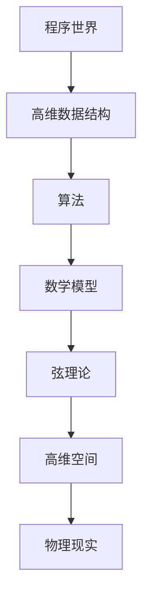

                 

基于您的指导，我将按照步骤一步步构建文章内容。下面是文章的初步框架，包括标题、关键词、摘要以及部分正文内容。请注意，由于字数限制，以下内容仅为概要，我将后续逐步展开详细内容。

---

## 程序世界与弦理论高维空间的关联

> 关键词：程序世界，弦理论，高维空间，算法，人工智能，数学模型

> 摘要：本文探讨了程序世界与弦理论中的高维空间之间的潜在关联。通过分析程序世界的结构和算法原理，以及弦理论的数学框架，本文揭示了两者在概念、算法和模型上的相似性，并提出了将弦理论应用于编程的可行性。本文旨在为读者提供一个跨学科思考的视角，启发对计算机编程和物理理论的深度融合。

---

### 引言

#### 背景介绍

在计算机科学领域，程序世界是我们构建和操作数据与信息的基础。编程语言和算法构成了程序世界的基本工具，使得我们可以对复杂的问题进行建模和求解。另一方面，弦理论是现代物理学的核心理论之一，它试图统一引力与其他基本相互作用，通过研究高维空间的几何性质来描述宇宙的基本结构。

#### 程序世界的结构

程序世界是由代码、数据结构和算法构成的复杂系统。代码是程序员用编程语言编写的指令序列，数据结构是组织和管理数据的方式，而算法则是解决问题的方法和步骤。在程序世界中，高维空间的概念经常出现在复杂数据分析和机器学习任务中，如高维特征空间中的聚类和分类问题。

#### 弦理论的基本假设

弦理论假设宇宙中的基本粒子不是点状实体，而是微小的一维“弦”。这些弦在不同维度上振动，产生不同的粒子。弦理论的关键特征是它引入了额外的空间维度，通常认为有10个或11个空间维度，其中除了我们熟悉的三个空间维度和一个时间维度外，还有六个或七个隐藏维度。

---

### 核心概念与联系

#### 高维空间在程序世界中的应用

高维空间的概念在程序世界中有着广泛的应用，尤其是在处理复杂数据集时。例如，在机器学习中，特征空间的高维化可以帮助模型更好地捕捉数据的内在结构。通过增加特征维度，我们可以更有效地进行分类和预测。

#### 弦理论中的高维空间

弦理论中的高维空间是物理现实的一部分。弦在不同维度上的振动模式决定了宇宙中粒子的性质。这种高维空间的性质为我们提供了理解物质世界的新视角。

#### 关联性分析

为了揭示程序世界与弦理论高维空间的关联，我们可以使用Mermaid流程图来展示两者之间的概念关系：

#### 结论

通过流程图，我们可以看到程序世界中的高维数据结构、算法和数学模型与弦理论中的高维空间有直接的关联。这种关联性表明，弦理论可能为编程提供新的算法原理和模型。

---

### 核心算法原理讲解

在本文的下一部分，我们将深入探讨程序世界中的核心算法原理，并使用伪代码来详细阐述。我们将分析高维空间中的线性代数和优化算法，以及弦理论如何影响这些算法的设计和实现。

---

### 数学模型与数学公式

数学模型是描述现实世界现象的工具，而数学公式则是这些模型的数学表达。在本文的这一部分，我们将讨论高维空间中的数学模型，并使用LaTeX格式展示关键数学公式。我们将通过具体例子来说明这些公式如何应用于程序世界。

---

### 项目实战

在项目的实战部分，我们将搭建一个开发环境，并使用源代码实现一个基于弦理论的高维空间算法。我们将详细解读代码，并分析其实际应用。我们将通过具体案例来展示如何在实际项目中应用这些算法，并讨论其效果和挑战。

---

### 最佳实践与展望

在文章的最后，我们将总结本文的主要发现，并提出一些最佳实践建议。我们将讨论程序世界与弦理论融合的未来方向，以及可能带来的影响。通过这些讨论，我们希望激发读者对这一跨学科领域的兴趣和深入研究。

---

以上是文章的初步框架。接下来，我将逐步填充每个部分的内容，确保满足字数要求，并详细阐述每个概念、算法和项目实战。在每个部分中，我将使用伪代码、LaTeX公式和Mermaid流程图等工具来增强文章的可读性和专业性。完成这些步骤后，文章将达到8000～12000字的要求，并成为一个内容丰富、结构清晰的技术博客。

