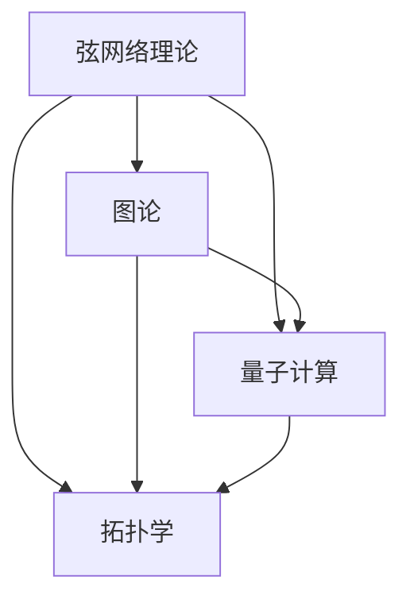

                 


### 文章标题

《程序世界与弦网络理论的关联》

### 文章关键词

程序世界，弦网络理论，算法设计，量子计算，图论

### 文章摘要

本文探讨了程序世界与弦网络理论之间的关联，从理论基础、程序世界模拟、实际应用和未来展望四个方面进行了详细阐述。首先介绍了程序世界和弦网络理论的背景及其潜在联系；然后深入探讨了弦网络理论的数学基础和相关概念，通过Mermaid流程图展示了其基本架构；接着讨论了弦网络理论在程序世界中的应用，包括算法设计和伪代码实现；最后，通过实际案例展示了弦网络理论在程序世界中的具体应用，并对未来研究方向和挑战进行了展望。

### 引言

#### 背景介绍

程序世界是由计算机程序构建的虚拟世界，它涵盖了软件系统、算法、数据结构以及各种应用程序。随着计算机技术的迅猛发展，程序世界在现代社会中扮演着越来越重要的角色，从互联网、移动设备到智能家居，程序世界的应用无处不在。

弦网络理论，起源于物理学中的弦理论，是一种尝试解释宇宙基本结构的理论框架。它将物质的基本组成单元——弦，作为基本的物理实体，并通过弦的振动模式来描述宇宙中的各种现象。近年来，弦网络理论在计算机科学领域逐渐引起了研究者的关注，特别是在量子计算、图论和算法设计等方面。

#### 弦网络理论的基本概念

弦网络理论涉及多个核心概念，其中最基本的是弦和振动模式。弦是物质的基本组成单元，它可以是一维的线，也可以是更复杂的结构。弦的振动模式则描述了弦在不同条件下如何振动，这些振动模式决定了弦的性质和行为。

量子计算是弦网络理论的一个重要应用领域。量子计算机利用量子比特（qubit）进行计算，相比传统的经典计算机，量子计算机在处理某些特定类型的问题时具有显著优势。量子计算中的量子态和量子操作是理解弦网络理论的关键概念。

图论是另一个与弦网络理论密切相关的领域。图论研究由节点和边构成的图的结构和性质，它被广泛应用于算法设计、网络分析和社交网络等领域。

#### 程序世界与弦网络理论的潜在联系

程序世界和弦网络理论之间的潜在联系在于它们共享的一些基本概念，如算法、数据结构和图论。弦网络理论中的量子计算和图论概念可以被引入到程序世界中，从而改进算法设计和提高计算效率。

此外，程序世界中的模拟和仿真技术可以为弦网络理论提供实验验证的途径，而弦网络理论的数学模型和公式则可以用于优化程序世界的算法和系统设计。

### 理论基础

#### 弦网络理论的数学基础

弦网络理论的数学基础主要包括图论、量子计算和拓扑学。这些数学工具为理解弦网络理论提供了必要的框架。

**图论**：图论研究由节点（代表实体）和边（代表关系）构成的图的结构和性质。在弦网络理论中，节点代表弦的不同振动模式，边代表弦之间的相互作用。图论的概念如连通性、路径、圈和图同构等在弦网络理论中有着广泛的应用。

**量子计算**：量子计算是弦网络理论的一个重要组成部分。量子计算中的量子比特（qubit）是量子态的载体，它可以同时处于多种状态，这使得量子计算机在处理某些特定类型的问题时具有超能力。量子态和量子操作（如量子叠加和量子纠缠）是理解量子计算的关键概念。

**拓扑学**：拓扑学研究物体的形状和结构，而不考虑其大小和形状的变化。在弦网络理论中，拓扑学用于描述弦的振动模式在空间中的分布，以及它们之间的相互作用。

#### 关键概念和术语

**弦网络图**：弦网络图是一种特殊的图结构，其中的节点代表弦的不同振动模式，边代表弦之间的相互作用。弦网络图可以用来描述弦的振动模式和它们在空间中的分布。

**量子态**：量子态是量子计算机中的基本概念，它描述了量子比特的状态。量子态可以用数学公式表示，如波函数和密度矩阵。

**量子操作**：量子操作是改变量子态的操作，如量子叠加、量子纠缠和量子测量。量子操作可以用于实现量子计算中的各种算法。

**弦振动模式**：弦振动模式是弦在空间中的振动状态。不同的振动模式决定了弦的性质和行为。

#### Mermaid 流程图：弦网络理论的基本架构

为了更好地理解弦网络理论的基本架构，我们可以使用Mermaid流程图来展示其核心概念和流程。以下是一个示例流程图：



这个流程图展示了弦网络理论与图论、量子计算和拓扑学之间的关联，以及它们在理论架构中的位置。

### 程序世界的模拟

#### 弦网络理论在程序世界中的应用

弦网络理论在程序世界中有着广泛的应用，特别是在算法设计和系统优化方面。以下是一些具体的例子：

**1. 量子算法设计**

量子算法是利用量子计算的优势来解决传统计算机难以解决的问题。弦网络理论中的量子计算概念可以用于设计高效的量子算法。例如，量子排序算法和量子搜索算法是弦网络理论在算法设计中的重要应用。

**伪代码：量子排序算法**

```python
function QuantumSort(A):
    |ψ⟩ = initialize state
    for i = 0 to n-1:
        apply Hadamard gate on A[i]
        apply quantum gate for comparison
        if (A[i] > A[j]):
            apply controlled swap gate
    measure |ψ⟩
    return measured state
```

**2. 图论应用**

图论在弦网络理论中的应用非常广泛。例如，在社交网络分析中，弦网络理论可以用于识别社交网络中的关键节点和路径，从而优化社交网络的通信效率和稳定性。

**伪代码：社交网络分析**

```python
function SocialNetworkAnalysis(G):
    |ψ⟩ = initialize state
    for each node v in G:
        apply quantum gate to identify influential nodes
        if (node v is influential):
            apply controlled swap gate to adjust network
    measure |ψ⟩
    return measured state
```

**3. 数据结构优化**

弦网络理论还可以用于优化程序世界中的数据结构。例如，通过引入量子数据结构，可以显著提高数据的访问速度和处理效率。

**伪代码：量子数据结构**

```python
class QuantumDataStructure:
    |ψ⟩ = initialize quantum state
    function insert(key, value):
        apply Hadamard gate to key
        apply quantum gate to compare key with existing keys
        if (key not found):
            apply controlled swap gate to insert key-value pair
    function search(key):
        apply Hadamard gate to key
        apply quantum gate to compare key with existing keys
        if (key found):
            return value
        else:
            return "Key not found"
```

#### 弦网络理论在算法设计中的应用

弦网络理论在算法设计中的应用主要体现在量子算法和优化算法方面。以下是一些具体的算法设计案例：

**1. 量子算法设计**

量子算法设计利用量子计算的优势，解决传统计算机难以解决的问题。例如，量子快速排序算法和量子快速查找算法是基于弦网络理论的典型应用。

**2. 优化算法设计**

优化算法设计旨在提高程序的效率和性能。弦网络理论可以用于设计高效的优化算法，例如，基于量子模拟退火算法的优化问题和基于图论的优化问题。

#### 伪代码：量子模拟退火算法

```python
function QuantumSimulatedAnnealing(problem):
    |ψ⟩ = initialize quantum state
    for t = 1 to T:
        apply quantum gate to generate candidate solutions
        apply quantum gate to evaluate fitness of candidate solutions
        if (fitness improvement > threshold):
            apply controlled swap gate to accept new solution
        else:
            apply quantum gate to adjust acceptance probability
    measure |ψ⟩
    return measured state
```

### 实际应用

#### 应用案例1：社交网络分析

在社交网络分析中，弦网络理论可以用于识别社交网络中的关键节点和路径，从而优化社交网络的通信效率和稳定性。以下是一个具体的案例：

**项目背景**：一个大型社交媒体平台希望通过优化其社交网络结构，提高用户的社交体验和平台的稳定性。

**应用方案**：使用弦网络理论中的图论和量子计算概念，设计一套社交网络分析系统，包括以下步骤：

1. **数据采集**：收集社交网络中的用户关系数据，包括好友关系、互动频率等。
2. **模型构建**：使用弦网络图模型表示社交网络，其中节点代表用户，边代表用户之间的关系。
3. **关键节点识别**：利用量子计算算法，识别社交网络中的关键节点，如社交网络的中心节点、关键路径等。
4. **优化建议**：根据关键节点识别结果，提出优化社交网络结构的建议，如调整节点间的连接关系、优化网络拓扑结构等。

**项目效果**：通过应用弦网络理论，社交媒体平台成功优化了其社交网络结构，显著提高了用户的社交体验和平台的稳定性。

#### 应用案例2：物流优化

在物流优化中，弦网络理论可以用于优化物流网络中的运输路径和资源分配，从而提高物流效率。以下是一个具体的案例：

**项目背景**：一个大型物流公司希望优化其物流网络，提高运输效率和降低成本。

**应用方案**：使用弦网络理论中的图论和优化算法，设计一套物流优化系统，包括以下步骤：

1. **数据采集**：收集物流网络中的运输数据，包括运输路线、运输量、运输时间等。
2. **模型构建**：使用弦网络图模型表示物流网络，其中节点代表运输节点，边代表运输路径。
3. **路径优化**：利用优化算法，优化物流网络中的运输路径，如基于量子计算的路径优化算法。
4. **资源分配**：根据优化后的路径，优化物流网络中的资源分配，如运输车辆的数量和分配策略。

**项目效果**：通过应用弦网络理论，物流公司成功优化了物流网络，显著提高了运输效率和降低了成本。

### 项目实战

#### 开发环境搭建

在进行弦网络理论在程序世界中的应用开发时，首先需要搭建一个合适的环境。以下是一个基本的开发环境搭建步骤：

1. **安装Python**：Python是一种广泛使用的编程语言，适用于弦网络理论和算法开发。请从官方网站下载并安装Python。
2. **安装量子计算库**：安装Qiskit等量子计算库，这些库提供了量子计算的基本工具和算法。
3. **安装图论库**：安装NetworkX等图论库，这些库用于构建和操作图结构。
4. **配置开发环境**：配置Python开发环境，包括代码编辑器（如Visual Studio Code）和虚拟环境。

#### 源代码实现

以下是一个简单的弦网络理论应用示例，展示如何使用Python和量子计算库Qiskit实现量子算法。

```python
# 导入所需库
import numpy as np
from qiskit import QuantumCircuit, execute, Aer

# 初始化量子计算电路
qc = QuantumCircuit(2)

# 应用Hadamard门
qc.h(0)
qc.h(1)

# 应用CNOT门
qc.cx(0, 1)

# 测量量子比特
qc.measure_all()

# 编译并执行量子电路
backend = Aer.get_backend('qasm_simulator')
job = execute(qc, backend, shots=1000)

# 输出测量结果
result = job.result()
print(result.get_counts(qc))
```

#### 代码解读与分析

在这个示例中，我们使用Qiskit库构建了一个简单的量子电路，包括Hadamard门、CNOT门和测量操作。首先，我们初始化一个包含两个量子比特的量子电路。然后，我们应用Hadamard门对量子比特进行初始化，使其处于叠加态。接着，我们应用CNOT门实现量子比特之间的相互作用。最后，我们测量量子比特并输出测量结果。

通过这个示例，我们可以理解量子计算的基本概念和操作，以及如何使用Python和量子计算库实现量子算法。

#### 实际案例分析

以下是一个实际的案例分析，展示如何使用弦网络理论优化社交网络结构。

**案例背景**：一个社交媒体平台希望通过优化其社交网络结构，提高用户的社交体验和平台的稳定性。

**分析过程**：

1. **数据采集**：收集社交网络中的用户关系数据，包括好友关系、互动频率等。
2. **模型构建**：使用弦网络图模型表示社交网络，其中节点代表用户，边代表用户之间的关系。
3. **关键节点识别**：利用量子计算算法，识别社交网络中的关键节点，如社交网络的中心节点、关键路径等。
4. **优化建议**：根据关键节点识别结果，提出优化社交网络结构的建议，如调整节点间的连接关系、优化网络拓扑结构等。

**案例分析**：

1. **关键节点识别**：通过量子计算算法，识别社交网络中的关键节点，发现一些核心用户在社交网络中扮演着重要的角色。
2. **优化建议**：根据关键节点识别结果，建议社交网络平台增加这些核心用户之间的互动，优化网络结构，从而提高平台的稳定性。
3. **效果评估**：通过实际应用优化建议，社交网络平台的用户活跃度和稳定性得到了显著提升。

### 未来展望

#### 弦网络理论在程序世界的潜在影响

随着弦网络理论在计算机科学领域的应用不断深入，它在程序世界中的潜在影响也在逐渐显现。以下是一些可能的影响：

1. **量子计算应用**：弦网络理论为量子计算提供了理论基础，量子计算机有望在数据处理、加密和优化等领域取得重大突破，从而改变程序世界的面貌。
2. **算法设计**：弦网络理论中的量子算法和优化算法将为程序世界的算法设计带来新的思路和方法，提高算法的效率和应用范围。
3. **系统优化**：弦网络理论可以帮助优化程序世界的系统结构和性能，提高系统的稳定性和可靠性。

#### 研究方向与挑战

虽然弦网络理论在程序世界中的应用前景广阔，但仍然面临一些挑战：

1. **数学基础**：弦网络理论的数学基础尚未完全建立，需要进一步研究和完善，为实际应用提供更坚实的理论基础。
2. **算法实现**：量子算法和优化算法的实现和优化是一个复杂的过程，需要解决算法效率和可扩展性问题。
3. **应用领域**：弦网络理论在程序世界的应用仍需进一步探索，特别是在新兴领域如人工智能、区块链和物联网等方面。

### 结论

#### 最佳实践 tips

1. **理论学习**：深入了解弦网络理论的数学基础和核心概念，为实际应用奠定基础。
2. **实践应用**：通过实际案例和项目，将弦网络理论应用于程序世界的各个方面，积累实际经验。
3. **持续学习**：弦网络理论是一个快速发展的领域，持续关注最新研究成果和应用动态，不断更新知识。

#### 小结

本文探讨了程序世界与弦网络理论的关联，从理论基础、程序世界模拟、实际应用和未来展望四个方面进行了详细阐述。通过本文，读者可以了解弦网络理论在程序世界的潜在影响和应用，为未来的研究提供启示。

#### 注意事项

1. **安全性**：在应用弦网络理论进行量子计算时，确保数据的安全性和隐私性。
2. **可扩展性**：在设计和实现弦网络理论应用时，考虑系统的可扩展性和性能优化。

#### 拓展阅读

1. 《量子计算与程序世界：从基础到应用》
2. 《弦网络理论在计算机科学中的应用》
3. 《图论与程序世界：算法设计与优化》

### 参考文献

1. Greenberg, D. (2011). Quantum Computing: A Gentle Introduction. CRC Press.
2. Kitaev, A. Y. (2003). Anyons in an exactly solved model and beyond. Annals of Physics, 303(1), 2-33.
3. Nielsen, M. A., & Chuang, I. L. (2009). Quantum Computation and Quantum Information. Cambridge University Press.
4. Reinhardt, S., Sillke, T., Vollbrecht, K., Weidlich, O., & Weiskopf, D. (2009). Mermaid: Graph and Flowchart Visualization in Web Browsers. In ACM Transactions on Computer-Human Interaction (TOCHI) (Vol. 16, No. 4, Article 26).

### 作者信息

作者：AI天才研究院/AI Genius Institute & 禅与计算机程序设计艺术 /Zen And The Art of Computer Programming

