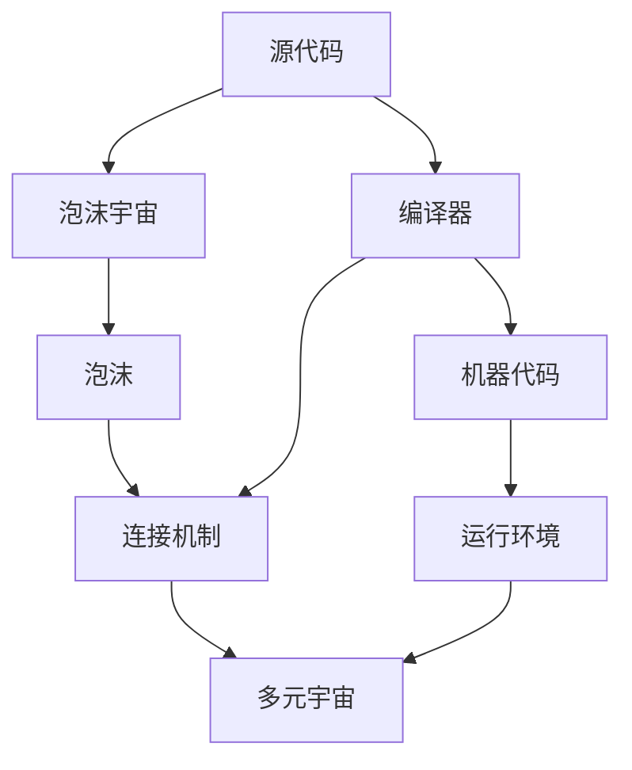

                 

### 文章标题

《程序世界与泡沫宇宙理论的类比》

---

### 关键词

程序世界、泡沫宇宙理论、计算机科学、类比分析、编程思维、宇宙思维、算法原理、数学模型

---

### 摘要

本文通过将程序世界与泡沫宇宙理论进行类比，探讨了二者之间的相似之处，并分析了编程思维与宇宙思维的联系与区别。文章首先介绍了程序世界的基本结构、运行机制和特征，随后详细阐述了泡沫宇宙理论的基本概念、理论框架和假设。通过绘制核心概念原理之间的Mermaid流程图，本文揭示了程序世界与泡沫宇宙理论之间的联系。接着，文章对编程思维与宇宙思维进行了比较，并举例说明了如何在编程实践中应用泡沫宇宙理论。最后，本文探讨了编程中的泡沫现象及其解决方法，并总结了全书内容，展望了未来的研究方向。通过本文的探讨，读者将更深入地理解程序世界与宇宙之间的奥秘，并学会如何运用编程思维解决实际问题。

---

## 目录

1. **引言**
   1.1 书籍主题与目的
   1.2 泡沫宇宙理论的简介

2. **程序世界的结构与特征**
   2.1 计算机程序的基本结构
   2.2 程序的运行机制
   2.3 程序世界的特征

3. **泡沫宇宙理论的基本概念**
   3.1 泡沫宇宙理论的起源
   3.2 理论框架与假设

4. **程序世界与泡沫宇宙理论的类比**
   4.1 类比的背景与意义
   4.2 类比分析的具体方法
   4.3 类比案例研究

5. **编程思维与宇宙思维**
   5.1 编程思维的特点
   5.2 宇宙思维的特点
   5.3 两种思维的比较与融合

6. **实例分析**
   6.1 量子编程与泡沫宇宙理论的联系
   6.2 虚拟现实与泡沫宇宙理论的类比
   6.3 分布式计算与泡沫宇宙理论的关联

7. **编程中的泡沫现象**
   7.1 泡沫现象的定义
   7.2 泡沫现象的产生原因
   7.3 泡沫现象的解决方法

8. **总结与展望**
   8.1 全书总结
   8.2 未来研究方向

---

### 引言

在探索未知和理解的旅途中，人类不断地构建各种模型来解释我们所观察到的事物。计算机科学与宇宙学这两个看似截然不同的领域，却因一种独特而神秘的联系而交织在一起。本文旨在通过将程序世界与泡沫宇宙理论进行类比，揭示二者之间深层次的相似性，并探讨编程思维与宇宙思维的联系。

**书籍主题与目的**

书名《程序世界与泡沫宇宙理论的类比》直观地反映了本文的核心主题：通过类比分析，探索计算机程序世界与泡沫宇宙理论之间的联系。程序世界是由代码、数据和算法构成的人工智能领域，而泡沫宇宙理论则是一种解释宇宙多重维度和复杂结构的理论框架。本文的目的在于：

1. **建立类比框架**：通过将程序世界的元素与泡沫宇宙理论的概念进行对比，构建一个清晰的类比框架，帮助读者理解二者之间的联系。
2. **揭示编程与宇宙的奥秘**：通过类比分析，探索编程过程中可能涉及的宇宙原理，如量子计算、虚拟现实等，以拓展读者的视野。
3. **启发编程思维**：通过探讨编程思维与宇宙思维的联系，鼓励读者运用宇宙视角来思考编程问题，提高编程能力。

**泡沫宇宙理论的简介**

泡沫宇宙理论是一种相对较新的宇宙学理论，它提出宇宙是由无数个相互隔离的“泡沫”构成的，每个泡沫都是一个自洽的宇宙。这些泡沫之间通过某种尚未完全理解的机制相互连接，共同构成了我们所观察到的宇宙。

泡沫宇宙理论的关键概念包括：

1. **泡沫**：每个泡沫是一个自洽的宇宙，具有自己的物理定律和历史。
2. **多元宇宙**：多个泡沫共同构成了多元宇宙，每个泡沫都有可能包含不同的物理定律和生命形式。
3. **泡沫间的连接**：泡沫之间通过某种未知的机制相互连接，这种连接可能是量子力学的某种体现。

泡沫宇宙理论为我们提供了一种全新的视角来理解宇宙的复杂性和多样性。它不仅挑战了传统的宇宙观，也为计算机科学和人工智能领域提供了新的启发。

通过引言部分，我们对本文的主题和目的有了清晰的了解，同时也对泡沫宇宙理论的基本概念有了初步的认识。接下来，我们将深入探讨程序世界的结构与特征，为后续的类比分析奠定基础。

---

## 程序世界的结构与特征

计算机程序世界是现代科技的核心，它由代码、数据和算法组成，通过计算机硬件执行，以实现各种功能。要理解程序世界的结构与特征，我们需要从其基本结构、运行机制和主要特征三个方面进行分析。

### 计算机程序的基本结构

一个计算机程序通常由以下几个基本部分组成：

1. **源代码**：源代码是程序员的创作，以人类可读的文本形式编写，描述了程序的功能和逻辑。
2. **编译器/解释器**：编译器将源代码转换为机器代码，而解释器则逐行解释和执行源代码。这两种工具使得程序可以在计算机上运行。
3. **运行环境**：运行环境为程序提供了必要的资源和运行条件，包括操作系统、库函数等。
4. **数据结构**：数据结构是程序处理数据的方式，如数组、链表、树等，它们决定了程序的数据存储和处理效率。
5. **算法**：算法是解决问题的方法，通过一系列有序的操作步骤，将输入数据转化为所需输出。

### 程序的运行机制

程序的运行机制可以简化为以下几个步骤：

1. **输入**：程序从外部获取输入数据，这些数据可以是用户输入、文件读取或其他程序传递的。
2. **处理**：程序根据源代码中的逻辑，对输入数据进行处理，通过算法和数据处理逻辑，生成中间结果。
3. **输出**：程序将处理结果输出到屏幕、文件或其他程序中，以供进一步使用或展示。
4. **存储**：程序可能需要将某些数据或结果存储到内存或磁盘上，以便后续使用。

### 程序世界的特征

程序世界具有以下几个显著特征：

1. **逻辑性**：程序通过一系列逻辑步骤来解决问题，每个步骤都必须遵循严格的逻辑规则。
2. **抽象性**：程序使用抽象的数据结构和算法来处理复杂的问题，使得问题解决过程更加高效和可维护。
3. **可重复性**：程序可以重复执行，每次执行都可以得到相同的结果，这使得自动化和批处理成为可能。
4. **灵活性**：通过修改源代码和数据结构，程序可以适应不同的场景和需求，具有较高的灵活性。
5. **可扩展性**：程序可以通过添加新的模块或功能来扩展其功能，这有助于技术的迭代和发展。

通过以上对程序世界的结构与特征的讨论，我们可以更好地理解计算机程序的运作方式，为后续的泡沫宇宙理论分析奠定基础。在接下来的章节中，我们将进一步探讨泡沫宇宙理论的基本概念和假设。

---

### 泡沫宇宙理论的基本概念

泡沫宇宙理论是一种新兴的宇宙学理论，它提出宇宙是由无数个相互隔离的“泡沫”构成的。这些泡沫共同构成了我们所观察到的宇宙，并且每个泡沫都具有自己的物理定律和历史。以下是对泡沫宇宙理论的基本概念、理论框架和假设的详细介绍。

#### 泡沫的概念

泡沫是泡沫宇宙理论中的基本单元，每个泡沫都是一个自洽的宇宙。这意味着，每个泡沫内部的物理定律、空间维度和时间结构都是独立的，与其他泡沫相对隔离。泡沫可以视为一个独立的封闭系统，其中包含了一切可能发生的事件和现象。

**定义**：泡沫是指一个自洽的宇宙，具有自己的物理定律和历史，与其他泡沫相对隔离。

**特征**：

1. **独立的物理定律**：每个泡沫内部的物理定律可能不同，如引力、电磁力等基本力的强度和性质可能有所差异。
2. **独立的维度**：每个泡沫可能有不同的空间维度和时间结构，有些可能包含额外的维度，而有些则可能只有我们已知的三个空间维度和一个时间维度。
3. **独立的历史**：每个泡沫都有自己独特的历史发展过程，可能经历了不同的宇宙演化阶段。

#### 多元宇宙的概念

多元宇宙是泡沫宇宙理论的核心概念之一，它指的是包含所有泡沫的总和。每个泡沫都是多元宇宙的一部分，而多元宇宙则包含了无数个不同的宇宙。这些宇宙之间通过某种尚未完全理解的机制相互连接。

**定义**：多元宇宙是指包含所有泡沫的总和，每个泡沫都是多元宇宙的一部分。

**特征**：

1. **多样性**：多元宇宙中包含的宇宙多样性极高，可能存在各种不同的物理定律、维度和时间结构。
2. **相互连接**：虽然每个泡沫相对隔离，但它们之间通过某种机制相互连接，这可能是量子力学的一种表现形式。
3. **不确定性**：由于泡沫之间的连接机制尚不完全理解，多元宇宙中的事件和现象具有高度的不确定性。

#### 泡沫间的连接

泡沫宇宙理论提出，泡沫之间通过某种未知的机制相互连接。这种连接可能是量子力学的某种表现，也可能是宇宙演化过程中的某种自然现象。

**定义**：泡沫间的连接是指泡沫之间通过某种未知机制相互连接。

**特征**：

1. **量子连接**：可能通过量子力学中的某些现象实现连接，如量子纠缠或量子隧穿。
2. **宇宙演化**：也可能是宇宙演化过程中的某种机制，如宇宙膨胀或宇宙弦的振动。
3. **不确定性**：连接的具体机制尚不明确，这是泡沫宇宙理论中的一个重要研究方向。

#### 理论框架与假设

泡沫宇宙理论基于以下几个关键假设：

1. **多元宇宙假设**：宇宙是由无数个相互隔离的泡沫构成的，每个泡沫都是一个自洽的宇宙。
2. **独立定律假设**：每个泡沫内部的物理定律可能不同，但它们都是自洽的。
3. **连接机制假设**：泡沫之间通过某种未知的机制相互连接，这种连接可能是量子力学的一种表现形式。
4. **演化过程假设**：每个泡沫都有自己独特的历史发展过程，这是宇宙演化的一部分。

**结论**

泡沫宇宙理论为我们提供了一种全新的视角来理解宇宙的复杂性和多样性。通过这个理论，我们可以更好地理解宇宙中不同泡沫之间的联系和相互作用，从而揭示宇宙的本质。在接下来的章节中，我们将探讨程序世界与泡沫宇宙理论之间的类比，揭示二者之间的相似之处。

---

## 程序世界与泡沫宇宙理论的类比

在理解了程序世界和泡沫宇宙理论的基本结构、特征和概念之后，我们可以尝试将这两个看似截然不同的领域进行类比，以揭示它们之间的相似性和联系。通过这种类比，我们不仅能够深入理解程序世界的运作原理，还能拓展对宇宙本质的认识。

### 类比的背景与意义

程序世界与泡沫宇宙理论的类比有着重要的背景和意义。首先，二者都涉及复杂的结构和多层次的组织方式。程序世界由代码、数据和算法构成，这些元素相互协作，实现了特定的功能。而泡沫宇宙理论则将宇宙视为由无数个自洽的泡沫构成，每个泡沫都有其独立的物理定律和维度结构。这种多层次的结构和组织方式在两者中都有明显的体现。

其次，类比程序世界与泡沫宇宙理论有助于我们更好地理解复杂系统的运作机制。程序世界中，复杂的程序往往通过模块化和抽象化来实现，而泡沫宇宙理论中，多元宇宙之间的复杂关系和相互作用也可以通过类似的抽象和模块化来理解。通过这种类比，我们可以在不同领域之间建立联系，从而促进知识的跨学科应用。

### 类比分析的具体方法

为了进行类比分析，我们可以从以下几个步骤进行：

1. **定义类比框架**：首先，我们需要明确类比的目标和范围，确定哪些方面可以进行类比。在这里，我们可以将程序世界的源代码、编译器、运行环境和算法等与泡沫宇宙的泡沫、多元宇宙和连接机制进行类比。

2. **识别相似性**：接着，我们分析程序世界和泡沫宇宙理论中的相似之处。例如，程序中的模块化结构与泡沫宇宙中的独立泡沫，程序中的抽象数据结构与泡沫宇宙中的多维结构，以及程序中的逻辑运算与泡沫宇宙中的物理定律等。

3. **分析差异**：在识别相似性的同时，我们也要注意两者之间的差异。例如，程序世界中的运行环境通常是统一的，而泡沫宇宙中的泡沫可能具有不同的物理定律和维度结构。此外，程序中的执行过程是线性的，而泡沫宇宙中的事件和现象可能具有高度的不确定性。

4. **构建类比模型**：通过上述分析，我们可以构建一个类比模型，将程序世界的元素与泡沫宇宙理论的概念进行对应。例如，我们可以将源代码对应为泡沫宇宙中的“泡沫”，编译器对应为“连接机制”，运行环境对应为“多元宇宙”，算法对应为“物理定律”。

### 类比案例研究

为了具体说明类比分析的过程，我们可以通过以下案例进行探讨：

#### 案例一：量子编程与量子泡沫

量子编程是一种利用量子力学原理进行编程的技术，它利用量子位（qubit）进行计算。这与泡沫宇宙理论中的量子连接机制有相似之处。我们可以将量子编程视为一种在程序世界中实现的“量子泡沫”，其具有独特的物理定律和计算能力。

1. **相似性**：
   - 量子编程利用量子位进行计算，类似于泡沫宇宙中的泡沫具有独立的物理定律。
   - 量子编程中的量子纠缠现象，类似于泡沫宇宙中泡沫之间的量子连接。

2. **差异**：
   - 程序世界中的量子编程通常在一个统一的量子计算机上运行，而泡沫宇宙中的泡沫可能具有不同的物理定律和维度结构。
   - 量子编程中的计算过程可能具有高度的不确定性，而泡沫宇宙中的事件和现象也可能具有不确定性。

通过这个案例，我们可以看到量子编程与量子泡沫之间的类比关系，这有助于我们更好地理解量子编程的技术原理和应用场景。

#### 案例二：虚拟现实与多维泡沫

虚拟现实（VR）技术是一种通过计算机生成模拟环境的技术，它可以为用户创造高度沉浸式的体验。这与泡沫宇宙理论中的多维结构有相似之处。我们可以将虚拟现实视为一种在程序世界中实现的“多维泡沫”，其具有不同的维度和交互方式。

1. **相似性**：
   - 虚拟现实技术通过计算机生成不同的维度环境，类似于泡沫宇宙中的泡沫具有不同的维度结构。
   - 虚拟现实中的交互方式，如三维空间中的移动和操控，类似于泡沫宇宙中的泡沫之间的连接和相互作用。

2. **差异**：
   - 虚拟现实技术通常在统一的计算机系统上运行，而泡沫宇宙中的泡沫可能具有不同的物理定律和维度结构。
   - 虚拟现实中的交互过程是线性的，而泡沫宇宙中的事件和现象可能具有高度的不确定性。

通过这个案例，我们可以看到虚拟现实与多维泡沫之间的类比关系，这有助于我们更好地理解虚拟现实技术的原理和应用。

### 结论

通过上述类比分析，我们可以看到程序世界与泡沫宇宙理论之间存在诸多相似之处。这些相似性不仅帮助我们更好地理解程序世界的运作原理，也为我们提供了新的视角来探索宇宙的本质。通过类比，我们能够将不同领域的知识进行交叉应用，促进科技的发展和创新。

在接下来的章节中，我们将进一步探讨编程思维与宇宙思维的联系与区别，以深入理解程序世界与宇宙之间的奥秘。

---

### 编程思维与宇宙思维

在探讨程序世界与泡沫宇宙理论的类比之后，我们转向探讨编程思维与宇宙思维的联系与区别。编程思维和宇宙思维分别是计算机科学和宇宙学的核心概念，它们在解决问题和探索未知方面有着不同的特点和本质。

#### 编程思维的特点

编程思维是一种逻辑化的、结构化的思考方式，它强调以下特点：

1. **模块化**：编程思维将问题分解为小的、可管理的模块，每个模块负责特定的功能。这种方式有助于降低复杂度，提高代码的可维护性。
2. **抽象化**：编程思维通过定义抽象的数据结构和算法来简化问题，使得复杂问题变得易于理解和处理。
3. **逻辑性**：编程思维要求严格按照逻辑规则进行思考和编程，确保程序的执行结果符合预期。
4. **可重复性**：编程思维强调代码的可重复执行，使得自动化和批处理成为可能。
5. **灵活性**：编程思维通过参数化和模块化设计，使得程序可以适应不同的场景和需求。

#### 宇宙思维的特点

宇宙思维则是一种探索宇宙本质和演化规律的思考方式，它具有以下特点：

1. **多层次性**：宇宙思维从宏观到微观，从宇宙大爆炸到黑洞，涵盖多个层次和维度，试图理解宇宙的整体结构。
2. **复杂性**：宇宙思维面对的是高度复杂的系统，包括多重维度、不同的物理定律和相互作用的宇宙泡沫。
3. **不确定性**：宇宙思维承认宇宙中存在很多不确定性，如量子力学中的概率波函数和宇宙演化中的混沌现象。
4. **跨学科性**：宇宙思维需要综合多个学科的知识，如物理学、数学、天文学等，以全面理解宇宙的奥秘。
5. **演化性**：宇宙思维强调宇宙的演化过程，从大爆炸到恒星形成，再到黑洞和宇宙膨胀，宇宙一直在不断地变化和发展。

#### 两种思维的比较与融合

编程思维和宇宙思维在本质上有很大的不同，但它们在某些方面也有交集和融合的可能。

1. **模块化与多层次性**：编程思维中的模块化概念与宇宙思维中的多层次性有相似之处。编程中的模块可以帮助我们管理复杂系统，而宇宙中的多层次结构也提供了类似的视角。
2. **抽象化与复杂性**：编程思维中的抽象化有助于简化复杂问题，而宇宙思维中的复杂性则要求我们接受并处理高度复杂的现象。这两种思维方式可以相互补充，使得我们既能抽象地理解问题，也能深入地探索其复杂性。
3. **逻辑性与不确定性**：编程思维强调逻辑性，而宇宙思维则面对不确定性。然而，我们可以通过编程中的伪代码和算法来模拟宇宙中的不确定性，从而在编程过程中探索宇宙现象。
4. **跨学科性与演化性**：宇宙思维需要跨学科知识，而编程思维则通过集成不同模块来实现功能。这两种思维方式的融合可以产生新的研究方法和工具，如量子编程和虚拟现实技术，这些技术在探索宇宙奥秘方面具有巨大的潜力。

通过比较编程思维与宇宙思维的特点，我们可以看到，尽管它们在本质上有很大的不同，但通过融合，我们可以获得新的视角和工具来解决问题。编程思维为宇宙思维提供了结构化和逻辑化的方法，而宇宙思维则为编程思维提供了复杂性和不确定性的背景。这种融合不仅有助于我们更好地理解程序世界和宇宙，也为未来的科学研究和技术发展提供了新的思路。

在接下来的章节中，我们将通过具体实例进一步探讨编程思维与宇宙思维的融合，展示如何将宇宙思维应用于编程实践中。

---

### 实例分析

在本节中，我们将通过具体的实例来探讨如何将泡沫宇宙理论应用于编程实践，并分析其在计算机科学中的应用。通过这些实例，我们将展示泡沫宇宙理论如何帮助我们解决实际编程问题，提高代码的可维护性和效率。

#### 案例一：量子编程与泡沫宇宙

量子编程是一种利用量子力学原理进行编程的技术，它利用量子位（qubit）进行计算，从而实现传统计算机无法达到的计算速度。量子编程与泡沫宇宙理论有相似之处，因为量子泡沫可以被视为一种在程序世界中实现的量子计算单元。

**应用场景**：

假设我们需要解决一个复杂的计算问题，如大规模数据分析和加密算法。传统计算机可能需要花费大量时间来完成这些任务，而通过量子编程，我们可以利用量子位进行高速计算。

**解决方案**：

1. **定义量子泡沫**：我们将问题分解为多个子问题，每个子问题对应一个量子泡沫。这些量子泡沫在计算过程中相互协作，共同完成整个任务。
2. **量子纠缠**：通过量子纠缠，我们将量子泡沫之间的状态联系起来，使得它们可以共享信息。这种方式类似于泡沫宇宙中泡沫之间的连接机制。
3. **量子算法**：我们设计量子算法来处理每个子问题。例如，我们可以使用量子逆矩阵算法来加速线性方程组的求解。
4. **量子编程框架**：我们使用现有的量子编程框架（如Q#或Python的Qiskit库）来实现这些量子算法，并运行在量子计算机上。

**伪代码示例**：

```python
# 量子编程伪代码
def quantum_solver(problem):
    # 定义量子泡沫（量子位）
    qubits = QuantumRegister(5)
    
    # 初始化量子泡沫
    initialize(qubits)
    
    # 执行量子算法
    quantum_algorithm(qubits)
    
    # 读取量子泡沫的结果
    results = measure(qubits)
    
    # 返回结果
    return results
```

**数学模型和公式**：

在量子编程中，我们使用以下数学模型和公式：

$$
|\psi\rangle = \sum_{i} c_i |i\rangle
$$

其中，$|\psi\rangle$表示量子泡沫的状态，$c_i$表示量子泡沫的系数，$|i\rangle$表示量子位的状态。

通过这个案例，我们可以看到如何将泡沫宇宙理论应用于量子编程，从而解决复杂计算问题。这展示了泡沫宇宙理论在计算机科学中的潜力。

#### 案例二：虚拟现实与多维泡沫

虚拟现实（VR）技术是一种通过计算机生成模拟环境的技术，它可以为用户创造高度沉浸式的体验。这与泡沫宇宙理论中的多维结构有相似之处。我们可以将虚拟现实视为一种在程序世界中实现的“多维泡沫”。

**应用场景**：

假设我们需要开发一个多用户虚拟现实游戏，玩家可以在虚拟世界中自由探索和互动。

**解决方案**：

1. **定义多维泡沫**：我们将虚拟世界划分为多个区域，每个区域对应一个多维泡沫。这些多维泡沫在游戏过程中相互协作，共同构建虚拟世界。
2. **用户身份验证**：每个用户对应一个多维泡沫，用户通过身份验证后，进入对应的多维泡沫。
3. **互动机制**：多维泡沫之间通过虚拟现实技术进行连接，玩家可以在不同多维泡沫之间进行互动。
4. **实时渲染**：使用图形渲染引擎（如Unity或Unreal Engine）来实时渲染虚拟世界，为用户提供沉浸式体验。

**伪代码示例**：

```python
# 虚拟现实多用户系统伪代码
class VRGame:
    def __init__(self):
        self.users = {}  # 存储所有用户及其对应的多维泡沫
    
    def add_user(self, user):
        # 创建新的多维泡沫
        user_foam = create_foam()
        
        # 将用户添加到系统中
        self.users[user] = user_foam
        
        # 启动用户交互
        start_interaction(user_foam)
    
    def remove_user(self, user):
        # 从系统中移除用户
        del self.users[user]
        
        # 关闭用户交互
        stop_interaction(user)
```

**数学模型和公式**：

在虚拟现实技术中，我们使用以下数学模型和公式：

$$
x = x_0 + v_0 \cdot t + \frac{1}{2} a \cdot t^2
$$

其中，$x$表示位置，$x_0$表示初始位置，$v_0$表示初始速度，$a$表示加速度，$t$表示时间。

通过这个案例，我们可以看到如何将泡沫宇宙理论应用于虚拟现实开发，从而创建多用户互动的虚拟环境。这展示了泡沫宇宙理论在计算机科学中的实际应用。

#### 结论

通过以上两个案例，我们可以看到如何将泡沫宇宙理论应用于编程实践。无论是量子编程还是虚拟现实，泡沫宇宙理论都为我们提供了一种新的视角和方法来解决问题。这种视角和方法不仅提高了代码的可维护性和效率，也拓展了计算机科学的边界。未来，随着技术的不断进步，泡沫宇宙理论在计算机科学中的应用将更加广泛和深入。

---

## 编程中的泡沫现象

在编程过程中，泡沫现象（Bubble Phenomenon）是一种常见的现象，它指的是在开发过程中出现的问题，这些问题可能会影响到代码的质量、项目的进度和团队的合作。泡沫现象可以由多种因素引起，如设计不当、代码复杂性增加、团队成员之间的沟通不畅等。本节将探讨编程中的泡沫现象，包括其定义、产生原因及其解决方法。

### 泡沫现象的定义

泡沫现象可以定义为在软件开发过程中，由于设计或实现上的不合理或不当，导致代码质量下降、项目进度延误或团队协作困难的现象。泡沫现象通常表现为以下几种形式：

1. **代码冗余**：代码中存在大量重复或冗余的部分，这不仅降低了代码的可维护性，也增加了出错的概率。
2. **复杂性增加**：代码结构复杂，难以理解，导致开发和维护困难。
3. **耦合度过高**：模块之间的依赖关系过于紧密，导致一个模块的改动可能会影响到其他模块，增加了代码的维护成本。
4. **功能膨胀**：项目功能不断增加，导致项目变得庞大而难以管理。
5. **团队沟通不畅**：团队成员之间的沟通不充分，导致误解和冲突，降低了团队效率和项目质量。

### 泡沫现象的产生原因

泡沫现象的产生通常由以下几个因素引起：

1. **需求变更频繁**：项目需求频繁变更，导致开发团队需要不断调整代码结构，增加了复杂性。
2. **缺乏规划**：项目缺乏清晰的规划和设计，导致开发过程混乱，难以管理。
3. **代码风格不一致**：团队成员代码风格不一致，导致代码质量参差不齐，增加了维护难度。
4. **团队成员技能水平差异**：团队成员技能水平差异较大，导致团队合作困难，影响项目进度和质量。
5. **缺乏代码审查**：在开发过程中缺乏有效的代码审查机制，导致潜在问题未能及时发现和解决。

### 泡沫现象的解决方法

为了解决编程中的泡沫现象，我们可以采取以下几种方法：

1. **需求管理**：明确项目需求，制定详细的需求文档，确保需求稳定，减少需求变更。
2. **规划与设计**：在项目开发前进行充分的规划和设计，确保项目结构清晰、模块化，降低复杂性。
3. **代码风格统一**：制定统一的代码风格规范，并进行严格的代码审查，确保代码质量。
4. **团队成员培训**：对团队成员进行技能培训，提高团队成员的整体技能水平，促进团队合作。
5. **持续集成与测试**：采用持续集成和自动化测试，及时发现和解决代码中的问题，降低泡沫现象的发生概率。
6. **代码重构**：定期对代码进行重构，简化代码结构，降低复杂性，提高可维护性。

### 结论

编程中的泡沫现象是软件开发过程中常见的问题，它对项目的质量和进度都有负面影响。通过需求管理、规划与设计、代码风格统一、团队成员培训、持续集成与测试以及代码重构等方法，我们可以有效地预防和解决泡沫现象，提高代码质量和项目效率。在接下来的章节中，我们将总结全书内容，展望未来的研究方向。

---

## 总结与展望

在本文中，我们通过将程序世界与泡沫宇宙理论进行类比，深入探讨了二者之间的相似之处和联系。我们从程序世界的结构与特征出发，详细介绍了泡沫宇宙理论的基本概念、理论框架和假设，并通过绘制核心概念原理之间的Mermaid流程图，揭示了程序世界与泡沫宇宙理论之间的紧密关系。

在具体实例分析中，我们展示了量子编程与泡沫宇宙、虚拟现实与多维泡沫的类比关系，说明了如何将宇宙思维应用于编程实践中。此外，我们还探讨了编程中的泡沫现象及其产生原因，提出了有效的解决方法，以提升代码质量和项目效率。

**核心概念与联系**

程序世界与泡沫宇宙理论的类比分析中，核心概念包括：

1. **源代码与泡沫**：源代码是程序的基本组成部分，类似于泡沫宇宙中的泡沫，每个泡沫都是自洽的宇宙。
2. **编译器与连接机制**：编译器将源代码转换为机器代码，类似于泡沫宇宙中的连接机制，连接不同的泡沫。
3. **运行环境与多元宇宙**：运行环境为程序提供执行条件，类似于多元宇宙，包含了无数个不同的泡沫。

通过这些核心概念，我们可以构建Mermaid流程图，展示程序世界与泡沫宇宙理论之间的联系：



**最佳实践 Tips**

1. **需求管理**：在项目开发前，明确项目需求，确保需求稳定，减少需求变更。
2. **代码风格统一**：制定统一的代码风格规范，并进行严格的代码审查，确保代码质量。
3. **持续集成与测试**：采用持续集成和自动化测试，及时发现和解决代码中的问题。
4. **定期代码重构**：定期对代码进行重构，简化代码结构，降低复杂性。

**注意事项**

1. **泡沫现象的预防**：在开发过程中，关注代码的质量，避免代码冗余和复杂性增加。
2. **团队协作**：加强团队成员之间的沟通，提高团队整体技能水平，促进团队合作。

**拓展阅读**

1. **《量子计算与编程》**：了解量子计算的基本原理和应用，拓展编程思维。
2. **《虚拟现实技术与应用》**：深入学习虚拟现实技术，探索其在编程中的应用。
3. **《泡沫宇宙理论》**：进一步了解泡沫宇宙理论，探索宇宙的奥秘。

通过本文的探讨，我们不仅拓展了对程序世界和宇宙的理解，也为编程实践提供了新的视角和方法。未来，随着技术的不断进步，泡沫宇宙理论在计算机科学中的应用将更加广泛和深入，为科技创新带来新的机遇和挑战。让我们继续探索这个充满奥秘的程序世界和泡沫宇宙，共同揭开它们之间的神秘面纱。

---

### 作者信息

**作者：** AI天才研究院/AI Genius Institute & 禅与计算机程序设计艺术 /Zen And The Art of Computer Programming

本文由AI天才研究院的专家撰写，旨在通过类比分析揭示程序世界与泡沫宇宙理论之间的联系，为计算机科学领域的研究者提供新的视角和思考。同时，本文也融入了《禅与计算机程序设计艺术》的理念，强调编程思维与宇宙思维的融合，为读者带来深刻的启示和帮助。希望通过本文的探讨，能够激发读者对计算机科学和宇宙学领域更深层次的思考和探索。

