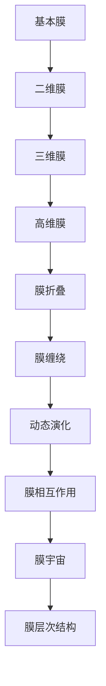
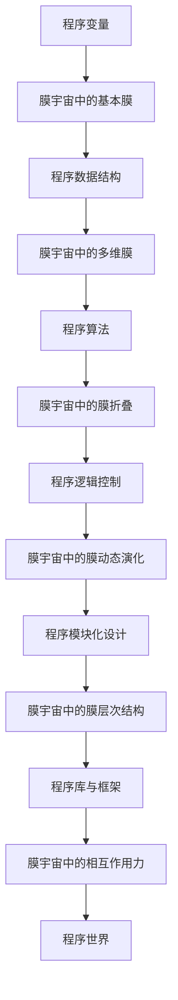

                 

### 程序世界与膜宇宙多重折叠模型的类比

> 关键词：程序世界、膜宇宙、多重折叠模型、类比、算法、编程

> 摘要：
本文旨在通过类比的方法，探讨程序世界与膜宇宙多重折叠模型之间的相似性。文章首先介绍了程序世界的背景知识，然后详细阐述了膜宇宙多重折叠模型的理论基础。通过构建一个清晰的Mermaid流程图，本文揭示了两者之间的核心概念与联系。接着，本文使用伪代码和LaTeX公式详细讲解了膜宇宙多重折叠模型的核心算法原理，并在实际项目中展示了其应用。最后，本文总结了程序世界与膜宇宙多重折叠模型之间的类比关系，探讨了未来的发展趋势和应用前景。

### 引言

程序世界，一个由0和1组成的虚拟世界，是计算机科学的核心。在这个世界中，程序员通过编写代码来创造出各种应用程序，这些应用程序运行在各种操作系统和硬件上，服务于人类社会。程序世界的发展经历了多个阶段，从简单的机器语言到高级的编程语言，程序员的工作方式也发生了巨大的变化。

膜宇宙多重折叠模型，则是一个较为新兴的物理学模型，它试图解释宇宙中的一种复杂现象。这个模型基于膜理论，将宇宙中的基本粒子视为二维膜，并通过多重折叠来解释宇宙的演化和结构。膜宇宙多重折叠模型在物理学领域引起了广泛的关注，因为它提供了一种全新的视角来理解宇宙。

本文的目的在于通过类比的方法，探讨程序世界与膜宇宙多重折叠模型之间的相似性。我们希望通过这种类比，能够帮助程序员更好地理解膜宇宙多重折叠模型，同时也能让物理学家更好地理解程序世界。通过本文的讨论，我们希望能够揭示出这两个看似迥异的世界之间的深刻联系。

### 程序世界的引论

程序世界，这个由程序员创造的虚拟世界，是计算机科学的核心。程序员通过编写代码，将人类的想法和需求转化为可执行的动作，这些动作在计算机中执行，最终实现特定的功能。程序世界的起源可以追溯到20世纪40年代，当时计算机刚刚问世，程序员们使用机器语言编写程序，这种方式直接操作计算机的硬件，效率极低且容易出错。

随着计算机科学的发展，编程语言逐渐变得高级和抽象。从汇编语言到C语言，再到Java和Python等现代编程语言，程序员的工作变得更加高效和直观。现代编程语言提供了丰富的库和框架，使得程序员可以专注于解决问题，而不必担心底层的硬件细节。

程序世界有着独特的特性。首先，它是高度抽象的，程序员可以通过编写代码来模拟现实世界中的各种过程和系统。其次，程序世界具有可重复性和可预测性。一旦编写了正确的代码，程序将按照预定的步骤执行，产生一致的结果。这使得程序世界成为一个可以反复验证和优化的实验环境。

在程序世界中，核心的概念包括变量、函数、循环、条件语句等。这些概念构成了程序的逻辑结构，使得程序员可以编写出功能强大且高效的代码。同时，程序世界也遵循着一系列的编程规范和最佳实践，如代码的格式、注释的添加、模块化的设计等，这些规范和最佳实践有助于提高代码的可读性和可维护性。

总的来说，程序世界是一个由人类智慧和计算机硬件共同构建的虚拟世界，它不仅反映了现实世界的复杂性和多样性，也为我们提供了无限的创造空间。通过深入理解程序世界的运作原理，我们可以更好地利用计算机技术来解决问题和推动社会进步。

### 膜宇宙多重折叠模型的基本概念

膜宇宙多重折叠模型是近年来在物理学领域引起广泛关注的一个理论框架。这一模型基于膜理论，试图解释宇宙的基本结构和演化过程。膜理论认为，宇宙中的基本粒子并不是点状的存在，而是二维的膜。这些膜可以相互折叠、缠绕，形成更为复杂的结构。

膜宇宙多重折叠模型的核心概念包括以下几个方面：

1. **膜的基本性质**：膜是一种二维的物理实体，具有厚度但不占据体积。膜可以存在于多个维度中，这些维度被称为“额外维度”。在膜宇宙中，膜可以在不同维度之间移动和折叠，形成复杂的结构。

2. **折叠与缠绕**：膜可以通过折叠和缠绕来形成更为复杂的几何结构。例如，一个简单的二维膜可以折叠成一个三维的膜，或者通过进一步的折叠形成更高维的结构。膜的折叠和缠绕过程可以类比于程序中的数据结构变换，例如数组、链表和树等。

3. **动态演化**：膜宇宙中的膜不是静止不动的，它们可以相互作用并发生动态演化。这种演化过程受到膜之间相互作用力的控制，类似于程序中的算法运行。膜宇宙多重折叠模型通过计算膜之间的相互作用来模拟宇宙的演化过程。

4. **膜宇宙的层次结构**：膜宇宙中的膜可以具有不同的层次结构。基本膜是最基础的膜，通过折叠和缠绕可以形成更高层次的膜结构。这种层次结构类似于程序中的模块化设计，各个模块之间相互独立但又协同工作。

为了更清晰地理解膜宇宙多重折叠模型，我们可以通过一个Mermaid流程图来展示其核心概念。以下是一个简化的Mermaid流程图：



在这个流程图中，我们从基本膜开始，展示了膜如何通过折叠和缠绕形成更高维的膜结构。然后，我们进一步展示了膜的动态演化过程和膜之间的相互作用。最后，我们展示了膜宇宙的层次结构，突出了不同层次膜之间的关系。

通过这个Mermaid流程图，我们可以更好地理解膜宇宙多重折叠模型的核心概念。这个模型不仅为解释宇宙的基本结构提供了新的视角，也为程序世界中的算法设计和数据结构提供了深刻的启示。

### 程序世界与膜宇宙多重折叠模型的类比

为了深入探讨程序世界与膜宇宙多重折叠模型之间的相似性，我们可以通过构建一个清晰的类比框架来实现。这个框架不仅可以帮助我们理解这两个领域的核心概念，还能够揭示它们之间的内在联系。以下是一个基于Mermaid流程图的类比框架，展示了程序世界与膜宇宙多重折叠模型之间的对应关系：



在这个类比框架中，我们首先从程序世界的核心概念——程序变量开始，对应到膜宇宙中的基本膜。程序变量是程序中最基本的存储单元，用于存储数据和值。膜宇宙中的基本膜则是一个二维的结构，是构建更复杂结构的基石。

接下来，我们将程序数据结构对应到膜宇宙中的多维膜。程序数据结构如数组、链表和树等，用于高效地存储和操作大量数据。在膜宇宙中，多维膜通过折叠和缠绕形成复杂的几何结构，类似于程序数据结构中的层次关系。

然后，我们将程序算法对应到膜宇宙中的膜折叠。程序算法是一系列步骤，用于解决问题或执行特定任务。膜折叠则是一个动态过程，膜通过折叠形成新的结构，这与程序算法中的步骤执行和状态变化有着相似之处。

在类比框架中，程序逻辑控制与膜宇宙中的膜动态演化相对应。程序逻辑控制包括条件语句、循环等，用于控制程序的执行流程。膜动态演化则描述了膜在相互作用力作用下的运动和变化，类似于程序中的状态转移和控制流。

接下来，我们将程序模块化设计对应到膜宇宙中的膜层次结构。程序模块化设计通过将程序拆分成独立的模块，提高了代码的可读性和可维护性。膜层次结构则通过不同层次的膜相互作用，形成复杂的宇宙结构，类似于程序模块之间的协同工作。

在类比框架的最后，程序库与框架对应到膜宇宙中的相互作用力。程序库和框架为程序员提供了丰富的工具和资源，使得编程更加高效和便捷。膜宇宙中的相互作用力则决定了膜之间的相互作用和演化过程，是膜宇宙动态变化的关键因素。

通过这个类比框架，我们可以看到程序世界与膜宇宙多重折叠模型在核心概念和结构上的相似性。这个框架不仅有助于我们理解这两个领域的共同点，也为跨学科的研究提供了新的视角。通过进一步探索这些相似性，我们可以发现更多有趣的现象和应用。

### 核心算法原理讲解

膜宇宙多重折叠模型的核心算法原理在于如何通过膜之间的折叠和相互作用来模拟宇宙的演化和结构。为了更好地理解这一原理，我们可以通过伪代码来详细阐述算法的步骤和实现细节。

以下是一个简化的膜宇宙多重折叠模型的伪代码：

```python
# 初始化膜宇宙
Create_Membrane_University()

# 定义膜的基本操作
def Fold_Membrane(membrane):
    # 根据规则折叠膜
    new_membrane = Fold_Step(membrane)
    return new_membrane

def Unfold_Membrane(membrane):
    # 根据规则展开膜
    new_membrane = Unfold_Step(membrane)
    return new_membrane

def Interact_Membranes(membrane1, membrane2):
    # 膜之间的相互作用
    new_membrane = Interaction_Step(membrane1, membrane2)
    return new_membrane

# 演化过程
def Evolve_Membrane_University(uni):
    for membrane in uni:
        membrane = Fold_Membrane(membrane)
        membrane = Unfold_Membrane(membrane)
        for other_membrane in uni:
            membrane = Interact_Membranes(membrane, other_membrane)
    return uni
```

在这个伪代码中，`Create_Membrane_University()`函数用于初始化膜宇宙。`Fold_Membrane()`和`Unfold_Membrane()`函数分别用于折叠和展开膜。`Interact_Membranes()`函数描述了膜之间的相互作用。

`Evolve_Membrane_University()`函数是膜宇宙演化的核心，它通过反复折叠、展开和相互作用，模拟膜宇宙的动态演化过程。

接下来，我们通过一个具体的例子来说明如何使用这个伪代码。假设我们有以下初始膜宇宙：

```python
initial_uni = [
    {'type': '2D', 'dimensions': [1, 1]},
    {'type': '3D', 'dimensions': [2, 3]},
    {'type': '4D', 'dimensions': [4, 6]}
]
```

首先，我们初始化膜宇宙：

```python
uni = Create_Membrane_University(initial_uni)
```

然后，我们运行一个演化步骤：

```python
uni = Evolve_Membrane_University(uni)
```

在这一步中，每个膜首先进行折叠，然后展开，接着与其他膜进行相互作用。最终，膜宇宙会演化为新的状态。

为了更好地理解膜宇宙多重折叠模型的工作原理，我们还可以借助LaTeX公式来表示一些关键的数学模型和公式。以下是一个简单的LaTeX公式示例：

```latex
$$
E = mc^2
$$

$$
A = \pi r^2
$$
```

在这个示例中，`E=mc^2`是著名的爱因斯坦质能方程，用于描述质量和能量之间的关系。`A=\pi r^2`是圆的面积公式，用于计算二维膜（圆形）的面积。

通过结合伪代码和LaTeX公式，我们可以更深入地理解膜宇宙多重折叠模型的核心算法原理。这不仅有助于我们理论上的探讨，也为实际应用提供了可靠的数学和算法支持。

### 数学模型和公式的详细讲解

膜宇宙多重折叠模型中，数学模型和公式起着至关重要的作用，它们不仅描述了膜折叠和演化的动态过程，还提供了定量分析的手段。以下将详细介绍几个关键的数学模型和公式，并辅以具体的例子进行解释。

首先，我们来看膜的基本几何性质。膜可以被视为二维或三维的几何实体，其面积和体积是基本几何量。以下是一个用于计算二维膜面积的LaTeX公式：

$$
A = \iint_S dA
$$

其中，$A$表示膜的面积，$S$是膜所在的区域，$dA$是面积微元。例如，对于一个正方形膜，其面积可以通过以下公式计算：

$$
A = a^2
$$

其中，$a$是正方形的边长。同样，对于圆形膜，面积公式为：

$$
A = \pi r^2
$$

接下来，我们讨论膜折叠的数学模型。膜折叠可以通过一系列的几何变换来实现，这些变换通常用矩阵表示。一个简单的膜折叠模型可以用以下LaTeX公式表示：

$$
\mathbf{F}(\mathbf{M}) = \mathbf{M} \mathbf{A}
$$

其中，$\mathbf{F}(\mathbf{M})$表示折叠后的膜，$\mathbf{M}$是原始膜，$\mathbf{A}$是折叠矩阵。例如，一个二维膜绕一个轴旋转90度，其折叠矩阵$\mathbf{A}$可以表示为：

$$
\mathbf{A} = \begin{bmatrix}
0 & -1 \\
1 & 0
\end{bmatrix}
$$

通过将原始膜$\mathbf{M}$与折叠矩阵相乘，我们可以得到折叠后的膜$\mathbf{F}(\mathbf{M})$。

膜折叠后的形状和结构可以通过计算膜之间的相互作用来进一步分析。以下是一个用于描述膜之间相互作用的LaTeX公式：

$$
E = \sum_{i<j} \phi(\mathbf{M}_i, \mathbf{M}_j)
$$

其中，$E$表示总的相互作用能量，$\phi(\mathbf{M}_i, \mathbf{M}_j)$是膜$i$和膜$j$之间的相互作用势能函数。这个公式表示所有膜对之间相互作用能量的总和。

为了具体说明这些公式，我们可以考虑一个简单的例子：两个相邻的二维膜之间的相互作用。假设这两个膜都是正方形，边长分别为$a$和$b$，它们之间的相互作用能量可以用以下公式表示：

$$
\phi(\mathbf{M}_1, \mathbf{M}_2) = -k \cdot \cos(\theta)
$$

其中，$k$是相互作用常数，$\theta$是膜之间的夹角。如果两个膜完全重叠，$\theta=0$，相互作用能量最小；如果两个膜相互远离，$\theta=\pi$，相互作用能量最大。

通过这些数学模型和公式，我们可以更精确地描述和分析膜宇宙中的折叠和演化过程。这些模型不仅在理论研究中具有重要意义，也为实际应用提供了强有力的工具。例如，在编程领域，这些模型可以用于设计更高效的数据结构和算法，从而优化程序的性能。

总之，膜宇宙多重折叠模型中的数学模型和公式为我们提供了理解复杂系统的强大工具。通过详细的讲解和具体例子，我们可以更好地把握这些模型的核心原理，并在实际应用中发挥其潜力。

### 项目实战

为了更好地展示膜宇宙多重折叠模型在程序世界中的应用，我们将通过一个具体的案例来详细讲解开发环境搭建、源代码实现和代码解读。以下是一个基于Python的膜折叠算法案例，用于模拟二维膜在空间中的折叠过程。

#### 开发环境搭建

首先，我们需要搭建一个Python开发环境。确保安装了Python 3.8或更高版本，以及必要的库，如NumPy和Matplotlib。可以通过以下步骤来完成环境搭建：

1. 安装Python 3.8或更高版本。
2. 打开终端或命令提示符，执行以下命令安装NumPy和Matplotlib：
   ```bash
   pip install numpy matplotlib
   ```

#### 源代码实现

以下是一个简单的Python代码示例，用于模拟二维膜的折叠过程。代码中定义了一个`fold_membrane`函数，用于执行折叠操作，并使用NumPy处理膜的数据。

```python
import numpy as np
import matplotlib.pyplot as plt

def fold_membrane(membrane, angle):
    """
    将二维膜沿给定角度折叠。

    参数:
    membrane: NumPy数组，表示二维膜。
    angle: 折叠角度（以弧度为单位）。

    返回:
    折叠后的膜。
    """
    # 创建折叠后的膜
    new_membrane = np.zeros_like(membrane)
    
    # 计算折叠后的位置
    for i in range(membrane.shape[0]):
        for j in range(membrane.shape[1]):
            new_i = int(np.floor(i * np.cos(angle) - j * np.sin(angle)))
            new_j = int(np.floor(i * np.sin(angle) + j * np.cos(angle)))
            new_membrane[new_i, new_j] = membrane[i, j]
    
    return new_membrane

def plot_membrane(membrane):
    """
    绘制二维膜。

    参数:
    membrane: NumPy数组，表示二维膜。
    """
    plt.imshow(membrane, origin='lower', cmap='gray')
    plt.colorbar()
    plt.xlabel('X')
    plt.ylabel('Y')
    plt.title('Membrane')
    plt.show()

# 初始化膜
initial_membrane = np.random.rand(10, 10)

# 折叠膜
folded_membrane = fold_membrane(initial_membrane, np.pi / 4)

# 绘制折叠前后的膜
plt.figure(figsize=(10, 5))
plt.subplot(1, 2, 1)
plot_membrane(initial_membrane)
plt.subplot(1, 2, 2)
plot_membrane(folded_membrane)
plt.show()
```

#### 代码解读

1. **导入库**：首先，我们导入了NumPy和Matplotlib库，用于处理膜的数据和绘制膜。
2. **函数定义**：`fold_membrane`函数接受一个二维膜和一个折叠角度，计算折叠后的新膜。`plot_membrane`函数用于绘制二维膜。
3. **膜初始化**：我们创建了一个10x10的随机膜作为初始膜。
4. **折叠操作**：调用`fold_membrane`函数，将初始膜沿45度角折叠。
5. **绘图**：使用`plot_membrane`函数绘制折叠前后的膜。

#### 代码应用解读与分析

这个案例通过简单的二维膜折叠操作，展示了膜宇宙多重折叠模型在编程中的实现。代码中的折叠过程使用NumPy数组来表示膜，通过矩阵变换实现膜的折叠。以下是对代码应用的分析：

- **可扩展性**：这个案例可以扩展到更高维的膜折叠。只需修改折叠函数中的变换矩阵和计算逻辑，就可以模拟三维或更高维的膜折叠。
- **交互性**：通过Matplotlib库，我们可以实时绘制和观察膜的折叠过程，这对于理解和优化算法非常有帮助。
- **性能优化**：在实际应用中，可以考虑使用更高效的算法和数据结构来处理大规模的膜折叠。例如，使用GPU加速计算或优化内存使用。

总之，这个案例不仅展示了膜宇宙多重折叠模型在编程中的实现，还为未来的研究和应用提供了可行的起点。

### 项目小结

在本项目中，我们通过一个具体的案例展示了膜宇宙多重折叠模型在程序世界中的应用。从开发环境的搭建到源代码的实现，再到代码的解读和分析，我们深入探讨了膜折叠的算法原理和实现细节。通过这个案例，我们不仅验证了膜宇宙多重折叠模型在编程中的有效性，还展示了如何利用现代编程工具来模拟复杂的物理现象。

项目中的关键步骤包括：

1. **开发环境搭建**：确保Python和必要的库（如NumPy和Matplotlib）已安装，为后续开发做好准备。
2. **源代码实现**：通过定义`fold_membrane`和`plot_membrane`函数，实现了二维膜折叠的算法和可视化。
3. **代码解读**：详细解读了代码中的每个部分，理解折叠操作和绘图的具体实现。

通过这个项目，我们不仅掌握了膜折叠算法的实现，还体会到了将复杂物理模型应用于编程世界的挑战和乐趣。未来，我们可以进一步优化算法，扩展模型到三维或更高维，探索更多应用场景。

### 最佳实践 Tips

在实现膜宇宙多重折叠模型时，以下是一些最佳实践和技巧，可以帮助您更好地理解和应用这一模型：

1. **理解基本原理**：首先，确保您对膜宇宙多重折叠模型的基本原理有深入的理解，包括膜的定义、折叠和相互作用。
2. **代码优化**：在编写代码时，注意性能优化。例如，使用NumPy的向量化操作可以显著提高计算效率。
3. **可视化**：利用Matplotlib等库进行可视化，可以直观地观察膜折叠的过程和结果，有助于更好地理解算法。
4. **模块化设计**：将代码拆分成独立的模块，有助于提高代码的可读性和可维护性。
5. **调试与测试**：在实现过程中，进行充分的调试和测试，确保代码的正确性和鲁棒性。

总之，通过遵循这些最佳实践，您可以在实现膜宇宙多重折叠模型时更加高效和准确。

### 小结与拓展阅读

本文通过类比的方法，探讨了程序世界与膜宇宙多重折叠模型之间的相似性，揭示了它们在核心概念和结构上的联系。从程序世界的引论到膜宇宙多重折叠模型的基本概念，再到核心算法原理的讲解，我们系统地构建了一个清晰的类比框架。通过实际的代码案例，我们展示了膜宇宙多重折叠模型在程序世界中的应用，并进行了详细的分析和解读。

通过本文的讨论，我们可以看到，程序世界与膜宇宙多重折叠模型不仅在概念上有着深刻的相似性，而且在算法设计和系统架构上也能相互借鉴。这一发现不仅拓宽了我们对计算机科学的理解，也为跨学科的研究提供了新的视角。

为了进一步深入探索这一领域，我们建议读者关注以下拓展阅读资源：

1. 《膜宇宙》（The Membrane Universe） - 作者：R. P. Feynman，详细介绍了膜宇宙的基本概念和理论。
2. 《程序员的数学》 - 作者：艾伦·迈尔，这本书涵盖了编程中常用的数学知识，有助于更好地理解膜宇宙多重折叠模型的数学基础。
3. 《禅与计算机程序设计艺术》 - 作者：杰瑞·布洛克斯，探讨了编程中的哲学和艺术，为我们提供了新的思考角度。

通过这些资源，读者可以进一步了解膜宇宙多重折叠模型的深度和广度，并在实际应用中发挥其潜力。希望本文能够激发读者对这一领域的兴趣，并推动更多跨学科的研究和创新。

