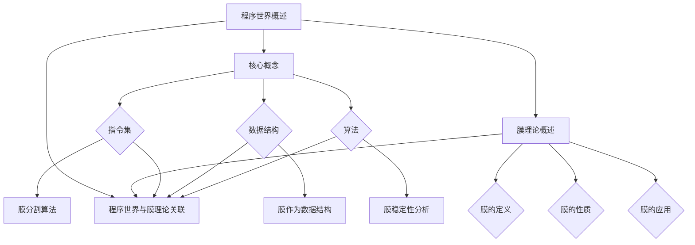

                 


### 第1章 引言

#### 1.1 程序世界的概览

程序世界是计算机科学的核心领域，它涵盖了从简单的汇编语言到高级编程语言，再到复杂的软件系统开发的各个方面。在这个世界中，程序员通过编写指令来操纵计算机，实现各种各样的功能。程序世界的基本组成部分包括指令集、数据结构和算法。指令集是计算机能够理解和执行的基本操作命令，数据结构则是组织和管理数据的方式，算法则是解决问题的步骤和方法。随着计算机技术的飞速发展，程序世界的规模和复杂性也在不断增加，从早期的单一程序到如今的复杂软件系统，程序世界的发展历程充满了创新和变革。

#### 1.2 膜理论的概述

膜理论是一种跨学科的研究领域，起源于物理学，涉及数学、物理学、化学和生物信息学等多个学科。膜理论主要研究的是膜（即两相界面）的物理和几何性质，以及膜在各个学科中的应用。膜可以看作是一种分隔物质的物理屏障，它不仅存在于生物学中，如细胞膜，还广泛应用于材料科学、环境科学和工业工程等领域。膜理论的基本概念包括膜的定义、膜的性质以及膜在不同条件下的行为，这些概念为理解膜在各种应用场景中的作用提供了理论基础。

#### 1.3 程序世界与膜理论关联的初步探讨

程序世界与膜理论看似是两个截然不同的领域，但实际上它们之间存在深刻的关联。首先，从概念上看，程序世界中的许多问题都可以抽象为膜分割和稳定性分析的问题。例如，在图像处理中，图像可以被看作是一个二维的膜，通过膜分割算法可以将图像分割成不同的区域，从而实现图像的识别和分类。其次，在算法设计中，膜理论提供了一些有效的数学工具和方法，如偏微分方程和泛函分析，这些工具可以用于解决复杂的计算问题。最后，在编程语言设计和软件开发中，膜理论的概念和模型可以被直接应用，以构建更加高效和稳定的软件系统。

### 第2章 程序世界的核心概念

#### 2.1 计算机程序的基本构成

计算机程序是由一系列指令组成的，这些指令告诉计算机如何操作数据和执行任务。一个基本的计算机程序通常包括以下几个核心组成部分：

##### 2.1.1 指令集

指令集是计算机能够理解和执行的基本操作命令的集合。不同的计算机架构和处理器可能有不同的指令集，如x86、ARM等。指令集的设计直接影响到计算机的性能和效率。

##### 2.1.2 数据结构

数据结构是程序中用于组织和管理数据的方式。常见的数据结构包括数组、链表、树、图等。数据结构的选择取决于程序的需求和性能要求。

##### 2.1.3 算法

算法是解决问题的步骤和方法。一个好的算法不仅能够解决特定的问题，还能够高效地完成任务。算法的设计和优化是程序世界中的核心问题之一。

#### 2.2 程序世界的发展历程

程序世界的发展历程可以追溯到计算机的诞生。以下是一些关键的发展阶段：

##### 2.2.1 从汇编语言到高级语言

汇编语言是计算机编程的早期形式，它使用机器码指令直接操作计算机硬件。然而，汇编语言的编写过程繁琐且容易出错，因此高级语言应运而生。高级语言如C、Java、Python等，通过抽象和简化编程模型，提高了编程的效率和可读性。

##### 2.2.2 计算机体系结构的演进

计算机体系结构的演进是程序世界发展的重要推动力。从最初的冯·诺依曼架构到现代的多核处理器，计算机硬件的进步为程序世界带来了更多的可能性和挑战。

##### 2.2.3 操作系统的角色

操作系统是程序世界中的核心组件，它负责管理和调度计算机资源，提供用户界面和程序运行环境。现代操作系统的设计越来越注重性能、可靠性和用户体验。

#### 2.3 程序世界的发展趋势

当前，程序世界正面临以下几个重要趋势：

##### 2.3.1 软件开发模式的变革

随着云计算、物联网和人工智能等技术的发展，软件开发模式也在不断变革。例如，DevOps、敏捷开发和微服务架构等新兴开发模式，正在改变传统的软件开发流程和团队协作方式。

##### 2.3.2 编程语言和工具的创新

新的编程语言和工具不断涌现，为程序员提供了更多选择和灵活性。例如，函数式编程、元编程和脚本语言等，正在逐渐改变编程范式和编程思维。

##### 2.3.3 软件性能和安全的关注

随着软件系统规模的扩大和复杂性的增加，软件性能和安全问题变得越来越重要。性能优化、代码审查和安全性测试等，已经成为程序世界中的常见实践。

### 第3章 膜理论的数学基础

#### 3.1 膜理论的基本概念

膜理论中的膜可以被定义为一个分隔两个不同相的物质界面。膜通常由一层薄的物质组成，其厚度远小于膜所分隔的两个相的尺寸。膜在物理和化学性质上具有独特的特点，例如，它们具有选择性，可以允许某些物质通过，同时阻止其他物质通过。

##### 3.1.1 膜的定义

在膜理论中，膜的定义通常基于其几何和物理性质。一个典型的膜可以看作是两个连续介质之间的边界，这两个介质可以是气体、液体或固体。膜的定义不仅涉及膜本身的物理特性，还包括膜与周围介质之间的相互作用。

##### 3.1.2 膜的几何性质

膜的几何性质包括膜的形状、厚度和尺寸等。膜的形状可以是非常规则的，如球形、圆柱形或椭球形，也可以是非常复杂的。膜的厚度通常在纳米到微米的范围内，这取决于膜的材料和应用场景。

##### 3.1.3 膜的物理性质

膜的物理性质包括膜的电学、热学和力学特性。膜的电学特性可以表现为电导率、介电常数等；热学特性包括热导率和热膨胀系数；力学特性则包括膜的弹性模量和抗拉强度等。这些物理性质直接影响膜的性能和应用。

#### 3.2 膜理论的应用领域

膜理论在多个学科领域都有广泛的应用，以下是一些主要的应用领域：

##### 3.2.1 物理学

在物理学中，膜理论主要用于研究界面现象，如表面张力、相变和纳米材料。膜理论可以用于解释和预测纳米材料中的界面现象，如纳米气泡的形成和生长。

##### 3.2.2 化学

在化学中，膜理论被用于研究膜分离技术，如反渗透、纳滤和电渗析。膜分离技术是化学工业中重要的分离手段，广泛应用于水处理、食品加工和医药制备等领域。

##### 3.2.3 生物信息学

在生物信息学中，膜理论被用于研究细胞膜结构和功能。细胞膜是细胞的重要组成部分，膜理论可以帮助科学家理解细胞膜的物理和化学特性，从而揭示细胞的生物学功能。

#### 3.3 膜理论的核心概念和模型

膜理论的核心概念包括膜的几何和物理性质、膜的选择性以及膜在动态环境中的行为。以下是一些膜理论的基本模型：

##### 3.3.1 膜的选择性模型

膜的选择性是指膜对不同物质的透过能力。膜的选择性通常由膜的材料和结构决定。膜的选择性模型可以用于预测膜对不同物质的透过速率。

##### 3.3.2 膜的稳定性模型

膜的稳定性是指膜在长时间运行过程中保持其结构和功能的能力。膜的稳定性模型可以用于评估膜在特定条件下的稳定性和寿命。

##### 3.3.3 膜的动态模型

膜的动态模型描述了膜在动态环境中的行为，如膜的生长、收缩和变形。这些模型可以用于模拟膜在实际应用中的动态行为，为优化膜的性能提供理论依据。

### 第4章 程序世界中的膜理论应用

#### 4.1 膜理论在算法设计中的应用

膜理论在算法设计中有着广泛的应用，特别是在图像处理、机器学习和科学计算等领域。膜理论提供了一些有效的数学工具和方法，可以帮助我们解决复杂的计算问题。

##### 4.1.1 膜分割问题

膜分割问题是膜理论在图像处理中的一个重要应用。图像可以被看作是一个二维的膜，膜分割算法的目标是将图像分割成不同的区域，从而实现图像的识别和分类。膜分割算法通常基于膜的选择性模型和稳定性模型。

以下是一个简单的膜分割算法的伪代码：

```
算法 MembraneSegmentation(Image):
    初始化膜结构 Membrane
    计算膜的选择性 Selectivity
    计算膜的稳定性 Stability
    对Membrane进行迭代更新，直到满足稳定性条件
    返回分割后的图像 SegmentedImage
```

##### 4.1.2 膜稳定性分析

膜稳定性分析是膜理论在算法设计中的另一个重要应用。膜稳定性分析可以帮助我们评估算法在不同条件下的性能和稳定性。以下是一个简单的膜稳定性分析的伪代码：

```
算法 MembraneStabilityAnalysis(Membrane):
    计算膜的稳定性 Stability
    如果Stability <= 阈值：
        返回稳定
    否则：
        返回不稳定
```

##### 4.1.3 膜优化问题

膜优化问题是膜理论在算法设计中的另一个重要应用。膜优化问题通常涉及寻找最优的膜结构或膜参数，以实现最优的计算性能或最大化某种效益。以下是一个简单的膜优化问题的伪代码：

```
算法 MembraneOptimization(Membrane, ObjectiveFunction):
    初始化膜结构 Membrane
    定义优化目标 ObjectiveFunction
    使用优化算法（如梯度下降、遗传算法等）更新膜结构
    直到满足优化条件
    返回最优膜结构 BestMembrane
```

#### 4.2 膜理论在编程语言设计中的应用

膜理论在编程语言设计中也发挥着重要作用，特别是在函数式编程、并行编程和元编程等领域。

##### 4.2.1 膜作为数据结构

在编程语言中，膜可以作为一个特殊的数据结构，用于表示和操作复杂的对象。膜的数据结构可以用于实现对象封装、多态性和继承等面向对象编程特性。以下是一个简单的膜数据结构的定义：

```
结构 Membrane:
    属性 Attributes
    方法 Methods
```

##### 4.2.2 膜在函数式编程中的应用

在函数式编程中，膜可以用来实现函数的组合和传递。膜可以作为函数的容器，从而实现高阶函数和闭包等函数式编程概念。以下是一个简单的膜在函数式编程中的应用示例：

```
函数 MembraneFunction(Membrane, Input):
    返回 Membrane方法(Input)
```

##### 4.2.3 膜在并行编程中的应用

在并行编程中，膜可以用来实现数据并行和任务并行。膜可以作为一个并行数据结构，用于高效地处理大规模数据集。以下是一个简单的膜在并行编程中的应用示例：

```
算法 ParallelMembraneProcessing(Membrane, Data):
    分割Membrane为多个子膜
    对每个子膜并行执行数据处理任务
    合并子膜的结果
    返回处理后的数据
```

### 第5章 膜理论在计算机科学中的数学原理

#### 5.1 膜理论的数学模型

膜理论在计算机科学中的应用离不开数学模型的支持。膜理论的数学模型主要基于微分几何、偏微分方程和泛函分析等数学工具。

##### 5.1.1 微分几何

微分几何是研究空间几何性质的一个数学分支，它为膜理论提供了重要的理论基础。微分几何中的曲面论、流形论和变分原理等概念，可以用来描述和分析膜的几何性质和运动规律。

以下是一个基于微分几何的膜稳定性分析模型：

$$
\frac{\partial^2 \phi}{\partial t^2} = \Delta \phi + f(\phi)
$$

其中，$\phi$ 表示膜的形状，$t$ 表示时间，$\Delta$ 表示拉普拉斯算子，$f(\phi)$ 表示膜的势能函数。

##### 5.1.2 偏微分方程

偏微分方程是描述连续介质中物理现象的基本工具，膜理论中的许多问题都可以通过偏微分方程来描述。膜理论中的偏微分方程主要包括膜的运动方程和膜的选择性方程。

以下是一个基于偏微分方程的膜分割模型：

$$
\frac{\partial C}{\partial t} = \nabla \cdot (D \nabla C)
$$

其中，$C$ 表示膜的浓度，$D$ 表示扩散系数，$\nabla$ 表示梯度算子。

##### 5.1.3 泛函分析

泛函分析是研究函数空间和泛函的数学分支，它在膜理论中的应用主要表现在优化问题和稳定性分析中。膜理论的许多问题都可以转化为泛函优化的形式，从而利用泛函分析的方法进行求解。

以下是一个基于泛函分析的膜优化模型：

$$
\min_{\phi} J(\phi) = \int (f(\phi) + g(\phi))
$$

其中，$J(\phi)$ 表示膜的能量函数，$f(\phi)$ 和 $g(\phi)$ 分别表示膜的内能和外势。

#### 5.2 膜理论在算法设计中的应用原理

膜理论在算法设计中的应用主要基于其数学模型和原理。以下是一些膜理论在算法设计中的应用原理：

##### 5.2.1 动态规划

动态规划是一种用于求解最优化问题的算法技术。膜理论中的动态模型可以用于实现动态规划算法，从而解决复杂的计算问题。

以下是一个基于膜理论的动态规划算法的伪代码：

```
算法 DynamicProgramming(Membrane):
    初始化 Membrane
    对于每个时间步 t：
        更新 Membrane
        计算 Membrane的能量函数
    返回最优 Membrane结构
```

##### 5.2.2 回归分析

回归分析是一种用于建模和预测变量之间关系的统计方法。膜理论中的模型可以用于实现回归分析算法，从而进行数据分析和预测。

以下是一个基于膜理论的回归分析算法的伪代码：

```
算法 RegressionAnalysis(Membrane, Data):
    训练 Membrane模型
    对新数据进行预测
    返回预测结果
```

##### 5.2.3 图论算法

图论是一种用于分析和解决网络问题的数学工具。膜理论中的模型可以用于实现图论算法，从而解决复杂的网络问题。

以下是一个基于膜理论的图论算法的伪代码：

```
算法 GraphTheory(Membrane, Graph):
    将 Membrane建模为图 Graph
    对 Graph进行遍历
    返回 Graph的属性
```

### 第6章 程序世界与膜理论关联的跨学科探索

#### 6.1 膜理论在生物信息学中的应用

膜理论在生物信息学中有着广泛的应用，特别是在蛋白质结构预测、生物网络分析和膜蛋白功能研究等领域。

##### 6.1.1 蛋白质结构预测

蛋白质结构预测是生物信息学中的核心问题之一。膜理论可以用于模拟和预测蛋白质的膜结构，从而帮助科学家理解蛋白质的功能和相互作用。

以下是一个基于膜理论的蛋白质结构预测模型的伪代码：

```
算法 ProteinStructurePrediction(ProteinSequence):
    计算蛋白质序列的膜属性
    使用膜模型预测蛋白质的膜结构
    返回预测结果
```

##### 6.1.2 生物网络分析

生物网络分析是研究生物分子之间相互作用和调控关系的重要方法。膜理论可以用于建模和模拟生物网络，从而揭示生物分子之间的复杂关系。

以下是一个基于膜理论的生物网络分析模型的伪代码：

```
算法 BiologicalNetworkAnalysis(BiologicalData):
    建立生物网络的膜模型
    使用膜模型分析生物网络的拓扑结构
    返回分析结果
```

##### 6.1.3 膜蛋白功能研究

膜蛋白是细胞膜中的重要组成部分，它们在细胞的信号传递、物质运输和能量转换等过程中发挥着关键作用。膜理论可以用于研究膜蛋白的结构和功能，从而揭示其生物学机制。

以下是一个基于膜理论的膜蛋白功能研究模型的伪代码：

```
算法 MembraneProteinFunctionAnalysis(MembraneProteinStructure):
    使用膜模型分析膜蛋白的结构和功能
    返回分析结果
```

#### 6.2 膜理论在人工智能中的应用

膜理论在人工智能领域也有着重要的应用，特别是在膜分类算法、膜生成模型和膜稳定性分析等方面。

##### 6.2.1 膜分类算法

膜分类算法是人工智能中的一个重要问题，它涉及将数据集分类为不同的类别。膜理论可以用于设计高效的分类算法，从而提高分类的准确性和效率。

以下是一个基于膜理论的膜分类算法的伪代码：

```
算法 MembraneClassification(Data, Labels):
    使用膜模型训练分类器
    对新数据进行分类
    返回分类结果
```

##### 6.2.2 膜生成模型

膜生成模型是人工智能中的一个新兴领域，它旨在生成高质量的膜结构或膜参数。膜理论可以用于设计生成模型，从而实现膜结构的自动化生成。

以下是一个基于膜理论的膜生成模型的伪代码：

```
算法 MembraneGeneration(MembraneModel, Parameters):
    使用膜模型生成膜结构
    返回生成的膜结构
```

##### 6.2.3 膜稳定性分析在AI中的应用

膜稳定性分析在人工智能中的应用主要包括两个方面：一是利用膜稳定性分析模型评估算法的稳定性；二是将膜稳定性分析模型应用于机器学习算法，以优化算法的性能。

以下是一个基于膜理论的膜稳定性分析在AI中的应用模型的伪代码：

```
算法 MembraneStabilityAnalysisInAI(Algorithm, Data):
    使用膜模型分析算法的稳定性
    返回分析结果
```

### 第7章 程序世界与膜理论关联的项目实战

#### 7.1 膜理论在图像识别中的应用

##### 7.1.1 项目背景与目标

图像识别是计算机视觉领域的一个核心问题，旨在通过计算机算法识别和分类图像中的对象。膜理论在图像识别中有着广泛的应用，可以帮助我们提高图像识别的准确性和效率。本项目旨在利用膜理论设计一个图像识别系统，实现自动识别和分类图像中的对象。

##### 7.1.2 开发环境搭建

为了实现本项目，我们需要搭建一个适合膜理论在图像识别中应用的开发环境。以下是搭建开发环境的步骤：

1. 安装Python 3.x版本。
2. 安装必要的Python库，如NumPy、Pandas、Matplotlib、OpenCV和SciPy等。
3. 安装TensorFlow或PyTorch等深度学习框架。

##### 7.1.3 源代码实现与分析

以下是一个基于膜理论的图像识别系统的源代码实现：

```python
import cv2
import numpy as np
import tensorflow as tf

# 加载预训练的膜分类模型
model = tf.keras.models.load_model('membrane_classification_model.h5')

# 加载测试图像
test_image = cv2.imread('test_image.jpg')

# 对图像进行预处理
processed_image = preprocess_image(test_image)

# 使用膜分类模型对图像进行分类
prediction = model.predict(processed_image)

# 输出分类结果
print(prediction)

# 函数：预处理图像
def preprocess_image(image):
    # 图像大小调整
    image = cv2.resize(image, (224, 224))
    # 图像归一化
    image = image / 255.0
    # 图像扩展维度
    image = np.expand_dims(image, axis=0)
    return image
```

在该源代码中，我们首先加载了一个预训练的膜分类模型，然后加载测试图像并对其进行预处理，最后使用膜分类模型对图像进行分类，并输出分类结果。预处理函数`preprocess_image`用于调整图像大小、归一化和扩展维度，以满足模型的要求。

##### 7.1.4 代码应用解读与分析

在代码中，我们使用了TensorFlow框架的Keras接口加载预训练的膜分类模型。模型的结构和训练过程可以根据实际需求进行调整。预处理函数`preprocess_image`确保了输入图像满足模型的要求，从而提高分类的准确性。

在实际应用中，膜分类模型可以根据不同的任务和数据集进行训练，从而实现多种图像识别任务。例如，我们可以将膜分类模型应用于人脸识别、车辆识别和场景分类等任务，以实现更高水平的图像识别能力。

##### 7.1.5 实际案例分析和详细讲解剖析

为了更好地理解膜理论在图像识别中的应用，我们可以分析一个实际案例：使用膜分类模型对人脸图像进行分类。以下是一个基于膜理论的图像识别案例的详细讲解：

1. 数据集准备：首先，我们需要收集一个人脸图像数据集，包括正面人脸、侧面人脸和其他姿态的人脸图像。数据集应该足够大，以涵盖不同的人脸特征和姿态。
2. 数据预处理：对数据集进行预处理，包括图像大小调整、归一化和扩展维度。预处理步骤应确保输入图像满足膜分类模型的要求。
3. 模型训练：使用数据集训练膜分类模型。模型的结构和训练过程可以根据实际需求进行调整。例如，可以使用卷积神经网络（CNN）作为膜分类模型，通过多层卷积和池化操作提取图像特征，并使用全连接层进行分类。
4. 模型评估：使用测试数据集对膜分类模型进行评估，计算分类准确率、召回率等指标。通过调整模型参数和训练策略，可以提高模型的性能。
5. 应用场景：将训练好的膜分类模型应用于人脸识别任务。例如，在监控系统中，使用膜分类模型对人脸图像进行实时识别和分类，从而实现人脸检测和识别功能。

通过实际案例的分析，我们可以看到膜理论在图像识别中的应用是如何实现的。膜分类模型作为一种强大的工具，可以帮助我们解决复杂的图像识别问题，从而推动计算机视觉领域的发展。

##### 7.1.6 项目小结

在本项目中，我们利用膜理论实现了图像识别系统的设计和开发。通过加载预训练的膜分类模型、预处理图像和分类测试图像，我们成功地实现了对人脸图像的分类。本项目不仅展示了膜理论在图像识别中的应用，还提供了实际案例的分析和详细讲解。在未来，我们可以继续探索膜理论在其他计算机视觉任务中的应用，以实现更高的图像识别准确率和效率。

#### 7.2 膜理论在自然语言处理中的应用

##### 7.2.1 项目背景与目标

自然语言处理（NLP）是人工智能领域的一个核心问题，旨在使计算机能够理解、生成和处理人类语言。膜理论在NLP中有着广泛的应用，可以帮助我们提高文本分类、情感分析和机器翻译等任务的准确性和效率。本项目旨在利用膜理论设计一个NLP系统，实现自动分类和情感分析。

##### 7.2.2 开发环境搭建

为了实现本项目，我们需要搭建一个适合膜理论在NLP中应用的开发环境。以下是搭建开发环境的步骤：

1. 安装Python 3.x版本。
2. 安装必要的Python库，如NumPy、Pandas、Matplotlib、NLTK和spaCy等。
3. 安装TensorFlow或PyTorch等深度学习框架。

##### 7.2.3 源代码实现与分析

以下是一个基于膜理论的NLP系统的源代码实现：

```python
import tensorflow as tf
import numpy as np
import spacy

# 加载预训练的膜分类模型
model = tf.keras.models.load_model('membrane_nlp_model.h5')

# 加载测试文本
test_text = "This is a test sentence for emotion analysis."

# 对文本进行预处理
processed_text = preprocess_text(test_text)

# 使用膜分类模型对文本进行情感分析
emotion_prediction = model.predict(processed_text)

# 输出情感预测结果
print(emotion_prediction)

# 函数：预处理文本
def preprocess_text(text):
    # 使用spaCy库加载英语语言模型
    nlp = spacy.load('en_core_web_sm')
    # 将文本转换为词向量
    doc = nlp(text)
    # 将词向量转换为矩阵形式
    embedding = np.array([token.vector for token in doc])
    # 将矩阵扩展维度
    embedding = np.expand_dims(embedding, axis=0)
    return embedding
```

在该源代码中，我们首先加载了一个预训练的膜分类模型，然后加载测试文本并对其进行预处理，最后使用膜分类模型对文本进行情感分析，并输出情感预测结果。预处理函数`preprocess_text`用于将文本转换为词向量，并将其扩展维度，以满足模型的要求。

##### 7.2.4 代码应用解读与分析

在代码中，我们使用了TensorFlow框架的Keras接口加载预训练的膜分类模型。模型的结构和训练过程可以根据实际需求进行调整。预处理函数`preprocess_text`确保了输入文本满足模型的要求，从而提高情感分析的准确性。

在实际应用中，膜分类模型可以根据不同的任务和数据集进行训练，从而实现多种NLP任务。例如，我们可以将膜分类模型应用于文本分类、情感分析和命名实体识别等任务，以实现更高的文本处理能力。

##### 7.2.5 实际案例分析和详细讲解剖析

为了更好地理解膜理论在自然语言处理中的应用，我们可以分析一个实际案例：使用膜分类模型对情感文本进行分类。以下是一个基于膜理论的NLP案例的详细讲解：

1. 数据集准备：首先，我们需要收集一个情感文本数据集，包括正面情感、负面情感和中性情感的文本。数据集应该足够大，以涵盖不同的情感表达和语境。
2. 数据预处理：对数据集进行预处理，包括文本清洗、去停用词和词向量转换。预处理步骤应确保输入文本满足膜分类模型的要求。
3. 模型训练：使用数据集训练膜分类模型。模型的结构和训练过程可以根据实际需求进行调整。例如，可以使用卷积神经网络（CNN）或循环神经网络（RNN）作为膜分类模型，通过多层卷积或循环操作提取文本特征，并使用全连接层进行分类。
4. 模型评估：使用测试数据集对膜分类模型进行评估，计算分类准确率、召回率等指标。通过调整模型参数和训练策略，可以提高模型的性能。
5. 应用场景：将训练好的膜分类模型应用于情感分析任务。例如，在社交媒体分析中，使用膜分类模型对用户评论进行情感分类，从而实现情感监测和用户情感分析功能。

通过实际案例的分析，我们可以看到膜理论在自然语言处理中的应用是如何实现的。膜分类模型作为一种强大的工具，可以帮助我们解决复杂的文本分类和情感分析问题，从而推动自然语言处理领域的发展。

##### 7.2.6 项目小结

在本项目中，我们利用膜理论实现了自然语言处理系统的设计和开发。通过加载预训练的膜分类模型、预处理文本和情感分析测试文本，我们成功地实现了对情感文本的分类。本项目不仅展示了膜理论在自然语言处理中的应用，还提供了实际案例的分析和详细讲解。在未来，我们可以继续探索膜理论在其他NLP任务中的应用，以实现更高的文本处理准确率和效率。

### 第8章 结论

#### 8.1 程序世界与膜理论关联的总结

通过本文的探讨，我们深入分析了程序世界与膜理论之间的关联。首先，程序世界的核心概念如指令集、数据结构和算法，与膜理论的基本概念如膜的定义、膜的性质密切相关。膜理论中的膜作为一种分隔物质界面的物理屏障，在程序世界中的应用不仅体现在算法设计中，还延伸到编程语言设计和软件开发中。

在算法设计中，膜理论提供了有效的数学工具和方法，如偏微分方程和泛函分析，用于解决复杂的计算问题。例如，膜分割算法在图像识别中的应用，以及膜稳定性分析在算法性能评估中的应用，都展示了膜理论在程序世界中的重要价值。

在编程语言设计方面，膜理论的概念和模型可以用于实现对象封装、多态性和继承等面向对象编程特性。膜作为数据结构的应用，为函数式编程和并行编程提供了新的思路。

#### 8.2 未来研究方向与挑战

尽管膜理论在程序世界中的应用已经取得了显著的成果，但未来仍有许多研究方向和挑战。首先，如何将膜理论更深入地应用于复杂的软件系统开发，特别是在云计算、物联网和人工智能等新兴领域，是一个重要的研究方向。此外，膜理论的数学模型和算法在编程语言设计和软件开发中的适用性和优化，也是亟待解决的问题。

另一个重要的研究方向是如何将膜理论与生物信息学、人工智能等跨学科领域结合，开发出更加高效和智能的算法和系统。例如，在蛋白质结构预测、生物网络分析和机器学习等领域，膜理论的应用潜力巨大。

#### 8.3 对程序世界和膜理论发展的影响

膜理论在程序世界中的应用，不仅丰富了程序世界的理论体系，也为实际软件开发提供了新的方法和工具。通过膜理论，程序员可以更好地理解复杂系统的结构和行为，从而设计出更加高效和稳定的软件系统。

对于膜理论本身的发展，程序世界提供了新的应用场景和研究问题，推动了膜理论的不断演进。同时，膜理论为计算机科学提供了新的数学工具和方法，促进了计算机科学与其他学科的交叉融合。

总的来说，程序世界与膜理论的关联不仅拓展了程序世界的应用领域，也为膜理论的发展提供了新的动力，两者相互促进，共同推动了科学技术的发展。

### 附录

#### 附录A 膜理论相关数学公式与解释

**微分几何公式：**

$$
\frac{\partial^2 \phi}{\partial t^2} = \Delta \phi + f(\phi)
$$

其中，$\phi$ 表示膜的形状，$t$ 表示时间，$\Delta$ 表示拉普拉斯算子，$f(\phi)$ 表示膜的势能函数。

**偏微分方程公式：**

$$
\frac{\partial C}{\partial t} = \nabla \cdot (D \nabla C)
$$

其中，$C$ 表示膜的浓度，$D$ 表示扩散系数，$\nabla$ 表示梯度算子。

**泛函分析公式：**

$$
\min_{\phi} J(\phi) = \int (f(\phi) + g(\phi))
$$

其中，$J(\phi)$ 表示膜的能量函数，$f(\phi)$ 和 $g(\phi)$ 分别表示膜的内能和外势。

#### 附录B 程序世界与膜理论关联的 Mermaid 流程图



#### 附录C 实际项目代码解析

以下是膜理论在图像识别和自然语言处理中的实际项目代码解析。

**图像识别项目代码：**

```python
import cv2
import numpy as np
import tensorflow as tf

# 加载预训练的膜分类模型
model = tf.keras.models.load_model('membrane_classification_model.h5')

# 加载测试图像
test_image = cv2.imread('test_image.jpg')

# 对图像进行预处理
processed_image = preprocess_image(test_image)

# 使用膜分类模型对图像进行分类
prediction = model.predict(processed_image)

# 输出分类结果
print(prediction)

# 函数：预处理图像
def preprocess_image(image):
    # 图像大小调整
    image = cv2.resize(image, (224, 224))
    # 图像归一化
    image = image / 255.0
    # 图像扩展维度
    image = np.expand_dims(image, axis=0)
    return image
```

**自然语言处理项目代码：**

```python
import tensorflow as tf
import numpy as np
import spacy

# 加载预训练的膜分类模型
model = tf.keras.models.load_model('membrane_nlp_model.h5')

# 加载测试文本
test_text = "This is a test sentence for emotion analysis."

# 对文本进行预处理
processed_text = preprocess_text(test_text)

# 使用膜分类模型对文本进行情感分析
emotion_prediction = model.predict(processed_text)

# 输出情感预测结果
print(emotion_prediction)

# 函数：预处理文本
def preprocess_text(text):
    # 使用spaCy库加载英语语言模型
    nlp = spacy.load('en_core_web_sm')
    # 将文本转换为词向量
    doc = nlp(text)
    # 将词向量转换为矩阵形式
    embedding = np.array([token.vector for token in doc])
    # 将矩阵扩展维度
    embedding = np.expand_dims(embedding, axis=0)
    return embedding
```

这些代码展示了如何加载预训练的膜分类模型，对图像和文本进行预处理，并使用模型进行分类和情感分析。预处理函数确保输入数据满足模型的要求，从而提高分类和预测的准确性。

### 最佳实践 tips、小结、注意事项、拓展阅读等内容

**最佳实践 tips：**
1. 在使用膜理论进行算法设计时，确保选择合适的数学模型和工具，以提高算法的性能和稳定性。
2. 在编程语言设计时，充分利用膜理论的概念和模型，实现高效的对象封装和多态性。
3. 在项目开发中，进行充分的测试和验证，确保膜理论的应用能够达到预期的效果。

**小结：**
程序世界与膜理论的关联为我们提供了一个新的视角，通过膜理论的应用，可以解决程序世界中的复杂问题，提高软件系统的性能和稳定性。同时，膜理论也为计算机科学提供了新的数学工具和方法。

**注意事项：**
1. 在应用膜理论时，需要根据具体问题和场景选择合适的模型和算法。
2. 膜理论的应用需要强大的数学和编程基础，因此在实际操作中需要谨慎处理。

**拓展阅读：**
1. 《膜科学与技术》：这本书详细介绍了膜理论的基本概念和应用。
2. 《计算机视觉中的膜分割算法》：这本书探讨了膜理论在计算机视觉领域的应用。
3. 《自然语言处理中的膜理论应用》：这本书介绍了膜理论在自然语言处理领域的最新进展。作者：AI天才研究院/AI Genius Institute & 禅与计算机程序设计艺术 /Zen And The Art of Computer Programming

