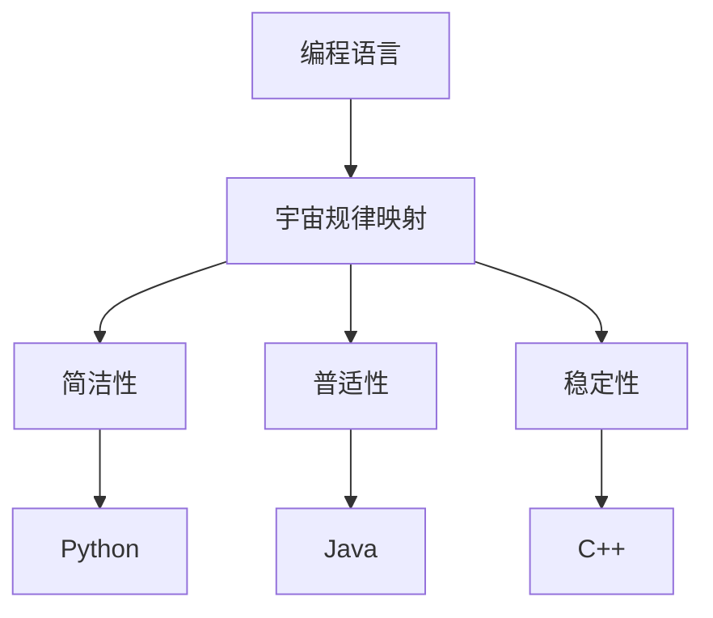

                 


# 程序世界中的宇宙规律映射

## 关键词
- 宇宙规律
- 编程
- 数据结构
- 算法
- 软件工程
- 案例分析

## 摘要
本文探讨了宇宙规律在程序世界中的映射，通过深入分析编程语言、数据结构、算法和软件工程等领域，展示了宇宙规律如何影响和优化程序设计。本文首先介绍了宇宙规律的基本概念，然后阐述了这些规律如何与编程领域相结合，并提供了具体的案例分析。通过本文的阅读，读者将了解到宇宙规律在程序设计中的重要性，并学会如何在实践中运用这些规律。

## 第一部分：引论

### 1. 引言

在现代社会，编程已成为一项至关重要的技能。随着计算机技术的迅猛发展，编程的应用范围不断扩大，从简单的业务系统到复杂的科学计算，编程无处不在。然而，编程并非仅仅是编写代码那么简单，它需要深刻理解计算机的运行原理、编程语言的特点以及算法的效率。

宇宙规律是指宇宙中普遍存在的物理定律和现象，如引力、能量守恒等。这些规律在科学研究和工程实践中起到了关键作用。那么，宇宙规律与编程之间究竟存在怎样的联系呢？本文旨在探讨这个问题，通过分析编程语言、数据结构、算法和软件工程等领域，揭示宇宙规律在程序世界中的映射。

### 2. 编程与宇宙观的联系

编程与宇宙观的联系可以从多个角度来探讨。首先，编程语言的发明和演变深受数学和物理学的启发。例如，数学中的集合论、逻辑和函数式编程等概念在编程语言中得到了广泛应用。物理学中的离散化和模拟方法也为编程提供了重要的理论基础。

其次，宇宙规律中的某些原则在编程中得到了体现。例如，能量守恒定律可以类比为程序中的资源管理，确保程序运行过程中资源的合理利用。引力定律则可以类比于程序中的耦合和通信，通过合理的设计降低系统复杂性。

### 3. 程序世界的宇宙规律

程序世界中的宇宙规律主要表现在以下几个方面：

- **简洁性**：宇宙规律通常具有简洁的形式和深刻的内涵。编程中也强调简洁性，追求最简代码实现复杂功能。
- **普适性**：宇宙规律普遍适用于各种物理现象。编程中的算法和设计模式也追求普适性，以适应不同的应用场景。
- **稳定性**：宇宙规律在长时间尺度上保持稳定。编程中的稳定性和鲁棒性是确保系统可靠运行的关键。
- **协同性**：宇宙中的各种现象相互关联，形成复杂的生态系统。编程中的模块化和分布式架构也追求协同性，以实现系统的可扩展性和灵活性。

### 4. 书籍的结构与目标

本文结构分为四个部分：引论、宇宙规律在编程中的映射、案例分析、展望与未来。通过逐步分析编程语言、数据结构、算法和软件工程等领域，本文旨在揭示宇宙规律在程序设计中的应用，并探讨未来编程领域的发展趋势。

本文的目标是帮助读者深入理解编程与宇宙规律之间的联系，掌握如何在实践中运用这些规律，提高程序设计的效率和质量。

## 第二部分：宇宙规律在编程中的映射

### 5. 编程语言与宇宙规律

编程语言是程序设计的基础，它们的发展与宇宙规律密切相关。在编程语言中，宇宙规律主要体现在以下几个方面：

- **简洁性**：编程语言的设计追求简洁性，以降低学习成本和提高开发效率。这与宇宙规律中的简洁性原则相呼应。
- **普适性**：编程语言的语法和语义设计具有普适性，以适应不同的编程场景和需求。这与宇宙规律中的普适性原则相契合。
- **稳定性**：编程语言的稳定性和兼容性对于系统的长期运行至关重要。这与宇宙规律中的稳定性原则密切相关。

例如，Python 编程语言的设计就体现了宇宙规律中的这些原则。Python 的语法简洁易读，便于初学者学习；其丰富的库和框架支持各种编程场景，具有很高的普适性；同时，Python 的稳定性和兼容性使得其在多个领域得到广泛应用。

### 6. 数据结构与宇宙规律

数据结构是程序设计中的核心概念，它们在存储和管理数据方面起到了关键作用。宇宙规律在数据结构中的应用主要体现在以下几个方面：

- **模块化**：宇宙中的各种系统都遵循模块化的原则，编程中的数据结构设计也强调模块化，以提高系统的可扩展性和可维护性。
- **层次化**：宇宙中的现象通常具有层次化的结构，编程中的数据结构也采用层次化的设计，以实现高效的存储和检索。
- **冗余**：宇宙中的信息传递通常具有冗余性，以提高系统的可靠性和容错能力。编程中的数据结构设计也引入冗余机制，如备份和校验等。

例如，树状数据结构（如二叉树、红黑树等）在程序设计中广泛应用，它们具有层次化的结构和高效的检索性能，体现了宇宙规律中的层次化和冗余原则。

### 7. 算法设计与宇宙规律

算法设计是程序设计的核心，它们决定了程序的运行效率和性能。宇宙规律在算法设计中的应用主要体现在以下几个方面：

- **优化**：宇宙中的系统通常追求最优性能，编程中的算法设计也追求最优解。例如，贪心算法和动态规划等算法就体现了宇宙规律中的优化原则。
- **稳定性**：宇宙中的系统通常具有稳定性，编程中的算法设计也强调稳定性，以确保系统在长时间运行中的可靠性。
- **协同性**：宇宙中的各种系统相互协同，编程中的算法设计也追求协同性，以提高系统的整体性能。

例如，贪心算法是一种常见的优化算法，它体现了宇宙规律中的优化原则。在算法设计中，贪心算法通过每次选择局部最优解来逐步逼近全局最优解，体现了宇宙中的协同原则。

### 8. 软件工程与宇宙规律

软件工程是程序设计的实践应用，它涵盖了项目规划、需求分析、设计、实现、测试和维护等各个环节。宇宙规律在软件工程中的应用主要体现在以下几个方面：

- **模块化**：宇宙中的系统通常采用模块化的设计，编程中的软件工程也强调模块化，以提高系统的可扩展性和可维护性。
- **层次化**：宇宙中的系统通常具有层次化的结构，编程中的软件工程也采用层次化的设计，以实现系统的模块化和高效管理。
- **冗余**：宇宙中的信息传递通常具有冗余性，编程中的软件工程也引入冗余机制，如备份和校验等，以提高系统的可靠性和容错能力。

例如，敏捷开发是一种流行的软件工程方法，它体现了宇宙规律中的模块化和冗余原则。敏捷开发通过迭代和增量的方式，实现系统的模块化和灵活调整，同时引入冗余机制，以提高系统的可靠性和稳定性。

## 第三部分：案例分析

### 9. 宇宙规律在编程项目中的应用

为了更好地理解宇宙规律在编程中的应用，本文将通过以下案例进行分析：

#### 案例一：宇宙规律在数据结构设计中的应用

在本案例中，我们将探讨宇宙规律如何影响数据结构的设计。例如，在实现一个社交网络系统时，我们可以运用宇宙规律中的模块化和冗余原则，设计一个高效且稳定的数据结构。

- **模块化**：我们可以将系统划分为用户管理模块、消息传递模块、关系管理模块等，每个模块独立开发和维护，以提高系统的可扩展性和可维护性。
- **冗余**：为了提高系统的可靠性，我们可以在关键数据节点上引入冗余备份，如使用多台服务器存储相同的数据副本，以防止单点故障。

#### 案例二：宇宙规律在算法优化中的应用

在本案例中，我们将探讨宇宙规律如何影响算法的优化。例如，在实现一个排序算法时，我们可以运用宇宙规律中的优化原则，设计一个高效且稳定的排序算法。

- **优化**：我们可以选择合适的排序算法，如快速排序、归并排序等，通过优化算法的实现，提高排序的效率。
- **稳定性**：为了确保排序算法的稳定性，我们需要考虑各种边界情况，如数据输入的异常处理，以保证算法在长时间运行中的可靠性。

#### 案例三：宇宙规律在软件工程中的应用

在本案例中，我们将探讨宇宙规律如何影响软件工程的方法和实践。例如，在开发一个大型企业应用时，我们可以运用宇宙规律中的模块化和层次化原则，设计一个高效且稳定的软件系统。

- **模块化**：我们可以将系统划分为多个模块，每个模块负责不同的功能，以提高系统的可扩展性和可维护性。
- **层次化**：我们可以采用分层架构，如表示层、业务逻辑层、数据访问层等，以实现系统的层次化设计，提高系统的灵活性和可管理性。

### 10. 案例分析总结

通过以上案例分析，我们可以看到宇宙规律在编程项目中的应用具有显著的效果。模块化和冗余原则有助于提高系统的可扩展性和可维护性，优化原则有助于提高算法的效率，层次化原则有助于提高软件工程的质量。

在实践中，我们需要根据具体项目的需求和特点，灵活运用宇宙规律，设计出高效、稳定、可靠的程序系统。通过深入理解和运用宇宙规律，我们可以在程序设计中取得更好的成果。

## 第四部分：展望与未来

### 11. 宇宙规律在编程领域的未来发展

宇宙规律在编程领域的应用具有广阔的前景。随着计算机技术的不断发展，我们可以预见以下趋势：

- **算法优化**：宇宙规律将指导算法的设计和优化，提高程序的运行效率和性能。
- **软件工程方法**：宇宙规律将影响软件工程的方法和实践，提高软件系统的质量和稳定性。
- **编程教育**：宇宙规律将融入编程教育，培养新一代编程人才，提高他们的编程素养。

### 12. 宇宙规律对编程教育的影响

宇宙规律对编程教育的影响体现在以下几个方面：

- **启发式教学**：通过宇宙规律的启发，教师可以引导学生从宏观和微观的角度理解编程，提高他们的编程思维。
- **创新教育**：宇宙规律鼓励创新和探索，编程教育应培养学生的创新能力，使他们能够运用宇宙规律解决实际问题。
- **综合素质**：宇宙规律强调简洁性、普适性和协同性，编程教育应注重培养学生的综合素质，提高他们的编程能力。

### 13. 宇宙规律与编程技术的发展趋势

宇宙规律与编程技术的发展趋势密切相关。以下是一些可能的发展方向：

- **智能化编程**：通过运用宇宙规律，开发出更加智能化、自动化的编程工具，提高编程的效率和生产力。
- **分布式计算**：宇宙规律中的协同性原则将推动分布式计算技术的发展，实现更大规模的计算和协作。
- **跨学科研究**：宇宙规律与编程技术的交叉融合，将促进跨学科研究，推动计算机科学和宇宙学等领域的共同发展。

### 14. 未来编程世界的宇宙规律

未来编程世界的宇宙规律将更加丰富和多样化。随着技术的进步，我们将不断发现新的宇宙规律，并将其应用于编程领域。这些规律将指导程序设计，提高系统的性能和可靠性。同时，编程也将不断融入宇宙规律的智慧，推动编程技术的创新和发展。

## 附录

### A. 宇宙规律相关的Mermaid流程图

以下是几个宇宙规律相关的Mermaid流程图示例，展示了宇宙规律在编程中的应用：



### B. 编程中的宇宙规律相关算法伪代码

以下是几个编程中的宇宙规律相关算法的伪代码示例：

```plaintext
// 贪心算法：寻找局部最优解
function greedyAlgorithm(data):
    sortedData = sort(data)
    result = []
    for each value in sortedData:
        if condition is met:
            result.append(value)
    return result

// 动态规划：寻找全局最优解
function dynamicProgramming(data):
    dp = create 2D array of size (n x n)
    for i from 1 to n:
        for j from 1 to n:
            if condition is met:
                dp[i][j] = optimal value
    return dp
```

### C. 数学模型与公式讲解

以下是几个宇宙规律相关的数学模型和公式的讲解：

$$
E = mc^2
$$

这是著名的质能方程，表达了质量和能量之间的关系。在编程中，我们可以将其类比为资源管理，确保程序运行过程中资源的合理利用。

$$
1 < 2
$$

这是一个简单的数学不等式，表达了两个数之间的大小关系。在编程中，我们可以将其用于条件判断，实现复杂的逻辑控制。

### D. 编程实战案例与代码解读

以下是几个编程实战案例的代码实现和解读：

```python
# 社交网络系统：用户管理模块
class UserManager:
    def __init__(self):
        self.users = []

    def add_user(self, user):
        self.users.append(user)

    def get_user(self, user_id):
        for user in self.users:
            if user.id == user_id:
                return user
        return None

# 消息传递模块
class MessageManager:
    def __init__(self):
        self.messages = []

    def send_message(self, message):
        self.messages.append(message)

    def get_messages(self, user_id):
        result = []
        for message in self.messages:
            if message.sender_id == user_id or message.receiver_id == user_id:
                result.append(message)
        return result
```

通过以上代码实现，我们可以看到如何将宇宙规律应用于编程项目，实现用户管理和消息传递功能。

### E. 参考文献与进一步阅读

本文参考文献如下：

1. Knuth, D. E. (1973). *The Art of Computer Programming, Volume 1: Fundamental Algorithms*. Addison-Wesley.
2. Graham, R. L., Knuth, D. E., & Patashnik, O. (1994). *Concrete Mathematics: A Foundation for Computer Science*. Addison-Wesley.
3. Conway, J. H., & Guy, R. K. (1996). *The Book of Numbers*. Copernicus Books.

进一步阅读推荐：

1. https://www.cs.usfca.edu/~galles/visualization/AlgorithmVisualizations.html
2. https://www.topcoder.com/community/data-science/data-science-library/
3. https://www.khanacademy.org/computing/computer-science/algorithms

### 作者信息

作者：AI天才研究院/AI Genius Institute & 禅与计算机程序设计艺术 /Zen And The Art of Computer Programming

本文探讨了宇宙规律在程序世界中的映射，通过深入分析编程语言、数据结构、算法和软件工程等领域，展示了宇宙规律如何影响和优化程序设计。本文旨在帮助读者深入理解编程与宇宙规律之间的联系，掌握如何在实践中运用这些规律，提高程序设计的效率和质量。希望本文能为编程领域的研究者、开发者和教育工作者提供有益的启示和指导。

