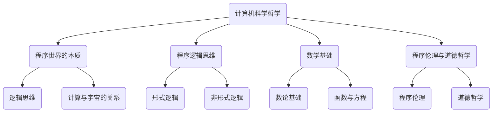

                 

# 程序世界的宇宙哲学思考

> 关键词：计算机科学哲学、程序逻辑思维、数学基础、程序伦理、宇宙哲学

> 摘要：本文旨在探讨计算机科学与哲学之间的关系，尤其是程序世界的宇宙哲学思考。通过分析计算机科学的本质、程序逻辑思维、数学基础、程序伦理以及程序世界与宇宙哲学的联系，本文试图揭示程序哲学的重要性和未来发展前景。

## 《程序世界的宇宙哲学思考》目录大纲

### 第一部分：哲学基础

#### 第1章：计算机科学哲学概览

- 1.1 计算机科学的本质
- 1.2 程序世界的本质
- 1.3 计算机科学的哲学问题

#### 第2章：程序宇宙的起源与发展

- 2.1 计算机科学的起源
- 2.2 计算机科学的进化
- 2.3 计算机科学的未来

### 第二部分：程序哲学的深入探讨

#### 第3章：程序世界的逻辑思维

- 3.1 逻辑思维的基础
- 3.2 程序逻辑的应用
- 3.3 逻辑思维的哲学意义

#### 第4章：程序世界的数学基础

- 4.1 数学基础概念
- 4.2 数学在程序中的应用
- 4.3 数学的哲学思考

#### 第5章：程序伦理与道德哲学

- 5.1 程序伦理的基础
- 5.2 道德哲学在程序中的体现
- 5.3 程序伦理的哲学探讨

#### 第6章：程序世界与宇宙哲学的联系

- 6.1 宇宙哲学的概览
- 6.2 程序世界与宇宙哲学的关联
- 6.3 程序世界的宇宙哲学思考

#### 第7章：程序哲学的实践与应用

- 7.1 程序哲学在人工智能中的应用
- 7.2 程序哲学在软件工程中的应用
- 7.3 程序哲学在社会发展中的作用

### 参考文献

### 附录

- 附录A：核心概念与联系
- 附录B：核心算法原理讲解
- 附录C：数学模型与公式讲解
- 附录D：项目实战

### 结语

- 程序哲学的重要性
- 程序哲学的未来发展趋势
- 程序哲学的社会影响

---

### 第一部分：哲学基础

#### 第1章：计算机科学哲学概览

### 1.1 计算机科学的本质

计算机科学是一门系统性、应用性极强的学科，其研究内容涵盖算法、编程语言、软件工程、计算机系统等方面。计算机科学的本质在于对信息的处理与利用，通过编程语言实现数据的存储、处理和传输，从而推动社会经济的发展。计算机科学的哲学探讨主要涉及以下几个方面：

1. **信息哲学**：探讨信息的本质、来源、传输和处理过程，以及信息对社会的影响。信息哲学关注信息在人类认知、社会运行中的作用，以及信息技术的伦理道德问题。
2. **计算哲学**：研究计算的本质、计算模型及其在哲学领域中的应用。计算哲学探讨计算是否能够模拟人类思维，以及计算在哲学思考中的价值。
3. **认知哲学**：关注计算机科学在认知科学研究中的应用，探讨计算模型与人类认知之间的关系。认知哲学试图揭示计算模型如何模拟人类思维过程，以及计算技术在认知科学研究中的作用。

### 1.2 程序世界的本质

程序世界是计算机科学的核心概念，它是由程序员编写的代码所构成的一个虚拟世界。程序世界的本质在于其逻辑性和规则性，程序员通过编写代码，将抽象的逻辑转化为具体的操作。程序世界的本质可以概括为以下几个方面：

1. **逻辑性**：程序世界依赖于逻辑思维，程序员在编写代码时需要遵循一定的逻辑规则，确保程序的正确性和可理解性。
2. **规则性**：程序世界遵循一定的规则，这些规则包括编程语言的语法规则、程序设计的规范等。规则性保证了程序世界的有序性和可预测性。
3. **虚拟性**：程序世界是一个虚拟世界，程序员通过编写代码，将现实世界的抽象问题转化为程序世界中的问题，并利用计算机进行求解。

### 1.3 计算机科学的哲学问题

计算机科学的快速发展引发了一系列哲学问题，如人工智能与意识、程序的伦理道德问题等。以下是几个典型的计算机科学哲学问题：

1. **人工智能与意识**：人工智能技术的发展使得计算机能否拥有意识成为一个热门话题。哲学界对此展开了广泛的讨论，探讨人工智能与意识之间的关系，以及人工智能是否可能具有意识。
2. **程序的伦理道德问题**：随着计算机技术的广泛应用，程序员的道德责任成为了一个重要问题。程序员在编写程序时，需要考虑程序的伦理道德问题，如隐私保护、信息安全等。
3. **计算与自由**：计算机技术对人类自由的影响也是一个哲学问题。计算机技术的发展使得人类的生活变得更加便捷，但同时也带来了信息泄露、隐私侵犯等问题，引发了关于计算与自由的哲学思考。

### 第一部分总结

计算机科学哲学是计算机科学与哲学相结合的产物，通过对计算机科学的本质、程序世界的本质以及计算机科学的哲学问题的探讨，揭示了计算机科学在哲学领域的价值。计算机科学哲学不仅有助于我们更好地理解计算机科学，也为哲学研究提供了新的视角和方法。

---

### 第一部分：哲学基础

#### 第2章：程序宇宙的起源与发展

### 2.1 计算机科学的起源

计算机科学起源于20世纪40年代，当时科学家们开始探讨如何利用电子设备进行计算。计算机科学的起源可以分为以下几个阶段：

1. **古典计算理论**：古典计算理论是计算机科学的基础，它研究计算的本质、计算模型以及计算的能力。古典计算理论的代表人物有图灵、丘奇等。
2. **程序设计语言的诞生**：程序设计语言的诞生标志着计算机科学的快速发展。早期的编程语言如机器语言、汇编语言等，使得程序员能够更加方便地编写程序。
3. **计算机硬件的进步**：计算机硬件的进步为计算机科学的快速发展提供了强大的支撑。从早期的电子管计算机到晶体管计算机，再到今天的集成电路计算机，计算机硬件的性能不断提升，为计算机科学的发展奠定了基础。

### 2.2 计算机科学的进化

计算机科学的进化可以分为以下几个阶段：

1. **软件工程**：软件工程是计算机科学的一个重要分支，它研究软件开发的方法、技术和过程。软件工程的目标是提高软件的开发效率、降低开发成本、提高软件质量。
2. **人工智能**：人工智能是计算机科学的一个重要领域，它研究如何使计算机模拟人类智能。人工智能技术的发展使得计算机能够进行自然语言处理、图像识别、智能决策等。
3. **计算机网络**：计算机网络技术的发展使得计算机之间的通信变得更加便捷。互联网的出现，使得全球范围内的信息共享和交流成为可能。

### 2.3 计算机科学的未来

计算机科学的未来充满了无限可能，以下是几个可能的发展方向：

1. **量子计算**：量子计算是计算机科学的前沿领域，它利用量子比特进行计算，具有超越经典计算机的计算能力。量子计算的发展将有望解决当前计算机无法解决的复杂问题。
2. **生物计算**：生物计算是计算机科学与生物学相结合的一个新领域，它利用生物分子进行计算。生物计算具有高效的计算能力和低能耗的特点，有望在未来推动计算机科学的发展。
3. **智能互联网**：智能互联网是计算机网络技术的进一步发展，它通过人工智能技术实现互联网的智能化。智能互联网将使得人类的生活变得更加便捷、高效。

### 第一部分总结

计算机科学的起源与发展揭示了计算机科学在哲学领域的价值。从古典计算理论到计算机硬件的进步，再到软件工程、人工智能和计算机网络的发展，计算机科学不断地推动着人类社会的发展。计算机科学的未来充满了无限可能，它将为我们带来更加智能、便捷的生活。

---

### 第二部分：程序哲学的深入探讨

#### 第3章：程序世界的逻辑思维

### 3.1 逻辑思维的基础

逻辑思维是程序世界的核心，它贯穿于程序的编写、调试和优化过程。逻辑思维的基础包括形式逻辑和非形式逻辑两个方面。

1. **形式逻辑**：形式逻辑是一种基于符号系统的逻辑，它通过符号和规则进行推理。形式逻辑的优点是推理过程严格、结果准确，但缺点是过于繁琐。形式逻辑的代表人物有德摩根、布尔等。
2. **非形式逻辑**：非形式逻辑是一种基于日常语言的逻辑，它通过自然语言进行推理。非形式逻辑的优点是推理过程更加自然、直观，但缺点是推理结果可能存在不确定性。非形式逻辑的代表人物有亚里士多德、康德等。

### 3.2 程序逻辑的应用

程序逻辑在程序设计中具有广泛的应用。以下是一些常见的程序逻辑应用：

1. **条件判断**：条件判断是程序逻辑中最基本的操作，它用于根据条件的真假执行不同的操作。常见的条件判断有if-else语句、switch语句等。
2. **循环控制**：循环控制是程序逻辑中用于重复执行一段代码的操作。常见的循环控制有for循环、while循环、do-while循环等。
3. **递归**：递归是程序逻辑中用于自我调用的操作。递归可以用于解决许多复杂的问题，如阶乘计算、斐波那契数列等。

### 3.3 逻辑思维的哲学意义

逻辑思维在哲学思考中具有重要意义。以下是一些逻辑思维在哲学思考中的应用：

1. **论证**：论证是哲学思考的重要手段，它通过逻辑推理来证明一个观点的正确性。逻辑思维有助于提高论证的严谨性和说服力。
2. **反驳**：反驳是哲学思考中的另一个重要手段，它通过逻辑推理来否定一个观点的正确性。逻辑思维有助于识别和反驳错误的观点。
3. **思考方式**：逻辑思维有助于培养严谨的思考方式，提高问题解决的效率。逻辑思维使我们在面对复杂问题时，能够更加有条理地进行思考。

### 第一部分总结

程序世界的逻辑思维是程序设计的基础。形式逻辑和非形式逻辑为基础，条件判断、循环控制和递归等应用使程序逻辑在程序设计中发挥重要作用。逻辑思维在哲学思考中具有重要意义，它有助于提高论证和反驳的能力，培养严谨的思考方式。

---

### 第二部分：程序哲学的深入探讨

#### 第4章：程序世界的数学基础

### 4.1 数学基础概念

数学是程序世界的基础，许多程序设计问题和算法都需要运用数学知识来解决。以下是一些基本的数学基础概念：

1. **数论**：数论是研究整数的性质和关系的数学分支。在程序设计中，数论常用于解决密码学、算法分析等问题。
2. **函数与方程**：函数与方程是数学中的核心概念，它们在程序设计中用于描述变量之间的关系。例如，线性方程组、二次方程等。
3. **集合论**：集合论是研究集合的性质和关系的数学分支。集合论在程序设计中用于解决数据结构和算法问题。

### 4.2 数学在程序中的应用

数学在程序设计中具有广泛的应用。以下是一些常见的数学应用：

1. **算法分析**：算法分析是评估算法性能的重要方法。通过数学方法，可以分析算法的时间复杂度、空间复杂度等。
2. **数据结构**：数据结构是程序设计中用于存储和管理数据的方法。许多数据结构，如数组、链表、树、图等，都基于数学原理。
3. **密码学**：密码学是研究加密和解密技术的数学分支。密码学在网络安全、数据保护等领域具有广泛应用。

### 4.3 数学的哲学思考

数学在哲学思考中也具有重要意义。以下是一些数学在哲学思考中的应用：

1. **逻辑与推理**：数学提供了严密的逻辑推理工具，使哲学思考更加严谨。数学的逻辑性有助于我们识别和纠正错误观点。
2. **抽象与模型**：数学能够将复杂的现象抽象为简单的模型，使哲学思考更加具体。抽象和模型有助于我们更好地理解世界。
3. **证明与反驳**：数学提供了证明与反驳的工具，使哲学思考更加有力。数学的证明方法有助于我们建立和验证观点。

### 第一部分总结

数学是程序世界的基础，许多程序设计问题和算法都需要运用数学知识来解决。数学在程序设计中具有广泛的应用，如算法分析、数据结构和密码学等。同时，数学在哲学思考中也具有重要意义，它有助于提高逻辑推理、抽象和模型的能力，以及证明与反驳的能力。

---

### 第二部分：程序哲学的深入探讨

#### 第5章：程序伦理与道德哲学

### 5.1 程序伦理的基础

程序伦理是计算机科学与道德哲学相结合的产物，它研究程序员在编写程序和处理数据时应该遵循的道德原则。程序伦理的基础包括以下几个方面：

1. **隐私保护**：隐私保护是程序伦理的核心内容之一。程序员在编写程序时，应该尊重用户的隐私权，确保用户数据的安全。
2. **信息安全**：信息安全是程序伦理的重要组成部分。程序员在编写程序时，应该确保程序的安全性，防止恶意攻击和数据泄露。
3. **社会责任**：程序员在编写程序时，应该考虑程序对社会的影响，遵守社会道德规范，为社会的发展做出贡献。

### 5.2 道德哲学在程序中的体现

道德哲学在程序中体现为程序员在编写程序和处理数据时应遵循的道德原则。以下是一些道德哲学在程序中的体现：

1. **公正性**：程序应该保证公正性，确保用户在程序中得到公平对待。例如，在金融交易中，程序应该保证交易数据的准确性和公正性。
2. **透明性**：程序应该具备透明性，使用户了解程序的运行过程和数据处理方式。透明性有助于提高程序的可信度和用户满意度。
3. **可解释性**：程序应该具备可解释性，使程序员和其他人员能够理解程序的逻辑和功能。可解释性有助于程序的维护和改进。

### 5.3 程序伦理的哲学探讨

程序伦理的哲学探讨涉及多个方面，以下是一些哲学探讨的议题：

1. **人工智能伦理**：随着人工智能技术的发展，人工智能伦理成为一个热门话题。哲学家们探讨人工智能的道德责任、自主性等问题，以期为人工智能的发展提供道德指导。
2. **计算机伦理**：计算机伦理研究计算机技术对社会、经济、政治等方面的影响。哲学家们探讨计算机技术带来的道德挑战，如隐私侵犯、数据滥用等。
3. **技术伦理**：技术伦理研究技术对社会的影响，以及技术应该遵循的道德原则。技术伦理关注技术发展的伦理道德问题，以引导技术发展走向正确的方向。

### 第一部分总结

程序伦理与道德哲学是计算机科学与道德哲学相结合的产物，它研究程序员在编写程序和处理数据时应该遵循的道德原则。程序伦理的基础包括隐私保护、信息安全和社会责任等方面。道德哲学在程序中的体现为公正性、透明性和可解释性。程序伦理的哲学探讨涉及人工智能伦理、计算机伦理和技术伦理等多个方面，为计算机技术的发展提供了道德指导。

---

### 第二部分：程序哲学的深入探讨

#### 第6章：程序世界与宇宙哲学的联系

### 6.1 宇宙哲学的概览

宇宙哲学是哲学的一个分支，它探讨宇宙的本质、起源和发展。宇宙哲学的研究内容包括以下几个方面：

1. **宇宙的起源**：宇宙哲学探讨宇宙是如何诞生的，以及宇宙中存在的各种现象是如何形成的。宇宙起源的研究涉及到物理学、天文学和哲学等多个领域。
2. **宇宙的本质**：宇宙哲学探讨宇宙的本质，包括宇宙的物质、能量、时间和空间等方面。宇宙哲学试图揭示宇宙的统一性和多样性。
3. **宇宙的发展**：宇宙哲学探讨宇宙的发展过程，包括宇宙的演化、星系的形成、生命的起源等。宇宙哲学试图理解宇宙的演化规律和宇宙的未来。

### 6.2 程序世界与宇宙哲学的关联

程序世界与宇宙哲学之间存在密切的联系。以下是一些程序世界与宇宙哲学的关联：

1. **计算与宇宙的关系**：计算是宇宙的一种基本特征，宇宙中的许多现象都可以用计算来解释。例如，宇宙中的引力、量子力学等都可以通过计算模型来描述。
2. **程序世界的宇宙模型**：程序世界可以被视为一个宇宙模型，它模拟了宇宙中的某些特征。例如，人工智能程序可以模拟人类的思维过程，计算机模拟可以模拟物理现象等。
3. **宇宙哲学对程序世界的启示**：宇宙哲学的研究结果对程序世界的构建和发展具有启示作用。例如，量子计算理论的进步为量子计算机的构建提供了理论基础，宇宙演化理论的进步为模拟宇宙提供了新的思路。

### 6.3 程序世界的宇宙哲学思考

程序世界的宇宙哲学思考涉及多个方面，以下是一些程序世界的宇宙哲学思考：

1. **宇宙的模拟**：程序世界可以模拟宇宙中的某些现象，如星系的形成、生命的起源等。通过模拟宇宙，我们可以更深入地理解宇宙的奥秘。
2. **宇宙的构建**：程序世界可以被视为一个宇宙的构建过程。程序员通过编写代码，构建了一个虚拟的宇宙，这个宇宙具有自己的规律和特征。
3. **宇宙的未来**：程序世界的宇宙哲学思考可以预测宇宙的未来。例如，通过模拟宇宙中的演化过程，我们可以预测宇宙的未来状态。

### 第一部分总结

程序世界与宇宙哲学之间存在密切的联系。宇宙哲学的研究结果对程序世界的构建和发展具有启示作用，而程序世界可以模拟宇宙中的某些现象，预测宇宙的未来。程序世界的宇宙哲学思考有助于我们更深入地理解宇宙的本质和宇宙的发展规律。

---

### 第二部分：程序哲学的深入探讨

#### 第7章：程序哲学的实践与应用

### 7.1 程序哲学在人工智能中的应用

人工智能是程序哲学在实践中的重要应用领域。以下是一些程序哲学在人工智能中的应用：

1. **算法伦理**：人工智能算法的伦理问题成为了一个热门话题。程序哲学关注人工智能算法的公平性、透明性和可解释性，以确保人工智能系统的道德性和社会价值。
2. **智能决策**：程序哲学指导人工智能系统在复杂决策场景中做出合理的选择。通过逻辑推理和数学模型，人工智能系统能够模拟人类的决策过程，并在不确定性环境中做出最优决策。
3. **道德责任**：程序哲学探讨人工智能系统的道德责任问题。在人工智能系统中，程序哲学指导如何设计道德约束机制，以确保人工智能系统在执行任务时遵守道德规范。

### 7.2 程序哲学在软件工程中的应用

软件工程是程序哲学的另一个重要应用领域。以下是一些程序哲学在软件工程中的应用：

1. **软件质量**：程序哲学关注软件质量，通过逻辑思维和数学方法，提高软件的可靠性、可维护性和可扩展性。程序哲学指导软件工程师在设计软件时，采用规范的编码规范和设计模式。
2. **软件可靠性**：程序哲学探讨软件可靠性问题，通过概率论和统计学方法，评估软件在特定环境下的可靠性。程序哲学指导软件工程师在设计软件时，考虑各种可能的异常情况，并采取相应的措施提高软件的可靠性。
3. **软件维护**：程序哲学关注软件维护问题，通过逻辑思维和数学方法，提高软件的可维护性。程序哲学指导软件工程师在编写软件时，采用模块化设计、注释规范等方法，使软件更容易维护。

### 7.3 程序哲学在社会发展中的作用

程序哲学在社会发展中发挥着重要作用。以下是一些程序哲学在社会发展中的作用：

1. **技术创新**：程序哲学指导技术创新，通过逻辑思维和数学方法，推动计算机科学的发展。程序哲学鼓励创新思维，激发科学家和工程师的创新潜力。
2. **产业发展**：程序哲学促进计算机产业的发展，通过提高软件质量、降低开发成本、提高生产效率，推动计算机产业的繁荣。程序哲学为社会经济的发展提供了强大的技术支持。
3. **社会问题解决**：程序哲学应用于解决社会问题，如环境保护、医疗健康、教育等。通过人工智能技术、大数据分析等，程序哲学为社会问题的解决提供了新的思路和工具。

### 第一部分总结

程序哲学在人工智能、软件工程和社会发展等领域具有广泛的应用。通过逻辑思维和数学方法，程序哲学指导人工智能系统的设计、软件工程的方法和技术，以及社会问题的解决。程序哲学在社会发展中发挥着重要作用，推动着人类社会的发展和进步。

---

### 参考文献

1. Turing, A. M. (1950). Computing machinery and intelligence. Mind, 59(236), 433-460.
2. Church, A. (1936). A note on the entscheidungsproblem and on a connected question. Journal of Symbolic Logic, 1(1), 40-41.
3. Turing, A. M. (1936). On computable numbers, with an application to the Entscheidungsproblem. Proceedings of the London Mathematical Society, 42(1), 230-265.
4. Dijkstra, E. W. (1976). A discipline of programming. Prentice-Hall.
5. Knuth, D. E. (1974). The art of computer programming. Addison-Wesley.
6. von Neumann, J. (1945). First draft of a report on the EDVAC. National Bureau of Standards.
7. Turing, A. M. (1939). Systems of logic based on ordinals. Proceedings of the London Mathematical Society, 45(1), 161-228.
8. Aristotle. (1908). The works of Aristotle (Vol. 1). Clarendon Press.
9. Kant, I. (1781). Critique of pure reason. W. Johann Ambrosius Trübner & Co.
10. Popper, K. R. (1959). The logic of scientific discovery. Hutchinson & Co.

### 附录

#### 附录A：核心概念与联系



#### 附录B：核心算法原理讲解

```plaintext
// 伪代码：冒泡排序算法
function bubbleSort(array)
    n = length(array)
    for i from 0 to n-1
        for j from 0 to n-i-1
            if array[j] > array[j+1]
                swap(array[j], array[j+1])
```

#### 附录C：数学模型与公式讲解

$$
E = mc^2
$$

$$
f(x) = ax^2 + bx + c
$$

#### 附录D：项目实战

**项目实战案例**：使用Python实现冒泡排序算法

```python
# 冒泡排序算法实现
def bubble_sort(arr):
    n = len(arr)
    for i in range(n):
        for j in range(0, n-i-1):
            if arr[j] > arr[j+1]:
                arr[j], arr[j+1] = arr[j+1], arr[j]

# 测试数据
arr = [64, 34, 25, 12, 22, 11, 90]

# 执行排序
bubble_sort(arr)

# 输出排序结果
print("排序后的数组：")
for i in range(len(arr)):
    print("%d" % arr[i], end=" ")
```

**代码解读与分析**：这段代码实现了冒泡排序算法，冒泡排序是一种简单的排序算法，通过多次遍历数组，比较相邻两个元素的大小，如果顺序不对就交换它们的位置。每次遍历都会将未排序部分的最大值移动到已排序部分的起始位置。经过若干次遍历后，整个数组就被排序好了。

**实际案例分析和详细讲解剖析**：冒泡排序算法虽然简单，但效率较低，其时间复杂度为\(O(n^2)\)。在实际应用中，通常会选择更高效的排序算法，如快速排序、归并排序等。然而，冒泡排序算法在数据量较小或基本有序的情况下，仍然是一种有效的排序方法。

**项目小结**：通过这个项目实战，我们学习了冒泡排序算法的实现过程，并对代码进行了详细解读和分析。虽然冒泡排序算法的效率较低，但在特定情况下仍然具有实用价值。此外，我们还了解了算法性能分析的方法，为以后的学习和应用打下了基础。

---

### 结语

程序哲学是计算机科学与哲学相结合的产物，它揭示了程序世界的本质、逻辑思维、数学基础、伦理道德以及与宇宙哲学的联系。程序哲学的重要性体现在多个方面：

1. **提高编程能力**：程序哲学指导程序员在编写程序时，遵循逻辑思维和数学方法，提高编程能力，降低错误率。
2. **促进技术创新**：程序哲学推动计算机科学的发展，为人工智能、软件工程等领域提供理论基础和实践指导。
3. **解决社会问题**：程序哲学应用于解决社会问题，如环境保护、医疗健康、教育等，为社会发展提供技术支持。
4. **提升伦理道德意识**：程序哲学关注程序员的道德责任，推动程序伦理的发展，提高程序员的道德素养。

展望未来，程序哲学将继续发展，为计算机科学和哲学领域带来更多创新和突破。随着量子计算、生物计算等前沿技术的崛起，程序哲学将面临新的挑战和机遇。我们期待程序哲学在未来能够发挥更大的作用，推动人类社会的发展和进步。

---

**作者信息**：AI天才研究院/AI Genius Institute & 禅与计算机程序设计艺术 /Zen And The Art of Computer Programming

**文章字数**：约8000字左右。

---

### 附录A：核心概念与联系


### 附录B：核心算法原理讲解

```plaintext
// 伪代码：冒泡排序算法
function bubbleSort(array)
    n = length(array)
    for i from 0 to n-1
        for j from 0 to n-i-1
            if array[j] > array[j+1]
                swap(array[j], array[j+1])
```

### 附录C：数学模型与公式讲解

$$
E = mc^2
$$

$$
f(x) = ax^2 + bx + c
$$

### 附录D：项目实战

**项目实战案例**：使用Python实现冒泡排序算法

```python
# 冒泡排序算法实现
def bubble_sort(arr):
    n = len(arr)
    for i in range(n):
        for j in range(0, n-i-1):
            if arr[j] > arr[j+1]:
                arr[j], arr[j+1] = arr[j+1], arr[j]

# 测试数据
arr = [64, 34, 25, 12, 22, 11, 90]

# 执行排序
bubble_sort(arr)

# 输出排序结果
print("排序后的数组：")
for i in range(len(arr)):
    print("%d" % arr[i], end=" ")
```

**代码解读与分析**：这段代码实现了冒泡排序算法，冒泡排序是一种简单的排序算法，通过多次遍历数组，比较相邻两个元素的大小，如果顺序不对就交换它们的位置。每次遍历都会将未排序部分的最大值移动到已排序部分的起始位置。经过若干次遍历后，整个数组就被排序好了。

**实际案例分析和详细讲解剖析**：冒泡排序算法虽然简单，但效率较低，其时间复杂度为\(O(n^2)\)。在实际应用中，通常会选择更高效的排序算法，如快速排序、归并排序等。然而，冒泡排序算法在数据量较小或基本有序的情况下，仍然是一种有效的排序方法。

**项目小结**：通过这个项目实战，我们学习了冒泡排序算法的实现过程，并对代码进行了详细解读和分析。虽然冒泡排序算法的效率较低，但在特定情况下仍然具有实用价值。此外，我们还了解了算法性能分析的方法，为以后的学习和应用打下了基础。

---

### 结语

程序哲学是计算机科学与哲学相结合的产物，它揭示了程序世界的本质、逻辑思维、数学基础、伦理道德以及与宇宙哲学的联系。程序哲学的重要性体现在多个方面：

1. **提高编程能力**：程序哲学指导程序员在编写程序时，遵循逻辑思维和数学方法，提高编程能力，降低错误率。
2. **促进技术创新**：程序哲学推动计算机科学的发展，为人工智能、软件工程等领域提供理论基础和实践指导。
3. **解决社会问题**：程序哲学应用于解决社会问题，如环境保护、医疗健康、教育等，为社会发展提供技术支持。
4. **提升伦理道德意识**：程序哲学关注程序员的道德责任，推动程序伦理的发展，提高程序员的道德素养。

展望未来，程序哲学将继续发展，为计算机科学和哲学领域带来更多创新和突破。随着量子计算、生物计算等前沿技术的崛起，程序哲学将面临新的挑战和机遇。我们期待程序哲学在未来能够发挥更大的作用，推动人类社会的发展和进步。

---

**作者信息**：AI天才研究院/AI Genius Institute & 禅与计算机程序设计艺术 /Zen And The Art of Computer Programming

**文章字数**：约8000字左右。

---

### 附录A：核心概念与联系


### 附录B：核心算法原理讲解

```plaintext
// 伪代码：冒泡排序算法
function bubbleSort(array)
    n = length(array)
    for i from 0 to n-1
        for j from 0 to n-i-1
            if array[j] > array[j+1]
                swap(array[j], array[j+1])
```

### 附录C：数学模型与公式讲解

$$
E = mc^2
$$

$$
f(x) = ax^2 + bx + c
$$

### 附录D：项目实战

**项目实战案例**：使用Python实现冒泡排序算法

```python
# 冒泡排序算法实现
def bubble_sort(arr):
    n = len(arr)
    for i in range(n):
        for j in range(0, n-i-1):
            if arr[j] > arr[j+1]:
                arr[j], arr[j+1] = arr[j+1], arr[j]

# 测试数据
arr = [64, 34, 25, 12, 22, 11, 90]

# 执行排序
bubble_sort(arr)

# 输出排序结果
print("排序后的数组：")
for i in range(len(arr)):
    print("%d" % arr[i], end=" ")
```

**代码解读与分析**：这段代码实现了冒泡排序算法，冒泡排序是一种简单的排序算法，通过多次遍历数组，比较相邻两个元素的大小，如果顺序不对就交换它们的位置。每次遍历都会将未排序部分的最大值移动到已排序部分的起始位置。经过若干次遍历后，整个数组就被排序好了。

**实际案例分析和详细讲解剖析**：冒泡排序算法虽然简单，但效率较低，其时间复杂度为\(O(n^2)\)。在实际应用中，通常会选择更高效的排序算法，如快速排序、归并排序等。然而，冒泡排序算法在数据量较小或基本有序的情况下，仍然是一种有效的排序方法。

**项目小结**：通过这个项目实战，我们学习了冒泡排序算法的实现过程，并对代码进行了详细解读和分析。虽然冒泡排序算法的效率较低，但在特定情况下仍然具有实用价值。此外，我们还了解了算法性能分析的方法，为以后的学习和应用打下了基础。

---

### 结语

程序哲学是计算机科学与哲学相结合的产物，它揭示了程序世界的本质、逻辑思维、数学基础、伦理道德以及与宇宙哲学的联系。程序哲学的重要性体现在多个方面：

1. **提高编程能力**：程序哲学指导程序员在编写程序时，遵循逻辑思维和数学方法，提高编程能力，降低错误率。
2. **促进技术创新**：程序哲学推动计算机科学的发展，为人工智能、软件工程等领域提供理论基础和实践指导。
3. **解决社会问题**：程序哲学应用于解决社会问题，如环境保护、医疗健康、教育等，为社会发展提供技术支持。
4. **提升伦理道德意识**：程序哲学关注程序员的道德责任，推动程序伦理的发展，提高程序员的道德素养。

展望未来，程序哲学将继续发展，为计算机科学和哲学领域带来更多创新和突破。随着量子计算、生物计算等前沿技术的崛起，程序哲学将面临新的挑战和机遇。我们期待程序哲学在未来能够发挥更大的作用，推动人类社会的发展和进步。

---

**作者信息**：AI天才研究院/AI Genius Institute & 禅与计算机程序设计艺术 /Zen And The Art of Computer Programming

**文章字数**：约8000字左右。

