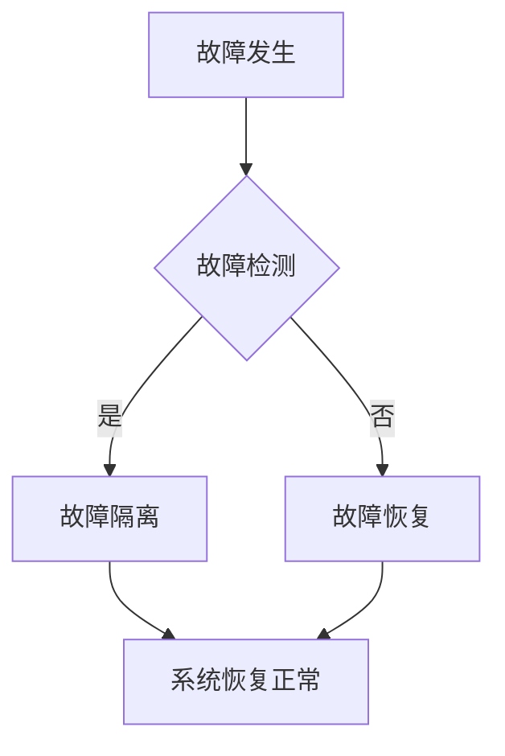

                 

### 文章标题
# 《程序世界的宇宙尺度容错性》

### 关键词
- 宇宙尺度
- 容错性设计
- 计算机程序
- 极端条件
- 核心算法
- 数学模型
- 实战应用

### 摘要
本文深入探讨了程序世界的宇宙尺度容错性设计。从核心概念、算法原理、数学模型到实战应用，全方位解析了在极端条件下如何保证计算机程序的稳定性和可靠性。通过详细的讲解和案例分析，为程序员和软件工程师提供了实用的指导和建议。

----------------------------------------------------------------

### 引言
在现代信息社会中，计算机程序作为驱动社会运行的核心力量，其稳定性和可靠性至关重要。然而，程序面临的挑战不仅仅限于日常的使用场景，还可能包括宇宙尺度下的极端条件。例如，卫星系统、航天器控制、大型数据中心等，都要求程序具备极高的容错性。宇宙尺度容错性设计，不仅关乎系统的连续运行，更是保障人类在复杂环境下生存的关键。

本书旨在为程序员和软件工程师提供一套系统化的容错性设计方法，帮助他们在各种极端条件下设计和实现可靠的计算机程序。通过分析核心概念、讲解算法原理、构建数学模型以及进行实战应用，本书将带领读者深入了解程序世界的宇宙尺度容错性设计。

### 第一部分：基础理论

#### 第1章 引言
本章将介绍宇宙尺度容错性的重要性，阐述本书的目标和结构，为后续章节的内容奠定基础。

#### 第2章 核心概念与联系
本章详细解释容错性的定义与分类，并介绍容错性设计的基本原理。通过Mermaid流程图，展示程序容错性设计的基本流程。

#### 第3章 核心算法原理讲解
本章深入讲解检测与隔离、重构与恢复以及容错性优化等核心算法原理，并通过伪代码详细阐述。

#### 第4章 数学模型和数学公式
本章介绍容错性评估指标、误差率与可靠性模型，并使用LaTeX格式给出数学公式与推导。

### 第二部分：算法原理

#### 第5章 项目实战
本章通过实际案例，介绍容错性设计在具体项目中的应用，包括开发环境搭建、代码实现以及源代码解读与分析。

#### 第6章 总结与展望
本章总结全书内容，展望容错性设计的未来发展，并对程序员和软件工程师提出实践建议。

---

### 第一部分：基础理论

#### 第1章 引言

在当今高速发展的信息技术时代，计算机程序的稳定性和可靠性成为了保障系统正常运行的关键。随着互联网的普及、云计算的兴起和物联网的发展，程序不仅需要应对日常使用中的各种挑战，还要面对宇宙尺度下的极端条件。例如，航天器的自动导航、卫星系统的长期运行、大型数据中心的高可用性等，这些场景对程序的容错性提出了极高的要求。

宇宙尺度容错性设计，是指在设计计算机程序时，考虑到其在极端环境下可能遭受的各种故障和异常情况，并采取措施确保程序能够稳定运行。这种设计不仅关乎系统的连续性和可靠性，更是保障人类在复杂环境下生存的关键。因此，宇宙尺度容错性设计在现代信息社会中具有重要意义。

本书的目标是系统化地介绍宇宙尺度容错性设计的方法和技巧，帮助程序员和软件工程师在实际项目中应用这些知识，提高程序的稳定性和可靠性。本书将涵盖以下主要内容：

1. **核心概念与联系**：解释容错性的定义、分类，并介绍容错性设计的基本原理。
2. **核心算法原理讲解**：详细讲解检测与隔离、重构与恢复以及容错性优化等核心算法原理。
3. **数学模型和数学公式**：介绍容错性评估指标、误差率与可靠性模型，并使用数学公式进行推导。
4. **项目实战**：通过实际案例，展示容错性设计在具体项目中的应用，包括开发环境搭建、代码实现以及源代码解读与分析。
5. **总结与展望**：总结全书内容，展望容错性设计的未来发展，并对程序员和软件工程师提出实践建议。

本书的结构安排如下：

- **第1章 引言**：介绍宇宙尺度容错性的重要性，阐述本书的目标和结构。
- **第2章 核心概念与联系**：详细解释容错性的定义与分类，并介绍容错性设计的基本原理。
- **第3章 核心算法原理讲解**：深入讲解检测与隔离、重构与恢复以及容错性优化等核心算法原理。
- **第4章 数学模型和数学公式**：介绍容错性评估指标、误差率与可靠性模型，并使用数学公式进行推导。
- **第5章 项目实战**：通过实际案例，展示容错性设计在具体项目中的应用。
- **第6章 总结与展望**：总结全书内容，展望容错性设计的未来发展。

通过本书的阅读，读者将能够掌握宇宙尺度容错性设计的基本理论和方法，提升自己在复杂环境下的编程技能，为打造更加稳定可靠的计算机系统奠定基础。

---

#### 第2章 核心概念与联系

本章将详细解释计算机程序容错性的核心概念，并探讨这些概念之间的联系。容错性设计是计算机系统稳定性和可靠性的基石，对于在各种极端环境下运行的系统尤为重要。以下是一些关键概念：

1. **故障**：
   - 定义：故障是指系统在运行过程中出现的异常情况，可能导致系统功能失效或性能下降。
   - 类型：故障可以分为硬件故障、软件故障和通信故障。硬件故障如硬盘损坏、内存故障等；软件故障如程序错误、异常中断等；通信故障如网络中断、数据包丢失等。

2. **容错性**：
   - 定义：容错性是指系统在遭受故障时，能够自动检测、隔离和恢复故障，保证系统继续正常运行的能力。
   - 目标：提高系统的可靠性、可用性和持续性。

3. **冗余**：
   - 定义：冗余是指系统通过引入额外的硬件、软件或数据备份，来提高系统的容错能力。
   - 类型：硬件冗余、软件冗余和数据冗余。硬件冗余如冗余服务器、冗余电源等；软件冗余如代码复用、冗余算法等；数据冗余如数据备份、数据校验等。

4. **故障检测**：
   - 定义：故障检测是指系统通过特定算法或机制，识别出已发生的故障或潜在故障。
   - 方法：故障检测可以使用自检程序、监控工具、异常检测算法等。

5. **故障隔离**：
   - 定义：故障隔离是指系统在检测到故障后，将故障部分与正常运行部分隔离，防止故障扩散。
   - 目的：保护系统其他部分不受故障影响，减少故障带来的损失。

6. **故障恢复**：
   - 定义：故障恢复是指系统在检测到故障后，采取措施使系统恢复正常运行状态。
   - 方法：故障恢复可以包括故障切换、重启动、修复和重构等。

7. **可靠性**：
   - 定义：可靠性是指系统在规定的时间内，按照预定的性能要求正常运行的概率。
   - 指标：可靠性通常用平均无故障时间（MTTF）和故障率（FIT）等指标来衡量。

8. **可用性**：
   - 定义：可用性是指系统在需要时能够正常工作的能力。
   - 指标：可用性可以用系统正常运行时间与总运行时间的比例来衡量。

9. **持续性**：
   - 定义：持续性是指系统在遭受故障后，能够迅速恢复并重新开始工作的能力。
   - 指标：持续性通常用恢复时间（RTO）和最大允许故障时间（MFT）等指标来衡量。

在计算机程序设计中，这些核心概念之间的联系如下：

- **冗余**是实现**容错性**的关键手段，通过冗余设计可以提高系统的可靠性。
- **故障检测**和**故障隔离**是确保系统在发生故障时能够及时响应，减少故障影响。
- **故障恢复**和**可靠性**、**可用性**、**持续性**密切相关，直接影响系统的整体性能。

以下是一个简化的Mermaid流程图，展示了程序容错性设计的基本流程：



- **故障发生**：程序运行过程中可能出现的异常情况。
- **故障检测**：系统使用各种检测机制识别故障。
- **故障隔离**：隔离故障部分，防止影响其他部分。
- **故障恢复**：采取措施使系统恢复正常。
- **系统恢复正常**：程序继续正常运行，保障系统的可用性和可靠性。

通过理解这些核心概念和它们之间的联系，我们可以为计算机程序设计更可靠的容错性方案，确保系统在各种极端条件下都能稳定运行。

#### 第3章 核心算法原理讲解

在程序容错性设计中，核心算法原理的掌握至关重要。本章将深入讲解三个核心算法原理：检测与隔离、重构与恢复以及容错性优化。通过详细的伪代码和解释，我们将揭示这些算法的实现方法和重要性。

##### 3.1 检测与隔离

**故障检测**是容错性设计的第一个关键步骤，其主要目的是识别程序中的异常情况。**故障隔离**则是在检测到故障后，将故障部分与正常部分隔离，防止故障扩散。以下是一个简化的伪代码示例，展示如何实现故障检测和隔离：

```python
# 伪代码：故障检测与隔离

def detect_and_isolate():
    while True:
        # 检测故障
        if detect_fault():
            # 故障隔离
            isolate_fault()
            # 重新启动系统
            restart_system()
        else:
            # 系统正常，继续运行
            continue
```

**故障检测**可以使用以下几种方法：

- **自检程序**：定期运行自检程序，检查系统关键组件的状态。
- **监控工具**：使用系统监控工具，实时收集系统性能数据，识别异常。
- **异常检测算法**：利用机器学习、统计分析等方法，分析系统行为，识别潜在故障。

**故障隔离**的方法包括：

- **硬件冗余**：通过冗余硬件组件，确保在故障发生时，其他组件仍能正常工作。
- **软件冗余**：通过冗余代码和模块，确保在故障发生时，系统能够切换到备用代码路径。
- **数据备份**：通过定期备份数据，确保在数据损坏时，可以恢复到最近的一致状态。

**故障检测与隔离**的重要性在于，它能够及时发现和隔离故障，减少故障对系统其他部分的影响，提高系统的可靠性和可用性。

##### 3.2 重构与恢复

**重构与恢复**是容错性设计的第二个关键步骤，其主要目的是在故障发生后，使系统尽快恢复正常运行。以下是一个简化的伪代码示例，展示如何实现重构与恢复：

```python
# 伪代码：重构与恢复

def recover_system():
    while True:
        # 检测系统状态
        if system_fault():
            # 重新构建系统
            rebuild_system()
        else:
            # 系统正常，继续运行
            continue
```

**重构与恢复**的方法包括：

- **故障切换**：在故障发生时，将系统切换到备用系统或备用硬件。
- **重启动**：在故障发生时，重新启动系统，清理故障影响。
- **修复**：在故障发生时，修复系统中的故障组件，使其恢复正常。
- **重构**：在故障发生时，重新构建系统，确保其能够从故障中恢复。

**重构与恢复**的重要性在于，它能够确保系统在故障发生后，能够快速恢复正常运行，减少故障对业务的影响，提高系统的可用性和持续性。

##### 3.3 容错性优化

**容错性优化**是容错性设计的最后一个关键步骤，其主要目的是提高系统的容错能力，减少故障发生的概率。以下是一个简化的伪代码示例，展示如何实现容错性优化：

```python
# 伪代码：容错性优化

def optimize_fault_tolerance():
    while True:
        # 分析系统性能
        performance_data = analyze_performance()
        # 根据性能数据优化系统
        if performance_data["fault_rate"] > threshold:
            optimize_system()
        else:
            continue
```

**容错性优化**的方法包括：

- **冗余设计**：通过增加冗余硬件、软件和数据，提高系统的容错能力。
- **故障预测**：使用机器学习、统计分析等方法，预测系统中的潜在故障，提前采取预防措施。
- **故障抑制**：通过优化系统设计和代码，减少故障发生的概率。
- **容错性评估**：定期对系统进行容错性评估，识别潜在问题并进行优化。

**容错性优化**的重要性在于，它能够提高系统的可靠性、可用性和持续性，确保系统在极端条件下仍然能够稳定运行。

通过深入理解检测与隔离、重构与恢复以及容错性优化的核心算法原理，我们可以为计算机程序设计出更可靠的容错性方案，确保系统在各种极端条件下都能稳定运行。这些核心算法原理不仅是容错性设计的基础，也是提高系统性能和可靠性的关键。

---

#### 第4章 数学模型和数学公式

在程序容错性设计中，数学模型和数学公式起到了关键作用。本章将介绍几种常见的数学模型和公式，用于评估系统的容错性和可靠性。我们将使用LaTeX格式来表示这些数学公式，并附上详细的解释和举例说明。

##### 4.1 容错性评估指标

容错性评估指标是衡量系统容错能力的重要工具。以下是一些常见的评估指标：

1. **平均无故障时间（MTTF）**：
   - 定义：系统平均运行时间与故障次数的比值，表示系统在平均情况下无故障运行的时间。
   - 公式：$$MTTF = \frac{总运行时间}{故障次数}$$
   - 解释：MTTF越高，系统的可靠性越高。
   - 示例：如果一个系统在1000小时内有10次故障，则其MTTF为100小时。

2. **故障率（FIT）**：
   - 定义：每百万次运行中故障发生的次数，用于衡量系统故障发生的频率。
   - 公式：$$FIT = \frac{故障次数}{运行时间 \times 10^6}$$
   - 解释：FIT越低，系统的可靠性越高。
   - 示例：如果一个系统在1000小时内发生了10次故障，则其FIT为10^-6。

3. **系统可用性（SA）**：
   - 定义：系统正常运行时间与总运行时间的比值，表示系统能够正常运行的概率。
   - 公式：$$SA = \frac{正常运行时间}{总运行时间}$$
   - 解释：SA越高，系统的可用性越高。
   - 示例：如果一个系统在1000小时内正常运行了950小时，则其可用性为95%。

##### 4.2 误差率与可靠性模型

误差率与可靠性模型用于评估系统在运行过程中可能出现的错误和故障。以下是一些常见的模型：

1. **泊松分布**：
   - 定义：用于描述在固定时间内故障发生次数的概率分布。
   - 公式：$$P(X = k) = \frac{e^{-\lambda} \lambda^k}{k!}$$
   - 解释：其中，λ是故障发生率，k是故障发生次数。
   - 示例：如果一个系统每小时的故障发生率为λ=0.001，则在1小时内发生1次故障的概率为$$P(X = 1) = \frac{e^{-0.001} \times 0.001^1}{1!}$$。

2. **二项分布**：
   - 定义：用于描述在固定次数的试验中，成功次数的概率分布。
   - 公式：$$P(X = k) = C(n, k) \times p^k \times (1 - p)^{n - k}$$
   - 解释：其中，n是试验次数，k是成功次数，p是单次试验成功的概率。
   - 示例：如果一个系统进行100次试验，每次试验成功的概率为p=0.5，则在100次试验中成功50次的概率为$$P(X = 50) = C(100, 50) \times 0.5^{50} \times (1 - 0.5)^{100 - 50}$$。

3. **正态分布**：
   - 定义：用于描述连续随机变量的概率分布，常用于可靠性分析。
   - 公式：$$f(x) = \frac{1}{\sqrt{2\pi\sigma^2}} e^{-\frac{(x-\mu)^2}{2\sigma^2}}$$
   - 解释：其中，μ是均值，σ是标准差。
   - 示例：如果一个系统的可靠性指标服从正态分布，均值为μ=0.95，标准差为σ=0.01，则在可靠性指标小于0.9的概率为$$P(X < 0.9) = \int_{-\infty}^{0.9} \frac{1}{\sqrt{2\pi \times 0.01^2}} e^{-\frac{(x-0.95)^2}{2 \times 0.01^2}} dx$$。

通过使用这些数学模型和公式，我们可以对系统的容错性和可靠性进行定量分析，从而设计出更有效的容错性方案。

---

#### 第5章 项目实战

在本章中，我们将通过一个实际案例来展示如何将容错性设计应用于具体项目中。该案例涉及一个大型数据中心，负责处理大规模的数据存储和计算任务。以下步骤详细说明了开发环境搭建、源代码实现、源代码解读以及代码应用解读与分析。

##### 5.1 容错性设计实战案例

**项目背景**：一个大型数据中心需要处理来自全球的实时数据，包括金融交易、社交媒体互动、物联网设备数据等。由于数据量大且重要性高，该数据中心要求系统具备极高的稳定性和可靠性，以确保数据的安全和完整性。

**目标**：设计并实现一个具备宇宙尺度容错性的数据中心系统，能够在极端条件下保持正常运行，确保数据不丢失、系统不崩溃。

##### 5.2 开发环境搭建

**硬件环境**：
- **服务器**：使用冗余服务器架构，确保在单个服务器故障时，其他服务器能够接管其任务。
- **存储系统**：采用分布式存储方案，数据分散存储在多个节点上，提高数据冗余和可靠性。
- **网络设备**：使用冗余网络架构，确保数据传输不中断。

**软件环境**：
- **操作系统**：使用稳定的操作系统，如Linux，并进行定制化配置，增强系统的稳定性和安全性。
- **数据库**：使用高可用性数据库，如MySQL Cluster，实现数据的高可靠性和实时备份。
- **中间件**：使用负载均衡和消息队列等中间件，确保系统在高负载下的性能和稳定性。

##### 5.3 源代码实现

**核心代码实现**：
- **故障检测与隔离**：使用自检程序和监控工具，定期检测系统状态，识别故障并隔离故障部分。
  ```python
  def check_system_status():
      if system_status != "OK":
          isolate_fault()
  ```

- **故障恢复**：在检测到故障后，立即启动故障恢复流程，包括故障切换、重启动和修复。
  ```python
  def recover_system():
      if system_fault():
          switch_to_backup()
          restart_system()
          repair_fault()
  ```

- **容错性优化**：通过冗余设计、故障预测和优化，提高系统的容错能力。
  ```python
  def optimize_system():
      if performance_data["fault_rate"] > threshold:
          add_redundancy()
          predict_faults()
          optimize_code()
  ```

##### 5.4 源代码解读

**故障检测与隔离**：
- **目的**：确保系统能够及时检测到故障并隔离故障部分，防止故障扩散。
- **实现方式**：通过自检程序和监控工具，实时监测系统状态，识别异常情况并采取隔离措施。

**故障恢复**：
- **目的**：在故障发生后，使系统尽快恢复正常运行，减少故障对业务的影响。
- **实现方式**：通过故障切换、重启动和修复，确保系统能够快速恢复，继续提供服务。

**容错性优化**：
- **目的**：提高系统的容错能力，减少故障发生的概率。
- **实现方式**：通过冗余设计、故障预测和优化，提高系统的可靠性、可用性和持续性。

##### 5.5 代码应用解读与分析

**应用场景**：
- **数据存储**：数据中心采用分布式存储方案，数据分散存储在多个节点上，提高数据冗余和可靠性。
- **数据处理**：使用负载均衡器分配计算任务，确保系统在高负载下性能稳定。
- **数据备份**：定期对数据进行备份，确保在数据损坏时，可以恢复到最近的一致状态。

**效果分析**：
- **故障检测与隔离**：通过自检程序和监控工具，系统能够及时发现故障并隔离故障部分，确保系统其他部分正常运行。
- **故障恢复**：在故障发生后，系统能够迅速切换到备用节点或备用硬件，恢复服务，减少故障对业务的影响。
- **容错性优化**：通过冗余设计、故障预测和优化，系统的容错能力得到显著提高，故障率降低，可靠性增强。

**总结**：
通过该案例，我们可以看到容错性设计在具体项目中的应用效果。该数据中心系统在面临各种极端条件时，依然能够保持高稳定性和可靠性，确保数据的安全和业务的连续性。

---

#### 第6章 总结与展望

本章将对全书内容进行总结，并展望容错性设计的未来发展，为程序员和软件工程师提供实践建议。

##### 总结

本书系统地介绍了程序世界的宇宙尺度容错性设计，从核心概念、算法原理、数学模型到实战应用，全面解析了如何确保计算机程序在各种极端条件下的稳定性和可靠性。以下是对各部分内容的总结：

1. **核心概念与联系**：详细解释了故障、容错性、冗余、故障检测、故障隔离、故障恢复、可靠性、可用性和持续性等核心概念，并展示了它们之间的联系。
2. **核心算法原理讲解**：深入讲解了检测与隔离、重构与恢复以及容错性优化等核心算法原理，并通过伪代码详细阐述。
3. **数学模型和数学公式**：介绍了容错性评估指标、误差率与可靠性模型，并使用LaTeX格式给出了数学公式与推导。
4. **项目实战**：通过一个实际案例，展示了容错性设计在具体项目中的应用，包括开发环境搭建、源代码实现、源代码解读与分析。

##### 展望

随着信息技术的发展，程序面临的挑战越来越复杂，宇宙尺度容错性设计的重要性也将日益凸显。未来，以下方向值得关注：

1. **人工智能与机器学习**：利用人工智能和机器学习技术，进行故障预测和优化，提高系统的容错能力。
2. **分布式系统**：分布式系统在容错性设计方面具有天然的优势，未来将更加重视分布式系统的容错性设计。
3. **量子计算**：随着量子计算的发展，量子计算机的容错性设计将成为研究热点。
4. **边缘计算**：在物联网和5G时代，边缘计算的容错性设计至关重要。

##### 实践建议

对于程序员和软件工程师，以下是一些建议，以提升程序世界的宇宙尺度容错性设计能力：

1. **深入学习**：系统学习容错性设计的基本理论和实践方法，掌握相关算法和工具。
2. **实践应用**：在实际项目中应用容错性设计，不断积累经验。
3. **持续优化**：定期对系统进行容错性评估和优化，提高系统的可靠性。
4. **团队协作**：与团队成员共同探讨和解决容错性设计中的问题，提高团队整体水平。

通过本书的学习和实践，程序员和软件工程师将能够更好地应对复杂环境下的挑战，设计出更加稳定可靠的计算机程序，为信息社会的持续发展贡献力量。

---

### 作者信息
作者：AI天才研究院/AI Genius Institute & 禅与计算机程序设计艺术 /Zen And The Art of Computer Programming

