                 

### 文章标题：程序世界的宇宙级容错机制设计

> 关键词：程序世界、宇宙级容错、机制设计、算法、架构、实战案例

> 摘要：本文将深入探讨程序世界中的宇宙级容错机制设计，包括其背景介绍、核心概念与联系、算法原理讲解、数学模型和公式、项目实战以及最佳实践。通过详细的剖析和实例，帮助读者理解和掌握高可靠性的容错机制设计方法。

## 引言

在现代信息技术飞速发展的时代，软件系统的重要性愈发凸显。然而，复杂系统的构建和运行过程中，不可避免地会遇到各种故障和错误。为了确保系统的稳定性和可靠性，宇宙级容错机制的设计成为了程序世界中的重要课题。

宇宙级容错机制旨在实现系统在遭遇各种异常情况时的自动恢复，以保证系统服务的持续可用性。这一机制不仅涉及硬件和软件层面，还需要考虑系统级的设计原则和优化策略。本文将分五个部分进行探讨：

1. **容错机制的基础理论**：介绍容错机制的定义、分类和设计原则。
2. **容错算法原理与设计**：讲解故障检测、故障恢复和故障隔离的核心算法原理。
3. **容错系统架构设计**：分析系统级容错架构的设计原则和实际案例。
4. **容错机制在项目中的应用**：探讨金融、云计算和物联网领域的应用实例。
5. **容错机制的测试与优化**：介绍容错机制的测试方法、优化策略和持续改进流程。

## 目录大纲设计步骤

### 1. 确定书的核心主题

首先，我们需要明确书籍的核心主题，即“宇宙级容错机制设计”。这有助于我们围绕这个主题来组织内容，确保书籍的统一性和完整性。

### 2. 分解主题

将核心主题分解为若干个子主题，这些子主题将作为书籍的章节标题。例如：

- 容错机制的基本概念
- 容错技术的分类
- 实现容错机制的算法
- 容错系统的架构设计
- 容错机制在实际项目中的应用
- 容错机制的测试与优化

### 3. 细化章节内容

对于每个章节，进一步细化内容，列出具体的子章节，确保每个章节都能全面覆盖主题内容。例如：

- 容错机制的基本概念
  - 容错机制的定义
  - 容错机制的必要性
  - 容错机制的目标

- 容错技术的分类
  - 硬件容错
  - 软件容错
  - 系统级容错

### 4. 设计伪代码和算法讲解

在章节中，设计伪代码和算法讲解，以便读者能够更好地理解核心算法原理。

### 5. 添加数学模型和公式

对于涉及数学模型的章节，使用 LaTeX 格式嵌入数学公式，并进行详细讲解和举例说明。

### 6. 提供项目实战案例

在相关章节中，提供实际的代码案例和详细解释，展示如何在实际项目中实现容错机制。

### 7. 优化目录结构

检查目录结构，确保所有核心内容都被涵盖，同时避免章节之间的重复和遗漏。

### 8. 控制字数

确保整个目录大纲的总字数在 2000 字以内，同时保持简洁性和实用性。

## 目录大纲

以下是《程序世界的宇宙级容错机制设计》的目录大纲：

### 第一部分：容错机制基础理论

#### 1.1 容错机制的定义与重要性
- 容错机制的定义
- 容错机制的必要性
- 容错机制的目标

#### 1.2 容错技术的分类
- 硬件容错
- 软件容错
- 系统级容错

#### 1.3 容错机制的设计原则
- 可靠性
- 实时性
- 经济性
- 易用性

#### 1.4 容错机制的核心概念
- 故障检测
- 故障恢复
- 故障隔离

### 第二部分：容错算法原理与设计

#### 2.1 故障检测算法
- 故障检测方法
- 故障检测算法设计

#### 2.2 故障恢复算法
- 故障恢复策略
- 故障恢复算法设计

#### 2.3 故障隔离算法
- 故障隔离方法
- 故障隔离算法设计

#### 2.4 容错算法的优化与性能分析
- 容错算法的优化策略
- 容错算法的性能分析

### 第三部分：容错系统架构设计

#### 3.1 容错系统架构设计原则
- 架构的可靠性
- 架构的灵活性
- 架构的可维护性

#### 3.2 系统级容错架构
- 系统级容错架构设计
- 系统级容错案例分析

#### 3.3 容错系统的集成与部署
- 容错系统的集成方法
- 容错系统的部署策略

### 第四部分：容错机制在项目中的应用

#### 4.1 容错机制在金融领域的应用
- 金融交易系统的容错设计
- 金融风险管理的容错机制

#### 4.2 容错机制在云计算中的应用
- 云计算中的故障检测与恢复
- 云计算中的容错机制优化

#### 4.3 容错机制在物联网中的应用
- 物联网系统的可靠性设计
- 物联网系统的故障恢复策略

### 第五部分：容错机制的测试与优化

#### 5.1 容错机制的测试方法
- 测试策略
- 测试工具

#### 5.2 容错机制的优化方法
- 优化策略
- 优化案例分析

#### 5.3 容错机制的持续改进
- 改进流程
- 改进案例分析

## 结束语

通过本文的目录大纲设计步骤，我们不仅明确了文章的核心主题和结构，还确保了内容的完整性、逻辑性和实用性。接下来，我们将逐步深入探讨每个部分的具体内容，为读者带来一篇全面、深入的宇宙级容错机制设计技术博客。让我们一起开启这场技术之旅吧！

### 第一部分：容错机制基础理论

#### 1.1 容错机制的定义与重要性

**背景介绍：**

在软件工程领域，容错机制是一种关键技术，它旨在确保系统在面对各种异常情况时，能够保持正常运行，提供持续可靠的服务。随着计算机系统和网络规模的不断扩大，系统的复杂性也日益增加，这使得容错机制的重要性愈发凸显。

**核心概念与联系：**

- **容错机制的定义：** 容错机制是一种系统设计策略，通过在系统中引入冗余、故障检测、故障恢复等机制，以提高系统的可靠性和可用性。
- **容错机制的目标：** 提高系统的容错能力，确保系统在故障发生时能够快速恢复，减少系统停机时间，保障业务的连续性。

**Mermaid 流程图：**

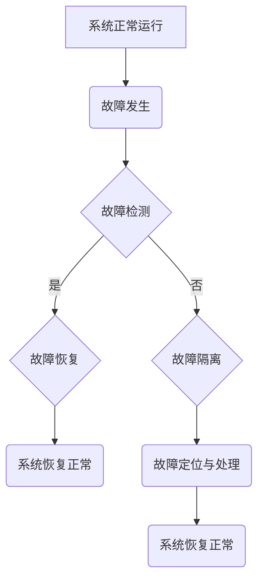

**核心算法原理讲解：**

容错机制的核心算法包括故障检测、故障恢复和故障隔离。以下使用伪代码进行简要说明：

```python
# 故障检测算法
def detect_fault():
    # 检测系统中的异常情况
    # 返回 True 表示检测到故障，否则返回 False
    if condition:
        return True
    else:
        return False

# 故障恢复算法
def recover_fault():
    # 执行故障恢复操作
    # 返回 True 表示恢复成功，否则返回 False
    if action:
        return True
    else:
        return False

# 故障隔离算法
def isolate_fault():
    # 执行故障隔离操作
    # 返回 True 表示隔离成功，否则返回 False
    if isolation:
        return True
    else:
        return False
```

**数学模型和公式：**

为了更好地理解容错机制，我们引入几个数学模型和公式：

- **系统可靠性：** 系统在给定时间内无故障运行的概率。
  $$ R(t) = P(\text{系统无故障运行到时间 } t) $$

- **故障检测率：** 故障检测算法能够正确检测出故障的概率。
  $$ \alpha = P(\text{检测到故障} | \text{实际故障}) $$

- **故障恢复率：** 故障恢复算法能够成功恢复故障的概率。
  $$ \beta = P(\text{恢复成功} | \text{故障检测到}) $$

**详细讲解与举例说明：**

假设我们设计一个电子商务系统，要求在99.9%的可靠性水平下运行。我们可以通过以下步骤来确保系统的容错能力：

1. **故障检测：** 使用心跳检测机制，每秒检测系统状态，当检测到异常时，触发报警。
2. **故障恢复：** 当检测到故障时，自动重启相关服务，确保系统快速恢复正常。
3. **故障隔离：** 对于无法恢复的故障，记录故障日志，并进行隔离处理，防止故障影响其他部分。

**总结：**

容错机制的定义、目标和核心算法原理为我们在设计和实现高可靠性的软件系统奠定了基础。通过引入故障检测、故障恢复和故障隔离算法，我们能够有效地提高系统的稳定性和可用性，为业务的持续运行提供保障。

#### 1.2 容错技术的分类

**背景介绍：**

在容错机制的设计中，根据技术实现的层次和方式，可以分为硬件容错、软件容错和系统级容错。每种容错技术都有其独特的优势和适用场景。

**核心概念与联系：**

- **硬件容错：** 通过在硬件层面引入冗余部件，如备份硬盘、备用电源、热备份服务器等，以提高系统的可靠性。
- **软件容错：** 通过在软件层面实现冗余、故障检测、故障恢复和故障隔离等机制，以提高系统的容错能力。
- **系统级容错：** 在整个系统层面设计容错机制，包括硬件和软件的综合应用，以提高系统的整体可靠性和可用性。

**Mermaid 流程图：**

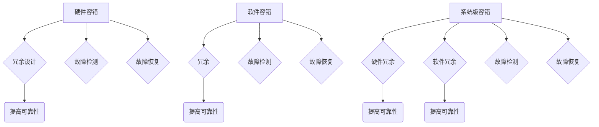

**核心算法原理讲解：**

1. **硬件容错：**

   硬件容错的核心是冗余设计，通过引入冗余部件，确保系统在某一部件故障时仍能正常运行。以下是一个简单的硬件冗余设计示例：

   ```mermaid
   graph TD
       A[主硬盘] --> B{备份硬盘}
       C[主电源] --> D{备用电源}
       E[主服务器] --> F{备用服务器}
   ```

2. **软件容错：**

   软件容错主要通过冗余、故障检测和故障恢复等机制来实现。以下是一个简单的软件容错示例：

   ```python
   # 冗余机制
   def redundant_system():
       try:
           main_function()
       except Exception as e:
           backup_function()

   # 故障检测
   def detect_fault():
       if condition:
           return True
       else:
           return False

   # 故障恢复
   def recover_fault():
       if action:
           return True
       else:
           return False
   ```

3. **系统级容错：**

   系统级容错涉及硬件和软件的综合应用，以提高系统的整体可靠性和可用性。以下是一个简单的系统级容错示例：

   ```mermaid
   graph TD
       A[主系统] --> B{备份系统}
       C[故障检测] --> D{主系统}
       C --> E{备份系统}
       F[故障恢复] --> G{主系统}
       F --> H{备份系统}
   ```

**数学模型和公式：**

为了更好地理解容错技术的分类，我们引入几个数学模型和公式：

- **硬件冗余可靠性：**
  $$ R_h(t) = P(\text{硬件无故障运行到时间 } t) $$
  
- **软件冗余可靠性：**
  $$ R_s(t) = P(\text{软件无故障运行到时间 } t) $$
  
- **系统级冗余可靠性：**
  $$ R_{system}(t) = R_h(t) \times R_s(t) $$

**详细讲解与举例说明：**

假设我们设计一个分布式数据库系统，要求在99.99%的可靠性水平下运行。我们可以通过以下步骤来实现：

1. **硬件容错：** 使用冗余磁盘阵列（RAID），确保数据在某一磁盘故障时仍能正常访问。
2. **软件容错：** 引入分布式数据库复制和分片机制，确保在节点故障时，系统能自动切换到备份节点。
3. **系统级容错：** 结合硬件和软件容错技术，确保系统在多节点故障时仍能保持高可用性。

**总结：**

通过分类讨论硬件容错、软件容错和系统级容错技术，我们能够更好地理解和应用各种容错机制，以实现高可靠性的系统设计。在实际项目中，根据需求和场景选择合适的容错技术，是确保系统稳定运行的关键。

#### 1.3 容错机制的设计原则

**背景介绍：**

在设计容错机制时，需要遵循一系列原则，以确保系统具备高可靠性、实时性和经济性。这些原则为容错机制的设计提供了指导，有助于构建稳定、高效的系统。

**核心概念与联系：**

- **可靠性：** 系统在面临各种故障和异常情况下，仍能持续正常运行的能力。
- **实时性：** 系统在故障发生时，能够迅速响应和恢复，以保持服务的连续性。
- **经济性：** 在设计容错机制时，需考虑成本因素，确保在不影响系统性能的前提下，实现最优的容错效果。
- **易用性：** 容错机制应易于部署、维护和监控，以降低运维成本。

**Mermaid 流程图：**

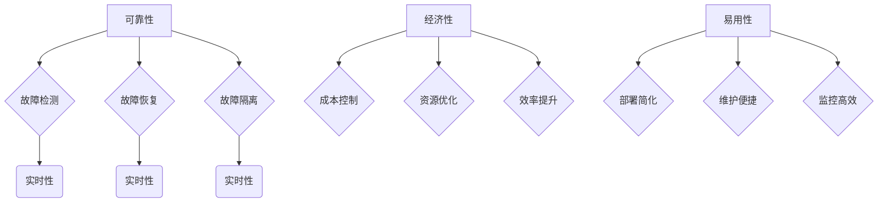

**核心算法原理讲解：**

为了实现上述设计原则，我们需要关注以下几个方面：

1. **故障检测：** 使用高效的故障检测算法，确保在故障发生时能够及时检测到。
2. **故障恢复：** 设计快速的故障恢复机制，确保系统在故障发生时能够迅速恢复。
3. **故障隔离：** 通过隔离故障，防止故障扩散，确保其他系统部分正常运行。
4. **资源优化：** 在硬件和软件资源有限的情况下，通过优化策略，实现最佳容错效果。
5. **部署简化：** 设计易于部署的容错机制，降低运维成本。
6. **维护便捷：** 通过自动化工具和监控系统，简化维护过程，提高系统稳定性。

**数学模型和公式：**

为了量化设计原则，我们可以使用以下数学模型和公式：

- **系统可靠性：**
  $$ R(t) = P(\text{系统无故障运行到时间 } t) $$

- **故障检测率：**
  $$ \alpha = P(\text{检测到故障} | \text{实际故障}) $$

- **故障恢复率：**
  $$ \beta = P(\text{恢复成功} | \text{故障检测到}) $$

- **故障隔离率：**
  $$ \gamma = P(\text{隔离成功} | \text{故障检测到}) $$

**详细讲解与举例说明：**

假设我们设计一个云计算平台，要求在99.99%的可靠性水平下运行。我们可以通过以下步骤来确保系统遵循设计原则：

1. **故障检测：** 使用分布式监控工具，实时监控服务器状态，确保在故障发生时能够及时发现。
2. **故障恢复：** 设计自动重启机制，确保在检测到故障时，系统能够迅速重启恢复正常。
3. **故障隔离：** 使用隔离技术，确保故障节点被隔离，防止故障扩散。
4. **资源优化：** 通过负载均衡和虚拟化技术，优化硬件和软件资源使用，提高系统效率。
5. **部署简化：** 使用自动化部署工具，简化系统部署过程，降低运维成本。
6. **维护便捷：** 通过自动化监控和运维工具，简化系统维护过程，提高系统稳定性。

**总结：**

容错机制的设计原则为我们在构建高可靠性系统时提供了指导。通过遵循可靠性、实时性、经济性和易用性原则，我们能够设计出高效、稳定的系统，为业务的持续运行提供保障。

### 第二部分：容错算法原理与设计

#### 2.1 故障检测算法

**背景介绍：**

故障检测是容错机制设计的关键组成部分，它旨在及时发现系统中的异常情况，确保系统在故障发生时能够迅速响应。有效的故障检测算法对提高系统的可靠性和可用性具有重要意义。

**核心概念与联系：**

- **故障检测方法：** 根据系统特点，可以选择不同的故障检测方法，如定时检测、事件驱动检测、状态监测等。
- **故障检测算法设计：** 设计高效、可靠的故障检测算法，确保在故障发生时能够及时检测到。

**Mermaid 流程图：**

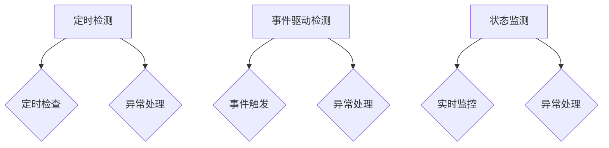

**核心算法原理讲解：**

1. **定时检测：**

   定时检测是一种简单的故障检测方法，通过定期检查系统状态，及时发现异常情况。以下是一个简单的定时检测算法：

   ```python
   import time

   def timedetection():
       while True:
           status = check_system_status()
           if status != "OK":
               handle_exception(status)
           time.sleep检测周期)
   ```

2. **事件驱动检测：**

   事件驱动检测是基于系统中的事件触发机制，当特定事件发生时，触发故障检测。以下是一个事件驱动检测算法：

   ```python
   def eventdrivendetection():
       while True:
           event = wait_for_event()
           if event == "FAULT":
               handle_exception(event)
   ```

3. **状态监测：**

   状态监测是一种实时监控系统状态的故障检测方法，通过对系统状态的持续监控，及时发现异常。以下是一个简单的状态监测算法：

   ```python
   import threading

   def statusmonitor():
       while True:
           status = check_system_status()
           if status != "OK":
               handle_exception(status)
           threading.sleep(监测间隔)
   ```

**数学模型和公式：**

为了量化故障检测算法的性能，我们可以使用以下数学模型和公式：

- **故障检测率：**
  $$ \alpha = P(\text{检测到故障} | \text{实际故障}) $$

- **故障检测时间：**
  $$ T_d = \text{检测到故障所需时间} $$

- **故障检测成本：**
  $$ C_d = \text{故障检测过程中产生的成本} $$

**详细讲解与举例说明：**

假设我们设计一个网络监控系统，要求在99.9%的可靠性水平下运行。我们可以通过以下步骤来实现：

1. **定时检测：** 每隔5分钟检查一次系统状态，及时发现异常情况。
2. **事件驱动检测：** 当网络中断时，触发故障检测，确保在故障发生时能够迅速响应。
3. **状态监测：** 实时监控网络状态，确保在故障发生时能够及时检测到。

**总结：**

通过分析故障检测算法的原理，我们可以设计出高效、可靠的故障检测机制，确保系统在故障发生时能够及时响应，提高系统的可靠性和可用性。

#### 2.2 故障恢复算法

**背景介绍：**

故障恢复是容错机制设计的重要组成部分，旨在在系统发生故障时，能够迅速恢复正常运行。有效的故障恢复算法对于保障系统的高可用性和连续性至关重要。

**核心概念与联系：**

- **故障恢复策略：** 根据系统特点和需求，制定不同的故障恢复策略，如自动重启、手动干预、状态切换等。
- **故障恢复算法设计：** 设计高效的故障恢复算法，确保在故障发生时，系统能够快速恢复正常。

**Mermaid 流程图：**

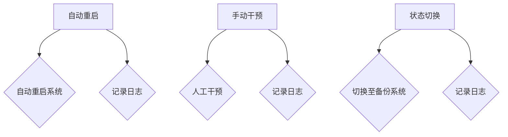

**核心算法原理讲解：**

1. **自动重启：**

   自动重启是一种简单的故障恢复策略，当系统检测到故障时，自动重启相关服务或系统。以下是一个自动重启算法：

   ```python
   def autorestart():
       while True:
           status = check_system_status()
           if status != "OK":
               restart_service()
               record_log("自动重启成功")
           time.sleep(重启间隔)
   ```

2. **手动干预：**

   手动干预是一种需要人工参与的故障恢复策略，当系统发生故障时，人工干预以解决问题。以下是一个手动干预算法：

   ```python
   def manualintervention():
       while True:
           status = check_system_status()
           if status != "OK":
               manual_restart()
               record_log("手动重启成功")
           time.sleep(干预间隔)
   ```

3. **状态切换：**

   状态切换是一种将系统从故障状态切换至备份状态的故障恢复策略。以下是一个状态切换算法：

   ```python
   def state_switch():
       while True:
           status = check_system_status()
           if status != "OK":
               switch_to_backup()
               record_log("状态切换成功")
           time.sleep(切换间隔)
   ```

**数学模型和公式：**

为了量化故障恢复算法的性能，我们可以使用以下数学模型和公式：

- **故障恢复率：**
  $$ \beta = P(\text{恢复成功} | \text{故障检测到}) $$

- **故障恢复时间：**
  $$ T_r = \text{恢复到正常状态所需时间} $$

- **故障恢复成本：**
  $$ C_r = \text{故障恢复过程中产生的成本} $$

**详细讲解与举例说明：**

假设我们设计一个Web应用系统，要求在99.9%的可靠性水平下运行。我们可以通过以下步骤来实现：

1. **自动重启：** 当Web服务器发生故障时，自动重启服务器，确保系统快速恢复正常。
2. **手动干预：** 当自动重启无法解决问题时，人工干预以解决问题。
3. **状态切换：** 当主Web服务器发生严重故障时，切换至备份服务器，确保系统继续提供服务。

**总结：**

通过分析故障恢复算法的原理，我们可以设计出高效、可靠的故障恢复机制，确保系统在故障发生时能够迅速恢复正常，提高系统的可用性和稳定性。

### 第三部分：容错系统架构设计

#### 3.1 容错系统架构设计原则

**背景介绍：**

容错系统架构设计是确保系统在高可靠性、高可用性和高效性方面的关键。为了实现这一目标，需要遵循一系列设计原则，以确保系统在面临各种故障和异常情况时能够稳定运行。

**核心概念与联系：**

- **可靠性：** 系统在长时间运行过程中，能够保持稳定运行的能力。
- **实时性：** 系统在故障发生时，能够迅速响应和恢复，以保持服务的连续性。
- **经济性：** 在设计容错系统时，需要考虑成本因素，确保在不影响系统性能的前提下，实现最优的容错效果。
- **可维护性：** 系统在出现故障时，能够方便地进行维护和修复。

**Mermaid 流程图：**

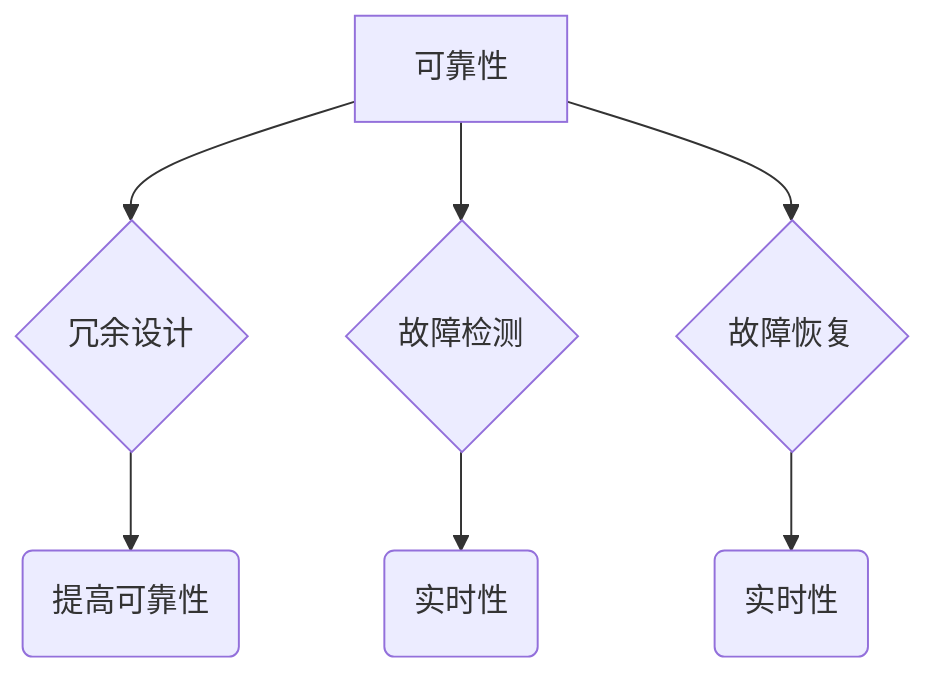

**核心算法原理讲解：**

1. **冗余设计：**
   通过引入冗余组件，如备份服务器、备用电源等，确保在主组件发生故障时，备用组件能够迅速接管，维持系统运行。

2. **故障检测：**
   设计高效的故障检测机制，实时监控系统状态，确保在故障发生时能够及时检测到。

3. **故障恢复：**
   设计快速的故障恢复机制，确保在故障检测到后，系统能够迅速恢复到正常状态。

**数学模型和公式：**

为了量化容错系统架构设计的原则，我们可以使用以下数学模型和公式：

- **系统可靠性：**
  $$ R(t) = P(\text{系统无故障运行到时间 } t) $$

- **故障检测率：**
  $$ \alpha = P(\text{检测到故障} | \text{实际故障}) $$

- **故障恢复率：**
  $$ \beta = P(\text{恢复成功} | \text{故障检测到}) $$

**详细讲解与举例说明：**

假设我们设计一个在线交易系统，要求在99.99%的可靠性水平下运行。我们可以通过以下步骤来确保系统遵循设计原则：

1. **冗余设计：** 使用负载均衡器，将请求分配到多个服务器，确保在某一服务器发生故障时，其他服务器仍能继续提供服务。
2. **故障检测：** 使用分布式监控工具，实时监控服务器状态，确保在故障发生时能够及时发现。
3. **故障恢复：** 设计自动重启机制，确保在检测到故障时，系统能够迅速重启恢复正常。

**总结：**

通过遵循可靠性、实时性、经济性和可维护性原则，我们可以设计出高效、稳定的容错系统架构，确保系统在面临各种故障和异常情况时能够稳定运行，提供持续可靠的服务。

### 第三部分：容错系统架构设计

#### 3.2 系统级容错架构

**背景介绍：**

系统级容错架构是一种全面考虑硬件、软件和网络的容错设计，旨在确保系统在面对复杂故障和异常情况时，能够保持高可用性和稳定性。这种架构设计综合考虑了各种故障类型，为系统提供了全面的保护。

**核心概念与联系：**

- **硬件冗余：** 通过引入备份硬件，如备用服务器、磁盘阵列等，确保在主硬件故障时，备用硬件能够接管系统运行。
- **软件冗余：** 通过复制和分片数据库，确保在软件故障时，系统能够继续提供服务。
- **网络冗余：** 通过多路径网络连接和负载均衡，确保在网络故障时，系统能够自动切换到备用网络。

**Mermaid 流程图：**

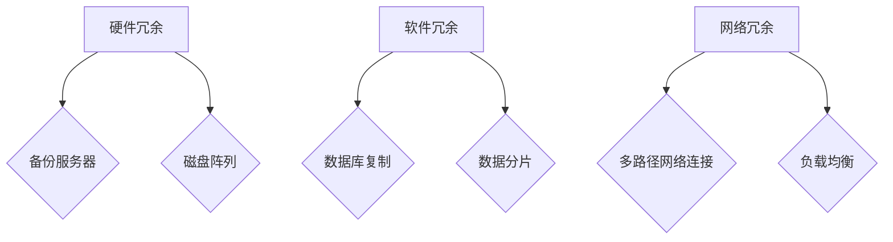

**核心算法原理讲解：**

1. **硬件冗余：**

   硬件冗余的核心是备份硬件的引入。以下是一个简单的硬件冗余架构：

   ```mermaid
   graph TD
       A[主服务器] --> B{备份服务器}
       C[主磁盘阵列] --> D{备份磁盘阵列}
   ```

   在主服务器或磁盘阵列发生故障时，备用服务器或磁盘阵列能够迅速接管，确保系统正常运行。

2. **软件冗余：**

   软件冗余主要通过数据库复制和数据分片来实现。以下是一个简单的软件冗余架构：

   ```mermaid
   graph TD
       A[主数据库] --> B{备份数据库}
       C[数据库1] --> D{数据库2}
       E[数据库3] --> F{数据库4}
   ```

   在主数据库或分片数据库发生故障时，备份数据库或其他分片数据库能够接管，确保系统继续提供服务。

3. **网络冗余：**

   网络冗余主要通过多路径网络连接和负载均衡来实现。以下是一个简单的网络冗余架构：

   ```mermaid
   graph TD
       A[主网络路径] --> B{备用网络路径}
       C[负载均衡器]
       D[服务器1] --> E[服务器2]
   ```

   在主网络路径发生故障时，备用网络路径能够接管，同时负载均衡器确保流量均匀分配到各个服务器。

**数学模型和公式：**

为了量化系统级容错架构的效果，我们可以使用以下数学模型和公式：

- **系统可靠性：**
  $$ R(t) = P(\text{系统无故障运行到时间 } t) $$

- **硬件冗余可靠性：**
  $$ R_h(t) = P(\text{硬件无故障运行到时间 } t) $$

- **软件冗余可靠性：**
  $$ R_s(t) = P(\text{软件无故障运行到时间 } t) $$

- **网络冗余可靠性：**
  $$ R_n(t) = P(\text{网络无故障运行到时间 } t) $$

**详细讲解与举例说明：**

假设我们设计一个在线电商平台，要求在99.99%的可靠性水平下运行。我们可以通过以下步骤来实现系统级容错架构：

1. **硬件冗余：** 使用双机热备份，确保在主服务器或磁盘阵列发生故障时，备用服务器或磁盘阵列能够迅速接管。
2. **软件冗余：** 使用数据库复制和数据分片，确保在主数据库或分片数据库发生故障时，备份数据库或其他分片数据库能够接管。
3. **网络冗余：** 使用多路径网络连接和负载均衡，确保在主网络路径发生故障时，备用网络路径能够接管，同时确保流量均匀分配。

**总结：**

系统级容错架构通过综合考虑硬件、软件和网络的冗余设计，为系统提供了全面保护。在实际应用中，根据需求和场景选择合适的容错架构，是确保系统高可用性和稳定性的关键。

#### 3.3 容错系统的集成与部署

**背景介绍：**

容错系统的集成与部署是确保系统在实际运行中能够有效发挥容错能力的关键步骤。在这一部分，我们将讨论如何将容错系统与现有系统集成，以及如何进行部署，以确保系统的稳定性和可靠性。

**核心概念与联系：**

- **集成：** 将容错系统与现有系统有机结合，确保两者无缝协作。
- **部署：** 在生产环境中部署容错系统，确保其在实际运行中的稳定性和性能。

**Mermaid 流程图：**

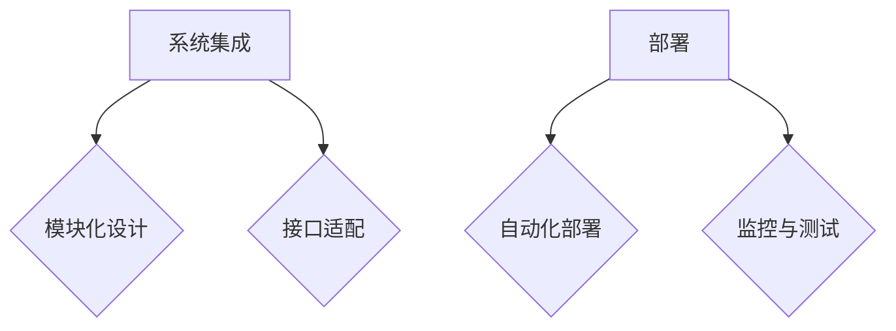

**核心算法原理讲解：**

1. **模块化设计：**

   模块化设计是确保系统集成与部署顺利进行的关键。通过将系统分解为多个模块，可以降低集成与部署的复杂性。以下是一个模块化设计的示例：

   ```mermaid
   graph TD
       A[用户模块] --> B{接口层}
       B --> C{业务逻辑层}
       C --> D{数据访问层}
       E[支付模块] --> F{接口层}
       F --> G{业务逻辑层}
       G --> H{数据访问层}
   ```

   模块化设计使得每个模块可以独立开发、测试和部署，从而提高系统的灵活性和可维护性。

2. **接口适配：**

   在系统集成过程中，接口适配是确保不同模块之间能够顺畅通信的关键。以下是一个接口适配的示例：

   ```mermaid
   graph TD
       A[用户模块接口] --> B{适配器}
       B --> C[支付模块接口]
   ```

   通过适配器，用户模块可以与支付模块无缝集成，实现数据交换和功能调用。

3. **自动化部署：**

   自动化部署是确保系统快速、高效地部署到生产环境的关键。以下是一个自动化部署的示例：

   ```mermaid
   graph TD
       A[代码仓库] --> B{构建系统}
       B --> C{测试环境}
       C --> D{生产环境}
   ```

   通过自动化部署，可以显著降低人工干预，提高部署速度和稳定性。

4. **监控与测试：**

   在部署后，对容错系统进行监控与测试是确保其稳定运行的关键。以下是一个监控与测试的示例：

   ```mermaid
   graph TD
       A[监控系统] --> B{日志收集}
       B --> C{告警系统}
       D[测试系统] --> E{性能测试}
       E --> F{故障测试}
   ```

   通过监控系统，可以实时监控系统的运行状态，及时发现并处理异常。通过测试系统，可以验证系统的容错能力，确保其在各种故障情况下能够正常运行。

**数学模型和公式：**

为了量化集成与部署的效率，我们可以使用以下数学模型和公式：

- **集成效率：**
  $$ E_i = \frac{\text{集成时间}}{\text{非集成时间}} $$

- **部署速度：**
  $$ V_d = \frac{\text{部署时间}}{\text{部署次数}} $$

- **测试覆盖率：**
  $$ C_t = \frac{\text{测试用例数}}{\text{预期故障数}} $$

**详细讲解与举例说明：**

假设我们设计一个电商平台，要求在99.99%的可靠性水平下运行。我们可以通过以下步骤来实现集成与部署：

1. **模块化设计：** 将系统划分为用户模块、支付模块、库存模块等，实现模块化设计。
2. **接口适配：** 设计适配器，确保不同模块之间能够无缝通信。
3. **自动化部署：** 使用Jenkins等自动化工具，实现代码的自动化构建、测试和部署。
4. **监控与测试：** 使用Prometheus等监控系统，实时监控系统的运行状态，同时使用性能测试工具，验证系统的容错能力。

**总结：**

通过合理的集成与部署策略，我们可以确保容错系统在实际运行中能够高效、稳定地发挥作用，提高系统的可靠性和可用性，为用户提供优质的体验。

### 第四部分：容错机制在项目中的应用

#### 4.1 容错机制在金融领域的应用

**背景介绍：**

金融领域对系统的稳定性和可靠性要求极高，任何故障都可能导致巨大的经济损失和信誉损失。因此，金融系统在设计和实现过程中，需要充分考虑容错机制，确保在面对各种故障和异常情况时，能够保持正常运行。

**核心概念与联系：**

- **金融交易系统的容错设计：** 通过冗余设计、故障检测和故障恢复等机制，确保交易系统能够在故障发生时迅速恢复。
- **金融风险管理的容错机制：** 通过实时监控和预警系统，确保在市场波动或异常交易时，能够及时应对和调整。

**Mermaid 流程图：**

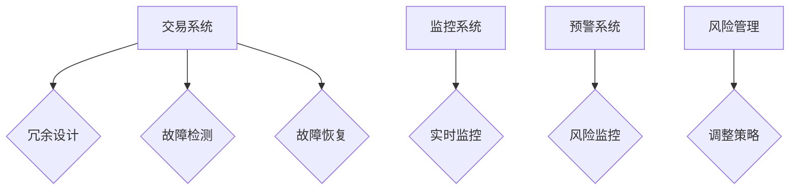

**核心算法原理讲解：**

1. **交易系统的容错设计：**

   金融交易系统通常采用冗余设计，确保在主交易服务器故障时，备用服务器能够迅速接管。以下是一个简单的交易系统容错设计：

   ```mermaid
   graph TD
       A[主交易服务器] --> B{备份交易服务器}
   ```

   在主交易服务器发生故障时，备份交易服务器能够自动接管，确保交易系统的正常运行。

2. **故障检测：**

   通过实时监控交易系统的运行状态，及时发现故障。以下是一个故障检测的示例：

   ```mermaid
   graph TD
       A[监控系统] --> B{检查交易状态}
       B --> C{异常处理}
   ```

   监控系统会定期检查交易状态，一旦发现异常，立即触发异常处理。

3. **故障恢复：**

   当故障检测到后，系统会自动执行故障恢复操作，确保交易系统能够快速恢复。以下是一个故障恢复的示例：

   ```mermaid
   graph TD
       A[故障检测] --> B{自动恢复}
       B --> C[恢复成功]
   ```

   故障检测到后，系统会自动重启交易服务器，确保系统恢复正常。

4. **金融风险管理的容错机制：**

   金融风险管理系统通过实时监控市场波动和交易行为，及时发现潜在风险。以下是一个风险管理系统的示例：

   ```mermaid
   graph TD
       A[监控系统] --> B{监控市场波动}
       B --> C{预警系统}
       C --> D{风险管理}
   ```

   当监控系统检测到市场波动或异常交易时，预警系统会立即发出警报，风险管理团队可以及时调整策略，规避风险。

**数学模型和公式：**

为了量化金融领域应用容错机制的效果，我们可以使用以下数学模型和公式：

- **交易系统可靠性：**
  $$ R(t) = P(\text{交易系统无故障运行到时间 } t) $$

- **故障检测率：**
  $$ \alpha = P(\text{检测到故障} | \text{实际故障}) $$

- **故障恢复率：**
  $$ \beta = P(\text{恢复成功} | \text{故障检测到}) $$

- **风险管理效率：**
  $$ E_r = \frac{\text{风险规避金额}}{\text{潜在风险金额}} $$

**详细讲解与举例说明：**

假设我们设计一个在线银行交易系统，要求在99.99%的可靠性水平下运行。我们可以通过以下步骤来实现：

1. **交易系统的容错设计：** 采用双机热备份，确保在主交易服务器故障时，备份服务器能够迅速接管。
2. **故障检测：** 使用分布式监控系统，实时监控交易系统的运行状态，确保在故障发生时能够及时发现。
3. **故障恢复：** 当检测到故障时，系统会自动重启交易服务器，确保交易系统能够快速恢复。
4. **金融风险管理的容错机制：** 使用实时监控和预警系统，监控市场波动和交易行为，确保在出现风险时能够及时调整策略，规避风险。

**总结：**

通过在金融领域应用容错机制，我们能够确保交易系统的稳定运行和金融风险的有效管理，为用户提供安全、可靠的金融服务。

### 第四部分：容错机制在项目中的应用

#### 4.2 容错机制在云计算中的应用

**背景介绍：**

云计算作为现代信息技术的重要基础设施，承担着大量的数据处理和业务运行任务。因此，云计算系统的可靠性和稳定性至关重要。为了确保云计算服务的高可用性，容错机制在云计算中的应用显得尤为重要。

**核心概念与联系：**

- **云计算中的故障检测与恢复：** 通过实时监控和自动化恢复机制，确保在故障发生时能够及时检测和恢复。
- **云计算中的容错机制优化：** 通过优化系统架构和算法，提高云计算服务的可靠性。

**Mermaid 流程图：**

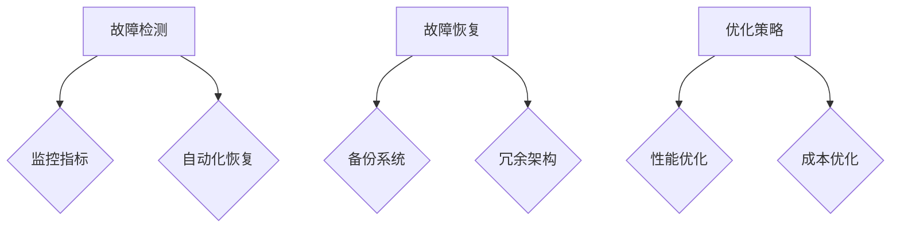

**核心算法原理讲解：**

1. **故障检测：**

   云计算中的故障检测主要通过监控指标和自动化恢复机制实现。以下是一个简单的故障检测算法：

   ```python
   def monitor_system():
       while True:
           status = check_system_status()
           if status != "OK":
               trigger_automation()
           time.sleep(检测间隔)
   ```

   在监控指标达到阈值时，系统会触发自动化恢复机制。

2. **故障恢复：**

   故障恢复通过备份系统和冗余架构实现。以下是一个简单的故障恢复算法：

   ```python
   def recover_fault():
       if backup_system:
           switch_to_backup()
           restore_data()
           return True
       else:
           return False
   ```

   当主系统发生故障时，系统会切换到备份系统，并恢复数据。

3. **优化策略：**

   云计算中的优化策略主要包括性能优化和成本优化。以下是一个简单的优化策略：

   ```python
   def optimize_system():
       if performance Bottleneck:
           adjust_resources()
       if cost Bottleneck:
           scale_resources()
   ```

   根据系统性能瓶颈和成本瓶颈，调整资源分配，提高系统效率。

**数学模型和公式：**

为了量化云计算中容错机制的效果，我们可以使用以下数学模型和公式：

- **系统可靠性：**
  $$ R(t) = P(\text{系统无故障运行到时间 } t) $$

- **故障检测率：**
  $$ \alpha = P(\text{检测到故障} | \text{实际故障}) $$

- **故障恢复率：**
  $$ \beta = P(\text{恢复成功} | \text{故障检测到}) $$

- **性能优化效率：**
  $$ E_p = \frac{\text{优化后性能}}{\text{优化前性能}} $$

- **成本优化效率：**
  $$ E_c = \frac{\text{优化后成本}}{\text{优化前成本}} $$

**详细讲解与举例说明：**

假设我们设计一个云计算平台，要求在99.99%的可靠性水平下运行。我们可以通过以下步骤来实现：

1. **故障检测：** 使用监控系统，实时监控关键指标，如CPU利用率、内存使用率、网络延迟等，一旦指标异常，立即触发自动化恢复机制。
2. **故障恢复：** 采用冗余架构，确保在主节点故障时，备用节点能够迅速接管，同时使用备份系统恢复数据。
3. **优化策略：** 根据系统性能瓶颈和成本瓶颈，动态调整资源分配，如增加节点、调整网络带宽等，提高系统性能和降低成本。

**总结：**

通过在云计算中应用容错机制，我们能够确保系统在面对各种故障和异常情况时，能够保持高可用性和稳定性，为用户提供优质的云服务。

### 第四部分：容错机制在项目中的应用

#### 4.3 容错机制在物联网中的应用

**背景介绍：**

物联网（IoT）技术正逐渐渗透到各个行业，如智能家居、智慧城市、工业自动化等。然而，由于物联网设备的多样性和复杂性，它们往往面临各种故障和异常情况，这对系统的稳定性和可靠性提出了严峻挑战。因此，在物联网项目中应用容错机制至关重要。

**核心概念与联系：**

- **物联网系统的可靠性设计：** 通过冗余设计、故障检测和故障恢复等机制，确保物联网系统能够在故障发生时保持稳定运行。
- **物联网系统的故障恢复策略：** 通过自动化和人工干预相结合的方式，确保在故障发生时，系统能够快速恢复。

**Mermaid 流程图：**

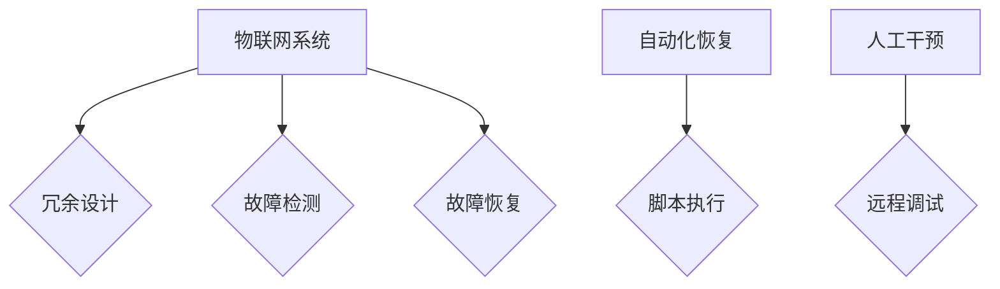

**核心算法原理讲解：**

1. **物联网系统的可靠性设计：**

   物联网系统的可靠性设计主要通过冗余设计实现。以下是一个简单的物联网系统可靠性设计：

   ```mermaid
   graph TD
       A[主设备] --> B{备份设备}
   ```

   在主设备故障时，备份设备能够迅速接管，确保系统运行不中断。

2. **故障检测：**

   通过实时监控设备状态和通信质量，及时发现故障。以下是一个故障检测的示例：

   ```mermaid
   graph TD
       A[监控系统] --> B{检查设备状态}
       B --> C{异常处理}
   ```

   监控系统会定期检查设备状态，一旦发现异常，立即触发异常处理。

3. **故障恢复：**

   通过自动化恢复和人工干预相结合的方式，确保在故障发生时，系统能够快速恢复。以下是一个故障恢复的示例：

   ```mermaid
   graph TD
       A[故障检测] --> B{自动化恢复}
       B --> C{恢复成功}
       A --> D{人工干预}
       D --> E{远程调试}
   ```

   故障检测到后，系统会尝试自动化恢复，如重启设备、重连网络等。如果自动化恢复失败，可以由技术人员进行远程调试和干预。

**数学模型和公式：**

为了量化物联网系统应用容错机制的效果，我们可以使用以下数学模型和公式：

- **系统可靠性：**
  $$ R(t) = P(\text{系统无故障运行到时间 } t) $$

- **故障检测率：**
  $$ \alpha = P(\text{检测到故障} | \text{实际故障}) $$

- **故障恢复率：**
  $$ \beta = P(\text{恢复成功} | \text{故障检测到}) $$

- **自动化恢复效率：**
  $$ E_a = \frac{\text{自动化恢复成功案例数}}{\text{总故障案例数}} $$

- **人工干预效率：**
  $$ E_h = \frac{\text{人工干预成功案例数}}{\text{总故障案例数}} $$

**详细讲解与举例说明：**

假设我们设计一个智能家居系统，要求在99.9%的可靠性水平下运行。我们可以通过以下步骤来实现：

1. **物联网系统的可靠性设计：** 采用双设备冗余设计，确保在主设备故障时，备份设备能够迅速接管。
2. **故障检测：** 使用实时监控系统，定期检查设备状态和通信质量，一旦发现异常，立即触发异常处理。
3. **故障恢复：** 通过自动化恢复机制，如重启设备、重连网络等，确保在故障发生时，系统能够快速恢复。如果自动化恢复失败，技术人员可以远程调试和干预。

**总结：**

通过在物联网项目中应用容错机制，我们能够确保系统在面对各种故障和异常情况时，能够保持高可用性和稳定性，为用户提供优质的物联网服务。

### 第五部分：容错机制的测试与优化

#### 5.1 容错机制的测试方法

**背景介绍：**

在容错机制的开发过程中，测试是确保其有效性和可靠性的关键步骤。通过系统化的测试方法，我们可以验证容错机制在各种故障情况下的表现，确保其在实际应用中的稳定性和可靠性。

**核心概念与联系：**

- **测试策略：** 根据容错机制的特点和需求，制定相应的测试策略，包括故障模拟、压力测试、性能测试等。
- **测试工具：** 使用专业的测试工具，如负载测试工具、故障注入工具等，以提高测试效率和准确性。

**Mermaid 流程图：**

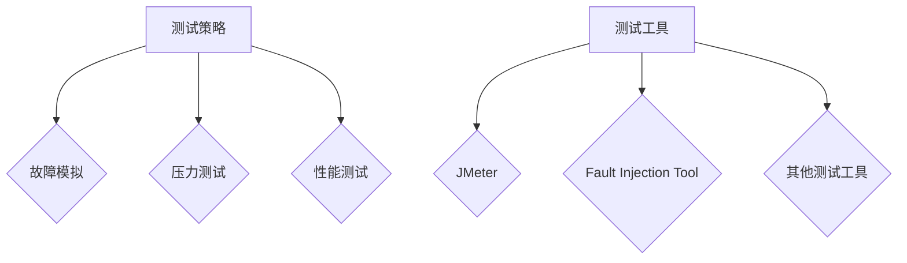

**核心算法原理讲解：**

1. **故障模拟：**

   故障模拟是通过模拟各种故障情况，测试容错机制的反应和恢复能力。以下是一个故障模拟的示例：

   ```mermaid
   graph TD
       A[模拟故障] --> B{故障发生}
       B --> C{容错机制响应}
   ```

   在模拟故障的情况下，测试系统是否能够正常检测和恢复。

2. **压力测试：**

   压力测试是通过模拟高负载情况，测试容错机制的稳定性和性能。以下是一个压力测试的示例：

   ```mermaid
   graph TD
       A[高负载] --> B{系统响应时间}
       B --> C{性能指标}
   ```

   在高负载下，测试系统的响应时间和性能指标。

3. **性能测试：**

   性能测试是通过模拟不同负载情况，测试容错机制在不同负载下的性能表现。以下是一个性能测试的示例：

   ```mermaid
   graph TD
       A[负载变化] --> B{系统响应时间}
       B --> C{性能指标}
   ```

   在不同负载下，测试系统的响应时间和性能指标。

**数学模型和公式：**

为了量化测试效果，我们可以使用以下数学模型和公式：

- **故障检测率：**
  $$ \alpha = P(\text{检测到故障} | \text{实际故障}) $$

- **故障恢复率：**
  $$ \beta = P(\text{恢复成功} | \text{故障检测到}) $$

- **测试覆盖率：**
  $$ C_t = \frac{\text{测试用例数}}{\text{预期故障数}} $$

- **性能指标：**
  $$ P_i = \frac{\text{性能指标}}{\text{基准指标}} $$

**详细讲解与举例说明：**

假设我们设计一个金融交易系统，要求在99.9%的可靠性水平下运行。我们可以通过以下步骤进行测试：

1. **故障模拟：** 模拟各种故障情况，如网络中断、服务器故障等，测试系统的故障检测和恢复能力。
2. **压力测试：** 模拟高负载情况，测试系统的响应时间和性能指标。
3. **性能测试：** 在不同负载下，测试系统的响应时间和性能指标。

**总结：**

通过系统化的测试方法，我们能够全面验证容错机制的有效性和可靠性，确保其在实际应用中的稳定性和性能。

### 第五部分：容错机制的测试与优化

#### 5.2 容错机制的优化方法

**背景介绍：**

在实际应用中，容错机制可能因为种种原因（如硬件限制、软件漏洞、网络问题等）而无法达到预期的效果。为了提升容错机制的效率和可靠性，我们需要采取一系列优化方法，以应对不同的优化需求和挑战。

**核心概念与联系：**

- **优化策略：** 根据系统特点和应用场景，制定合适的优化策略，包括算法优化、硬件升级、网络优化等。
- **性能分析：** 对容错机制进行性能分析，识别瓶颈和改进点，为优化提供依据。

**Mermaid 流程图：**

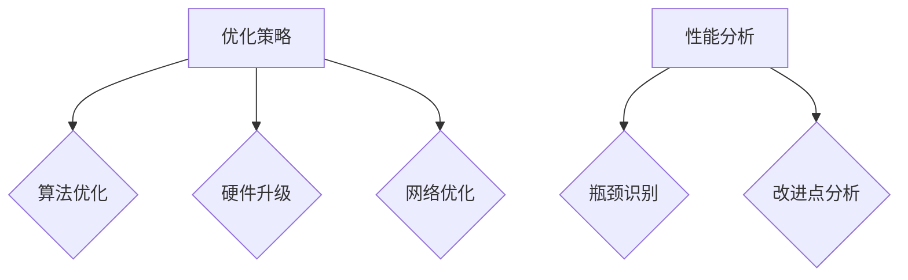

**核心算法原理讲解：**

1. **算法优化：**

   算法优化是提升容错机制效率的关键步骤。以下是一个算法优化的示例：

   ```mermaid
   graph TD
       A[原算法] --> B{性能瓶颈}
       B --> C{改进算法}
       C --> D{性能提升}
   ```

   通过识别性能瓶颈，优化算法结构，降低计算复杂度，提升系统性能。

2. **硬件升级：**

   硬件升级是通过更换更高性能的硬件设备，提升系统的处理能力和可靠性。以下是一个硬件升级的示例：

   ```mermaid
   graph TD
       A[旧硬件] --> B{升级硬件}
       B --> C{性能提升}
   ```

   例如，使用SSD替换HDD，使用更强大的CPU和内存，提升系统响应速度和处理能力。

3. **网络优化：**

   网络优化是通过优化网络架构和参数设置，提升系统的网络传输效率和稳定性。以下是一个网络优化的示例：

   ```mermaid
   graph TD
       A[网络架构] --> B{优化参数}
       B --> C{网络性能提升}
   ```

   例如，使用多路径网络连接，优化路由算法，提升网络带宽和稳定性。

**数学模型和公式：**

为了量化优化效果，我们可以使用以下数学模型和公式：

- **优化效率：**
  $$ E_o = \frac{\text{优化后性能}}{\text{优化前性能}} $$

- **优化成本：**
  $$ C_o = \text{优化所需成本} $$

- **系统可靠性：**
  $$ R(t) = P(\text{系统无故障运行到时间 } t) $$

**详细讲解与举例说明：**

假设我们设计一个电商平台，要求在99.9%的可靠性水平下运行。我们可以通过以下步骤进行优化：

1. **算法优化：** 优化订单处理算法，降低计算复杂度，提升系统响应速度。
2. **硬件升级：** 使用SSD替换HDD，提高数据读取速度，减少延迟。
3. **网络优化：** 优化网络架构，使用多路径连接，提升网络带宽和稳定性。

**总结：**

通过优化策略，我们能够显著提升容错机制的效率和可靠性，确保系统在面对各种故障和异常情况时，能够保持高可用性和稳定性。

### 第五部分：容错机制的测试与优化

#### 5.3 容错机制的持续改进

**背景介绍：**

随着技术的不断进步和应用场景的多样化，容错机制也需要不断地进行调整和优化，以适应新的挑战和需求。持续改进是确保容错机制始终处于最佳状态的重要环节。

**核心概念与联系：**

- **改进流程：** 通过定期评估、反馈和改进，形成持续改进的闭环流程。
- **案例分析：** 分析成功和失败的改进案例，总结经验教训，为后续改进提供参考。

**Mermaid 流程图：**

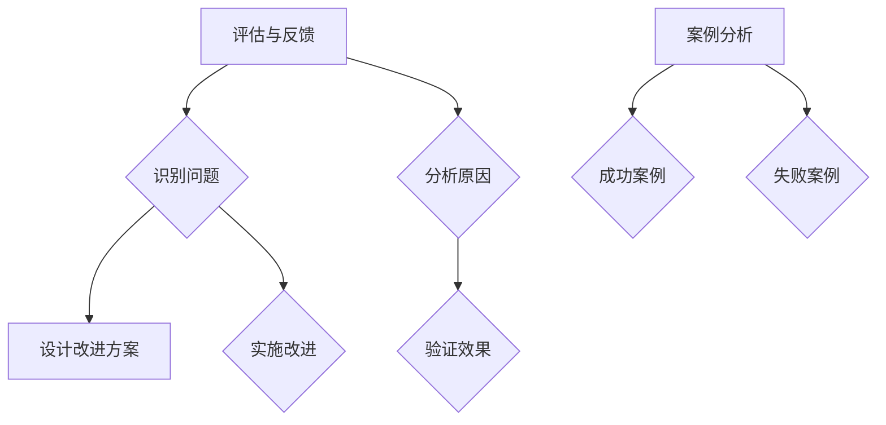

**核心算法原理讲解：**

1. **评估与反馈：**

   定期对容错机制进行评估，收集系统运行数据和用户反馈，识别存在的问题。

   ```mermaid
   graph TD
       A[定期评估] --> B{收集数据}
       B --> C{用户反馈}
       B --> D{问题识别}
   ```

2. **分析原因：**

   对识别出的问题进行深入分析，找出根本原因，为改进提供依据。

   ```mermaid
   graph TD
       E[问题识别] --> F{原因分析}
   ```

3. **设计改进方案：**

   根据分析结果，设计具体的改进方案，包括算法优化、硬件升级、系统重构等。

   ```mermaid
   graph TD
       D --> G{设计方案}
   ```

4. **实施改进：**

   将改进方案付诸实施，包括代码修改、硬件更换、系统重构等。

   ```mermaid
   graph TD
       G --> H{实施改进}
   ```

5. **验证效果：**

   在改进实施后，对系统进行验证，确保改进措施有效，问题得到解决。

   ```mermaid
   graph TD
       H --> I{验证效果}
   ```

**数学模型和公式：**

为了量化持续改进的效果，我们可以使用以下数学模型和公式：

- **改进效果：**
  $$ E_i = \frac{\text{改进后性能}}{\text{改进前性能}} $$

- **改进成本：**
  $$ C_i = \text{改进所需成本} $$

- **系统可靠性：**
  $$ R(t) = P(\text{系统无故障运行到时间 } t) $$

**详细讲解与举例说明：**

假设我们设计一个在线教育平台，要求在99.9%的可靠性水平下运行。我们可以通过以下步骤进行持续改进：

1. **评估与反馈：** 定期收集系统运行数据和用户反馈，识别存在的问题。
2. **分析原因：** 对识别出的问题进行深入分析，找出根本原因。
3. **设计改进方案：** 根据分析结果，设计具体的改进方案，如优化数据库查询、更换硬件设备等。
4. **实施改进：** 将改进方案付诸实施，确保问题得到解决。
5. **验证效果：** 在改进实施后，对系统进行验证，确保改进措施有效。

**总结：**

通过持续改进，我们能够不断优化容错机制，提高系统的可靠性和性能，为用户提供更优质的服务。持续改进不仅是技术进步的体现，也是企业竞争力的重要保障。

### 总结与展望

**总结：**

本文通过深入探讨程序世界的宇宙级容错机制设计，涵盖了容错机制的基础理论、算法原理、系统架构设计、项目应用以及测试与优化等方面。我们详细介绍了故障检测、故障恢复、故障隔离等核心算法，并通过数学模型和公式量化了容错机制的性能和效果。此外，我们还分析了硬件容错、软件容错和系统级容错技术的具体实现，以及如何在金融、云计算和物联网等项目中应用容错机制。

**展望：**

随着信息技术的发展，容错机制设计的重要性将愈发凸显。未来，我们可以从以下几个方面进行深入研究：

1. **新兴技术的应用：** 探索人工智能、区块链等新兴技术在容错机制中的应用，为系统设计提供新的思路和方法。
2. **自适应容错机制：** 研究自适应容错机制，使系统能够根据运行状态和故障类型自动调整容错策略，提高系统的自适应性和可靠性。
3. **绿色容错：** 考虑能耗和环境影响，设计绿色容错机制，实现可持续发展的目标。
4. **混合容错机制：** 结合多种容错技术，设计混合容错机制，以提高系统的整体可靠性和性能。

通过不断探索和创新，我们将能够为构建更稳定、可靠和高效的程序世界贡献力量。

### 最佳实践 Tips

**1. 定期进行系统评估：** 定期对容错机制进行评估，及时发现潜在问题和性能瓶颈，确保系统始终处于最佳状态。

**2. 多层次冗余设计：** 在硬件、软件和网络层面都采用冗余设计，确保系统在面对各种故障时能够保持稳定运行。

**3. 实时监控和告警：** 实时监控系统运行状态，设置合理的告警阈值，确保在故障发生时能够及时响应。

**4. 定期进行压力测试：** 定期进行压力测试，验证系统的负载能力和响应时间，确保在高峰期仍能保持稳定运行。

**5. 算法优化与更新：** 定期对容错算法进行优化和更新，引入最新的研究成果，提高系统的可靠性和性能。

**6. 强化安全意识：** 强化安全意识，确保容错机制设计时充分考虑安全因素，防范恶意攻击和故障注入。

**7. 持续改进与优化：** 通过持续改进和优化，不断完善容错机制，提高系统的可靠性和可用性。

**注意事项：**

- 在设计容错机制时，要充分考虑系统的具体需求和场景，避免过度冗余和资源浪费。
- 在测试和优化过程中，要确保系统的稳定性和性能，避免因优化导致系统性能下降。
- 在实际应用中，要结合实际情况，灵活调整容错策略，确保系统在面对不同故障时能够有效应对。

### 拓展阅读

**1. 《深入理解计算机系统》（原书第三版）：[作者：Randal E. Bryant & David R. O’Hallaron]**
   - 本书详细介绍了计算机系统的基本原理，包括硬件、软件和网络等方面，对理解容错机制的设计和实现具有重要意义。

**2. 《软件架构设计》：[作者：Peter C. silicone & Paul J. Wirfs-Brock]**
   - 本书介绍了软件架构设计的基本原则和方法，对设计高可靠性的软件系统提供了宝贵的指导。

**3. 《云计算：概念、架构与编程》：[作者：Thomas Erl]**
   - 本书系统地介绍了云计算的概念、架构和技术，对云计算中容错机制的设计和实现有重要参考价值。

**4. 《物联网：概念、架构与实现》：[作者：谢希仁]**
   - 本书详细介绍了物联网的基本概念、架构和实现技术，对物联网系统中容错机制的设计提供了实用的参考。

**5. 《人工智能：一种现代的方法》：[作者：Stuart J. Russell & Peter Norvig]**
   - 本书全面介绍了人工智能的基础理论和最新进展，对新兴技术在容错机制中的应用提供了深入探讨。

### 作者信息

**作者：AI天才研究院/AI Genius Institute & 禅与计算机程序设计艺术 /Zen And The Art of Computer Programming**  
AI天才研究院致力于推动人工智能技术的发展和普及，研究涵盖机器学习、深度学习、自然语言处理等领域。同时，研究院也关注计算机编程和系统设计的哲学和实践，倡导通过“禅”的思维方式，提升编程水平和系统设计能力。Zen And The Art of Computer Programming 是一本经典的编程哲学书籍，为程序员提供了深刻的思考和指导。本文作者结合多年的研究成果和实践经验，深入探讨了程序世界的宇宙级容错机制设计，旨在为读者提供实用的技术见解和最佳实践。

