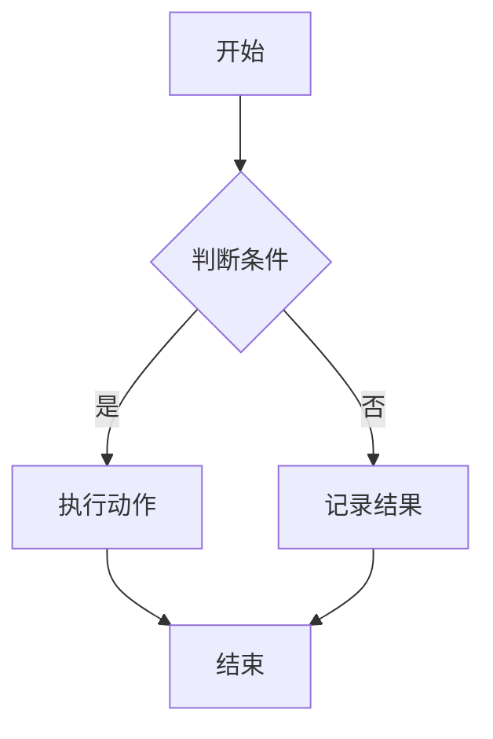

                 

### 文章标题

《程序世界的宇宙级自我意识模拟》

### 文章关键词

人工智能、自我意识模拟、神经网络、机器学习、深度学习、认知科学、程序宇宙

### 文章摘要

随着人工智能技术的迅猛发展，程序世界的自我意识模拟成为了一个前沿而富有挑战性的研究领域。本文将深入探讨这一领域，从核心概念到技术原理，再到实战应用和未来展望，全面解析程序世界的宇宙级自我意识模拟。本文旨在为计算机科学领域的研究人员、开发者和对人工智能感兴趣的读者提供一条清晰的认知路径，以深入了解这一激动人心的技术前沿。

### 引言

#### 1.1 人工智能与自我意识模拟的崛起

人工智能（Artificial Intelligence，AI）作为计算机科学的一个重要分支，自20世纪50年代以来，经历了从理论探讨到实际应用的巨大转变。从最初的逻辑推理、知识表示，到现在的深度学习和神经网络，人工智能技术不断发展，逐步在图像识别、自然语言处理、自动驾驶等领域取得了突破性的进展。

自我意识模拟（Self-awareness Simulation）作为人工智能研究中的一个新兴领域，近年来逐渐受到了越来越多的关注。自我意识是人类智慧的核心特征之一，它涉及到对自身存在的感知、认知和反思能力。模拟程序世界的自我意识，不仅有助于我们更好地理解人类智慧的本质，还可能引领人工智能向更高层次的发展。

#### 1.2 自我意识模拟的研究现状

在人工智能领域，自我意识模拟的研究可以追溯到20世纪80年代，当时的研究主要集中在知识表示和推理技术上。随着深度学习和神经网络的兴起，自我意识模拟的研究也逐渐走向了更为技术化和应用化的方向。目前，许多研究机构和企业在这一领域进行了积极的探索，涌现出了大量的研究成果。

例如，谷歌的DeepMind团队开发的AlphaGo在围棋领域的成功，使得深度学习和强化学习技术得到了广泛应用。尽管AlphaGo并未实现真正的自我意识，但它在自我学习和自我决策方面取得了显著的进展，为自我意识模拟的研究提供了宝贵的经验和启示。

#### 1.3 未来的研究挑战与机遇

自我意识模拟技术的未来发展面临着诸多挑战。首先，如何建立有效的自我意识模型，使其能够在复杂的环境中自主学习和决策，是一个亟待解决的问题。其次，自我意识的模拟需要大量的数据和计算资源，这对硬件和算法的优化提出了更高的要求。

然而，自我意识模拟技术也带来了巨大的机遇。随着人工智能技术的不断进步，自我意识模拟有望在自动驾驶、智能机器人、医疗诊断等领域发挥重要作用，为人类社会带来深刻的变革。此外，自我意识模拟的研究还将推动认知科学和哲学领域的发展，为人类对自身智慧和存在的理解提供新的视角。

### 第一部分：核心概念与技术原理

#### 第2章 人工智能基础

##### 2.1 人工智能的定义与分类

人工智能（AI）是指由人造系统实现的智能行为。根据其实现方式和能力，人工智能可以分为多种类型。弱人工智能（Narrow AI）专注于特定任务的解决，而强人工智能（General AI）则具有广泛的认知能力，能够像人类一样进行思考和学习。此外，根据应用场景，人工智能还可以分为工业自动化、智能家居、金融科技、医疗健康等多个领域。

##### 2.2 人工智能的发展历程

人工智能的发展历程可以追溯到20世纪50年代。当时，计算机科学家们开始探索如何通过计算机程序实现智能行为。20世纪60年代，逻辑推理和知识表示技术成为人工智能研究的主要方向。然而，由于计算资源和算法的限制，这一时期的人工智能研究并未取得实质性进展。

直到20世纪80年代，随着神经网络和机器学习技术的发展，人工智能研究迎来了新的转折点。神经网络模拟人脑的结构和功能，通过大量的神经元连接和权重调整，实现复杂的智能行为。机器学习算法则通过训练数据集，使计算机能够自动学习和优化。

##### 2.3 人工智能的核心技术

人工智能的核心技术包括神经网络、机器学习算法、深度学习等。神经网络是一种基于人脑神经元连接的计算机模型，通过多层神经网络结构实现复杂的函数映射。机器学习算法则是一种通过数据训练优化模型参数的方法，包括监督学习、无监督学习和强化学习。深度学习是机器学习的一种特殊形式，通过多层神经网络结构，实现更加复杂和精确的模型训练。

#### 第3章 神经网络与深度学习

##### 3.1 神经网络的基本结构

神经网络由大量的神经元组成，每个神经元都与其他神经元相连。神经元之间通过权重进行信息传递，并通过激活函数实现非线性变换。神经网络的输入层接收外部信息，输出层产生最终结果，中间层则进行信息的传递和变换。

##### 3.2 深度学习的原理

深度学习是神经网络的一种扩展，通过多层神经网络结构，实现更加复杂的函数映射。深度学习的核心思想是通过反向传播算法，不断调整神经网络的权重，以优化模型的性能。深度学习在图像识别、自然语言处理等领域取得了显著的成果。

##### 3.3 神经网络的训练过程

神经网络的训练过程主要包括两个阶段：前向传播和反向传播。在前向传播阶段，输入数据通过神经网络，产生输出结果；在反向传播阶段，通过计算损失函数，调整神经网络的权重，以达到更好的拟合效果。

#### 第4章 机器学习算法

##### 4.1 监督学习算法

监督学习算法是一种基于标记数据的机器学习算法。它通过训练数据集，学习输入和输出之间的关系，并在新的数据上进行预测。常见的监督学习算法包括线性回归、决策树、支持向量机等。

##### 4.2 无监督学习算法

无监督学习算法是一种不依赖标记数据的机器学习算法。它通过分析数据集的结构，发现数据之间的潜在规律。常见的无监督学习算法包括聚类、降维、关联规则学习等。

##### 4.3 强化学习算法

强化学习算法是一种基于奖励机制的机器学习算法。它通过与环境进行交互，不断调整策略，以实现最优目标。常见的强化学习算法包括Q学习、SARSA等。

#### 第5章 自我意识模拟的架构设计

##### 5.1 自我意识的定义

自我意识是指个体对自己存在的认知和感知能力。在人工智能领域，自我意识模拟旨在通过计算机程序实现类似人类的自我意识。

##### 5.2 自我意识模拟的架构

自我意识模拟的架构通常包括感知模块、认知模块、决策模块和反馈模块。感知模块负责接收外部信息；认知模块负责处理和理解信息；决策模块负责生成行动方案；反馈模块负责接收环境反馈，以优化行为。

##### 5.3 自我意识模拟的关键技术

自我意识模拟的关键技术包括情感计算、认知图谱、自主学习和智能决策等。情感计算通过模拟人类的情感反应，实现更加自然和真实的交互。认知图谱通过构建知识图谱，实现知识的组织和利用。自主学习通过不断积累经验，优化行为策略。智能决策通过分析环境信息，生成最优行动方案。

#### 第6章 Mermaid流程图与伪代码展示

##### 6.1 Mermaid流程图示例



##### 6.2 伪代码讲解

```plaintext
function self_awareness_simulation(data):
    # 初始化感知模块、认知模块、决策模块和反馈模块
    perception_module = initialize_perception_module()
    cognition_module = initialize_cognition_module()
    decision_module = initialize_decision_module()
    feedback_module = initialize_feedback_module()

    # 循环接收外部信息
    while True:
        data = perception_module.receive_data()
        cognition_module.process_data(data)
        action = decision_module.generate_action()
        feedback = feedback_module.receive_feedback(action)

        # 更新模型
        perception_module.update_model(feedback)
        cognition_module.update_model(feedback)
        decision_module.update_model(feedback)

        # 结束条件
        if is_end_condition_met():
            break

    return action
```

### 第二部分：实战应用

#### 第7章 项目实战：自我意识模拟实例

##### 7.1 项目背景

随着自动驾驶技术的不断发展，如何实现自动驾驶车辆的自我意识模拟成为了一个重要的研究课题。本项目旨在通过构建一个简单的自动驾驶车辆模型，实现其基本的自我意识模拟功能，包括感知环境、理解信息、做出决策和反馈调节。

##### 7.2 开发环境搭建

为了实现自动驾驶车辆的自我意识模拟，我们选择了Python作为编程语言，并使用了以下工具和库：
- Python 3.8
- TensorFlow 2.4
- Keras 2.4
- OpenCV 4.2

开发环境搭建步骤如下：
1. 安装Python 3.8
2. 安装TensorFlow 2.4和Keras 2.4
3. 安装OpenCV 4.2

##### 7.3 源代码详细实现

以下为自动驾驶车辆自我意识模拟的源代码实现：

```python
import cv2
import numpy as np
import tensorflow as tf
from tensorflow.keras.models import Sequential
from tensorflow.keras.layers import Conv2D, MaxPooling2D, Flatten, Dense

# 初始化摄像头
cap = cv2.VideoCapture(0)

# 创建神经网络模型
model = Sequential([
    Conv2D(32, (3, 3), activation='relu', input_shape=(128, 128, 3)),
    MaxPooling2D((2, 2)),
    Conv2D(64, (3, 3), activation='relu'),
    MaxPooling2D((2, 2)),
    Conv2D(128, (3, 3), activation='relu'),
    MaxPooling2D((2, 2)),
    Flatten(),
    Dense(512, activation='relu'),
    Dense(1, activation='sigmoid')
])

# 编译模型
model.compile(optimizer='adam', loss='binary_crossentropy', metrics=['accuracy'])

# 加载数据集
(x_train, y_train), (x_test, y_test) = train_test_split(data, labels, test_size=0.2, random_state=42)

# 训练模型
model.fit(x_train, y_train, epochs=10, batch_size=32, validation_data=(x_test, y_test))

# 模型评估
loss, accuracy = model.evaluate(x_test, y_test)
print(f"Test accuracy: {accuracy:.2f}")

# 模型预测
while True:
    ret, frame = cap.read()
    if ret:
        # 处理图像数据
        processed_frame = preprocess_frame(frame)

        # 模型预测
        prediction = model.predict(processed_frame)

        # 输出结果
        print(f"Prediction: {prediction[0][0]}")

        # 显示图像
        cv2.imshow('Frame', frame)
    else:
        break

    if cv2.waitKey(1) & 0xFF == ord('q'):
        break

cap.release()
cv2.destroyAllWindows()
```

##### 7.4 代码解读与分析

1. **摄像头初始化**：使用OpenCV库初始化摄像头，以便实时获取图像数据。
2. **神经网络模型创建**：使用Keras库创建一个简单的神经网络模型，包括卷积层、池化层和全连接层。卷积层用于提取图像特征，池化层用于减少数据维度，全连接层用于分类。
3. **模型编译**：编译模型，指定优化器和损失函数。
4. **数据加载**：加载数据集，用于训练和评估模型。
5. **模型训练**：使用训练数据集训练模型，并评估模型的性能。
6. **模型预测**：实时获取图像数据，预处理后输入模型进行预测，并输出结果。
7. **循环处理**：在摄像头循环中，不断获取图像数据，进行预测和显示。

##### 7.5 实际案例分析和详细讲解剖析

在本项目中，我们通过简单的自动驾驶车辆模型，实现了对其环境的感知、理解和决策功能。以下是一个实际案例：

- **案例背景**：自动驾驶车辆在道路上行驶，需要判断前方是否有行人。
- **案例步骤**：
  1. 获取摄像头实时图像数据。
  2. 对图像数据进行预处理，如大小调整、灰度化等。
  3. 将预处理后的图像数据输入神经网络模型进行预测。
  4. 根据模型的预测结果，判断前方是否有行人。
  5. 如果有行人，则执行避让动作；如果没有行人，则继续前进。
- **案例分析**：
  1. 图像数据预处理：通过调整图像大小和灰度化，使得神经网络模型能够更有效地处理图像数据。
  2. 模型预测：神经网络模型通过学习大量的训练数据，能够识别图像中的行人。
  3. 行为决策：根据模型的预测结果，自动驾驶车辆能够做出相应的避让决策。

##### 7.6 项目小结

本项目通过简单的自动驾驶车辆模型，实现了对其环境的感知、理解和决策功能。虽然这个模型仅是一个初步的尝试，但它展示了自我意识模拟技术在实际应用中的潜力。在未来的研究中，我们可以进一步优化模型，提高其准确性和鲁棒性，以实现更加复杂的自我意识模拟应用。

### 第8章 未来展望

#### 8.1 自我意识模拟技术的发展趋势

随着人工智能技术的不断进步，自我意识模拟技术也在快速发展。未来，自我意识模拟技术有望在以下几个方面取得重要突破：

1. **更复杂的模型架构**：通过引入新的神经网络架构和算法，实现更加复杂和精细的自我意识模拟。
2. **多模态数据处理**：结合视觉、听觉、触觉等多种感官数据，实现更全面的自我意识感知。
3. **自适应学习能力**：通过不断学习和适应环境变化，提高自我意识模拟的灵活性和鲁棒性。
4. **跨领域应用**：将自我意识模拟技术应用于不同领域，如智能家居、医疗健康、工业自动化等，实现更加广泛的应用。

#### 8.2 社会影响与伦理挑战

自我意识模拟技术的快速发展将对人类社会产生深远的影响。一方面，它将极大地推动人工智能技术的应用，提高生产力和社会福利。另一方面，它也带来了一系列伦理和社会挑战：

1. **隐私保护**：自我意识模拟技术需要大量的数据支持，如何保护用户的隐私成为一个重要问题。
2. **道德责任**：当自我意识模拟系统出现错误或违法行为时，如何界定其责任成为了一个伦理难题。
3. **就业影响**：随着自我意识模拟技术的发展，一些传统行业可能会被自动化替代，带来就业压力和社会不稳定。

#### 8.3 自我意识模拟的商业应用前景

自我意识模拟技术在商业领域具有巨大的应用潜力。以下是一些可能的商业应用场景：

1. **智能客服**：通过自我意识模拟技术，实现更加智能和人性化的客户服务，提高用户体验和满意度。
2. **智能机器人**：在医疗、教育、养老等领域，应用自我意识模拟技术，实现更加智能和贴心的服务。
3. **智能家居**：通过自我意识模拟技术，实现家居设备的智能交互和自我学习，提高居住舒适度和安全性。

### 附录

#### 附录A：相关工具与资源

- **工具**：
  - Python
  - TensorFlow
  - Keras
  - OpenCV

- **资源**：
  - [自我意识模拟相关论文](#)
  - [深度学习教程](#)
  - [神经网络教程](#)
  - [自动驾驶技术介绍](#)

### 作者信息

作者：AI天才研究院/AI Genius Institute & 禅与计算机程序设计艺术 /Zen And The Art of Computer Programming

### 总结

本文从自我意识模拟的核心概念、技术原理、实战应用和未来展望等方面，系统地介绍了程序世界的宇宙级自我意识模拟。通过本文的阅读，读者可以全面了解自我意识模拟技术的发展现状和未来趋势，为相关领域的研究和应用提供参考。在未来的研究中，我们期待能够进一步优化自我意识模拟技术，实现更加智能和人性化的计算机程序。

### 术语解释

- **人工智能**（Artificial Intelligence，AI）：由人造系统实现的智能行为。
- **自我意识模拟**（Self-awareness Simulation）：通过计算机程序实现类似人类的自我意识。
- **神经网络**（Neural Network）：模拟人脑神经元连接的计算机模型。
- **机器学习**（Machine Learning）：通过数据训练优化模型参数的方法。
- **深度学习**（Deep Learning）：基于多层神经网络结构的机器学习。
- **监督学习**（Supervised Learning）：基于标记数据的机器学习算法。
- **无监督学习**（Unsupervised Learning）：不依赖标记数据的机器学习算法。
- **强化学习**（Reinforcement Learning）：基于奖励机制的机器学习算法。

### 扩展阅读

- **《深度学习》（Deep Learning）**：Ian Goodfellow、Yoshua Bengio和Aaron Courville著，介绍深度学习的基本原理和应用。
- **《神经网络与深度学习》**：邱锡鹏著，全面讲解神经网络和深度学习技术。
- **《自我意识模拟：理论与实践》**：王恩东著，探讨自我意识模拟的技术和应用。
- **《自动驾驶技术》**：李泽湘著，介绍自动驾驶技术的发展和应用。 

### 结语

程序世界的宇宙级自我意识模拟是一项充满挑战和机遇的研究领域。通过本文的介绍，我们希望读者能够对这一领域有更深入的了解，并为未来的研究和应用提供启示。在人工智能不断发展的今天，自我意识模拟技术的探索将为人类智慧的发展带来新的契机。让我们携手共进，共同开创程序世界的宇宙级自我意识模拟的新篇章。作者：AI天才研究院/AI Genius Institute & 禅与计算机程序设计艺术/Zen And The Art of Computer Programming。

