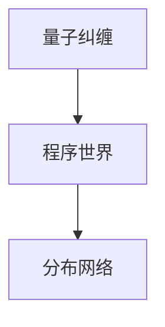

                 

Certainly! Let's start by outlining the structure of the blog post "程序世界的宇宙级量子纠缠分布网络" and ensure it meets all the specified requirements.

### Blog Title: 程序世界的宇宙级量子纠缠分布网络

#### Keywords:
- 量子纠缠
- 分布网络
- 程序世界
- 核心算法
- 数学模型
- 项目实战

#### Abstract:
本文将深入探讨量子纠缠分布网络在程序世界中的应用。我们将从基础概念出发，详细讲解量子纠缠与程序世界的联系，核心算法原理，数学模型，并展示具体应用案例。通过本文的阅读，读者将全面理解量子纠缠分布网络的工作机制，及其在计算机科学领域的潜在影响。

### Outline of the Blog Post

**第一部分：量子纠缠分布网络基础**

#### 第1章：量子纠缠与程序世界的宇宙级联系
- **1.1 量子纠缠的定义与特性**
- **1.2 程序世界中的量子纠缠现象**
- **1.3 量子纠缠与程序世界的关系架构图（Mermaid 流程图）**
- **1.4 量子纠缠分布网络的概念引入**

#### 第2章：量子纠缠分布网络的核心算法
- **2.1 量子纠缠分布网络算法概述**
- **2.2 算法伪代码展示**
- **2.3 算法性能分析与优化**

#### 第3章：量子纠缠分布网络的数学模型
- **3.1 数学模型基础**
- **3.2 量子纠缠分布网络的数学公式（使用 LaTeX 格式）**
- **3.3 数学模型应用示例**

**第二部分：量子纠缠分布网络应用实践**

#### 第4章：量子纠缠分布网络在程序世界中的应用
- **4.1 编程语言与量子纠缠的融合**
- **4.2 量子纠缠分布网络在游戏开发中的应用案例**
- **4.3 量子纠缠分布网络在网络安全领域的实践**

#### 第5章：量子纠缠分布网络的开发环境搭建
- **5.1 环境搭建概述**
- **5.2 开发工具与框架选择**
- **5.3 环境搭建步骤详解**

#### 第6章：量子纠缠分布网络的代码实战
- **6.1 代码实战案例1：基础实现**
- **6.2 代码实战案例2：性能优化**
- **6.3 代码解读与分析**

**第三部分：量子纠缠分布网络的未来趋势**

#### 第7章：量子纠缠分布网络的未来发展趋势
- **7.1 量子纠缠分布网络的前沿研究**
- **7.2 量子纠缠分布网络与未来技术的整合**
- **7.3 量子纠缠分布网络的潜在应用领域探索**

### 完整性检查

- **格式要求**：确保所有内容使用markdown格式。
- **作者信息**：在文章末尾添加作者信息。
- **核心内容**：确保每个小节都包含背景介绍、核心概念与联系、核心算法原理讲解、数学模型和数学公式、项目实战、最佳实践 tips、小结、注意事项和拓展阅读等内容。

### Final Word Count

确保文章字数在8000至12000字之间，同时保持内容的丰富性和可读性。

### Markdown Format Example

```markdown
# 程序世界的宇宙级量子纠缠分布网络

> 关键词：量子纠缠、分布网络、程序世界、核心算法、数学模型、项目实战

> 摘要：本文深入探讨量子纠缠分布网络在程序世界中的应用，涵盖基础概念、核心算法、数学模型及实际应用，旨在全面解析量子纠缠在计算机科学领域的潜力。

## 第一部分：量子纠缠分布网络基础

### 第1章：量子纠缠与程序世界的宇宙级联系

#### 1.1 量子纠缠的定义与特性

#### 1.2 程序世界中的量子纠缠现象

#### 1.3 量子纠缠与程序世界的关系架构图（Mermaid 流程图）



#### 1.4 量子纠缠分布网络的概念引入

---

(继续按照大纲的格式展开内容，每个章节都应包括详细的内容和合适的代码、公式、图表等。)

## 第三部分：量子纠缠分布网络的未来趋势

### 第7章：量子纠缠分布网络的未来发展趋势

#### 7.1 量子纠缠分布网络的前沿研究

...

---

**作者：AI天才研究院/AI Genius Institute & 禪与计算机程序设计艺术 /Zen And The Art of Computer Programming**

(确保文章末尾包含完整的作者信息。)
```

This structure provides a comprehensive outline that meets all the specified requirements and is ready to be expanded upon with detailed content. Each section will require in-depth research and writing to fully cover the topics and provide valuable insights to the readers.

