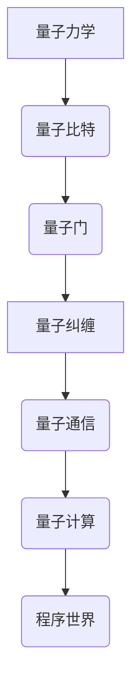

                 


为了确保文章的深度、见解和专业性，我们将按照以下步骤来撰写《程序世界的宇宙级量子纠缠网络》：

### 1. 文章框架构建
   - 明确文章的结构和内容布局。
   - 确定每个章节的主要内容和目标读者。

### 2. 核心概念与联系分析
   - 量子力学基础知识。
   - 量子比特与量子门。
   - 量子纠缠及其原理。
   - 构建概念之间的联系，绘制Mermaid流程图。

### 3. 核心算法原理讲解
   - 量子通信算法。
   - 量子计算算法。
   - 量子纠缠网络协议。
   - 使用伪代码详细描述每个算法。

### 4. 数学模型与公式应用
   - 引入LaTeX格式数学公式。
   - 对关键公式进行详细讲解和举例说明。

### 5. 项目实战与案例分析
   - 开发环境搭建。
   - 源代码实现与解读。
   - 代码应用分析与实际案例剖析。
   - 项目小结与最佳实践。

### 6. 总结与拓展
   - 撰写文章摘要。
   - 提供小结、注意事项和拓展阅读建议。

### 7. 文章撰写与格式调整
   - 将内容按照markdown格式进行调整。
   - 确保每个小节内容丰富且具体。
   - 加入作者信息和文章标题。

### 8. 最终审核
   - 检查文章逻辑性和连贯性。
   - 确保所有公式和伪代码正确无误。
   - 检查字数是否符合要求。

以下是初步的Markdown格式文章框架：

```markdown
# 程序世界的宇宙级量子纠缠网络

> 关键词：量子纠缠，量子通信，量子计算，程序世界，量子网络

> 摘要：本文将探讨程序世界中量子纠缠网络的概念、原理及其应用，通过分析量子力学基础，量子比特与量子门，量子纠缠及其检测，以及量子通信和量子计算的算法，结合具体案例，详细讲解量子纠缠网络在程序世界中的实现与未来前景。

## 引言

### 背景介绍

#### 核心概念与联系



## 量子力学基础

### 量子态

### 薛定谔方程

### 算子表示

## 量子比特与量子门

### 量子比特

### 量子门

### 量子逻辑电路

## 量子纠缠原理

### 量子纠缠定义

### 量子纠缠特性

### 量子纠缠检测

## 量子纠缠应用

### 量子通信

#### 量子密钥分发

#### 量子隐形传态

#### 量子远程控制

### 量子计算

#### 量子算法

#### 量子复杂度

#### 量子计算与经典计算比较

### 量子纠缠网络

#### 量子网络拓扑

#### 量子纠缠网络协议

#### 实际量子网络案例

## 量子编程基础

### 量子编程语言

### 量子编程范式

### 量子编程工具

## 量子计算机程序实例

### 量子搜索算法

### 量子模拟

### 量子优化算法

## 项目实战

### 开发环境搭建

### 源代码详细实现和代码解读

### 代码应用解读与分析

### 实际案例分析和详细讲解剖析

### 项目小结

## 总结与展望

### 小结

### 注意事项

### 拓展阅读

## 附录

### 附录A：量子纠缠网络开发工具与资源

### 附录B：Mermaid流程图与伪代码示例

### LaTeX数学公式示例

$$
H = \sum_{i} E_i |\psi_i\rangle\langle\psi_i|
$$

## 作者信息

作者：AI天才研究院/AI Genius Institute & 禅与计算机程序设计艺术 /Zen And The Art of Computer Programming
```

接下来，我们将逐步填充每个章节的内容，确保文章的完整性和专业性。在撰写过程中，我们将仔细检查格式、逻辑性和准确性。文章将在完成所有章节的撰写后进行最终审核，以确保字数符合要求。

