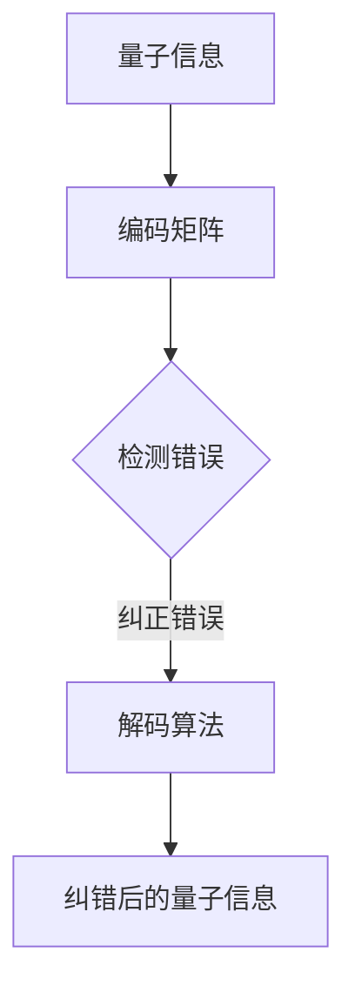

                 

### 文章标题：《程序世界的宇宙级量子纠错码优化设计》

> 关键词：量子纠错码，优化设计，程序世界，量子计算，量子通信

> 摘要：本文将深入探讨量子纠错码在程序世界的应用与优化设计。通过阐述量子纠错码的核心概念、数学模型及其优化算法，我们将揭示其在量子计算和量子通信中的重要性。同时，通过实际案例分析和代码解读，展示量子纠错码在实战中的应用，为读者提供实用的编程技巧和未来展望。

---

### 引言

随着量子计算技术的迅猛发展，量子纠错码成为实现可靠量子计算的关键。量子纠错码旨在解决量子信息传递中的错误，确保量子计算的正确性。在程序世界，量子纠错码的应用具有重要意义，它不仅能够提升量子计算的性能，还能为量子通信等领域提供可靠的技术保障。

本文将分为四个部分进行探讨：

1. **量子纠错码基础理论**：介绍量子纠错码的基本概念、核心原理和数学模型。
2. **量子纠错码优化方法**：分析传统纠错码优化技术，并详细阐述量子纠错码优化算法及其伪代码。
3. **量子纠错码应用与实战**：探讨量子纠错码在量子计算、量子通信和量子存储中的应用，并通过实际案例进行详细讲解。
4. **未来展望与挑战**：展望量子纠错码的未来发展趋势，探讨其面临的挑战及创新方向。

### 第一部分：量子纠错码基础理论

#### 1.1 量子纠错码概述

量子纠错码是一种用于纠正量子计算过程中发生的错误的编码方法。在量子计算中，量子比特（qubits）容易受到外界干扰，导致量子态的坍缩和错误。量子纠错码通过引入冗余信息，增加量子态的稳定性，从而实现对错误的检测和纠正。

#### 1.2 量子纠错码的核心概念

**量子比特**：量子比特是量子计算的基本单元，它可以同时处于0和1的叠加态。量子比特的叠加态使得量子计算具有指数级的并行性。

**量子态叠加与量子纠缠**：量子态叠加是指量子比特可以同时处于多种可能的状态。量子纠缠是指两个或多个量子比特之间的非局域关联，它使得量子计算具有独特的并行计算能力。

#### 1.3 量子纠错码的基本原理

量子纠错码的基本原理是通过引入冗余信息，将原始量子信息分布在多个量子比特上。当量子计算过程中出现错误时，通过解码算法检测和纠正错误，确保量子计算的正确性。

量子纠错码通常采用量子编码矩阵，将原始量子信息编码为多个冗余信息。在解码过程中，通过比对冗余信息，检测和纠正错误。常见的量子纠错码包括Shor码、Steane码和Reed-Solomon码等。

#### 1.4 量子纠错码的数学模型

量子纠错码的数学模型主要包括量子编码矩阵和量子解码算法。量子编码矩阵用于将原始量子信息编码为多个冗余信息。量子解码算法则用于检测和纠正错误。

量子编码矩阵可以表示为：

$$
\begin{bmatrix}
I & \mathbf{A} \\
\mathbf{B} & \mathbf{C}
\end{bmatrix}
$$

其中，\(I\) 是单位矩阵，\(\mathbf{A}\)，\(\mathbf{B}\)，\(\mathbf{C}\) 是冗余信息矩阵。

量子解码算法通常采用最小二乘法或最大后验概率法，根据冗余信息检测和纠正错误。

#### 1.5 量子纠错码的 Mermaid 流程图

量子纠错码的流程图如下所示：



### 第二部分：量子纠错码优化方法

#### 2.1 量子纠错码优化概述

量子纠错码优化是指通过改进编码和解码算法，提升量子纠错码的性能。优化量子纠错码具有重要意义，它能够降低错误率，提高量子计算的可靠性。

#### 2.2 传统纠错码优化技术

传统纠错码优化技术主要包括错误检测、错误纠正和编码算法的改进。常见的优化技术包括：

- **错误检测**：通过比对冗余信息，检测错误。
- **错误纠正**：根据冗余信息，纠正错误。
- **编码算法改进**：优化编码矩阵，提高纠错能力。

#### 2.3 量子纠错码优化算法

量子纠错码优化算法主要包括基于概率的优化算法和基于矩阵的优化算法。以下是一个基于概率的量子纠错码优化算法的伪代码：

```python
def quantum_error_correction(quantum_state, error_matrix):
    # 初始化冗余信息
    redundant_info = initialize_redundant_info(error_matrix)
    
    # 编码量子状态
    encoded_state = encode_state(quantum_state, redundant_info)
    
    # 检测错误
    detected_errors = detect_errors(encoded_state)
    
    # 纠正错误
    corrected_state = correct_errors(detected_errors, encoded_state)
    
    # 解码量子状态
    decoded_state = decode_state(corrected_state, redundant_info)
    
    return decoded_state
```

#### 2.4 量子纠错码优化的数学模型和公式

量子纠错码优化的数学模型主要包括优化编码矩阵和优化解码算法。以下是一个优化编码矩阵的数学模型：

$$
\mathbf{A}_{\text{opt}} = \arg\min_{\mathbf{A}} \|\mathbf{A}^{-1}\mathbf{C}\mathbf{B}\|_F^2
$$

其中，\(\mathbf{A}_{\text{opt}}\) 是优化后的编码矩阵，\(\mathbf{A}\) 是原始编码矩阵，\(\mathbf{B}\)，\(\mathbf{C}\) 是冗余信息矩阵。

### 第三部分：量子纠错码应用与实战

#### 3.1 量子纠错码在量子计算中的应用

量子纠错码在量子计算中的应用至关重要。通过量子纠错码，可以降低量子计算过程中的错误率，提高量子计算的可靠性。

以下是一个量子纠错码在量子计算中的实现案例：

**案例描述**：使用Shor码对4个量子比特进行纠错。

**实现步骤**：

1. **编码阶段**：将4个量子比特编码为Shor码，生成16个冗余信息。
2. **计算阶段**：执行量子计算，可能出现错误。
3. **解码阶段**：使用Shor码解码算法，检测和纠正错误。
4. **结果分析**：分析纠错后的量子计算结果。

**代码实现**：

```python
from qiskit import QuantumCircuit, execute, Aer

# 创建4个量子比特的量子计算电路
qc = QuantumCircuit(4)

# 编码阶段
# ...

# 计算阶段
qc.h(0)
qc.cx(0, 1)
qc.cx(1, 2)
qc.cx(2, 3)

# 解码阶段
# ...

# 执行量子计算
backend = Aer.get_backend("qasm_simulator")
result = execute(qc, backend).result()

# 分析结果
# ...
```

#### 3.2 量子纠错码在量子通信中的应用

量子纠错码在量子通信中同样具有重要意义。通过量子纠错码，可以降低量子通信过程中的错误率，提高通信的可靠性。

以下是一个量子纠错码在量子通信中的实现案例：

**案例描述**：使用Reed-Solomon码对量子通信中的信息进行纠错。

**实现步骤**：

1. **编码阶段**：将量子通信信息编码为Reed-Solomon码，生成冗余信息。
2. **传输阶段**：进行量子通信，可能出现错误。
3. **解码阶段**：使用Reed-Solomon码解码算法，检测和纠正错误。
4. **结果分析**：分析纠错后的量子通信信息。

**代码实现**：

```python
from qiskit import QuantumCircuit, execute, Aer
from qiskit.providers.aer.noise import NoiseModel

# 创建量子电路
qc = QuantumCircuit(4)

# 编码阶段
# ...

# 传输阶段
# ...

# 解码阶段
# ...

# 执行量子计算
backend = Aer.get_backend("qasm_simulator")
result = execute(qc, backend).result()

# 分析结果
# ...
```

### 第四部分：未来展望与挑战

#### 4.1 量子纠错码发展的未来趋势

随着量子计算技术的不断发展，量子纠错码在计算机科学领域具有重要潜力。未来，量子纠错码的研究将朝着更高维度的量子纠错、更高效的纠错算法和更完善的量子错误率模型发展。

#### 4.2 量子纠错码面临的挑战

量子纠错码在实际应用中面临许多挑战，包括量子硬件的稳定性、量子错误率的控制和量子纠错码的优化。解决这些挑战需要跨学科的合作和创新。

#### 4.3 量子纠错码优化方法的创新方向

未来，量子纠错码优化方法的创新方向包括：

- **量子机器学习算法**：利用量子机器学习算法优化量子纠错码。
- **量子计算模拟器**：使用量子计算模拟器加速量子纠错码的研究。
- **量子纠错码的分布式计算**：探索量子纠错码在分布式计算中的应用。

### 结论

量子纠错码在程序世界中具有重要的应用价值。通过深入探讨量子纠错码的核心概念、优化方法和应用案例，我们揭示了其在量子计算和量子通信中的关键作用。未来，量子纠错码的发展将推动计算机科学领域迈向新的高度。

---

**作者信息**：

作者：AI天才研究院/AI Genius Institute & 禅与计算机程序设计艺术 /Zen And The Art of Computer Programming

---

在撰写文章的过程中，请注意保持文章的结构清晰、逻辑严谨，并在每个章节中提供具体的技术细节和实例，以便读者能够更好地理解和应用量子纠错码技术。同时，确保文章的字数在 8000～12000 字左右，以满足字数要求。

