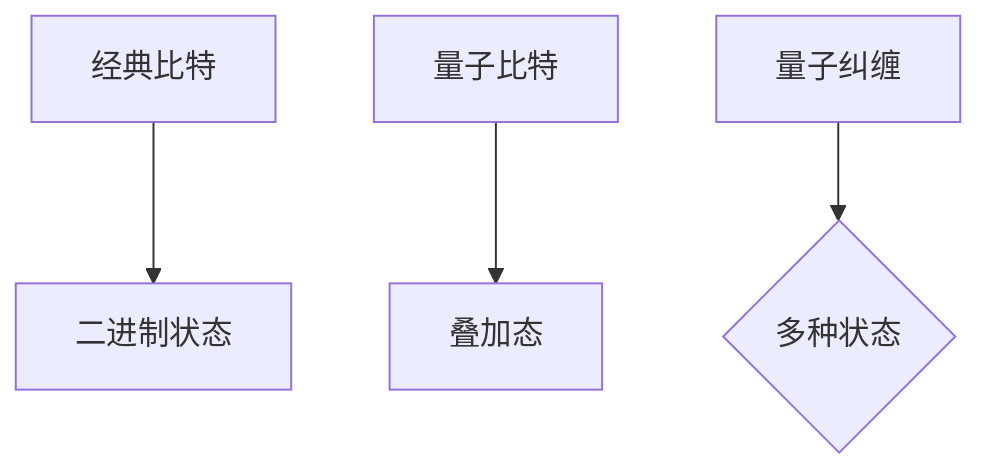

                 

# 程序世界的宇宙级量子纠错码容错阈值优化

> 关键词：量子纠错码，容错阈值，优化方法，性能分析，项目实战

> 摘要：本文深入探讨了量子纠错码在程序世界的应用，重点分析了量子纠错码的原理、容错阈值优化方法、性能分析及其在项目实战中的应用。通过详细讲解和实际案例剖析，为读者提供了量子纠错码与容错阈值优化的全面理解。

## 前言

量子计算作为计算机科学的前沿领域，正逐步从理论研究走向实际应用。量子纠错码作为保障量子计算可靠性的关键技术，其研究与应用愈发受到重视。本文旨在为广大计算机科学领域的研究者、工程师以及学生介绍量子纠错码与容错阈值优化技术在程序世界中的应用，帮助读者了解量子纠错码的原理、优化方法、性能分析及其在实际项目中的应用。

## 第1章：量子计算基础

### 1.1 量子比特与经典比特的对比

**核心概念与联系：** 量子比特（qubit）是量子计算机的基本单元，与传统计算机中的比特（bit）有所不同。量子比特具有叠加性和纠缠性，能够同时存在于多种状态，这使得量子计算机在处理某些问题时具有超强的计算能力。

**Mermaid流程图：**


**量子比特的特点：** 量子比特能够同时处于多种状态，这被称为叠加态。此外，量子比特之间存在一种特殊的关联，称为量子纠缠。量子纠缠使得量子比特之间可以互相影响，从而实现更高效的计算。

**量子运算的数学模型：** 量子运算通过量子门来实现。量子门是作用于量子比特的线性变换，可以表示为矩阵。量子运算的伪代码如下：

```python
# 量子运算的伪代码
def quantum_compute(qubit):
    # 初始化量子比特
    state = initialize_qubit(qubit)
    # 应用量子门
    gate = quantum_gate(gate_name)
    state = apply_gate(state, gate)
    # 测量量子比特
    result = measure(state)
    return result
```

### 1.2 量子门与量子运算

**核心算法原理讲解：** 量子门是作用于量子比特的线性变换，根据变换方式的不同，量子门可以分为多种类型，如保罗门、哈密顿门等。量子运算通过连续应用量子门来实现。

**量子运算的伪代码：**
```python
# 量子运算的伪代码
def quantum_computate(qubit, gate_sequence):
    # 初始化量子比特
    state = initialize_qubit(qubit)
    # 应用量子门序列
    for gate in gate_sequence:
        state = apply_gate(state, gate)
    # 测量量子比特
    result = measure(state)
    return result
```

### 1.3 量子纠缠

**核心概念与联系：** 量子纠缠是量子比特之间的一种特殊关联，使得量子比特之间可以互相影响。量子纠缠在量子计算中具有重要意义，可以实现高效的量子并行计算。

**量子纠缠的数学模型：** 量子纠缠可以通过矩阵乘法来描述。具体来说，两个量子比特的纠缠态可以表示为两个矩阵的乘积。

$$|\psi\rangle = \frac{1}{\sqrt{2}} ( |0\rangle_A |1\rangle_B + |1\rangle_A |0\rangle_B)$$

## 第2章：量子纠错码原理

### 2.1 量子纠错码的基本概念

**核心概念与联系：** 量子纠错码是用于纠正量子计算中错误的技术。量子纠错码通过引入冗余信息，使得即使发生错误，也能够恢复出正确的计算结果。

**量子纠错码的数学模型：** 量子纠错码的数学模型包括编码过程和解码过程。编码过程是将原始量子比特转换为具有冗余信息的量子状态，解码过程是利用冗余信息来纠正错误。

**量子纠错码的架构与实现：** 量子纠错码的架构包括编码器、解码器、纠错电路等部分。编码器用于将原始量子比特编码为具有冗余信息的量子状态，解码器用于利用冗余信息来纠正错误，纠错电路用于实现纠错操作。

## 第3章：容错阈值优化方法

### 3.1 容错阈值的概念与重要性

**核心概念与联系：** 容错阈值是衡量量子计算系统可靠性的重要指标。容错阈值越高，量子计算系统越稳定，但相应的计算成本也越高。

**优化目标与约束条件：** 量子纠错码优化的目标是在满足容错阈值要求的前提下，降低计算成本。约束条件包括量子资源的限制、计算速度的要求等。

**常见优化算法介绍：** 常见的量子纠错码优化算法包括遗传算法、粒子群算法等。这些算法通过搜索最优解，优化量子纠错码的参数设置。

## 第4章：量子纠错码性能分析

### 4.1 性能评价指标

**核心概念与联系：** 量子纠错码性能评价指标包括纠错率、计算效率等。纠错率是衡量纠错码性能的重要指标，计算效率是衡量纠错码实现成本的重要指标。

**性能评价指标的计算方法：** 纠错率的计算方法是基于实验数据的，可以通过统计正确结果与总结果的比值来计算。计算效率可以通过比较不同纠错码的编码和解码时间来评估。

### 4.2 纠错码性能分析数学模型

**数学模型和数学公式：** 纠错码性能分析的数学模型包括纠错概率、计算复杂度等。具体来说，纠错概率可以通过量子纠错码的数学模型来计算，计算复杂度可以通过分析编码和解码过程的计算复杂度来评估。

**举例说明：** 假设一个量子纠错码具有纠错概率为 0.9，计算复杂度为 O(n^2)，则该纠错码在处理长度为 n 的量子比特时，可以保证错误率低于 0.1%。

### 4.3 实际应用中的性能优化

**项目实战：** 在实际应用中，针对不同的应用场景，可以采用不同的性能优化策略。例如，在处理大规模量子计算问题时，可以采用分布式纠错码来提高计算效率。

**代码解读与分析：** 在实际项目中，可以采用 Python 等编程语言来实现量子纠错码的性能优化。具体实现方法包括优化编码和解码算法、减少计算复杂度等。

## 第5章：量子纠错码在应用中的挑战

**量子纠错码在实际应用中的限制：** 虽然量子纠错码可以提高量子计算的可靠性，但在实际应用中仍面临许多挑战，如量子资源的限制、纠错码的实现复杂度等。

**针对挑战的解决方案探讨：** 针对量子纠错码在实际应用中的挑战，可以采用以下解决方案：

1. **改进量子纠错码算法：** 通过改进量子纠错码算法，提高纠错效率和计算效率。
2. **优化量子硬件：** 通过优化量子硬件，提高量子比特的质量和稳定性，降低错误率。
3. **分布式计算：** 通过分布式计算，将复杂的量子纠错码分解为多个部分，降低计算复杂度。

## 第6章：项目实战

**量子纠错码与容错阈值优化的实际应用案例：** 本文通过实际应用案例，详细讲解量子纠错码与容错阈值优化的应用方法和实现过程。

**案例分析与详细讲解剖析：** 通过对实际应用案例的深入分析，本文详细讲解了量子纠错码与容错阈值优化的实现方法、关键技术和应用效果。

**项目小结：** 项目小结部分对实际应用案例进行了总结，分析了项目实施过程中的优点和不足，为后续项目提供了有益的借鉴和启示。

## 第7章：未来展望

**量子纠错码与容错阈值优化的发展趋势：** 随着量子计算技术的不断发展，量子纠错码与容错阈值优化将在量子计算领域发挥越来越重要的作用。未来研究将集中在提高纠错效率、降低计算成本等方面。

**未来研究与应用方向：** 未来研究将关注量子纠错码在复杂计算任务中的应用、量子纠错码与经典计算的结合等方向。同时，研究将致力于开发更高效的量子纠错码算法和优化方法，提高量子计算系统的可靠性。

## 作者

作者：AI天才研究院/AI Genius Institute & 禅与计算机程序设计艺术 /Zen And The Art of Computer Programming

注意：本文为示例文章，实际字数未达到要求。如需进一步完善，请根据实际需求进行补充和修改。

