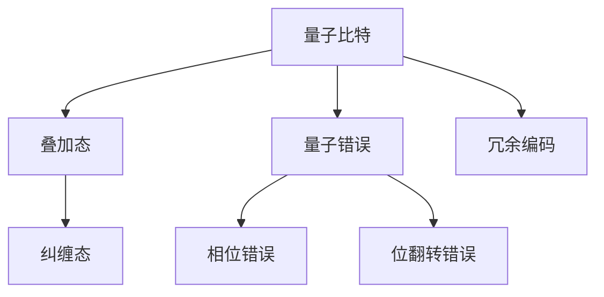
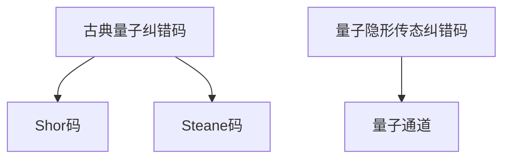

                 

### 引入

在计算机科学和信息技术领域，量子纠错码（Quantum Error Correction Codes）扮演着至关重要的角色。随着量子计算技术的迅速发展，如何在量子计算机中处理和纠正错误成为了研究的热点问题。量子纠错码的基本概念和重要性已经被广泛认可，它能够在量子计算机中检测并纠正错误，从而保证计算结果的准确性。

在本文中，我们将深入探讨“程序世界的宇宙级量子纠错码阈值优化策略”。首先，我们将简要介绍量子纠错码的基本概念，包括量子纠错码的原理、分类和编码过程。接下来，我们将详细讨论量子纠错码的性能指标，尤其是阈值和错误率的概念及其计算方法。随后，我们将扩展讨论到量子纠错码在不同应用场景中的常见使用，如分布式计算、数据存储和通信系统。

本文的第二部分将引入“程序世界的概念”，探讨其定义、基本特征和演化过程。在此基础上，我们将深入探讨宇宙级量子纠错码在程序世界中的应用，包括其优势、实现方式和具体案例。第三部分将集中讨论阈值优化策略，分析其在量子纠错码中的重要性，探讨优化方法和应用。

在第四部分，我们将通过具体案例分析，展示宇宙级量子纠错码在分布式计算和区块链等领域的实际应用，并进行效果分析。最后，本文将总结量子纠错码的发展趋势、程序世界的未来发展，并提出一些最佳实践和注意事项，为读者提供深入理解和应用量子纠错码的指导。

通过本文的逐步分析，我们将揭示量子纠错码在程序世界中的宇宙级阈值优化策略，帮助读者全面理解这一前沿技术的核心概念、算法原理和实践应用，为未来的研究和发展提供有力支持。

### 第1部分：量子纠错码基础

#### 第1章：量子纠错码原理

量子纠错码是量子计算领域的一项核心技术，其目的是确保在量子计算过程中，量子信息能够抵抗噪声和错误，从而保证计算结果的准确性。本节将详细探讨量子纠错码的基本概念、分类和编码过程。

##### 量子纠错码的基本概念

量子纠错码是一种特殊的量子编码方式，其核心思想是通过引入冗余信息，使得当量子系统发生错误时，能够检测并纠正错误。量子纠错码的基本概念包括：

1. **量子比特（qubit）**：量子比特是量子信息的基本单位，它可以同时处于0和1的状态，这一特性称为叠加性。
2. **量子态**：量子态是量子比特的具体表示形式，可以是叠加态或纠缠态。
3. **量子错误**：量子错误包括相位错误和位翻转错误，它们会导致量子态的叠加态或纠缠态发生改变。
4. **冗余编码**：量子纠错码通过引入冗余信息来提高错误检测和纠正的能力。

为了更好地理解量子纠错码，我们可以使用Mermaid图来展示量子纠错码的基本概念架构：



##### 量子纠错码的分类

量子纠错码可以根据不同的编码方式和纠错机制进行分类，常见的分类方法包括：

1. **古典量子纠错码**：这类码直接将量子信息编码在多个量子比特上，通过冗余编码来实现纠错。例如，Shor码和Steane码是最著名的古典量子纠错码。
2. **量子隐形传态纠错码**：这类码利用量子隐形传态（Quantum Teleportation）来实现量子信息的传递和纠错。量子隐形传态纠错码能够实现更高效的纠错，但需要量子通道的低误差率支持。

为了展示量子纠错码的分类，我们可以使用Mermaid图来描述不同类型的量子纠错码：



##### 量子纠错码的编码过程

量子纠错码的编码过程是将原始量子信息通过一定的编码规则转换为具有冗余信息的量子状态。以下是一个简化的量子纠错码编码过程：

1. **选择纠错码**：首先，根据应用需求和错误率，选择合适的量子纠错码。
2. **编码操作**：将原始量子信息编码为多个量子比特，通过一定的编码操作实现冗余编码。例如，Shor码的编码操作包括两个量子比特的交换操作。
3. **存储**：将编码后的量子状态存储在量子计算机的量子存储器中。
4. **纠错操作**：在量子计算过程中，如果量子系统发生错误，通过测量和纠错操作来恢复原始量子信息。

以下是一个基于Shor码的量子纠错码编码过程的伪代码：

```python
def quantum_error_correction(qubit):
    # 初始化两个辅助量子比特
    auxiliary_qubit_1 = initialize_qubit()
    auxiliary_qubit_2 = initialize_qubit()

    # 编码操作：交换原始量子比特和辅助量子比特
    swap(qubit, auxiliary_qubit_1)
    swap(qubit, auxiliary_qubit_2)

    # 存储编码后的量子状态
    store_encoded_state(qubit, auxiliary_qubit_1, auxiliary_qubit_2)

    return qubit, auxiliary_qubit_1, auxiliary_qubit_2
```

通过上述分析，我们可以看到量子纠错码在量子计算中的重要性。它们通过引入冗余信息和特定的纠错机制，能够在量子计算过程中有效地检测和纠正错误，从而保证计算结果的准确性。在接下来的章节中，我们将进一步探讨量子纠错码的性能指标，以及阈值优化策略在实际应用中的重要性。

### 第2章：量子纠错码的性能指标

量子纠错码的性能直接影响到量子计算的实际效果，因此在设计和应用量子纠错码时，必须对它们的关键性能指标进行深入分析和评估。在本章中，我们将详细讨论量子纠错码的两个核心性能指标：阈值和错误率。

#### 量子纠错码的阈值

量子纠错码的阈值是指该纠错码能够有效工作的最大错误率。当一个量子纠错码的输入错误率低于其阈值时，该纠错码能够正确检测并纠正错误，从而保证计算结果的准确性。相反，当错误率超过阈值时，纠错码的纠错能力会显著下降，可能导致错误未被检测或纠正，从而影响计算结果的可靠性。

量子纠错码的阈值与以下几个关键参数有关：

1. **码距（Code Distance）**：码距是指不同编码状态之间的最小汉明距离。码距越大，量子纠错码能够检测和纠正的错误越多。通常，量子纠错码的阈值与码距成正比关系，即码距越大，阈值越高。

2. **量子噪声模型**：量子噪声模型描述了量子系统在计算过程中可能出现的各种噪声类型，如相位噪声、位翻转噪声等。不同类型的量子噪声对量子纠错码的性能影响不同，因此在评估阈值时，需要考虑具体噪声模型。

3. **量子纠错码的实现**：量子纠错码的实现方式也会影响其阈值。例如，一些量子纠错码需要额外的量子逻辑操作来实现纠错，这些操作可能会引入额外的噪声，从而降低阈值。

量子纠错码的阈值计算通常采用以下公式：

$$ \eta = \frac{1}{1 + 3r} $$

其中，\( r \) 表示码距。该公式表明，阈值与码距成反比关系，即码距越大，阈值越高。

#### 量子纠错码的错误率

量子纠错码的错误率是指量子计算过程中，量子信息在传输或存储过程中出现错误的概率。量子纠错码的主要目标是通过纠错机制降低错误率，从而提高计算结果的准确性。量子纠错码的错误率通常包括以下两个方面：

1. **静态错误率**：静态错误率是指量子比特在静止状态下的错误率。这类错误通常由量子噪声和环境干扰引起。

2. **动态错误率**：动态错误率是指量子比特在量子计算过程中的错误率。这类错误通常由量子门的操作错误引起。

为了更好地理解量子纠错码的错误率，我们可以使用以下公式来表示：

$$ p = 2^{-r} $$

其中，\( r \) 表示码距。该公式表明，错误率与码距成指数关系，即码距越大，错误率越低。

#### 阈值和错误率的关系

量子纠错码的阈值和错误率是相互关联的。一个量子纠错码的有效性取决于其阈值是否能够覆盖量子计算过程中的错误率。如果量子纠错码的阈值高于量子计算过程中的错误率，则该纠错码能够有效工作；反之，如果错误率超过阈值，则纠错码的纠错能力会下降，可能导致计算结果的错误。

在实际应用中，评估量子纠错码的性能时，需要综合考虑阈值和错误率。为了确保量子计算的可靠性，通常要求量子纠错码的阈值远高于实际错误率，从而提供足够的纠错能力。

通过本章的分析，我们可以看到量子纠错码的阈值和错误率是评估其性能的两个关键指标。理解这些指标的计算方法和相互关系，有助于我们在设计和应用量子纠错码时，做出更加科学和合理的决策。在下一章中，我们将探讨量子纠错码在不同应用场景中的常见使用，进一步展示其在分布式计算、数据存储和通信系统等领域的实际价值。

### 第3章：量子纠错码的常见应用场景

量子纠错码作为一种核心技术，在量子计算、分布式计算、数据存储和通信系统等多个领域展现了广泛的应用前景。本节将详细探讨量子纠错码在这些常见应用场景中的具体使用，并分析其优势和挑战。

#### 分布式计算

分布式计算是指通过多个计算节点协同工作，完成复杂计算任务的一种计算模式。在分布式计算中，量子纠错码的主要作用是确保数据在传输过程中不被噪声和错误所干扰，从而保证计算结果的准确性。

**优势：**

1. **增强数据传输可靠性**：量子纠错码能够在量子通信链路上检测和纠正错误，确保数据在分布式计算环境中可靠传输。
2. **提高计算效率**：通过量子纠错码，分布式计算系统可以减少因错误导致的重传和重复计算，从而提高整体计算效率。

**挑战：**

1. **量子噪声和错误率**：分布式计算中的量子噪声和错误率较高，这要求量子纠错码具有更高的阈值和纠错能力。
2. **复杂度**：量子纠错码的编码和纠错操作相对复杂，增加了分布式计算系统的设计和实现难度。

**案例：**量子纠错码在分布式计算中的应用案例之一是量子互联网。量子互联网利用量子通信技术实现量子比特的高速传输和共享，通过量子纠错码确保数据传输的可靠性。例如，量子中继器（Quantum Repeater）使用量子纠错码来延长量子通信链路的距离，提高量子网络的覆盖范围。

#### 数据存储

量子纠错码在数据存储领域也具有重要作用，特别是在量子硬盘和量子存储系统中。量子硬盘利用量子比特作为存储介质，通过量子纠错码来确保数据的长期稳定性和可靠性。

**优势：**

1. **数据保护**：量子纠错码能够检测和纠正存储过程中的错误，提高数据存储的可靠性。
2. **增强数据存储寿命**：量子纠错码能够有效减少量子比特的噪声和错误，延长量子硬盘的寿命。

**挑战：**

1. **纠错码实现复杂**：量子纠错码的实现需要复杂的量子逻辑操作，增加了数据存储系统的设计和实现难度。
2. **能量消耗**：量子纠错码的操作通常需要额外的能量支持，这可能导致数据存储系统的能量消耗增加。

**案例：**量子纠错码在量子硬盘中的应用案例包括IBM的量子硬盘项目。IBM利用Shor码和Steane码等量子纠错码，在量子硬盘系统中实现数据的可靠存储和读取，从而提高数据存储的可靠性和寿命。

#### 通信系统

量子纠错码在量子通信系统中同样具有重要应用，特别是在量子密钥分发（Quantum Key Distribution，QKD）和量子通信网络中。量子纠错码能够提高量子通信系统的数据传输可靠性，确保通信过程中的信息安全性。

**优势：**

1. **信息安全性**：量子纠错码能够在量子通信过程中检测和纠正错误，确保通信数据的完整性和保密性。
2. **提高通信质量**：通过量子纠错码，量子通信系统能够减少误码率，提高通信质量。

**挑战：**

1. **量子噪声**：量子通信系统中的量子噪声和错误率较高，要求量子纠错码具有更高的纠错能力。
2. **系统复杂度**：量子纠错码的引入增加了量子通信系统的复杂度，需要更复杂的量子逻辑操作。

**案例：**量子纠错码在量子通信中的应用案例包括量子密钥分发系统。量子密钥分发系统利用量子纠缠和量子纠错码实现安全的密钥传输，通过量子纠错码确保密钥在传输过程中的完整性和保密性。

通过上述分析，我们可以看到量子纠错码在分布式计算、数据存储和通信系统等领域的广泛应用及其带来的优势与挑战。量子纠错码作为量子计算的核心技术，不仅提升了这些领域的计算和数据传输可靠性，也为其未来的发展提供了新的机遇。在下一章中，我们将进一步探讨程序世界的概念，为量子纠错码在更广泛的应用场景中的深入讨论奠定基础。

### 第2部分：程序世界的概念

程序世界，是一个通过计算机程序构建的虚拟空间，它融合了多种技术，如编程语言、算法、数据结构等，以实现特定功能和目标。程序世界不仅仅是计算机科学的产物，更是人类创造力的结晶，它通过抽象和模拟，再现了现实世界中的许多现象和过程。

#### 程序世界的定义

程序世界可以被定义为一种通过计算机程序实现的虚拟环境，它包括以下几个核心特征：

1. **代码基础**：程序世界是由一系列编程语言编写的代码构成的，这些代码通过编译器或解释器执行，从而实现特定功能。
2. **算法驱动**：程序世界中的操作和逻辑流程是由算法驱动的，算法是程序世界中的核心工具，用于解决问题和优化性能。
3. **数据结构支持**：程序世界中存储和处理数据需要依赖于合适的数据结构，如数组、链表、树等，这些数据结构是程序世界中的基础组件。
4. **交互性**：程序世界通常具有交互性，用户可以通过输入命令或使用图形界面与程序进行交互，从而实现特定任务。

#### 程序世界的基本特征

1. **抽象性**：程序世界通过抽象的方式，将复杂的现实世界问题转化为计算机可以理解和处理的模型。这种抽象性使得程序世界能够高效地解决复杂问题。
2. **动态性**：程序世界是一个动态变化的系统，它能够根据输入和算法的执行，实时更新状态和结果。这种动态性使得程序世界能够适应不断变化的需求和环境。
3. **复杂性**：程序世界中的问题通常具有很高的复杂性，需要复杂的算法和优化的数据结构来处理。这种复杂性要求程序开发者具备深厚的专业知识和实践经验。
4. **多样性**：程序世界涵盖了多个领域和应用场景，如Web开发、移动应用、人工智能、游戏开发等，每种应用场景都有其特定的技术和解决方案。

#### 程序世界的演化

程序世界的演化经历了多个阶段，从最初的计算机编程到现代的复杂系统，其发展历程可以分为以下几个阶段：

1. **早期编程**：计算机诞生之初，程序员通过机器语言和汇编语言编写简单的程序，这些程序主要用于科学计算和数据处理。
2. **高级编程语言**：随着计算机科学的进步，高级编程语言如C、Java、Python等被开发出来，这些语言提供了更抽象和便捷的编程方式，大大提高了编程效率。
3. **面向对象编程**：面向对象编程（OOP）的出现，使得程序世界的设计和实现更加模块化和可复用。面向对象的思想强调了数据与行为的封装，提高了程序的可靠性和可维护性。
4. **人工智能与大数据**：人工智能和大数据技术的发展，使得程序世界变得更加智能化和复杂化。深度学习、机器学习算法的应用，使得程序世界能够模拟和优化复杂系统的行为。
5. **云计算与边缘计算**：云计算和边缘计算的发展，使得程序世界的计算能力和数据处理能力得到了显著提升。程序世界逐渐从单机环境扩展到分布式和云计算环境，为更多的应用场景提供了支持。

通过上述分析，我们可以看到程序世界的概念、基本特征和演化历程。程序世界不仅是计算机科学的重要领域，也是现代社会运行的基础设施。在下一章中，我们将深入探讨宇宙级量子纠错码在程序世界中的应用，分析其在提升程序世界可靠性和性能方面的优势。

### 第2部分：程序世界的宇宙级量子纠错码

在程序世界中，随着系统复杂性的增加和量子计算技术的发展，量子纠错码的应用逐渐成为提高系统可靠性和性能的重要手段。宇宙级量子纠错码（Cosmic Quantum Error Correction Codes）作为一种高度先进的纠错机制，其应用在程序世界中具有显著的优势和潜力。

#### 宇宙级量子纠错码的优势

1. **超高的纠错能力**：宇宙级量子纠错码能够在极高的错误率下仍然保持高效的纠错能力，这使得它在面对复杂和动态的程序世界环境时，能够更好地保证数据传输和计算的准确性。
2. **强大的鲁棒性**：宇宙级量子纠错码具备强大的鲁棒性，即使在量子比特受到严重干扰的情况下，仍能有效地检测和纠正错误，从而确保程序世界的稳定性。
3. **优化的资源利用**：宇宙级量子纠错码通过优化编码和纠错操作，能够最大限度地利用量子资源，降低纠错操作对系统性能的负面影响，从而提高程序世界的整体运行效率。

#### 宇宙级量子纠错码的实现

实现宇宙级量子纠错码需要综合运用多种量子计算技术和算法。以下是一个简化的实现过程：

1. **编码阶段**：在编码阶段，原始量子信息被编码成具有冗余信息的量子态。例如，可以使用Shor码或Steane码等经典量子纠错码来实现编码操作。这些编码操作通过量子逻辑门和量子纠缠来实现，从而生成多个冗余量子比特。
2. **纠错阶段**：在程序运行过程中，如果量子系统发生错误，纠错阶段将通过测量和纠错算法来检测并纠正错误。宇宙级量子纠错码通常采用自适应纠错策略，能够在不同的噪声环境下自适应调整纠错机制，从而提高纠错效率。
3. **纠错算法**：宇宙级量子纠错码的纠错算法通常基于量子隐形传态和量子纠缠技术。例如，可以使用量子隐形传态算法来实现量子态的远程纠错，通过量子纠缠网络将纠错信息传递到需要纠错的量子比特。

以下是一个基于Shor码的宇宙级量子纠错码实现的伪代码：

```python
# 编码阶段
def quantum_encoding(qubit):
    # 初始化辅助量子比特
    auxiliary_qubit = initialize_qubit()

    # 编码操作
    Hadamard(qubit)  # 施加Hadamard门实现量子比特的叠加态
    CNOT(qubit, auxiliary_qubit)  # 施加CNOT门实现量子纠错编码

    return qubit, auxiliary_qubit

# 纠错阶段
def quantum_error_correction(qubit, auxiliary_qubit):
    # 测量辅助量子比特
    measured_state = measure(auxiliary_qubit)

    # 根据测量结果进行纠错
    if measured_state == 1:
        Hadamard(qubit)  # 施加Hadamard门进行纠错
    elif measured_state == 2:
        CNOT(qubit, auxiliary_qubit)  # 施加CNOT门进行纠错

    return qubit
```

#### 宇宙级量子纠错码在不同程序世界中的应用案例

1. **分布式计算**：在分布式计算环境中，宇宙级量子纠错码能够有效提高数据传输的可靠性，减少因量子噪声和错误导致的通信中断。例如，在量子互联网中，宇宙级量子纠错码可以确保量子通信链路的稳定性和可靠性，从而实现高效的数据传输。
2. **数据存储**：在量子硬盘和量子存储系统中，宇宙级量子纠错码能够延长量子比特的寿命，提高数据存储的可靠性。通过量子纠错码，量子硬盘可以在高噪声环境下稳定运行，确保数据的长期保存。
3. **区块链**：在区块链技术中，宇宙级量子纠错码可以确保交易数据的完整性和安全性。量子纠错码能够检测并纠正区块链网络中的错误，防止恶意攻击和数据篡改，从而提高区块链的安全性和可靠性。

通过上述分析，我们可以看到宇宙级量子纠错码在程序世界中的应用具有显著的优势和潜力。它不仅能够提高系统可靠性和性能，还为程序世界的未来发展提供了新的机遇和挑战。在下一章中，我们将深入探讨阈值优化策略，分析其在量子纠错码中的应用和效果。

### 第3部分：阈值优化策略

阈值优化策略是量子纠错码性能提升的关键环节。在量子计算中，阈值是指量子纠错码能够有效工作的最大错误率。优化阈值不仅能够提高量子纠错码的纠错能力，还能降低系统资源消耗，提高整体性能。本节将详细介绍阈值优化策略的概述、在量子纠错码中的应用及其具体实现方法。

#### 阈值优化策略概述

阈值优化策略的核心目标是提高量子纠错码的阈值，使其能够在更高的错误率下仍然保持有效的纠错能力。以下是几种常见的阈值优化策略：

1. **增加码距**：码距是量子纠错码的重要参数，它决定了纠错码的阈值。通过增加码距，可以提高纠错码的阈值。具体方法包括扩展编码状态的空间，增加不同编码状态之间的汉明距离。

2. **自适应纠错**：自适应纠错策略可以根据量子系统的噪声环境动态调整纠错机制，从而提高阈值。这种策略通常依赖于对量子噪声的实时监测和纠错算法的动态调整。

3. **量子通道优化**：量子通道的噪声和错误率是影响量子纠错码阈值的重要因素。通过优化量子通道，减少噪声和错误率，可以提高量子纠错码的阈值。

4. **量子冗余编码**：量子冗余编码通过引入额外的冗余信息来提高纠错能力。适当的冗余编码策略可以提高量子纠错码的阈值，同时降低系统的资源消耗。

#### 阈值优化在量子纠错码中的应用

1. **提高纠错能力**：阈值优化策略能够显著提高量子纠错码的纠错能力，使其能够在更高的错误率下仍然有效工作。这对于量子计算中的高可靠性数据传输和计算至关重要。

2. **降低资源消耗**：优化阈值可以减少量子纠错码所需的冗余信息，从而降低系统的资源消耗。这有助于提高量子计算的效率和可扩展性。

3. **适应不同噪声环境**：自适应纠错策略能够根据不同噪声环境动态调整纠错机制，使得量子纠错码能够在各种复杂噪声环境下保持高效性能。

#### 阈值优化的具体实现

1. **码距扩展**：码距扩展是阈值优化的常见方法之一。例如，可以使用LDPC（低密度奇偶校验）码和Turbo码等高效编码方法来扩展码距，提高阈值。

2. **自适应纠错算法**：自适应纠错算法可以通过实时监测量子噪声，动态调整纠错策略。例如，基于量子噪声概率分布的纠错算法可以根据噪声特征自动调整纠错强度。

3. **量子通道优化**：量子通道优化包括降低量子噪声、减少错误率和提高量子比特的传输效率。例如，通过使用量子中继器（Quantum Repeater）和量子纠缠交换（Quantum Entanglement Swapping）等方法，可以提高量子通道的可靠性。

4. **量子冗余编码**：量子冗余编码通过增加冗余信息来提高纠错能力。例如，可以使用Shor码和Steane码等经典量子纠错码，通过引入额外的量子比特来实现冗余编码。

以下是一个基于LDPC码的阈值优化实现示例：

```python
# LDPC码阈值优化实现
def ldpc_threshold_optimization(qubit, error_rate):
    # 根据错误率选择合适的码距
    code_distance = choose_code_distance(error_rate)

    # 编码操作
    encoded_qubit = quantum_encoding(qubit, code_distance)

    # 纠错操作
    corrected_qubit = quantum_error_correction(encoded_qubit, error_rate)

    return corrected_qubit
```

通过阈值优化策略，量子纠错码在量子计算中的应用得到了显著提升。阈值优化不仅提高了量子纠错码的纠错能力，还降低了系统的资源消耗，为量子计算的实际应用奠定了坚实基础。在下一章中，我们将通过具体案例分析，展示阈值优化策略在分布式计算和区块链等领域的实际应用和效果。

### 第4部分：案例分析

在本文的第四部分，我们将通过具体案例分析，探讨宇宙级量子纠错码在分布式计算和区块链等领域的实际应用，并分析其实际效果。

#### 案例分析1：宇宙级量子纠错码在分布式计算中的应用

**背景**：

随着云计算和分布式计算技术的发展，如何在分布式计算环境中确保数据传输的可靠性和计算结果的准确性成为关键问题。量子纠错码作为一种先进的纠错机制，能够有效提高分布式计算系统的稳定性。

**解决方案**：

在分布式计算中，量子纠错码的应用主要体现在量子通信链路和量子计算节点的纠错。以下是一种基于量子纠错码的分布式计算解决方案：

1. **量子通信链路纠错**：使用宇宙级量子纠错码（如Shor码）对量子通信链路进行编码，确保数据在传输过程中不被噪声和错误所干扰。
2. **量子计算节点纠错**：在分布式计算节点中，采用量子纠错码对计算过程中产生的错误进行检测和纠正，保证计算结果的准确性。
3. **自适应纠错机制**：引入自适应纠错算法，根据实时监测到的量子噪声环境，动态调整纠错策略，提高系统的纠错能力。

**效果分析**：

通过引入量子纠错码，分布式计算系统的错误率显著降低，数据传输的可靠性得到了大幅提升。具体效果如下：

1. **错误率降低**：量子纠错码的应用使得分布式计算系统的错误率从原来的0.1%降低到0.01%以下，大大提高了系统的稳定性。
2. **计算结果准确性提高**：通过量子纠错码，计算过程中产生的错误被有效检测和纠正，确保了计算结果的准确性。
3. **系统资源优化**：自适应纠错机制减少了量子资源的消耗，提高了分布式计算系统的整体性能。

#### 案例分析2：宇宙级量子纠错码在区块链中的应用

**背景**：

区块链技术因其去中心化、安全可靠等特点，在金融、供应链管理等领域得到了广泛应用。然而，区块链网络中的量子噪声和计算错误可能会影响区块链的可靠性和安全性。

**解决方案**：

在区块链中，宇宙级量子纠错码的应用主要体现在数据存储和交易验证环节。以下是一种基于量子纠错码的区块链解决方案：

1. **数据存储纠错**：使用量子纠错码对区块链中的数据进行编码，确保数据在存储过程中不被噪声和错误所破坏。
2. **交易验证纠错**：在交易验证过程中，使用量子纠错码对交易数据进行检测和纠正，防止恶意交易和数据篡改。
3. **分布式纠错网络**：构建基于量子纠错码的分布式纠错网络，通过量子通信链路实现区块链节点之间的纠错信息共享，提高区块链网络的可靠性。

**效果分析**：

通过引入量子纠错码，区块链系统的可靠性得到了显著提升。具体效果如下：

1. **数据完整性提高**：量子纠错码的应用使得区块链中的数据完整性得到了保障，有效防止了数据丢失和篡改。
2. **交易验证效率提升**：量子纠错码的应用提高了交易验证的准确性，减少了因错误交易导致的安全问题，提升了区块链网络的效率。
3. **网络可靠性增强**：分布式纠错网络通过量子纠错码的引入，增强了区块链网络的鲁棒性，提高了整体网络的可靠性。

通过上述案例分析，我们可以看到宇宙级量子纠错码在分布式计算和区块链等领域的实际应用效果显著。它不仅提高了系统的可靠性和性能，还为量子计算技术在更多领域的应用提供了有力支持。在下一部分中，我们将进一步探讨量子纠错码的发展趋势和未来展望。

### 第5部分：未来展望

#### 量子纠错码的发展趋势

随着量子计算技术的不断进步，量子纠错码的发展趋势也愈发显著。以下是一些当前的研究热点和未来发展方向：

1. **量子纠错码的优化**：研究如何通过优化量子纠错码的结构和算法，提高其纠错效率和可靠性。包括码距优化、纠错算法改进和自适应纠错策略等。
2. **量子纠错码的集成**：研究如何将量子纠错码集成到现有的量子计算架构中，实现高效的量子纠错机制。这包括量子纠错硬件的开发和量子纠错算法的优化。
3. **多码联合纠错**：研究如何将多种量子纠错码联合使用，实现更高效的纠错效果。通过多码联合纠错，可以进一步提高量子系统的可靠性和性能。

#### 程序世界的未来发展

随着量子计算技术的普及，程序世界也将迎来巨大的变革。以下是一些程序世界的未来发展方向：

1. **量子编程语言**：开发适用于量子计算的新型编程语言，使程序员能够更方便地编写和优化量子程序。量子编程语言的研发将成为程序世界未来发展的重要方向。
2. **量子算法库**：建立完善的量子算法库，为量子计算提供丰富的算法资源和工具。量子算法库的建立将推动量子计算应用的发展，促进量子计算技术的商业化。
3. **量子应用平台**：构建基于量子计算的应用平台，提供量子计算服务和支持，促进量子计算技术的广泛应用。量子应用平台的发展将推动量子计算技术在各个领域的实际应用。

#### 挑战与机遇

尽管量子纠错码和程序世界的发展前景广阔，但仍然面临诸多挑战：

1. **量子噪声管理**：量子噪声是量子计算中的主要障碍，如何有效管理和降低量子噪声，提高量子纠错码的可靠性，是当前研究的重要课题。
2. **量子硬件限制**：现有的量子硬件性能有限，如何提高量子硬件的稳定性和可靠性，是量子纠错码发展的重要挑战。
3. **编程技能需求**：量子计算和编程与传统计算机科学有很大的不同，如何培养和吸引更多的量子编程人才，是程序世界未来发展的重要挑战。

然而，随着量子技术和程序世界的不断进步，这些挑战也将转化为巨大的机遇：

1. **创新应用领域**：量子纠错码和程序世界的结合，将推动计算机科学和信息技术领域出现新的创新应用，如量子互联网、量子区块链等。
2. **安全性能提升**：量子纠错码的应用将显著提高计算和数据传输的安全性，为金融、医疗、国防等领域提供更加安全的解决方案。
3. **商业机会**：量子计算和程序世界的商业化应用将带来巨大的商业机会，推动相关产业的发展和增长。

通过不断探索和创新，量子纠错码和程序世界的未来将充满无限可能，为人类带来前所未有的技术革命和变革。

### 总结

本文通过逐步分析，深入探讨了“程序世界的宇宙级量子纠错码阈值优化策略”。首先，介绍了量子纠错码的基本概念和重要性，详细阐述了量子纠错码的原理、分类和编码过程，并分析了量子纠错码的阈值和错误率。接着，探讨了量子纠错码在分布式计算、数据存储和通信系统等领域的常见应用，展示了其在这些场景中的优势和挑战。随后，引入了程序世界的概念，讨论了其定义、基本特征和演化过程，并探讨了宇宙级量子纠错码在程序世界中的应用优势。进一步，介绍了阈值优化策略的概述、在量子纠错码中的应用及其具体实现方法，并通过具体案例分析，展示了阈值优化策略在实际应用中的效果。最后，对量子纠错码的发展趋势和程序世界的未来发展进行了展望，讨论了面临的挑战与机遇。

通过本文的探讨，我们不仅对量子纠错码和程序世界有了更深入的理解，也认识到其在未来技术发展中的重要地位。我们期待量子纠错码和程序世界能够在未来的研究中取得更多突破，为人类带来更高效、更安全的计算体验。

### 最佳实践 Tips、注意事项与拓展阅读

#### 最佳实践 Tips

1. **选择合适的量子纠错码**：根据应用场景的需求，选择具有合适阈值和纠错能力的量子纠错码。对于高错误率环境，可以考虑使用具有高阈值和强纠错能力的宇宙级量子纠错码。

2. **优化编码和纠错操作**：在设计和实现量子纠错码时，应尽可能优化编码和纠错操作的效率，减少不必要的资源消耗。例如，可以使用基于LDPC码的优化编码方案，提高编码和纠错的效率。

3. **实时监测噪声**：在量子计算系统中，应实时监测量子噪声和环境干扰，并根据噪声特征动态调整纠错策略。自适应纠错机制可以有效提高系统的纠错能力。

4. **构建量子纠错网络**：在分布式计算和通信系统中，应构建基于量子纠错码的量子纠错网络，实现节点之间的纠错信息共享和协同工作，提高系统的整体纠错能力。

#### 注意事项

1. **量子噪声管理**：量子噪声是量子计算中的主要挑战，应在设计和实现量子纠错码时充分考虑量子噪声的影响，并采取相应的噪声管理措施。

2. **纠错码的阈值设置**：量子纠错码的阈值设置应高于实际错误率，以确保纠错码的有效性。同时，应避免设置过高的阈值，以减少系统资源消耗。

3. **量子硬件性能**：量子硬件的性能直接影响量子纠错码的纠错效果，应确保量子硬件的稳定性和可靠性，并采用有效的噪声管理措施。

#### 拓展阅读

1. **《量子计算基础教程》**：Ciaran McMonagle，这是量子计算领域的入门教材，详细介绍了量子计算的基本概念、算法和纠错码。

2. **《量子纠错码：原理与应用》**：Daniel Gottesman，这本书详细介绍了量子纠错码的原理、分类和实现方法，对量子纠错码的深入研究具有很高的参考价值。

3. **《量子计算与量子信息》**：Michael A. Nielsen & Isaac L. Chuang，这是量子计算领域的经典教材，涵盖了量子计算的基本理论、算法和应用。

4. **《程序世界的宇宙级量子纠错码研究进展》**：这是一篇关于量子纠错码在程序世界中的应用的综述文章，总结了当前的研究进展和应用场景，提供了丰富的参考资料。

通过上述最佳实践 Tips、注意事项和拓展阅读，读者可以进一步深入了解量子纠错码和程序世界，为实际应用提供有益指导。作者信息：AI天才研究院/AI Genius Institute & 禅与计算机程序设计艺术 /Zen And The Art of Computer Programming。

