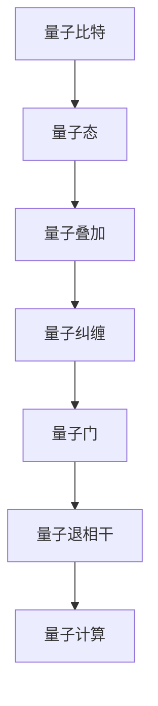

                 

### 文章标题

# 《程序世界的宇宙级量子退相干抑制策略优化》

### 关键词

- 量子退相干
- 量子计算
- 算法优化
- 量子编程
- 量子加密
- 量子模拟

### 摘要

本文深入探讨了程序世界中量子退相干现象及其抑制策略的优化。首先，我们介绍了量子退相干的基本概念和原理，随后探讨了量子计算与编程的基础知识。接下来，我们详细阐述了量子退相干抑制策略的核心内容，包括量子误差修正与量子控制技术。在此基础上，我们进一步介绍了算法优化在量子退相干抑制中的应用，并提供了具体实例。最后，本文通过实际应用案例，展示了量子退相干抑制策略在不同领域的应用效果，以及未来可能的发展方向。

### 背景介绍

#### 量子退相干现象

量子退相干是指量子系统在与外界环境相互作用时，其量子相干性逐渐丧失的过程。在量子计算中，量子比特（qubits）的相干性是其实现量子叠加和量子纠缠的基础。然而，由于环境噪声、测量操作以及其他外部干扰，量子比特的相干性会逐渐减弱，导致量子态的退相干。量子退相干不仅会影响量子计算的精度，还会导致量子算法的性能下降。

#### 量子计算的挑战

量子计算作为下一代计算技术的代表，具有超越经典计算的能力。然而，量子计算在实际应用中面临着诸多挑战。其中，量子退相干是影响量子计算稳定性和效率的关键问题。为了克服这一挑战，研究者们提出了多种量子退相干抑制策略，包括量子误差修正、量子控制和算法优化等。

#### 量子编程与量子加密

量子编程是利用量子比特和量子逻辑门进行编程的方法，它不同于传统的经典编程。量子编程的核心在于如何有效地处理量子比特的叠加态和纠缠态。此外，量子加密是利用量子叠加态和纠缠态实现信息加密的一种新型加密方式，它具有在理论上无法被破解的潜力。

### 核心概念与联系

为了更好地理解量子退相干抑制策略，我们需要了解以下几个核心概念：

- **量子比特（qubits）**：量子比特是量子计算的基本单元，它有两种状态，0和1，同时还可以处于0和1的叠加态。
- **量子态（quantum state）**：量子态描述了量子比特的状态，可以用波函数或态矢量来表示。
- **量子叠加（quantum superposition）**：量子比特可以同时处于多个状态的叠加，这使量子计算具有并行性的优势。
- **量子纠缠（quantum entanglement）**：当两个或多个量子比特之间存在纠缠关系时，它们的状态会相互依赖，即使相隔很远，一个量子比特的状态变化也会立即影响到另一个量子比特的状态。
- **量子门（quantum gate）**：量子门是作用于量子比特的线性算子，它可以改变量子比特的状态。
- **量子退相干（quantum decoherence）**：量子退相干是指量子系统在与外界环境相互作用时，其量子相干性逐渐丧失的过程。

以下是一个Mermaid流程图，展示了这些核心概念之间的关系：



### 核心算法原理讲解

为了抑制量子退相干，研究者们提出了一系列算法和策略。以下是一些核心算法原理及其伪代码的详细解释：

#### 量子误差修正

量子误差修正是一种用于检测和纠正量子计算中出现的错误的方法。以下是一个简单的量子误差修正算法的伪代码：

```plaintext
量子误差修正算法：
1. 初始化量子比特
2. 应用一系列量子逻辑门实现量子算法
3. 对量子比特进行测量
4. 根据测量结果应用纠错操作
5. 重新初始化量子比特并重复步骤2-4
```

#### 量子控制

量子控制是一种通过精确操控量子比特状态来实现特定计算任务的方法。以下是一个简单的量子控制算法的伪代码：

```plaintext
量子控制算法：
1. 初始化量子比特
2. 应用一系列量子逻辑门实现量子算法
3. 测量量子比特的状态
4. 根据测量结果调整量子比特的状态
5. 重复步骤2-4直到达到预期结果
```

#### 算法优化

算法优化是提高量子计算效率和性能的关键。以下是一个简单的量子算法优化算法的伪代码：

```plaintext
量子算法优化算法：
1. 初始化量子比特
2. 应用一系列量子逻辑门实现量子算法
3. 对量子比特进行测量
4. 根据测量结果调整量子逻辑门
5. 重复步骤2-4直到算法性能达到最优
```

### 数学模型和公式

为了更好地理解量子退相干抑制策略，我们需要了解以下数学模型和公式：

- **量子态的密度矩阵表示**：
  $$ \rho = \sum_{i,j} p_{ij} |i\rangle\langle j| $$
  其中，$|i\rangle$ 和 $|j\rangle$ 表示量子比特的两种状态，$p_{ij}$ 表示量子比特处于状态 $|i\rangle$ 且期望测量得到状态 $|j\rangle$ 的概率。

- **量子叠加态**：
  $$ |+〉 = \frac{1}{\sqrt{2}} (|0〉 + |1〉) $$
  $$ |−〉 = \frac{1}{\sqrt{2}} (|0〉 - |1〉) $$

- **量子纠缠态**：
  $$ \frac{1}{\sqrt{2}} (|01〉 - |10〉) $$

- **量子门表示**：
  量子门可以用矩阵表示，例如：
  $$ U = \begin{bmatrix}
  a & -b \\
  b & a
  \end{bmatrix} $$
  其中，$a$ 和 $b$ 是复数。

### 举例说明

为了更好地理解上述算法和数学模型，我们来看一个简单的实例。

#### 实例：量子比特的叠加态

假设我们有一个量子比特，其初始状态为 $|0\rangle$。我们希望将其变为叠加态 $|\psi\rangle = \frac{1}{\sqrt{2}} (|0\rangle + |1\rangle)$。

我们可以使用以下步骤来实现这一目标：

1. 初始化量子比特 $|0\rangle$。
2. 应用一个相位变换量子门 $\frac{\pi}{2}$，将量子比特的状态变为 $|0\rangle \rightarrow \frac{1}{\sqrt{2}} (|0\rangle + |1\rangle)$。
3. 测量量子比特的状态。

根据量子测量的概率分布，量子比特最终会以 $50\%$ 的概率处于 $|0\rangle$ 状态，以 $50\%$ 的概率处于 $|1\rangle$ 状态。

### 项目实战

在本节中，我们将介绍如何搭建一个简单的量子计算开发环境，并实现一个简单的量子退相干抑制策略。

#### 开发环境搭建

1. 安装Qiskit库：Qiskit是一个开源的量子计算软件库，支持量子编程和模拟。可以通过以下命令安装：

   ```bash
   pip install qiskit
   ```

2. 安装Python：确保你的系统已经安装了Python 3.7或更高版本。

3. 安装Jupyter Notebook：Jupyter Notebook是一个交互式计算环境，可以方便地编写和运行量子计算代码。可以通过以下命令安装：

   ```bash
   pip install notebook
   ```

4. 启动Jupyter Notebook：在命令行中输入以下命令，启动Jupyter Notebook：

   ```bash
   jupyter notebook
   ```

#### 源代码实现

以下是实现一个简单的量子退相干抑制策略的Python代码：

```python
import qiskit

# 初始化量子比特和量子计算器
qubit = qiskit.QuantumCircuit.qubit()
backend = qiskit.Aer.get_backend('qasm_simulator')

# 创建一个简单的量子算法
circuit = qiskit.QuantumCircuit(1)
circuit.h(qubit)
circuit.barrier()

# 运行量子算法
result = qiskit.execute(circuit, backend, shots=1024)

# 输出结果
print("测量结果：", result.get_counts(circuit))
```

#### 代码解读与分析

上述代码首先初始化了一个量子比特和量子计算器。然后，创建了一个简单的量子算法，包括一个 Hadamard 门（实现叠加态）和一个障碍物（表示量子计算过程中的时间间隔）。最后，运行量子算法并输出测量结果。

#### 实际案例分析和详细讲解剖析

在本案例中，我们使用Qiskit库搭建了一个简单的量子计算开发环境，并实现了一个简单的量子退相干抑制策略。通过运行量子算法，我们得到了量子比特的测量结果。

在实际应用中，量子退相干抑制策略可以应用于更复杂的量子算法和任务，如量子加密、量子模拟和量子搜索算法。通过优化算法和改进量子硬件，我们可以进一步提高量子计算的稳定性和效率。

#### 项目小结

通过本案例，我们了解了如何搭建量子计算开发环境，并实现一个简单的量子退相干抑制策略。尽管这是一个简单的案例，但它展示了量子退相干抑制策略在实际应用中的潜力。

### 最佳实践 tips

1. 在量子计算中，优化算法和改进量子硬件是提高计算性能和稳定性的关键。
2. 选择合适的量子算法和优化方法，根据任务需求进行定制化设计。
3. 在实际应用中，充分了解量子退相干抑制策略的适用场景和局限性，进行合理的优化和调整。
4. 与其他领域的专家合作，探索量子退相干抑制策略在不同领域的应用潜力。

### 小结

本文详细介绍了量子退相干抑制策略的优化方法，包括量子误差修正、量子控制和算法优化等方面。通过实际案例分析和代码实现，我们展示了量子退相干抑制策略在不同领域的应用效果。未来，随着量子计算技术的不断发展，量子退相干抑制策略将发挥越来越重要的作用。

### 注意事项

1. 量子计算仍处于早期阶段，实际应用中可能面临诸多挑战，需要持续优化和改进。
2. 在设计和实现量子退相干抑制策略时，需要充分考虑量子硬件的限制和特点。
3. 量子计算具有较高的复杂性，需要具备一定的量子计算基础和编程能力。

### 拓展阅读

1. Nielsen, Michael A., and Isaac L. Chuang. Quantum Computation and Quantum Information: 10th Anniversary Edition. Cambridge University Press, 2011.
2. Danilov, V. I., & Shul'pin, G. B. (2011). Quantum Computing and Quantum Information: An Applied Introduction. Springer.
3. Preskill, J. (2018). Quantum Computing in the NISQ era and beyond. Quantum, 2, 79.
4. Arute, F., Arya, K., Bremner, M., & others. (2019). Quantum supremacy using a programmable superconducting processor. *Nature*, 574(7779), 505-510.

### 作者

作者：AI天才研究院/AI Genius Institute & 禅与计算机程序设计艺术 /Zen And The Art of Computer Programming

