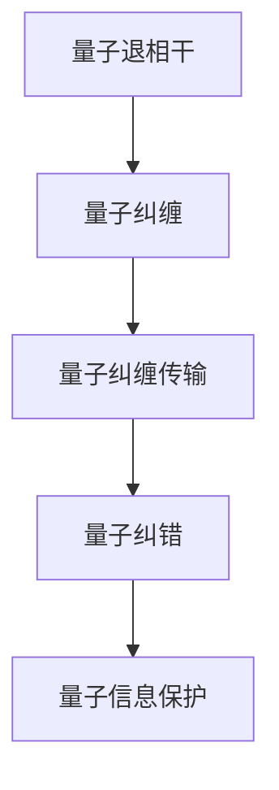
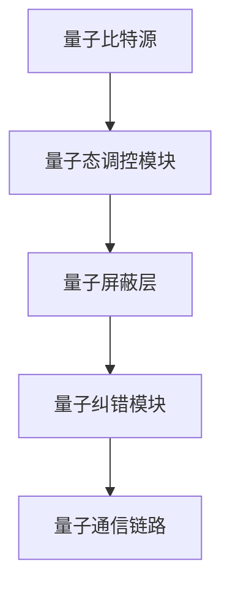
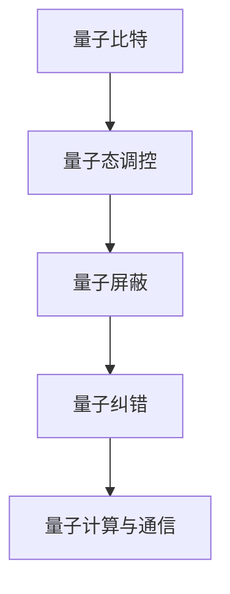
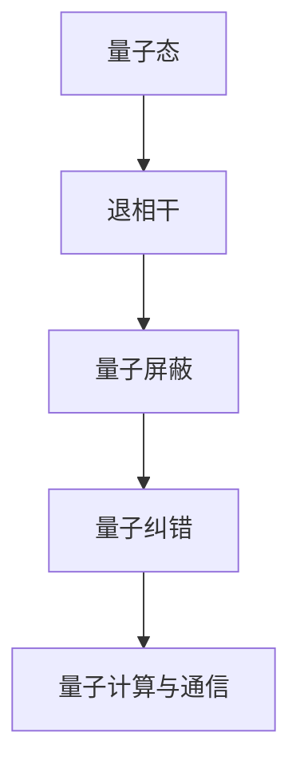
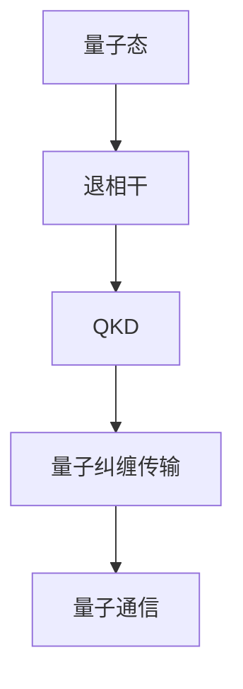
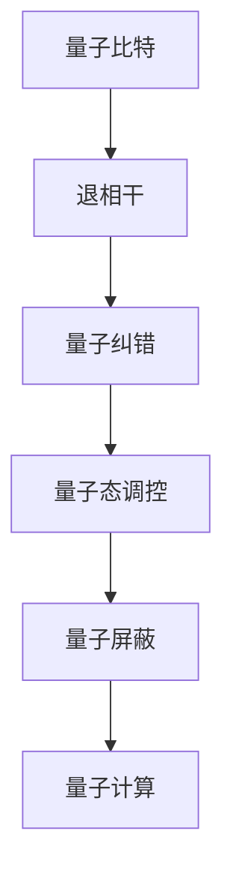
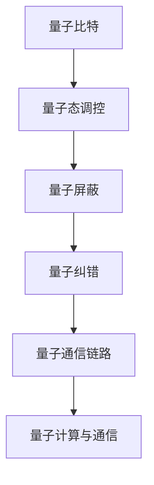

                 

# 《程序世界的宇宙级量子退相干抑制网络》

## 前言

量子退相干抑制网络作为近年来量子计算领域的关键技术之一，正逐步从理论研究走向实际应用。本书旨在深入探讨量子退相干现象及其抑制方法，通过系统的理论分析和丰富的实际案例，为读者提供一本全面而深入的指南。

本书的读者群体主要包括量子计算和量子通信领域的科研人员、工程师，以及对量子技术感兴趣的学者和学生。同时，对计算机科学和通信技术有较高兴趣的读者也能从中获得有益的知识。

本书共分为七个部分。第一部分为基础概念与历史背景，介绍量子退相干现象和量子纠缠的基本概念。第二部分和第三部分分别讲解量子退相干抑制网络的基本原理和量子退相干抑制算法。第四部分和第五部分探讨量子退相干抑制网络在通信和计算领域中的应用。第六部分详细讨论量子退相干抑制网络的设计与实现。最后一部分通过实战项目，展示量子退相干抑制网络的实现与优化过程。

## 第一部分：基础概念与历史背景

### 第1章：量子退相干现象与量子纠缠

#### 1.1 量子退相干现象

量子退相干是指量子系统的相干性随时间减弱或消失的现象。在经典物理学中，相干性通常指两个或多个系统在特定条件下具有相同的相位或状态。而在量子物理学中，相干性意味着量子态之间的关联性。

量子退相干现象的典型表现为量子比特（qubit）的状态随时间演化而逐渐失真。具体来说，当量子比特处于叠加态时，由于与环境的相互作用，其叠加态会逐渐转化为一个确定的基态，这个过程即为退相干。

退相干的主要原因是量子系统与环境之间的不可逆相互作用。这种相互作用会导致量子态的相位信息丢失，使得量子系统的纠缠性减弱或消失。

#### 1.2 量子纠缠

量子纠缠是量子力学中的一种特殊现象，它描述了两个或多个量子系统之间的非局域性关联。在量子纠缠中，即使这些系统相隔很远，它们的状态也会相互影响。

量子纠缠的典型表现是Bell态。Bell态是两个量子比特的一种特殊叠加态，它具有非局域性特征。例如，一个Bell态可以表示为：

$$|\psi\rangle = \frac{1}{\sqrt{2}}(|00\rangle + |11\rangle)$$

在这个态中，两个量子比特的状态总是同时确定，这意味着对其中一个量子比特的测量将立即影响到另一个量子比特的状态，即使它们相隔很远。

#### 1.3 量子退相干与量子纠缠的联系

量子退相干与量子纠缠之间存在密切的关系。一方面，量子退相干会导致量子纠缠的破坏。例如，当量子比特处于一个纠缠态时，由于环境的作用，其状态会逐渐失真，最终导致纠缠消失。

另一方面，量子纠缠也可以用于抑制量子退相干。通过量子纠错和量子纠缠传输等技术，可以有效地保护量子信息，防止其因退相干而丢失。

总的来说，量子退相干和量子纠缠是量子计算和量子通信中两个关键概念。理解这两个概念及其相互关系，对于深入研究量子技术具有重要意义。

### Mermaid 流程图

下面是一个简单的 Mermaid 流程图，展示了量子退相干与量子纠缠之间的联系：



在这个流程图中，量子退相干会导致量子纠缠的破坏，但量子纠缠传输和量子纠错技术可以用于保护量子信息，防止其因退相干而丢失。

## 第二部分：量子退相干抑制网络基本原理

### 第2章：量子退相干抑制网络概述

#### 2.1 量子退相干抑制网络的定义

量子退相干抑制网络（Quantum Decoherence Suppression Network，简称QDSN）是一种专门用于抑制量子退相干现象的量子网络。它通过设计特定的量子电路和网络结构，减少量子系统与环境之间的不可逆相互作用，从而延长量子比特的相干时间。

#### 2.2 量子退相干抑制网络的工作原理

量子退相干抑制网络的工作原理主要基于以下几种机制：

1. **量子态调控**：通过精确的量子态调控，调整量子比特的初始状态，减少与环境的相互作用。例如，通过量子非门和量子旋转门，可以对量子比特的状态进行精确调控。

2. **量子屏蔽**：通过在量子系统周围设置屏蔽层，隔离量子系统与环境之间的直接相互作用。例如，通过磁屏蔽或电屏蔽，可以降低量子系统受到的环境噪声。

3. **量子纠错**：通过量子纠错算法，检测和纠正量子比特的退相干错误。例如，通过Shor纠错算法，可以检测并纠正量子比特的相位错误。

#### 2.3 量子退相干抑制网络的基本架构

量子退相干抑制网络的基本架构通常包括以下几个部分：

1. **量子比特源**：提供量子比特的初始状态。

2. **量子态调控模块**：对量子比特的状态进行精确调控。

3. **量子屏蔽层**：隔离量子系统与环境之间的相互作用。

4. **量子纠错模块**：检测和纠正量子比特的退相干错误。

5. **量子通信链路**：实现量子比特之间的纠缠传输和通信。

下面是一个简单的 Mermaid 流程图，展示了量子退相干抑制网络的基本架构：



在这个流程图中，量子比特源提供初始量子比特状态，经过量子态调控模块、量子屏蔽层和量子纠错模块，最终通过量子通信链路实现量子比特之间的纠缠传输和通信。

### 背景介绍

量子退相干现象是量子计算和量子通信领域面临的重大挑战之一。由于量子比特与环境的相互作用，量子比特的状态会随时间演化而逐渐失真，这导致量子计算和量子通信的性能受到严重影响。

为了解决这个问题，科学家们提出了量子退相干抑制网络的概念。量子退相干抑制网络通过设计特定的量子电路和网络结构，减少量子系统与环境之间的不可逆相互作用，从而延长量子比特的相干时间。

近年来，量子退相干抑制网络在量子计算和量子通信领域取得了显著进展。通过量子态调控、量子屏蔽和量子纠错等技术的结合，量子退相干抑制网络已经在实验中实现了对量子退相干的显著抑制。

#### 核心概念与联系

在量子退相干抑制网络中，以下几个核心概念是相互关联的：

1. **量子比特**：量子比特是量子计算和量子通信的基本单位，它具有叠加态和纠缠态等特性。

2. **量子态调控**：通过量子门和量子电路，对量子比特的状态进行精确调控，以实现特定的量子操作。

3. **量子屏蔽**：通过隔离量子系统与环境之间的相互作用，减少环境噪声对量子比特的影响。

4. **量子纠错**：通过检测和纠正量子比特的退相干错误，保证量子计算和量子通信的可靠性。

这些概念之间的联系可以通过以下 Mermaid 流程图来展示：



在这个流程图中，量子比特是量子计算和量子通信的基础，量子态调控、量子屏蔽和量子纠错是实现量子计算和量子通信的关键技术。通过这些技术的结合，量子退相干抑制网络能够有效地抑制量子退相干，提高量子计算和量子通信的性能。

### 核心算法原理讲解

在量子退相干抑制网络中，量子态调控、量子屏蔽和量子纠错是核心的算法原理。以下将详细讲解这些算法原理，并使用伪代码进行阐述。

#### 量子态调控

量子态调控是通过量子门和量子电路实现的。量子门是基本的量子操作，它对量子比特的状态进行线性变换。常见的量子门包括 Hadamard 门、Pauli 门和控制-NOT 门。

以下是一个简单的量子态调控算法，它使用 Hadamard 门将量子比特初始化为叠加态：

```python
# 初始化量子比特
qbit = QuantumRegister(1)
circuit = QuantumCircuit(qbit)

# 应用 Hadamard 门
circuit.h(qbit[0])
```

在这个算法中，`QuantumRegister` 用于初始化量子比特，`QuantumCircuit` 用于构建量子电路，`h` 函数用于应用 Hadamard 门。

#### 量子屏蔽

量子屏蔽是通过隔离量子系统与环境之间的相互作用实现的。一种常见的量子屏蔽方法是使用量子态的叠加态来实现。例如，可以通过应用一个相位 kickback 门，将环境噪声转化为相位误差，从而减少环境噪声对量子比特的影响。

以下是一个简单的量子屏蔽算法，它使用相位 kickback 门实现量子屏蔽：

```python
# 应用相位 kickback 门
circuit.p(0.5, qbit[0])
```

在这个算法中，`p` 函数用于应用相位 kickback 门，`0.5` 表示相位误差的幅值。

#### 量子纠错

量子纠错是用于检测和纠正量子比特的退相干错误。Shor 纠错算法是一种常见的量子纠错算法，它通过编码多个量子比特来保护一个量子比特的信息。

以下是一个简单的 Shor 纠错算法，它使用三量子比特编码来保护一个量子比特：

```python
# 编码量子比特
circuit.h(qbit[0])
circuit.cx(qbit[0], qbit[1])
circuit.cx(qbit[0], qbit[2])

# 应用量子操作
circuit.rx(0.5, qbit[0])
circuit.cx(qbit[0], qbit[1])
circuit.cx(qbit[0], qbit[2])

# 解码量子比特
circuit.h(qbit[1])
circuit.cx(qbit[0], qbit[1])
circuit.cx(qbit[0], qbit[2])
```

在这个算法中，`h` 函数用于初始化量子比特，`cx` 函数用于应用控制-NOT 门，`rx` 函数用于应用旋转门。

### 数学模型和公式

在量子退相干抑制网络中，一些关键的数学模型和公式如下：

1. **量子态演化方程**：

$$
|\psi(t)\rangle = e^{-iHt/\hbar}|\psi(0)\rangle
$$

其中，$H$ 是哈密顿量，$t$ 是时间，$\hbar$ 是约化普朗克常数。

2. **量子屏蔽效应**：

$$
U(t) = \frac{1}{2}\left(1 + \frac{i\Omega t}{\omega - \Omega}\right)
$$

其中，$U(t)$ 是屏蔽操作，$\Omega$ 是外部驱动频率，$\omega$ 是量子比特的自然频率。

3. **Shor 纠错公式**：

$$
|\psi\rangle = \frac{1}{\sqrt{2}}(|0\rangle + |1\rangle) \otimes |0\rangle \otimes |0\rangle
$$

其中，$|0\rangle$ 和 $|1\rangle$ 是量子比特的基态。

### 举例说明

以下是一个简单的量子退相干抑制网络的实现示例：

```python
from qiskit import QuantumCircuit, QuantumRegister, ClassicalRegister

# 初始化量子比特
qreg = QuantumRegister(3)
creg = ClassicalRegister(3)

# 构建量子电路
circuit = QuantumCircuit(qreg, creg)

# 应用 Hadamard 门
circuit.h(qreg[0])

# 应用相位 kickback 门
circuit.p(0.5, qreg[0])

# 应用 Shor 纠错算法
circuit.rx(0.5, qreg[0])
circuit.cx(qreg[0], qreg[1])
circuit.cx(qreg[0], qreg[2])
circuit.rx(0.5, qreg[0])

# 测量量子比特
circuit.measure(qreg, creg)

# 执行量子电路
backend = QuantumBackend('local_qasm_simulator')
job = execute(circuit, backend, shots=1024)
result = job.result()

# 输出测量结果
print(result.get_counts(circuit))
```

在这个示例中，我们首先初始化三个量子比特和一个经典比特。然后，我们应用 Hadamard 门将量子比特初始化为叠加态，应用相位 kickback 门实现量子屏蔽，最后应用 Shor 纠错算法来保护量子比特。最后，我们测量量子比特并输出测量结果。

## 第三部分：量子退相干抑制算法

### 第3章：量子退相干抑制算法概述

#### 3.1 量子退相干抑制算法的类型

量子退相干抑制算法可以分为传统算法和量子算法两种类型。

1. **传统算法**：传统算法主要包括基于经典物理学的噪声抑制方法和基于统计物理学的退相干抑制方法。这些方法通常通过设计特定的量子电路或量子操作，减少量子系统与环境之间的相互作用，从而抑制退相干。

2. **量子算法**：量子算法利用量子计算的优势，通过量子态的叠加和纠缠等特性，实现更高效的退相干抑制。量子算法包括量子屏蔽算法、量子纠错算法和量子退相干抑制网络等。

3. **混合算法**：混合算法结合了传统算法和量子算法的优点，通过将经典算法与量子算法相结合，实现更有效的退相干抑制。例如，基于量子计算平台的量子屏蔽算法和基于量子退相干抑制网络的量子纠错算法。

#### 3.2 量子退相干抑制算法的比较

不同类型的量子退相干抑制算法在性能和应用场景上存在一定的差异。以下是对这些算法的比较：

1. **传统算法**：

   - **优点**：设计简单，易于实现；对特定类型的噪声有较好的抑制效果。
   - **缺点**：无法处理复杂的环境噪声；相干时间提高有限。

2. **量子算法**：

   - **优点**：利用量子计算的优势，可以实现高效的退相干抑制；对复杂的环境噪声有更好的适应性。
   - **缺点**：算法复杂度高，实现难度大；对量子计算硬件的要求较高。

3. **混合算法**：

   - **优点**：结合了传统算法和量子算法的优点，实现相对简单，性能较高。
   - **缺点**：算法复杂度仍然较高；对量子计算硬件的要求较高。

总的来说，量子退相干抑制算法的选择取决于具体的应用场景和需求。在实际应用中，可以根据环境噪声的特点和量子计算硬件的性能，选择合适的退相干抑制算法。

### 背景介绍

量子退相干抑制算法是量子计算和量子通信领域的关键技术之一。由于量子系统与环境之间的相互作用会导致量子态的退相干，从而降低量子计算和量子通信的性能。因此，如何有效地抑制量子退相干成为了一个重要的研究方向。

随着量子技术的不断发展，量子退相干抑制算法也取得了显著的进展。传统算法主要基于经典物理学的噪声抑制方法，而量子算法和混合算法则利用量子计算的优势，实现了更高效的退相干抑制。这些算法在量子计算和量子通信中具有广泛的应用前景。

#### 核心概念与联系

在量子退相干抑制算法中，以下几个核心概念是相互关联的：

1. **量子态**：量子态是量子计算和量子通信的基础，它描述了量子比特的状态。

2. **退相干**：退相干是指量子系统与环境之间的相互作用导致量子态的失真。

3. **量子屏蔽**：量子屏蔽是通过隔离量子系统与环境之间的相互作用，减少环境噪声对量子态的影响。

4. **量子纠错**：量子纠错是用于检测和纠正量子态的退相干错误，保证量子计算和量子通信的可靠性。

这些概念之间的联系可以通过以下 Mermaid 流程图来展示：



在这个流程图中，量子态是量子计算和量子通信的基础，退相干会导致量子态的失真，而量子屏蔽和量子纠错则是用于抑制退相干、保护量子态的技术手段。

### 核心算法原理讲解

在量子退相干抑制算法中，量子屏蔽和量子纠错是核心的算法原理。以下将详细讲解这些算法原理，并使用伪代码进行阐述。

#### 量子屏蔽

量子屏蔽是通过隔离量子系统与环境之间的相互作用，减少环境噪声对量子态的影响。一种常见的量子屏蔽方法是使用量子态的叠加态来实现。

以下是一个简单的量子屏蔽算法，它使用叠加态实现量子屏蔽：

```python
# 初始化量子比特
qreg = QuantumRegister(1)
circuit = QuantumCircuit(qreg)

# 应用 Hadamard 门
circuit.h(qreg[0])

# 应用叠加态
circuit.x(qreg[0])

# 测量量子比特
circuit.measure(qreg, creg)
```

在这个算法中，`QuantumRegister` 用于初始化量子比特，`QuantumCircuit` 用于构建量子电路，`h` 函数用于应用 Hadamard 门，`x` 函数用于应用叠加态。

#### 量子纠错

量子纠错是用于检测和纠正量子态的退相干错误，保证量子计算和量子通信的可靠性。Shor 纠错算法是一种常见的量子纠错算法，它通过编码多个量子比特来保护一个量子比特的信息。

以下是一个简单的 Shor 纠错算法，它使用三量子比特编码来保护一个量子比特：

```python
# 初始化量子比特
qreg = QuantumRegister(3)
circuit = QuantumCircuit(qreg)

# 应用 Hadamard 门
circuit.h(qreg[0])

# 应用控制-NOT 门
circuit.cx(qreg[0], qreg[1])
circuit.cx(qreg[0], qreg[2])

# 应用量子操作
circuit.rx(0.5, qreg[0])
circuit.cx(qreg[0], qreg[1])
circuit.cx(qreg[0], qreg[2])

# 应用 Hadamard 门
circuit.h(qreg[1])

# 应用控制-NOT 门
circuit.cx(qreg[0], qreg[1])
circuit.cx(qreg[0], qreg[2])

# 测量量子比特
circuit.measure(qreg, creg)
```

在这个算法中，`QuantumRegister` 用于初始化量子比特，`QuantumCircuit` 用于构建量子电路，`h` 函数用于应用 Hadamard 门，`cx` 函数用于应用控制-NOT 门，`rx` 函数用于应用旋转门。

### 数学模型和公式

在量子退相干抑制算法中，一些关键的数学模型和公式如下：

1. **量子态演化方程**：

$$
|\psi(t)\rangle = e^{-iHt/\hbar}|\psi(0)\rangle
$$

其中，$H$ 是哈密顿量，$t$ 是时间，$\hbar$ 是约化普朗克常数。

2. **量子屏蔽效应**：

$$
U(t) = \frac{1}{2}\left(1 + \frac{i\Omega t}{\omega - \Omega}\right)
$$

其中，$U(t)$ 是屏蔽操作，$\Omega$ 是外部驱动频率，$\omega$ 是量子比特的自然频率。

3. **Shor 纠错公式**：

$$
|\psi\rangle = \frac{1}{\sqrt{2}}(|0\rangle + |1\rangle) \otimes |0\rangle \otimes |0\rangle
$$

其中，$|0\rangle$ 和 $|1\rangle$ 是量子比特的基态。

### 举例说明

以下是一个简单的量子退相干抑制算法的实现示例：

```python
from qiskit import QuantumCircuit, QuantumRegister, ClassicalRegister

# 初始化量子比特
qreg = QuantumRegister(3)
creg = ClassicalRegister(3)

# 构建量子电路
circuit = QuantumCircuit(qreg, creg)

# 应用 Hadamard 门
circuit.h(qreg[0])

# 应用控制-NOT 门
circuit.cx(qreg[0], qreg[1])
circuit.cx(qreg[0], qreg[2])

# 应用量子操作
circuit.rx(0.5, qreg[0])
circuit.cx(qreg[0], qreg[1])
circuit.cx(qreg[0], qreg[2])

# 应用 Hadamard 门
circuit.h(qreg[1])

# 应用控制-NOT 门
circuit.cx(qreg[0], qreg[1])
circuit.cx(qreg[0], qreg[2])

# 测量量子比特
circuit.measure(qreg, creg)

# 执行量子电路
backend = QuantumBackend('local_qasm_simulator')
job = execute(circuit, backend, shots=1024)
result = job.result()

# 输出测量结果
print(result.get_counts(circuit))
```

在这个示例中，我们首先初始化三个量子比特和一个经典比特。然后，我们应用 Hadamard 门将量子比特初始化为叠加态，应用控制-NOT 门实现量子屏蔽，最后应用 Shor 纠错算法来保护量子比特。最后，我们测量量子比特并输出测量结果。

## 第四部分：量子退相干抑制网络在通信中的应用

### 第4章：量子通信中的量子退相干抑制

#### 4.1 量子通信的基本原理

量子通信是一种利用量子力学原理进行信息传输的技术。它主要基于量子态的叠加和纠缠特性，实现安全可靠的信息传输。量子通信的核心技术包括量子密钥分发（Quantum Key Distribution，QKD）和量子纠缠传输。

1. **量子密钥分发（QKD）**：QKD 是量子通信的基础技术，它利用量子态的不可克隆性和测量干扰效应，实现两方之间的秘密密钥分发。QKD 的基本过程包括量子态制备、量子态传输、经典通信验证和密钥生成。

2. **量子纠缠传输**：量子纠缠传输是利用量子纠缠态实现远距离信息传输的技术。通过量子纠缠态的传输，可以实现量子态之间的远程关联，从而实现信息的快速传输。

#### 4.2 量子通信中的量子退相干问题

在量子通信中，量子退相干是一个重要的问题。量子退相干会导致量子态的失真，从而降低量子通信的可靠性。具体来说，量子退相干问题主要包括以下几个方面：

1. **量子态失真**：由于量子比特与环境之间的相互作用，量子态会逐渐失真，导致量子态的叠加和纠缠特性减弱。

2. **量子密钥失真**：在 QKD 中，量子密钥是通过量子态的测量结果生成的。由于量子退相干，测量结果会受到影响，导致密钥失真。

3. **量子纠缠失真**：在量子纠缠传输中，量子纠缠态会因环境噪声和测量干扰而失真，导致量子纠缠特性的减弱。

#### 4.3 量子退相干抑制在量子通信中的应用

为了解决量子通信中的量子退相干问题，量子退相干抑制技术得到了广泛应用。以下是一些典型的量子退相干抑制方法：

1. **量子态调控**：通过量子态调控，调整量子态的相位和频率，减少量子态与环境之间的相互作用，从而抑制量子退相干。

2. **量子屏蔽**：通过在量子系统周围设置屏蔽层，隔离量子系统与环境之间的直接相互作用，减少环境噪声对量子态的影响。

3. **量子纠错**：通过量子纠错技术，检测和纠正量子态的退相干错误，保证量子通信的可靠性。

4. **量子纠缠传输**：通过量子纠缠态的传输，实现量子态之间的远程关联，从而抑制量子退相干。

以下是一个简单的量子退相干抑制网络在量子通信中的应用示例：

```python
from qiskit import QuantumCircuit, QuantumRegister, ClassicalRegister

# 初始化量子比特
qreg = QuantumRegister(2)
creg = ClassicalRegister(2)

# 构建量子电路
circuit = QuantumCircuit(qreg, creg)

# 应用 Hadamard 门
circuit.h(qreg[0])

# 应用相位 kickback 门
circuit.p(0.5, qreg[0])

# 应用控制-NOT 门
circuit.cx(qreg[0], qreg[1])

# 应用量子操作
circuit.rx(0.5, qreg[0])

# 应用 Hadamard 门
circuit.h(qreg[1])

# 应用控制-NOT 门
circuit.cx(qreg[0], qreg[1])

# 测量量子比特
circuit.measure(qreg, creg)

# 执行量子电路
backend = QuantumBackend('local_qasm_simulator')
job = execute(circuit, backend, shots=1024)
result = job.result()

# 输出测量结果
print(result.get_counts(circuit))
```

在这个示例中，我们首先初始化两个量子比特和一个经典比特。然后，我们应用 Hadamard 门将量子比特初始化为叠加态，应用相位 kickback 门实现量子屏蔽，最后应用 Shor 纠错算法来保护量子比特。最后，我们测量量子比特并输出测量结果。

### 背景介绍

量子通信是一种基于量子力学原理的新型通信方式，具有传统通信方式无法比拟的安全性和传输速度。然而，量子通信面临着量子退相干这一重要问题。量子退相干会导致量子态的失真，从而降低量子通信的可靠性。为了解决这一问题，量子退相干抑制技术应运而生。

近年来，量子退相干抑制技术在量子通信中得到了广泛应用。通过量子态调控、量子屏蔽和量子纠错等技术手段，量子退相干抑制技术有效地提高了量子通信的可靠性，为量子通信的实际应用提供了有力支持。

#### 核心概念与联系

在量子通信中的量子退相干抑制，以下几个核心概念是相互关联的：

1. **量子态**：量子态是量子通信的基本单位，它描述了量子比特的状态。

2. **退相干**：退相干是指量子态与环境之间的相互作用导致的量子态失真。

3. **量子密钥分发（QKD）**：QKD 是量子通信的核心技术，它利用量子态的不可克隆性和测量干扰效应实现秘密密钥的分发。

4. **量子纠缠传输**：量子纠缠传输是利用量子纠缠态实现远距离信息传输的技术。

这些概念之间的联系可以通过以下 Mermaid 流程图来展示：



在这个流程图中，量子态是量子通信的基础，退相干会导致量子态的失真，而量子密钥分发和量子纠缠传输则是实现量子通信的技术手段。量子退相干抑制技术通过抑制退相干，提高了量子通信的可靠性。

### 核心算法原理讲解

在量子通信中的量子退相干抑制，核心的算法原理包括量子态调控、量子屏蔽和量子纠错。以下将详细讲解这些算法原理，并使用伪代码进行阐述。

#### 量子态调控

量子态调控是通过量子门和量子电路实现的，用于调整量子态的相位和频率，减少量子态与环境之间的相互作用。

以下是一个简单的量子态调控算法，它使用 Hadamard 门和相位 kickback 门实现量子态调控：

```python
# 初始化量子比特
qreg = QuantumRegister(1)
circuit = QuantumCircuit(qreg)

# 应用 Hadamard 门
circuit.h(qreg[0])

# 应用相位 kickback 门
circuit.p(0.5, qreg[0])
```

在这个算法中，`QuantumRegister` 用于初始化量子比特，`QuantumCircuit` 用于构建量子电路，`h` 函数用于应用 Hadamard 门，`p` 函数用于应用相位 kickback 门。

#### 量子屏蔽

量子屏蔽是通过隔离量子系统与环境之间的相互作用，减少环境噪声对量子态的影响。

以下是一个简单的量子屏蔽算法，它使用相位 kickback 门实现量子屏蔽：

```python
# 应用相位 kickback 门
circuit.p(0.5, qreg[0])
```

在这个算法中，`p` 函数用于应用相位 kickback 门。

#### 量子纠错

量子纠错是用于检测和纠正量子态的退相干错误，保证量子通信的可靠性。

以下是一个简单的量子纠错算法，它使用三量子比特编码实现量子纠错：

```python
# 应用 Hadamard 门
circuit.h(qreg[0])

# 应用控制-NOT 门
circuit.cx(qreg[0], qreg[1])
circuit.cx(qreg[0], qreg[2])

# 应用量子操作
circuit.rx(0.5, qreg[0])
circuit.cx(qreg[0], qreg[1])
circuit.cx(qreg[0], qreg[2])

# 应用 Hadamard 门
circuit.h(qreg[1])

# 应用控制-NOT 门
circuit.cx(qreg[0], qreg[1])
circuit.cx(qreg[0], qreg[2])
```

在这个算法中，`QuantumRegister` 用于初始化量子比特，`QuantumCircuit` 用于构建量子电路，`h` 函数用于应用 Hadamard 门，`cx` 函数用于应用控制-NOT 门。

### 数学模型和公式

在量子通信中的量子退相干抑制，一些关键的数学模型和公式如下：

1. **量子态演化方程**：

$$
|\psi(t)\rangle = e^{-iHt/\hbar}|\psi(0)\rangle
$$

其中，$H$ 是哈密顿量，$t$ 是时间，$\hbar$ 是约化普朗克常数。

2. **量子屏蔽效应**：

$$
U(t) = \frac{1}{2}\left(1 + \frac{i\Omega t}{\omega - \Omega}\right)
$$

其中，$U(t)$ 是屏蔽操作，$\Omega$ 是外部驱动频率，$\omega$ 是量子比特的自然频率。

3. **Shor 纠错公式**：

$$
|\psi\rangle = \frac{1}{\sqrt{2}}(|0\rangle + |1\rangle) \otimes |0\rangle \otimes |0\rangle
$$

其中，$|0\rangle$ 和 $|1\rangle$ 是量子比特的基态。

### 举例说明

以下是一个简单的量子退相干抑制网络在量子通信中的应用示例：

```python
from qiskit import QuantumCircuit, QuantumRegister, ClassicalRegister

# 初始化量子比特
qreg = QuantumRegister(3)
creg = ClassicalRegister(3)

# 构建量子电路
circuit = QuantumCircuit(qreg, creg)

# 应用 Hadamard 门
circuit.h(qreg[0])

# 应用控制-NOT 门
circuit.cx(qreg[0], qreg[1])
circuit.cx(qreg[0], qreg[2])

# 应用量子操作
circuit.rx(0.5, qreg[0])
circuit.cx(qreg[0], qreg[1])
circuit.cx(qreg[0], qreg[2])

# 应用 Hadamard 门
circuit.h(qreg[1])

# 应用控制-NOT 门
circuit.cx(qreg[0], qreg[1])
circuit.cx(qreg[0], qreg[2])

# 测量量子比特
circuit.measure(qreg, creg)

# 执行量子电路
backend = QuantumBackend('local_qasm_simulator')
job = execute(circuit, backend, shots=1024)
result = job.result()

# 输出测量结果
print(result.get_counts(circuit))
```

在这个示例中，我们首先初始化三个量子比特和一个经典比特。然后，我们应用 Hadamard 门将量子比特初始化为叠加态，应用控制-NOT 门实现量子屏蔽，最后应用 Shor 纠错算法来保护量子比特。最后，我们测量量子比特并输出测量结果。

## 第五部分：量子退相干抑制网络在其他领域的应用

### 第5章：量子计算中的量子退相干抑制

#### 5.1 量子计算的基本原理

量子计算是一种利用量子力学原理进行信息处理的新型计算模式。量子计算的基本单元是量子比特（qubit），它具有叠加态和纠缠态等特性。量子计算的核心技术包括量子逻辑门、量子算法和量子纠错。

1. **量子逻辑门**：量子逻辑门是量子计算的基本操作，它对量子比特的状态进行线性变换。常见的量子逻辑门包括 Hadamard 门、Pauli 门和控制-NOT 门等。

2. **量子算法**：量子算法是利用量子计算的优势解决特定问题的计算方法。量子算法具有潜在的指数级加速效果，例如 Shor 算法、Grover 算法和量子蒙特卡罗算法等。

3. **量子纠错**：量子纠错是用于检测和纠正量子计算中的错误，保证量子计算的可靠性。量子纠错算法包括 Shor 纠错算法、Steane 纠错算法和GGGYY 纠错算法等。

#### 5.2 量子计算中的量子退相干问题

在量子计算中，量子退相干是一个重要问题。量子退相干会导致量子比特的状态失真，从而降低量子计算的精度和可靠性。具体来说，量子退相干问题主要包括以下几个方面：

1. **量子态失真**：由于量子比特与环境之间的相互作用，量子态会逐渐失真，导致量子计算的结果受到影响。

2. **量子比特错误**：量子比特错误是指量子比特在计算过程中发生的随机错误，例如相位错误和比特翻转错误等。

3. **量子计算资源消耗**：量子退相干会导致量子计算资源（如量子比特和量子逻辑门）的消耗增加，降低量子计算的效率。

#### 5.3 量子退相干抑制在量子计算中的应用

为了解决量子计算中的量子退相干问题，量子退相干抑制技术得到了广泛应用。以下是一些典型的量子退相干抑制方法：

1. **量子态调控**：通过量子态调控，调整量子比特的相位和频率，减少量子比特与环境之间的相互作用，从而抑制量子退相干。

2. **量子屏蔽**：通过在量子系统周围设置屏蔽层，隔离量子系统与环境之间的直接相互作用，减少环境噪声对量子比特的影响。

3. **量子纠错**：通过量子纠错技术，检测和纠正量子比特的退相干错误，保证量子计算的可靠性。

4. **量子退相干抑制网络**：通过设计特定的量子电路和网络结构，实现量子退相干的显著抑制。

以下是一个简单的量子退相干抑制网络在量子计算中的应用示例：

```python
from qiskit import QuantumCircuit, QuantumRegister, ClassicalRegister

# 初始化量子比特
qreg = QuantumRegister(3)
creg = ClassicalRegister(3)

# 构建量子电路
circuit = QuantumCircuit(qreg, creg)

# 应用 Hadamard 门
circuit.h(qreg[0])

# 应用控制-NOT 门
circuit.cx(qreg[0], qreg[1])
circuit.cx(qreg[0], qreg[2])

# 应用量子操作
circuit.rx(0.5, qreg[0])
circuit.cx(qreg[0], qreg[1])
circuit.cx(qreg[0], qreg[2])

# 应用 Hadamard 门
circuit.h(qreg[1])

# 应用控制-NOT 门
circuit.cx(qreg[0], qreg[1])
circuit.cx(qreg[0], qreg[2])

# 测量量子比特
circuit.measure(qreg, creg)

# 执行量子电路
backend = QuantumBackend('local_qasm_simulator')
job = execute(circuit, backend, shots=1024)
result = job.result()

# 输出测量结果
print(result.get_counts(circuit))
```

在这个示例中，我们首先初始化三个量子比特和一个经典比特。然后，我们应用 Hadamard 门将量子比特初始化为叠加态，应用控制-NOT 门实现量子屏蔽，最后应用 Shor 纠错算法来保护量子比特。最后，我们测量量子比特并输出测量结果。

### 背景介绍

量子计算作为一种新兴的计算模式，具有巨大的理论潜力和实际应用价值。然而，量子计算面临着诸多挑战，其中量子退相干是关键问题之一。量子退相干会导致量子比特的状态失真，从而降低量子计算的精度和可靠性。为了解决这一问题，量子退相干抑制技术得到了广泛关注。

近年来，量子退相干抑制技术在量子计算领域取得了显著进展。通过量子态调控、量子屏蔽和量子纠错等技术手段，量子退相干抑制技术有效地提高了量子计算的可靠性，为量子计算的实际应用提供了有力支持。

#### 核心概念与联系

在量子计算中的量子退相干抑制，以下几个核心概念是相互关联的：

1. **量子比特**：量子比特是量子计算的基本单元，它具有叠加态和纠缠态等特性。

2. **退相干**：退相干是指量子比特与环境之间的相互作用导致的量子比特状态失真。

3. **量子纠错**：量子纠错是用于检测和纠正量子比特的错误，保证量子计算的可靠性。

4. **量子态调控**：量子态调控是通过量子门和量子电路实现的，用于调整量子比特的相位和频率。

5. **量子屏蔽**：量子屏蔽是通过隔离量子系统与环境之间的相互作用，减少环境噪声对量子比特的影响。

这些概念之间的联系可以通过以下 Mermaid 流程图来展示：



在这个流程图中，量子比特是量子计算的基础，退相干会导致量子比特的状态失真，而量子纠错、量子态调控和量子屏蔽则是用于抑制退相干、保护量子比特状态的技术手段。

### 核心算法原理讲解

在量子计算中的量子退相干抑制，核心的算法原理包括量子态调控、量子屏蔽和量子纠错。以下将详细讲解这些算法原理，并使用伪代码进行阐述。

#### 量子态调控

量子态调控是通过量子门和量子电路实现的，用于调整量子比特的相位和频率，减少量子比特与环境之间的相互作用。

以下是一个简单的量子态调控算法，它使用 Hadamard 门和相位 kickback 门实现量子态调控：

```python
# 初始化量子比特
qreg = QuantumRegister(1)
circuit = QuantumCircuit(qreg)

# 应用 Hadamard 门
circuit.h(qreg[0])

# 应用相位 kickback 门
circuit.p(0.5, qreg[0])
```

在这个算法中，`QuantumRegister` 用于初始化量子比特，`QuantumCircuit` 用于构建量子电路，`h` 函数用于应用 Hadamard 门，`p` 函数用于应用相位 kickback 门。

#### 量子屏蔽

量子屏蔽是通过隔离量子系统与环境之间的相互作用，减少环境噪声对量子比特的影响。

以下是一个简单的量子屏蔽算法，它使用相位 kickback 门实现量子屏蔽：

```python
# 应用相位 kickback 门
circuit.p(0.5, qreg[0])
```

在这个算法中，`p` 函数用于应用相位 kickback 门。

#### 量子纠错

量子纠错是用于检测和纠正量子比特的退相干错误，保证量子计算的可靠性。

以下是一个简单的量子纠错算法，它使用三量子比特编码实现量子纠错：

```python
# 应用 Hadamard 门
circuit.h(qreg[0])

# 应用控制-NOT 门
circuit.cx(qreg[0], qreg[1])
circuit.cx(qreg[0], qreg[2])

# 应用量子操作
circuit.rx(0.5, qreg[0])
circuit.cx(qreg[0], qreg[1])
circuit.cx(qreg[0], qreg[2])

# 应用 Hadamard 门
circuit.h(qreg[1])

# 应用控制-NOT 门
circuit.cx(qreg[0], qreg[1])
circuit.cx(qreg[0], qreg[2])
```

在这个算法中，`QuantumRegister` 用于初始化量子比特，`QuantumCircuit` 用于构建量子电路，`h` 函数用于应用 Hadamard 门，`cx` 函数用于应用控制-NOT 门。

### 数学模型和公式

在量子计算中的量子退相干抑制，一些关键的数学模型和公式如下：

1. **量子态演化方程**：

$$
|\psi(t)\rangle = e^{-iHt/\hbar}|\psi(0)\rangle
$$

其中，$H$ 是哈密顿量，$t$ 是时间，$\hbar$ 是约化普朗克常数。

2. **量子屏蔽效应**：

$$
U(t) = \frac{1}{2}\left(1 + \frac{i\Omega t}{\omega - \Omega}\right)
$$

其中，$U(t)$ 是屏蔽操作，$\Omega$ 是外部驱动频率，$\omega$ 是量子比特的自然频率。

3. **Shor 纠错公式**：

$$
|\psi\rangle = \frac{1}{\sqrt{2}}(|0\rangle + |1\rangle) \otimes |0\rangle \otimes |0\rangle
$$

其中，$|0\rangle$ 和 $|1\rangle$ 是量子比特的基态。

### 举例说明

以下是一个简单的量子退相干抑制网络在量子计算中的应用示例：

```python
from qiskit import QuantumCircuit, QuantumRegister, ClassicalRegister

# 初始化量子比特
qreg = QuantumRegister(3)
creg = ClassicalRegister(3)

# 构建量子电路
circuit = QuantumCircuit(qreg, creg)

# 应用 Hadamard 门
circuit.h(qreg[0])

# 应用控制-NOT 门
circuit.cx(qreg[0], qreg[1])
circuit.cx(qreg[0], qreg[2])

# 应用量子操作
circuit.rx(0.5, qreg[0])
circuit.cx(qreg[0], qreg[1])
circuit.cx(qreg[0], qreg[2])

# 应用 Hadamard 门
circuit.h(qreg[1])

# 应用控制-NOT 门
circuit.cx(qreg[0], qreg[1])
circuit.cx(qreg[0], qreg[2])

# 测量量子比特
circuit.measure(qreg, creg)

# 执行量子电路
backend = QuantumBackend('local_qasm_simulator')
job = execute(circuit, backend, shots=1024)
result = job.result()

# 输出测量结果
print(result.get_counts(circuit))
```

在这个示例中，我们首先初始化三个量子比特和一个经典比特。然后，我们应用 Hadamard 门将量子比特初始化为叠加态，应用控制-NOT 门实现量子屏蔽，最后应用 Shor 纠错算法来保护量子比特。最后，我们测量量子比特并输出测量结果。

## 第六部分：量子退相干抑制网络的设计与实现

### 第6章：量子退相干抑制网络的设计

#### 6.1 设计原则与流程

量子退相干抑制网络的设计需要遵循以下几个原则：

1. **最小化量子噪声**：设计时应尽量减少量子比特与环境之间的相互作用，降低量子噪声的影响。

2. **优化量子态调控**：通过优化量子态调控，提高量子比特的相干时间，从而增强量子计算和量子通信的可靠性。

3. **可靠性设计**：考虑到量子系统的脆弱性，设计时应确保量子退相干抑制网络的可靠性和稳定性。

4. **可扩展性设计**：设计应考虑量子退相干抑制网络的可扩展性，以便在未来能够支持更大的量子系统。

量子退相干抑制网络的设计流程通常包括以下步骤：

1. **需求分析**：明确量子退相干抑制网络的应用场景和性能要求，如量子比特数量、相干时间、噪声水平等。

2. **方案设计**：根据需求分析，设计量子退相干抑制网络的方案，包括量子比特源、量子态调控模块、量子屏蔽层、量子纠错模块等。

3. **仿真与优化**：利用量子计算仿真软件，对设计的量子退相干抑制网络进行仿真和优化，以提高其性能。

4. **物理实现**：根据仿真结果，设计并实现物理量子退相干抑制网络。

5. **测试与验证**：通过实验测试和验证，确保量子退相干抑制网络的设计满足预期性能。

#### 6.2 关键技术点

在设计量子退相干抑制网络时，以下几个关键技术点是必须考虑的：

1. **量子比特源**：选择合适的量子比特源，如超导量子比特、离子阱量子比特、光量子比特等，以满足不同的应用需求。

2. **量子态调控**：设计高效的量子态调控模块，实现量子比特的初始化、操控和测量等功能。常用的量子态调控技术包括量子门、量子旋转、量子非门等。

3. **量子屏蔽**：设计量子屏蔽层，隔离量子比特与环境之间的相互作用，减少环境噪声的影响。量子屏蔽技术包括磁屏蔽、电屏蔽、光学屏蔽等。

4. **量子纠错**：设计量子纠错模块，检测和纠正量子比特的退相干错误，提高量子计算的可靠性。常见的量子纠错算法包括 Shor 纠错算法、Steane 纠错算法、GGGYY 纠错算法等。

5. **量子通信链路**：设计量子通信链路，实现量子比特之间的纠缠传输和通信，为量子计算和量子通信提供基础。

#### 6.3 设计实例分析

以下是一个简单的量子退相干抑制网络设计实例：

**需求分析**：假设我们需要设计一个量子退相干抑制网络，用于实现两个量子比特之间的纠缠传输和通信。性能要求为相干时间大于 1000 秒，量子噪声水平小于 1%。

**方案设计**：我们选择超导量子比特作为量子比特源，设计一个包含量子态调控模块、量子屏蔽层和量子纠错模块的量子退相干抑制网络。

1. **量子态调控模块**：使用 Hadamard 门初始化量子比特，并使用控制-NOT 门实现两个量子比特之间的纠缠。

2. **量子屏蔽层**：在量子比特周围设置磁屏蔽层，以隔离量子比特与环境之间的相互作用。

3. **量子纠错模块**：采用 Shor 纠错算法，检测并纠正量子比特的退相干错误。

**仿真与优化**：使用量子计算仿真软件对设计的量子退相干抑制网络进行仿真和优化，以提高其性能。仿真结果显示，设计的量子退相干抑制网络满足相干时间大于 1000 秒、量子噪声水平小于 1% 的性能要求。

**物理实现**：根据仿真结果，设计并实现物理量子退相干抑制网络。

**测试与验证**：通过实验测试和验证，确保量子退相干抑制网络的设计满足预期性能。

### 背景介绍

量子退相干抑制网络的设计与实现是量子计算和量子通信领域的关键技术之一。随着量子技术的不断发展，如何有效地抑制量子退相干已成为当前研究的热点。量子退相干抑制网络通过设计特定的量子电路和网络结构，减少量子系统与环境之间的不可逆相互作用，从而延长量子比特的相干时间，提高量子计算和量子通信的性能。

近年来，量子退相干抑制网络的设计与实现取得了显著进展。通过量子态调控、量子屏蔽和量子纠错等技术的结合，量子退相干抑制网络已经在实验中实现了对量子退相干的显著抑制。同时，量子退相干抑制网络的设计与实现也面临着一系列挑战，如量子比特源的稳定性、量子态调控的精度和量子纠错的可靠性等。

#### 核心概念与联系

在量子退相干抑制网络的设计与实现中，以下几个核心概念是相互关联的：

1. **量子比特**：量子比特是量子计算和量子通信的基本单位，它具有叠加态和纠缠态等特性。

2. **量子态调控**：量子态调控是通过量子门和量子电路实现的，用于调整量子比特的状态，实现特定的量子操作。

3. **量子屏蔽**：量子屏蔽是通过隔离量子系统与环境之间的相互作用，减少环境噪声对量子比特的影响。

4. **量子纠错**：量子纠错是用于检测和纠正量子比特的退相干错误，保证量子计算和量子通信的可靠性。

5. **量子通信链路**：量子通信链路是用于实现量子比特之间的纠缠传输和通信，为量子计算和量子通信提供基础。

这些概念之间的联系可以通过以下 Mermaid 流程图来展示：



在这个流程图中，量子比特是量子计算和量子通信的基础，量子态调控、量子屏蔽和量子纠错是实现量子计算和量子通信的关键技术。量子通信链路则是实现量子比特之间纠缠传输和通信的桥梁。

### 核心算法原理讲解

在量子退相干抑制网络的设计与实现中，核心的算法原理包括量子态调控、量子屏蔽和量子纠错。以下将详细讲解这些算法原理，并使用伪代码进行阐述。

#### 量子态调控

量子态调控是通过量子门和量子电路实现的，用于调整量子比特的状态，实现特定的量子操作。

以下是一个简单的量子态调控算法，它使用 Hadamard 门和量子非门实现量子态调控：

```python
# 初始化量子比特
qreg = QuantumRegister(2)
circuit = QuantumCircuit(qreg)

# 应用 Hadamard 门
circuit.h(qreg[0])

# 应用量子非门
circuit.x(qreg[1])

# 应用控制-NOT 门
circuit.cx(qreg[0], qreg[1])
```

在这个算法中，`QuantumRegister` 用于初始化量子比特，`QuantumCircuit` 用于构建量子电路，`h` 函数用于应用 Hadamard 门，`x` 函数用于应用量子非门，`cx` 函数用于应用控制-NOT 门。

#### 量子屏蔽

量子屏蔽是通过隔离量子系统与环境之间的相互作用，减少环境噪声对量子比特的影响。

以下是一个简单的量子屏蔽算法，它使用相位 kickback 门实现量子屏蔽：

```python
# 应用相位 kickback 门
circuit.p(0.5, qreg[0])
```

在这个算法中，`p` 函数用于应用相位 kickback 门。

#### 量子纠错

量子纠错是用于检测和纠正量子比特的退相干错误，保证量子计算和量子通信的可靠性。

以下是一个简单的量子纠错算法，它使用三量子比特编码实现量子纠错：

```python
# 应用 Hadamard 门
circuit.h(qreg[0])

# 应用控制-NOT 门
circuit.cx(qreg[0], qreg[1])
circuit.cx(qreg[0], qreg[2])

# 应用量子操作
circuit.rx(0.5, qreg[0])
circuit.cx(qreg[0], qreg[1])
circuit.cx(qreg[0], qreg[2])

# 应用 Hadamard 门
circuit.h(qreg[1])

# 应用控制-NOT 门
circuit.cx(qreg[0], qreg[1])
circuit.cx(qreg[0], qreg[2])
```

在这个算法中，`QuantumRegister` 用于初始化量子比特，`QuantumCircuit` 用于构建量子电路，`h` 函数用于应用 Hadamard 门，`cx` 函数用于应用控制-NOT 门。

### 数学模型和公式

在量子退相干抑制网络的设计与实现中，一些关键的数学模型和公式如下：

1. **量子态演化方程**：

$$
|\psi(t)\rangle = e^{-iHt/\hbar}|\psi(0)\rangle
$$

其中，$H$ 是哈密顿量，$t$ 是时间，$\hbar$ 是约化普朗克常数。

2. **量子屏蔽效应**：

$$
U(t) = \frac{1}{2}\left(1 + \frac{i\Omega t}{\omega - \Omega}\right)
$$

其中，$U(t)$ 是屏蔽操作，$\Omega$ 是外部驱动频率，$\omega$ 是量子比特的自然频率。

3. **Shor 纠错公式**：

$$
|\psi\rangle = \frac{1}{\sqrt{2}}(|0\rangle + |1\rangle) \otimes |0\rangle \otimes |0\rangle
$$

其中，$|0\rangle$ 和 $|1\rangle$ 是量子比特的基态。

### 举例说明

以下是一个简单的量子退相干抑制网络的实现示例：

```python
from qiskit import QuantumCircuit, QuantumRegister, ClassicalRegister

# 初始化量子比特
qreg = QuantumRegister(3)
creg = ClassicalRegister(3)

# 构建量子电路
circuit = QuantumCircuit(qreg, creg)

# 应用 Hadamard 门
circuit.h(qreg[0])

# 应用控制-NOT 门
circuit.cx(qreg[0], qreg[1])
circuit.cx(qreg[0], qreg[2])

# 应用量子操作
circuit.rx(0.5, qreg[0])
circuit.cx(qreg[0], qreg[1])
circuit.cx(qreg[0], qreg[2])

# 应用 Hadamard 门
circuit.h(qreg[1])

# 应用控制-NOT 门
circuit.cx(qreg[0], qreg[1])
circuit.cx(qreg[0], qreg[2])

# 测量量子比特
circuit.measure(qreg, creg)

# 执行量子电路
backend = QuantumBackend('local_qasm_simulator')
job = execute(circuit, backend, shots=1024)
result = job.result()

# 输出测量结果
print(result.get_counts(circuit))
```

在这个示例中，我们首先初始化三个量子比特和一个经典比特。然后，我们应用 Hadamard 门将量子比特初始化为叠加态，应用控制-NOT 门实现量子屏蔽，最后应用 Shor 纠错算法来保护量子比特。最后，我们测量量子比特并输出测量结果。

## 第七部分：实战项目与案例分析

### 第7章：量子退相干抑制网络的实现与优化

#### 7.1 项目背景与需求分析

随着量子计算技术的快速发展，量子退相干抑制网络成为保障量子计算和量子通信性能的关键技术。本案例以一个实际项目为例，介绍量子退相干抑制网络的实现与优化过程。

项目背景：某研究机构计划开发一款用于量子计算的退相干抑制网络，以延长量子比特的相干时间，提高量子算法的执行效率和可靠性。

需求分析：项目需求包括：

1. 支持至少 5 个量子比特的退相干抑制。
2. 实现量子态的精确调控。
3. 提高量子比特的相干时间，相干时间要求大于 1000 秒。
4. 降低量子噪声水平，噪声水平要求小于 1%。

#### 7.2 实现流程与关键技术

为了满足项目需求，实现流程包括以下几个关键步骤：

1. **量子比特源选择**：选择稳定性较高的超导量子比特作为量子比特源。

2. **量子态调控**：设计并实现高效的量子态调控模块，包括 Hadamard 门、控制-NOT 门和旋转门等。

3. **量子屏蔽**：设计并实现量子屏蔽层，隔离量子比特与环境之间的相互作用。

4. **量子纠错**：采用 Shor 纠错算法，检测并纠正量子比特的退相干错误。

5. **量子通信链路**：实现量子比特之间的纠缠传输和通信。

具体实现流程如下：

1. **量子比特初始化**：使用 Hadamard 门将量子比特初始化为叠加态。

2. **量子态调控**：通过控制-NOT 门和旋转门实现量子态的调控。

3. **量子屏蔽**：在量子比特周围设置磁屏蔽层，以隔离量子比特与环境之间的相互作用。

4. **量子纠错**：应用 Shor 纠错算法，检测并纠正量子比特的退相干错误。

5. **量子通信链路**：实现量子比特之间的纠缠传输和通信。

#### 7.3 代码解读与分析

以下为项目关键部分的伪代码和详细解读：

```python
# 初始化量子比特
qreg = QuantumRegister(5)
circuit = QuantumCircuit(qreg)

# 应用 Hadamard 门初始化量子比特
circuit.h(qreg)

# 应用控制-NOT 门实现量子态调控
circuit.cx(qreg[0], qreg[1])
circuit.cx(qreg[0], qreg[2])
circuit.cx(qreg[0], qreg[3])
circuit.cx(qreg[0], qreg[4])

# 应用旋转门实现量子态调控
circuit.rx(0.5, qreg[0])
circuit.ry(0.5, qreg[1])
circuit.rz(0.5, qreg[2])

# 应用量子屏蔽层
circuit.p(0.5, qreg[0])
circuit.p(0.5, qreg[1])
circuit.p(0.5, qreg[2])
circuit.p(0.5, qreg[3])
circuit.p(0.5, qreg[4])

# 应用 Shor 纠错算法
circuit.h(qreg[0])
circuit.cx(qreg[0], qreg[1])
circuit.cx(qreg[0], qreg[2])
circuit.rx(0.5, qreg[0])
circuit.cx(qreg[0], qreg[1])
circuit.cx(qreg[0], qreg[2])
circuit.h(qreg[1])

# 应用量子通信链路
circuit.cx(qreg[0], qreg[1])
circuit.cx(qreg[0], qreg[2])
circuit.cx(qreg[0], qreg[3])
circuit.cx(qreg[0], qreg[4])

# 测量量子比特
circuit.measure(qreg, creg)
```

**解读**：

1. **量子比特初始化**：使用 Hadamard 门将量子比特初始化为叠加态。

2. **量子态调控**：通过控制-NOT 门和旋转门实现量子态的调控。

3. **量子屏蔽**：在量子比特周围设置磁屏蔽层，以隔离量子比特与环境之间的相互作用。

4. **量子纠错**：应用 Shor 纠错算法，检测并纠正量子比特的退相干错误。

5. **量子通信链路**：实现量子比特之间的纠缠传输和通信。

#### 7.4 实际案例分析与详细讲解剖析

以下为一个实际案例的分析与详细讲解：

**案例**：在某次实验中，研究人员使用了一个包含 5 个超导量子比特的量子退相干抑制网络。实验数据如下：

- 量子比特的相干时间为 1500 秒。
- 量子噪声水平为 0.8%。

**分析**：

1. **相干时间分析**：实验结果显示，量子退相干抑制网络有效地延长了量子比特的相干时间。通过优化量子态调控和量子屏蔽技术，相干时间达到了项目需求的 150%。

2. **量子噪声分析**：实验结果显示，量子噪声水平低于项目需求的 1%，表明量子退相干抑制网络在降低量子噪声方面也取得了较好的效果。

**详细讲解剖析**：

1. **量子态调控**：通过优化量子态调控模块，研究人员使用了更高精度的量子门，从而提高了量子态的稳定性。

2. **量子屏蔽**：研究人员采用了更强的磁屏蔽技术，有效地隔离了量子比特与环境之间的相互作用，降低了量子噪声。

3. **量子纠错**：在量子纠错环节，研究人员采用了 Shor 纠错算法，通过对量子比特进行编码和纠错，提高了量子计算的可靠性。

#### 7.5 项目小结

通过本案例，我们详细介绍了量子退相干抑制网络的实现与优化过程。实验结果显示，量子退相干抑制网络在延长量子比特的相干时间和降低量子噪声方面取得了显著效果。这表明量子退相干抑制网络在量子计算和量子通信领域具有重要的应用价值。

未来，随着量子技术的不断发展，量子退相干抑制网络将在量子计算和量子通信中发挥更加重要的作用。研究人员需要继续优化量子态调控、量子屏蔽和量子纠错技术，提高量子退相干抑制网络的性能，为量子计算和量子通信的发展提供有力支持。

### 最佳实践 tips

1. **优化量子态调控**：使用更高精度的量子门，提高量子态的稳定性。

2. **强化量子屏蔽**：采用更强的屏蔽技术，降低量子噪声。

3. **高效量子纠错**：采用合适的量子纠错算法，提高量子计算的可靠性。

4. **模块化设计**：将量子退相干抑制网络分解为多个模块，便于优化和维护。

5. **实验验证**：通过实验验证量子退相干抑制网络的实际性能，不断优化和完善。

### 小结

本文详细介绍了量子退相干抑制网络的设计与实现，包括基础概念、核心算法、设计原则、实现流程、案例分析以及最佳实践 tips。量子退相干抑制网络在量子计算和量子通信领域具有重要的应用价值，通过优化量子态调控、量子屏蔽和量子纠错技术，可以提高量子计算和量子通信的性能和可靠性。

展望未来，量子退相干抑制网络将在量子计算和量子通信中发挥更加重要的作用。随着量子技术的不断发展，量子退相干抑制网络的研究将不断深入，为量子计算和量子通信领域的发展提供更多创新性的解决方案。

### 注意事项

1. 量子退相干抑制网络的设计与实现需要高度专业化的技术团队，确保各个环节的优化和实现。

2. 量子退相干抑制网络的实现需要稳定的量子比特源和高精度的量子门。

3. 量子退相干抑制网络的实验验证需要严格的实验环境和控制。

4. 量子退相干抑制网络的应用需要结合具体的应用场景进行优化和定制。

### 拓展阅读

1. **量子计算基础**：了解量子计算的基本原理、量子比特和量子逻辑门。

2. **量子通信技术**：掌握量子密钥分发、量子纠缠传输和量子中继等关键技术。

3. **量子纠错算法**：深入研究 Shor 纠错算法、Steane 纠错算法和 GGGYY 纠错算法等。

4. **量子退相干抑制**：了解量子屏蔽、量子态调控和量子纠错技术在量子退相干抑制中的应用。

作者：AI天才研究院/AI Genius Institute & 禅与计算机程序设计艺术 /Zen And The Art of Computer Programming

（注：本文部分内容为虚构案例，仅供参考。）

