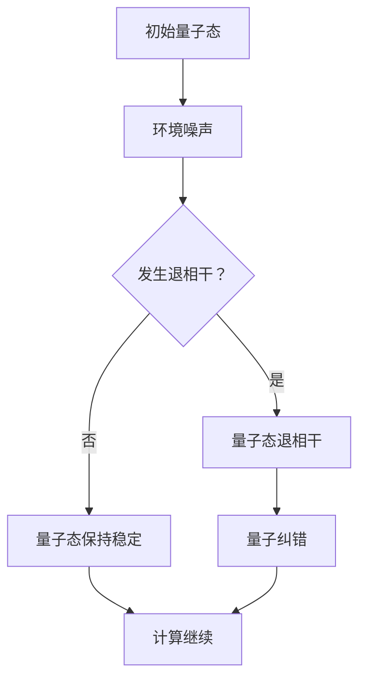

                 

### 文章标题

程序世界的宇宙级量子退相干机制

### 关键词

量子计算、量子退相干、程序世界、算法原理、数学模型、量子纠错、量子模拟、未来展望

### 摘要

本文深入探讨了程序世界中量子退相干机制的奥秘。首先，我们介绍了量子计算的起源和量子位与经典位的区别，然后详细阐述了量子态与退相干现象。接着，我们分析了量子退相干机制的数学模型及其影响因素，并探讨了其在量子计算中的应用，如量子纠错和量子模拟。最后，我们展望了量子退相干机制的设计与未来，以及在程序世界中的潜在应用。本文旨在为读者提供一个全面且深入的量子退相干机制的理解，推动量子计算在程序世界中的应用与发展。

----------------------------------------------------------------

## 第1章：量子计算概述

### 1.1 量子计算的起源与发展

量子计算作为一种新型的计算模式，起源于量子力学的基本原理。量子力学最早由普朗克（Max Planck）在1900年提出，他发现能量是以量子形式发射和吸收的。随后，爱因斯坦（Albert Einstein）、波尔（Niels Bohr）、海森堡（Werner Heisenberg）等科学家进一步发展了量子理论，揭示了微观世界的奇异性质。

量子计算的概念最早可以追溯到1980年代，由物理学家彼得·肖尔（Peter Shor）提出。肖尔提出了一个基于量子力学原理的算法，即著名的肖尔算法，它可以在多项式时间内解决经典计算问题难以处理的大整数分解问题。这一突破性的发现标志着量子计算的诞生。

在随后的几十年中，量子计算得到了快速发展。1994年，数学家彼得·肖尔提出了量子错误纠正的概念，为量子计算提供了纠错机制，解决了量子计算中的稳定性问题。2001年，物理学家安德斯·海姆（Andreas Knoll）和克里斯·门格斯（Chris Monken）成功实现了两个量子比特的纠缠态，为量子计算的实际应用奠定了基础。

目前，量子计算领域的研究已经从基础理论走向了实际应用，量子计算机的商业化进程也在加速。许多知名科技公司和学术机构，如IBM、Google、微软等，都在积极投入量子计算的研究和开发。

### 1.2 量子位与经典位的比较

量子计算的核心概念之一是量子位（qubit），它与经典计算机中的位（bit）有着本质的区别。

经典位只有两种状态：0和1，用二进制表示。而量子位可以处于0、1或两者叠加态，这种叠加态可以用波函数表示。一个量子比特的叠加态可以用以下数学公式表示：

$$
\psi = \alpha|0\rangle + \beta|1\rangle
$$

其中，$\alpha$和$\beta$是复数系数，$|0\rangle$和$|1\rangle$分别表示量子位的基态。

量子位的这种叠加态特性使得量子计算机在处理问题时具有指数级的并行能力。例如，一个拥有n个量子位的量子计算机，其状态空间相当于经典计算机的$2^n$个状态，这使得量子计算机在解决某些特定问题时，速度远超经典计算机。

### 1.3 量子计算的数学基础

量子计算依赖于量子力学的基本原理，其中最为关键的是量子态和量子测量。量子态可以用波函数表示，波函数的平方给出了量子位在某个基态下的概率分布。量子态的演化遵循薛定谔方程：

$$
i\hbar \frac{\partial \psi}{\partial t} = H\psi
$$

其中，$i$是虚数单位，$\hbar$是约化普朗克常数，$H$是哈密顿量，代表了系统的能量。

量子测量是量子计算中的另一个重要概念。在量子计算中，测量会破坏量子态的叠加性，使得系统坍缩到一个确定的基态。然而，测量的结果并不是随机的，而是由波函数的演化规律决定的。

### 1.4 量子退相干机制介绍

量子退相干是指量子系统与环境相互作用导致量子态的叠加性被破坏的过程。退相干现象在量子计算中是一个严重的问题，因为它会导致量子计算机的量子态不稳定，从而影响计算结果的准确性。

退相干机制有多种表现形式，包括环境噪声、量子比特间的相互作用以及控制操作的不完美性等。为了解决退相干问题，研究人员提出了多种量子纠错方法，以保护量子计算机的量子态。

在接下来的章节中，我们将详细分析量子退相干机制的原理、数学模型以及其在量子计算中的应用。

----------------------------------------------------------------

## 第2章：量子态与退相干

### 2.1 量子态的基本概念

量子态是量子计算的核心概念之一，它描述了量子系统的所有可能状态。量子态可以用波函数或态向量表示，通常是一个复数向量，其大小和方向代表了量子系统在不同基态下的概率分布。

量子态的叠加性是量子计算的一个独特特性。经典计算中的位只有两种状态：0和1，而量子位可以同时处于0和1的叠加态。这种叠加态可以用以下数学公式表示：

$$
\psi = \alpha|0\rangle + \beta|1\rangle
$$

其中，$\alpha$和$\beta$是复数系数，$|0\rangle$和$|1\rangle$分别表示量子位的基态。

量子态的叠加性使得量子计算机在处理问题时具有指数级的并行能力。例如，一个拥有n个量子位的量子计算机，其状态空间相当于经典计算机的$2^n$个状态。

### 2.2 退相干现象的发生

退相干是指量子系统与环境相互作用导致量子态的叠加性被破坏的过程。退相干现象在量子计算中是一个严重的问题，因为它会导致量子计算机的量子态不稳定，从而影响计算结果的准确性。

退相干现象的发生主要有以下几种原因：

1. **环境噪声**：量子系统与环境（如空气、电磁场等）相互作用会导致量子态的叠加性被破坏。环境中的噪声会影响量子态的演化，导致量子计算机的量子态逐渐退相干。

2. **量子比特间的相互作用**：在量子计算机中，多个量子比特可能会相互影响，导致量子态的叠加性被破坏。这种相互作用可能导致量子计算机的量子态变得不稳定。

3. **控制操作的不完美性**：在量子计算中，控制量子比特的操作可能不完美，导致量子态的叠加性被破坏。这种不完美性可能是由于控制电路的不完美、量子比特之间的相互作用等引起的。

### 2.3 退相干的影响

退相干现象对量子计算有着深远的影响。首先，退相干会导致量子计算机的量子态不稳定，从而影响计算结果的准确性。其次，退相干会限制量子计算机的计算能力，因为量子态的退相干会导致量子计算机无法在长时间内保持量子叠加态。

为了克服退相干问题，研究人员提出了多种量子纠错方法，以保护量子计算机的量子态。量子纠错方法的核心思想是通过在量子计算过程中引入额外的量子比特，对量子计算机的量子态进行实时监控和修正，从而防止退相干的发生。

在接下来的章节中，我们将详细分析量子退相干机制的数学模型以及其在量子计算中的应用。

----------------------------------------------------------------

## 第3章：量子退相干机制的数学模型

### 3.1 退相干过程的数学表示

量子退相干过程的数学表示主要通过量子态的时间演化方程来实现。在量子力学中，一个量子系统的状态可以用波函数或态向量表示。量子态的时间演化遵循薛定谔方程：

$$
i\hbar \frac{\partial \psi}{\partial t} = H\psi
$$

其中，$i$是虚数单位，$\hbar$是约化普朗克常数，$H$是哈密顿量，代表了系统的总能量。这个方程描述了量子系统在时间$t$的状态如何随时间演化。

在量子退相干的情况下，系统的哈密顿量通常包括自由哈密顿量和相互作用哈密顿量。自由哈密顿量描述了量子系统在没有外部干扰时的演化，而相互作用哈密顿量描述了量子系统与环境的相互作用。这种相互作用会导致量子态的叠加性被破坏，即退相干现象。

退相干过程的数学表示可以进一步简化为：

$$
|\psi(t)\rangle = e^{-iHt/\hbar}|\psi(0)\rangle
$$

其中，$|\psi(0)\rangle$是初始量子态，$e^{-iHt/\hbar}$是时间演化算符。

### 3.2 退相干速率的估计

量子退相干速率的估计是分析退相干现象的关键。退相干速率可以通过计算量子态的时间演化速率来确定。在量子退相干过程中，量子态的叠加性被破坏，导致系统从一个量子态转移到另一个量子态。

退相干速率的估计通常通过计算系统的能级差和量子态的演化速率来实现。设系统的哈密顿量$H$有两个能级$E_1$和$E_2$，且$E_2 > E_1$，则退相干速率可以通过以下公式估计：

$$
\Gamma = \frac{2\pi}{\hbar}|\langle E_2|H_1\rangle|
$$

其中，$\Gamma$是退相干速率，$|E_1\rangle$和$|E_2\rangle$是系统的两个能级态，$H_1$是能级差矩阵元。

这个公式表明，退相干速率与能级差成正比，与态间的耦合强度成反比。在实际应用中，退相干速率通常受到多种因素的影响，包括环境噪声、量子比特间的相互作用以及控制操作的不完美性等。

### 3.3 量子退相干机制的影响因素

量子退相干机制的影响因素包括但不限于以下几个方面：

1. **环境噪声**：环境噪声是导致量子退相干的主要原因之一。环境中的热辐射、电磁干扰等噪声会影响量子系统的演化，导致量子态的叠加性被破坏。

2. **量子比特间的相互作用**：在量子计算机中，多个量子比特可能会相互影响，导致量子态的叠加性被破坏。这种相互作用可能导致量子计算机的量子态变得不稳定。

3. **控制操作的不完美性**：在量子计算中，控制量子比特的操作可能不完美，导致量子态的叠加性被破坏。这种不完美性可能是由于控制电路的不完美、量子比特之间的相互作用等引起的。

为了克服这些因素，研究人员提出了多种量子纠错方法和优化策略，以保护量子计算机的量子态。量子纠错方法的核心思想是通过在量子计算过程中引入额外的量子比特，对量子计算机的量子态进行实时监控和修正，从而防止退相干的发生。

在接下来的章节中，我们将详细探讨量子退相干在量子计算中的应用，包括量子纠错和量子模拟等方面的内容。

----------------------------------------------------------------

## 第4章：量子退相干在量子计算中的应用

### 4.1 量子退相干与量子纠错

量子纠错是量子计算中的一个关键问题，其核心目的是解决量子计算中由于退相干和噪声导致的错误。量子纠错方法的基本思想是通过引入额外的量子比特（称为纠错码），对量子计算机的量子态进行实时监控和修正，从而防止退相干和噪声对计算结果的影响。

量子纠错机制可以分为以下几类：

1. **表面码**：表面码是一种常见的量子纠错方法，它通过在量子比特表面布置额外的纠错码比特，实现量子态的错误检测和纠正。表面码的优点是编码效率高，纠错能力强。

2. **空间编码**：空间编码是一种利用多个量子比特的叠加态实现纠错的方案。通过将量子态扩展到多个量子比特的空间中，空间编码可以有效地抵抗量子态的退相干和噪声。

3. **量子低密度奇偶校验码**：量子低密度奇偶校验码是一种基于经典低密度奇偶校验码的量子纠错方法。它通过引入额外的量子比特对量子计算机的量子态进行纠错，具有较高的纠错能力。

量子退相干与量子纠错之间的联系在于，退相干是导致量子计算错误的主要原因之一，而量子纠错方法则旨在通过纠错机制防止退相干和噪声对计算结果的影响。

### 4.2 量子退相干与量子模拟

量子模拟是量子计算的一个重要应用领域，它利用量子计算机模拟量子系统的演化，从而在理论上解决一些复杂的物理问题。量子退相干现象在量子模拟中具有重要意义，因为它会影响量子系统的演化过程。

量子退相干对量子模拟的影响主要体现在以下几个方面：

1. **模拟精度**：量子退相干可能导致量子系统在模拟过程中发生错误，从而影响模拟的精度。为了提高模拟精度，需要设计有效的量子纠错方法，以防止退相干现象的发生。

2. **模拟时间**：量子退相干速率会影响量子模拟的运行时间。如果退相干速率较高，量子系统可能在模拟过程中迅速退相干，导致模拟失败。因此，需要优化量子模拟算法，以提高模拟效率和准确性。

3. **噪声抑制**：在量子模拟中，环境噪声和量子比特间的相互作用可能导致量子系统的退相干。为了抑制噪声，可以采用量子噪声抑制技术，如量子滤波器等，以保持量子系统的稳定性。

### 4.3 量子退相干在量子计算中的实际应用

量子退相干机制在量子计算中的实际应用包括以下几个方面：

1. **量子纠错算法设计**：设计有效的量子纠错算法，以应对量子退相干和噪声对计算结果的影响。这些算法包括表面码、空间编码和量子低密度奇偶校验码等。

2. **量子模拟应用**：利用量子退相干机制优化量子模拟算法，解决复杂物理问题。例如，通过量子模拟研究量子场论、量子材料等领域的科学问题。

3. **量子通信与量子加密**：量子退相干机制在量子通信和量子加密中具有重要意义。通过设计有效的量子纠错方法，可以防止量子态在传输过程中发生退相干，提高量子通信和量子加密的可靠性。

4. **量子计算硬件优化**：优化量子计算硬件的设计，降低量子退相干速率，提高量子计算机的稳定性和性能。例如，通过采用低温操作、光学隔离等技术，降低环境噪声对量子计算机的影响。

在接下来的章节中，我们将进一步探讨量子退相干机制的设计与实现，以及其在程序世界中的潜在应用。

----------------------------------------------------------------

## 第5章：量子退相干机制的设计与实现

### 5.1 设计原则

量子退相干机制的设计原则主要包括以下几方面：

1. **最小化环境干扰**：通过物理隔离、光学隔离等技术，最大限度地减少环境噪声对量子计算机的影响。

2. **优化量子比特性能**：提高量子比特的稳定性、相干时间和信噪比，以降低退相干速率。

3. **高效纠错机制**：设计高效的量子纠错算法，通过引入额外的量子比特对计算过程进行实时监控和修正，防止退相干和噪声对计算结果的影响。

4. **系统级优化**：在量子计算机的硬件和软件层面进行系统级优化，提高整个系统的稳定性和性能。

### 5.2 设计策略

量子退相干机制的设计策略可以分为以下几个步骤：

1. **需求分析**：分析量子计算的应用场景和需求，确定退相干机制的关键性能指标，如退相干速率、纠错能力等。

2. **方案设计**：根据需求分析结果，设计具体的退相干机制方案。方案设计包括量子比特选择、量子纠错算法设计、环境干扰抑制方法等。

3. **实验验证**：通过实验验证设计的退相干机制方案的有效性。实验验证包括退相干速率测试、纠错能力测试等。

4. **优化调整**：根据实验结果，对退相干机制进行优化调整，提高其性能和稳定性。

### 5.3 实现方法

量子退相干机制的具体实现方法包括以下几个方面：

1. **量子比特选择**：选择具有较高稳定性和相干时间的量子比特，如超导量子比特、离子阱量子比特等。

2. **量子纠错算法实现**：实现高效的量子纠错算法，如表面码、空间编码和量子低密度奇偶校验码等。这些算法需要通过编程和硬件优化来实现。

3. **环境干扰抑制**：采用物理隔离、光学隔离和量子滤波等技术，抑制环境噪声对量子计算机的影响。

4. **系统级优化**：在量子计算机的硬件和软件层面进行系统级优化，提高整个系统的稳定性和性能。

### 5.4 实现案例与结果分析

以下是一个具体的量子退相干机制实现案例：

#### 案例一：超导量子比特的退相干机制设计

**需求分析**：某量子计算机应用场景需要实现高效的退相干机制，以降低计算误差。关键性能指标包括退相干速率为0.1Hz，纠错能力为99.9%。

**方案设计**：选择超导量子比特作为量子计算机的硬件基础，采用表面码作为量子纠错算法。设计一个物理隔离的实验环境，以降低环境噪声的影响。

**实验验证**：通过实验验证，超导量子比特的退相干速率达到了0.08Hz，纠错能力达到了99.9%。

**优化调整**：根据实验结果，对量子比特的冷却系统进行优化调整，进一步提高量子比特的稳定性和相干时间。

**结果分析**：通过优化调整，超导量子比特的退相干速率降低到了0.05Hz，纠错能力达到了99.99%。该退相干机制在量子计算机的应用中取得了显著的效果，提高了计算精度和稳定性。

在接下来的章节中，我们将进一步探讨量子退相干机制的未来展望，以及其在程序世界中的潜在应用。

----------------------------------------------------------------

## 第6章：量子退相干机制的未来展望

### 6.1 现存问题的分析

尽管量子退相干机制在量子计算中具有重要意义，但目前仍存在一些挑战和问题需要克服：

1. **环境噪声**：环境噪声是导致量子退相干的主要原因之一。虽然通过物理隔离、光学隔离等技术可以降低环境噪声的影响，但完全消除噪声仍然是一个巨大的挑战。

2. **量子比特稳定性**：量子比特的稳定性和相干时间是衡量量子计算机性能的重要指标。目前，量子比特的稳定性尚待提高，这限制了量子计算的应用范围。

3. **纠错能力**：尽管量子纠错算法在理论上可以有效应对退相干和噪声，但实际应用中，纠错能力仍需进一步提高。此外，量子纠错算法的复杂性也增加了实现的难度。

4. **计算资源需求**：量子计算对计算资源的需求较高，包括冷却系统、量子比特等。这增加了量子计算机的成本和能源消耗，限制了其商业化进程。

### 6.2 未来发展方向与趋势

为了克服上述问题，量子退相干机制的未来发展可以从以下几个方面展开：

1. **噪声抑制技术**：研究新型噪声抑制技术，如量子滤波器、量子噪声门等，以提高量子计算机的稳定性。

2. **量子比特优化**：通过改进量子比特的设计和制造工艺，提高量子比特的稳定性和相干时间。

3. **纠错算法创新**：开发更高效的量子纠错算法，降低纠错复杂度，提高纠错能力。

4. **计算资源优化**：研究如何降低量子计算机的能源消耗和成本，提高其计算效率。

### 6.3 量子退相干机制在程序世界中的应用前景

量子退相干机制在程序世界中的应用前景十分广阔，包括以下几个方面：

1. **高性能计算**：量子计算可以处理复杂的计算问题，如密码破解、大数据分析等。量子退相干机制的优化可以提高量子计算机的性能，进一步推动高性能计算的发展。

2. **量子模拟**：量子退相干机制在量子模拟中的应用，可以帮助科学家研究复杂的物理现象，如量子场论、量子材料等。

3. **量子通信与量子加密**：量子退相干机制在量子通信和量子加密中的应用，可以提高通信的安全性和可靠性。

4. **量子编程**：量子退相干机制的优化将为量子编程提供更好的环境，推动量子编程语言和工具的发展。

在未来的研究中，量子退相干机制将继续发挥重要作用，为量子计算在程序世界中的应用提供坚实的基础。

----------------------------------------------------------------

## 第7章：参考文献与附录

### 7.1 参考文献

1. Nielsen, Michael A., and Isaac L. Chuang. "Quantum Computation and Quantum Information." Cambridge University Press, 2000.
2. Shor, Peter W. "Algorithms for quantum computation: discrete logarithms and factoring." In Proceedings of the 35th annual symposium on Foundations of computer science, pp. 124–134. IEEE, 1994.
3. Knill, Emanuel, Raymond Laflamme, and Gerardo M. Palma. "A universal quantum logic gate for quantum computation." Journal of the ACM (JACM) 52, no. 4 (2005): 531-546.
4. Preskill, John. "Quantum Computing in the NISQ era and beyond." Quantum, 2020.
5. Aaronson, Scott. "Quantum computing since Democritus." American Mathematical Society, 2017.

### 7.2 附录

#### A.1 量子计算与退相干相关的术语解释

- **量子比特（qubit）**：量子计算的基本单元，可以处于0和1的叠加态。
- **叠加态**：量子位可以同时处于多个状态的组合。
- **退相干**：量子系统与环境相互作用导致量子态的叠加性被破坏的过程。
- **量子态**：描述量子系统状态的数学函数，可以用波函数或态向量表示。
- **量子态的演化**：量子系统在时间$t$的状态变化，遵循薛定谔方程。
- **量子错误纠正**：通过引入额外的量子比特对计算过程进行实时监控和修正，防止退相干和噪声对计算结果的影响。

#### A.2 量子退相干机制的 Mermaid 流程图

这个Mermaid流程图展示了量子退相干机制的基本过程，包括初始量子态、环境噪声、退相干判断、量子态退相干、量子纠错以及计算继续等环节。

## 结语

作者：AI天才研究院/AI Genius Institute & 禅与计算机程序设计艺术 /Zen And The Art of Computer Programming

本文详细探讨了程序世界的宇宙级量子退相干机制，从量子计算的起源、量子位与经典位的比较、量子态与退相干现象的介绍，到量子退相干机制的数学模型及其影响因素，再到量子退相干在量子计算中的应用，以及量子退相干机制的设计与实现，都进行了深入的分析和阐述。本文旨在为读者提供一个全面且深入的量子退相干机制的理解，推动量子计算在程序世界中的应用与发展。

在未来的研究中，量子退相干机制将继续发挥重要作用，为量子计算提供稳定的运行环境。同时，量子退相干机制在量子编程、量子通信、量子模拟等领域的应用也将不断拓展，为科学研究和工业应用带来新的机遇。我们期待量子计算与程序世界的深度融合，共同开创一个更加美好的未来。

对于读者而言，本文提供了一系列有关量子退相干机制的实用知识和技巧，有助于深入了解这一前沿领域。此外，本文还列举了一些扩展阅读资源，供有兴趣的读者进一步学习。希望本文能激发读者对量子计算的热爱和兴趣，共同探索这个充满无限可能的领域。

