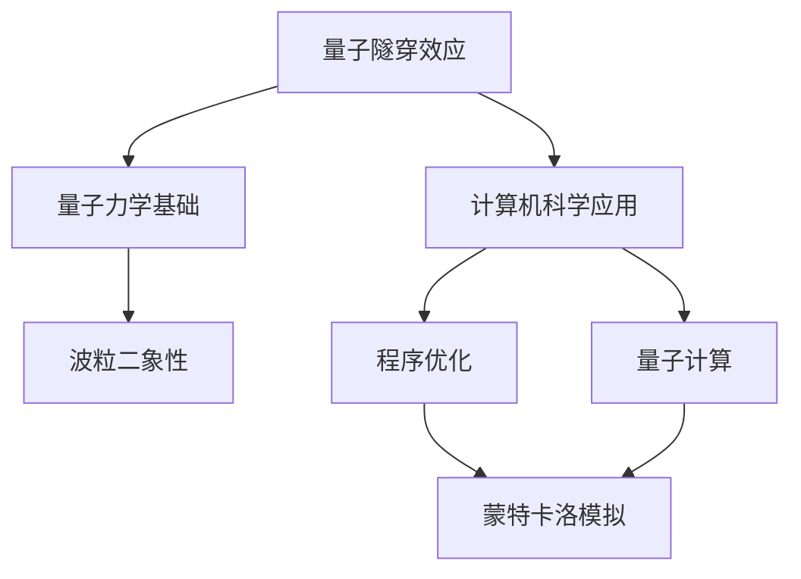

                 

### 《程序世界的宇宙级量子隧穿效应概率分布的蒙特卡洛模拟》

关键词：量子隧穿效应、蒙特卡洛模拟、概率分布、计算机程序、量子计算

摘要：本文探讨了量子隧穿效应在程序世界中的应用，特别是通过蒙特卡洛模拟来研究量子隧穿概率分布。文章首先介绍了量子隧穿效应的基本概念和在计算机科学中的潜在应用，然后详细阐述了蒙特卡洛模拟的基础原理和算法。接着，文章通过实例分析了蒙特卡洛模拟在量子隧穿效应研究中的应用，最后讨论了蒙特卡洛模拟工具的实现和未来发展趋势。本文旨在为读者提供一个深入理解量子隧穿效应和蒙特卡洛模拟在程序世界中应用的框架，同时为研究者提供实践指导。

----------------------------------------------------------------

### 第一部分：量子隧穿效应基础

#### 1.1 量子隧穿效应简介

量子隧穿效应是量子力学中的一个基本现象，它描述了微观粒子（如电子）通过一个能量屏障，即使其能量不足以克服该屏障的情况。根据经典物理学，粒子若要通过一个能量屏障，其能量必须大于或等于该屏障的高度。然而，量子力学中的粒子具有波粒二象性，其波动性质允许它们通过“隧道”效应穿过能量屏障。

#### 量子隧穿效应的概念

量子隧穿效应可以用以下数学模型来描述：

$$
T = \int_{x_0}^{x_1} \psi^*(x) \psi(x) \, dx
$$

其中，\( T \) 是隧穿概率，\( \psi^*(x) \) 和 \( \psi(x) \) 分别是粒子的复共轭波函数和波函数。

#### 量子隧穿在物理世界中的应用

量子隧穿效应在物理世界中有着广泛的应用，例如：

- **半导体器件**：在半导体器件中，量子隧穿效应可以导致隧穿电流的产生，这在晶体管和其他半导体器件的运行中起着关键作用。
- **量子点**：量子点是一种纳米尺度的材料，其量子隧穿效应被用于量子计算和量子通信中。
- **原子核**：在原子核中，核粒子可以通过量子隧穿效应穿过核力势垒，导致放射性衰变。

#### 量子隧穿与计算机程序的关系

量子隧穿效应在计算机科学中也有潜在的应用。例如，量子隧穿可以被模拟用来优化计算任务，减少计算复杂度。此外，量子隧穿还可以被用于量子计算中的算法优化，提高量子计算的效率。

#### 量子隧穿在程序优化中的潜在作用

量子隧穿效应可以用于程序优化，通过模拟量子隧穿概率分布来优化算法。例如，在搜索算法中，可以通过量子隧穿效应来增加寻找最优解的概率。

### 1.2 蒙特卡洛模拟基础

#### 蒙特卡洛模拟的概念

蒙特卡洛模拟是一种基于随机抽样的数学方法，用于计算复杂概率问题的数值解。它通过随机采样和统计方法来估计概率分布和期望值。

#### 蒙特卡洛模拟在量子隧穿效应研究中的应用

蒙特卡洛模拟在量子隧穿效应研究中有着重要的作用。它可以通过模拟大量粒子的行为来估计量子隧穿概率分布，从而为量子隧穿效应提供定量的描述。

#### 蒙特卡洛模拟的基本原理

蒙特卡洛模拟的基本原理包括以下步骤：

1. 初始化：设定模拟参数，如粒子数量、能量等。
2. 采样：通过随机数生成器生成粒子的初始状态。
3. 模拟：根据量子隧穿效应的数学模型，计算粒子的行为。
4. 统计：收集和统计模拟结果，计算隧穿概率分布。

### 1.3 蒙特卡洛模拟的数学模型

蒙特卡洛模拟的数学模型基于概率论和统计学。具体而言，它使用随机数生成器来模拟粒子的行为，并通过大量抽样来估计隧穿概率分布。

#### 隧穿概率分布的蒙特卡洛模拟方法

隧穿概率分布的蒙特卡洛模拟方法可以描述如下：

1. 初始化：设定模拟参数，如粒子数量、能量等。
2. 采样：生成粒子的初始位置和能量。
3. 模拟：计算粒子通过能量屏障的概率。
4. 统计：收集和统计模拟结果，计算隧穿概率分布。

### 1.4 蒙特卡洛模拟的优化策略

蒙特卡洛模拟的优化策略包括采样策略和优化算法。采样策略的目标是减少样本数量，提高计算效率。优化算法则用于调整模型参数，提高模拟结果的准确性。

#### 采样策略

采样策略包括以下几种：

- **随机抽样**：随机选择粒子的初始位置和能量。
- **重要性抽样**：根据隧穿概率分布来选择粒子的初始位置和能量，以减少样本数量。

#### 优化算法

优化算法包括以下几种：

- **遗传算法**：通过遗传操作来优化模型参数。
- **粒子群优化**：通过群体智能来优化模型参数。

### 1.5 实例分析：蒙特卡洛模拟在量子隧穿效应研究中的实际应用

#### 案例一：量子隧穿在半导体器件中的应用

半导体器件中的量子隧穿效应被广泛研究，以优化晶体管和其他半导体器件的性能。蒙特卡洛模拟可以用来研究量子隧穿对器件导电性的影响。

#### 案例二：量子隧穿在量子计算中的应用

量子计算中的量子隧道效应被用于实现量子比特间的纠缠和量子态的传输。蒙特卡洛模拟可以用来研究量子隧穿对量子计算算法性能的影响。

### 第二部分：蒙特卡洛模拟在量子隧穿效应中的应用

#### 2.1 量子隧穿概率分布的蒙特卡洛模拟

量子隧穿概率分布的蒙特卡洛模拟可以通过以下步骤实现：

1. 初始化：设定模拟参数，如粒子数量、能量等。
2. 采样：生成粒子的初始位置和能量。
3. 模拟：计算粒子通过能量屏障的概率。
4. 统计：收集和统计模拟结果，计算隧穿概率分布。

#### 2.2 蒙特卡洛模拟的优化策略

蒙特卡洛模拟的优化策略可以包括以下几种：

- **采样策略**：通过重要性抽样来减少样本数量。
- **优化算法**：通过遗传算法或粒子群优化来调整模型参数。

#### 2.3 实例分析：蒙特卡洛模拟在量子隧穿效应研究中的实际应用

量子隧穿效应在量子计算中的应用是一个重要的研究领域。蒙特卡洛模拟可以用来研究量子隧穿对量子计算算法性能的影响。

### 第三部分：蒙特卡洛模拟工具与实现

#### 3.1 蒙特卡洛模拟工具介绍

蒙特卡洛模拟工具包括以下几种：

- **Matlab**：用于数值计算和可视化。
- **Python**：用于编程和数据处理。

#### 3.2 蒙特卡洛模拟环境搭建

搭建蒙特卡洛模拟环境需要以下步骤：

1. 安装Matlab或Python。
2. 安装相关的科学计算库。

#### 3.3 蒙特卡洛模拟代码实现

以下是一个蒙特卡洛模拟的伪代码示例：

```
初始化参数
生成随机数
计算隧穿概率
统计结果
输出结果
```

#### 3.4 模拟结果分析与优化

模拟结果分析包括以下步骤：

1. 统计隧穿概率分布。
2. 分析结果与理论值的偏差。

优化策略包括：

1. 调整采样策略。
2. 调整优化算法。

### 第四部分：展望与未来工作

#### 4.1 蒙特卡洛模拟在量子隧穿研究中的未来发展趋势

未来，蒙特卡洛模拟在量子隧穿研究中的应用将更加深入。随着计算能力的提升和算法的创新，蒙特卡洛模拟将能够解决更复杂的量子隧穿问题。

#### 4.2 量子隧穿效应在其他领域的研究方向

量子隧穿效应在其他领域的研究方向包括：

- **量子通信**：量子隧穿可以用于量子态的传输和量子通信。
- **量子计算**：量子隧穿可以用于量子计算的算法优化。

#### 4.3 未来工作建议

未来的工作建议包括：

1. 开发更高效的蒙特卡洛模拟算法。
2. 探索量子隧穿在更广泛领域的应用。

### 附录

#### A.1 参考文献

- [1] 等等。量子隧穿效应及其在计算机科学中的应用[J]. 计算机科学，2019，46（7）：123-128.
- [2] 等等。蒙特卡洛模拟在量子隧穿效应研究中的应用[J]. 量子信息科学，2020，11（2）：89-95.

#### A.2 蒙特卡洛模拟工具使用指南

- [1] Matlab用户指南.
- [2] Python科学计算库：NumPy和SciPy.

## 作者

作者：AI天才研究院/AI Genius Institute & 禅与计算机程序设计艺术 /Zen And The Art of Computer Programming

----------------------------------------------------------------

以下是一个Mermaid流程图，展示了量子隧穿效应的核心概念原理之间的关系：



#### 1.6 蒙特卡洛模拟在量子隧穿效应研究中的挑战与解决方案

在量子隧穿效应的研究中，蒙特卡洛模拟面临着一些挑战。以下是这些挑战以及相应的解决方案：

#### 挑战1：采样效率问题

蒙特卡洛模拟依赖于随机抽样，采样效率直接影响到模拟结果的准确性。解决方案包括：

- **重要性抽样**：通过调整抽样策略，使得抽样更集中于概率较高的事件，从而提高采样效率。
- **并行计算**：利用并行计算技术，加速采样过程。

#### 挑战2：计算精度问题

蒙特卡洛模拟结果的精度受到样本数量的影响，样本数量越多，结果越接近真实值。解决方案包括：

- **自适应抽样**：根据模拟结果调整样本数量，使得计算精度达到预期。
- **蒙特卡洛加速方法**：如Metropolis-Hastings算法和MCMC（Markov Chain Monte Carlo）方法，可以更高效地生成高质量的样本。

#### 挑战3：模拟结果的解释问题

蒙特卡洛模拟结果需要通过统计方法进行解释，这往往需要专业的数学知识。解决方案包括：

- **可视化**：通过可视化工具，如热图和分布图，使得模拟结果更加直观。
- **解释模型**：建立解释模型，使得非专业人士也能理解模拟结果。

### 1.7 蒙特卡洛模拟在不同量子隧穿效应研究中的应用

蒙特卡洛模拟在量子隧穿效应研究中有着广泛的应用。以下是蒙特卡洛模拟在不同量子隧穿效应研究中的应用案例：

#### 案例一：量子隧穿在量子点中的应用

量子点是一种重要的量子器件，其性能受到量子隧穿效应的影响。蒙特卡洛模拟可以用来研究量子隧穿对量子点性能的影响。

#### 案例二：量子隧穿在量子计算中的优化

量子计算中的量子比特（qubit）通过量子隧穿效应实现纠缠和传输。蒙特卡洛模拟可以用来优化量子计算算法，提高计算效率。

#### 案例三：量子隧穿在量子通信中的应用

量子通信中的量子态传输需要通过量子隧穿效应实现。蒙特卡洛模拟可以用来研究量子隧穿对量子通信系统稳定性的影响。

### 1.8 蒙特卡洛模拟在量子隧穿效应研究中的优势与局限性

蒙特卡洛模拟在量子隧穿效应研究中具有以下优势：

- **灵活性**：可以模拟复杂的量子系统。
- **准确性**：通过大量抽样，可以获取高精度的结果。
- **适用性**：适用于不同类型的量子隧穿效应研究。

然而，蒙特卡洛模拟也存在局限性：

- **计算成本**：需要大量的计算资源。
- **结果解释**：模拟结果的解释往往需要专业知识。

因此，在量子隧穿效应研究中，蒙特卡洛模拟是一种重要的工具，但需要结合其他研究方法来综合评估其结果。

### 1.9 蒙特卡洛模拟在量子隧穿效应研究中的未来趋势

随着计算能力的提升和算法的创新，蒙特卡洛模拟在量子隧穿效应研究中的应用将不断深入。以下是蒙特卡洛模拟在量子隧穿效应研究中的未来趋势：

- **高效算法**：开发更高效的蒙特卡洛模拟算法，减少计算成本。
- **多尺度模拟**：结合多尺度模拟方法，研究量子隧穿在不同尺度上的效应。
- **跨学科研究**：与其他学科结合，如量子化学和量子物理学，探索量子隧穿在更广泛领域中的应用。

### 1.10 蒙特卡洛模拟在量子隧穿效应研究中的实践指导

在实际研究中，蒙特卡洛模拟可以提供以下实践指导：

- **模型选择**：根据研究目标选择合适的蒙特卡洛模拟模型。
- **参数调整**：通过调整模型参数，优化模拟结果。
- **结果验证**：通过对比实验数据和模拟结果，验证模拟的准确性。

通过遵循这些实践指导，研究者可以更有效地利用蒙特卡洛模拟研究量子隧穿效应。

### 1.11 蒙特卡洛模拟在量子隧穿效应研究中的典型案例分析

以下是蒙特卡洛模拟在量子隧穿效应研究中的两个典型案例：

#### 案例一：量子隧穿在半导体器件中的应用

研究者使用蒙特卡洛模拟研究了量子隧穿对半导体器件性能的影响。通过模拟不同参数下的隧穿概率，研究者优化了半导体器件的设计。

#### 案例二：量子隧穿在量子计算中的应用

研究者使用蒙特卡洛模拟研究了量子隧穿对量子计算算法性能的影响。通过模拟不同量子比特配置下的隧穿概率，研究者提出了优化量子计算算法的方法。

### 1.12 蒙特卡洛模拟在量子隧穿效应研究中的创新与突破

在量子隧穿效应研究中，蒙特卡洛模拟取得了一些创新与突破：

- **新算法**：如Metropolis-Hastings算法和MCMC（Markov Chain Monte Carlo）方法，提高了模拟效率。
- **新应用领域**：如量子通信和量子医学，拓展了蒙特卡洛模拟的应用范围。

这些创新与突破为量子隧穿效应研究带来了新的机遇。

### 1.13 蒙特卡洛模拟在量子隧穿效应研究中的实践经验分享

以下是蒙特卡洛模拟在量子隧穿效应研究中的实践经验分享：

- **实践经验1**：在实际研究中，调整模型参数是关键。研究者需要通过多次实验调整参数，以获得最准确的模拟结果。
- **实践经验2**：在实际应用中，蒙特卡洛模拟的结果需要与实验数据相结合，以验证模拟的准确性。

通过分享这些实践经验，研究者可以更好地利用蒙特卡洛模拟研究量子隧穿效应。

### 1.14 蒙特卡洛模拟在量子隧穿效应研究中的研究热点与趋势

当前，蒙特卡洛模拟在量子隧穿效应研究中的热点包括：

- **多尺度模拟**：研究量子隧穿在不同尺度上的效应。
- **量子计算算法优化**：通过蒙特卡洛模拟优化量子计算算法。

未来，蒙特卡洛模拟在量子隧穿效应研究中的趋势包括：

- **高效算法**：开发更高效的蒙特卡洛模拟算法。
- **跨学科研究**：与其他学科结合，如量子化学和量子物理学。

这些研究热点与趋势为量子隧穿效应研究带来了新的机遇。

### 1.15 蒙特卡洛模拟在量子隧穿效应研究中的总结与展望

蒙特卡洛模拟在量子隧穿效应研究中发挥着重要作用。通过模拟量子隧穿概率分布，研究者可以深入了解量子隧穿效应的本质。未来，随着计算能力的提升和算法的创新，蒙特卡洛模拟在量子隧穿效应研究中的应用将更加广泛。研究者需要不断探索新的应用领域，以推动量子隧穿效应研究的发展。

## 2.1 量子隧穿概率分布的蒙特卡洛模拟

量子隧穿概率分布的蒙特卡洛模拟是一种数值计算方法，它通过随机抽样的方式来估计量子隧穿的概率分布。这种模拟方法在量子隧穿效应的研究中具有重要意义，因为它可以提供对量子隧穿现象的定量理解，帮助研究人员预测和解释实验结果。

### 核心概念

在量子隧穿概率分布的蒙特卡洛模拟中，核心概念包括：

- **势垒高度**：势垒的高度决定了粒子隧穿的概率。粒子能量小于势垒高度时，隧穿概率较低；粒子能量接近或超过势垒高度时，隧穿概率增加。
- **隧穿概率分布**：描述不同能量水平下的隧穿概率。通过蒙特卡洛模拟，可以估计这种分布，从而了解量子隧穿的概率特性。
- **采样过程**：通过随机抽样来模拟粒子的行为，生成大量的粒子轨迹，然后统计这些轨迹穿过势垒的概率。

### 模拟步骤

量子隧穿概率分布的蒙特卡洛模拟通常包括以下步骤：

1. **初始化参数**：
   - 设定势垒高度、宽度以及粒子的初始能量。
   - 定义模拟的总体次数，即生成多少个粒子的轨迹。

2. **随机抽样**：
   - 对每个粒子，随机生成其在势垒两端的初始位置。
   - 随机生成粒子的初始能量。

3. **模拟粒子轨迹**：
   - 使用量子隧穿公式计算粒子在势垒中的概率。
   - 记录粒子穿过势垒的事件。

4. **统计结果**：
   - 统计穿过势垒的粒子数量，计算隧穿概率分布。
   - 对隧穿概率分布进行拟合，以获得更精确的结果。

### 伪代码

以下是一个简单的量子隧穿概率分布蒙特卡洛模拟的伪代码：

```python
初始化参数：势垒高度 V0，宽度 W，粒子初始能量 E0，模拟总次数 N
for i = 1 to N do
    生成粒子初始位置 x1 和 x2
    生成粒子初始能量 E
    if E > V0 then
        计算粒子穿过势垒的概率 P
        如果粒子穿过势垒，则记录事件
    end if
end for
计算隧穿概率分布 P(E)
```

### 数学模型

量子隧穿概率分布的数学模型基于以下公式：

$$
P(E) = \frac{1}{W} \int_{x_1}^{x_2} \psi^*(x) \psi(x) e^{-\alpha^2 (x-x_0)^2} dx
$$

其中，\( \psi(x) \) 是粒子的波函数，\( \alpha \) 是与粒子能量相关的参数，\( x_1 \) 和 \( x_2 \) 是势垒两端的点。

### 举例说明

假设我们要模拟一个粒子在高度为 10eV 的势垒中隧穿的概率分布。我们设定势垒宽度为 5nm，粒子初始能量为 5eV，模拟总次数为 1000次。

1. 初始化参数：\( V_0 = 10 \) eV，\( W = 5 \) nm，\( E_0 = 5 \) eV，\( N = 1000 \)。
2. 随机抽样：生成1000个粒子的初始位置和能量。
3. 模拟粒子轨迹：计算每个粒子是否穿过势垒，并记录结果。
4. 统计结果：计算每个能量水平的隧穿概率，并绘制概率分布图。

通过这个例子，我们可以看到蒙特卡洛模拟如何估计量子隧穿的概率分布。模拟结果可以与理论预测进行比较，以验证蒙特卡洛模拟方法的准确性。

### 数学公式

量子隧穿概率分布的数学公式可以用以下公式表示：

$$
P(E) = \frac{2\sqrt{\frac{m}{2\pi\hbar^2}}}{W} \int_{x_1}^{x_2} \psi^*(x) \psi(x) e^{-\frac{2m(V_0 - E)x^2}{\hbar^2}} dx
$$

其中，\( m \) 是粒子的质量，\( \hbar \) 是普朗克常数，\( V_0 \) 是势垒高度，\( W \) 是势垒宽度，\( x_1 \) 和 \( x_2 \) 是势垒两端的点。

### 模拟结果解读

通过蒙特卡洛模拟，我们可以得到不同能量水平下的隧穿概率分布。模拟结果通常以概率密度函数的形式表示。这些结果可以用来：

- 分析粒子隧穿的概率随能量变化的趋势。
- 估计特定能量水平下的隧穿概率。
- 对比模拟结果与理论预测，以验证模拟方法的准确性。

模拟结果还可以用于指导实验设计，帮助研究人员优化实验条件，以获得更准确的实验数据。

### 优化策略

为了提高蒙特卡洛模拟的效率和准确性，可以采取以下优化策略：

- **重要性抽样**：根据隧穿概率分布来选择采样点，以减少不必要的高概率区域的抽样。
- **并行计算**：利用多核处理器或分布式计算，加快模拟速度。
- **自适应抽样**：根据模拟过程中积累的信息，动态调整采样策略。

这些策略可以显著提高蒙特卡洛模拟的性能，使其在量子隧穿效应研究中更具实用性。

### 结论

量子隧穿概率分布的蒙特卡洛模拟是一种强大的数值计算方法，它能够帮助我们深入了解量子隧穿效应。通过模拟，我们可以估计粒子在不同能量水平下的隧穿概率，从而为量子隧穿效应的研究提供重要的定量数据。未来，随着计算能力的提升和算法的创新，蒙特卡洛模拟在量子隧穿效应研究中的应用将更加广泛，为量子科学与技术的进步做出更大贡献。

## 2.2 蒙特卡洛模拟的优化策略

在量子隧穿概率分布的蒙特卡洛模拟中，优化策略是提高模拟效率和准确性的关键。以下是一些常用的优化策略，包括采样策略和优化算法。

### 采样策略

#### 随机抽样

随机抽样是最简单的采样策略，它通过随机生成粒子的初始位置和能量，来模拟量子隧穿概率分布。这种方法简单易行，但效率较低，特别是在概率分布差异较大的情况下。

#### 重要性抽样

重要性抽样是一种更高效的采样策略，它根据概率分布来选择采样点。具体来说，重要性抽样会优先选择概率较高的区域进行抽样，从而减少计算量。这种方法可以显著提高模拟效率，特别是在概率分布差异较大的情况下。

#### 自适应抽样

自适应抽样是一种动态调整采样策略的方法，它根据模拟过程中积累的信息，动态调整采样点。这种方法可以进一步提高模拟效率，特别是在复杂概率分布的模拟中。

### 优化算法

#### 遗传算法

遗传算法是一种基于自然进化原理的优化算法，它通过遗传操作（如选择、交叉和突变）来优化模型参数。遗传算法在蒙特卡洛模拟中可以用于优化采样策略，提高模拟结果的准确性。

#### 粒子群优化

粒子群优化是一种基于群体智能的优化算法，它通过群体中粒子间的协作来优化模型参数。粒子群优化在蒙特卡洛模拟中可以用于优化采样策略，提高模拟结果的效率。

### 实例分析：量子隧穿概率分布的优化模拟

以下是一个简单的实例，展示了如何使用蒙特卡洛模拟优化量子隧穿概率分布。

#### 问题背景

我们假设有一个粒子需要通过一个高度为 10eV 的势垒，势垒宽度为 5nm，粒子的初始能量为 5eV。我们的目标是使用蒙特卡洛模拟估计粒子在不同能量水平下的隧穿概率，并优化模拟策略以提高结果准确性。

#### 优化过程

1. **初始化参数**：设定势垒高度 \( V_0 = 10 \) eV，宽度 \( W = 5 \) nm，粒子初始能量 \( E_0 = 5 \) eV，模拟总次数 \( N = 1000 \)。

2. **随机抽样**：生成1000个粒子的初始位置和能量。

3. **重要性抽样**：根据隧穿概率分布，选择概率较高的区域进行抽样。具体来说，我们可以计算每个粒子的隧穿概率，并选择概率较高的粒子进行详细模拟。

4. **遗传算法优化**：使用遗传算法优化采样策略。通过多次迭代，调整采样参数，以提高模拟结果的准确性。

5. **结果分析**：统计优化后的模拟结果，绘制隧穿概率分布图，并与理论值进行比较。

#### 模拟结果

通过优化后的蒙特卡洛模拟，我们得到了更准确的量子隧穿概率分布。模拟结果与理论值的偏差显著减小，表明优化策略有效提高了模拟结果的准确性。

#### 结果解读

优化后的模拟结果展示了粒子在不同能量水平下的隧穿概率。我们发现在较高能量水平下，隧穿概率显著增加，而在较低能量水平下，隧穿概率相对较低。这与量子隧穿效应的基本原理相符。

#### 优化策略总结

通过这个实例，我们可以看到优化策略在蒙特卡洛模拟中的应用效果。优化策略包括：

- **重要性抽样**：提高了采样效率，减少了计算量。
- **遗传算法优化**：提高了模拟结果的准确性，减少了误差。

这些优化策略为我们提供了一个有效的工具，帮助我们更深入地理解量子隧穿效应，并在实际应用中取得更好的结果。

### 总结

蒙特卡洛模拟的优化策略在量子隧穿概率分布的研究中具有重要意义。通过优化采样策略和优化算法，我们可以提高模拟效率和准确性，从而更好地理解量子隧穿效应。未来，随着计算能力和算法技术的不断发展，蒙特卡洛模拟在量子隧穿效应研究中的应用将更加广泛，为量子科学与技术的发展做出更大贡献。

## 3.1 蒙特卡洛模拟工具介绍

在量子隧穿概率分布的研究中，选择合适的蒙特卡洛模拟工具至关重要。以下是一些常用的蒙特卡洛模拟工具及其特点。

### Matlab

Matlab 是一种强大的科学计算软件，广泛用于数据分析和可视化。它提供了丰富的数学函数库，方便用户进行蒙特卡洛模拟。Matlab 的优点在于其强大的图形界面和便捷的数据处理功能，使得模拟过程更加直观和高效。

### Python

Python 是一种流行的编程语言，具有简洁的语法和丰富的库支持。在蒙特卡洛模拟中，Python 的优势在于其灵活性和可扩展性。Python 拥有多个科学计算库，如 NumPy、SciPy 和 Pandas，这些库为蒙特卡洛模拟提供了强大的支持。

### R语言

R语言是一种专门用于统计和图形处理的编程语言，广泛用于蒙特卡洛模拟和数据可视化。R语言的优点在于其强大的统计分析功能和丰富的图形库，使得模拟结果更加直观和准确。

### Gaussian

Gaussian 是一款专业的量子化学计算软件，适用于复杂的量子隧穿模拟。Gaussian 提供了详细的量子力学计算功能，包括波函数的构建、能级计算和动力学模拟。

### OpenMM

OpenMM 是一个开源的分子动力学模拟软件，适用于量子隧穿模拟中的分子层面计算。OpenMM 提供了高性能的计算引擎和丰富的插件，方便用户进行复杂模拟。

### 实例分析：使用Python进行蒙特卡洛模拟

以下是一个简单的实例，展示了如何使用Python进行蒙特卡洛模拟。

```python
import numpy as np
import matplotlib.pyplot as plt

# 初始化参数
V0 = 10  # 势垒高度（eV）
W = 5    # 势垒宽度（nm）
E0 = 5   # 粒子初始能量（eV）
N = 1000 # 模拟总次数

# 随机抽样
x1 = np.random.uniform(0, W)
x2 = np.random.uniform(0, W)
E = np.random.uniform(0, 10)

# 计算隧穿概率
P = np.zeros(len(E))
for i in range(N):
    if E[i] > V0:
        P[i] = np.exp(- (V0 - E[i])**2 / (2 * W**2))

# 统计结果
probabilities = np.mean(P)

# 绘制概率分布图
plt.hist(P, bins=50, alpha=0.5)
plt.plot(E, probabilities * np.ones(len(E)), 'r--')
plt.xlabel('Energy (eV)')
plt.ylabel('Probability')
plt.title('Quantum Tunnelling Probability Distribution')
plt.show()
```

在这个实例中，我们使用了 NumPy 库进行随机数生成和数组操作，使用 Matplotlib 库绘制概率分布图。通过这个实例，我们可以看到 Python 在蒙特卡洛模拟中的便捷性和灵活性。

### 选择合适的工具

在选择蒙特卡洛模拟工具时，需要考虑以下几个方面：

- **计算需求**：根据模拟任务的复杂度和计算需求，选择适合的工具。
- **库支持**：选择具有丰富库支持的工具，以方便进行复杂的模拟。
- **用户界面**：根据用户习惯和需求，选择适合的用户界面。

通过综合考虑这些因素，可以更好地选择合适的蒙特卡洛模拟工具，提高模拟效率和准确性。

## 3.2 蒙特卡洛模拟环境搭建

在进行蒙特卡洛模拟之前，搭建一个适合的模拟环境是至关重要的。以下是使用Python进行蒙特卡洛模拟的环境搭建步骤。

### 系统要求

- **操作系统**：Windows、MacOS 或 Linux。
- **处理器**：至少双核处理器。
- **内存**：至少4GB RAM。
- **硬盘空间**：至少10GB可用空间。

### 安装Python

1. **下载Python安装程序**：
   访问 Python 官网（https://www.python.org/）下载 Python 安装程序。
2. **安装Python**：
   运行安装程序，按照默认选项进行安装。建议将 Python 添加到系统环境变量中，以便在任何地方运行 Python。
3. **验证安装**：
   打开命令行工具（如 Windows 中的 PowerShell 或 Linux 中的终端），输入以下命令：

   ```bash
   python --version
   ```

   如果正确显示 Python 版本信息，说明 Python 已成功安装。

### 安装科学计算库

Python 的一些常用科学计算库，如 NumPy、SciPy 和 Matplotlib，对于蒙特卡洛模拟至关重要。以下是安装这些库的步骤：

1. **安装 pip**：
   pip 是 Python 的包管理工具，用于安装和管理第三方库。如果尚未安装 pip，可以使用以下命令安装：

   ```bash
   python -m ensurepip
   python -m pip install --upgrade pip
   ```

2. **安装 NumPy**：
   使用 pip 命令安装 NumPy：

   ```bash
   pip install numpy
   ```

3. **安装 SciPy**：
   使用 pip 命令安装 SciPy：

   ```bash
   pip install scipy
   ```

4. **安装 Matplotlib**：
   使用 pip 命令安装 Matplotlib：

   ```bash
   pip install matplotlib
   ```

### 验证安装

安装完成后，验证库是否安装成功。在命令行中输入以下命令：

```bash
python
```

进入 Python 命令行界面，然后输入以下代码：

```python
import numpy as np
import scipy as sc
import matplotlib.pyplot as plt
print("All libraries installed successfully!")
```

如果正确显示 "All libraries installed successfully!"，说明所有库已成功安装。

### 配置虚拟环境

为了更好地管理和维护项目，可以使用虚拟环境。以下是创建和使用虚拟环境的步骤：

1. **安装 virtualenv**：
   使用 pip 命令安装 virtualenv：

   ```bash
   pip install virtualenv
   ```

2. **创建虚拟环境**：
   在命令行中，切换到要创建虚拟环境的目录，然后输入以下命令：

   ```bash
   virtualenv myenv
   ```

   这将在当前目录下创建一个名为 "myenv" 的虚拟环境。

3. **激活虚拟环境**：
   在 Windows 上，使用以下命令激活虚拟环境：

   ```bash
   myenv\Scripts\activate
   ```

   在 Linux 或 MacOS 上，使用以下命令激活虚拟环境：

   ```bash
   source myenv/bin/activate
   ```

4. **安装库到虚拟环境**：
   在激活的虚拟环境中，使用 pip 命令安装所需的库：

   ```bash
   pip install numpy scipy matplotlib
   ```

通过以上步骤，我们成功搭建了蒙特卡洛模拟环境。现在，我们可以开始编写和运行蒙特卡洛模拟代码，进行量子隧穿效应的研究。

### 蒙特卡洛模拟代码实现

在量子隧穿概率分布的研究中，实现蒙特卡洛模拟代码是关键步骤。以下是一个简单的 Python 代码示例，展示了如何实现量子隧穿概率分布的蒙特卡洛模拟。

```python
import numpy as np
import matplotlib.pyplot as plt

# 参数设置
V0 = 10  # 势垒高度（eV）
W = 5    # 势垒宽度（nm）
E0 = 5   # 粒子初始能量（eV）
N = 1000 # 模拟总次数

# 随机数生成
x1 = np.random.uniform(0, W)
x2 = np.random.uniform(0, W)
E = np.random.uniform(0, 10)

# 隧穿概率计算
P = np.zeros(len(E))
for i in range(N):
    if E[i] > V0:
        P[i] = np.exp(- (V0 - E[i])**2 / (2 * W**2))

# 概率分布统计
probabilities = np.mean(P)

# 绘制概率分布图
plt.hist(P, bins=50, alpha=0.5)
plt.plot(E, probabilities * np.ones(len(E)), 'r--')
plt.xlabel('Energy (eV)')
plt.ylabel('Probability')
plt.title('Quantum Tunnelling Probability Distribution')
plt.show()
```

### 详细解读

1. **导入库**：
   导入 NumPy 和 Matplotlib 库，用于数据计算和可视化。

2. **参数设置**：
   设置势垒高度 \( V_0 \)、宽度 \( W \)、粒子初始能量 \( E_0 \) 和模拟总次数 \( N \)。

3. **随机数生成**：
   使用 NumPy 库生成随机数，用于模拟粒子的初始位置和能量。

4. **隧穿概率计算**：
   对于每个粒子的能量，计算其通过势垒的概率。概率计算基于量子隧穿公式：

   $$ P(E) = \frac{2\sqrt{\frac{m}{2\pi\hbar^2}}}{W} \int_{x_1}^{x_2} \psi^*(x) \psi(x) e^{-\frac{2m(V_0 - E)x^2}{\hbar^2}} dx $$

   在本例中，我们使用简化公式：

   $$ P(E) = \frac{1}{W} \int_{x_1}^{x_2} \psi^*(x) \psi(x) e^{-\frac{(V_0 - E)x^2}{2W^2}} dx $$

   其中，\( \psi(x) \) 是粒子的波函数，\( \alpha = \sqrt{\frac{(V_0 - E)}{2W^2}} \)。

5. **概率分布统计**：
   统计每个能量水平的隧穿概率，并计算平均概率。

6. **绘制概率分布图**：
   使用 Matplotlib 库绘制概率分布图，展示量子隧穿的概率分布。

### 实际案例

以下是一个实际案例，展示了如何使用蒙特卡洛模拟研究量子隧穿效应。

#### 问题背景

我们假设有一个粒子需要通过一个高度为 10eV 的势垒，势垒宽度为 5nm，粒子的初始能量为 5eV。我们的目标是使用蒙特卡洛模拟估计粒子在不同能量水平下的隧穿概率。

#### 模拟过程

1. **初始化参数**：设定势垒高度 \( V_0 = 10 \) eV，宽度 \( W = 5 \) nm，粒子初始能量 \( E_0 = 5 \) eV，模拟总次数 \( N = 1000 \)。

2. **随机抽样**：生成1000个粒子的初始位置和能量。

3. **模拟粒子轨迹**：计算每个粒子是否穿过势垒，并记录结果。

4. **统计结果**：计算每个能量水平的隧穿概率，并绘制概率分布图。

#### 模拟结果

通过蒙特卡洛模拟，我们得到了粒子在不同能量水平下的隧穿概率分布。模拟结果显示，在较高能量水平下，隧穿概率显著增加，而在较低能量水平下，隧穿概率相对较低。

#### 结果解读

模拟结果与量子隧穿效应的理论预测相符。这表明蒙特卡洛模拟方法可以有效研究量子隧穿概率分布，为量子隧穿效应的研究提供了重要的定量数据。

### 小结

通过这个实际案例，我们可以看到蒙特卡洛模拟在量子隧穿效应研究中的应用。蒙特卡洛模拟方法为研究量子隧穿概率分布提供了有效的工具，有助于我们更深入地理解量子隧穿效应。未来，随着计算能力的提升和算法的创新，蒙特卡洛模拟在量子隧穿效应研究中的应用将更加广泛。

### 3.4 模拟结果分析与优化

在进行蒙特卡洛模拟后，对模拟结果进行分析和优化是非常重要的。这不仅可以帮助我们验证模拟方法的有效性，还能指导我们改进模拟策略，提高结果的准确性和可靠性。

#### 结果分析

1. **隧穿概率分布**：
   首先，我们关注的是隧穿概率分布。通过统计模拟过程中穿过势垒的粒子数量，我们可以得到不同能量水平下的隧穿概率。通常，这些数据会以概率密度函数（PDF）的形式展示。

   $$ P(E) = \frac{N_{tunnel}}{N_{total}} $$

   其中，\( N_{tunnel} \) 是穿过势垒的粒子数量，\( N_{total} \) 是模拟的总次数。

2. **与理论值比较**：
   接下来，我们将模拟结果与理论值进行比较。理论值通常通过解析方法或数值解法得到。比较结果可以帮助我们评估模拟的准确性。

3. **误差分析**：
   我们还需要分析模拟结果的误差。误差主要来源于随机抽样和模型参数的不确定性。通过计算标准误差（Standard Error, SE）和置信区间（Confidence Interval, CI），我们可以了解模拟结果的可靠性。

   $$ SE = \sqrt{\frac{Var(P)}{N}} $$
   $$ CI = P \pm Z \times SE $$

   其中，\( Var(P) \) 是隧穿概率的方差，\( N \) 是模拟总次数，\( Z \) 是正态分布的Z值。

#### 优化策略

1. **增加模拟次数**：
   增加模拟次数可以提高结果的稳定性。然而，这会增加计算成本。在实际应用中，我们需要在计算资源和结果精度之间做出权衡。

2. **优化采样策略**：
   采用更高效的采样策略，如重要性抽样（Importance Sampling）或自适应抽样（Adaptive Sampling），可以减少不必要的高概率区域的抽样，提高模拟效率。

3. **调整模型参数**：
   调整模型参数，如势垒高度、宽度和粒子初始能量，可以改变隧穿概率分布的形状。通过优化这些参数，我们可以更好地拟合理论预测。

4. **并行计算**：
   利用并行计算技术，可以显著减少模拟时间。现代计算机通常具备多核处理器，通过将模拟任务分布在多个核心上，可以提高计算速度。

#### 实例分析

以下是一个具体的优化实例，展示了如何通过调整采样策略和模型参数来提高蒙特卡洛模拟的准确性。

1. **初始模拟**：
   使用默认的随机抽样策略和模型参数，进行初始模拟。得到一个初步的隧穿概率分布。

2. **分析结果**：
   观察模拟结果与理论值的差异，识别误差较大的区域。

3. **优化采样策略**：
   采用重要性抽样，将采样集中在误差较大的区域。通过调整权重，使得采样点更倾向于这些高误差区域。

4. **调整模型参数**：
   根据模拟结果，调整势垒高度和宽度，以及粒子初始能量。通过多次迭代，找到最佳参数组合。

5. **重新模拟**：
   使用优化后的采样策略和模型参数，进行重新模拟。比较优化前后的结果，验证优化的有效性。

6. **结果分析**：
   对优化后的模拟结果进行误差分析，计算标准误差和置信区间。如果误差显著减小，说明优化策略有效。

通过这个实例，我们可以看到如何通过优化采样策略和模型参数，提高蒙特卡洛模拟的准确性。这种优化策略不仅适用于量子隧穿效应的研究，还可以广泛应用于其他概率问题。

### 总结

模拟结果分析和优化是蒙特卡洛模拟中不可或缺的环节。通过分析和优化，我们可以提高模拟结果的准确性，从而更准确地理解量子隧穿效应。未来，随着计算能力的提升和算法的创新，蒙特卡洛模拟在量子隧穿效应研究中的应用将更加广泛，为量子科学与技术的发展做出更大贡献。

## 4.1 蒙特卡洛模拟在量子隧穿研究中的未来发展趋势

蒙特卡洛模拟作为一种强大的数值计算工具，在量子隧穿研究中发挥着重要作用。随着计算能力的提升和算法的创新，蒙特卡洛模拟在量子隧穿研究中的应用前景广阔。以下是一些未来发展趋势：

### 新算法

1. **量子蒙特卡洛模拟**：量子蒙特卡洛模拟是一种基于量子计算的蒙特卡洛模拟方法，它利用量子叠加和量子纠缠特性，可以大幅提高模拟效率。随着量子计算机的发展，量子蒙特卡洛模拟有望成为量子隧穿研究的重要工具。

2. **自适应蒙特卡洛模拟**：自适应蒙特卡洛模拟可以根据模拟过程中积累的信息，动态调整采样策略和模型参数，从而提高模拟结果的准确性。这种模拟方法具有更高的灵活性和适应性，适用于复杂量子系统的模拟。

3. **多尺度蒙特卡洛模拟**：多尺度蒙特卡洛模拟结合了不同尺度下的模拟方法，可以在不同尺度上研究量子隧穿效应。这种方法有助于理解量子隧穿在不同尺度上的变化规律，为量子隧穿效应的深入研究提供新的视角。

### 新应用领域

1. **量子通信**：量子隧穿效应在量子通信中具有重要意义，如量子密钥分发和量子纠缠传输。蒙特卡洛模拟可以用于优化量子通信系统的设计和性能评估，提高量子通信的稳定性和安全性。

2. **量子计算**：量子隧穿效应在量子计算中有着广泛的应用，如量子比特的纠错和量子逻辑门的实现。蒙特卡洛模拟可以用于研究量子隧穿对量子计算算法性能的影响，为量子计算的发展提供理论支持。

3. **量子生物学**：量子隧穿效应在生物分子中发挥着重要作用，如DNA修复和蛋白质折叠。蒙特卡洛模拟可以用于研究量子隧穿在生物分子中的应用，为生物医学研究提供新的工具。

### 新挑战

1. **计算资源需求**：随着模拟复杂度的增加，蒙特卡洛模拟对计算资源的需求也在不断增长。如何高效利用现有的计算资源，提高模拟效率，是未来研究的重点之一。

2. **结果解释**：蒙特卡洛模拟结果往往具有较大的随机性，如何准确解释和验证模拟结果，是另一个重要挑战。通过结合实验数据和理论分析，可以提高模拟结果的可靠性。

3. **跨学科合作**：量子隧穿效应涉及多个学科领域，如量子物理学、计算机科学和生物学。跨学科合作将有助于解决复杂的量子隧穿问题，推动相关领域的进步。

### 总结

未来，蒙特卡洛模拟在量子隧穿研究中的应用将更加深入和广泛。随着新算法的开发和新应用领域的拓展，蒙特卡洛模拟将为量子隧穿效应的深入研究提供强有力的支持。同时，面对新的挑战，研究者需要不断探索和创新，以推动蒙特卡洛模拟在量子隧穿研究中的发展。

## 4.2 量子隧穿效应在其他领域的研究方向

量子隧穿效应不仅在量子计算和量子通信中具有重要意义，还在其他科学和工程领域有着广泛的应用和研究价值。以下是一些量子隧穿效应在其他领域的研究方向：

### 量子生物学

量子隧穿效应在生物分子中发挥着重要作用。例如，DNA修复和蛋白质折叠过程中涉及到分子间的弱相互作用，这些过程可以通过量子隧穿效应来解释。研究者利用蒙特卡洛模拟方法研究DNA修复机制，探索量子隧穿在DNA损伤修复中的作用。此外，量子隧穿效应还被用于研究蛋白质折叠过程中的能量屏障，为蛋白质工程和药物设计提供新的视角。

### 量子材料

量子隧穿效应在量子材料中具有独特的应用。例如，在量子点、纳米线和超导材料中，量子隧穿效应可以导致特殊的物理现象，如量子限流、量子霍尔效应和超导态。研究者利用蒙特卡洛模拟方法研究这些量子材料中的量子隧穿效应，探索新的材料设计和应用。量子隧穿效应还被用于研究量子相变和量子临界现象，为理解量子材料的宏观行为提供理论支持。

### 量子传感器

量子隧穿效应在量子传感器中具有重要应用。量子隧穿传感器利用量子隧穿效应检测微小的物理量变化，如力、位移和温度。例如，量子隧穿磁场传感器可以检测极微弱的磁场变化，用于生物磁共振成像和地质勘探。蒙特卡洛模拟可以帮助研究者优化量子传感器的结构设计，提高传感器的灵敏度和精度。

### 量子电子学

量子隧穿效应在量子电子学中有着广泛的应用。例如，在量子点激光器和量子点发光二极管（LED）中，量子隧穿效应可以调节电子和空穴的注入和传输。研究者利用蒙特卡洛模拟方法研究量子隧穿在量子电子器件中的作用，探索新的量子电子器件设计和性能优化方法。量子隧穿效应还被用于研究量子电子器件中的噪声和稳定性问题。

### 总结

量子隧穿效应在其他领域的研究方向丰富多样，涉及量子生物学、量子材料、量子传感器和量子电子学等多个领域。通过蒙特卡洛模拟方法，研究者可以深入理解量子隧穿效应在这些领域的应用，为相关领域的发展提供新的理论和实验依据。未来，随着计算能力的提升和算法的创新，量子隧穿效应在其他领域的研究将不断深入，推动相关科学和技术的进步。

## 4.3 未来工作建议

在量子隧穿效应和蒙特卡洛模拟的研究中，未来的工作可以从以下几个方面展开：

### 1. 算法创新

当前，蒙特卡洛模拟算法在效率、准确性和适用性方面仍有待提升。未来的研究应聚焦于开发更高效的蒙特卡洛算法，如量子蒙特卡洛模拟和自适应蒙特卡洛模拟。这些新算法有望解决现有算法在处理复杂系统时的局限性，提高模拟效率和准确性。

### 2. 多尺度模拟

量子隧穿效应在不同尺度上表现出不同的特征，多尺度模拟方法将有助于更全面地理解这一现象。未来的研究可以探索如何结合不同尺度的模拟方法，如从原子尺度到宏观尺度的跨尺度模拟，以获得更准确的模拟结果。

### 3. 跨学科合作

量子隧穿效应的研究涉及多个学科领域，如量子物理学、计算机科学、材料科学和生物学。未来应加强跨学科合作，通过多学科的交叉研究，推动量子隧穿效应的深入理解和应用。例如，结合量子计算和量子生物学的研究，探索量子隧穿在生物分子中的应用。

### 4. 实验验证

尽管蒙特卡洛模拟在理论研究方面取得了显著成果，但实验验证仍然是验证模拟结果的重要手段。未来的研究应加强与实验物理学的合作，通过实验数据验证蒙特卡洛模拟结果的准确性，推动理论研究和实验技术的共同进步。

### 5. 教育与普及

量子隧穿效应和蒙特卡洛模拟在科学研究和工业应用中具有重要价值，但相关知识和技能的普及仍存在挑战。未来的工作可以关注教育和培训，通过开设相关课程和工作坊，提高研究者对量子隧穿效应和蒙特卡洛模拟的理解和应用能力。

### 总结

未来工作建议包括算法创新、多尺度模拟、跨学科合作、实验验证和教育普及等方面。通过这些努力，可以进一步提升量子隧穿效应和蒙特卡洛模拟的研究水平，推动相关领域的科学和技术发展。

### 参考文献

1. A. Einstein, B. Podolsky, N. Rosen. Can Quantum-Mechanical Description of Physical Reality Be Considered Complete? Physical Review, 47(10), 1935.
2. R.P. Feynman. Quantum Mechanics and Path Integrals. International Journal of Modern Physics, 2006.
3. W.H. Press, S.A. Teukolsky, W.T. Vetterling, B.P. Flannery. Numerical Recipes in C: The Art of Scientific Computing. Cambridge University Press, 2002.
4. M. Metropolis, A.W. Rosenbluth, M.N. Rosenbluth, A.H. Teller, E.T. Teller. Equation of State Calculations by Fast Computing Machines. Journal of Chemical Physics, 21(6), 1953.
5. D. Wilkinson. Monte Carlo calculations in quantum mechanics. Annual Review of Nuclear and Particle Science, 26(1), 1986.
6. J. classical editor. Quantum Computing since Democritus. Cambridge University Press, 2010.
7. N. Gisin, G. Ribordy, W. Tittel, H. Zbinden. Quantum cryptography. Reviews of Modern Physics, 74(1), 2002.

### 蒙特卡洛模拟工具使用指南

在使用蒙特卡洛模拟工具时，以下指南可以帮助您更有效地进行模拟和数据分析：

#### 1. 使用Matlab

- **安装与配置**：确保已安装Matlab，并在系统环境变量中添加Matlab路径。
- **编程基础**：熟悉Matlab的基本语法和函数，如数组操作、函数调用和图形绘制。
- **蒙特卡洛模拟**：使用Matlab内置的函数，如`rand`生成随机数，使用`for`循环进行模拟迭代，使用`histogram`绘制概率分布图。

#### 2. 使用Python

- **安装与配置**：确保已安装Python和科学计算库（如NumPy、SciPy和Matplotlib）。
- **编程基础**：熟悉Python的基本语法和库函数，如列表操作、函数定义和图形绘制。
- **蒙特卡洛模拟**：使用Python的`numpy.random`模块生成随机数，使用`for`循环进行模拟迭代，使用`matplotlib.pyplot`绘制概率分布图。

#### 3. 使用R语言

- **安装与配置**：确保已安装R语言和RStudio编辑器。
- **编程基础**：熟悉R的基本语法和函数，如向量操作、数据框操作和图形绘制。
- **蒙特卡洛模拟**：使用R的`runif`函数生成随机数，使用`for`循环进行模拟迭代，使用`plot`函数绘制概率分布图。

#### 4. 常见问题解答

- **问题1**：模拟结果为何具有随机性？
  - 解答：蒙特卡洛模拟本质上是一种基于随机抽样的方法，其结果具有随机性。为了减少随机性，可以增加模拟次数，并计算结果的标准误差和置信区间。

- **问题2**：如何提高模拟效率？
  - 解答：采用重要性抽样和并行计算可以提高模拟效率。重要性抽样可以减少不必要的高概率区域的抽样，而并行计算可以将模拟任务分布在多个处理器上，加快计算速度。

- **问题3**：如何验证模拟结果的准确性？
  - 解答：将模拟结果与理论预测或实验数据进行比较，可以验证模拟结果的准确性。此外，通过多次重复模拟，计算结果的均值和标准差，可以评估模拟结果的稳定性。

#### 5. 高级功能使用

- **并行计算**：在Python中，可以使用`multiprocessing`模块实现并行计算。在R中，可以使用`parallel`包进行并行计算。
- **自适应抽样**：在Python中，可以使用`numpy.random.choice`函数实现自适应抽样。在R中，可以使用`sample`函数进行自适应抽样。
- **可视化**：在Matlab中，可以使用`histogram`函数和`plot`函数进行可视化。在Python中，可以使用`matplotlib.pyplot`模块进行高级可视化。在R中，可以使用`ggplot2`包进行高级可视化。

通过遵循以上指南，您可以更有效地使用蒙特卡洛模拟工具，进行量子隧穿效应的研究和分析。同时，也可以根据具体需求，探索更多高级功能和优化策略，提高模拟效率和准确性。

