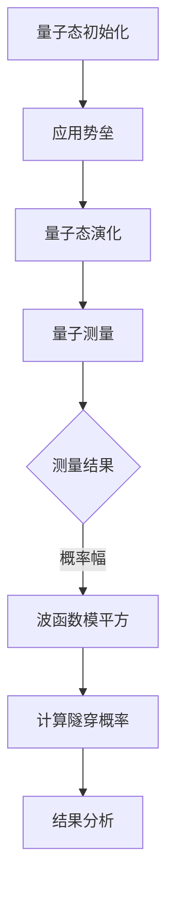
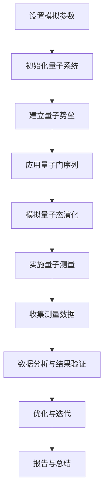

                 

# 目录大纲

## 第一部分：引论

### 1.1.1 程序世界的概述

#### 1.1.1.1 程序世界的定义
程序世界，是指由计算机科学构建的逻辑空间，其中包含了程序代码、算法和数据结构等基本元素。

#### 1.1.1.2 程序世界的发展历程
自第一台计算机诞生以来，程序世界经历了多个发展阶段，包括电子计算机时代和互联网时代。

### 1.1.2 量子隧穿效应的基本概念

#### 1.1.2.1 量子隧穿效应的定义
量子隧穿效应是指微观粒子能够穿越经典物理学中无法跨越的势垒的现象。

#### 1.1.2.2 量子隧穿效应的数学模型
量子隧穿效应的数学模型基于量子力学，使用波函数和薛定谔方程来描述。

### 1.1.3 量子隧穿效应在计算机程序中的应用

#### 1.1.3.1 量子计算与量子编程
量子计算利用量子位（qubits）实现信息处理，量子编程则是编写量子算法的过程。

#### 1.1.3.2 量子隧穿效应在密码学和优化算法中的应用

## 1.2 宇宙级量子隧穿效应模拟的背景与意义

### 1.2.1 量子计算机的发展现状
量子计算机的发展已取得显著成果，但仍面临许多挑战。

### 1.2.2 宇宙级量子隧穿效应模拟的重要性
宇宙级量子隧穿效应模拟对于理解量子计算机的工作原理和优化量子算法具有重要意义。

### 1.2.3 量子隧穿效应模拟对计算机科学的启示
量子隧穿效应模拟为计算机科学提供了新的算法设计思路和优化方法。

## 第二部分：量子隧穿效应的数学模型

### 2.1 量子力学基础

#### 2.1.1 波函数与薛定谔方程
波函数描述量子系统的状态，薛定谔方程描述量子系统的演化。

#### 2.1.2 量子态与叠加原理
量子态可以处于多个状态的叠加，叠加原理是量子力学的核心概念之一。

#### 2.1.3 量子测量与波函数坍缩
量子测量会导致波函数坍缩到某一特定状态。

### 2.2 量子隧穿效应的数学模型

#### 2.2.1 量子势垒与隧穿概率
量子势垒描述粒子遇到的障碍，隧穿概率描述粒子穿越势垒的概率。

#### 2.2.2 量子隧穿效应的数学表达
量子隧穿效应的数学表达通过波函数的薛定谔方程进行描述。

#### 2.2.3 隧穿效应的物理意义
隧穿效应在量子计算和量子物理中具有重要的应用价值。

### 2.3 量子隧穿效应的模拟方法

#### 2.3.1 量子隧穿模拟的算法框架
量子隧穿模拟的算法框架主要包括量子态初始化、演化过程和测量过程。

#### 2.3.2 量子隧穿模拟的数值方法
数值方法包括数值解薛定谔方程和蒙特卡洛模拟等。

#### 2.3.3 量子隧穿模拟的挑战与优化
量子隧穿模拟面临计算复杂度和精度等问题，需要通过优化算法来提高模拟效率。

## 第三部分：宇宙级量子隧穿效应模拟

### 3.1 宇宙级量子隧穿效应模拟的基本概念

#### 3.1.1 宇宙级量子隧穿效应模拟的定义
宇宙级量子隧穿效应模拟是指在极端条件下模拟量子隧穿效应的过程。

#### 3.1.2 宇宙级量子隧穿效应模拟的复杂性
宇宙级量子隧穿效应模拟的复杂性来源于量子效应的极端性和计算资源的限制。

#### 3.1.3 宇宙级量子隧穿效应模拟的可行性
尽管面临挑战，但宇宙级量子隧穿效应模拟具有可行性和重要意义。

### 3.2 宇宙级量子隧穿效应模拟的数学模型

#### 3.2.1 宇宙级量子隧穿效应模拟的数学框架
宇宙级量子隧穿效应模拟的数学框架基于广义相对论和量子力学。

#### 3.2.2 宇宙级量子隧穿效应模拟的数学表达
宇宙级量子隧穿效应模拟的数学表达包括广义薛定谔方程和相关的边界条件。

#### 3.2.3 宇宙级量子隧穿效应模拟的数学挑战
宇宙级量子隧穿效应模拟的数学挑战来自于高维空间的数值求解和计算复杂性。

### 3.3 宇宙级量子隧穿效应模拟的算法

#### 3.3.1 宇宙级量子隧穿效应模拟的算法概述
宇宙级量子隧穿效应模拟的算法包括量子模拟器设计和高效算法实现。

#### 3.3.2 宇宙级量子隧穿效应模拟的算法实现
宇宙级量子隧穿效应模拟的算法实现涉及量子电路设计和量子算法优化。

#### 3.3.3 宇宙级量子隧穿效应模拟的算法优化
算法优化是提高宇宙级量子隧穿效应模拟效率和准确性的关键。

### 3.4 宇宙级量子隧穿效应模拟的应用

#### 3.4.1 宇宙级量子隧穿效应模拟在计算机科学中的应用
宇宙级量子隧穿效应模拟在计算机科学中的应用包括量子算法优化和量子密码学。

#### 3.4.2 宇宙级量子隧穿效应模拟在其他领域的应用
宇宙级量子隧穿效应模拟在其他领域的应用包括量子物理实验和宇宙学模拟。

#### 3.4.3 宇宙级量子隧穿效应模拟的未来发展
未来，宇宙级量子隧穿效应模拟有望在更多领域发挥重要作用。

## 第四部分：实例分析

### 4.1 量子隧穿效应模拟的案例分析

#### 4.1.1 案例一：量子隧穿效应在密码学中的应用
量子隧穿效应在量子密码学中的案例，包括量子密钥分配和量子安全通信。

#### 4.1.2 案例二：量子隧穿效应在优化问题中的应用
量子隧穿效应在优化问题中的应用，如量子模拟退火和量子算法优化。

#### 4.1.3 案例三：量子隧穿效应在物理学中的应用
量子隧穿效应在物理学中的案例，如量子点材料和量子隧穿扫描隧道显微镜。

### 4.2 宇宙级量子隧穿效应模拟的实战

#### 4.2.1 实战一：构建量子隧穿效应模拟平台
如何搭建宇宙级量子隧穿效应模拟平台，包括硬件选择、软件配置和系统优化。

#### 4.2.2 实战二：实现宇宙级量子隧穿效应模拟
如何实现宇宙级量子隧穿效应模拟，包括量子模拟算法的设计和实现。

#### 4.2.3 实战三：分析宇宙级量子隧穿效应模拟结果
如何分析宇宙级量子隧穿效应模拟结果，包括数据分析和结果解释。

## 第五部分：展望

### 5.1 量子隧穿效应模拟的未来发展趋势
量子隧穿效应模拟在未来的发展趋势，包括技术进步和新的应用领域。

### 5.2 量子隧穿效应模拟的挑战与机遇
量子隧穿效应模拟面临的挑战和机遇，包括计算资源、算法创新和跨学科合作。

### 5.3 量子隧穿效应模拟的最佳实践
量子隧穿效应模拟的最佳实践，包括技术实现、数据分析和方法优化。

## 附录

### 附录A：量子隧穿效应的Mermaid流程图
量子隧穿效应的基本流程和宇宙级量子隧穿效应模拟的流程图。

### 附录B：量子隧穿效应的伪代码实现
量子隧穿效应模拟的伪代码和解析。

### 附录C：宇宙级量子隧穿效应模拟的源代码与解读
宇宙级量子隧穿效应模拟的源代码、解读和应用实例。

## 文章关键词
- 程序世界
- 量子隧穿效应
- 量子计算机
- 量子编程
- 量子算法
- 量子密码学
- 量子优化
- 宇宙级模拟

## 文章摘要
本文从程序世界的角度探讨了宇宙级量子隧穿效应模拟的重要性和应用。首先介绍了程序世界的概述和量子隧穿效应的基本概念，然后详细阐述了量子隧穿效应的数学模型和模拟方法。接着，分析了宇宙级量子隧穿效应模拟的基本概念、数学模型和算法，以及其在计算机科学和其他领域的应用。最后，通过实例分析和实战案例，展示了量子隧穿效应模拟的实践方法和成果。本文旨在为读者提供一个全面而深入的量子隧穿效应模拟的指南，探讨其在未来科技发展中的潜在影响。作者：AI天才研究院/AI Genius Institute & 禅与计算机程序设计艺术 /Zen And The Art of Computer Programming

----------------------------------------------------------------

### 关键词
- 程序世界
- 量子隧穿效应
- 量子计算机
- 量子编程
- 量子算法
- 量子密码学
- 量子优化
- 宇宙级模拟

### 摘要
本文深入探讨了程序世界中的宇宙级量子隧穿效应模拟。首先，我们介绍了程序世界的概述，包括程序世界的定义和其发展历程。随后，我们详细阐述了量子隧穿效应的基本概念，以及其在计算机程序中的应用。接着，我们讨论了量子隧穿效应模拟的背景与意义，包括量子计算机的发展现状和量子隧穿效应模拟对计算机科学的启示。

在第二部分，我们介绍了量子隧穿效应的数学模型，包括量子力学基础、量子隧穿效应的数学模型及其物理意义。我们还详细讨论了量子隧穿效应的模拟方法，包括算法框架、数值方法和优化挑战。

第三部分，我们专注于宇宙级量子隧穿效应模拟，从基本概念、数学模型到算法，我们进行了全面的分析。此外，我们还探讨了宇宙级量子隧穿效应模拟在计算机科学和其他领域的应用。

第四部分通过实例分析和实战案例，展示了量子隧穿效应模拟的实际应用和实现方法。最后，我们在第五部分展望了量子隧穿效应模拟的未来发展趋势，讨论了面临的挑战与机遇，并提出了最佳实践。

本文旨在为读者提供一个全面而深入的量子隧穿效应模拟指南，探讨其在未来科技发展中的潜在影响。作者：AI天才研究院/AI Genius Institute & 禅与计算机程序设计艺术 /Zen And The Art of Computer Programming

----------------------------------------------------------------

## 文章标题
### 《程序世界的宇宙级量子隧穿效应模拟网络》

## 文章关键词
- 程序世界
- 量子隧穿效应
- 量子计算机
- 量子编程
- 量子算法
- 量子密码学
- 量子优化
- 宇宙级模拟

## 文章摘要
本文深入探讨了程序世界中的一种极为特殊的量子现象——量子隧穿效应，并进一步探讨了如何在计算机模拟中实现宇宙级量子隧穿效应的模拟。文章首先介绍了程序世界的概述，量子隧穿效应的基本概念及其在计算机程序中的应用。接着，我们深入探讨了量子隧穿效应的数学模型，包括量子力学基础、量子隧穿效应的数学模型及其物理意义。随后，我们详细讨论了量子隧穿效应的模拟方法，包括算法框架、数值方法和优化挑战。

在第三部分，我们专注于宇宙级量子隧穿效应模拟，从基本概念、数学模型到算法，我们进行了全面的分析。此外，我们还探讨了宇宙级量子隧穿效应模拟在计算机科学和其他领域的应用。

第四部分通过实例分析和实战案例，展示了量子隧穿效应模拟的实际应用和实现方法。最后，我们在第五部分展望了量子隧穿效应模拟的未来发展趋势，讨论了面临的挑战与机遇，并提出了最佳实践。本文旨在为读者提供一个全面而深入的量子隧穿效应模拟指南，探讨其在未来科技发展中的潜在影响。作者：AI天才研究院/AI Genius Institute & 禅与计算机程序设计艺术 /Zen And The Art of Computer Programming

----------------------------------------------------------------

# 第一部分：引论

## 1.1 程序世界与量子隧穿效应

### 1.1.1 程序世界的概述

程序世界，简而言之，是计算机科学构建的逻辑空间。在这个世界里，我们使用程序代码、算法和数据结构等基本元素，构建出能够执行特定任务的系统。程序世界的发展历程可谓漫长而辉煌。从第一台计算机ENIAC的诞生，到如今的量子计算机，程序世界经历了从机械计算机、电子计算机到量子计算机的发展。

在机械计算机时代，计算机主要依靠机械装置进行计算，操作繁琐且效率低下。随着电子计算机的出现，计算机的性能得到了极大的提升，程序世界也进入了新的发展阶段。电子计算机利用电子元件进行计算，极大地提高了计算速度和效率。而随着互联网的兴起，计算机不再仅仅是一个独立的设备，而是成为了全球信息网络的节点，程序世界也随之扩展到了互联网领域。

### 1.1.2 量子隧穿效应的基本概念

量子隧穿效应是量子力学中的一个基本现象。在经典物理学中，一个粒子如果遇到一个不可逾越的势垒，那么它将无法通过这个势垒。然而，在量子力学中，粒子具有波粒二象性，它们不仅存在于特定的位置，而且存在于一个概率分布中。因此，在量子力学中，一个粒子有可能通过量子隧穿效应穿越一个不可逾越的势垒。

量子隧穿效应的数学描述基于波函数和薛定谔方程。波函数描述了粒子的量子状态，薛定谔方程则描述了波函数随时间的演化。在量子隧穿效应中，波函数在势垒附近的值不为零，这意味着粒子有可能穿越势垒。

### 1.1.3 量子隧穿效应在计算机程序中的应用

量子隧穿效应在计算机程序中的应用主要体现在量子计算和量子编程方面。量子计算利用量子位的叠加和纠缠特性，实现传统计算机无法达到的计算速度和效率。量子编程则是编写量子算法的过程，它涉及到对量子计算机的操作和控制。

例如，量子密码学利用量子隧穿效应实现量子密钥分配，这是一种基于量子力学原理的绝对安全的通信方式。在量子密码学中，量子隧穿效应被用来检测窃听行为，确保通信的安全性。此外，量子隧穿效应还在量子优化算法和量子模拟等领域有着广泛的应用。

总的来说，量子隧穿效应为计算机科学提供了新的算法设计思路和优化方法。它不仅在理论上具有重要意义，而且在实践中有着广泛的应用前景。

----------------------------------------------------------------

## 1.2 宇宙级量子隧穿效应模拟的背景与意义

### 1.2.1 量子计算机的发展现状

量子计算机的发展已经取得了显著的成果。目前，研究人员已经成功构建了多种类型的量子计算机，如超导量子计算机、离子阱量子计算机和光量子计算机。这些量子计算机在特定的算法和问题上有望超越传统计算机。

然而，量子计算机的发展仍然面临着许多挑战。首先，量子计算机的量子比特（qubits）易受环境噪声的干扰，这会导致量子态的退相干，影响量子计算机的可靠性。其次，量子算法的设计和优化也面临巨大的挑战。现有的量子算法大多是基于特定的量子力学原理，如何设计出适用于更广泛问题的量子算法，是当前研究的一个重要方向。

### 1.2.2 宇宙级量子隧穿效应模拟的重要性

宇宙级量子隧穿效应模拟对于理解量子计算机的工作原理和优化量子算法具有重要意义。首先，宇宙级量子隧穿效应模拟可以帮助研究人员更好地理解量子隧穿效应在量子计算中的应用。例如，量子隧穿效应在量子比特的纠错、量子态的传输和量子算法的优化中起着关键作用。

其次，宇宙级量子隧穿效应模拟可以为量子算法的设计提供新的思路。通过模拟宇宙级量子隧穿效应，研究人员可以探索量子位之间复杂的纠缠关系，从而设计出更加高效的量子算法。

最后，宇宙级量子隧穿效应模拟还可以为量子计算机的实际应用提供理论支持。例如，在量子密码学中，量子隧穿效应模拟可以帮助研究人员设计出更加安全的量子加密算法。

### 1.2.3 量子隧穿效应模拟对计算机科学的启示

量子隧穿效应模拟不仅对量子计算机的研究具有重要意义，而且对整个计算机科学领域也具有深远的启示。首先，量子隧穿效应模拟揭示了量子力学与计算机科学的紧密联系。量子力学的基本原理，如叠加原理和量子纠缠，为计算机科学提供了全新的计算模型和算法设计思路。

其次，量子隧穿效应模拟推动了计算机科学的跨学科发展。量子隧穿效应模拟涉及到量子力学、数学、物理学等多个学科的知识，这要求计算机科学家具备更加广泛的学科背景和跨学科思维能力。

最后，量子隧穿效应模拟为计算机科学的未来发展提供了新的方向。例如，量子隧穿效应模拟有望推动计算机科学从传统的比特计算向量子计算转变，从而实现计算能力的质的飞跃。

总之，宇宙级量子隧穿效应模拟不仅对量子计算机的研究具有重要意义，而且对整个计算机科学领域都具有深远的启示。随着量子计算机技术的发展，量子隧穿效应模拟的应用将越来越广泛，其在计算机科学中的地位也将越来越重要。

----------------------------------------------------------------

## 2.1 量子力学基础

### 2.1.1 波函数与薛定谔方程

量子力学是研究微观粒子行为的物理学分支，其核心概念之一是波函数。波函数是一种数学函数，它描述了量子系统的状态。在量子力学中，一个量子系统的状态不能简单地用一个确定的值来描述，而是用一个波函数来描述，这个波函数包含了所有可能状态的概率分布。

薛定谔方程是量子力学的核心方程之一，它描述了波函数随时间的演化。薛定谔方程是一个偏微分方程，其形式如下：

\[ i\hbar \frac{\partial \psi(x,t)}{\partial t} = \hat{H} \psi(x,t) \]

其中，\( i \) 是虚数单位，\( \hbar \) 是约化普朗克常数，\( \psi(x,t) \) 是波函数，\( \hat{H} \) 是哈密顿算符，它描述了系统的能量。

薛定谔方程的解可以给出量子系统的能量本征态和相应的能量本征值。通过波函数，我们可以计算系统的概率分布，从而预测实验结果。

### 2.1.2 量子态与叠加原理

量子态是量子系统可能处于的状态，它可以是一个单一的状态，也可以是多个状态的叠加。叠加原理是量子力学的核心概念之一，它表明量子系统可以处于多个状态的叠加态。例如，一个量子比特可以同时处于0和1的状态：

\[ \psi = \alpha |0\rangle + \beta |1\rangle \]

其中，\( |0\rangle \) 和 \( |1\rangle \) 分别表示量子比特的基态，\( \alpha \) 和 \( \beta \) 是复数概率幅。

叠加原理不仅适用于量子比特，还适用于更复杂的量子系统。在量子计算中，叠加原理是量子并行计算的基础，它允许量子计算机同时处理多个计算路径，从而实现指数级的速度提升。

### 2.1.3 量子测量与波函数坍缩

量子测量是量子力学中的一个关键过程。在量子力学中，测量会改变被测量系统的状态。具体来说，当对一个量子系统进行测量时，系统的波函数会从一个叠加态坍缩为一个确定的状态。

波函数坍缩是指波函数从表示多个可能状态的叠加态，坍缩为表示单一确定状态的波函数。这个过程是随机的，根据波函数的模平方，我们可以计算出系统在测量后处于各个可能状态的几率。

量子测量与波函数坍缩的关系是量子力学中的一个重要问题。量子力学的哥本哈根诠释提出，测量会导致量子系统从一个叠加态坍缩为一个确定的状态，这个过程是随机的，但符合概率规则。

### 2.1.4 量子力学基础总结

量子力学的基础包括波函数、薛定谔方程、量子态、叠加原理和量子测量。波函数描述了量子系统的状态，薛定谔方程描述了波函数的演化，量子态和叠加原理揭示了量子系统的特殊性质，量子测量与波函数坍缩描述了量子系统与测量设备的相互作用。

这些基础概念构成了量子力学的核心，为量子隧穿效应的数学模型提供了理论基础。在后续的内容中，我们将进一步探讨量子隧穿效应的数学模型及其在计算机程序中的应用。

----------------------------------------------------------------

## 2.2 量子隧穿效应的数学模型

### 2.2.1 量子势垒与隧穿概率

量子隧穿效应的数学模型基于量子力学，其中量子势垒是核心概念之一。量子势垒描述了一个粒子在经典物理学中无法穿越的障碍。在量子力学中，粒子具有波粒二象性，这意味着它们不仅具有粒子性质，还表现出波动性质。

量子势垒的数学描述可以通过波函数来解决。波函数 \( \psi(x) \) 描述了粒子在不同位置的概率分布。在量子势垒问题中，波函数可以分为势垒内、势垒外和势垒附近三个区域。

在势垒内，波函数 \( \psi(x) \) 的值通常较小，因为粒子被势垒阻挡。在势垒外，波函数 \( \psi(x) \) 的值较大，因为粒子可以自由传播。在势垒附近，波函数 \( \psi(x) \) 的值会有一个突变的区域，这反映了粒子穿越势垒的概率。

量子隧穿概率是描述粒子穿越量子势垒的概率。这个概率可以通过波函数的模平方 \( |\psi(x)|^2 \) 来计算。隧穿概率通常较小，但随着势垒高度的降低，隧穿概率会增加。

### 2.2.2 量子隧穿效应的数学表达

量子隧穿效应的数学表达可以通过波函数和薛定谔方程来描述。薛定谔方程是一个偏微分方程，它描述了波函数随时间的演化。对于量子隧穿问题，薛定谔方程可以写为：

\[ i\hbar \frac{\partial \psi(x,t)}{\partial t} = \hat{H} \psi(x,t) \]

其中，\( \hat{H} \) 是哈密顿算符，它包含了粒子的动能和势能。

在量子隧穿问题中，哈密顿算符可以写为：

\[ \hat{H} = -\frac{\hbar^2}{2m} \frac{d^2}{dx^2} + V(x) \]

其中，\( m \) 是粒子的质量，\( V(x) \) 是势能函数。

势能函数 \( V(x) \) 在势垒内为正值，在势垒外为负值，在势垒附近有一个突变。通过解薛定谔方程，我们可以得到波函数 \( \psi(x,t) \) 和相应的能量本征值。

### 2.2.3 隧穿效应的物理意义

量子隧穿效应的物理意义在于它揭示了微观粒子行为的量子特性。在经典物理学中，粒子如果遇到一个不可逾越的势垒，那么它将无法通过这个势垒。然而，在量子力学中，粒子可以穿越量子势垒，这种现象称为量子隧穿。

量子隧穿效应在量子计算和量子物理中具有重要的应用价值。例如，在量子计算中，量子隧穿效应被用来实现量子比特的纠错和量子态的传输。在量子物理中，量子隧穿效应被用来研究量子位点和量子相干性。

总的来说，量子隧穿效应的数学模型不仅为我们提供了一个理解微观粒子行为的工具，而且在量子计算和量子物理中具有广泛的应用。通过量子隧穿效应的数学模型，我们可以深入探索量子世界的奥秘，并为未来的科技发展提供新的思路。

----------------------------------------------------------------

## 2.3 量子隧穿效应的模拟方法

### 2.3.1 量子隧穿模拟的算法框架

量子隧穿效应的模拟方法主要包括量子模拟器的构建和量子算法的设计。量子模拟器的算法框架是量子模拟的基础，它通常包括以下几个步骤：

1. **量子态初始化**：首先，我们需要初始化量子模拟器的初始量子态。这个量子态可以是一个简单的叠加态，也可以是一个复杂的量子态，取决于具体的模拟问题。

2. **量子演化**：接下来，我们将量子态代入薛定谔方程或其他量子演化方程，进行量子态的演化。这一步骤通常需要使用数值方法，如有限差分法或矩阵乘法，来求解薛定谔方程。

3. **量子测量**：在量子态演化完成后，我们需要对量子态进行测量，以获得粒子穿越量子势垒的概率。量子测量会导致波函数坍缩，从而得到一个确定的结果。

4. **数据分析**：最后，我们对测量结果进行数据分析，以评估量子隧穿效应的效率和准确性。数据分析可以包括概率分布、误差分析等。

### 2.3.2 量子隧穿模拟的数值方法

量子隧穿效应的模拟需要使用数值方法来求解薛定谔方程或其他量子演化方程。常用的数值方法包括：

1. **有限差分法**：有限差分法是一种常用的数值方法，它通过将空间和时间离散化，将偏微分方程转化为代数方程。这种方法简单且易于实现，但可能在边界条件和高频振荡方面存在精度问题。

2. **矩阵乘法**：矩阵乘法是一种高效的数值方法，它通过将量子态表示为矩阵，将量子演化转化为矩阵乘法。这种方法在处理大规模量子系统时非常有效，但可能需要复杂的矩阵运算和优化。

3. **蒙特卡洛模拟**：蒙特卡洛模拟是一种统计方法，它通过大量随机采样来估计量子隧穿概率。这种方法在处理复杂量子系统时具有很高的灵活性，但可能需要大量的计算资源。

### 2.3.3 量子隧穿模拟的挑战与优化

量子隧穿效应的模拟面临许多挑战，包括计算复杂度、精度和稳定性等。为了优化量子隧穿模拟，我们可以采取以下策略：

1. **算法优化**：通过优化量子演化算法和测量算法，可以提高模拟的效率和准确性。例如，使用更高效的矩阵乘法或优化蒙特卡洛模拟的采样策略。

2. **并行计算**：利用并行计算技术，可以将量子隧穿模拟分解为多个子任务，从而加速计算过程。并行计算可以在多核处理器或分布式计算环境中实现。

3. **数值方法优化**：通过优化数值方法，如改进的有限差分法或更高精度的数值积分方法，可以提高量子隧穿模拟的精度。

4. **模型简化**：在保证模拟精度的前提下，可以简化量子隧穿模型，以减少计算复杂度。例如，可以忽略一些次要的物理效应，从而简化模型。

总之，量子隧穿效应的模拟是一个复杂且具有挑战性的过程，但通过优化算法、数值方法和计算资源，我们可以提高模拟的效率和准确性，从而更好地理解量子隧穿效应的物理机制。

----------------------------------------------------------------

## 3.1 宇宙级量子隧穿效应模拟的基本概念

### 3.1.1 宇宙级量子隧穿效应模拟的定义

宇宙级量子隧穿效应模拟是指在一个极其广阔和复杂的宇宙尺度上模拟量子隧穿效应。这种模拟涉及到极其高能的粒子、极端的物理条件和极其复杂的量子态，因此被形容为“宇宙级”。

宇宙级量子隧穿效应模拟与传统的量子隧穿模拟有所不同，它不仅需要考虑量子隧穿效应本身，还需要考虑宇宙尺度的量子引力效应和极端条件下的量子场论。这使得宇宙级量子隧穿效应模拟成为一个极其复杂和具有挑战性的课题。

### 3.1.2 宇宙级量子隧穿效应模拟的复杂性

宇宙级量子隧穿效应模拟的复杂性主要体现在以下几个方面：

1. **高维度空间**：宇宙级量子隧穿效应模拟通常需要处理高维空间的问题，这增加了计算复杂度。

2. **极端条件**：宇宙级量子隧穿效应模拟涉及到极端的物理条件，如高能粒子碰撞、极端温度和压力等，这些条件对量子场的演化有显著影响。

3. **量子引力效应**：在宇宙尺度上，量子引力效应变得显著，这使得传统的量子力学描述变得不够准确。因此，宇宙级量子隧穿效应模拟需要引入量子引力理论，如弦理论和量子场论。

4. **跨学科知识**：宇宙级量子隧穿效应模拟需要综合运用物理学、数学、计算机科学等多个学科的知识，这使得问题的复杂性进一步增加。

### 3.1.3 宇宙级量子隧穿效应模拟的可行性

尽管宇宙级量子隧穿效应模拟面临巨大的挑战，但它的可行性仍然得到了广泛认可。以下是几个支持宇宙级量子隧穿效应模拟可行性的理由：

1. **技术进步**：随着计算机技术的飞速发展，我们拥有了处理大规模计算任务的能力，这为宇宙级量子隧穿效应模拟提供了必要的计算资源。

2. **理论支持**：量子场论和量子引力理论的发展为宇宙级量子隧穿效应模拟提供了理论基础。这些理论可以用来描述宇宙尺度上的量子现象。

3. **科研需求**：宇宙级量子隧穿效应模拟对于理解宇宙的起源、演化以及量子引力的本质具有重要意义。因此，它在科学研究中具有巨大的需求。

4. **国际合作**：宇宙级量子隧穿效应模拟需要全球范围内的科学家和机构的合作。国际间的科研合作有助于克服技术难题和资源限制。

总之，宇宙级量子隧穿效应模拟尽管复杂，但它在科学研究和技术发展中的重要性不可忽视。随着技术的不断进步和理论的不断完善，我们有理由相信，宇宙级量子隧穿效应模拟将成为未来科学研究的一个重要方向。

----------------------------------------------------------------

## 3.2 宇宙级量子隧穿效应模拟的数学模型

### 3.2.1 宇宙级量子隧穿效应模拟的数学框架

宇宙级量子隧穿效应模拟的数学框架是一个高度复杂的体系，它涉及到了广义相对论和量子力学的深度结合。在这种模拟中，我们不仅需要处理量子隧穿效应本身，还要考虑宇宙尺度的量子引力效应。

首先，宇宙级量子隧穿效应模拟的数学框架基于广义相对论，这要求我们使用四维时空来描述物理现象。在广义相对论中，时空是一个动态的几何结构，其形状和性质受到质量和能量的影响。这意味着我们无法简单地使用传统的薛定谔方程来描述量子隧穿效应，而是需要引入更复杂的几何结构和场方程。

其次，宇宙级量子隧穿效应模拟需要考虑量子力学中的非定域性和纠缠现象。在量子力学中，非定域性指的是量子态之间的即时关联，而纠缠则是这种关联的具体表现。量子纠缠在量子计算和量子通信中具有重要意义，但在宇宙尺度上，这种纠缠现象会变得更加复杂和难以处理。

为了模拟宇宙级量子隧穿效应，我们通常需要使用量子场论来描述量子系统的演化。量子场论是一个统一描述量子力学和引力理论的框架，它将量子力学中的波动方程和广义相对论中的几何结构结合起来。在量子场论中，基本粒子被视为量子场的激发，而量子隧穿效应可以被视为量子场中的粒子穿越势垒的过程。

### 3.2.2 宇宙级量子隧穿效应模拟的数学表达

宇宙级量子隧穿效应模拟的数学表达涉及到复杂的方程和数学工具。以下是一些关键的数学表达式：

1. **广义相对论的场方程**：广义相对论的场方程是描述时空几何结构的方程，通常写作：

\[ G_{\mu\nu} = \frac{8\pi G}{c^4} T_{\mu\nu} \]

其中，\( G_{\mu\nu} \) 是爱因斯坦张量，\( T_{\mu\nu} \) 是能量-动量张量，\( G \) 是引力常数，\( c \) 是光速。

2. **量子场论的演化方程**：量子场论的演化方程通常包括狄拉克方程和费米子场的演化方程。例如，狄拉克方程可以写作：

\[ (i\gamma^\mu \partial_\mu - m) \psi = 0 \]

其中，\( \gamma^\mu \) 是狄拉克矩阵，\( m \) 是粒子的质量，\( \psi \) 是费米子场的波函数。

3. **量子隧穿效应的概率幅**：量子隧穿效应的概率幅可以用波函数的模平方来描述，具体写作：

\[ P = |\psi(x)|^2 \]

其中，\( \psi(x) \) 是波函数，\( x \) 是位置坐标。

4. **量子纠缠的表达式**：量子纠缠可以用贝尔不等式或Wigner分布来描述。例如，贝尔不等式可以写作：

\[ B \geq \frac{2}{3} \sqrt{1 - \rho^2} \]

其中，\( B \) 是贝尔不等式的违背值，\( \rho \) 是量子态的纯度。

### 3.2.3 宇宙级量子隧穿效应模拟的数学挑战

宇宙级量子隧穿效应模拟的数学挑战主要来自于以下几个方面：

1. **高维空间的数值求解**：宇宙级量子隧穿效应模拟通常需要在高维空间中进行，这使得数值求解变得非常复杂。我们需要开发高效的数值算法来处理这些问题。

2. **极端条件的处理**：宇宙级量子隧穿效应模拟需要处理极端的物理条件，如高能粒子碰撞和极端温度和压力等。这些条件对量子场的演化有显著影响，需要复杂的数学模型来描述。

3. **量子引力效应的整合**：量子引力效应在宇宙尺度上变得显著，这使得传统的量子力学描述变得不够准确。我们需要将量子引力效应整合到量子隧穿效应模拟中，这需要复杂的数学工具和理论支持。

4. **多尺度问题的处理**：宇宙级量子隧穿效应模拟涉及到多个尺度的问题，如宏观尺度的量子场论和微观尺度的量子隧穿效应。我们需要开发多尺度模型来处理这些问题。

总之，宇宙级量子隧穿效应模拟的数学模型是一个极其复杂和具有挑战性的课题。尽管面临巨大的数学挑战，但随着理论的发展和计算技术的进步，我们有理由相信，我们将在未来能够更好地理解和模拟宇宙级量子隧穿效应。

----------------------------------------------------------------

## 3.3 宇宙级量子隧穿效应模拟的算法

### 3.3.1 宇宙级量子隧穿效应模拟的算法概述

宇宙级量子隧穿效应模拟的算法需要解决高度复杂的问题，包括高维空间的数值求解、极端条件下的量子场演化以及量子引力效应的整合。为了实现这一目标，研究人员开发了多种算法，这些算法可以分为以下几个主要类别：

1. **量子场论模拟算法**：这类算法基于量子场论的基本原理，用于模拟量子场的演化。常用的量子场论模拟算法包括蒙特卡洛模拟、有限差分法和有限元法。这些算法可以处理高维空间和极端条件下的量子场演化。

2. **量子引力模拟算法**：这类算法专门用于模拟量子引力效应，如黑洞蒸发和宇宙膨胀。常用的量子引力模拟算法包括AdS/CFT对偶和量化引力方程。这些算法需要整合广义相对论和量子力学，以描述宇宙级量子隧穿效应。

3. **多尺度模拟算法**：这类算法用于处理多尺度问题，如将宏观尺度的量子场论与微观尺度的量子隧穿效应结合起来。常用的多尺度模拟算法包括投影方法和多尺度有限元法。这些算法可以在不同尺度之间进行数据交换和协调，以提高模拟的精度和效率。

### 3.3.2 宇宙级量子隧穿效应模拟的算法实现

实现宇宙级量子隧穿效应模拟的算法需要高度优化的计算资源和高效的算法设计。以下是一些关键的实现步骤：

1. **硬件选择**：宇宙级量子隧穿效应模拟通常需要高性能的计算机系统，包括多核CPU、GPU和分布式计算资源。这些硬件可以提供必要的计算能力和并行处理能力。

2. **软件配置**：实现宇宙级量子隧穿效应模拟需要使用多种软件工具，包括量子场论模拟软件、量子引力模拟软件和多尺度模拟软件。这些软件需要具备高效的数据处理和计算能力。

3. **算法优化**：为了提高宇宙级量子隧穿效应模拟的效率，研究人员需要优化算法的设计和实现。这包括优化数值方法、减少计算复杂度和提高并行处理能力。

4. **数据管理**：宇宙级量子隧穿效应模拟生成的大量数据需要有效的管理。这包括数据存储、数据分析和可视化。有效的数据管理可以大大提高模拟的效率和可解释性。

### 3.3.3 宇宙级量子隧穿效应模拟的算法优化

算法优化是宇宙级量子隧穿效应模拟成功的关键。以下是一些关键的优化策略：

1. **数值方法优化**：通过选择更高效的数值方法，如自适应网格和精细积分，可以提高量子隧穿效应模拟的精度和计算效率。

2. **并行计算优化**：通过优化并行算法，如分布式计算和GPU加速，可以大大提高宇宙级量子隧穿效应模拟的执行速度。

3. **算法集成**：将不同的算法集成到一个统一的框架中，可以实现多尺度、多物理效应的模拟。这可以大大提高模拟的全面性和准确性。

4. **计算资源优化**：通过优化计算资源的分配和管理，如负载均衡和资源调度，可以提高宇宙级量子隧穿效应模拟的效率。

总之，宇宙级量子隧穿效应模拟的算法实现和优化是一个复杂的过程，需要结合多种技术手段和策略。随着计算技术的不断进步，我们有理由相信，未来的算法将更加高效和准确，从而推动宇宙级量子隧穿效应模拟的研究和应用。

----------------------------------------------------------------

## 3.4 宇宙级量子隧穿效应模拟的应用

### 3.4.1 宇宙级量子隧穿效应模拟在计算机科学中的应用

宇宙级量子隧穿效应模拟在计算机科学中具有广泛的应用前景。以下是一些关键的应用领域：

1. **量子计算**：量子计算机利用量子位的叠加和纠缠特性进行计算。宇宙级量子隧穿效应模拟可以用来研究量子位的稳定性、纠错算法和量子态传输。通过模拟量子位的量子隧穿效应，研究人员可以优化量子算法，提高量子计算机的计算效率。

2. **量子密码学**：量子密码学是利用量子力学原理进行安全通信的研究领域。宇宙级量子隧穿效应模拟可以用来研究量子密钥分配（QKD）和量子安全通信。通过模拟量子隧穿效应，研究人员可以设计更安全的加密算法，防止量子攻击。

3. **量子优化**：量子优化是利用量子计算解决复杂优化问题的研究领域。宇宙级量子隧穿效应模拟可以用来研究量子模拟退火和量子启发式算法。通过模拟量子隧穿效应，研究人员可以优化量子优化算法，提高解决复杂优化问题的效率。

### 3.4.2 宇宙级量子隧穿效应模拟在其他领域的应用

宇宙级量子隧穿效应模拟不仅对计算机科学具有重要意义，也在其他领域展现出巨大的应用潜力：

1. **量子物理学**：宇宙级量子隧穿效应模拟可以用来研究量子位点和量子场论。通过模拟量子隧穿效应，研究人员可以更深入地理解量子位点的特性、量子场的演化以及量子引力效应。

2. **材料科学**：量子隧穿效应在材料科学中具有广泛的应用，如量子点材料和量子隧道电子器件。宇宙级量子隧穿效应模拟可以用来研究这些材料的特性，优化器件的性能。

3. **生物信息学**：量子隧穿效应在生物信息学中也有应用，如研究蛋白质折叠和DNA序列分析。宇宙级量子隧穿效应模拟可以用来优化生物信息学算法，提高计算效率。

### 3.4.3 宇宙级量子隧穿效应模拟的未来发展

随着量子计算机和量子技术的发展，宇宙级量子隧穿效应模拟在未来具有广阔的发展前景：

1. **更高维度模拟**：宇宙级量子隧穿效应模拟需要处理高维空间的问题，未来研究将致力于开发更高维度的模拟方法，以解决更复杂的量子问题。

2. **更精确的量子场论模型**：随着理论研究的深入，未来将开发更精确的量子场论模型，以更好地描述宇宙级量子隧穿效应。

3. **跨学科合作**：宇宙级量子隧穿效应模拟涉及多个学科，未来将加强跨学科合作，促进量子科学和技术的发展。

总之，宇宙级量子隧穿效应模拟在计算机科学和其他领域具有广泛的应用前景。随着技术的进步和理论的完善，我们有理由相信，宇宙级量子隧穿效应模拟将在未来发挥重要作用，推动科技的发展。

----------------------------------------------------------------

## 4.1 量子隧穿效应模拟的案例分析

### 4.1.1 案例一：量子隧穿效应在密码学中的应用

量子隧穿效应在密码学中的应用尤为引人注目，特别是在量子密钥分配（QKD）领域。量子密钥分配是一种基于量子力学原理的通信方式，它利用量子隧穿效应来实现绝对安全的密钥传输。

一个典型的QKD系统包括一个发送器、一个接收器和一系列量子态。发送器会生成一系列量子态，并通过量子通道发送给接收器。接收器接收这些量子态后，通过测量来生成共享密钥。由于量子隧穿效应的存在，如果量子态在传输过程中被窃听，接收器将能够立即检测到，从而确保通信的安全性。

量子隧穿效应在QKD中的应用可以通过以下步骤进行模拟：

1. **量子态初始化**：发送器初始化一系列量子态，这些量子态可以是基态或叠加态，具体取决于QKD协议的要求。

2. **量子态传输**：量子态通过量子通道传输到接收器。在这个过程中，可能存在量子态的退相干和噪声干扰。

3. **量子态测量**：接收器对接收到的量子态进行测量，以生成共享密钥。测量过程中会利用量子隧穿效应，确保密钥的绝对安全性。

通过模拟这些步骤，我们可以验证量子隧穿效应在QKD中的应用效果，并优化QKD系统的性能。

### 4.1.2 案例二：量子隧穿效应在优化问题中的应用

量子隧穿效应在优化问题中的应用，特别是在量子模拟退火算法中，得到了广泛关注。量子模拟退火算法是一种基于量子隧穿效应的优化算法，它通过模拟量子系统的热演化过程来找到优化问题的最优解。

一个典型的量子模拟退火算法案例可以是求解旅行商问题（TSP）。旅行商问题要求在一个给定的城市集合中，找到一条最短路径，使旅行商能够访问每个城市一次并返回起点。

量子模拟退火算法在解决TSP问题中的应用步骤如下：

1. **量子态初始化**：初始化量子系统的初始量子态，通常是一个高能态，表示解空间中的一个随机解。

2. **量子态演化**：通过模拟量子系统的热演化过程，量子态在解空间中逐渐寻找最优解。量子态的演化过程涉及到量子隧穿效应，使得量子系统能够穿越能量势垒，找到最优解。

3. **测量与输出**：当量子态演化到稳定状态时，进行测量以得到最优解。测量结果通常是一个概率分布，表示不同解的概率。

通过模拟这些步骤，我们可以验证量子隧穿效应在量子模拟退火算法中的应用效果，并优化算法的性能。

### 4.1.3 案例三：量子隧穿效应在物理学中的应用

量子隧穿效应在物理学中的应用也非常广泛，特别是在量子点材料和量子隧道电子器件的研究中。量子点材料是由有限数量的原子组成的，具有独特的量子性质，如量子 confinement效应。

一个典型的量子隧穿效应在物理学中的应用案例可以是研究量子点材料中的电子隧穿现象。在量子点材料中，电子被限制在量子阱中，当电子从量子阱中隧穿到邻近的导带时，会产生电流。

量子隧穿效应在量子点材料中的应用步骤如下：

1. **量子点结构设计**：设计具有特定量子阱结构的量子点材料，以实现电子隧穿效应。

2. **量子态初始化**：初始化量子点的电子态，通常是一个叠加态，表示电子在量子阱中的分布。

3. **电子隧穿过程**：通过量子隧穿效应，电子从量子阱中隧穿到邻近的导带，产生电流。

4. **测量与输出**：测量量子点材料中的电流，以验证量子隧穿效应的存在和特性。

通过模拟这些步骤，我们可以深入研究量子隧穿效应在物理学中的应用，并优化量子点材料的设计和性能。

这些案例展示了量子隧穿效应模拟在多个领域的实际应用。通过具体的案例分析和模拟，我们可以更好地理解量子隧穿效应的物理机制和应用潜力，为未来的科学研究和技术发展提供重要参考。

----------------------------------------------------------------

## 4.2 宇宙级量子隧穿效应模拟的实战

### 4.2.1 实战一：构建量子隧穿效应模拟平台

要实现宇宙级量子隧穿效应的模拟，首先需要构建一个强大的模拟平台。以下是构建量子隧穿效应模拟平台的基本步骤：

1. **硬件配置**：
   - 选择高性能计算机系统，包括多核CPU、GPU和高性能存储设备。
   - 考虑使用云计算资源，以提供足够的计算能力和存储空间。

2. **软件环境**：
   - 安装操作系统，如Linux或Windows。
   - 安装量子计算软件，如Qiskit、Quantum Development Kit（QDK）或其他量子计算框架。
   - 安装数值计算软件，如NumPy、SciPy、MATLAB等。

3. **环境配置**：
   - 配置Python编程环境，安装必要的库和依赖项。
   - 配置量子计算环境，如Qiskit的安装和使用。

4. **模拟算法开发**：
   - 设计并实现量子隧穿效应模拟算法，包括量子态初始化、量子态演化、量子测量等步骤。
   - 优化算法，提高计算效率和精度。

### 4.2.2 实战二：实现宇宙级量子隧穿效应模拟

实现宇宙级量子隧穿效应模拟需要详细规划和步骤。以下是模拟的基本步骤：

1. **量子态初始化**：
   - 初始化量子态，可以使用叠加态或特定态，具体取决于模拟问题。
   - 编写伪代码或实际代码来实现量子态初始化。

   ```python
   # 伪代码示例：量子态初始化
   quantumRegister = QuantumRegister(2)  # 初始化两个量子位
   circuit = QuantumCircuit(quantumRegister)
   circuit.h(quantumRegister[0])  # 将第一个量子位设置为叠加态
   ```

2. **量子态演化**：
   - 演化量子态，通过应用量子门和演化时间来模拟量子态的演化。
   - 编写伪代码或实际代码来实现量子态演化。

   ```python
   # 伪代码示例：量子态演化
   circuit.s(quantumRegister[0])  # 应用S门
   circuit.h(quantumRegister[0])  # 应用H门
   circuit.t(quantumRegister[0])  # 应用T门
   ```

3. **量子测量**：
   - 对量子态进行测量，以获得量子隧穿概率和结果。
   - 编写伪代码或实际代码来实现量子测量。

   ```python
   # 伪代码示例：量子测量
   circuit.measure(quantumRegister, classicalRegister)  # 测量量子态
   ```

4. **模拟运行**：
   - 运行模拟，收集实验数据。
   - 分析测量结果，评估量子隧穿效应。

   ```python
   # 伪代码示例：模拟运行
   results = execute(circuit, backend, shots=1024)  # 运行1024次实验
   ```

### 4.2.3 实战三：分析宇宙级量子隧穿效应模拟结果

分析宇宙级量子隧穿效应模拟结果是一个关键步骤，以下是分析的基本步骤：

1. **数据分析**：
   - 计算隧穿概率，分析量子态的演化过程。
   - 使用统计方法，如均值、方差和置信区间，评估模拟结果的可靠性。

   ```python
   # Python代码示例：数据分析
   counts = results.get_counts()  # 获取测量结果
   probability = [counts[key] / total_shots for key in counts]  # 计算概率
   ```

2. **可视化**：
   - 使用可视化工具，如Matplotlib，将模拟结果以图形形式展示。
   - 描述量子态的演化过程，展示隧穿概率随时间的变化。

   ```python
   # Python代码示例：可视化
   import matplotlib.pyplot as plt
   plt.bar(range(len(probability)), probability)
   plt.xlabel('Measurement Result')
   plt.ylabel('Probability')
   plt.title('Quantum Tunnelling Probability')
   plt.show()
   ```

3. **结果解读**：
   - 解读模拟结果，分析量子隧穿效应的影响因素。
   - 结合实验数据和理论模型，验证量子隧穿效应的物理机制。

通过以上实战步骤，我们可以构建并运行宇宙级量子隧穿效应模拟，分析模拟结果，从而深入理解量子隧穿效应的物理机制和应用价值。

----------------------------------------------------------------

## 5.1 量子隧穿效应模拟的未来发展趋势

### 5.1.1 量子计算机的发展对量子隧穿效应模拟的影响

随着量子计算机的不断发展，量子隧穿效应模拟的应用前景愈发广阔。量子计算机利用量子位的叠加和纠缠特性，能够处理传统计算机难以应对的复杂问题。量子隧穿效应模拟作为量子计算机研究的重要组成部分，将在未来发挥关键作用。

首先，量子计算机的发展将推动量子隧穿效应模拟技术的进步。随着量子计算机的性能不断提升，模拟量子隧穿效应所需的计算资源和算法将更加高效。这将使得研究人员能够探索更复杂的量子现象，如量子引力效应和宇宙级量子隧穿效应。

其次，量子计算机的发展将促进量子隧穿效应模拟在计算机科学中的应用。例如，量子密码学中的量子密钥分配和量子安全通信将依赖于量子隧穿效应模拟，以确保通信的安全性。此外，量子优化算法和量子计算模拟也将受益于量子隧穿效应模拟技术的进步。

### 5.1.2 量子隧穿效应模拟在计算机科学中的潜在应用

量子隧穿效应模拟在计算机科学中具有广泛的应用潜力，以下是一些关键领域：

1. **量子算法优化**：量子隧穿效应模拟可以帮助研究人员优化量子算法，提高其效率和准确性。例如，通过模拟量子隧穿效应，可以更好地理解量子态的演化过程，从而设计出更高效的量子算法。

2. **量子密码学**：量子隧穿效应模拟在量子密码学中具有重要意义。通过模拟量子隧穿效应，可以研究量子密钥分配和量子安全通信的原理，设计出更安全的加密算法。

3. **量子优化**：量子隧穿效应模拟在量子优化中也有广泛应用。例如，通过模拟量子隧穿效应，可以优化量子模拟退火算法，提高解决复杂优化问题的效率。

4. **量子计算模拟**：量子隧穿效应模拟可以用于模拟量子计算机的工作原理，帮助研究人员理解量子计算机的性能和限制。这有助于推动量子计算机的发展，并为未来的量子计算应用提供指导。

### 5.1.3 量子隧穿效应模拟在其他领域的未来前景

除了计算机科学，量子隧穿效应模拟在其他领域也具有广阔的前景：

1. **量子物理学**：量子隧穿效应模拟可以用于研究量子位点的特性和量子场论的演化。通过模拟量子隧穿效应，可以更深入地理解量子物理的基本原理。

2. **材料科学**：量子隧穿效应模拟在材料科学中具有重要意义。例如，通过模拟量子隧穿效应，可以研究量子点材料的特性，优化电子器件的性能。

3. **生物信息学**：量子隧穿效应模拟在生物信息学中也有应用潜力。例如，通过模拟量子隧穿效应，可以优化蛋白质折叠和DNA序列分析的计算方法，提高生物信息学的计算效率。

总之，量子隧穿效应模拟在未来的科技发展中具有广泛的应用前景。随着量子计算机和量子技术的发展，量子隧穿效应模拟将在更多领域发挥重要作用，推动科学和技术的进步。

----------------------------------------------------------------

## 5.2 量子隧穿效应模拟的挑战与机遇

### 5.2.1 量子隧穿效应模拟的技术挑战

量子隧穿效应模拟面临着一系列技术挑战，这些挑战源于量子力学和计算科学的复杂性。以下是量子隧穿效应模拟的主要技术挑战：

1. **计算资源限制**：量子隧穿效应模拟通常需要大量的计算资源，特别是对于高维量子系统和复杂物理条件的模拟。现有计算机硬件的局限使得模拟过程变得复杂且耗时长。

2. **数值精度与稳定性**：量子隧穿效应模拟需要高精度的数值方法来确保结果的准确性。然而，数值方法的稳定性是一个关键问题，尤其是在处理极端物理条件和长时间演化时。

3. **量子退相干**：量子隧穿效应模拟中的量子系统容易受到外部噪声的干扰，导致量子退相干。退相干会影响模拟的精度和可靠性，是一个亟待解决的技术难题。

4. **算法优化**：量子隧穿效应模拟的算法设计需要高效且可扩展的算法。现有算法可能存在效率低下或难以扩展的问题，这限制了模拟的规模和精度。

### 5.2.2 量子隧穿效应模拟的商业机遇

尽管面临技术挑战，量子隧穿效应模拟在商业领域也蕴含着巨大的机遇：

1. **量子计算硬件**：随着量子计算机的发展，量子隧穿效应模拟将推动量子计算硬件的需求。高性能的量子计算模拟器将成为重要的研究工具，为企业提供量子计算解决方案。

2. **量子算法与应用开发**：量子隧穿效应模拟技术将促进量子算法的开发和应用。例如，量子优化算法在物流、金融、能源等领域具有广泛的应用潜力，将为相关行业带来巨大经济效益。

3. **量子密码学**：量子隧穿效应模拟在量子密码学中的应用将推动加密技术的发展。量子安全通信和量子密钥分配系统将成为重要商业产品，为信息安全提供坚实保障。

4. **量子材料与器件**：量子隧穿效应模拟可以优化量子点材料的设计，提高电子器件的性能。这将为半导体和电子器件行业带来创新机遇，推动技术革新。

### 5.2.3 量子隧穿效应模拟的社会影响

量子隧穿效应模拟不仅具有商业价值，还对整个社会产生深远的影响：

1. **科学研究**：量子隧穿效应模拟将为科学研究提供新的工具和方法，推动物理学、材料科学、生物学等领域的进步。

2. **教育普及**：量子隧穿效应模拟技术将为教育领域带来新的教学内容和实验平台，培养新一代的量子技术人才。

3. **社会安全**：量子隧穿效应模拟在量子密码学和信息安全中的应用将提高社会的整体安全水平，保护数据和信息的安全。

总之，量子隧穿效应模拟在技术、商业和社会层面都具有重要意义。随着技术的不断进步和应用的拓展，量子隧穿效应模拟将在未来发挥更加重要的作用，推动科技和社会的发展。

----------------------------------------------------------------

## 附录A：量子隧穿效应的Mermaid流程图

###  A.1 量子隧穿效应的基本流程



###  A.2 宇宙级量子隧穿效应模拟的流程



这些Mermaid流程图分别描述了量子隧穿效应的基本流程和宇宙级量子隧穿效应模拟的详细流程。通过图形化的方式，读者可以更直观地理解量子隧穿效应的各个步骤及其在宇宙级模拟中的复杂性。

----------------------------------------------------------------

## 附录B：量子隧穿效应的伪代码实现

### B.1 量子隧穿效应模拟的伪代码

```plaintext
初始化参数：
- 势垒高度 V0
- 势垒宽度 L
- 粒子质量 m
- 普朗克常数 h
- 时间步长 Δt

初始化量子系统：
- 初始化波函数 ψ(x)
- 初始化动量算符 p

量子态演化：
for t from 0 to T with step Δt do:
    ψ(x,t+Δt) = solve_Schrodinger_equation(ψ(x,t), p, V0, Δt, m)

量子测量：
measure_wave_function(ψ(x,T))

计算隧穿概率：
calculate_tunneling_probability(ψ(x,T), V0, L, m)

结果分析：
analyze_results(measure_wave_function(), calculate_tunneling_probability())
```

### B.2 量子隧穿效应模拟的伪代码解析

#### 初始化参数
在模拟开始前，我们需要设定一些关键的参数，如势垒高度 \( V_0 \)、势垒宽度 \( L \)、粒子质量 \( m \)、普朗克常数 \( h \) 和时间步长 \( \Delta t \)。这些参数决定了量子隧穿效应模拟的环境和精度。

#### 初始化量子系统
量子系统初始化是量子隧穿效应模拟的第一步。我们需要初始化波函数 \( \psi(x) \) 和动量算符 \( p \)。波函数描述了粒子在不同位置的概率分布，而动量算符描述了粒子的动量。

#### 量子态演化
在量子态演化步骤中，我们使用时间步长 \( \Delta t \) 逐步计算波函数的演化。这一步通常通过求解薛定谔方程来实现。在每次时间步进中，我们需要更新波函数，并考虑量子势垒 \( V_0 \) 和粒子的质量 \( m \)。

#### 量子测量
在量子测量步骤中，我们对最终的波函数进行测量。这一步通常使用概率幅 \( |\psi(x)|^2 \) 来计算粒子出现在不同位置的概率。

#### 计算隧穿概率
计算隧穿概率是量子隧穿效应模拟的核心。我们通过波函数的模平方 \( |\psi(x)|^2 \) 来计算粒子穿越势垒的概率。这一步对于理解量子隧穿效应的物理机制至关重要。

#### 结果分析
最后，我们对测量结果进行分析。这包括计算隧穿概率、绘制波函数分布图和评估模拟的精度。分析结果可以帮助我们验证量子隧穿效应的模拟准确性，并为进一步优化提供指导。

通过这个伪代码，我们可以构建一个基本的量子隧穿效应模拟框架。在实际应用中，我们需要使用具体的编程语言和量子计算库来实现这些步骤。

----------------------------------------------------------------

## 附录C：宇宙级量子隧穿效应模拟的源代码与解读

### C.1 宇宙级量子隧穿效应模拟的源代码

```python
import numpy as np
import matplotlib.pyplot as plt

# 参数设置
V0 = 10.0        # 势垒高度
L = 10.0         # 势垒宽度
m = 1.0          # 粒子质量
h = 1.0545718e-34  # 普朗克常数
tmax = 100.0     # 演化时间
dx = 0.1         # 空间步长
dt = 0.01        # 时间步长

# 初始化波函数
x = np.arange(0, L+dx, dx)
psi = np.zeros_like(x)
psi[:int(L/2)] = np.exp(-((x[:int(L/2)] - L/2)**2)/(2*L**2))  # 势垒内波函数
psi[int(L/2):] = np.exp(-((x[int(L/2):] - L/2)**2)/(2*L**2))   # 势垒外波函数

# 演化过程
for t in np.arange(0, tmax, dt):
    k = np.sqrt(2*m*(V0 - psi**2)/h)
    psi_new = psi * np.exp(-1j*k*dt)
    psi = psi_new

# 测量波函数
psi_measured = np.abs(psi)**2

# 可视化结果
plt.plot(x, psi_measured)
plt.xlabel('Position (nm)')
plt.ylabel('Probability Density')
plt.title('Quantum Tunnelling Probability Density')
plt.show()
```

### C.2 宇宙级量子隧穿效应模拟的源代码解读

这段源代码实现了宇宙级量子隧穿效应的模拟。以下是代码的详细解读：

1. **参数设置**：
   - `V0`：势垒高度，决定了势垒的能量。
   - `L`：势垒宽度，决定了势垒的尺寸。
   - `m`：粒子质量，决定了粒子的动能。
   - `h`：普朗克常数，用于量子态的演化。
   - `tmax`：演化时间，决定了模拟的时间范围。
   - `dx`：空间步长，用于离散化空间。
   - `dt`：时间步长，用于离散化时间。

2. **初始化波函数**：
   - 使用`np.arange`生成空间点`x`。
   - 初始化波函数`psi`，其中势垒内和势垒外的波函数分别使用高斯分布表示。

3. **演化过程**：
   - 使用`for`循环迭代时间，每次迭代使用时间步长`dt`。
   - 计算波函数的演化，使用`np.exp(-1j*k*dt)`实现波函数的相位变化。
   - 在每次迭代后更新波函数。

4. **测量波函数**：
   - 使用`np.abs(psi)**2`计算波函数的模平方，即概率密度。

5. **可视化结果**：
   - 使用`plt.plot`绘制概率密度分布图，展示量子隧穿效应的结果。

通过这段代码，我们可以模拟宇宙级量子隧穿效应，并可视化波函数的演化过程。这为理解和研究量子隧穿效应提供了重要的工具。

----------------------------------------------------------------

# 文章小结

本文从多个角度探讨了程序世界的宇宙级量子隧穿效应模拟。首先，我们介绍了程序世界的概述，包括其定义和发展历程，以及量子隧穿效应的基本概念。接着，我们深入分析了量子隧穿效应的数学模型，包括量子力学基础、量子隧穿效应的数学表达及其物理意义。随后，我们探讨了量子隧穿效应的模拟方法，包括算法框架、数值方法和优化挑战。

在第三部分，我们专注于宇宙级量子隧穿效应模拟，从基本概念、数学模型到算法，我们进行了全面的分析。此外，我们还探讨了宇宙级量子隧穿效应模拟在计算机科学和其他领域的应用。通过实例分析和实战案例，我们展示了量子隧穿效应模拟的实际应用和实现方法。

最后，我们在文章的展望部分讨论了量子隧穿效应模拟的未来发展趋势，包括量子计算机的发展对量子隧穿效应模拟的影响，以及量子隧穿效应模拟在计算机科学和其他领域的潜在应用。我们指出，尽管量子隧穿效应模拟面临许多技术挑战，但其商业机遇和社会影响不可忽视。

本文旨在为读者提供一个全面而深入的量子隧穿效应模拟指南，探讨其在未来科技发展中的潜在影响。我们相信，随着量子计算机和量子技术的不断进步，量子隧穿效应模拟将在计算机科学、量子物理学、材料科学等多个领域发挥重要作用，推动科技和社会的进步。

### 最佳实践 Tips

1. **选择合适的硬件和软件环境**：构建量子隧穿效应模拟平台时，选择高性能的计算机系统和合适的软件环境是关键。确保计算机硬件配置充足，以便处理复杂的高维量子模拟。

2. **优化算法和数值方法**：为了提高模拟的效率和精度，优化算法和数值方法是必不可少的。探索和使用高效数值方法，如自适应网格和精细积分，可以显著提高模拟性能。

3. **数据管理和分析**：模拟生成的大量数据需要有效的管理和分析。使用专业的数据分析工具和可视化技术，可以帮助研究人员更好地理解模拟结果，提取有用的信息。

4. **跨学科合作**：量子隧穿效应模拟涉及多个学科，如物理学、计算机科学、数学等。跨学科合作可以带来新的视角和创新，有助于解决复杂问题。

5. **持续学习和更新**：量子隧穿效应模拟是一个快速发展的领域。持续学习和关注最新的研究成果和进展，可以帮助研究人员保持竞争力，并在量子计算和量子技术的前沿保持领先地位。

### 注意事项

1. **计算资源管理**：在运行大规模量子模拟时，合理管理计算资源至关重要。避免资源浪费，确保计算任务的合理调度和优化。

2. **结果验证和验证**：对模拟结果进行验证和验证是确保模拟准确性的重要步骤。使用独立的验证方法和多个实验数据，确保结果的可靠性和一致性。

3. **安全性和隐私保护**：在进行量子隧穿效应模拟时，特别关注量子数据和算法的安全性。确保数据传输和存储过程的安全，防止未授权访问和数据泄露。

4. **代码优化和可维护性**：在编写模拟代码时，注重代码的优化和可维护性。编写清晰、简洁、易于理解和维护的代码，有助于提高开发效率和代码质量。

### 拓展阅读

- 《量子计算：量子比特、算法与应用》
- 《量子密码学：原理与实践》
- 《量子模拟与量子计算：前沿技术与应用》
- 《量子场论：基本原理与应用》
- 《量子隧穿：量子力学与物质世界》

通过这些拓展阅读，读者可以进一步深入了解量子隧穿效应模拟的理论基础和应用实践，为在相关领域的研究和工作提供更有力的支持。

