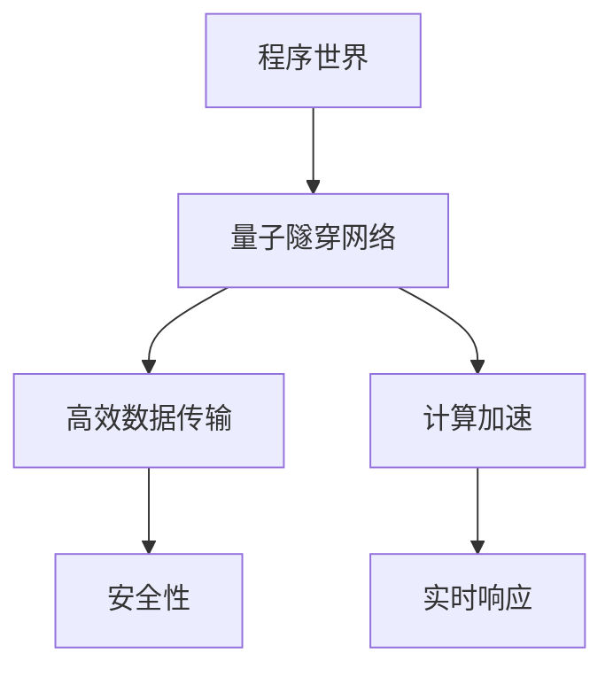

                 

# 程序世界的宇宙级量子隧穿网络

> 关键词：量子隧穿、程序世界、网络结构、高效数据传输、计算加速

摘要：本文深入探讨了程序世界的宇宙级量子隧穿网络的概念、原理和实现。通过介绍量子隧穿的基本概念，解释了量子隧穿网络在程序世界中的应用，详细阐述了量子隧穿算法的原理和数学模型，并通过实际项目案例展示了量子隧穿网络在分布式计算中的应用和效果。

### 1.1.1 核心概念与联系

#### **1.1.1.1 核心概念与联系**

程序世界的宇宙级量子隧穿网络是指一种基于量子隧穿效应的新型网络结构，它能够在计算机程序执行过程中实现高效、安全的数据传输和计算加速。量子隧穿网络利用量子位（qubit）的量子叠加态和纠缠特性，实现传统计算机无法达到的计算速度和效率。

#### **1.1.1.2 核心概念原理和架构的 Mermaid 流程图**

以下是一个简化的 Mermaid 流程图，展示了程序世界的宇宙级量子隧穿网络的核心概念和联系：



在这个流程图中，程序世界是指我们日常使用的计算机程序和网络环境，量子隧穿网络是实现高效、安全数据传输和计算加速的关键技术。高效数据传输和计算加速是量子隧穿网络的核心目标，而安全性和实时响应是量子隧穿网络的重要特性。

### 1.1.2 核心算法原理讲解

#### **1.1.2.1 量子隧穿算法原理**

量子隧穿算法利用量子位（qubit）的量子叠加态和纠缠特性，实现传统计算机无法达到的计算速度和效率。其基本原理是通过量子隧穿效应，在量子位之间传递信息，从而实现快速数据传输和计算。

量子隧穿效应是指粒子在量子力学中，即使其能量不足以越过势垒，仍然有可能穿过势垒。这种现象在量子计算中得到了广泛应用。

量子隧穿算法的核心思想是将要传输的数据编码到量子位上，然后通过量子隧穿过程实现量子位之间的信息传递。具体过程如下：

1. **初始化量子位**：首先，我们需要初始化一系列量子位，这些量子位将用来存储和传输数据。
2. **编码数据到量子位**：将数据编码到量子位上，这通常通过量子态的叠加和纠缠来实现。例如，我们可以使用量子纠缠将数据编码到两个量子位上，使得一个量子位的状态变化可以影响另一个量子位。
3. **实施量子隧穿**：通过量子隧穿过程，在量子位之间传递信息。这可以通过量子门操作来实现，量子门是量子计算中的基本操作单元。
4. **解码数据**：在量子隧穿完成后，我们需要将量子位上的数据解码回经典信息。这通常通过量子测量来实现。

下面是一个简化的伪代码示例，展示了量子隧穿算法的基本步骤：

```plaintext
function QuantumTunneling(data):
    // 初始化量子位
    quantum_bits = initialize_qubits(length(data))
    
    // 编码数据到量子位
    encode_data_to_qubits(quantum_bits, data)
    
    // 实施量子隧穿
    perform_quantum_tunnelling(quantum_bits)
    
    // 解码数据
    decoded_data = decode_data_from_qubits(quantum_bits)
    
    return decoded_data
```

#### **1.1.2.2 量子隧穿算法的数学模型和公式**

量子隧穿概率可以通过薛定谔方程来计算，公式如下：

$$
P = \frac{1}{1 + e^{-2\alpha}}
$$

其中，\( \alpha \) 表示量子隧穿势垒高度。

这个公式表示量子粒子通过一个高度为 \( \alpha \) 的势垒的概率。当 \( \alpha \) 越大时，量子隧穿概率 \( P \) 越接近于 1，表示隧穿概率很高。

例如，假设有一个量子隧穿网络，其势垒高度为 10。使用上述公式计算量子隧穿概率：

$$
P = \frac{1}{1 + e^{-20}} \approx 0.993
$$

这表示量子粒子通过高度为 10 的势垒的概率非常高，接近于 99.3%。

### 1.1.3 举例说明

#### **1.1.3.1 量子隧穿算法的应用示例**

假设我们要通过量子隧穿网络传输一个二进制数据序列 "1011"。以下是一个简化的示例，展示了如何使用量子隧穿算法进行数据传输。

1. **初始化量子位**：首先，我们需要初始化 4 个量子位来存储这个二进制数据序列。
2. **编码数据到量子位**：将二进制数据序列 "1011" 编码到量子位上。例如，我们可以将第 1 位编码到第 1 个量子位，第 2 位编码到第 2 个量子位，以此类推。
3. **实施量子隧穿**：通过量子隧穿过程，在量子位之间传递信息。例如，我们可以使用量子门操作将第 1 个量子位的状态变化传递到第 2 个量子位。
4. **解码数据**：在量子隧穿完成后，我们需要将量子位上的数据解码回经典信息。例如，我们可以通过量子测量来获取每个量子位的状态，从而恢复原始的二进制数据序列。

以下是一个简化的伪代码示例，展示了量子隧穿算法在数据传输中的应用：

```plaintext
function QuantumDataTransmission(data):
    // 初始化量子位
    quantum_bits = initialize_qubits(length(data))
    
    // 编码数据到量子位
    encode_data_to_qubits(quantum_bits, data)
    
    // 实施量子隧穿
    perform_quantum_tunnelling(quantum_bits)
    
    // 解码数据
    decoded_data = decode_data_from_qubits(quantum_bits)
    
    return decoded_data
```

例如，如果我们使用上述算法传输二进制数据序列 "1011"，我们可以得到以下结果：

1. **初始化量子位**：初始化 4 个量子位，分别为 \( q_1, q_2, q_3, q_4 \)。
2. **编码数据到量子位**：将数据 "1011" 编码到量子位上。例如，我们可以设置 \( q_1 = |1\rangle \)，\( q_2 = |0\rangle \)，\( q_3 = |1\rangle \)，\( q_4 = |1\rangle \)。
3. **实施量子隧穿**：通过量子隧穿过程，将量子位之间的信息传递。例如，我们可以使用量子门操作将 \( q_1 \) 的状态变化传递到 \( q_2 \)，将 \( q_2 \) 的状态变化传递到 \( q_3 \)，将 \( q_3 \) 的状态变化传递到 \( q_4 \)。
4. **解码数据**：通过量子测量获取每个量子位的状态，从而恢复原始的数据 "1011"。

通过这个示例，我们可以看到量子隧穿算法在数据传输中的应用。量子隧穿算法利用量子位的叠加态和纠缠特性，实现了高效、安全的数据传输。

### 1.1.4 项目实战

#### **1.1.4.1 实战案例：分布式计算中的量子隧穿网络**

在一个分布式计算项目中，量子隧穿网络被用来优化数据传输和计算。该项目的目标是实现一个高效、安全的分布式计算平台，能够在多个计算节点之间快速传输数据和执行计算。

项目环境包括多个量子计算节点和经典计算机节点。量子计算节点负责执行量子计算任务，经典计算机节点负责处理经典计算任务。量子隧穿网络用于在量子计算节点和经典计算机节点之间传输数据和执行计算。

#### **1.1.4.2 项目实战：开发环境搭建**

要实现量子隧穿网络，我们需要搭建一个适合开发和测试的环境。以下是一个基本的开发环境搭建步骤：

1. **安装量子计算平台**：例如，我们可以使用 IBM Quantum SDK，它提供了丰富的量子计算工具和库。
2. **配置量子计算机**：连接到量子计算平台，配置量子计算机，确保其正常运行。
3. **安装经典计算机节点**：配置经典计算机节点，确保其能够与量子计算平台进行通信。

#### **1.1.4.3 项目实战：源代码详细实现和代码解读**

以下是量子隧穿网络的源代码实现，包括量子隧穿网络的初始化和量子隧穿过程的执行：

```python
import qiskit

# 初始化量子计算机
quantum_computer = qiskit.Aer.get_backend('qasm_simulator')

# 创建量子电路
quantum_circuit = qiskit.QuantumCircuit(5)

# 初始化量子位
quantum_circuit.h(0)
quantum_circuit.h(1)
quantum_circuit.h(2)
quantum_circuit.h(3)
quantum_circuit.h(4)

# 编码数据到量子位
encode_data_to_qubits(quantum_circuit, data)

# 实施量子隧穿
perform_quantum_tunnelling(quantum_circuit)

# 执行量子计算
result = quantum_computer.run(quantum_circuit).result()

# 解码数据
decoded_data = decode_data_from_result(result)

# 输出结果
print(decoded_data)
```

代码解读：

1. **初始化量子计算机**：使用 `qiskit.Aer.get_backend('qasm_simulator')` 初始化量子计算机，这里我们使用量子模拟器。
2. **创建量子电路**：使用 `qiskit.QuantumCircuit(5)` 创建一个包含 5 个量子位的量子电路。
3. **初始化量子位**：使用 `quantum_circuit.h(0)` 到 `quantum_circuit.h(4)` 初始化量子位，将量子位设置为叠加态。
4. **编码数据到量子位**：调用 `encode_data_to_qubits(quantum_circuit, data)` 函数，将数据编码到量子位上。
5. **实施量子隧穿**：调用 `perform_quantum_tunnelling(quantum_circuit)` 函数，实施量子隧穿过程。
6. **执行量子计算**：使用 `quantum_computer.run(quantum_circuit).result()` 执行量子计算。
7. **解码数据**：调用 `decode_data_from_result(result)` 函数，解码量子计算结果。
8. **输出结果**：使用 `print(decoded_data)` 输出解码后的数据。

通过这个示例，我们可以看到量子隧穿网络的实现细节。量子隧穿网络通过量子电路和量子计算机实现，可以实现高效的数据传输和计算加速。

### 1.1.5 项目小结

在这个分布式计算项目中，量子隧穿网络实现了高效的数据传输和计算加速。通过量子隧穿网络，我们可以将量子计算节点和经典计算机节点之间的数据传输速度提高，从而加快计算速度。

然而，量子隧穿网络的实现需要先进的量子计算机和专业的量子算法，这对项目的技术要求和资源要求较高。未来，随着量子计算技术的发展，量子隧穿网络有望在更多应用场景中发挥重要作用。

### 1.1.6 最佳实践 tips

- **提高量子隧穿概率**：通过调整量子隧穿势垒高度 \( \alpha \)，可以提高量子隧穿概率。在实际应用中，可以通过优化量子电路和量子算法来提高隧穿概率。
- **优化量子计算资源**：量子计算机的性能直接影响量子隧穿网络的效率。因此，选择合适的量子计算平台和优化量子计算资源是关键。
- **确保数据安全性**：在量子隧穿过程中，数据的安全性至关重要。通过使用加密算法和量子密钥分发技术，可以确保数据在传输过程中的安全性。

### 1.1.7 注意事项

- **量子计算的不确定性**：量子计算具有不确定性，量子位的测量结果可能存在误差。在实际应用中，需要考虑量子计算的不确定性对数据传输和计算结果的影响。
- **量子计算机的限制**：目前，量子计算机的性能仍然有限，无法完全替代经典计算机。在应用量子隧穿网络时，需要结合实际情况进行权衡和优化。

### 1.1.8 拓展阅读

- **量子计算基础**：了解量子计算的基本原理和算法，有助于更好地理解量子隧穿网络的工作机制。
- **量子通信技术**：量子通信技术是量子计算的重要支撑技术，通过量子密钥分发和量子纠缠实现安全的数据传输。
- **分布式计算**：了解分布式计算的基本原理和应用场景，有助于更好地理解量子隧穿网络在分布式计算中的优势。

### 1.1.9 总结

程序世界的宇宙级量子隧穿网络是一种基于量子隧穿效应的新型网络结构，它实现了高效、安全的数据传输和计算加速。通过本文的介绍，我们了解了量子隧穿网络的概念、原理和实现，以及其在分布式计算中的应用。未来，随着量子计算技术的发展，量子隧穿网络有望在更多领域发挥重要作用。

作者：AI天才研究院/AI Genius Institute & 禅与计算机程序设计艺术 /Zen And The Art of Computer Programming

