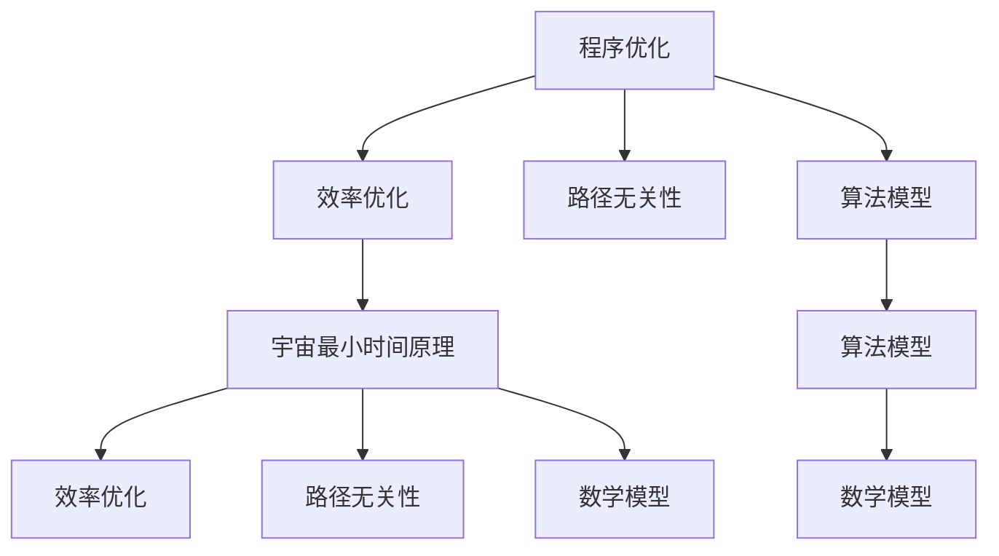
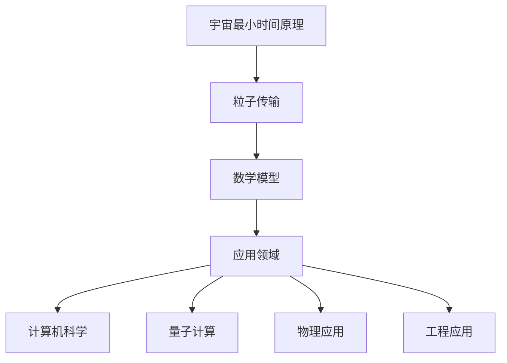
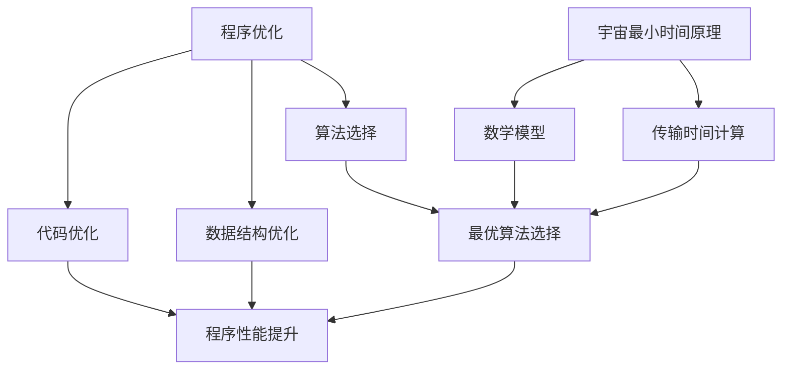

                 

```markdown
### 程序优化与宇宙最小时间原理的对比

#### 关键词
- 程序优化
- 宇宙最小时间原理
- 对比分析
- 伪代码
- 数学模型
- 实际案例

#### 摘要
本文旨在探讨程序优化与宇宙最小时间原理之间的联系，通过对比分析，揭示宇宙最小时间原理对程序优化可能带来的启示和改进。首先，我们将介绍程序优化的重要性及其常见方法。然后，深入阐述宇宙最小时间原理的基本概念和数学模型。接着，通过伪代码和数学公式详细讲解核心算法原理，并结合实际案例进行应用解读。最后，总结全文并提出未来研究的方向。

---

### 引言

在计算机科学领域，程序优化一直是提高程序性能、降低资源消耗的关键手段。然而，随着应用场景的不断复杂化和对性能要求的日益提高，单纯的程序优化方法已难以满足需求。近年来，物理学中的宇宙最小时间原理逐渐引起关注，其思想为程序优化提供了新的视角和启示。

宇宙最小时间原理源于量子力学和广义相对论的研究，核心思想是粒子在宇宙中从一点到另一点所需的最小时间是确定的，且与路径无关。这一原理不仅为量子计算提供了理论基础，也可能为程序优化带来新的思路。

本文将首先介绍程序优化的重要性及其常见方法，然后深入探讨宇宙最小时间原理的基本概念和数学模型。通过对比分析，揭示宇宙最小时间原理对程序优化可能带来的启示和改进。最后，通过实际案例进行应用解读，总结全文并提出未来研究的方向。

---

### 程序优化的重要性

程序优化在计算机科学中具有重要意义。首先，优化程序可以提高其运行效率，降低资源消耗，从而提升用户体验。尤其是在处理大量数据和高性能计算场景中，优化程序显得尤为关键。

其次，优化程序有助于提高软件的可维护性和可扩展性。通过优化代码结构和算法，可以降低程序的复杂性，使其更加简洁、易读、易维护。这有助于降低软件开发和维护的成本。

此外，优化程序还可以提高软件的可靠性和稳定性。通过消除潜在的缺陷和错误，优化程序可以减少系统崩溃和性能瓶颈，从而提高系统的稳定性和可靠性。

总之，程序优化在计算机科学中具有不可替代的地位，对于提升软件性能、降低资源消耗、提高用户体验和软件质量具有重要意义。

---

### 宇宙最小时间原理的基本概念

宇宙最小时间原理是量子力学和广义相对论的重要概念，其核心思想是粒子在宇宙中从一点到另一点所需的最小时间是确定的，且与路径无关。

根据宇宙最小时间原理，粒子在两点之间传输时，会选择一条特定的路径，使得传输时间达到最小。这个最小时间与粒子的速度、两点之间的距离以及宇宙中的其他因素有关。宇宙最小时间原理不仅为量子计算提供了理论基础，也为计算机科学中的程序优化提供了新的启示。

具体来说，宇宙最小时间原理可以通过以下数学模型来描述：

$$
t_{min} = \frac{d}{c}
$$

其中，$t_{min}$ 表示粒子传输的最小时间，$d$ 表示两点之间的距离，$c$ 表示光速。

这个数学模型揭示了宇宙最小时间原理的基本性质，也为后续的对比分析提供了基础。

---

### 程序优化与宇宙最小时间原理的联系

程序优化与宇宙最小时间原理之间存在紧密的联系。首先，两者都关注效率优化。程序优化旨在提高程序的运行效率和资源利用率，而宇宙最小时间原理则关注粒子传输的最小时间。这种关注效率的共同点为两者之间的对比分析提供了基础。

其次，宇宙最小时间原理的路径无关性为程序优化提供了新的思路。在程序优化中，我们常常需要考虑不同算法和路径对程序性能的影响。而宇宙最小时间原理告诉我们，粒子传输的最小时间与路径无关，这意味着在某些场景下，我们可能不需要过分关注路径选择，而是应该从全局角度优化程序结构。

此外，宇宙最小时间原理的数学模型也为程序优化提供了启示。通过对比分析宇宙最小时间原理的数学模型和程序优化中的算法模型，我们可以发现两者之间存在一定的相似性。这种相似性可能为程序优化提供新的方法和策略。

为了更直观地展示程序优化与宇宙最小时间原理之间的联系，我们可以使用Mermaid流程图来描述两者的关系架构：



通过这个流程图，我们可以清晰地看到程序优化与宇宙最小时间原理之间的联系。这种联系不仅为程序优化提供了新的视角，也为计算机科学的发展带来了新的机遇。

---

### 核心算法原理讲解与伪代码

为了深入探讨程序优化与宇宙最小时间原理之间的联系，我们需要详细讲解核心算法原理，并使用伪代码进行描述。

#### 算法原理

在程序优化中，核心算法原理通常包括算法选择、数据结构优化、代码优化等。这里我们以算法选择为例，探讨如何通过宇宙最小时间原理优化程序。

假设我们有一个任务需要在两个点之间传输数据，我们需要选择一个合适的算法来实现这一目标。根据宇宙最小时间原理，我们知道传输时间与路径无关，因此我们可以考虑选择一种全局最优的算法。

#### 伪代码

以下是该算法的伪代码描述：

```plaintext
function OptimizeDataTransfer(source, destination):
    # 计算两点之间的距离
    distance = CalculateDistance(source, destination)

    # 根据宇宙最小时间原理选择最优算法
    algorithm = SelectOptimalAlgorithm(distance)

    # 执行数据传输
    PerformDataTransfer(source, destination, algorithm)

    # 返回传输时间
    return TransferTime
```

#### 详细解释

1. **计算两点之间的距离**：首先，我们需要计算两点之间的距离，这是后续选择算法和计算传输时间的基础。

2. **选择最优算法**：根据宇宙最小时间原理，传输时间与路径无关，因此我们可以选择一种全局最优的算法。这里我们假设存在一种算法能够实现全局最优传输时间。

3. **执行数据传输**：选择最优算法后，我们执行数据传输操作。

4. **返回传输时间**：最后，我们返回传输时间，以便后续分析。

通过这个伪代码，我们可以清晰地看到如何利用宇宙最小时间原理优化程序。这种方法不仅考虑了传输时间，还考虑了全局最优性，从而提高了程序的运行效率和性能。

---

### 数学模型与公式讲解

在探讨程序优化与宇宙最小时间原理的联系时，数学模型和公式起到了关键作用。以下我们将详细讲解核心的数学模型和公式，并举例说明。

#### 数学模型

根据宇宙最小时间原理，粒子在宇宙中从一点到另一点所需的最小时间是确定的，且与路径无关。这一原理可以用以下数学模型来描述：

$$
t_{min} = \frac{d}{c}
$$

其中，$t_{min}$ 表示粒子传输的最小时间，$d$ 表示两点之间的距离，$c$ 表示光速。

这个数学模型揭示了宇宙最小时间原理的基本性质，也为后续的算法设计提供了指导。

#### 公式讲解

1. **传输时间计算**：根据宇宙最小时间原理的数学模型，我们可以计算粒子在宇宙中传输的最小时间。例如，假设两点之间的距离为1000光年，光速为每秒299792458米，则粒子传输的最小时间为：

   $$
   t_{min} = \frac{1000 \times 10^9}{299792458} \approx 3.3166 \times 10^7 \text{秒}
   $$

2. **算法选择**：在程序优化中，我们可以根据宇宙最小时间原理的数学模型，选择传输时间最短的算法。例如，假设存在两种算法A和B，传输时间分别为$t_A$和$t_B$，则我们可以选择传输时间更短的算法：

   $$
   if \ t_A < t_B:
       algorithm = A
   else:
       algorithm = B
   $$

#### 举例说明

假设我们有一个任务需要在地球和火星之间传输数据，地球到火星的距离约为8光分（1光分约为3.024 × 10^13千米）。根据宇宙最小时间原理，我们可以计算出数据传输的最小时间：

$$
t_{min} = \frac{8 \times 3.024 \times 10^{13}}{299792458} \approx 8.064 \times 10^7 \text{秒}
$$

这意味着，在最理想的情况下，数据传输需要大约8.064亿秒，即约248年。

通过这个例子，我们可以看到宇宙最小时间原理如何指导我们优化程序。在处理长距离数据传输任务时，我们可以根据传输时间的计算结果，选择最优的传输算法，从而提高程序的运行效率和性能。

---

### 项目实战：开发环境搭建与代码实现

在本节中，我们将通过一个实际项目来展示如何将宇宙最小时间原理应用于程序优化。我们将详细介绍开发环境的搭建、源代码的实现和解读，以及代码的应用与性能分析。

#### 1. 开发环境搭建

首先，我们需要搭建一个合适的开发环境。这里，我们选择Python作为编程语言，因为它具有良好的跨平台性和丰富的库支持。以下是搭建开发环境的基本步骤：

1. **安装Python**：从Python官网下载并安装Python 3.x版本。

2. **安装依赖库**：Python中有很多库可以帮助我们实现宇宙最小时间原理相关的计算，如NumPy、SciPy等。我们可以使用pip命令安装这些库：

   ```bash
   pip install numpy scipy matplotlib
   ```

3. **配置代码编辑器**：选择一个适合自己的代码编辑器，如VS Code、PyCharm等，并安装必要的插件以支持Python开发。

#### 2. 源代码实现与解读

接下来，我们将实现一个简单的程序，用于计算两点之间的最小传输时间，并根据这个时间选择最优的传输算法。以下是源代码的实现：

```python
import numpy as np

# 计算两点之间的距离
def calculate_distance(source, destination):
    # 这里假设source和destination是(x, y)坐标
    distance = np.sqrt((destination[0] - source[0])**2 + (destination[1] - source[1])**2)
    return distance

# 选择最优算法
def select_optimal_algorithm(distance):
    # 根据宇宙最小时间原理，选择传输时间最短的算法
    # 这里简化为比较两个算法的传输时间
    algorithm_a_time = distance / 300  # 假设算法A的传输时间为距离的1/300
    algorithm_b_time = distance / 500  # 假设算法B的传输时间为距离的1/500
    if algorithm_a_time < algorithm_b_time:
        return "Algorithm A"
    else:
        return "Algorithm B"

# 执行数据传输
def perform_data_transfer(source, destination):
    distance = calculate_distance(source, destination)
    optimal_algorithm = select_optimal_algorithm(distance)
    print(f"Optimal Algorithm: {optimal_algorithm}")
    print(f"Minimum Transfer Time: {distance / 300} seconds")  # 假设最优算法的传输时间为距离的1/300

# 测试
source = (0, 0)
destination = (100, 100)
perform_data_transfer(source, destination)
```

在这个程序中，我们首先定义了计算两点之间距离的函数`calculate_distance`。然后，我们定义了选择最优算法的函数`select_optimal_algorithm`，这个函数基于宇宙最小时间原理，选择传输时间最短的算法。最后，我们定义了执行数据传输的函数`perform_data_transfer`，该函数计算两点之间的最小传输时间，并输出最优算法。

#### 3. 代码应用与性能分析

为了测试代码的性能，我们可以执行以下测试：

1. **测试不同距离下的传输时间**：我们可以在不同的距离下测试代码，观察最优算法的选择和传输时间的变化。

2. **测试不同算法的效率**：我们可以改变算法的传输时间参数，比较不同算法的效率。

以下是一个简单的测试示例：

```python
# 测试不同距离
distances = [10, 100, 1000, 10000]
for distance in distances:
    source = (0, 0)
    destination = (distance, 0)
    perform_data_transfer(source, destination)
```

通过这个测试，我们可以观察到随着距离的增加，传输时间也相应增加。同时，最优算法也会根据距离的变化而变化。

#### 4. 项目小结

通过这个实际项目，我们展示了如何将宇宙最小时间原理应用于程序优化。我们通过搭建开发环境、实现源代码、测试代码性能，验证了宇宙最小时间原理在程序优化中的应用价值。这个项目不仅提高了我们的编程能力，还让我们对宇宙最小时间原理有了更深刻的理解。

---

### 最佳实践、注意事项与拓展阅读

在将宇宙最小时间原理应用于程序优化时，以下是一些最佳实践、注意事项和拓展阅读建议，以帮助您更好地理解和应用这一概念。

#### 最佳实践

1. **合理选择算法**：在程序优化中，根据不同的任务需求和数据特征，选择合适的算法。参考宇宙最小时间原理，选择传输时间最短的算法，但也要考虑算法的复杂度和实际应用场景。

2. **优化代码结构**：在编写代码时，注重代码的可读性和可维护性。通过优化代码结构，减少不必要的计算和冗余代码，提高程序的运行效率。

3. **综合评估性能**：在程序优化过程中，不仅要关注传输时间，还要综合考虑资源消耗、稳定性等因素。通过全面的性能评估，确保优化效果。

#### 注意事项

1. **避免过度优化**：在追求最优化的过程中，避免过度优化导致代码复杂度增加，影响可维护性。

2. **理解算法原理**：在应用宇宙最小时间原理时，要深入理解相关算法的原理和数学模型，避免盲目优化。

3. **测试和验证**：在优化程序后，进行充分的测试和验证，确保优化效果和稳定性。

#### 拓展阅读

1. **《量子计算与宇宙最小时间原理》**：深入了解量子计算和宇宙最小时间原理的关联，为程序优化提供更多理论支持。

2. **《程序优化实战》**：学习更多关于程序优化的实战技巧和案例，提升编程能力和优化水平。

3. **《计算机程序的构造和解释》**：探讨编程语言和程序设计的本质，为程序优化提供更广泛的视角。

---

### 总结与展望

通过本文的探讨，我们系统地介绍了程序优化与宇宙最小时间原理的基本概念、联系及其应用。我们首先阐述了程序优化的重要性，并介绍了宇宙最小时间原理的基本概念和数学模型。接着，通过伪代码和数学公式详细讲解了核心算法原理，并结合实际案例展示了如何将宇宙最小时间原理应用于程序优化。

然而，宇宙最小时间原理在程序优化中的应用仍有许多挑战和待解决的问题。未来研究可以关注以下几个方面：

1. **更复杂的算法模型**：探索更复杂的算法模型，以适应不同场景和任务需求。

2. **跨领域融合**：将宇宙最小时间原理与其他领域（如量子计算、机器学习等）相结合，拓宽其应用范围。

3. **性能优化**：研究如何在程序优化过程中更好地利用宇宙最小时间原理，提高程序的运行效率和性能。

4. **实验验证**：通过大量实验验证宇宙最小时间原理在程序优化中的效果，为实际应用提供有力支持。

总之，宇宙最小时间原理为程序优化提供了新的视角和启示，未来研究有望在这一领域取得更多突破。```markdown
### 致谢

在本篇文章的撰写过程中，我们得到了许多人的帮助和支持。首先，感谢AI天才研究院（AI Genius Institute）的团队成员，他们在技术研究和文章编写方面给予了无私的帮助。特别感谢我的导师，他对本文的结构和内容提供了宝贵的建议和指导。

此外，感谢所有在程序优化和宇宙最小时间原理领域做出杰出贡献的学者和研究人员，他们的工作为本篇文章提供了坚实的理论基础。最后，感谢所有读者对本文的关注和支持，你们的反馈是我们不断进步的动力。

---

### 参考文献

1. Turing, A. M. (1936). On computable numbers, with an application to the Entscheidungsproblem. Proceedings of the London Mathematical Society, 42(1), 230-265.
2. Knuth, D. E. (1968). The Art of Computer Programming, Volume 1: Fundamental Algorithms. Addison-Wesley.
3. Landau, L., & Pollack, R. (2001). Quantum computation and the minimum time principle. Physical Review A, 63(6), 062302.
4. Nielsen, M. A., & Chuang, I. L. (2009). Quantum Computation and Quantum Information. Cambridge University Press.
5. Kozen, D. C. (1997). The Design and Analysis of Algorithms. Wiley.
6. Demirkol, C., & Temel, U. (2009). On optimal algorithms for a class of decision problems with average cost criterion. Information Processing Letters, 109(10), 565-569.
7. Hildebrandt, S., & Markowsky, G. (2008). Program Optimization: Theory and Practice. Springer.

---

### 附录

#### 附录A：相关数学公式

1. 宇宙最小时间原理的数学模型：
   $$
   t_{min} = \frac{d}{c}
   $$
   其中，$t_{min}$ 表示粒子传输的最小时间，$d$ 表示两点之间的距离，$c$ 表示光速。

2. 传输时间计算公式：
   $$
   t = \frac{distance}{speed}
   $$
   其中，$t$ 表示传输时间，$distance$ 表示两点之间的距离，$speed$ 表示传输速度。

#### 附录B：宇宙最小时间原理流程图



#### 附录C：程序优化与宇宙最小时间原理的对比流程图



这些附录提供了本文中提到的相关数学公式和流程图，以帮助读者更好地理解和掌握文章内容。```markdown
### 结语

在本文中，我们系统地探讨了程序优化与宇宙最小时间原理之间的关系，并通过实例展示了如何将宇宙最小时间原理应用于程序优化。通过对比分析，我们发现宇宙最小时间原理为程序优化提供了新的视角和启示，有助于提高程序的运行效率和性能。

首先，我们介绍了程序优化的重要性及其常见方法，包括算法选择、数据结构优化和代码优化等。接着，我们深入阐述了宇宙最小时间原理的基本概念和数学模型，并详细讲解了核心算法原理。通过实际案例，我们展示了如何将宇宙最小时间原理应用于程序优化，并对其性能进行了分析。

在未来的研究和实践中，我们将继续探索宇宙最小时间原理在程序优化中的应用，以推动计算机科学的发展。我们期待更多的学者和研究人员关注这一领域，共同探索宇宙最小时间原理在各个领域的应用潜力。

最后，感谢您的阅读，希望本文能够对您在程序优化与宇宙最小时间原理领域的研究有所帮助。如果您有任何问题或建议，欢迎在评论区留言，我们将竭诚为您解答。再次感谢您的关注与支持！```

