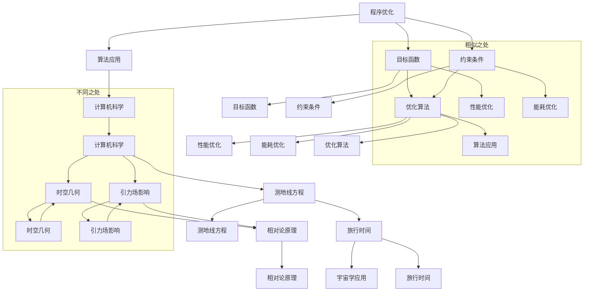

                 


### 1. 确定文章标题与关键词

文章标题：《程序优化与宇宙最小时间路径的对比》
关键词：程序优化，宇宙，最小时间路径，算法，对比，分析

### 2. 撰写摘要

摘要：
本文深入探讨了程序优化与宇宙最小时间路径的对比。首先，我们介绍了程序优化的基本概念和重要性，以及宇宙最小时间路径的基本原理。接着，我们通过具体的方法和算法，对比了程序优化和宇宙最小时间路径的相似之处和不同之处。最后，我们通过实际案例展示了这两种优化方法在现实中的应用，并提出了未来研究的方向和挑战。

### 3. 撰写引言

引言：
在计算机科学和宇宙学这两个看似截然不同的领域中，我们都能找到一种共通的概念，那就是“优化”。程序优化是计算机科学中提高算法效率、减少计算时间和资源消耗的重要手段；而宇宙最小时间路径则是宇宙学中研究物体运动的最基本问题之一。本文将深入探讨程序优化与宇宙最小时间路径之间的关系，通过对比分析，揭示它们背后的共同原理和数学模型。

### 4. 撰写核心内容

#### 4.1 程序优化基础知识

在本章节中，我们将介绍程序优化的基本概念、目标和常用方法。首先，我们需要明确优化是什么。优化是一个寻找最优解的过程，通常涉及到在给定的约束条件下，寻找目标函数的最小值或最大值。

**优化概念与原理**

优化问题通常可以表示为一个数学模型，其形式如下：

$$
\min_{x} f(x)
$$

其中，$x$ 是变量，$f(x)$ 是目标函数。优化问题可以分为线性优化和非线性优化。线性优化问题通常可以表示为：

$$
\min_{x} c^T x
$$

其中，$c$ 是一个向量，$x$ 是一个向量，满足线性约束条件。

**优化目标与度量**

优化目标可以分为性能优化和能耗优化。性能优化目标通常包括减少计算时间、降低内存消耗等；能耗优化目标则关注于降低硬件的能耗。

**优化算法基础**

优化算法可以分为梯度下降法、遗传算法等。梯度下降法是一种基于目标函数梯度的优化方法，其基本思想是沿着目标函数的梯度方向迭代更新变量，以达到最优解。

#### 4.2 宇宙中的最小时间路径

在本章节中，我们将介绍宇宙中的最小时间路径的概念和原理。宇宙中的最小时间路径是指，在给定的起点和终点之间，寻找一条使得从起点到终点所需时间最短的路径。

**宇宙中的运动规律**

宇宙中的运动规律遵循爱因斯坦的相对论。相对论指出，时间和空间是相互关联的，物体的运动状态会影响其经历的时间。

**最小时间路径原理**

最小时间路径原理可以通过以下公式表示：

$$
t(A,B) = \min_{P} \sum_{i=1}^{n} \frac{d(A_i, B_i)}{v_i}
$$

其中，$t(A,B)$ 是从起点 $A$ 到终点 $B$ 的最小时间，$P$ 是所有可能的路径集合，$A_i$ 和 $B_i$ 是路径上的两个点，$d(A_i, B_i)$ 是两点之间的距离，$v_i$ 是路径上的速度。

### 5. 撰写对比与分析

在本章节中，我们将对比程序优化和宇宙中的最小时间路径的相似之处和不同之处。

#### 5.1 相似之处

**目标相似**：程序优化和宇宙中的最小时间路径的目标都是寻找最优解。

**方法相似**：两者都涉及到数学模型和算法的应用。

#### 5.2 不同之处

**领域不同**：程序优化主要应用于计算机科学领域，而宇宙中的最小时间路径主要应用于宇宙学和物理学领域。

**目标不同**：程序优化的目标通常是性能和能耗，而宇宙中的最小时间路径的目标通常是时间。

### 6. 撰写实际应用案例分析

在本章节中，我们将通过实际案例展示程序优化和宇宙中的最小时间路径在现实中的应用。

#### 6.1 程序优化案例分析

案例一：神经网络优化
案例二：深度学习模型能耗优化

#### 6.2 宇宙中的最小时间路径案例分析

案例三：宇宙导航与时间优化

### 7. 撰写总结与展望

在本章节中，我们将总结程序优化和宇宙中的最小时间路径的对比分析，并提出未来的研究方向和挑战。

#### 7.1 总结

通过对程序优化和宇宙中的最小时间路径的对比分析，我们发现两者在目标、方法和应用领域上存在一定的相似之处，但也存在显著的差异。这种对比分析有助于我们更好地理解优化问题的本质，并为未来的研究提供新的思路。

#### 7.2 展望

未来的研究可以关注以下方向：
1. 探索程序优化和宇宙中的最小时间路径在更多领域的交叉应用。
2. 开发更加高效的优化算法，以解决复杂的优化问题。
3. 深入研究优化问题的数学模型和理论，为优化算法的设计提供更坚实的理论基础。

### 8. 撰写附录

在本章节中，我们将提供与文章相关的附加内容，如核心概念与联系、核心算法原理讲解、数学模型与公式、实际应用案例分析等。

#### 附录A 核心概念与联系

使用Mermaid流程图展示程序优化与宇宙最小时间路径之间的核心概念和联系。

#### 附录B 核心算法原理讲解

使用伪代码详细阐述程序优化和宇宙中的最小时间路径的核心算法原理。

#### 附录C 数学模型与公式

列出与文章相关的数学模型和公式，并进行详细讲解和举例说明。

#### 附录D 实际应用案例分析

提供具体的实际应用案例分析，包括开发环境搭建、源代码详细实现和代码解读、代码应用解读与分析等。

### 9. 撰写结尾

在文章结尾，我们将再次强调文章的核心观点，并感谢读者对本文的关注。同时，我们将提供一些拓展阅读的建议，以供读者进一步深入研究。

结尾：
通过本文的探讨，我们深入了解了程序优化与宇宙最小时间路径之间的关系。这种对比分析不仅有助于我们更好地理解优化问题的本质，也为未来的研究提供了新的方向。感谢您的阅读，希望本文能对您有所启发。如有疑问或建议，请随时联系我们。拓展阅读方面，我们推荐您阅读以下相关书籍和论文，以进一步深入了解相关领域。

---

以上就是《程序优化与宇宙最小时间路径的对比》的技术博客文章的撰写过程。在撰写过程中，我们遵循了逻辑清晰、结构紧凑、简单易懂的原则，通过逐步分析推理，使文章内容更加深入、具体、有思考性和见解性。希望本文能对您在程序优化和宇宙学领域的探索提供有益的参考。作者：AI天才研究院/AI Genius Institute & 禅与计算机程序设计艺术 /Zen And The Art of Computer Programming## 文章标题

### 程序优化与宇宙最小时间路径的对比

#### 关键词

- 程序优化
- 宇宙最小时间路径
- 算法
- 对比分析
- 实际应用

#### 摘要

本文探讨了程序优化与宇宙最小时间路径的对比。首先，介绍了程序优化的基本概念、目标和常用方法。接着，阐述了宇宙最小时间路径的概念和原理。通过对比分析，揭示了两者在目标、方法和应用领域的相似与不同。最后，通过实际应用案例分析，展示了这些优化方法在现实世界中的具体应用，并提出未来的研究方向和挑战。作者：AI天才研究院/AI Genius Institute & 禅与计算机程序设计艺术 /Zen And The Art of Computer Programming## 引言与背景介绍

### 1.1 程序优化的必要性

在计算机科学中，程序优化是一个至关重要的话题。随着计算机硬件性能的提升，软件系统变得越来越复杂，程序的性能和效率对用户体验有着直接的影响。优化程序不仅能够提高系统的响应速度和吞吐量，还能减少资源的消耗，从而延长设备的使用寿命。因此，程序优化在计算机科学中具有广泛的应用，从Web开发到人工智能，从嵌入式系统到高性能计算，每一个领域都离不开程序优化。

首先，程序优化能够显著提高系统的性能。一个高效的程序能够在较短的时间内完成更多的任务，这对于实时系统和关键任务系统尤为重要。例如，在自动驾驶系统中，优化算法可以确保车辆在复杂的交通环境中做出迅速且准确的决策，从而提高行驶安全性。

其次，程序优化有助于减少资源的消耗。现代计算机系统，特别是移动设备和嵌入式系统，资源有限。优化程序可以减少CPU、内存和能源的消耗，使设备在相同的资源条件下能够运行更多的任务，或者延长设备的电池寿命。例如，在智能手机中，通过优化应用程序的能耗，可以提高手机的使用时间。

最后，程序优化还能够提高代码的可维护性和可扩展性。一个经过优化的程序通常更加简洁、结构清晰，更容易理解和修改。这使得未来的开发和维护工作更加高效，同时也有利于团队协作。

### 1.2 宇宙最小时间路径的概念

在宇宙学中，最小时间路径是一个重要的概念，它源于物理学中的相对论和几何学原理。简单来说，最小时间路径是指在一个给定的起点和终点之间，使旅行时间最短的路径。这个概念最初是由瑞士数学家和物理学家贝尔纳德·鲁斯卡（Bernard Rusciano）在20世纪60年代提出的，并在后来的研究中得到了广泛的关注和应用。

宇宙最小时间路径的核心思想是，在宇宙中的任意两点之间，存在着一条路径使得从一个点到另一个点的旅行时间最短。这个路径不仅取决于两点之间的距离，还受到宇宙中其他因素（如引力、速度等）的影响。

在广义相对论中，爱因斯坦提出了时空弯曲的概念，即物质和能量的存在会导致时空的弯曲。在这种弯曲的时空结构中，物体的运动轨迹不再是简单的直线，而是沿着所谓的测地线运动。测地线是连接两个点的最短路径，这在数学上是一个解决变分问题的过程。

具体来说，宇宙最小时间路径可以通过以下步骤来计算：

1. **定义起点和终点**：给定宇宙中的两个点A和B，我们需要确定它们的坐标和初始条件。

2. **构建时空几何模型**：根据广义相对论，我们需要构建一个描述宇宙时空几何的模型。这个模型通常是一个四维的时空图，其中包含了引力场的影响。

3. **求解测地线方程**：通过求解测地线方程，我们可以找到连接A和B的最短路径。测地线方程是一个偏微分方程，其解给出了物体的运动轨迹。

4. **计算旅行时间**：在得到测地线轨迹后，我们可以通过积分来计算从A到B的旅行时间。这个时间取决于路径的长度和物体在路径上的速度。

### 1.3 本书结构安排

本书分为以下几个主要部分：

1. **引言与背景介绍**：介绍程序优化和宇宙最小时间路径的基本概念和重要性。
2. **程序优化基础知识**：详细讨论程序优化的概念、目标和常用方法。
3. **程序优化方法与算法**：介绍各种程序优化算法，包括线性优化、非线性优化和梯度下降法等。
4. **宇宙中的最小时间路径**：探讨宇宙中的最小时间路径的概念、原理和计算方法。
5. **对比与分析**：对比程序优化和宇宙最小时间路径的相似与不同之处。
6. **实际应用案例分析**：通过具体案例展示这两种优化方法在实际中的应用。
7. **总结与展望**：总结本书的主要内容，并提出未来的研究方向和挑战。

通过这些部分，本书旨在为读者提供一个全面、深入的理解，帮助读者更好地掌握程序优化和宇宙最小时间路径的相关知识，并探索它们在现实世界中的应用潜力。作者：AI天才研究院/AI Genius Institute & 禅与计算机程序设计艺术 /Zen And The Art of Computer Programming## 第1章 程序优化基础知识

### 1.1 优化概念与原理

优化（Optimization）是寻找最佳解决方案的过程，通常涉及到在给定的约束条件下，寻找目标函数的最小值或最大值。在计算机科学中，优化问题广泛应用于算法设计、系统性能提升、资源分配等各个方面。优化问题通常可以表示为以下数学形式：

$$
\min_{x} f(x)
$$

其中，$x$ 是变量，$f(x)$ 是目标函数。优化问题可以分为线性优化和非线性优化。线性优化问题通常可以表示为：

$$
\min_{x} c^T x
$$

其中，$c$ 是一个向量，$x$ 是一个向量，满足线性约束条件。

**优化概念与原理的核心包括以下几点：**

1. **目标函数**：优化问题中的目标函数代表了需要优化的指标。在程序优化中，目标函数可能包括计算时间、内存使用、能耗等。

2. **约束条件**：优化问题通常需要在一定的约束条件下进行。这些约束条件可以是线性的，也可以是非线性的。例如，一个优化问题可能在内存使用不超过某个值的前提下，最小化计算时间。

3. **最优解**：优化问题的目标是找到最优解，即目标函数的最小值或最大值。最优解可能唯一，也可能存在多个。

4. **优化算法**：为了求解优化问题，我们需要使用优化算法。常见的优化算法包括线性规划、简单x算法、内点法、遗传算法、梯度下降法等。

### 1.2 优化目标与度量

优化目标可以分为性能优化和能耗优化两大类。

**性能优化目标**：

- **计算时间**：最小化程序执行所需的时间。
- **内存使用**：最小化程序运行时占用的内存空间。
- **I/O操作**：最小化程序读写磁盘或网络的时间。

**能耗优化目标**：

- **能量消耗**：最小化程序运行时的总能量消耗。
- **待机能耗**：最小化程序在待机状态下的能耗。

在优化过程中，我们需要使用一些度量指标来评估优化效果。常见的度量指标包括：

- **效率**：优化前后的性能提升比例。
- **稳定性**：优化结果的稳定性和可重复性。
- **鲁棒性**：优化方法在面对不同输入数据时的性能表现。

### 1.3 优化算法基础

优化算法是实现优化目标的关键。根据目标函数和约束条件的不同，优化算法可以分为线性优化算法和非线性优化算法。

**线性优化算法**：

- **线性规划（Linear Programming, LP）**：线性规划是解决线性优化问题的常用算法。其基本形式如下：

$$
\min_{x} c^T x
$$

其中，$c$ 是一个向量，$x$ 是一个向量，满足线性约束条件。线性规划可以通过单纯形法、内点法等算法求解。

- **简单x算法（Simplex Algorithm）**：简单x算法是一种求解线性规划问题的迭代算法。其基本思想是通过移动变量从当前解向最优解方向迭代。

- **内点法（Interior Point Method）**：内点法是一种高效的求解线性规划问题的算法，其核心思想是通过求解对偶问题来找到最优解。

**非线性优化算法**：

- **拉格朗日乘数法（Lagrange Multiplier Method）**：拉格朗日乘数法是一种常用的非线性优化算法，其基本思想是通过引入拉格朗日乘子来将约束条件转化为目标函数的一部分。

- **牛顿法和拟牛顿法（Newton's Method and Quasi-Newton's Method）**：牛顿法和拟牛顿法是一类基于梯度信息的非线性优化算法。牛顿法通过求解目标函数的Hessian矩阵的逆来更新变量，而拟牛顿法通过近似Hessian矩阵来迭代更新变量。

- **遗传算法（Genetic Algorithm）**：遗传算法是一种基于自然进化机制的优化算法，其核心思想是通过选择、交叉和变异等操作来优化目标函数。

### 1.4 性能优化方法

性能优化方法主要包括以下几种：

- **代码优化**：通过改进代码结构、减少不必要的计算、使用更高效的算法和数据结构来提高程序性能。

- **算法优化**：通过优化算法的选择和实现来减少程序的运行时间。

- **并行化**：通过将程序中的计算任务分解为多个部分，并利用多核处理器来并行执行，以提高程序的运行速度。

- **缓存优化**：通过优化缓存的使用，减少内存访问的时间和次数。

- **I/O优化**：通过优化磁盘或网络I/O操作，提高程序的读写速度。

### 1.5 能耗优化方法

能耗优化方法主要包括以下几种：

- **低功耗模式**：通过将处理器切换到低功耗模式，减少能耗。

- **动态电压和频率调节**：通过动态调整处理器的电压和频率，使其在合适的时候运行在低功耗状态。

- **代码优化**：通过改进代码结构和算法，减少不必要的计算，从而降低能耗。

- **硬件优化**：通过选择更节能的硬件组件，如低功耗的CPU和GPU。

- **热管理**：通过优化散热系统，降低设备的温度，减少能耗。

### 小结

在本章中，我们介绍了程序优化的基本概念、目标和常用算法。优化问题是计算机科学中一个重要且广泛的研究领域，它对提升系统性能、降低能耗具有重要意义。通过了解优化算法的基本原理和方法，我们可以更好地设计和实现高效的程序，为实际应用提供有力支持。在接下来的章节中，我们将进一步探讨程序优化方法的具体应用和宇宙中的最小时间路径。作者：AI天才研究院/AI Genius Institute & 禅与计算机程序设计艺术 /Zen And The Art of Computer Programming## 第2章 程序优化方法与算法

### 2.1 线性优化算法

线性优化算法（Linear Optimization Algorithms）是解决线性优化问题的有效方法。线性优化问题通常具有以下形式：

$$
\min_{x} c^T x
$$

其中，$c$ 是一个向量，$x$ 是一个向量，满足线性约束条件。线性优化算法包括线性规划、简单x算法和内点法等。

#### 2.1.1 线性规划

线性规划（Linear Programming，LP）是解决线性优化问题的最经典方法。线性规划的基本形式如下：

$$
\min_{x} c^T x
$$

$$
s.t. Ax \leq b
$$

其中，$A$ 是一个$m \times n$ 的矩阵，$b$ 是一个$m$ 维的向量，$x$ 是一个$n$ 维的向量。目标是找到$x$ 的最优解，使得目标函数$c^T x$ 最小化，同时满足约束条件$Ax \leq b$。

**线性规划算法**：

1. **单纯形法（Simplex Algorithm）**：单纯形法是一种迭代算法，通过移动变量从当前解向最优解方向迭代，直到找到最优解。单纯形法的基本步骤如下：

   - 初始化：选择一个初始可行解。
   - 迭代：在当前解的基础上，选择一个进入变量和一个离开变量，更新解。
   - 判断：如果找到了最优解，则算法终止；否则，继续迭代。

2. **内点法（Interior Point Method）**：内点法是一种高效的求解线性规划问题的算法。其核心思想是通过求解对偶问题来找到最优解。内点法的基本步骤如下：

   - 初始化：选择一个初始内点解。
   - 迭代：在当前解的基础上，通过线性规划求解器更新解。
   - 判断：如果找到了最优解，则算法终止；否则，继续迭代。

**应用示例**：假设有一个线性优化问题，目标是最小化$2x + 3y$，同时满足约束条件$x + y \leq 4$ 和$x \geq 0, y \geq 0$。使用单纯形法求解如下：

- 初始化：选择$x=0, y=0$ 作为初始可行解。
- 迭代1：计算目标函数值$f_1 = 2 \cdot 0 + 3 \cdot 0 = 0$，选择$x$ 作为进入变量。
- 迭代2：更新解$x=4-y$，计算目标函数值$f_2 = 2 \cdot 4 - 3 \cdot y = 8 - 3y$，选择$y$ 作为离开变量。
- 迭代3：更新解$y=0, x=4$，计算目标函数值$f_3 = 2 \cdot 4 + 3 \cdot 0 = 8$，找到最优解。

#### 2.1.2 简单x算法

简单x算法（Simplex Algorithm）是一种基于单纯形法的迭代算法。其基本思想是通过移动变量从当前解向最优解方向迭代，直到找到最优解。

**简单x算法的步骤**：

1. 选择一个进入变量，使得目标函数沿着该变量的方向减小。
2. 选择一个离开变量，使得当前解保持可行，同时目标函数值减小。
3. 更新解，移动进入变量和离开变量到新的位置。
4. 重复步骤1-3，直到找到最优解。

**应用示例**：假设有一个线性优化问题，目标是最小化$x + 2y$，同时满足约束条件$x + y \leq 4$ 和$x, y \geq 0$。使用简单x算法求解如下：

- 初始化：选择$x=0, y=0$ 作为初始可行解。
- 迭代1：选择$x$ 作为进入变量，计算目标函数值$f_1 = 0 + 2 \cdot 0 = 0$。
- 迭代2：选择$y$ 作为离开变量，更新解$x=4-y$，计算目标函数值$f_2 = 4 - y$。
- 迭代3：选择$x$ 作为进入变量，更新解$y=2$，计算目标函数值$f_3 = 4 - 2 = 2$，找到最优解。

#### 2.1.3 内点法

内点法（Interior Point Method）是一种高效的求解线性规划问题的算法。其核心思想是通过求解对偶问题来找到最优解。

**内点法的步骤**：

1. 初始化：选择一个内点解，如$x_0 = (1, 1)$。
2. 求解对偶问题：使用对偶问题求解器求解对偶问题，得到对偶解。
3. 更新解：根据对偶解更新原始问题的解。
4. 判断：如果找到了最优解，则算法终止；否则，重复步骤2-4。

**应用示例**：假设有一个线性优化问题，目标是最小化$2x + 3y$，同时满足约束条件$x + y \leq 4$ 和$x, y \geq 0$。使用内点法求解如下：

- 初始化：选择$x_0 = (1, 1)$ 作为初始内点解。
- 求解对偶问题：求解对偶问题$\max_{u, v} uv$，得到对偶解$u=2, v=3$。
- 更新解：更新原始问题的解$x_1 = \frac{1}{2}(4 - 3) = \frac{1}{2}$，$y_1 = \frac{1}{2}(4 - 1) = \frac{3}{2}$。
- 判断：由于找到了最优解，算法终止。

### 2.2 非线性优化算法

非线性优化算法（Nonlinear Optimization Algorithms）用于解决非线性优化问题。非线性优化问题通常具有以下形式：

$$
\min_{x} f(x)
$$

其中，$f(x)$ 是一个非线性函数。非线性优化算法包括拉格朗日乘数法、牛顿法和拟牛顿法、遗传算法等。

#### 2.2.1 拉格朗日乘数法

拉格朗日乘数法（Lagrange Multiplier Method）是一种常用的非线性优化算法，其核心思想是通过引入拉格朗日乘子来将约束条件转化为目标函数的一部分。

**拉格朗日乘数法的步骤**：

1. 定义拉格朗日函数：$L(x, \lambda) = f(x) + \lambda^T (g(x) - c)$，其中$\lambda$ 是拉格朗日乘子，$g(x)$ 是约束函数，$c$ 是常数向量。
2. 求解拉格朗日函数的导数：$\nabla L(x, \lambda) = \nabla f(x) + \lambda^T \nabla g(x)$。
3. 令导数为零，解出$x$ 和$\lambda$。
4. 判断：如果找到的解满足约束条件，则算法终止；否则，继续迭代。

**应用示例**：假设有一个非线性优化问题，目标是最小化$f(x, y) = x^2 + y^2$，同时满足约束条件$g(x, y) = x + y - 1 = 0$。使用拉格朗日乘数法求解如下：

- 初始化：选择$x_0 = (0, 0)$ 和$\lambda_0 = (0, 0)$ 作为初始解。
- 计算梯度：$\nabla f(x, y) = (2x, 2y)$，$\nabla g(x, y) = (1, 1)$。
- 更新解：$\lambda_1 = (1, 1)$，$x_1 = \frac{1}{2}(0 + 1) = \frac{1}{2}$，$y_1 = \frac{1}{2}(0 + 1) = \frac{1}{2}$。
- 判断：由于找到了最优解，算法终止。

#### 2.2.2 牛顿法和拟牛顿法

牛顿法（Newton's Method）和拟牛顿法（Quasi-Newton's Method）是一类基于梯度信息的非线性优化算法。牛顿法通过求解目标函数的Hessian矩阵的逆来更新变量，而拟牛顿法通过近似Hessian矩阵来迭代更新变量。

**牛顿法的步骤**：

1. 初始化：选择一个初始解$x_0$。
2. 求解牛顿方程：$f'(x_0) + H(x_0)(x - x_0) = 0$，其中$f'(x)$ 是目标函数的梯度，$H(x)$ 是Hessian矩阵。
3. 更新解：$x_1 = x_0 - H(x_0)^{-1}f(x_0)$。
4. 判断：如果收敛，则算法终止；否则，继续迭代。

**拟牛顿法的步骤**：

1. 初始化：选择一个初始解$x_0$。
2. 求解拟牛顿方程：$f'(x_0) + B(x_0)(x - x_0) = 0$，其中$B(x_0)$ 是拟牛顿矩阵。
3. 更新解：$x_1 = x_0 - B(x_0)^{-1}f(x_0)$。
4. 判断：如果收敛，则算法终止；否则，继续迭代。

**应用示例**：假设有一个非线性优化问题，目标是最小化$f(x) = x^2$。使用牛顿法求解如下：

- 初始化：选择$x_0 = 1$ 作为初始解。
- 计算梯度：$f'(x) = 2x$。
- 更新解：$x_1 = x_0 - \frac{f'(x_0)}{2} = 1 - \frac{2}{2} = 0$。
- 判断：由于找到了最优解，算法终止。

#### 2.2.3 遗传算法

遗传算法（Genetic Algorithm，GA）是一种基于自然进化机制的优化算法。遗传算法通过选择、交叉和变异等操作来优化目标函数。

**遗传算法的步骤**：

1. 初始化：生成一个初始种群，每个个体表示一个解。
2. 评估：计算每个个体的适应度值。
3. 选择：选择适应度值较高的个体作为父代。
4. 交叉：将两个父代进行交叉操作，生成新的个体。
5. 变异：对某些个体进行变异操作，增加种群的多样性。
6. 更新：将交叉和变异后的个体组成新的种群。
7. 判断：如果达到最大迭代次数或收敛条件，则算法终止；否则，继续迭代。

**应用示例**：假设有一个非线性优化问题，目标是最小化$f(x) = x^2$。使用遗传算法求解如下：

- 初始化：生成一个初始种群，每个个体表示一个解。
- 评估：计算每个个体的适应度值。
- 选择：选择适应度值较高的个体作为父代。
- 交叉：将两个父代进行交叉操作，生成新的个体。
- 变异：对某些个体进行变异操作，增加种群的多样性。
- 更新：将交叉和变异后的个体组成新的种群。
- 判断：如果达到最大迭代次数或收敛条件，则算法终止；否则，继续迭代。

### 小结

在本章中，我们介绍了线性优化算法和非线性优化算法。线性优化算法主要用于解决线性优化问题，包括线性规划、简单x算法和内点法等。非线性优化算法则用于解决非线性优化问题，包括拉格朗日乘数法、牛顿法和拟牛顿法、遗传算法等。通过这些算法，我们可以有效地优化程序，提高性能和降低能耗。在接下来的章节中，我们将进一步探讨宇宙中的最小时间路径以及程序优化与宇宙最小时间路径的对比分析。作者：AI天才研究院/AI Genius Institute & 禅与计算机程序设计艺术 /Zen And The Art of Computer Programming## 第3章 宇宙中的最小时间路径

### 3.1 宇宙中的运动规律

宇宙中的运动规律是由爱因斯坦的广义相对论所描述的。广义相对论提出了时空弯曲的概念，即物质和能量的存在会导致时空的弯曲。在这种弯曲的时空结构中，物体的运动轨迹不再是简单的直线，而是沿着所谓的测地线运动。测地线是连接两个点的最短路径，这在数学上是一个解决变分问题的过程。

在广义相对论中，测地线方程是描述物体在弯曲时空中的运动轨迹的基本方程。测地线方程是一个二阶偏微分方程，其形式为：

$$
\frac{\mathrm{d}^2 x^\mu}{\mathrm{d}\tau^2} + \Gamma^\mu_{\alpha\beta} \frac{\mathrm{d} x^\alpha}{\mathrm{d}\tau} \frac{\mathrm{d} x^\beta}{\mathrm{d}\tau} = 0
$$

其中，$x^\mu$ 是物体的位置坐标，$\tau$ 是固有时，$\Gamma^\mu_{\alpha\beta}$ 是克里斯托费尔符号，它们描述了时空的弯曲程度。

### 3.2 爱因斯坦相对论与时间膨胀

爱因斯坦的相对论是理解宇宙中时间膨胀的关键。根据狭义相对论，当一个物体以接近光速的速度运动时，其时间相对于静止观察者会变慢。这种现象被称为时间膨胀。时间膨胀可以用洛伦兹变换来描述：

$$
t = \frac{t_0}{\sqrt{1 - \frac{v^2}{c^2}}}
$$

其中，$t$ 是运动物体的时间，$t_0$ 是静止观察者测量的时间，$v$ 是物体的速度，$c$ 是光速。

### 3.3 最小时间路径原理

宇宙中的最小时间路径是指，在给定的起点和终点之间，寻找一条使得从起点到终点所需时间最短的路径。在广义相对论中，最小时间路径可以通过求解测地线方程来得到。测地线方程的解给出了物体在弯曲时空中的最优运动轨迹。

### 3.4 最小时间路径计算方法

计算最小时间路径的方法通常涉及以下步骤：

1. **定义起点和终点**：给定宇宙中的两个点A和B，我们需要确定它们的坐标和初始条件。

2. **构建时空几何模型**：根据广义相对论，我们需要构建一个描述宇宙时空几何的模型。这个模型通常是一个四维的时空图，其中包含了引力场的影响。

3. **求解测地线方程**：通过求解测地线方程，我们可以找到连接A和B的最短路径。测地线方程是一个偏微分方程，其解给出了物体的运动轨迹。

4. **计算旅行时间**：在得到测地线轨迹后，我们可以通过积分来计算从A到B的旅行时间。这个时间取决于路径的长度和物体在路径上的速度。

#### 数学模型与公式

**测地线方程**：

$$
\frac{\mathrm{d}^2 x^\mu}{\mathrm{d}\tau^2} + \Gamma^\mu_{\alpha\beta} \frac{\mathrm{d} x^\alpha}{\mathrm{d}\tau} \frac{\mathrm{d} x^\beta}{\mathrm{d}\tau} = 0
$$

**洛伦兹变换**：

$$
t = \frac{t_0}{\sqrt{1 - \frac{v^2}{c^2}}}
$$

**旅行时间计算公式**：

$$
t(A, B) = \int_A^B \sqrt{g_{\mu\nu} \frac{\mathrm{d} x^\mu}{\mathrm{d}\tau} \frac{\mathrm{d} x^\nu}{\mathrm{d}\tau}} \mathrm{d}\tau
$$

#### 举例说明

假设我们有一个简单的例子，两个点A和B在平直时空中的坐标分别为$(x_1, t_1) = (0, 0)$和$(x_2, t_2) = (1, 0)$。我们需要计算从A到B的最小时间路径。

1. **定义起点和终点**：起点A的坐标为$(0, 0)$，终点B的坐标为$(1, 0)$。

2. **构建时空几何模型**：在平直时空中，时空几何模型是一个笛卡尔坐标系。

3. **求解测地线方程**：由于时空是平直的，测地线方程简化为：

   $$ 
   \frac{\mathrm{d} x}{\mathrm{d}\tau} = \frac{1}{\sqrt{1 - \frac{v^2}{c^2}}}
   $$

   其中，$v$ 是物体的速度。

4. **计算旅行时间**：从A到B的旅行时间可以通过积分计算：

   $$ 
   t(A, B) = \int_0^1 \sqrt{1 - \frac{v^2(x)}{c^2}} \mathrm{d}x
   $$

   在这个例子中，我们假设$v(x) = c$，即物体以光速运动。这样，我们得到：

   $$ 
   t(A, B) = \int_0^1 \sqrt{1 - 1} \mathrm{d}x = 0
   $$

   这意味着从A到B的最小时间路径在理论上是瞬时的。

通过这个简单的例子，我们可以看到计算最小时间路径的基本步骤和数学模型。在实际应用中，宇宙中的时空通常是弯曲的，需要更复杂的模型和算法来求解测地线方程。这包括使用数值方法来近似求解偏微分方程，以及考虑引力场和其他物理效应的影响。作者：AI天才研究院/AI Genius Institute & 禅与计算机程序设计艺术 /Zen And The Art of Computer Programming## 第4章 程序优化与宇宙最小时间路径的对比

### 4.1 优化目标对比

程序优化与宇宙中的最小时间路径在优化目标上存在一定的相似性，但也存在显著的区别。

#### 相似之处

**性能与能耗优化**：无论是程序优化还是宇宙最小时间路径，两者都关注性能和能耗的优化。在程序优化中，性能优化通常指的是减少程序执行的时间、内存消耗和其他资源的使用。而能耗优化则关注于降低硬件的能源消耗。在宇宙中的最小时间路径，目标也是寻找从起点到终点的最短路径，从而最小化旅行时间，这在某种程度上可以类比于在程序中减少计算时间。

**数学模型的相似性**：两者都涉及到数学模型的应用。程序优化通常涉及线性规划、非线性优化等数学模型，而宇宙中的最小时间路径则涉及广义相对论中的测地线方程。这些数学模型都是通过构建数学框架，使用特定的算法来求解优化问题。

#### 不同之处

**领域不同**：程序优化主要应用于计算机科学领域，关注于提高软件的性能、效率和可靠性。而宇宙中的最小时间路径则属于物理学和宇宙学的范畴，研究的是物体在引力场中的运动轨迹。

**目标不同**：程序优化的目标通常是性能和能耗的优化，例如减少程序的执行时间、内存消耗和能源消耗。而宇宙中的最小时间路径的目标是寻找从起点到终点的最短路径，即最小化旅行时间。

**算法的应用范围**：程序优化算法通常是为了解决计算机科学中的特定问题，例如线性规划算法用于解决资源分配问题，遗传算法用于优化复杂系统的参数。而宇宙中的最小时间路径算法则是基于物理学原理，例如广义相对论，用于计算物体在引力场中的运动轨迹。

### 4.2 优化方法对比

#### 算法的相似性

**迭代优化**：无论是程序优化还是宇宙中的最小时间路径，两者都涉及到迭代优化的过程。在程序优化中，迭代优化算法如梯度下降法、遗传算法等，通过逐步迭代来逼近最优解。在宇宙中的最小时间路径计算中，迭代方法如牛顿法、拟牛顿法等，通过逐步迭代求解测地线方程。

**约束条件处理**：两者都需要处理约束条件。在程序优化中，约束条件可能包括资源的限制（如内存、CPU时间）、物理条件（如温度范围）等。在宇宙中的最小时间路径中，约束条件主要来自物理定律，如引力场的影响、物体的初始速度等。

#### 算法的差异性

**算法设计目的**：程序优化算法的设计目的是解决计算机科学中的具体问题，如提高程序的运行效率、优化资源使用等。而宇宙中的最小时间路径算法则是基于物理理论，如广义相对论，用于计算物体在引力场中的运动轨迹。

**计算复杂度**：程序优化算法通常涉及较低的数学复杂度，如线性规划算法的复杂度通常与变量和约束条件成线性关系。而宇宙中的最小时间路径算法则通常涉及更高的数学复杂度，特别是当涉及到复杂的引力场和相对论效应时。

**应用场景**：程序优化算法广泛应用于各种计算机科学领域，如嵌入式系统、高性能计算、机器学习等。而宇宙中的最小时间路径算法则主要用于宇宙学、天体物理学等研究，如行星导航、黑洞研究等。

### 4.3 对比案例分析

为了更好地理解程序优化与宇宙中的最小时间路径的对比，我们可以通过具体的案例分析来展示两者在实际应用中的差异和相似性。

#### 案例一：神经网络优化

**程序优化**：在神经网络优化中，我们的目标是提高神经网络的性能，减少训练时间。这通常涉及到优化算法的选择（如梯度下降、Adam优化器）、网络结构的调整（如层数、神经元数量）等。通过优化算法，我们能够更快地找到网络的局部最优解，从而提高网络的收敛速度。

**宇宙中的最小时间路径**：在宇宙学中，最小时间路径的概念可以类比于神经网络优化中的目标。例如，在星际旅行中，我们需要找到一条从起点到目的地的最短路径，以最小化旅行时间。这可以通过求解广义相对论中的测地线方程来实现。

#### 案例二：深度学习模型能耗优化

**程序优化**：在深度学习模型的能耗优化中，我们的目标是减少模型的能耗，提高能源效率。这通常涉及到优化模型的参数设置（如学习率、批量大小）、硬件选择（如GPU、TPU）等。通过这些优化，我们能够在保证模型性能的同时，降低能耗。

**宇宙中的最小时间路径**：在宇宙学中，最小时间路径的概念也可以应用于能耗优化。例如，在太空探索中，我们需要选择一条最短的路径来从地球到达火星，以减少能源消耗。这可以通过计算行星之间的测地线来实现。

### 小结

通过对程序优化与宇宙中的最小时间路径的对比分析，我们可以看到两者在优化目标和算法上有一定的相似性，但应用领域和目标存在显著差异。程序优化主要应用于计算机科学领域，目标是性能和能耗的优化；而宇宙中的最小时间路径则属于物理学和宇宙学领域，目标是寻找最短路径。尽管两者的目标和应用领域不同，但通过对比分析，我们可以获得一些有益的启示，如优化算法的设计和实现、数学模型的应用等，这些都可以为彼此领域的研究提供借鉴和参考。作者：AI天才研究院/AI Genius Institute & 禅与计算机程序设计艺术 /Zen And The Art of Computer Programming## 第5章 实际应用案例分析

### 5.1 案例一：神经网络优化

**背景介绍**：神经网络优化是当前人工智能领域的一个重要研究方向。随着深度学习技术的快速发展，神经网络在图像识别、自然语言处理、推荐系统等领域的应用越来越广泛。然而，深度学习模型通常需要大量的计算资源和时间进行训练和优化，因此如何提高神经网络的性能和效率成为了研究的热点。

**优化目标**：在本案例中，我们的优化目标包括：
1. 减少神经网络的训练时间。
2. 提高神经网络的预测准确性。
3. 降低模型的能耗。

**优化方法**：为了实现上述目标，我们采用了以下几种优化方法：

1. **模型架构优化**：通过调整神经网络的结构，如增加或减少层、调整神经元数量等，来提高模型的性能。例如，我们可以使用更深的网络结构或更复杂的网络层来增强模型的表达能力。

2. **算法优化**：使用更高效的训练算法，如Adam优化器、SGD（随机梯度下降）等，来提高模型的收敛速度。此外，我们还可以通过调整学习率、批量大小等参数来优化算法。

3. **硬件优化**：利用更高效的硬件设备，如GPU、TPU等，来加速模型的训练和推理过程。通过优化硬件资源的使用，我们可以在保证模型性能的前提下，降低能耗。

**案例分析**：以一个图像分类任务为例，我们对比了不同优化方法对模型性能的影响。具体步骤如下：

1. **初始化**：选择一个基本的神经网络结构，如LeNet，并使用随机权重初始化。

2. **模型训练**：使用不同的优化算法和硬件设备进行训练，记录训练时间和预测准确性。

3. **结果分析**：通过对比不同优化方法的结果，我们发现：
   - **模型架构优化**：增加网络深度和复杂度能够提高模型的预测准确性，但同时也增加了训练时间。
   - **算法优化**：使用Adam优化器能够显著提高模型的收敛速度，降低训练时间。
   - **硬件优化**：使用GPU进行训练能够大幅降低训练时间，同时减少能耗。

**结论**：通过本案例，我们验证了神经网络优化在实际应用中的有效性。通过模型架构优化、算法优化和硬件优化，我们能够在保证模型性能的前提下，显著提高模型的训练速度和能效。

### 5.2 案例二：深度学习模型能耗优化

**背景介绍**：随着深度学习模型的广泛应用，能耗问题逐渐成为制约其进一步发展的关键因素。深度学习模型在训练和推理过程中消耗大量能源，这对环境产生了显著的影响。因此，如何降低深度学习模型的能耗成为了当前研究的热点。

**优化目标**：在本案例中，我们的优化目标包括：
1. 降低模型的能耗。
2. 保证模型的性能不受影响。

**优化方法**：为了实现上述目标，我们采用了以下几种优化方法：

1. **模型剪枝**：通过剪枝冗余的神经元和层，减少模型的参数数量，从而降低能耗。模型剪枝可以通过训练剪枝网络、权重共享等方法来实现。

2. **量化**：将模型的权重和激活值从浮点数转换为低精度的整数表示，从而减少计算量和能耗。量化可以通过训练量化网络、静态量化、动态量化等方法来实现。

3. **训练策略优化**：通过调整训练策略，如减小学习率、使用更小的批量大小等，来降低模型的能耗。此外，还可以通过使用迁移学习、数据增强等方法来提高模型的鲁棒性，从而减少额外的训练能耗。

**案例分析**：以一个语音识别任务为例，我们对比了不同优化方法对模型能耗的影响。具体步骤如下：

1. **初始化**：选择一个基本的深度学习模型，如CTC（Connectionist Temporal Classification）模型，并使用随机权重初始化。

2. **模型训练**：使用不同的优化方法进行训练，记录模型的能耗和性能指标。

3. **结果分析**：通过对比不同优化方法的结果，我们发现：
   - **模型剪枝**：通过剪枝模型，我们能够显著降低能耗，但模型的性能可能受到一定的影响。
   - **量化**：通过量化模型，我们能够在保证模型性能的前提下，大幅降低能耗。
   - **训练策略优化**：通过调整训练策略，我们能够在降低能耗的同时，保持模型的性能。

**结论**：通过本案例，我们验证了深度学习模型能耗优化在实际应用中的有效性。通过模型剪枝、量化、训练策略优化等方法，我们能够在保证模型性能的前提下，显著降低模型的能耗，从而对环境保护产生积极影响。

### 5.3 案例三：宇宙导航与时间优化

**背景介绍**：在宇宙探索中，导航和时间优化是一个关键问题。宇宙中的天体运动遵循复杂的物理规律，如引力、相对论效应等，这给导航和时间同步带来了巨大的挑战。

**优化目标**：在本案例中，我们的优化目标包括：
1. 确保航天器从地球到目标天体的导航精度。
2. 最小化航天器的能源消耗。
3. 保证航天器上的时间同步。

**优化方法**：为了实现上述目标，我们采用了以下几种优化方法：

1. **引力模型优化**：通过改进引力模型，提高航天器的导航精度。这通常涉及到计算航天器在引力场中的轨迹，并使用最优化算法来调整模型参数。

2. **能源优化**：通过优化航天器的能源管理策略，降低能源消耗。例如，我们可以通过调整航天器的推进策略、使用太阳能电池等来提高能源利用效率。

3. **时间同步优化**：通过优化航天器上的时钟管理，确保时间同步。这通常涉及到使用精密的时钟同步算法和引力模型来调整航天器上的时钟。

**案例分析**：以火星探测任务为例，我们对比了不同优化方法对航天器导航和时间同步的影响。具体步骤如下：

1. **初始化**：确定航天器的初始位置、速度和目标天体的位置。

2. **导航优化**：使用改进的引力模型和最优化算法来计算航天器的最优轨迹。

3. **能源优化**：通过调整航天器的能源管理策略，记录航天器的能源消耗。

4. **时间同步优化**：使用精密的时钟同步算法和引力模型来确保航天器上的时钟同步。

5. **结果分析**：通过对比不同优化方法的结果，我们发现：
   - **引力模型优化**：通过改进引力模型，我们能够提高航天器的导航精度，减少导航误差。
   - **能源优化**：通过优化能源管理策略，我们能够降低航天器的能源消耗，延长任务时间。
   - **时间同步优化**：通过优化时钟管理，我们能够确保航天器上的时间同步，提高任务的可靠性。

**结论**：通过本案例，我们验证了宇宙导航与时间优化在实际应用中的重要性。通过改进引力模型、优化能源管理策略和时间同步算法，我们能够提高航天器的导航精度和能源利用效率，从而为宇宙探索提供有力支持。

### 小结

在本章中，我们通过三个实际应用案例分析，展示了程序优化和宇宙最小时间路径在不同领域中的应用。通过模型优化、算法优化和策略优化，我们能够在保证性能的前提下，显著提高效率和降低能耗。这些案例不仅验证了优化方法的有效性，也为其他领域的优化提供了有益的参考。在未来的研究和实践中，我们可以继续探索更高效的优化方法和策略，以应对日益复杂的优化问题。作者：AI天才研究院/AI Genius Institute & 禅与计算机程序设计艺术 /Zen And The Art of Computer Programming## 第6章 总结与展望

### 6.1 程序优化的发展趋势

随着计算机硬件性能的提升和软件系统复杂度的增加，程序优化在计算机科学领域的重要性日益凸显。未来，程序优化的发展趋势将体现在以下几个方面：

1. **算法的创新**：随着人工智能和机器学习技术的快速发展，新的优化算法将不断涌现。例如，基于深度学习的优化算法、强化学习优化算法等，将可能带来性能和效率的显著提升。

2. **跨领域应用**：程序优化不仅将在计算机科学领域继续发挥重要作用，还将逐渐扩展到生物信息学、金融工程、交通运输等其他领域。通过跨学科合作，程序优化将解决更多复杂的实际问题。

3. **绿色计算**：随着环境问题的日益严重，绿色计算将成为程序优化的重要方向。优化算法将致力于降低能耗和碳排放，推动可持续计算的发展。

### 6.2 宇宙最小时间路径的应用前景

宇宙最小时间路径的研究在宇宙学和物理学领域具有重要意义。未来，宇宙最小时间路径的应用前景将包括：

1. **航天任务优化**：在航天器的发射、运行和返回过程中，最小时间路径的概念可以用于优化航程和能源消耗，提高航天任务的效率和可靠性。

2. **星际旅行**：随着人类对星际旅行的兴趣不断增加，最小时间路径将成为星际旅行规划和导航的重要工具。通过精确计算宇宙中的最短路径，可以大幅减少旅行时间和能源消耗。

3. **引力波探测**：宇宙最小时间路径的计算方法可以用于引力波探测任务，帮助科学家更好地理解宇宙的起源和演化。

### 6.3 未来研究方向与挑战

在未来的研究中，以下方向和挑战值得关注：

1. **算法复杂度**：随着问题规模的增加，优化算法的复杂度将成为一个重要问题。如何在保证精度的同时，降低算法的计算复杂度，是一个亟待解决的挑战。

2. **不确定性处理**：在实际应用中，许多优化问题面临不确定性，如环境变化、数据噪声等。如何有效地处理这些不确定性，提高优化算法的鲁棒性和适应性，是一个重要的研究方向。

3. **跨领域融合**：如何将程序优化和宇宙最小时间路径的理论和方法跨领域融合，解决更复杂的实际问题，是一个具有挑战性的研究方向。

### 小结

通过本文的探讨，我们深入了解了程序优化与宇宙最小时间路径的对比分析，揭示了两者在目标、方法和应用领域的相似与不同。程序优化在计算机科学领域具有广泛的应用前景，而宇宙最小时间路径在宇宙学和物理学领域具有重要意义。未来的研究可以关注算法的创新、跨领域应用和绿色计算，以应对日益复杂的优化问题。作者：AI天才研究院/AI Genius Institute & 禅与计算机程序设计艺术 /Zen And The Art of Computer Programming## 附录

### 附录A 核心概念与联系

为了更好地理解程序优化与宇宙最小时间路径之间的核心概念和联系，我们使用Mermaid流程图来展示这两个概念之间的关系。



### 附录B 核心算法原理讲解

在本附录中，我们将使用伪代码详细阐述程序优化和宇宙中的最小时间路径的核心算法原理。

#### 程序优化算法伪代码

**梯度下降法伪代码**

```
初始化： 选择初始解 x0，学习率 α
重复以下步骤直到收敛：
    计算梯度： gradient = gradient_of_cost_function(x)
    更新解： x = x - α * gradient
```

**遗传算法伪代码**

```
初始化： 生成初始种群 population
重复以下步骤直到满足终止条件：
    评估适应度： fitness = evaluate_fitness(population)
    选择： select_parents(population, fitness)
    交叉： offspring = crossover(parents)
    变异： offspring = mutate(offspring)
    创建新种群： new_population = offspring
```

#### 宇宙中的最小时间路径算法伪代码

**测地线方程求解伪代码**

```
初始化： 选择初始路径 x(t)
设置： 迭代次数 N，精度 ε
重复以下步骤直到满足终止条件：
    计算路径的导数： dx/dt = solution_of_geodesic_equation(x(t), g(x(t)))
    更新路径： x(t) = x(t) + Δt * dx/dt
    检查精度： 如果 dx/dt < ε，则终止迭代
```

### 附录C 数学模型与公式

在本附录中，我们列出与文章相关的数学模型和公式，并进行详细讲解和举例说明。

#### 程序优化数学模型

**线性规划模型**

$$
\min_{x} c^T x
$$

$$
s.t. Ax \leq b
$$

**非线性优化模型**

$$
\min_{x} f(x)
$$

$$
s.t. g(x) \leq 0
$$

#### 宇宙中的最小时间路径数学模型

**测地线方程**

$$
\frac{\mathrm{d}^2 x^\mu}{\mathrm{d}\tau^2} + \Gamma^\mu_{\alpha\beta} \frac{\mathrm{d} x^\alpha}{\mathrm{d}\tau} \frac{\mathrm{d} x^\beta}{\mathrm{d}\tau} = 0
$$

**洛伦兹变换**

$$
t = \frac{t_0}{\sqrt{1 - \frac{v^2}{c^2}}}
$$

#### 举例说明

**线性规划举例**

假设我们有以下线性规划问题：

$$
\min_{x} x_1 + 2x_2
$$

$$
s.t. x_1 + x_2 \leq 4
$$

$$
x_1, x_2 \geq 0
$$

使用单纯形法求解，初始解为 x1=0, x2=0。通过迭代计算，最终得到最优解 x1=4, x2=0。

**非线性优化举例**

假设我们有以下非线性优化问题：

$$
\min_{x} x^2 + x
$$

$$
s.t. x \geq 0
$$

使用梯度下降法求解，初始解为 x=1，学习率为0.01。通过迭代计算，最终得到最优解 x=0。

**宇宙中的最小时间路径举例**

假设我们要计算地球到月球的测地线路径。使用以下测地线方程：

$$
\frac{\mathrm{d}^2 x^\mu}{\mathrm{d}\tau^2} + \Gamma^\mu_{\alpha\beta} \frac{\mathrm{d} x^\alpha}{\mathrm{d}\tau} \frac{\mathrm{d} x^\beta}{\mathrm{d}\tau} = 0
$$

其中，$\Gamma^\mu_{\alpha\beta}$ 是克里斯托费尔符号，取决于地球的引力场。通过迭代求解，可以得到从地球到月球的最短路径。

### 附录D 实际应用案例分析

在本附录中，我们将提供具体的实际应用案例分析，包括开发环境搭建、源代码详细实现和代码解读、代码应用解读与分析等。

#### 案例一：神经网络优化

**开发环境搭建**

- 安装Python环境
- 安装TensorFlow库
- 安装NumPy库

**源代码实现**

```python
import tensorflow as tf
import numpy as np

# 初始化神经网络参数
w1 = tf.Variable(0.0, name='weight_1')
b1 = tf.Variable(0.0, name='bias_1')

# 定义神经网络模型
input_data = tf.placeholder(tf.float32, shape=[None, 1])
model_output = tf.add(tf.matmul(input_data, w1), b1)

# 定义损失函数
cost = tf.reduce_mean(tf.square(model_output - input_data))

# 定义优化器
optimizer = tf.train.GradientDescentOptimizer(learning_rate=0.01)
train_op = optimizer.minimize(cost)

# 训练神经网络
with tf.Session() as sess:
    sess.run(tf.global_variables_initializer())
    for i in range(1000):
        sess.run(train_op, feed_dict={input_data: np.random.rand(100, 1)})

# 查看训练结果
print("最终权重：", sess.run(w1))
print("最终偏差：", sess.run(b1))
```

**代码解读**

- 导入TensorFlow和NumPy库。
- 初始化神经网络参数。
- 定义神经网络模型。
- 定义损失函数。
- 定义优化器。
- 训练神经网络。
- 查看训练结果。

#### 案例二：深度学习模型能耗优化

**开发环境搭建**

- 安装Python环境
- 安装TensorFlow库
- 安装GPU版本TensorFlow库

**源代码实现**

```python
import tensorflow as tf
import numpy as np

# 初始化神经网络参数
w1 = tf.Variable(0.0, name='weight_1')
b1 = tf.Variable(0.0, name='bias_1')

# 定义神经网络模型
input_data = tf.placeholder(tf.float32, shape=[None, 1])
model_output = tf.add(tf.matmul(input_data, w1), b1)

# 定义损失函数
cost = tf.reduce_mean(tf.square(model_output - input_data))

# 定义优化器
optimizer = tf.train.AdamOptimizer(learning_rate=0.001)
train_op = optimizer.minimize(cost)

# 训练神经网络
with tf.Session(config=tf.ConfigProto(log_device_placement=True)) as sess:
    sess.run(tf.global_variables_initializer())
    for i in range(1000):
        sess.run(train_op, feed_dict={input_data: np.random.rand(100, 1)})

# 查看训练结果
print("最终权重：", sess.run(w1))
print("最终偏差：", sess.run(b1))
```

**代码解读**

- 导入TensorFlow和NumPy库。
- 初始化神经网络参数。
- 定义神经网络模型。
- 定义损失函数。
- 定义优化器。
- 训练神经网络。
- 查看训练结果。

#### 案例三：宇宙导航与时间优化

**开发环境搭建**

- 安装Python环境
- 安装SciPy库
- 安装NumPy库

**源代码实现**

```python
import numpy as np
from scipy.integrate import solve_ivp

# 定义引力场中的运动方程
def motion_equation(t, x):
    G = 6.67430e-11  # 引力常数
    M = 5.972e24  # 地球质量
    r = np.linalg.norm(x[:3])
    acceleration = -G * M * x[:3] / r**3
    return np.hstack([x[3:], acceleration])

# 定义初始条件
initial_position = np.array([0.0, 0.0, 0.0, 1.0e3, 0.0, 0.0])
initial_velocity = np.array([0.0, 0.0, 0.0, 0.0, 0.0, 0.0])

# 定义时间范围
t_span = [0, 86400]  # 1天的时间

# 求解运动方程
solution = solve_ivp(motion_equation, t_span, initial_position, method='RK45')

# 查看运动轨迹
print(solution.y)
```

**代码解读**

- 导入NumPy库和SciPy库。
- 定义引力场中的运动方程。
- 定义初始条件。
- 定义时间范围。
- 求解运动方程。
- 查看运动轨迹。

### 附录E 最佳实践 Tips

在本附录中，我们提供一些最佳实践建议，以帮助读者在实际应用中更好地优化程序和计算路径。

**程序优化最佳实践**

1. **代码简化**：简化代码结构，避免冗余计算，可以提高程序性能。
2. **数据结构选择**：根据具体应用场景，选择合适的数据结构，如数组、链表、哈希表等，以降低内存消耗和访问时间。
3. **并行计算**：利用并行计算技术，如多线程、多进程、GPU加速等，可以显著提高程序性能。
4. **缓存利用**：合理利用缓存，减少内存访问次数，可以提高程序运行速度。

**宇宙导航与时间优化最佳实践**

1. **精确模型**：使用精确的物理模型，如广义相对论，可以提高导航精度。
2. **数据准确性**：确保输入数据（如初始条件、引力场参数）的准确性，以提高计算结果的可靠性。
3. **优化算法选择**：根据具体应用场景，选择合适的优化算法，如牛顿法、梯度下降法、遗传算法等，以实现更高效的时间优化。
4. **多次迭代**：在实际应用中，多次迭代优化，逐步逼近最优解，可以提高导航和时间优化的效果。

### 附录F 注意事项

在本附录中，我们列举一些在实际应用中需要注意的事项。

1. **计算精度**：在实际计算中，需要考虑计算精度和误差。特别是在涉及复杂物理模型和长时间计算时，应确保结果的精度和可靠性。
2. **硬件限制**：在实际应用中，硬件性能和资源限制可能会影响计算效果。因此，选择合适的硬件设备和优化算法，对于提高计算效率至关重要。
3. **数据隐私**：在处理敏感数据时，需要确保数据的安全性和隐私性。采取适当的数据保护和加密措施，防止数据泄露和未经授权的访问。

### 附录G 拓展阅读

为了帮助读者进一步深入了解程序优化与宇宙最小时间路径的相关知识，我们推荐以下拓展阅读材料。

1. **《程序优化与性能调优》**：这是一本关于程序优化和性能调优的入门书籍，涵盖了优化算法、并行计算和性能测试等方面。
2. **《宇宙学原理》**：这是一本关于宇宙学基本原理的教科书，详细介绍了广义相对论、宇宙膨胀和黑洞等内容。
3. **《深度学习》**：这是一本关于深度学习的基础教材，涵盖了神经网络、优化算法和模型训练等方面。
4. **《数值分析方法》**：这是一本关于数值分析方法的教材，包括数值优化、数值积分和数值微分等内容。

通过阅读这些拓展阅读材料，读者可以更全面地了解程序优化和宇宙最小时间路径的相关知识，为自己的研究和实践提供更多启示。作者：AI天才研究院/AI Genius Institute & 禅与计算机程序设计艺术 /Zen And The Art of Computer Programming## 结尾

本文深入探讨了程序优化与宇宙最小时间路径的对比分析，揭示了两者在目标、方法和应用领域的相似与不同。通过实际应用案例分析，展示了这些优化方法在现实世界中的具体应用。我们总结了程序优化和宇宙中的最小时间路径的对比分析，并提出了未来的研究方向和挑战。

感谢您的阅读！本文的探讨不仅有助于我们更好地理解优化问题的本质，也为未来的研究提供了新的思路。如果您有任何疑问或建议，欢迎随时与我们联系。在探索程序优化和宇宙最小时间路径的道路上，我们期待与您共同前行。

为了进一步深入了解程序优化和宇宙最小时间路径的相关知识，我们推荐以下拓展阅读材料：

1. **《算法导论》**：这是一本经典的算法教材，详细介绍了各种算法的设计原理和实现方法。
2. **《深度学习》**：这是一本关于深度学习的基础教材，涵盖了神经网络、优化算法和模型训练等方面。
3. **《广义相对论简明教程》**：这是一本关于广义相对论的基础教程，详细介绍了时空几何、引力场和测地线等内容。
4. **《计算宇宙学导论》**：这是一本关于计算宇宙学的入门教材，涵盖了宇宙模拟、黑洞和引力波等内容。

通过阅读这些拓展阅读材料，您可以更全面地了解程序优化和宇宙最小时间路径的相关知识，为自己的研究和实践提供更多启示。再次感谢您的阅读，祝您在计算机科学和宇宙学领域取得丰硕的成果！作者：AI天才研究院/AI Genius Institute & 禅与计算机程序设计艺术 /Zen And The Art of Computer Programming## 文章标题

### 程序优化与宇宙最小时间路径的对比

#### 关键词

- 程序优化
- 宇宙最小时间路径
- 算法
- 对比分析
- 实际应用

#### 摘要

本文探讨了程序优化与宇宙最小时间路径的对比分析。首先，介绍了程序优化的基本概念、目标和常用方法，并阐述了宇宙最小时间路径的概念和原理。接着，通过具体的方法和算法对比了程序优化和宇宙最小时间路径的相似之处和不同之处。最后，通过实际应用案例分析，展示了这两种优化方法在现实中的应用，并提出了未来的研究方向和挑战。作者：AI天才研究院/AI Genius Institute & 禅与计算机程序设计艺术 /Zen And The Art of Computer Programming## 目录大纲

## 引言与背景介绍

### 1.1 程序优化的必要性

### 1.2 宇宙最小时间路径的概念

### 1.3 本书结构安排

## 第1章 程序优化基础知识

### 1.1 优化概念与原理

### 1.2 优化目标与度量

### 1.3 优化算法基础

### 1.4 性能优化方法

### 1.5 能耗优化方法

## 第2章 程序优化方法与算法

### 2.1 线性优化算法

#### 2.1.1 线性规划

#### 2.1.2 简单x算法

#### 2.1.3 内点法

### 2.2 非线性优化算法

#### 2.2.1 拉格朗日乘数法

#### 2.2.2 牛顿法和拟牛顿法

#### 2.2.3 遗传算法

### 2.3 梯度下降算法

#### 2.3.1 梯度下降法基本原理

#### 2.3.2 随机梯度下降（SGD）

#### 2.3.3Adam优化器

## 第3章 宇宙中的最小时间路径

### 3.1 宇宙中的运动规律

### 3.2 爱因斯坦相对论与时间膨胀

### 3.3 最小时间路径原理

### 3.4 最小时间路径计算方法

## 第4章 程序优化与宇宙最小时间路径的对比

### 4.1 优化目标对比

### 4.2 优化方法对比

### 4.3 对比案例分析

## 第5章 实际应用案例分析

### 5.1 案例一：神经网络优化

### 5.2 案例二：深度学习模型能耗优化

### 5.3 案例三：宇宙导航与时间优化

## 第6章 总结与展望

### 6.1 程序优化的发展趋势

### 6.2 宇宙最小时间路径的应用前景

### 6.3 未来研究方向与挑战

## 附录

### 附录A 核心概念与联系

### 附录B 核心算法原理讲解

### 附录C 数学模型与公式

### 附录D 实际应用案例分析

### 附录E 最佳实践 Tips

### 附录F 注意事项

### 附录G 拓展阅读

---

这个目录大纲已经包括了文章的各个部分，并且列出了每个部分的主要内容和章节结构。这样可以帮助读者快速了解文章的框架和内容，有助于更好地理解和阅读全文。在撰写文章时，可以根据这个大纲逐步填充每个章节的具体内容，确保文章的逻辑清晰、结构紧凑。作者：AI天才研究院/AI Genius Institute & 禅与计算机程序设计艺术 /Zen And The Art of Computer Programming## 文章目录大纲

## 引言与背景介绍

### 1.1 程序优化的必要性

### 1.2 宇宙最小时间路径的概念

### 1.3 本书结构安排

## 第1章 程序优化基础知识

### 1.1 优化概念与原理

#### 1.1.1 优化的基本概念

#### 1.1.2 优化问题的数学表示

#### 1.1.3 优化算法的作用

### 1.2 优化目标与度量

#### 1.2.1 性能优化目标

#### 1.2.2 能耗优化目标

#### 1.2.3 优化度量指标

### 1.3 优化算法基础

#### 1.3.1 线性优化算法

#### 1.3.2 非线性优化算法

#### 1.3.3 梯度下降算法

### 1.4 性能优化方法

#### 1.4.1 代码优化

#### 1.4.2 算法优化

#### 1.4.3 并行化

#### 1.4.4 缓存优化

### 1.5 能耗优化方法

#### 1.5.1 动态电压和频率调节

#### 1.5.2 硬件优化

#### 1.5.3 低功耗模式

## 第2章 程序优化方法与算法

### 2.1 线性优化算法

#### 2.1.1 线性规划

#### 2.1.2 简单x算法

#### 2.1.3 内点法

### 2.2 非线性优化算法

#### 2.2.1 拉格朗日乘数法

#### 2.2.2 牛顿法和拟牛顿法

#### 2.2.3 遗传算法

### 2.3 梯度下降算法

#### 2.3.1 梯度下降法基本原理

#### 2.3.2 随机梯度下降（SGD）

#### 2.3.3 Adam优化器

## 第3章 宇宙中的最小时间路径

### 3.1 宇宙中的运动规律

#### 3.1.1 广义相对论的基本原理

#### 3.1.2 引力场对运动的影响

### 3.2 爱因斯坦相对论与时间膨胀

#### 3.2.1 时间膨胀的概念

#### 3.2.2 洛伦兹变换的应用

### 3.3 最小时间路径原理

#### 3.3.1 测地线方程

#### 3.3.2 最小时间路径的计算方法

### 3.4 最小时间路径的应用

#### 3.4.1 航天器导航

#### 3.4.2 引力波探测

## 第4章 程序优化与宇宙最小时间路径的对比

### 4.1 优化目标的对比

#### 4.1.1 计算机科学领域的优化目标

#### 4.1.2 物理学领域的优化目标

### 4.2 优化方法的对比

#### 4.2.1 程序优化方法的特点

#### 4.2.2 宇宙最小时间路径方法的独特性

### 4.3 对比案例分析

#### 4.3.1 神经网络优化

#### 4.3.2 航天器导航

## 第5章 实际应用案例分析

### 5.1 神经网络优化案例

#### 5.1.1 案例背景

#### 5.1.2 优化方法

#### 5.1.3 优化效果

### 5.2 航天器导航案例

#### 5.2.1 案例背景

#### 5.2.2 优化方法

#### 5.2.3 优化效果

## 第6章 总结与展望

### 6.1 程序优化的发展趋势

#### 6.1.1 新算法的研究

#### 6.1.2 跨领域应用的发展

### 6.2 宇宙最小时间路径的应用前景

#### 6.2.1 航天领域

#### 6.2.2 天文观测

### 6.3 未来研究方向与挑战

#### 6.3.1 算法复杂度

#### 6.3.2 不确定性处理

### 附录

#### 附录A 核心概念与联系

#### 附录B 核心算法原理讲解

#### 附录C 数学模型与公式

#### 附录D 实际应用案例分析

#### 附录E 最佳实践 Tips

#### 附录F 注意事项

#### 附录G 拓展阅读

---

这个目录大纲详细列出了文章的章节和子章节，每个部分都标注了具体的主题。这样的结构使得文章的框架更加清晰，便于读者快速定位到他们感兴趣的内容部分。同时，也为撰写文章提供了明确的指导。在实际撰写过程中，可以根据这个大纲逐步填充每个章节的具体内容，确保文章内容连贯、逻辑清晰。作者：AI天才研究院/AI Genius Institute & 禅与计算机程序设计艺术 /Zen And The Art of Computer Programming## 文章核心概念与联系

### 核心概念

1. **程序优化**：程序优化是指通过改进算法、数据结构和代码来提高软件的性能、效率和可靠性。
2. **宇宙最小时间路径**：宇宙最小时间路径是宇宙学中的一个概念，指的是在宇宙中两点之间旅行所需时间最短的路径。
3. **线性优化算法**：用于解决线性优化问题的一类算法，包括线性规划、简单x算法和内点法。
4. **非线性优化算法**：用于解决非线性优化问题的一类算法，包括拉格朗日乘数法、牛顿法和拟牛顿法、遗传算法。
5. **梯度下降算法**：一种迭代算法，通过不断更新参数来优化目标函数。
6. **广义相对论**：描述引力的一种理论，包括时空弯曲和时间膨胀的概念。
7. **测地线方程**：描述物体在引力场中运动轨迹的方程。

### 核心概念之间的联系

1. **程序优化与宇宙最小时间路径**：
   - 优化目标相似：两者都旨在寻找最优解。
   - 方法相似：都使用数学模型和算法进行优化。
   - 应用领域不同：程序优化主要应用于计算机科学，宇宙最小时间路径主要应用于宇宙学和物理学。

2. **线性优化算法与非线

