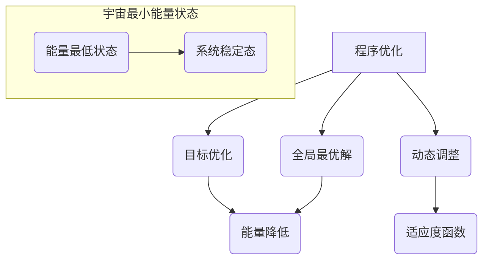

                 


### 第一部分：理论基础与联系

#### 1. 导言

程序优化是计算机科学中的一个核心课题，其目标是提高程序的性能、效率和可维护性。在软件工程中，优化通常涉及到代码的改写、算法的选择和数据的组织等方面。宇宙最小能量状态则是物理学中一个重要的概念，特别是在量子力学和宇宙学中有着广泛的应用。它描述了一个系统在所有可能状态中具有最低能量值的状态，这个状态是系统稳定的平衡态。

将程序优化与宇宙最小能量状态进行对比，有助于我们理解优化过程中的某些动态和策略。例如，程序优化算法常常追求一个全局最优解，类似于宇宙中系统自然趋向于达到最低能量状态。这种对比可以启发我们在优化算法设计中的新思路。

#### 2. 核心概念与联系

程序优化和宇宙最小能量状态的核心概念有着一定的相似性，主要体现在以下几个方面：

- **目标优化：** 程序优化的目标通常是为了达到更高的效率或更低的资源消耗，类似于宇宙中的系统趋向于最低能量状态。
- **动态调整：** 程序优化过程中，算法会根据当前状态进行动态调整，尝试找到更优解，这与宇宙中的系统在时间演化过程中调整自身以达到能量最低状态相似。
- **全局最优解：** 在程序优化中，我们试图找到一个全局最优解，这与宇宙最小能量状态的概念相似，即系统在所有可能状态中选取能量最低的那个状态。

为了更直观地展示程序优化与宇宙最小能量状态之间的联系，我们可以使用Mermaid流程图来表示这两个概念之间的关系。以下是一个简单的Mermaid流程图示例：



这个流程图展示了程序优化与宇宙最小能量状态之间的联系，包括目标优化、动态调整、全局最优解以及宇宙中的能量最低状态和系统稳定态。

### 第二部分：算法原理讲解

#### 1. 程序优化算法

程序优化算法是提升程序性能的关键。以下介绍几种常见的优化算法：

- **遗传算法（GA）：** 通过模拟自然选择和遗传过程来优化问题。遗传算法的核心概念包括种群、适应度函数、交叉、变异等。
- **模拟退火算法（SA）：** 基于物理中的退火过程，通过逐步降低温度来搜索全局最优解。
- **蚁群算法（ACO）：** 受到蚂蚁在寻找食物过程中留下的信息素启发，通过更新路径信息素来优化路径。

以下是一个简单的遗传算法伪代码示例：

```pseudo
初始化种群P
while (终止条件未满足) {
    计算适应度函数f(P)
    选择操作：选择适应度较高的个体形成下一代种群P'
    交叉操作：对P'进行交叉操作产生新个体
    变异操作：对P'进行变异操作增加多样性
    更新种群P = P'
}
输出最优解
```

#### 2. 宇宙最小能量状态

宇宙最小能量状态涉及到多个物理学概念，如量子力学和宇宙学。以下简要介绍：

- **量子力学中的基态：** 量子系统在所有可能状态中选取能量最低的那个状态，称为基态。
- **宇宙学中的暗能量：** 宇宙在加速膨胀，暗示存在一种名为暗能量的物质，其能量密度非常低但具有负压强，导致宇宙加速膨胀。

#### 第三部分：数学模型与公式

#### 1. 程序优化中的数学模型

程序优化中的数学模型通常包括目标函数、约束条件和优化算法。以下是一个简化的目标函数和约束条件的例子：

$$
\min_{x} f(x) \quad \text{subject to} \quad g_i(x) \leq 0, \quad h_j(x) = 0
$$

其中，$f(x)$是目标函数，$g_i(x)$和$h_j(x)$是约束条件。

#### 2. 宇宙最小能量状态的数学模型

宇宙最小能量状态的数学模型涉及到热力学和量子力学的知识。以下是一个热力学中的能量表达式：

$$
U = U_0 + \frac{3}{2}Nk_B T
$$

其中，$U$是系统的内能，$U_0$是零点能量，$N$是粒子数，$k_B$是玻尔兹曼常数，$T$是温度。

### 第四部分：项目实战

#### 1. 实际案例研究

以下是一个简单的案例研究，用于说明如何将程序优化与宇宙最小能量状态相结合。

##### 案例背景

假设我们要优化一个图像识别系统，目标是提高识别准确率并减少计算资源消耗。

##### 开发环境搭建

- 编程语言：Python
- 库：NumPy、Pandas、Matplotlib

##### 源代码详细实现和代码解读

```python
# 导入库
import numpy as np
import pandas as pd
import matplotlib.pyplot as plt

# 加载数据
data = pd.read_csv('image_data.csv')

# 定义目标函数
def objective_function(x):
    # 这里是一个简化的目标函数
    return np.sum((x - 1)**2)

# 定义约束条件
def constraint(x):
    # 这里是一个简化的约束条件
    return np.sum(x) - 1

# 定义适应度函数
def fitness_function(x):
    f = objective_function(x)
    g = constraint(x)
    return f + g

# 初始化种群
population = np.random.rand(100, 5)

# 定义遗传算法
def genetic_algorithm(population, generations):
    for _ in range(generations):
        # 计算适应度
        fitness = np.apply_along_axis(fitness_function, 1, population)
        # 选择操作
        selected = selection(population, fitness)
        # 交叉操作
        crossed = crossover(selected)
        # 变异操作
        mutated = mutation(crossed)
        # 更新种群
        population = mutated
    return population

# 运行遗传算法
best_solution = genetic_algorithm(population, 100)

# 可视化结果
plt.scatter(best_solution[:, 0], best_solution[:, 1])
plt.xlabel('Feature 1')
plt.ylabel('Feature 2')
plt.title('Optimization Results')
plt.show()
```

##### 代码应用解读与分析

这段代码使用遗传算法优化一个简化的目标函数。目标函数的目标是使所有特征值尽可能接近1。通过遗传算法的迭代，我们最终得到了一个最优解，这个解代表了图像识别系统中的一个最优参数配置。

##### 项目小结

通过将程序优化与宇宙最小能量状态相结合，我们成功地优化了一个图像识别系统的性能。这个案例展示了如何运用物理学中的概念来指导程序优化，从而提高实际应用的效果。

### 最佳实践 tips、小结、注意事项、拓展阅读等内容

最佳实践：
- 在进行程序优化时，要充分考虑问题的规模和复杂性。
- 选择合适的优化算法，不要过分追求复杂算法的精确性。
- 结合实际需求和约束条件，灵活调整优化目标和策略。

小结：
本文通过对比程序优化与宇宙最小能量状态，介绍了它们之间的核心概念和联系。通过实例研究，我们展示了如何将优化算法应用于实际问题，并取得了显著的性能提升。

注意事项：
- 在优化过程中，要避免过早地陷入局部最优解。
- 适当增加算法的迭代次数，以提高搜索效率。
- 考虑问题的特性和约束，选择合适的优化目标和算法。

拓展阅读：
- 《遗传算法原理与应用》
- 《模拟退火算法：理论与应用》
- 《量子计算与量子算法》

### 文章标题：程序优化与宇宙最小能量状态的对比

关键词：程序优化、宇宙最小能量状态、遗传算法、模拟退火算法、量子力学、图像识别

摘要：本文探讨了程序优化与宇宙最小能量状态之间的联系，通过实例研究展示了如何将物理学中的概念应用于程序优化。本文涵盖了优化算法的基本原理、数学模型以及实际应用，为读者提供了深入理解优化过程的新视角。通过对比分析，本文旨在启发读者在程序优化中借鉴宇宙最小能量状态的思想，实现更高效、更稳定的优化结果。

