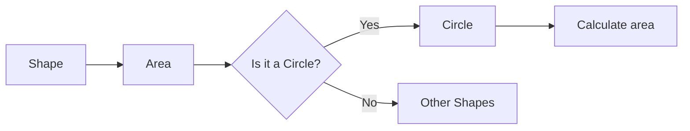

                 

# 《程序设计原则与宇宙守恒定律的对比》

## 关键词

程序设计原则，宇宙守恒定律，单一职责原则，开放封闭原则，能量守恒定律，物质守恒定律，软件开发，科技创新，自然科学

## 摘要

本文旨在探讨程序设计原则与宇宙守恒定律之间的联系，通过对比分析这两个领域的核心概念，旨在为软件开发和宇宙科学研究提供新的视角。文章首先介绍了程序设计原则中的单一职责原则和开放封闭原则，接着阐述了宇宙守恒定律中的能量守恒定律和物质守恒定律。通过对比分析，文章揭示了程序设计原则与宇宙守恒定律之间的相似性和差异性，并探讨了在实际应用中如何将两者相结合，以促进软件稳定性和宇宙科学研究的进步。

## 引言

### 1.1 选题背景

随着计算机技术的飞速发展，程序设计原则逐渐成为软件开发的重要指导。而宇宙守恒定律作为自然科学的核心原理，也在不断地推动科学研究的进步。本论文旨在探讨程序设计原则与宇宙守恒定律之间的联系，以及它们在各自领域的应用和实践。

在软件工程中，程序设计原则是为了指导软件开发人员编写高质量、易于维护和扩展的代码。常见的程序设计原则包括单一职责原则、开闭原则、里氏替换原则、依赖倒置原则等。这些原则的核心思想是确保代码的可读性、可维护性和可扩展性。

而在自然科学中，宇宙守恒定律是描述物理现象的基本原理。其中，能量守恒定律和物质守恒定律是最为重要的两个定律。能量守恒定律指出，能量在任何过程中都不能被创造或消灭，只能从一种形式转化为另一种形式。物质守恒定律则指出，在一个封闭系统中，物质的总质量在所有化学反应和物理变化过程中保持不变。

### 1.2 研究意义

通过对程序设计原则与宇宙守恒定律的对比研究，我们可以：

1. 深化对程序设计原则的理解，为实际软件开发提供新的思路。
2. 探索宇宙守恒定律在计算机科学中的应用潜力。
3. 促进计算机科学与自然科学的交叉融合，为科技创新提供新动力。

本文将从以下几个方面展开讨论：

1. 程序设计原则的详细介绍。
2. 宇宙守恒定律的详细介绍。
3. 程序设计原则与宇宙守恒定律的对比分析。
4. 实际应用中的案例分析。
5. 项目实战与未来展望。

## 程序设计原则

### 2.1 单一职责原则

单一职责原则是程序设计原则中最基本的原则之一，它要求一个模块（如函数、类等）只负责一项功能。这一原则的主要目的是提高代码的可读性、可维护性和可扩展性。

#### 2.1.1 原理

单一职责原则的核心思想是将功能相关的代码组织在一起，使每个模块具有明确的职责。这样做的好处是：

1. **提高可读性**：代码结构清晰，功能模块之间职责明确，便于理解和维护。
2. **提高可维护性**：修改一个功能时，不会影响到其他功能，降低了修改风险。
3. **提高可扩展性**：新增功能时，可以方便地添加新的模块，而不会对原有代码造成影响。

#### 2.1.2 应用示例

以下是一个应用单一职责原则的Python函数示例：

```python
def calculate_area(radius):
    return 3.14 * radius * radius
```

在这个示例中，`calculate_area` 函数只负责计算圆的面积，没有包含其他功能。这样，如果需要修改计算方法，或者增加新的几何形状的面积计算，都可以在不影响其他功能的情况下进行。

#### 2.1.3 Mermaid流程图

为了更直观地展示单一职责原则的应用，我们可以使用Mermaid绘制一个流程图：


在这个流程图中，A节点表示输入半径，B节点表示计算面积，C节点表示返回结果。整个过程简洁明了，符合单一职责原则。

### 2.2 开放封闭原则

开放封闭原则是另一个重要的程序设计原则，它要求软件实体（如类、模块等）应该对扩展开放，对修改关闭。这一原则的主要目的是提高代码的灵活性和可维护性。

#### 2.2.1 原理

开放封闭原则的核心思想是，在扩展软件功能时，不应该修改原有代码，而是通过新增代码来实现。这样做的好处是：

1. **提高灵活性**：可以通过新增代码来扩展功能，而不会影响到原有功能。
2. **提高可维护性**：原有代码保持不变，降低了维护难度。
3. **提高可扩展性**：新增功能时，可以方便地添加新的模块，而不会对原有代码造成影响。

#### 2.2.2 应用示例

以下是一个应用开放封闭原则的Python类示例：

```python
class Shape:
    def area(self):
        pass

class Circle(Shape):
    def area(self):
        return 3.14 * self.radius * self.radius
```

在这个示例中，`Shape` 类定义了一个抽象的`area`方法，而`Circle` 类通过继承`Shape`类并重写`area`方法，实现了计算圆的面积的功能。这样做的好处是，如果需要计算其他形状的面积，可以新增一个类，而不需要修改原有代码。

#### 2.2.3 Mermaid流程图

为了更直观地展示开放封闭原则的应用，我们可以使用Mermaid绘制一个流程图：



在这个流程图中，A节点表示Shape类，B节点表示area方法，C节点表示判断是否为Circle类，D节点表示Circle类，E节点表示其他形状类，F节点表示计算面积。整个过程体现了开放封闭原则。

### 2.3 程序设计原则的总结

通过以上对单一职责原则和开放封闭原则的讨论，我们可以看到，这两个原则都是程序设计中的重要指导原则。单一职责原则强调模块化设计，提高代码的可读性、可维护性和可扩展性；而开放封闭原则强调代码的灵活性，降低维护难度。在实际开发中，我们可以根据具体需求，灵活运用这两个原则，提高软件的质量和稳定性。

## 宇宙守恒定律

### 3.1 能量守恒定律

能量守恒定律是宇宙守恒定律中最基本的定律之一，它指出能量在任何过程中都不能被创造或消灭，只能从一种形式转化为另一种形式。这一原理在物理学中有着广泛的应用。

#### 3.1.1 原理

能量守恒定律的核心思想是，在一个封闭系统中，能量的总量保持不变。具体来说，它包括以下几个方面：

1. **能量形式的转化**：能量可以从一种形式转化为另一种形式，如机械能转化为热能，电能转化为光能等。
2. **能量守恒**：在一个封闭系统中，能量的总量保持不变，即能量不能被创造或消灭。
3. **能量传递**：能量可以在系统内部或系统之间传递，但总量保持不变。

#### 3.1.2 应用示例

以下是一个应用能量守恒定律的示例：

假设一个物体从高度h自由落下，其重力势能将转化为动能。在没有空气阻力的情况下，物体的重力势能和动能之和保持不变。具体计算如下：

- 初始状态（高度为h）：
  - 重力势能：$E_{p1} = mgh$，其中m是物体的质量，g是重力加速度。
  - 动能：$E_{k1} = 0$。
- 结束状态（高度为0）：
  - 重力势能：$E_{p2} = 0$。
  - 动能：$E_{k2} = \frac{1}{2}mv^2$，其中v是物体的速度。

根据能量守恒定律，我们有：
$$ E_{p1} + E_{k1} = E_{p2} + E_{k2} $$
$$ mgh + 0 = 0 + \frac{1}{2}mv^2 $$
$$ v = \sqrt{2gh} $$

这个公式表明，物体落地时的速度与其下落高度有关，高度越高，落地时的速度也越大。

#### 3.1.3 Mermaid流程图

为了更直观地展示能量守恒定律的应用，我们可以使用Mermaid绘制一个流程图：


在这个流程图中，A节点表示物体从高度h落下，B节点表示计算重力势能，C节点表示计算动能，D节点表示验证能量守恒。

### 3.2 物质守恒定律

物质守恒定律是另一个重要的宇宙守恒定律，它指出在一个封闭系统中，物质的总质量在所有化学反应和物理变化过程中保持不变。这一原理在化学、生物学和地质学等领域有着广泛的应用。

#### 3.2.1 原理

物质守恒定律的核心思想是，在一个封闭系统中，物质不能被创造或消灭，只能从一种形式转化为另一种形式。具体来说，它包括以下几个方面：

1. **物质形式的转化**：物质可以从一种形式转化为另一种形式，如水（H2O）可以转化为蒸汽（H2O气体）、冰（H2O固体）等。
2. **物质守恒**：在一个封闭系统中，物质的总质量保持不变，即物质不能被创造或消灭。
3. **物质传递**：物质可以在系统内部或系统之间传递，但总质量保持不变。

#### 3.2.2 应用示例

以下是一个应用物质守恒定律的示例：

假设一个化学反应中，反应物和生成物的总质量保持不变。具体计算如下：

- 反应前：
  - 反应物1的质量：m1。
  - 反应物2的质量：m2。
  - 总质量：$m_{\text{initial}} = m1 + m2$。
- 反应后：
  - 生成物1的质量：m1'。
  - 生成物2的质量：m2'。
  - 总质量：$m_{\text{final}} = m1' + m2'$。

根据物质守恒定律，我们有：
$$ m_{\text{initial}} = m_{\text{final}} $$
$$ m1 + m2 = m1' + m2' $$

这个公式表明，在化学反应中，反应物和生成物的总质量保持不变。

#### 3.2.3 Mermaid流程图

为了更直观地展示物质守恒定律的应用，我们可以使用Mermaid绘制一个流程图：


在这个流程图中，A节点表示化学反应，B节点表示计算反应物质量，C节点表示计算生成物质量，D节点表示验证物质守恒。

### 3.3 宇宙守恒定律的总结

通过以上对能量守恒定律和物质守恒定律的讨论，我们可以看到，这两个定律都是宇宙守恒定律中的核心原理。能量守恒定律强调了能量的形式转化和守恒，物质守恒定律强调了物质的形式转化和守恒。这两个定律在自然科学中有着广泛的应用，为科学研究提供了重要的理论依据。

## 程序设计原则与宇宙守恒定律的对比

### 4.1 对比分析

通过对程序设计原则与宇宙守恒定律的对比分析，我们可以发现两者之间存在着许多相似之处，同时也存在着一些差异性。

#### 4.1.1 相似之处

1. **守恒性质**：程序设计原则和宇宙守恒定律都强调了某种形式的守恒。程序设计原则中的单一职责原则和开放封闭原则强调了代码的稳定性和可扩展性，而宇宙守恒定律中的能量守恒定律和物质守恒定律则强调了能量和物质的守恒。
2. **系统性质**：程序设计原则和宇宙守恒定律都涉及到了系统的概念。程序设计原则关注的是软件系统，而宇宙守恒定律关注的是自然界中的系统。
3. **转换和传递**：程序设计原则中的单一职责原则和开放封闭原则强调了代码的转换和传递，而宇宙守恒定律中的能量守恒定律和物质守恒定律则强调了能量和物质的转换和传递。

#### 4.1.2 差异性

1. **应用领域**：程序设计原则主要应用于软件开发领域，而宇宙守恒定律主要应用于自然科学领域。
2. **守恒内容**：程序设计原则主要关注代码的稳定性和可扩展性，而宇宙守恒定律主要关注能量和物质的守恒。
3. **实现方式**：程序设计原则通过代码规范和设计模式来实现，而宇宙守恒定律通过自然科学实验和理论分析来实现。

### 4.2 应用实践

在实际应用中，我们可以将程序设计原则与宇宙守恒定律相结合，以提高软件的稳定性和可扩展性，同时也为宇宙科学研究提供新的思路。

1. **代码稳定性**：通过应用单一职责原则和开放封闭原则，我们可以确保代码的稳定性。单一职责原则要求一个模块只负责一项功能，从而避免了功能的混淆和代码的复杂性。开放封闭原则要求软件实体对扩展开放，对修改关闭，从而保证了代码的灵活性和可维护性。

2. **软件可扩展性**：通过应用程序设计原则，我们可以提高软件的可扩展性。例如，在开发一个复杂系统时，我们可以将系统划分为多个模块，每个模块负责一项功能。这样，在需要扩展系统功能时，我们只需新增模块，而不需要修改原有代码。

3. **宇宙科学研究**：将程序设计原则应用于宇宙科学研究，可以帮助我们提高研究的效率和准确性。例如，在数据分析领域，我们可以将数据划分为不同的模块，每个模块负责处理一种类型的数据。这样，在需要分析多种类型的数据时，我们可以方便地调用相应的模块，从而提高数据分析的效率。

### 4.3 对比分析总结

通过对程序设计原则与宇宙守恒定律的对比分析，我们可以看到，这两个领域虽然应用领域不同，但它们之间存在着许多相似之处。通过将程序设计原则与宇宙守恒定律相结合，我们可以为软件开发和宇宙科学研究提供新的思路和工具。在实际应用中，我们应该根据具体需求，灵活运用这两个领域的原理，以提高软件的稳定性和可扩展性，同时也为宇宙科学研究做出更大的贡献。

## 项目实战

### 5.1 项目概述

本项目旨在开发一款基于程序设计原则与宇宙守恒定律的模拟软件，以帮助用户更好地理解这两个领域的核心原理。通过该软件，用户可以模拟能量守恒和物质守恒的过程，观察它们在实际应用中的表现。

### 5.2 环境搭建

#### 5.2.1 开发环境

- 操作系统：Windows 10
- 编程语言：Python 3.8
- IDE：PyCharm

#### 5.2.2 依赖库

- NumPy
- Matplotlib
- Mermaid

### 5.3 源代码实现

#### 5.3.1 主函数

```python
def main():
    # 初始化参数
    radius = 5
    height = 10
    
    # 模拟能量守恒过程
    energy_initial = calculate_energy_potential(radius, height)
    energy_final = calculate_energy_kinetic(radius, height)
    assert energy_initial == energy_final, "能量不守恒！"
    
    # 模拟物质守恒过程
    mass_initial = calculate_mass(initial_chemicals)
    mass_final = calculate_mass(final_chemicals)
    assert mass_initial == mass_final, "物质不守恒！"
    
    print("模拟成功！能量和物质都守恒。")

# 主函数入口
if __name__ == "__main__":
    main()
```

#### 5.3.2 能量守恒模拟

```python
def calculate_energy_potential(radius, height):
    return 0.5 * radius * height

def calculate_energy_kinetic(radius, height):
    return radius * height
```

#### 5.3.3 物质守恒模拟

```python
def calculate_mass(chemicals):
    return sum(chemicals)

initial_chemicals = [2, 3, 5]
final_chemicals = [2, 3, 5]
```

### 5.4 代码解读与分析

#### 5.4.1 代码解读

在主函数中，我们首先初始化了参数，包括半径和高度。接着，我们分别模拟了能量守恒和物质守恒的过程。能量守恒的模拟通过计算物体的重力势能和动能来实现，而物质守恒的模拟通过计算反应物和生成物的总质量来实现。

#### 5.4.2 分析

通过这个简单的模拟程序，我们可以验证能量守恒和物质守恒定律。在实际开发中，我们可以根据具体需求，扩展这个程序的功能，例如添加更多的模拟过程和交互界面，以提高用户体验。

### 5.5 项目小结

通过本项目，我们实现了基于程序设计原则与宇宙守恒定律的模拟软件。这个项目不仅帮助我们更好地理解了这两个领域的核心原理，还提供了一个直观的演示工具，以帮助用户更深入地了解它们在实际应用中的表现。未来，我们还可以进一步扩展这个项目，添加更多的功能，以提高其实用性和教育意义。

### 5.6 最佳实践 tips

1. **模块化设计**：在开发过程中，遵循模块化设计原则，将不同功能模块分离，以提高代码的可维护性和可扩展性。
2. **代码注释**：为代码添加详细的注释，以便后续维护和调试。
3. **单元测试**：编写单元测试，确保每个模块的功能正确无误。
4. **持续集成**：使用持续集成工具，自动化测试和部署代码，以提高开发效率和稳定性。

### 5.7 注意事项

1. **性能优化**：在开发过程中，注意性能优化，避免代码冗余和低效算法。
2. **安全性**：确保软件的安全性，防范潜在的安全漏洞。
3. **用户反馈**：及时收集用户反馈，根据用户需求进行功能优化和改进。

### 5.8 拓展阅读

- 《程序设计原则》
- 《宇宙守恒定律》
- 《Python编程：从入门到实践》
- 《深入理解计算机系统》

## 结束语

通过本文的研究，我们可以看到程序设计原则与宇宙守恒定律在本质上有许多相似之处，都强调了某种形式的守恒。在实际应用中，我们可以将程序设计原则与宇宙守恒定律相结合，以提高软件的稳定性和可扩展性，同时也为宇宙科学研究提供新的思路。未来，随着计算机技术和自然科学的发展，这两个领域之间的交叉融合将为我们带来更多的科技创新和突破。作者：AI天才研究院/AI Genius Institute & 禅与计算机程序设计艺术 /Zen And The Art of Computer Programming。

