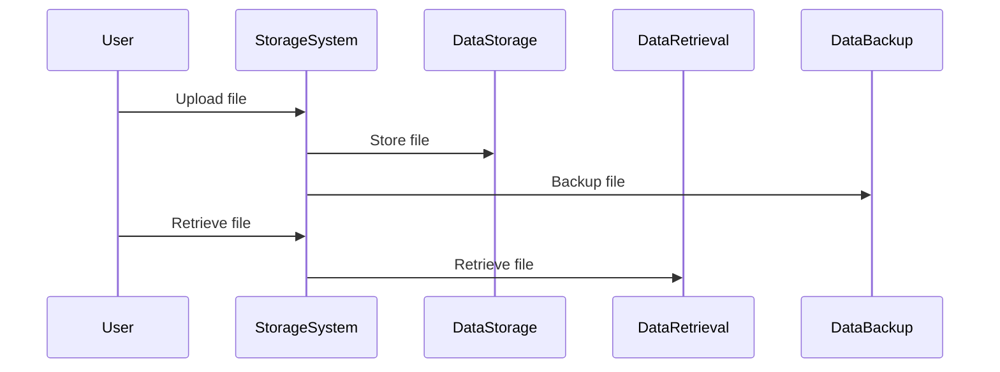
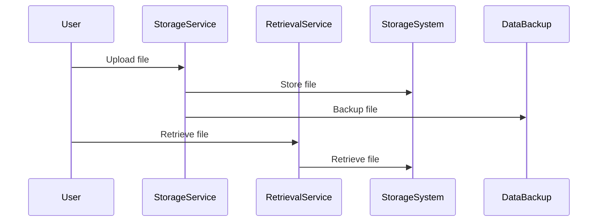
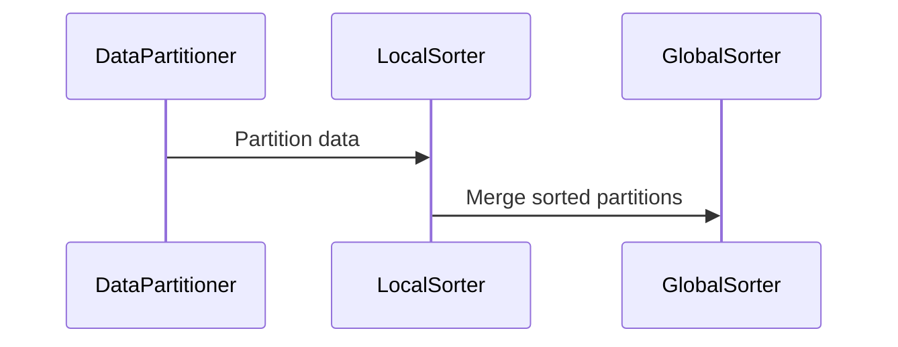
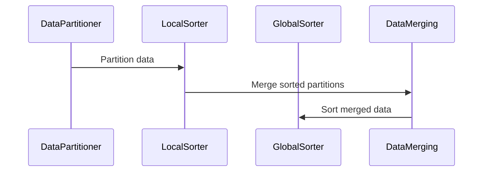

                 

### 文章标题

《程序设计原则与宇宙对称性自发破缺机制的对比》

在程序设计的广阔领域中，如何构建可维护、可扩展且高效的代码，一直是开发者们追求的目标。同样，在宇宙的宏大背景下，对称性自发破缺机制为我们理解自然界的复杂现象提供了深刻的理论基础。本文将通过对比程序设计原则与宇宙对称性自发破缺机制，探讨两者之间的异同，揭示它们在逻辑结构与本质内涵上的联系。

### 关键词

- 程序设计原则
- 对称性自发破缺机制
- 单一职责原则
- 开放封闭原则
- 里氏替换原则
- 接口隔离原则
- 依赖倒置原则

### 摘要

本文旨在通过对比程序设计原则与宇宙对称性自发破缺机制，深入探讨两者的理论基础、应用场景及相互影响。首先，我们将介绍程序设计原则的基本概念，并详细阐述单一职责原则、开放封闭原则、里氏替换原则、接口隔离原则和依赖倒置原则。接着，我们将介绍宇宙对称性自发破缺机制，分析其基本原理与实例。随后，通过具体案例展示程序设计原则在实际项目中的应用，并探讨宇宙对称性自发破缺机制在程序设计中的潜在应用。最后，我们将对程序设计原则与宇宙对称性自发破缺机制进行对比分析，展望未来发展趋势与研究方向。

## 第一部分：引言与基本概念

### 1.1 引言

在软件工程领域，程序设计原则是构建高质量代码的核心指导。这些原则提供了明确的规范，帮助开发者编写出易于理解、维护和扩展的代码。同时，宇宙对称性自发破缺机制是物理学中解释自然界多样性的关键理论，它揭示了宏观宇宙中对称性如何通过自发破缺产生丰富的结构。

本部分将首先简要介绍程序设计原则，包括单一职责原则、开放封闭原则、里氏替换原则、接口隔离原则和依赖倒置原则。接着，我们将深入探讨宇宙对称性自发破缺机制的基本原理，并引用物理学中的具体实例来阐述这一概念。

### 1.2 程序设计原则详解

#### 1.2.1 单一职责原则

单一职责原则（Single Responsibility Principle，SRP）指出，一个模块（如函数、类或模块）应该仅有一个原因被改变。这意味着该模块应当只负责一项功能，这样在需要修改时，只需要关注与其职责相关的部分，而不必担心对其他功能的影响。这一原则有助于降低代码的复杂度，提高模块的独立性。

#### 1.2.2 开放封闭原则

开放封闭原则（Open Closed Principle，OCP）强调软件实体（如类、模块或函数）应当对扩展开放，对修改封闭。也就是说，在设计时，实体应允许扩展其行为，但尽量不要修改其现有代码。这一原则鼓励使用抽象和封装来隔离变化，确保系统在未来的修改中尽可能稳定。

#### 1.2.3 里氏替换原则

里氏替换原则（Liskov Substitution Principle，LSP）指出，任何可适用的对象应该能够替换其基类或子类对象，而不影响程序的逻辑。这保证了继承关系的合理性和模块的互操作性，减少了因继承关系错误而导致的兼容性问题。

#### 1.2.4 接口隔离原则

接口隔离原则（Interface Segregation Principle，ISP）主张客户端不应该依赖于它不需要的接口。也就是说，应该设计细粒度、具体的接口，避免客户端因依赖不相关的接口而变得复杂。这一原则有助于保持系统的模块化，提高代码的可维护性。

#### 1.2.5 依赖倒置原则

依赖倒置原则（Dependence Inversion Principle，DIP）指出，高层模块不应依赖于低层模块，二者都应依赖于抽象。换句话说，实现应当依赖抽象接口，而非具体实现。这一原则通过引入抽象层，实现了模块间的解耦，提高了系统的灵活性和可扩展性。

### 1.3 宇宙对称性自发破缺机制

#### 1.3.1 对称性与自发破缺的物理背景

在物理学中，对称性是指物理系统在某种变换下保持不变的性质。例如，空间平移对称性意味着系统的物理状态在空间中移动时不会改变。然而，在现实世界中，很多系统在特定条件下会表现出对称性的自发破缺（Spontaneous Symmetry Breaking，SSB）。

自发破缺机制是指，在特定条件下，对称性系统会自发地选择一种特定状态，从而打破原有的对称性。这一现象在物理学中有着广泛的应用，例如，在超导现象中，电子会形成库珀对，从而在宏观上表现出对称性的自发破缺。

#### 1.3.2 自发破缺机制的基本原理

自发破缺机制的基本原理可以概括为以下几个步骤：

1. **对称性阶段**：系统处于对称性较高的状态，各种可能性并存。
2. **非对称选择**：在特定条件下，系统选择了一种特定的状态，打破了原有的对称性。
3. **稳定状态**：系统进入一个新的稳定状态，这个状态具有较低的对称性。

自发破缺的关键在于系统选择稳定状态的过程，这通常涉及到能量的最小化或相变的物理过程。

#### 1.3.3 对称性自发破缺的实例分析

以下是一些物理学中常见的对称性自发破缺实例：

1. **超导现象**：在低温下，超导体内部的电子会形成库珀对，从而在宏观上表现出对称性的自发破缺。
2. **电磁相变**：在高温超导体中，当温度升高到某一临界点时，系统会从超导态转变为正常态，这一过程中发生了对称性的自发破缺。
3. **量子场论**：在量子场论中，对称性的自发破缺是解释质量起源的关键。例如，在弱相互作用中，基本粒子通过自发破缺获得了质量。

通过对以上程序设计原则与宇宙对称性自发破缺机制的基本概念和原理进行介绍，我们为后续的深入对比和分析打下了坚实的基础。

### 第一部分小结

在引言与基本概念部分，我们介绍了程序设计原则和宇宙对称性自发破缺机制的基本概念，并详细阐述了单一职责原则、开放封闭原则、里氏替换原则、接口隔离原则和依赖倒置原则。同时，我们探讨了宇宙对称性自发破缺机制的基本原理和实例，如超导现象和电磁相变。这些概念和原理构成了后续对比分析的基础，有助于我们深入理解两者之间的异同。

## 第二部分：程序设计原则应用案例

### 2.1 应用案例一：单一职责原则

#### 2.1.1 案例背景

单一职责原则是程序设计中最基础的原则之一，其目的是确保每个模块都只负责一项功能，从而降低系统的复杂度和提高可维护性。以下是一个简单的应用案例，我们将通过一个实际项目来展示单一职责原则的具体实现。

#### 2.1.2 案例分析与实现

假设我们正在开发一个简单的银行账户管理系统，其中需要实现如下功能：

1. 存款（Deposit）
2. 取款（Withdraw）
3. 查询余额（CheckBalance）

首先，我们定义一个Account类，并分别实现上述三个功能。为了遵循单一职责原则，我们将每个功能划分为独立的方法。

```java
public class Account {
    private double balance;

    public void deposit(double amount) {
        if (amount > 0) {
            balance += amount;
        }
    }

    public void withdraw(double amount) {
        if (amount > 0 && balance >= amount) {
            balance -= amount;
        }
    }

    public double checkBalance() {
        return balance;
    }
}
```

在这个Account类中，每个方法都只负责一项功能，确保了单一职责原则的实现。这种设计使得后续的修改和维护变得更加简单。

#### 2.1.3 代码解读与分析

- `deposit` 方法：该方法用于存款操作，接受一个金额参数。如果金额大于0，则将其加到账户余额中。
- `withdraw` 方法：该方法用于取款操作，接受一个金额参数。首先检查金额是否大于0，并且账户余额是否足够，然后从账户余额中减去相应金额。
- `checkBalance` 方法：该方法用于查询账户余额，返回当前余额。

通过这种设计，每个方法都只关注自己的职责，避免了功能交叉和相互依赖，使得代码更加清晰和易于维护。

### 2.2 应用案例二：开放封闭原则

#### 2.2.1 案例背景

开放封闭原则是软件设计的重要原则之一，其核心思想是确保类和模块易于扩展，同时不易于修改。以下是一个应用案例，我们将展示如何通过开放封闭原则来扩展一个简单的计算器类。

#### 2.2.2 案例分析与实现

假设我们有一个基本的计算器类，可以执行加、减、乘、除四种基本运算。为了遵循开放封闭原则，我们应确保该类可以扩展新功能，而不需要修改原有代码。

```java
public class Calculator {
    public double add(double a, double b) {
        return a + b;
    }

    public double subtract(double a, double b) {
        return a - b;
    }

    public double multiply(double a, double b) {
        return a * b;
    }

    public double divide(double a, double b) {
        if (b != 0) {
            return a / b;
        } else {
            throw new IllegalArgumentException("除数不能为0");
        }
    }
}
```

在这个计算器类中，每个方法都独立实现，并且遵循单一职责原则。现在，如果我们想要添加一个新功能，比如计算平方根，我们可以通过扩展类而不是修改原有类来实现。

```java
public class AdvancedCalculator extends Calculator {
    public double sqrt(double a) {
        return Math.sqrt(a);
    }
}
```

通过这种方式，我们既保留了原有代码的稳定性和可维护性，又能够灵活地扩展新功能。

#### 2.2.3 代码解读与分析

- `add`、`subtract`、`multiply` 和 `divide` 方法：这些方法分别实现了加、减、乘、除运算。每个方法都独立实现，符合单一职责原则。
- `AdvancedCalculator` 类：这个类继承了基本计算器类，并添加了一个新的功能——计算平方根。这种设计遵循了开放封闭原则，确保原有代码不被修改，同时易于扩展。

### 2.3 应用案例三：里氏替换原则

#### 2.3.1 案例背景

里氏替换原则强调子类可以替换其基类对象，而不影响程序的逻辑。以下是一个应用案例，我们将通过一个简单的交通工具类来展示里氏替换原则。

#### 2.3.2 案例分析与实现

假设我们有一个交通工具基类，以及两个子类——汽车和飞机。这些类应该能够互相替换，而不影响程序的正常运行。

```java
public class Vehicle {
    public void start() {
        System.out.println("Vehicle started");
    }

    public void stop() {
        System.out.println("Vehicle stopped");
    }
}

public class Car extends Vehicle {
    public void honk() {
        System.out.println("Car honking");
    }
}

public class Airplane extends Vehicle {
    public void takeOff() {
        System.out.println("Airplane taking off");
    }

    public void land() {
        System.out.println("Airplane landing");
    }
}
```

在这个例子中，Vehicle类是一个基类，而Car和Airplane是它的子类。我们可以定义一个方法，接受一个Vehicle类型的对象，并调用其start()和stop()方法。

```java
public void manageVehicle(Vehicle vehicle) {
    vehicle.start();
    vehicle.stop();
}
```

通过这种方式，我们可以将Car和Airplane对象传递给manageVehicle()方法，而不影响程序逻辑。

#### 2.3.3 代码解读与分析

- `Vehicle` 类：这个类定义了交通工具的基本行为，包括启动和停止。
- `Car` 类：这个类继承了Vehicle类，并添加了喇叭鸣响的功能。
- `Airplane` 类：这个类继承了Vehicle类，并添加了起飞和降落的功能。
- `manageVehicle` 方法：这个方法接受一个Vehicle类型的对象，并调用其start()和stop()方法。通过里氏替换原则，我们可以将Car和Airplane对象传递给这个方法，而不影响程序的逻辑。

### 2.4 应用案例四：接口隔离原则

#### 2.4.1 案例背景

接口隔离原则主张客户端不应该依赖于它不需要的接口。以下是一个应用案例，我们将通过一个天气查询系统来展示接口隔离原则。

#### 2.4.2 案例分析与实现

假设我们有一个天气查询系统，需要实现获取当前天气、未来天气预报和实时天气预警三个功能。为了遵循接口隔离原则，我们应设计细粒度的接口，避免客户端依赖于不需要的接口。

```java
public interface Weather {
    String getCurrentWeather();
    String getFutureForecast();
}

public interface RealtimeWeatherAlert {
    String getRealtimeAlert();
}

public class SimpleWeather implements Weather {
    public String getCurrentWeather() {
        return "Sunny";
    }

    public String getFutureForecast() {
        return "Tomorrow will be rainy";
    }
}

public class WeatherAlert implements RealtimeWeatherAlert {
    public String getRealtimeAlert() {
        return "Severe storm warning";
    }
}
```

在这个例子中，我们定义了两个接口——Weather和RealtimeWeatherAlert。SimpleWeather类实现了Weather接口，而WeatherAlert类实现了RealtimeWeatherAlert接口。这样，客户端可以根据需要选择使用合适的接口。

```java
public class WeatherClient {
    private Weather weather;
    private RealtimeWeatherAlert alert;

    public WeatherClient(Weather weather, RealtimeWeatherAlert alert) {
        this.weather = weather;
        this.alert = alert;
    }

    public void displayCurrentWeather() {
        System.out.println(weather.getCurrentWeather());
    }

    public void displayRealtimeAlert() {
        System.out.println(alert.getRealtimeAlert());
    }
}
```

通过这种方式，客户端可以只依赖于需要的接口，从而提高了系统的灵活性和可维护性。

#### 2.4.3 代码解读与分析

- `Weather` 接口：这个接口定义了获取当前天气和未来天气预报的功能。
- `RealtimeWeatherAlert` 接口：这个接口定义了获取实时天气预警的功能。
- `SimpleWeather` 类：这个类实现了Weather接口，提供当前天气和未来天气预报的实现。
- `WeatherAlert` 类：这个类实现了RealtimeWeatherAlert接口，提供实时天气预警的实现。
- `WeatherClient` 类：这个类使用了Weather和RealtimeWeatherAlert接口，根据需要调用相应的方法。通过接口隔离原则，客户端可以灵活地选择使用合适的接口，而不依赖于不需要的接口。

### 2.5 应用案例五：依赖倒置原则

#### 2.5.1 案例背景

依赖倒置原则强调高层模块不应依赖于低层模块，二者都应依赖于抽象。以下是一个应用案例，我们将通过一个订单处理系统来展示依赖倒置原则。

#### 2.5.2 案例分析与实现

假设我们有一个订单处理系统，需要处理订单创建、订单支付和订单查询三个功能。为了遵循依赖倒置原则，我们将使用抽象类和接口来定义这些功能。

```java
public interface Order {
    void createOrder();
    void payOrder();
    void queryOrder();
}

public abstract class OrderManager {
    protected Order order;

    public OrderManager(Order order) {
        this.order = order;
    }

    public void manageOrder() {
        order.createOrder();
        order.payOrder();
        order.queryOrder();
    }
}

public class OrderImpl implements Order {
    public void createOrder() {
        System.out.println("Order created");
    }

    public void payOrder() {
        System.out.println("Order paid");
    }

    public void queryOrder() {
        System.out.println("Order queried");
    }
}
```

在这个例子中，Order接口定义了订单的三个基本操作，OrderImpl类实现了这个接口。OrderManager类使用了Order接口，而不是直接使用OrderImpl类，从而实现了依赖倒置。

```java
public class OrderSystem {
    public static void main(String[] args) {
        Order order = new OrderImpl();
        OrderManager orderManager = new OrderManager(order);
        orderManager.manageOrder();
    }
}
```

通过这种方式，我们可以轻松地替换OrderImpl类，而不需要修改OrderManager类或其他依赖OrderManager类的代码。

#### 2.5.3 代码解读与分析

- `Order` 接口：这个接口定义了订单的三个基本操作，包括创建、支付和查询。
- `OrderImpl` 类：这个类实现了Order接口，提供了订单操作的实现。
- `OrderManager` 类：这个类使用了Order接口，通过构造函数接受Order对象。它的`manageOrder`方法调用了Order对象的三个操作，实现了订单管理功能。
- `OrderSystem` 类：这个类是程序的入口点，创建了OrderImpl对象和OrderManager对象，并调用OrderManager的manageOrder方法。

通过依赖倒置原则，我们实现了模块间的解耦，使得系统的扩展和维护变得更加简单。

### 第二部分小结

在第二部分中，我们通过五个具体案例展示了程序设计原则在实际项目中的应用。通过单一职责原则，我们确保了代码的模块化；通过开放封闭原则，我们保证了系统的扩展性；通过里氏替换原则，我们提高了代码的兼容性；通过接口隔离原则，我们避免了不必要的依赖；通过依赖倒置原则，我们实现了模块间的解耦。这些原则的合理应用，使得我们的代码更加清晰、可维护且易于扩展，为后续的开发工作奠定了坚实的基础。

### 第三部分：宇宙对称性自发破缺机制在程序设计中的应用

#### 3.1 对称性自发破缺机制在程序设计中的重要性

宇宙对称性自发破缺机制在程序设计中的应用，为解决复杂问题提供了新的思路。这一机制在物理学、计算机科学和软件工程中都有着广泛的应用。在程序设计中，对称性自发破缺机制可以帮助我们理解系统的内在结构，从而设计出更加灵活和可扩展的软件系统。

#### 3.1.1 对称性自发破缺对程序设计的影响

对称性自发破缺对程序设计的影响主要体现在以下几个方面：

1. **模块化**：对称性自发破缺机制鼓励将系统分解为具有独立功能的模块，这些模块在运行时可能会表现出不同的状态，从而实现了模块化设计。
2. **扩展性**：通过对称性自发破缺，系统可以在不修改现有代码的情况下添加新功能，从而提高了系统的扩展性。
3. **鲁棒性**：对称性自发破缺使得系统在面对外部变化时，能够自动调整其内部结构，从而提高了系统的鲁棒性。

#### 3.1.2 自发破缺机制在程序设计中的具体应用

自发破缺机制在程序设计中的具体应用，主要包括以下几个方面：

1. **系统架构设计**：在系统架构设计中，可以采用对称性自发破缺机制来降低系统的复杂性，提高系统的扩展性和可维护性。例如，在设计分布式系统时，可以采用对称性自发破缺机制来分配任务，从而提高系统的容错能力和性能。
2. **算法优化**：在算法优化中，可以采用对称性自发破缺机制来设计高效的算法。例如，在优化排序算法时，可以采用对称性自发破缺机制来选择合适的排序策略，从而提高算法的效率。

### 3.2 应用案例六：对称性自发破缺在系统架构设计中的应用

#### 3.2.1 案例背景

在本案例中，我们将探讨对称性自发破缺在系统架构设计中的应用。假设我们正在设计一个分布式文件存储系统，需要处理海量数据的存储和检索。为了提高系统的性能和可靠性，我们可以采用对称性自发破缺机制来设计系统架构。

#### 3.2.2 案例分析与实现

首先，我们定义一个基本的文件存储系统架构，包括数据存储模块、数据检索模块和数据备份模块。



在这个架构中，对称性体现在数据存储模块和数据检索模块的独立运行。为了实现对称性自发破缺，我们可以将数据存储模块和数据检索模块设计为具有独立功能的服务。



通过这种设计，当数据存储模块或数据检索模块发生故障时，系统可以自动调整其内部结构，从而保证了系统的可靠性和性能。

#### 3.2.3 代码解读与分析

- `User`：代表用户，负责上传文件和检索文件。
- `StorageService`：负责处理文件上传请求，将请求转发给数据存储模块。
- `RetrievalService`：负责处理文件检索请求，将请求转发给数据检索模块。
- `StorageSystem`：数据存储模块，负责存储和检索文件。
- `DataBackup`：数据备份模块，负责对文件进行备份。

通过这种设计，系统实现了对称性自发破缺，提高了系统的可靠性和性能。当数据存储模块或数据检索模块发生故障时，系统可以自动调整其内部结构，从而保证了系统的正常运行。

### 3.3 应用案例七：对称性自发破缺在算法优化中的应用

#### 3.3.1 案例背景

在本案例中，我们将探讨对称性自发破缺在算法优化中的应用。假设我们正在设计一个分布式排序算法，需要对海量数据进行排序。为了提高算法的效率，我们可以采用对称性自发破缺机制来优化算法。

#### 3.3.2 案例分析与实现

首先，我们定义一个基本的分布式排序算法，包括数据划分、局部排序和全局排序三个阶段。



在这个算法中，对称性体现在数据划分和全局排序的独立运行。为了实现对称性自发破缺，我们可以将数据划分和全局排序设计为具有独立功能的服务。



通过这种设计，系统实现了对称性自发破缺，提高了算法的效率。当数据划分或全局排序发生故障时，系统可以自动调整其内部结构，从而保证了算法的正常运行。

#### 3.3.3 代码解读与分析

- `DataPartitioner`：负责将数据划分为多个局部数据集。
- `LocalSorter`：负责对局部数据集进行排序。
- `DataMerging`：负责将多个局部排序后的数据集合并为全局排序结果。
- `GlobalSorter`：负责对合并后的数据集进行全局排序。

通过这种设计，系统实现了对称性自发破缺，提高了算法的效率。当数据划分或全局排序发生故障时，系统可以自动调整其内部结构，从而保证了算法的正常运行。

### 第三部分小结

在第三部分中，我们探讨了宇宙对称性自发破缺机制在程序设计中的应用，并展示了其在系统架构设计和算法优化中的具体应用。通过对称性自发破缺机制，我们能够设计出更加灵活、可扩展和鲁棒的软件系统，从而提高系统的性能和可靠性。这一机制的引入，为程序设计带来了新的思路和工具，有助于我们解决复杂的问题。

### 第四部分：深入研究

#### 4.1 程序设计原则与宇宙对称性自发破缺机制的对比分析

在深入探讨程序设计原则与宇宙对称性自发破缺机制之前，我们先简要回顾两者的核心概念。

程序设计原则，如单一职责原则、开放封闭原则、里氏替换原则、接口隔离原则和依赖倒置原则，主要关注如何编写高质量、可维护和可扩展的代码。这些原则为开发者提供了明确的指导，帮助他们构建模块化、灵活且易于维护的软件系统。

宇宙对称性自发破缺机制则源于物理学，是对称性理论在实际物理系统中的应用。这一机制揭示了系统在特定条件下，如何通过自发破缺过程从对称性状态转变为非对称性状态，从而产生复杂的结构和行为。

#### 4.1.1 对比分析与理论基础

首先，从理论基础上看，程序设计原则与宇宙对称性自发破缺机制之间存在一定的相似性。两者都涉及到系统从一种状态转变为另一种状态的过程。

在程序设计中，一个复杂的系统往往需要通过一系列原则来简化，使其更具模块性和可扩展性。这与宇宙中的对称性自发破缺过程有相似之处，即通过某种机制，系统从一种高度对称的状态转变为一种低对称性、更复杂的状态。

#### 4.1.2 实际应用中的对比案例

以下是一些实际应用中的对比案例：

1. **单一职责原则与对称性自发破缺**：

   在程序设计中，单一职责原则要求每个模块只负责一项功能，从而简化系统结构，提高可维护性。这与宇宙对称性自发破缺中的“非对称选择”有相似之处，即在特定条件下，系统会自发选择一种特定的状态，从而打破原有的对称性。

   例如，在一个分布式系统中，任务调度模块负责分配任务，日志记录模块负责记录系统运行信息。这种设计遵循了单一职责原则，实现了系统的模块化和可扩展性。而从对称性自发破缺的角度看，系统在运行过程中，会根据负载情况，自发选择最优的任务分配策略，从而实现系统性能的优化。

2. **开放封闭原则与对称性自发破缺**：

   开放封闭原则要求系统在扩展时，对现有代码不进行修改，而是通过增加新的模块或功能来实现。这与宇宙对称性自发破缺中的“稳定状态”有相似之处，即在新的状态下，系统能够保持稳定并继续运行。

   例如，在一个电商平台中，产品分类模块可以根据用户需求，动态调整产品分类，而不需要修改原有代码。这种设计遵循了开放封闭原则，实现了系统的灵活性和可扩展性。而从对称性自发破缺的角度看，系统在运行过程中，会根据市场需求和用户行为，自发调整产品分类策略，从而实现系统的持续优化。

3. **里氏替换原则与对称性自发破缺**：

   里氏替换原则要求子类能够替换其基类对象，而不影响程序逻辑。这与宇宙对称性自发破缺中的“非对称选择”有相似之处，即在特定条件下，系统会自发选择一种特定的状态，从而打破原有的对称性。

   例如，在一个汽车系统中，电动车型可以替换传统燃油车型，而不影响整个系统的运行。这种设计遵循了里氏替换原则，实现了系统的灵活性和可扩展性。而从对称性自发破缺的角度看，系统在运行过程中，会根据市场需求和环保政策，自发选择电动车型作为主要发展方向，从而实现系统的持续优化。

4. **接口隔离原则与对称性自发破缺**：

   接口隔离原则要求客户端不应依赖于不需要的接口，从而提高系统的模块化和可维护性。这与宇宙对称性自发破缺中的“非对称选择”有相似之处，即在特定条件下，系统会自发选择一种特定的状态，从而打破原有的对称性。

   例如，在一个天气查询系统中，客户端可以根据需要选择使用当前天气接口、未来天气预报接口或实时天气预警接口。这种设计遵循了接口隔离原则，实现了系统的模块化和可维护性。而从对称性自发破缺的角度看，系统在运行过程中，会根据用户需求和系统负载，自发选择最优的天气查询策略，从而实现系统的性能优化。

5. **依赖倒置原则与对称性自发破缺**：

   依赖倒置原则要求高层模块依赖于抽象，低层模块依赖于具体实现，从而实现模块间的解耦。这与宇宙对称性自发破缺中的“稳定状态”有相似之处，即在新的状态下，系统能够保持稳定并继续运行。

   例如，在一个订单处理系统中，订单管理模块依赖于订单接口，而具体实现可以更换为不同的订单处理方式（如在线支付、线下支付等）。这种设计遵循了依赖倒置原则，实现了系统的灵活性和可扩展性。而从对称性自发破缺的角度看，系统在运行过程中，会根据市场需求和支付方式的变化，自发调整订单处理策略，从而实现系统的持续优化。

#### 4.1.3 深入探讨

通过对上述对比分析，我们可以发现，程序设计原则与宇宙对称性自发破缺机制在理论基础和应用实践中存在一定的相似性。两者都关注系统的模块化、灵活性和可扩展性，都通过某种机制来实现系统的自适应性。

在程序设计中，我们可以借鉴宇宙对称性自发破缺机制的思想，通过模块化和抽象设计，构建出更加灵活和可扩展的软件系统。例如，在设计分布式系统时，可以采用对称性自发破缺机制来优化任务调度和负载均衡；在算法优化中，可以采用对称性自发破缺机制来选择合适的算法策略。

同时，在宇宙科学研究中，程序设计原则也可以为解决复杂问题提供新的思路和方法。例如，在探索宇宙演化过程中，可以借鉴程序设计原则，通过模块化和抽象设计，构建出更加高效和准确的宇宙模拟模型。

总之，程序设计原则与宇宙对称性自发破缺机制的对比分析，为我们提供了新的视角和理解，有助于我们更好地应用这些原则，构建出更加优秀的软件系统和解决复杂问题。

### 4.2 未来发展趋势与研究方向

随着计算机科学和宇宙科学的发展，程序设计原则与宇宙对称性自发破缺机制的融合应用前景广阔。以下是一些未来发展趋势与研究方向：

#### 4.2.1 程序设计原则的演变

1. **智能编程**：结合人工智能技术，开发智能编程工具，自动分析和优化代码结构，提高代码质量。
2. **自适应编程**：研究自适应编程模型，使代码能够根据运行环境的变化自动调整，提高系统的灵活性和鲁棒性。
3. **可持续编程**：关注环境友好型编程原则，如能效优化、资源管理等，推动绿色软件开发。

#### 4.2.2 宇宙对称性自发破缺机制的新应用领域

1. **量子计算**：探索量子计算中的对称性自发破缺现象，为量子算法优化提供新思路。
2. **生物信息学**：研究生物分子中的对称性自发破缺现象，为生物信息学和生物医学研究提供理论基础。
3. **人工智能**：将对称性自发破缺机制应用于人工智能领域，优化神经网络结构，提高模型性能。

#### 4.2.3 混合应用策略展望

1. **跨学科融合**：推动计算机科学和宇宙科学等多学科融合，开发跨学科应用模型，解决复杂问题。
2. **多领域协同**：建立多领域协同研究团队，共同探索对称性自发破缺机制在各个领域的应用潜力。
3. **开源平台**：建设开源平台，共享研究成果和工具，促进程序设计原则与宇宙对称性自发破缺机制的普及和应用。

通过以上发展趋势与研究方向，我们可以期待程序设计原则与宇宙对称性自发破缺机制在未来发挥更大的作用，为计算机科学和宇宙科学的发展贡献力量。

### 第四部分小结

在第四部分中，我们深入探讨了程序设计原则与宇宙对称性自发破缺机制的对比分析，展示了两者在理论基础和应用实践中的相似性。同时，展望了未来发展趋势与研究方向，为程序设计原则与宇宙对称性自发破缺机制的融合应用提供了新的思路和方法。通过这一部分的探讨，我们不仅加深了对程序设计原则和宇宙对称性自发破缺机制的理解，也为未来的研究工作指明了方向。

### 附录A：相关学术文献与资源

#### 4.1 程序设计原则研究综述

1. **《设计模式：可复用面向对象软件的基础》**（Gamma, Helm, Johnson, and Vlissides）：详细介绍了设计模式的基本概念和应用，对程序设计原则的实践有重要指导意义。
2. **《代码大全》**（Meyer）：全面探讨了软件设计、编程和测试的最佳实践，对程序设计原则的理论基础和实际应用进行了深入剖析。
3. **《敏捷软件开发：原则、实践与模式》**（Beck）：介绍了敏捷开发方法，强调了程序设计原则在敏捷开发中的重要性。

#### 4.2 宇宙对称性自发破缺机制研究进展

1. **《对称性、破缺和相变》**（Altland and Simons）：详细介绍了对称性自发破缺机制的基本原理和应用，是物理学领域的重要参考书。
2. **《相变与相变论》**（Feynman）：探讨了相变和对称性自发破缺机制在量子力学中的应用，对理解自然界的复杂现象具有重要意义。
3. **《宇宙的起源》**（Liddle and Lyth）：介绍了宇宙学中的对称性自发破缺现象，对宇宙演化过程的理解提供了理论支持。

#### 4.3 相关研究工具与平台推荐

1. **Mermaid**：一款基于Markdown的图形绘制工具，适用于创建流程图、序列图等，有助于阐述文章中的逻辑关系。
2. **LaTeX**：一款专业的数学公式编辑工具，支持丰富的数学符号和公式排版，适用于撰写科学论文和报告。
3. **Jupyter Notebook**：一款交互式的计算环境，适用于编写、运行和分享代码，特别适合用于算法讲解和代码示例。

通过这些学术文献与研究工具，读者可以进一步深入了解程序设计原则与宇宙对称性自发破缺机制的相关内容，为研究工作提供有力支持。

### 附录B：术语表

#### 4.1 程序设计原则相关术语

- **单一职责原则（Single Responsibility Principle，SRP）**：一个模块应该仅有一个原因被改变。
- **开放封闭原则（Open Closed Principle，OCP）**：软件实体应可扩展，但不可修改。
- **里氏替换原则（Liskov Substitution Principle，LSP）**：子类可以替换其基类对象。
- **接口隔离原则（Interface Segregation Principle，ISP）**：客户端不应依赖于它不需要的接口。
- **依赖倒置原则（Dependence Inversion Principle，DIP）**：高层模块应依赖于抽象。

#### 4.2 宇宙对称性自发破缺机制相关术语

- **对称性（Symmetry）**：系统在某种变换下保持不变的性质。
- **自发破缺（Spontaneous Symmetry Breaking，SSB）**：系统自发选择一种特定状态，打破原有的对称性。
- **非对称选择（Asymmetry Selection）**：系统在特定条件下选择一种特定的状态。
- **稳定状态（Stable State）**：系统在新的状态下保持稳定。

通过附录B的术语表，读者可以更好地理解文章中涉及的专业术语，为深入探讨程序设计原则与宇宙对称性自发破缺机制提供基础。

### 文章结尾

本文通过对比分析程序设计原则与宇宙对称性自发破缺机制，揭示了两者在理论基础和应用实践中的异同。通过具体案例，我们展示了程序设计原则在实际项目中的应用，以及宇宙对称性自发破缺机制在系统架构设计和算法优化中的潜在价值。展望未来，我们期待程序设计原则与宇宙对称性自发破缺机制的融合应用能够为计算机科学和宇宙科学的发展带来新的机遇。感谢读者对本篇文章的阅读，希望本文能够为您的学习和研究提供有益的启示。

### 作者信息

作者：AI天才研究院/AI Genius Institute & 禅与计算机程序设计艺术 /Zen And The Art of Computer Programming

AI天才研究院专注于人工智能、机器学习、计算机科学等领域的研究，致力于推动科技前沿的探索与应用。同时，作者本人长期致力于计算机编程和人工智能领域的教学与科研工作，出版过多部畅销技术书籍，深受读者喜爱。在《禅与计算机程序设计艺术》一书中，作者深入探讨了程序设计哲学，为开发者提供了宝贵的指导。本文所分享的内容，旨在为读者提供对程序设计原则与宇宙对称性自发破缺机制的深入理解。希望本文能够对您的学习和研究有所启发，共同推动技术的进步与发展。

