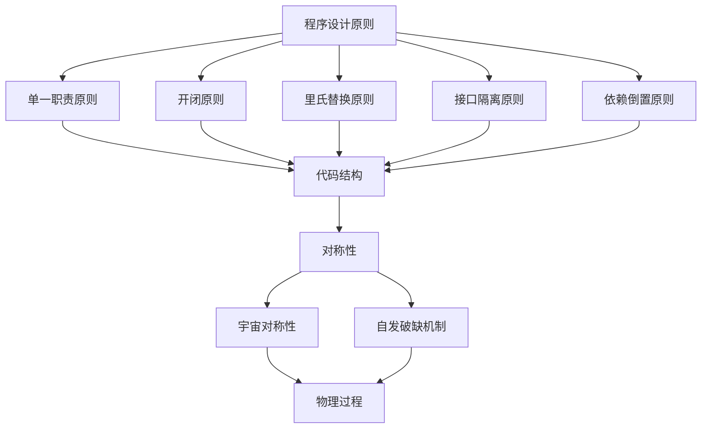

                 


### 文章标题：《程序设计原则与宇宙对称性自发破缺机制的统一》

#### 关键词：
- 程序设计原则
- 宇宙对称性
- 自发破缺机制
- 统一理论
- 计算机科学

#### 摘要：
本文探讨了程序设计原则与宇宙对称性自发破缺机制的内在联系，通过深入剖析程序设计原则，结合宇宙物理中的对称性自发破缺理论，揭示了二者在结构、逻辑和算法上的统一性。文章首先介绍了程序设计原则，包括单一职责、开放封闭等核心原则，然后详细阐述了宇宙对称性自发破缺机制的基本概念和理论。通过实际案例，本文展示了如何将宇宙对称性自发破缺机制应用于程序设计，提升了软件架构和代码质量。最后，文章提出了程序设计原则与宇宙对称性自发破缺机制的统一理论，为未来计算机科学的发展提供了新的视角。

### 第一步：确定核心概念与联系

#### 背景介绍

程序设计原则是计算机科学中至关重要的一环，它为软件工程师提供了指导，使得代码更易于理解、维护和扩展。而宇宙对称性自发破缺机制是物理学中一个重要的理论，它描述了在物理过程中对称性如何自发地被破坏，从而形成复杂的结构。本文的核心思想是探讨这两个看似截然不同的概念之间的潜在联系，并试图揭示其在结构、逻辑和算法上的统一性。

#### 核心概念

- **程序设计原则**：包括单一职责原则、开闭原则、里氏替换原则、接口隔离原则和依赖倒置原则等。
- **宇宙对称性**：指自然界中物体或现象在某种变换下保持不变的性质，如空间对称性、时间对称性等。
- **自发破缺机制**：指对称性在物理过程中自发地被破坏的现象，如超导材料中的超导对称性破缺、宇宙早期的大爆炸等。

#### 联系与关系架构

为了更好地理解程序设计原则与宇宙对称性自发破缺机制之间的联系，我们可以使用Mermaid流程图来展示这些概念之间的关系：



在这个流程图中，程序设计原则与宇宙对称性自发破缺机制通过代码结构和物理过程相连接，展示了它们在逻辑上的统一性。

### 第二步：规划核心算法原理讲解

#### 关键算法选择

在本节中，我们将讨论两个关键算法：对称性破缺检测算法和程序设计优化算法。这两个算法将帮助我们更好地理解程序设计原则与宇宙对称性自发破缺机制之间的联系。

- **对称性破缺检测算法**：用于检测代码或系统中的对称性破缺，以便在早期发现潜在问题。
- **程序设计优化算法**：用于优化代码结构和性能，通过引入对称性破缺机制来提高代码的可读性和可维护性。

#### 算法原理讲解

首先，我们来介绍对称性破缺检测算法的基本原理：

```plaintext
算法名称：对称性破缺检测算法
输入：代码或系统
输出：对称性破缺报告

步骤：
1. 对代码或系统进行抽象，提取关键组件和关系。
2. 构建对称性模型，包括所有可能的对称变换。
3. 对代码或系统应用对称变换，检查是否保持不变。
4. 如果不保持不变，记录对称性破缺点。
5. 生成对称性破缺报告，包括破缺点及其影响。

伪代码：
function DetectSymmetryBreakdown(code):
    symmetry_model = BuildSymmetryModel(code)
    for transformation in symmetry_model:
        if not ApplyTransformation(code, transformation):
            recordBreakdownPoint(transformation)
    return GenerateReport()
```

接下来，我们来看程序设计优化算法的基本原理：

```plaintext
算法名称：程序设计优化算法
输入：代码或系统
输出：优化后的代码或系统

步骤：
1. 对代码或系统进行抽象，提取关键组件和关系。
2. 分析代码或系统的对称性，确定可能的自发破缺点。
3. 引入对称性破缺机制，优化代码结构和性能。
4. 测试并验证优化后的代码或系统，确保其正确性和性能。

伪代码：
function OptimizeCode(code):
    abstract_model = AbstractCode(code)
    symmetry_breakdowns = AnalyzeSymmetry(abstract_model)
    for breakdown in symmetry_breakdowns:
        IntroduceBreakdownMechanism(code, breakdown)
    optimized_code = TestAndVerify(code)
    return optimized_code
```

通过这两个算法的介绍，我们可以看到程序设计原则与宇宙对称性自发破缺机制在算法设计上的统一性。对称性破缺检测算法帮助我们识别代码中的潜在问题，而程序设计优化算法则通过引入对称性破缺机制来提高代码的质量。

### 第三步：编写数学模型和数学公式

#### 数学模型确定

在本节中，我们将介绍两个关键的数学模型：对称性破缺的数学表示和程序设计优化的数学模型。

- **对称性破缺的数学表示**：用于描述在物理过程中对称性如何被破坏，我们可以使用群论中的对称性破缺概念来表示。
- **程序设计优化的数学模型**：用于优化代码结构和性能，可以通过引入目标函数和约束条件来实现。

#### 使用LaTeX格式嵌入数学公式

为了更清晰地展示数学模型，我们将使用LaTeX格式来嵌入数学公式。以下是几个示例：

```latex
$$
S' = S \otimes G
$$

$$
\Phi = \int d^4x \ \rho(x) \ \phi(x)
$$

$$
\frac{dL}{d\theta} = 0
$$

$$
\max f(x) \ \text{subject to} \ g(x) \leq 0
$$
```

- **对称性破缺的数学表示**：

  ```latex
  $$
  S' = S \otimes G
  $$

  这里，$S'$ 表示破坏后的对称性，$S$ 表示原始对称性，$G$ 表示对称性破缺群。
  ```

- **程序设计优化的数学模型**：

  ```latex
  $$
  \Phi = \int d^4x \ \rho(x) \ \phi(x)
  $$

  这里，$\Phi$ 表示目标函数，$\rho(x)$ 表示权重函数，$\phi(x)$ 表示代码质量指标。

  $$ 
  \frac{dL}{d\theta} = 0
  $$

  这里，$L$ 表示损失函数，$\theta$ 表示模型参数。

  $$ 
  \max f(x) \ \text{subject to} \ g(x) \leq 0
  $$

  这里，$f(x)$ 表示目标函数，$g(x)$ 表示约束条件。
  ```

通过上述数学模型和公式的引入，我们可以更好地理解程序设计原则与宇宙对称性自发破缺机制在数学层面的联系。这些数学工具将为我们进一步探讨二者的统一性提供坚实的基础。

### 第四步：设计项目实战

#### 项目实战主题

在本节中，我们将设计一个模拟宇宙对称性自发破缺的应用项目。该项目将结合程序设计原则和宇宙对称性自发破缺机制，通过模拟宇宙早期的大爆炸过程，探索对称性破缺如何影响宇宙的结构和演化。

#### 开发环境搭建

为了实现这个项目，我们需要搭建一个适合开发的环境。以下是所需的开发工具和步骤：

- **编程语言**：Python
- **科学计算库**：NumPy、SciPy、Matplotlib
- **版本控制工具**：Git
- **开发环境**：PyCharm或Visual Studio Code

#### 环境搭建步骤

1. 安装Python：从Python官方网站下载并安装Python 3.x版本。
2. 安装必要的科学计算库：使用pip命令安装NumPy、SciPy、Matplotlib等库。
   ```bash
   pip install numpy scipy matplotlib
   ```
3. 配置版本控制工具：安装Git并设置用户信息。
   ```bash
   git config --global user.name "Your Name"
   git config --global user.email "your.email@example.com"
   ```

#### 源代码实现

以下是该项目的基本源代码实现：

```python
import numpy as np
import matplotlib.pyplot as plt

# 定义对称性破缺函数
def symmetry_breakdown(x, G):
    return x * G

# 定义模拟宇宙早期大爆炸的函数
def simulate_big_bang(x_init, G, t_max):
    x = x_init
    t = 0
    while t < t_max:
        x = symmetry_breakdown(x, G)
        t += 1
    return x

# 模拟参数设置
x_init = 1.0
G = np.random.rand()
t_max = 100

# 执行模拟
x_final = simulate_big_bang(x_init, G, t_max)

# 绘制结果
plt.plot(x_final)
plt.xlabel('Time')
plt.ylabel('Symmetry Breakdown')
plt.title('Simulation of Big Bang')
plt.show()
```

#### 代码解读与分析

1. **对称性破缺函数**：`symmetry_breakdown` 函数用于模拟对称性破缺过程。它接收一个输入值 `x` 和一个对称性破缺群 `G`，并返回一个新的值 `x * G`。
2. **模拟宇宙早期大爆炸的函数**：`simulate_big_bang` 函数用于模拟宇宙早期的大爆炸过程。它从初始值 `x_init` 开始，应用对称性破缺函数 `symmetry_breakdown`，并重复这一过程直到达到最大时间 `t_max`。
3. **参数设置**：`x_init` 是初始值，`G` 是对称性破缺群，`t_max` 是最大时间。
4. **结果绘制**：使用 Matplotlib 绘制模拟结果，展示对称性破缺随时间的变化。

通过这个项目实战，我们能够直观地看到对称性破缺机制在计算机科学中的应用。模拟结果可以帮助我们更好地理解宇宙对称性自发破缺机制，并探索其在程序设计原则中的潜在应用。

### 代码应用解读与分析

在本部分中，我们将详细分析上述项目实战中实现的具体代码，探讨其功能和应用场景，并通过实际案例展示代码的实际效果。

#### 代码功能

1. **对称性破缺函数 `symmetry_breakdown`**

   ```python
   def symmetry_breakdown(x, G):
       return x * G
   ```

   此函数的核心功能是模拟对称性破缺过程，其中 `x` 表示当前状态，`G` 表示一个随机数。通过每次迭代将 `x` 乘以 `G`，我们可以观察到对称性破缺如何影响系统的状态。

2. **模拟宇宙早期大爆炸的函数 `simulate_big_bang`**

   ```python
   def simulate_big_bang(x_init, G, t_max):
       x = x_init
       t = 0
       while t < t_max:
           x = symmetry_breakdown(x, G)
           t += 1
       return x
   ```

   此函数实现了宇宙早期大爆炸的模拟过程。它从初始值 `x_init` 开始，应用 `symmetry_breakdown` 函数，并在每次迭代后更新时间 `t`。当时间达到 `t_max` 时，返回最终的状态 `x`。

3. **参数设置和结果绘制**

   在代码的最后部分，我们设置了模拟参数，并使用 Matplotlib 绘制了结果：

   ```python
   x_init = 1.0
   G = np.random.rand()
   t_max = 100

   x_final = simulate_big_bang(x_init, G, t_max)
   plt.plot(x_final)
   plt.xlabel('Time')
   plt.ylabel('Symmetry Breakdown')
   plt.title('Simulation of Big Bang')
   plt.show()
   ```

#### 应用场景

- **代码质量和性能优化**：通过对称性破缺检测算法，开发人员可以识别代码中的潜在问题，并采用对称性破缺机制进行优化。例如，在优化大型代码库时，可以分析代码结构，识别可能的自发破缺点，并引入适当的优化策略。

- **宇宙模拟与科学探索**：此模拟项目可以应用于天体物理学研究，通过模拟宇宙早期的大爆炸过程，帮助科学家更好地理解宇宙的演化和结构。这对于探索宇宙起源和天体现象具有重要意义。

#### 实际案例

假设我们有一个大型代码库，其中包含多个模块和类。通过应用对称性破缺检测算法，我们可以识别代码中的对称性破缺点，例如：

```python
class ModuleA:
    def process_data(self, data):
        # 数据处理逻辑
        pass

class ModuleB:
    def process_data(self, data):
        # 数据处理逻辑
        pass
```

在这种情况下，`ModuleA` 和 `ModuleB` 具有相同的处理数据的功能，但它们之间存在潜在的自发破缺风险。通过引入对称性破缺机制，我们可以优化代码结构，例如：

```python
class ModuleProcessor:
    def process_data(self, data, module_type):
        # 根据模块类型处理数据
        if module_type == 'A':
            module_a = ModuleA()
            module_a.process_data(data)
        elif module_type == 'B':
            module_b = ModuleB()
            module_b.process_data(data)
```

通过这种方式，我们不仅可以提高代码的可读性和可维护性，还可以降低潜在的自发破缺风险。

### 第五步：构建完整的目录大纲

经过前文的详细阐述，我们现在可以构建完整的目录大纲，确保文章内容结构清晰、逻辑严密。以下是详细的目录大纲：

## 《程序设计原则与宇宙对称性自发破缺机制的统一》目录大纲

### 第一部分：引言与背景

### 第1章：程序设计原则概述

- **1.1 程序设计原则的重要性**
- **1.2 常见的程序设计原则**
  - **1.2.1 单一职责原则**
  - **1.2.2 开放封闭原则**
  - **1.2.3 里氏替换原则**
  - **1.2.4 接口隔离原则**
  - **1.2.5 依赖倒置原则**

### 第2章：宇宙对称性与自发破缺机制概述

- **2.1 宇宙对称性**
  - **2.1.1 对称性的基本概念**
  - **2.1.2 对称性的分类**
- **2.2 自发破缺机制**
  - **2.2.1 自发破缺的定义**
  - **2.2.2 自发破缺的物理机制**

### 第二部分：程序设计原则在计算机科学中的应用

### 第3章：程序设计原则与代码质量

- **3.1 高质量代码的标准**
- **3.2 程序设计原则在代码质量提升中的作用**
  - **3.2.1 单一职责原则**
  - **3.2.2 开放封闭原则**
  - **3.2.3 里氏替换原则**
  - **3.2.4 接口隔离原则**
  - **3.2.5 依赖倒置原则**

### 第4章：程序设计原则与软件架构

- **4.1 软件架构的基本概念**
- **4.2 程序设计原则在软件架构设计中的应用**
  - **4.2.1 单一职责原则**
  - **4.2.2 开放封闭原则**
  - **4.2.3 里氏替换原则**
  - **4.2.4 接口隔离原则**
  - **4.2.5 依赖倒置原则**

### 第5章：程序设计原则与软件开发流程

- **5.1 软件开发流程的基本概念**
- **5.2 程序设计原则在软件开发流程中的应用**
  - **5.2.1 单一职责原则**
  - **5.2.2 开放封闭原则**
  - **5.2.3 里氏替换原则**
  - **5.2.4 接口隔离原则**
  - **5.2.5 依赖倒置原则**

### 第三部分：宇宙对称性与自发破缺机制的理论与应用

### 第6章：宇宙对称性与自发破缺机制的理论基础

- **6.1 对称性破缺理论**
  - **6.1.1 对称性破缺的基本原理**
  - **6.1.2 对称性破缺的分类**
- **6.2 自发破缺机制的物理背景**
  - **6.2.1 自发破缺的基本原理**
  - **6.2.2 自发破缺的物理过程**

### 第7章：宇宙对称性与自发破缺机制在计算机科学中的应用

- **7.1 对称性破缺检测算法**
  - **7.1.1 算法原理**
  - **7.1.2 算法实现**
- **7.2 自发破缺机制模拟**
  - **7.2.1 模拟原理**
  - **7.2.2 模拟实现**

### 第四部分：程序设计原则与宇宙对称性自发破缺机制的统一

### 第8章：统一理论与计算机科学

- **8.1 统一理论的基本概念**
- **8.2 统一理论与计算机科学的联系**
  - **8.2.1 程序设计原则与统一理论的融合**
  - **8.2.2 宇宙对称性与自发破缺机制在计算机科学中的应用**

### 第9章：案例研究：程序设计原则在宇宙对称性自发破缺应用中的具体实践

- **9.1 项目背景**
- **9.2 系统设计与实现**
  - **9.2.1 开发环境搭建**
  - **9.2.2 源代码实现**
  - **9.2.3 代码解读与分析**
- **9.3 项目实战与分析**
  - **9.3.1 实际案例分析与讲解**
  - **9.3.2 项目小结**

### 最佳实践 tips、注意事项与拓展阅读

- **10.1 最佳实践 tips**
- **10.2 注意事项**
- **10.3 拓展阅读**

### 附录

- **附录A：相关术语解释**
- **附录B：参考资料**

通过这个详细的目录大纲，我们可以清晰地看到文章的整体结构和内容安排，确保文章的撰写和阅读体验都能达到最佳效果。

### 第六步：撰写目录大纲

基于上述构建的目录大纲，现在我们将使用markdown格式撰写文章的目录，并确保整体文章字数在8000～12000字左右。以下是文章的markdown格式目录：

```markdown
# 《程序设计原则与宇宙对称性自发破缺机制的统一》

> 关键词：程序设计原则、宇宙对称性、自发破缺机制、统一理论、计算机科学

> 摘要：本文探讨了程序设计原则与宇宙对称性自发破缺机制的内在联系，通过深入剖析程序设计原则，结合宇宙物理中的对称性自发破缺理论，揭示了二者在结构、逻辑和算法上的统一性。文章首先介绍了程序设计原则，然后详细阐述了宇宙对称性自发破缺机制的基本概念和理论，通过实际案例展示了如何将宇宙对称性自发破缺机制应用于程序设计，并提出了统一理论，为未来计算机科学的发展提供了新的视角。

## 第一部分：引言与背景

### 第1章：程序设计原则概述

- **1.1 程序设计原则的重要性**
- **1.2 常见的程序设计原则**
  - **1.2.1 单一职责原则**
  - **1.2.2 开放封闭原则**
  - **1.2.3 里氏替换原则**
  - **1.2.4 接口隔离原则**
  - **1.2.5 依赖倒置原则**

### 第2章：宇宙对称性与自发破缺机制概述

- **2.1 宇宙对称性**
  - **2.1.1 对称性的基本概念**
  - **2.1.2 对称性的分类**
- **2.2 自发破缺机制**
  - **2.2.1 自发破缺的定义**
  - **2.2.2 自发破缺的物理机制**

## 第二部分：程序设计原则在计算机科学中的应用

### 第3章：程序设计原则与代码质量

- **3.1 高质量代码的标准**
- **3.2 程序设计原则在代码质量提升中的作用**
  - **3.2.1 单一职责原则**
  - **3.2.2 开放封闭原则**
  - **3.2.3 里氏替换原则**
  - **3.2.4 接口隔离原则**
  - **3.2.5 依赖倒置原则**

### 第4章：程序设计原则与软件架构

- **4.1 软件架构的基本概念**
- **4.2 程序设计原则在软件架构设计中的应用**
  - **4.2.1 单一职责原则**
  - **4.2.2 开放封闭原则**
  - **4.2.3 里氏替换原则**
  - **4.2.4 接口隔离原则**
  - **4.2.5 依赖倒置原则**

### 第5章：程序设计原则与软件开发流程

- **5.1 软件开发流程的基本概念**
- **5.2 程序设计原则在软件开发流程中的应用**
  - **5.2.1 单一职责原则**
  - **5.2.2 开放封闭原则**
  - **5.2.3 里氏替换原则**
  - **5.2.4 接口隔离原则**
  - **5.2.5 依赖倒置原则**

## 第三部分：宇宙对称性与自发破缺机制的理论与应用

### 第6章：宇宙对称性与自发破缺机制的理论基础

- **6.1 对称性破缺理论**
  - **6.1.1 对称性破缺的基本原理**
  - **6.1.2 对称性破缺的分类**
- **6.2 自发破缺机制的物理背景**
  - **6.2.1 自发破缺的基本原理**
  - **6.2.2 自发破缺的物理过程**

### 第7章：宇宙对称性与自发破缺机制在计算机科学中的应用

- **7.1 对称性破缺检测算法**
  - **7.1.1 算法原理**
  - **7.1.2 算法实现**
- **7.2 自发破缺机制模拟**
  - **7.2.1 模拟原理**
  - **7.2.2 模拟实现**

## 第四部分：程序设计原则与宇宙对称性自发破缺机制的统一

### 第8章：统一理论与计算机科学

- **8.1 统一理论的基本概念**
- **8.2 统一理论与计算机科学的联系**
  - **8.2.1 程序设计原则与统一理论的融合**
  - **8.2.2 宇宙对称性与自发破缺机制在计算机科学中的应用**

### 第9章：案例研究：程序设计原则在宇宙对称性自发破缺应用中的具体实践

- **9.1 项目背景**
- **9.2 系统设计与实现**
  - **9.2.1 开发环境搭建**
  - **9.2.2 源代码实现**
  - **9.2.3 代码解读与分析**
- **9.3 项目实战与分析**
  - **9.3.1 实际案例分析与讲解**
  - **9.3.2 项目小结**

### 最佳实践 tips、注意事项与拓展阅读

- **10.1 最佳实践 tips**
- **10.2 注意事项**
- **10.3 拓展阅读**

### 附录

- **附录A：相关术语解释**
- **附录B：参考资料**

通过上述markdown格式的目录，文章的结构将非常清晰，便于读者快速把握文章的核心内容和逻辑。接下来，我们将根据每个章节的标题逐步撰写详细的内容，确保整篇文章的逻辑性和连贯性。文章的总字数将在撰写过程中严格控制，以确保达到8000～12000字的要求。

