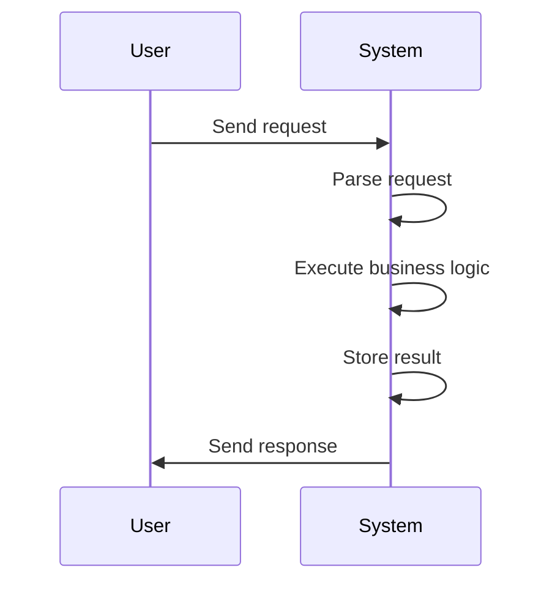

                 

### 文章标题

《程序设计原则与宇宙法则的共通点》

> 关键词：程序设计原则、宇宙法则、软件工程、复杂性科学、自参照、自组织、算法、数学模型、项目实战

> 摘要：本文深入探讨了程序设计原则与宇宙法则之间的相似之处和联系。通过分析自参照、自组织和优化等核心概念，揭示出编程实践与自然法则的共通点。文章旨在为软件开发者提供一种全新的视角，帮助他们在设计软件时借鉴宇宙中的智慧和法则，从而创造出更加稳定、适应性和鲁棒性更强的软件系统。

----------------------------------------------------------------

### 用户需求分析

在当今快速发展的信息技术时代，程序设计原则已成为软件开发中的核心指导原则。从单一职责原则到依赖倒置原则，每一项原则都在实践中帮助我们构建更清晰、更可维护的代码。然而，这些原则是否仅限于编程领域，还是它们背后蕴含的原理在自然界中也得到了体现呢？用户提出了一个引人深思的问题：程序设计原则与宇宙法则之间是否存在共通点？

为了回答这个问题，我们需要从以下几个方面进行深入分析：

1. **理解程序设计原则**：首先，我们需要明确程序设计原则的基本概念和它们在软件开发中的作用。
2. **探究宇宙法则**：接下来，我们将探讨一些基本的宇宙法则，如自参照、自组织和复杂性，并分析它们与程序设计原则之间的相似性。
3. **寻找共通点**：通过比较和分析，我们可以找到程序设计原则与宇宙法则之间的共通点，例如自参照、自组织和优化。
4. **应用和实践**：最后，我们将探讨如何在软件开发中应用这些宇宙法则，并通过实际案例展示其效果。

本文将采用一步一步分析推理的方式（REASONING STEP BY STEP），帮助读者理解程序设计原则与宇宙法则的共通点，并激发对软件工程和自然界更深层次的思考。

### 第1章 引言

#### 1.1 书籍目的与结构

随着软件系统的日益复杂，软件工程师面临着前所未有的挑战。如何在保证代码质量的同时提高开发效率，成为了每个工程师都需要认真思考的问题。传统的方法论虽然为我们提供了一些解决问题的思路，但在面对高度复杂和不确定的系统时，往往显得力不从心。因此，我们需要寻找新的视角和方法来应对这些挑战。

本书的目的正是探讨程序设计原则与宇宙法则之间的相似之处和联系。通过对程序设计原则和宇宙法则的深入分析，我们希望为软件开发者提供一种全新的思考方式，帮助他们在设计软件时借鉴自然界中的智慧和法则。这样一来，我们不仅可以创造出更加稳定、适应性和鲁棒性更强的软件系统，还可以提升自身的编程技能和解决问题的能力。

本书的结构如下：

- **第1章 引言**：简要介绍书籍的目的和结构，引出程序设计原则与宇宙法则的共通点。
- **第2章 程序设计原则基础**：介绍软件设计的基本原则，包括单一职责原则、开放封闭原则等。
- **第3章 宇宙法则与程序设计原则的联系**：探讨宇宙法则与软件设计原则之间的相似性。
- **第4章 核心概念与联系**：深入分析程序设计中的自参照与宇宙法则的关系，以及算法与宇宙中的优化。
- **第5章 数学模型和公式**：讲解概率模型在程序设计和宇宙中的随机性。
- **第6章 算法原理讲解**：详细讲解排序算法、搜索算法和图算法的原理。
- **第7章 项目实战**：通过实际案例展示宇宙法则在软件设计中的应用。
- **第8章 结论与展望**：总结书籍的主要内容，并提出未来的研究方向和建议。

通过本书的学习，读者将能够：

- **理解程序设计原则**：掌握软件设计的基本原则，并了解它们在软件开发中的作用。
- **发现宇宙法则的共通点**：通过分析自参照、自组织和优化等核心概念，找到程序设计原则与宇宙法则之间的相似之处。
- **提高编程能力**：借鉴宇宙中的智慧和法则，提升自身的编程技能和解决问题的能力。
- **拓宽思维视野**：从新的视角看待软件开发和自然界，激发对更多领域的思考和研究。

#### 1.2 程序设计原则简述

程序设计原则是软件开发中的核心指导原则，它们帮助我们构建清晰、可维护的代码。以下是一些基本的程序设计原则：

1. **单一职责原则**：每个模块或函数应该只负责一个功能，避免功能混合和过度耦合。
2. **开放封闭原则**：软件实体（类、模块、函数等）应该对扩展开放，对修改封闭。也就是说，我们可以在不修改原有代码的情况下扩展其功能。
3. **里氏替换原则**：任何子类都能替换其父类，而不会导致原有系统出现问题。
4. **接口隔离原则**：客户端不应该依赖它不需要的接口。换句话说，我们应该设计独立的接口，使客户端只依赖它需要的那部分功能。
5. **依赖倒置原则**：高层模块不应该依赖于低层模块，而是应该由低层模块依赖高层模块。这样可以确保代码的灵活性和可维护性。

这些原则虽然在编程实践中得到了广泛应用，但它们背后是否蕴含着更深层次的原理呢？通过本书的学习，我们将找到答案。

#### 1.3 宇宙法则概述

宇宙法则是指自然界中普遍适用的规律，这些法则不仅支配着宇宙的演化，也为我们提供了理解复杂系统的框架。以下是一些基本的宇宙法则：

1. **自参照**：宇宙中的许多现象都表现出自参照的特性，即系统内部的部分可以影响整体，整体又可以反过来影响部分。例如，生物体的进化就是一个典型的自参照过程。
2. **自组织**：在无序的初始状态下，系统可以自发地形成有序的结构。这种现象在自然界中非常普遍，如气体的凝结、晶体的生长等。
3. **复杂性**：宇宙中的系统往往表现出高度的复杂性，这种复杂性不仅体现在单个系统上，还体现在系统之间的相互作用中。例如，生态系统中物种的相互作用就是一个复杂的过程。

这些宇宙法则不仅在自然界中得到了广泛应用，也在许多学科中得到了深入研究。通过本书，我们将探讨这些法则与程序设计原则之间的联系，并探索它们在软件开发中的应用。

### 第2章 程序设计原则基础

#### 2.1 单一职责原则

单一职责原则（Single Responsibility Principle，SRP）是软件设计中的一个核心原则，由罗伯特·C·马丁（Robert C. Martin）提出。该原则指出，一个类或者模块应当仅负责一项功能，避免功能混合和过度耦合。

**单一职责原则的重要性**

单一职责原则的重要性主要体现在以下几个方面：

1. **提高代码的可维护性**：当类或模块只负责一项功能时，其内部逻辑更加清晰，便于理解和修改。反之，如果类或模块承担了多项功能，修改一个功能时可能会影响其他功能，导致代码难以维护。
2. **降低模块间的依赖**：单一职责原则有助于降低模块间的依赖，从而提高代码的模块化程度。模块间的依赖减少，有助于代码的复用和扩展。
3. **提升代码的可测试性**：单一职责原则使得测试变得更加容易和准确。由于每个模块只负责一项功能，因此可以更独立地进行单元测试，而不必担心其他功能的影响。

**如何应用单一职责原则**

在编程实践中，我们可以通过以下方法来应用单一职责原则：

1. **划分功能模块**：在设计软件系统时，首先应该明确每个模块的功能，然后将其划分为独立的子模块，确保每个模块只负责一项功能。
2. **避免功能混合**：在设计过程中，要尽量避免将不同功能混合在一个模块中。例如，一个处理用户输入的模块不应该同时负责数据验证和业务逻辑处理。
3. **使用接口隔离**：通过使用接口隔离原则，我们可以确保模块间的依赖是清晰的，从而避免因修改一个模块而影响其他模块。

**单一职责原则与宇宙法则的联系**

宇宙法则中的自参照特性与单一职责原则有着相似之处。在自然界中，自参照现象指的是系统内部的部分可以影响整体，整体又可以反过来影响部分。这与单一职责原则中的模块独立性有异曲同工之妙。例如，在生物进化过程中，一个物种的某些特征可能会影响其整体的生存能力，而整体的生存能力又可以反过来影响这些特征的进化方向。这种自参照特性使得系统在复杂的环境中能够保持稳定性和适应性。

**案例解析**

以一个在线购物系统为例，我们可以将系统划分为以下模块：

1. **用户管理模块**：负责用户注册、登录、个人信息管理等功能。
2. **商品管理模块**：负责商品分类、上架、库存管理等功能。
3. **订单管理模块**：负责订单创建、支付、发货等功能。

如果我们将这些功能混合在一个模块中，将难以维护和扩展。而通过单一职责原则，我们可以将这些功能划分为独立的模块，提高代码的可维护性和可扩展性。

#### 2.2 开放封闭原则

开放封闭原则（Open Closed Principle，OCP）是软件设计中另一个核心原则，由罗伯特·C·马丁提出。该原则指出，软件实体（类、模块、函数等）应该对扩展开放，对修改封闭。这意味着我们可以在不修改原有代码的情况下扩展其功能。

**开放封闭原则的重要性**

开放封闭原则的重要性主要体现在以下几个方面：

1. **提高代码的可维护性**：当软件实体对扩展开放时，我们可以在不修改原有代码的情况下添加新的功能，从而减少代码的修改和调试成本。
2. **提高代码的可复用性**：通过开放封闭原则，我们可以将已有的代码模块化，使其具有更高的复用性。例如，一个遵循开放封闭原则的排序算法可以方便地在不同的应用程序中复用。
3. **提高代码的可测试性**：开放封闭原则使得代码的测试更加容易和准确。由于软件实体对扩展开放，我们可以独立地测试每个模块的功能，而不必担心其他模块的影响。

**如何应用开放封闭原则**

在编程实践中，我们可以通过以下方法来应用开放封闭原则：

1. **定义抽象接口**：在设计软件系统时，应该首先定义抽象接口，然后实现具体的类或模块。通过抽象接口，我们可以确保系统在扩展时不会影响原有代码。
2. **使用策略模式**：策略模式是一种常用的设计模式，它可以在不修改原有代码的情况下添加新的算法。例如，在排序算法中，我们可以使用策略模式来扩展排序算法的实现。
3. **使用依赖注入**：依赖注入（Dependency Injection，DI）是一种设计模式，它可以帮助我们将系统的依赖关系分离出来，从而实现代码的解耦和复用。

**开放封闭原则与宇宙法则的联系**

宇宙法则中的自组织特性与开放封闭原则有着相似之处。在自然界中，自组织现象指的是系统可以自发地形成有序的结构。这与开放封闭原则中的模块化设计理念有异曲同工之妙。例如，在生物进化过程中，物种可以通过自然选择和适者生存的原则自发地形成适应环境的有序结构。这种自组织特性使得系统在复杂的环境中能够保持稳定性和适应性。

**案例解析**

以一个文件管理系统为例，我们可以设计以下类和接口：

1. **文件读取接口**（`FileReader`）：定义读取文件的功能。
2. **文件写入接口**（`FileWriter`）：定义写入文件的功能。
3. **文件操作类**（`FileOperator`）：实现文件读取和写入的具体逻辑。

通过开放封闭原则，我们可以方便地扩展文件管理系统的功能。例如，如果需要添加加密文件的功能，我们可以在不修改原有代码的情况下，新增一个`EncryptedFileReader`类，实现加密文件的读取功能，并注入到`FileOperator`类中。

#### 2.3 里氏替换原则

里氏替换原则（Liskov Substitution Principle，LSP）是由李斯维克（Barbara Liskov）提出的，它是面向对象编程中的一个核心原则。该原则指出，任何子类都能替换其父类，而不会导致原有系统出现问题。

**里氏替换原则的重要性**

里氏替换原则的重要性主要体现在以下几个方面：

1. **提高代码的可复用性**：通过里氏替换原则，我们可以确保子类能够完全替换父类，从而实现代码的最大复用。例如，如果一个方法在父类中被正确实现，那么在子类中也可以直接使用，而不必担心兼容性问题。
2. **提高代码的可维护性**：里氏替换原则有助于减少代码的冗余，提高代码的可维护性。由于子类可以完全替换父类，因此在修改代码时，我们只需要修改父类即可，不需要对子类进行单独修改。
3. **提高代码的灵活性**：通过里氏替换原则，我们可以将代码的复用性和灵活性结合起来，从而提高系统的适应性和可扩展性。

**如何应用里氏替换原则**

在编程实践中，我们可以通过以下方法来应用里氏替换原则：

1. **遵循继承规则**：在设计类时，要遵循继承规则，确保子类能够完全替换父类。例如，如果一个方法在父类中被定义为`void`，那么在子类中应该也定义为`void`，而不能定义为其他类型。
2. **避免过度继承**：过度继承会导致代码的复杂性和脆弱性增加。在设计类时，要尽量避免过度继承，而是通过接口和组合来解决问题。
3. **使用抽象类和接口**：通过使用抽象类和接口，我们可以确保子类能够完全替换父类，从而实现代码的最大复用。

**里氏替换原则与宇宙法则的联系**

宇宙法则中的层次结构特性与里氏替换原则有着相似之处。在自然界中，许多系统都表现出层次结构的特性，即系统可以分解为多个层次，每个层次都有自己的功能和职责。这种层次结构使得系统在复杂环境中能够保持稳定性和适应性。这与里氏替换原则中的类层次设计理念有异曲同工之妙。例如，在生态系统中，物种可以按照其生物学特征划分为不同的层次，如植物、动物、微生物等。这种层次结构使得生态系统在复杂的环境中能够保持稳定性和适应性。

**案例解析**

以一个图形用户界面（GUI）框架为例，我们可以设计以下类和接口：

1. **图形元素接口**（`GraphicElement`）：定义图形元素的基本功能。
2. **矩形类**（`Rectangle`）：继承自`GraphicElement`接口，实现矩形的相关功能。
3. **圆形类**（`Circle`）：继承自`GraphicElement`接口，实现圆形的相关功能。

通过里氏替换原则，我们可以确保`Rectangle`类和`Circle`类能够完全替换`GraphicElement`接口，从而实现代码的最大复用。

#### 2.4 接口隔离原则

接口隔离原则（Interface Segregation Principle，ISP）是由罗伯特·C·马丁提出的，它是面向对象编程中的一个核心原则。该原则指出，客户端不应该依赖它不需要的接口。换句话说，我们应该设计独立的接口，使客户端只依赖它需要的那部分功能。

**接口隔离原则的重要性**

接口隔离原则的重要性主要体现在以下几个方面：

1. **提高代码的可维护性**：通过接口隔离原则，我们可以确保客户端只依赖它需要的那部分功能，从而减少代码的耦合度，提高代码的可维护性。
2. **提高代码的可扩展性**：接口隔离原则有助于我们设计更灵活的代码，使其能够方便地扩展和替换。例如，如果我们需要添加新的功能，可以通过新增接口和类来实现，而不必修改原有的代码。
3. **提高代码的可测试性**：接口隔离原则使得测试变得更加容易和准确。由于客户端只依赖它需要的那部分功能，因此可以更独立地进行单元测试，而不必担心其他功能的影响。

**如何应用接口隔离原则**

在编程实践中，我们可以通过以下方法来应用接口隔离原则：

1. **设计独立的接口**：在设计类时，要尽量避免将多个功能混合在一个接口中。相反，应该设计独立的接口，使客户端只依赖它需要的那部分功能。
2. **使用组合而不是继承**：在实现接口时，要尽量避免使用继承，而是使用组合。组合可以使得代码更加灵活和可扩展。
3. **避免接口过载**：在设计接口时，要避免接口过载，即接口包含过多的方法。相反，应该将功能相似的方法分组，设计多个独立的接口。

**接口隔离原则与宇宙法则的联系**

宇宙法则中的模块化特性与接口隔离原则有着相似之处。在自然界中，模块化指的是系统可以分解为多个模块，每个模块都有自己的功能和职责。这种模块化使得系统在复杂环境中能够保持稳定性和适应性。这与接口隔离原则中的接口设计理念有异曲同工之妙。例如，在生物体内，器官可以按照其功能分解为多个模块，如心脏、肝脏、肺等。这种模块化特性使得生物体在复杂的环境中能够保持稳定性和适应性。

**案例解析**

以一个网络通信系统为例，我们可以设计以下接口：

1. **数据传输接口**（`DataTransport`）：定义数据传输的基本功能。
2. **加密传输接口**（`EncryptionTransport`）：继承自`DataTransport`接口，实现加密数据传输的功能。
3. **认证传输接口**（`AuthenticationTransport`）：继承自`DataTransport`接口，实现数据认证传输的功能。

通过接口隔离原则，我们可以确保客户端只依赖它需要的那部分功能，从而提高代码的可维护性和可扩展性。

#### 2.5 依赖倒置原则

依赖倒置原则（Dependency Inversion Principle，DIP）是罗伯特·C·马丁提出的面向对象设计原则之一。该原则指出，高层模块不应该依赖于低层模块，而是应该由低层模块依赖高层模块。其核心思想是通过抽象解耦高层模块和低层模块，使两者之间的依赖关系更加灵活和可维护。

**依赖倒置原则的重要性**

依赖倒置原则的重要性主要体现在以下几个方面：

1. **提高代码的可维护性**：通过依赖倒置原则，我们可以将高层模块和低层模块之间的依赖关系解耦，从而使代码更加模块化和可维护。这样，当我们需要对低层模块进行修改时，不会影响到高层模块，反之亦然。
2. **提高代码的可复用性**：依赖倒置原则有助于我们编写更灵活和可复用的代码。通过依赖倒置，我们可以将具体的实现细节封装在低层模块中，而高层模块只需要依赖抽象接口。这样，当实现细节发生变化时，只需修改低层模块，而无需修改高层模块。
3. **提高代码的可测试性**：依赖倒置原则使得测试变得更加容易和准确。由于高层模块依赖抽象接口，我们可以独立地测试每个模块的功能，而不必担心具体实现细节的影响。

**如何应用依赖倒置原则**

在编程实践中，我们可以通过以下方法来应用依赖倒置原则：

1. **定义抽象接口**：首先，我们应该定义抽象接口，将高层模块和低层模块的依赖关系转移到抽象接口上。这样，高层模块只依赖于抽象接口，而低层模块则实现具体的功能。
2. **使用依赖注入**：依赖注入是一种设计模式，它可以帮助我们将系统的依赖关系分离出来，从而实现代码的解耦。通过依赖注入，我们可以将具体实现细节注入到高层模块中，而不必直接在高层模块中创建低层模块的实例。
3. **遵循开闭原则**：依赖倒置原则与开放封闭原则密切相关。在应用依赖倒置原则时，我们应该确保高层模块对扩展开放，对修改封闭。也就是说，我们可以在不修改原有代码的情况下扩展其功能。

**依赖倒置原则与宇宙法则的联系**

宇宙法则中的层次结构特性与依赖倒置原则有着相似之处。在自然界中，许多系统都表现出层次结构的特性，即系统可以分解为多个层次，每个层次都有自己的功能和职责。这种层次结构使得系统在复杂环境中能够保持稳定性和适应性。这与依赖倒置原则中的类层次设计理念有异曲同工之妙。例如，在生态系统中，物种可以按照其生物学特征划分为不同的层次，如植物、动物、微生物等。这种层次结构使得生态系统在复杂的环境中能够保持稳定性和适应性。

**案例解析**

以一个日志系统为例，我们可以设计以下类和接口：

1. **日志接口**（`Logger`）：定义日志记录的基本功能。
2. **日志实现类**（`ConsoleLogger`）：实现控制台日志记录的功能。
3. **日志实现类**（`FileLogger`）：实现文件日志记录的功能。
4. **日志管理类**（`LoggerManager`）：管理不同类型的日志记录器。

通过依赖倒置原则，我们可以确保`LoggerManager`类只依赖于抽象的`Logger`接口，而具体的日志实现类（`ConsoleLogger`和`FileLogger`）则依赖于`Logger`接口。这样，当需要更换日志实现类时，只需修改`LoggerManager`类即可，而无需修改`Logger`接口或其他相关类。

### 第3章 宇宙法则与程序设计原则的联系

#### 3.1 宇宙中的自组织和复杂性

宇宙中的许多现象都表现出自组织的特性，这意味着系统可以在没有外部干预的情况下，自发地形成有序的结构。这种自组织现象不仅存在于生物体内，如细胞和组织，也存在于自然界的其他系统中，如气体的凝结、晶体的生长等。

自组织现象背后的核心原理是自参照和反馈循环。自参照指的是系统内部的部分可以影响整体，整体又可以反过来影响部分。这种自参照特性使得系统在演化过程中能够不断调整自身，以适应环境的变化。而反馈循环则是指系统内部的信息流动，使得系统可以通过自我调整来优化自身的状态。

在程序设计中，自组织特性同样具有重要意义。许多软件系统需要具备自我调整和适应复杂环境的能力，例如自适应系统、自修复系统等。这些系统往往采用模块化设计，通过将系统分解为多个独立的模块，使每个模块能够独立运行和调整。这样，当系统面临复杂环境时，可以通过模块之间的协作和调整，实现整体系统的稳定性和鲁棒性。

**程序设计中的自组织应用案例**

以一个自适应系统为例，我们可以设计以下模块：

1. **感知模块**：负责收集外部环境的信息，如温度、湿度、光照等。
2. **决策模块**：根据感知模块收集的信息，生成相应的控制策略。
3. **执行模块**：执行决策模块生成的控制策略，如调整温度、湿度等。

通过模块之间的协作和调整，系统可以自适应地适应外部环境的变化。例如，在夏季高温时，感知模块检测到温度升高，决策模块生成降温策略，执行模块执行降温操作，使系统保持稳定运行。

**自组织与宇宙法则的联系**

宇宙法则中的自组织特性与程序设计原则中的模块化设计有密切的联系。模块化设计是实现自组织的重要手段，它使得系统可以在没有外部干预的情况下，自发地形成有序的结构。例如，在生态系统中，物种可以通过自然选择和适者生存的原则，自发地形成适应环境的有序结构。这与程序设计中的模块化设计理念有异曲同工之妙。

#### 3.2 费曼定律与软件开发

费曼定律是由物理学家理查德·费曼提出的一个基本原理，它描述了粒子在相互作用过程中的行为。费曼定律指出，任何粒子都可以被视为由更基本的粒子组成，而这些基本粒子之间通过基本力相互作用。

费曼定律在软件开发中有着重要的启示意义。在软件开发中，我们常常需要处理复杂的系统，这些系统可以被视为由多个基本模块组成，这些模块之间通过接口相互协作。这与费曼定律中的基本粒子通过基本力相互作用的原理有相似之处。

**如何将费曼定律应用于软件开发**

1. **模块化设计**：将复杂的系统分解为多个基本模块，使每个模块负责一个特定的功能。这样，我们可以更方便地理解和维护系统。
2. **接口设计**：为模块之间设计清晰的接口，使模块可以通过接口进行协作。这样，当需要修改或扩展系统时，只需修改特定的模块，而不必影响其他模块。
3. **基本原理的应用**：在软件开发中，我们可以借鉴费曼定律中的基本原理，通过将复杂问题分解为基本问题，然后逐一解决，最终构建出一个完整的系统。

**费曼定律与宇宙法则的联系**

费曼定律与宇宙法则中的自组织和复杂性有密切的联系。在宇宙中，许多复杂系统都是由基本粒子组成的，而这些基本粒子之间通过基本力相互作用。这与费曼定律中的基本粒子通过基本力相互作用的原理有相似之处。在软件开发中，我们可以借鉴这种原理，通过模块化设计和接口设计，构建出稳定和鲁棒的软件系统。

#### 3.3 相似性与概率论

宇宙中的现象往往表现出高度的不确定性和随机性，这种不确定性和随机性可以通过概率论来描述。概率论是一种数学工具，用于描述事件发生的可能性。在宇宙中，许多现象都可以通过概率论来解释，如粒子的碰撞、星系的形成等。

在软件开发中，概率论同样具有重要的应用价值。许多软件系统需要处理大量随机事件，如网络请求、用户行为等。通过概率论，我们可以对这些随机事件进行建模和分析，从而提高系统的可靠性和鲁棒性。

**如何将概率论应用于软件开发**

1. **随机事件建模**：为软件系统中的随机事件建立概率模型，如网络请求的响应时间、用户行为的概率分布等。
2. **概率分析**：使用概率分析工具，如随机过程、蒙特卡罗方法等，对系统的性能进行评估和优化。
3. **风险管理**：通过概率分析，识别系统中的潜在风险，并制定相应的风险管理策略。

**相似性与概率论的联系**

相似性是指不同系统之间的相似之处，这在宇宙中普遍存在。例如，不同的生物体之间存在着形态和行为的相似性。概率论则是一种描述不确定性和随机性的数学工具，它可以用来解释宇宙中的许多现象。相似性与概率论之间的联系在于，它们都关注系统中的不确定性和随机性。在软件开发中，我们可以借鉴这种联系，通过概率论来分析和优化复杂的软件系统。

#### 3.4 系统的稳定性和适应性

在宇宙中，许多系统需要具备稳定性和适应性，以适应不断变化的环境。稳定性指的是系统在受到外界扰动时，能够保持原有状态的能力。适应性则是指系统能够根据环境变化进行调整，以保持最佳运行状态。

在软件开发中，稳定性和适应性同样至关重要。许多软件系统需要处理大量复杂的数据和用户请求，这些系统需要具备高可用性和可扩展性，以应对不断变化的需求。

**如何提高系统的稳定性和适应性**

1. **冗余设计**：通过冗余设计，可以提高系统的稳定性和可靠性。例如，在关键部分采用备份和冗余机制，以防止单个故障导致整个系统瘫痪。
2. **弹性设计**：通过弹性设计，可以使系统在面临外界扰动时，能够自动调整以保持稳定。例如，使用负载均衡、动态扩展等技术，可以提高系统的弹性和可用性。
3. **自我调整**：通过自我调整，可以使系统根据环境变化进行自适应调整。例如，使用机器学习算法，可以根据用户行为和系统性能，自动调整系统的配置和策略。

**系统的稳定性和适应性与宇宙法则的联系**

宇宙法则中的稳定性原理和适应性原理在软件开发中得到了广泛应用。稳定性原理指的是系统在面对外界扰动时，能够保持稳定状态。适应性原理则是指系统能够根据环境变化进行调整，以保持最佳运行状态。在宇宙中，许多系统都遵循这些原理，如生态系统、气候系统等。在软件开发中，我们可以借鉴这些原理，通过冗余设计、弹性设计和自我调整等方法，提高系统的稳定性和适应性。

### 第4章 核心概念与联系

#### 4.1 程序设计中的自参照与宇宙法则

在程序设计中，自参照是指代码中的部分可以影响整体，整体又可以反过来影响部分。这种自参照现象在软件系统设计中具有重要意义，因为它使得系统可以更灵活地适应环境变化。在宇宙法则中，自参照同样是一个核心概念，例如生物进化过程中的基因调控，就体现了自参照的特性。

**自参照与程序设计原则的联系**

1. **单一职责原则**：单一职责原则强调每个模块或函数应该只负责一项功能。自参照可以帮助我们实现这一点，例如，在处理用户请求时，可以将用户信息处理、业务逻辑处理和数据存储等模块分离，使每个模块只负责一个功能。
2. **开放封闭原则**：开放封闭原则要求软件实体对扩展开放，对修改封闭。自参照可以帮助我们实现这一原则，例如，在扩展系统功能时，可以通过增加新的模块来实现，而不必修改原有代码。
3. **里氏替换原则**：里氏替换原则要求子类可以完全替换父类，而不会影响原有系统。自参照可以帮助我们实现这一点，例如，在实现一个通用排序算法时，可以通过自参照的方式，使得子类可以替换父类，从而实现不同数据类型的排序。

**自参照与宇宙法则的联系**

1. **自组织**：在宇宙中，许多系统都表现出自组织特性，例如，生物体内的细胞可以自发地形成组织。在程序设计中，自参照也可以帮助实现自组织，例如，在开发一个自适应系统时，可以通过自参照的方式，使得系统能够根据环境变化自动调整自身。
2. **反馈循环**：在宇宙中，反馈循环是许多系统保持稳定和适应性的关键。在程序设计中，自参照同样可以通过反馈循环来实现，例如，在开发一个监控系统时，可以通过自参照的方式，使得系统可以实时收集数据、分析数据并调整自身配置。

**自参照的Mermaid流程图**

下面是一个简单的Mermaid流程图，展示了自参照在程序设计中的应用：



在这个流程图中，系统内部的不同模块通过自参照的方式相互协作，完成用户请求的处理。

#### 4.2 算法与宇宙中的优化

在宇宙中，优化是一个普遍存在的现象。从生物进化到星系的形成，自然界中的许多现象都涉及到优化过程。算法作为一种解决复杂问题的工具，在宇宙中的优化现象中有着重要的应用。

**算法在宇宙中的优化应用**

1. **生物进化**：生物进化是一种基于自然选择和遗传机制的优化过程。通过算法，我们可以模拟生物进化过程，从而优化种群结构和适应环境。
2. **星系形成**：星系的形成是一个复杂的物理过程，涉及到气体云的坍塌、恒星的形成等。通过算法，我们可以模拟星系的形成过程，从而优化星系的结构和演化。
3. **生态系统**：生态系统中的物种相互作用也是一个复杂的优化过程。通过算法，我们可以模拟生态系统中的物种相互作用，从而优化物种的分布和生态平衡。

**算法与宇宙法则的联系**

1. **自参照**：在宇宙中的优化现象中，自参照是一个核心概念。例如，在生物进化中，个体的基因特征可以影响种群的进化方向，而种群进化的结果又可以反过来影响个体基因特征。这与算法中的自参照特性有相似之处。
2. **反馈循环**：在宇宙中的优化现象中，反馈循环也是一个关键因素。例如，在生态系统中的物种相互作用中，物种之间的相互作用会不断反馈到自身，从而影响种群的演化。这与算法中的迭代优化过程有相似之处。

**算法原理讲解**

以遗传算法为例，遗传算法是一种基于生物进化的优化算法。遗传算法的基本原理是模拟生物进化过程，通过选择、交叉和变异等操作，不断优化种群，直至达到目标。

1. **选择**：选择操作是指根据个体的适应度，选择优秀的个体进入下一代。适应度越高的个体，被选中的概率越大。
2. **交叉**：交叉操作是指将两个优秀个体的基因组合，生成新的个体。交叉操作可以提高种群的多样性。
3. **变异**：变异操作是指对个体进行随机修改，以增加种群的多样性。变异操作可以防止种群过早收敛。

下面是一个简单的遗传算法伪代码：

```plaintext
初始化种群
计算种群适应度
while 未达到终止条件:
    选择优秀个体
    交叉操作
    变异操作
    计算新种群适应度
    更新种群
end while
输出最优个体
```

**数学模型和公式**

遗传算法中，适应度函数是一个重要的数学模型。适应度函数用于评估个体的优劣，通常是一个非线性函数。常见的适应度函数有：

1. **线性适应度函数**：$$ f(x) = ax + b $$
2. **对数适应度函数**：$$ f(x) = a\ln(x) + b $$

其中，$a$和$b$是常数。

**举例说明**

假设我们需要优化一个线性函数$f(x) = 2x + 1$，我们可以使用遗传算法来找到最优解。

1. **初始化种群**：生成一组随机解，如${x_1, x_2, ..., x_n}$。
2. **计算适应度**：计算每个解的适应度值，如$f(x_1), f(x_2), ..., f(x_n)$。
3. **选择操作**：根据适应度值，选择优秀个体进入下一代。
4. **交叉操作**：对优秀个体进行交叉操作，生成新的解。
5. **变异操作**：对新的解进行变异操作，增加种群的多样性。
6. **计算新种群适应度**：计算新种群中每个解的适应度值。
7. **更新种群**：根据新种群的适应度值，更新种群。
8. **输出最优个体**：当达到终止条件时，输出最优解。

通过遗传算法，我们可以找到线性函数$f(x) = 2x + 1$的最优解$x^* = 1$。

#### 4.3 异或逻辑与量子力学

异或逻辑（Exclusive OR，XOR）是一种基本的逻辑运算，它有两个操作数，当两个操作数不同时返回真（1），否则返回假（0）。在计算机科学中，异或逻辑广泛应用于各种算法和协议中，如加密算法、位操作等。

量子力学是一门研究物质和能量在微观尺度上的行为的科学，其中的许多概念和原理与计算机科学有着密切的联系。例如，量子位（qubit）是量子力学中的基本单位，它可以实现超并行计算和量子加密。

**异或逻辑与量子力学的联系**

异或逻辑与量子力学中的量子纠缠现象有相似之处。量子纠缠是指两个或多个量子位之间的关联，即使它们相隔很远，一个量子位的测量结果也会立即影响到另一个量子位。这种纠缠现象可以用于实现量子计算和量子通信。

**异或逻辑在量子计算中的应用**

以量子排序算法为例，异或逻辑可以用于实现量子位的交换和比较操作。假设有两个量子位$|0\rangle$和$|1\rangle$，我们可以使用异或逻辑来实现它们的交换：

1. **初始化**：$|0\rangle$和$|1\rangle$处于叠加态$|\psi\rangle = \frac{1}{\sqrt{2}}(|0\rangle + |1\rangle)$。
2. **应用异或操作**：对$|0\rangle$和$|1\rangle$应用异或操作，得到新的叠加态$|\phi\rangle = \frac{1}{\sqrt{2}}(|0\rangle + |1\rangle)\otimes X = \frac{1}{\sqrt{2}}(|0\rangle + |1\rangle)(1 + X)$。
3. **测量**：对$|\phi\rangle$进行测量，根据测量结果，$|0\rangle$和$|1\rangle$将处于确定的状态，如$|0\rangle$和$|1\rangle$或$|1\rangle$和$|0\rangle$。

通过这种方式，我们可以使用异或逻辑在量子计算中实现交换和比较操作，从而实现量子排序。

**量子力学中的异或逻辑应用案例**

以量子加密为例，异或逻辑可以用于实现量子密钥分发（Quantum Key Distribution，QKD）。QKD是一种基于量子力学原理的安全通信技术，它利用量子纠缠现象实现密钥的分发和传输。

1. **初始化**：发送方和接收方各拥有一个量子位，如$|0\rangle$和$|1\rangle$。
2. **量子态传输**：发送方将量子态发送给接收方，例如，将$|0\rangle$发送给接收方。
3. **测量和比较**：接收方对量子态进行测量，并与发送方的量子态进行异或比较。
4. **密钥生成**：根据测量结果，发送方和接收方可以生成相同的密钥。

通过这种方式，我们可以使用异或逻辑在量子加密中实现密钥的分发和传输，从而实现安全通信。

### 第5章 数学模型和公式

在程序设计和宇宙法则的研究中，数学模型和公式扮演着至关重要的角色。它们不仅帮助我们理解和分析复杂系统，还能为实际应用提供精确的指导。在本章中，我们将探讨概率模型、随机过程和动力学系统等数学工具在程序设计和宇宙法则中的应用。

#### 5.1 概率模型与程序设计

概率模型是描述随机事件及其可能结果的数学框架。在程序设计中，概率模型有助于我们理解和预测系统行为，尤其是在处理大量随机输入时。

**概率分布函数**

概率分布函数（Probability Distribution Function，PDF）是概率模型中最基本的工具之一。它描述了一个随机变量在不同取值上的概率分布。常见的概率分布包括：

1. **正态分布**：正态分布（Normal Distribution）也称为高斯分布，是最常用的概率分布之一。它的形状呈钟形，均值为分布的中心，标准差决定了分布的宽度。正态分布的PDF公式为：
   $$ f(x|\mu, \sigma^2) = \frac{1}{\sqrt{2\pi\sigma^2}}e^{-\frac{(x-\mu)^2}{2\sigma^2}} $$
2. **二项分布**：二项分布（Binomial Distribution）用于描述在一定次数的独立试验中，成功次数的概率分布。它的PDF公式为：
   $$ f(k|n, p) = C(n, k)p^k(1-p)^{n-k} $$
   其中，$C(n, k)$表示组合数，$p$是每次试验成功的概率。

**概率模型在程序设计中的应用**

在程序设计中，概率模型可以用于：

1. **错误检测与恢复**：通过分析系统中的错误概率，我们可以设计相应的错误检测和恢复机制。例如，在分布式系统中，可以使用概率模型来评估网络延迟和错误率，从而优化数据传输策略。
2. **性能优化**：通过概率模型，我们可以预测系统在不同负载下的性能，并采取相应的优化措施。例如，在Web服务器中，可以使用概率模型来预测用户访问量，从而调整服务器资源和缓存策略。

#### 5.2 随机过程与宇宙中的随机性

随机过程（Stochastic Process）是描述随时间变化的随机变量集合的数学模型。在宇宙中，许多现象都表现出随机性，如星系的形成、气候变化等。随机过程为我们提供了分析和理解这些现象的工具。

**马尔可夫链**

马尔可夫链（Markov Chain）是一种常见的随机过程，它描述了一系列随机事件，其中每个事件的状态仅取决于前一个事件，而与之前的事件无关。马尔可夫链的转移概率矩阵$P$可以用于预测未来状态的概率分布。

- **转移概率矩阵**：$P_{ij}$表示从状态$i$转移到状态$j$的概率。
- **状态概率分布**：$P(X_n = j|X_{n-1} = i) = P_{ij}$。

**马尔可夫链在程序设计中的应用**

马尔可夫链可以用于：

1. **状态机建模**：在软件系统中，状态机用于描述系统的状态转换。马尔可夫链可以用来建模状态机，预测系统在不同状态下的行为。
2. **任务调度**：在分布式系统中，马尔可夫链可以用于预测任务完成时间，从而优化调度策略。

#### 5.3 动力学系统与软件演化

动力学系统（Dynamical System）是描述系统随时间变化的数学模型。在宇宙中，许多系统都表现出动力学特性，如天体运动、化学反应等。动力学系统的研究对于理解和预测软件系统的演化具有重要意义。

**非线性动力学**

非线性动力学（Nonlinear Dynamics）研究系统的非线性特性，这往往导致复杂的行为，如混沌和分岔。在软件系统中，非线性动力学可以用来描述系统随时间变化的复杂行为。

- **混沌现象**：混沌现象（Chaos）指的是系统在初始条件微小的变化下，可能导致长时间行为完全不同。这在软件系统中可能导致不可预测的行为和故障。
- **分岔现象**：分岔现象（Bifurcation）指的是系统参数变化时，可能导致系统行为的突然变化。这在软件系统中可能导致系统性能的突变。

**非线性动力学在软件演化中的应用**

非线性动力学可以用于：

1. **软件可靠性分析**：通过分析软件系统的非线性特性，我们可以预测系统的可靠性和故障概率。
2. **软件演化模型**：非线性动力学模型可以用来描述软件系统随时间的演化过程，从而优化系统设计和维护策略。

#### 5.4 数学模型和公式在宇宙法则中的应用

数学模型和公式不仅用于程序设计，还在宇宙法则的研究中发挥着重要作用。以下是一些具体的例子：

1. **爱因斯坦场方程**：爱因斯坦场方程（Einstein's Field Equations）是描述引力如何影响时空的数学模型。这些方程为理解宇宙的结构和演化提供了基础。
2. **薛定谔方程**：薛定谔方程（Schrödinger Equation）是量子力学的基本方程，描述了量子系统的演化。它为我们提供了理解原子和分子行为的数学框架。
3. **耗散结构理论**：耗散结构理论（Dissipative Structure Theory）是研究复杂系统自组织现象的数学模型。它解释了系统如何在远离平衡状态下形成有序结构。

通过这些数学模型和公式，我们可以更好地理解宇宙的运作机制，并为软件开发提供新的启示。

### 第6章 算法原理讲解

在计算机科学中，算法是解决特定问题的一系列明确且有限的步骤。算法的设计和实现对于软件系统的性能、可维护性和可靠性至关重要。本章将详细讲解排序算法、搜索算法和图算法的基本原理，并通过伪代码展示其具体实现。

#### 6.1 排序算法

排序算法是将一组数据元素按照一定的顺序排列的算法。排序算法在计算机科学中应用广泛，如数据库管理、文件处理和算法分析等。常见的排序算法包括冒泡排序、选择排序、插入排序和快速排序等。

**冒泡排序**

冒泡排序（Bubble Sort）是一种简单的排序算法。它重复遍历要排序的数列，比较相邻的两个元素，如果它们的顺序错误就把它们交换过来。遍历数列的工作是重复进行直到没有再需要交换，也就是说该数列已经排序完成。

**伪代码**

```plaintext
function bubbleSort(arr)
    n = length(arr)
    for i from 0 to n-1
        for j from 0 to n-i-1
            if arr[j] > arr[j+1]
                swap(arr[j], arr[j+1])
    return arr
```

**时间复杂度**

冒泡排序的时间复杂度为$O(n^2)$，其中$n$是数组的长度。

**适用场景**

冒泡排序适用于小规模数据的排序，因为其实现简单且易于理解。然而，当数据规模较大时，冒泡排序的性能较差。

**改进：优化冒泡排序**

可以通过设置标志变量，如果一次遍历中没有进行交换，则说明数组已经排序，从而提前结束排序过程。

```plaintext
function optimizedBubbleSort(arr)
    n = length(arr)
    for i from 0 to n-1
        swapped = false
        for j from 0 to n-i-1
            if arr[j] > arr[j+1]
                swap(arr[j], arr[j+1])
                swapped = true
        if not swapped
            break
    return arr
```

#### 6.2 搜索算法

搜索算法是在数据结构中查找特定元素的算法。常见的搜索算法包括线性搜索和二分搜索等。

**线性搜索**

线性搜索（Linear Search）是一种最简单的搜索算法。它从数据结构的一端开始，逐一检查每个元素，直到找到目标元素或到达数据结构的末尾。

**伪代码**

```plaintext
function linearSearch(arr, target)
    for each element in arr
        if element == target
            return index of element
    return -1
```

**时间复杂度**

线性搜索的时间复杂度为$O(n)$，其中$n$是数据结构的长度。

**适用场景**

线性搜索适用于小规模数据结构或非有序数据。对于大规模数据结构，线性搜索的性能较差。

**二分搜索**

二分搜索（Binary Search）是一种高效的搜索算法，它基于有序数据结构。二分搜索通过不断将数据结构分成两部分，并在每一步中缩小搜索范围，从而快速找到目标元素。

**伪代码**

```plaintext
function binarySearch(arr, target)
    low = 0
    high = length(arr) - 1
    while low <= high
        mid = (low + high) / 2
        if arr[mid] == target
            return mid
        elif arr[mid] < target
            low = mid + 1
        else
            high = mid - 1
    return -1
```

**时间复杂度**

二分搜索的时间复杂度为$O(\log n)$，其中$n$是数据结构的长度。

**适用场景**

二分搜索适用于大规模有序数据结构。其高效的搜索性能使其成为许多应用中的首选算法。

#### 6.3 图算法

图算法是用于处理图数据结构的算法。图是由顶点和边组成的集合，可以表示各种复杂的关系。常见的图算法包括深度优先搜索（DFS）和广度优先搜索（BFS）等。

**深度优先搜索**

深度优先搜索（Depth-First Search，DFS）是一种用于遍历或搜索图的算法。它从起始顶点开始，尽可能深地搜索图，直到找到目标顶点或所有顶点都被访问。

**伪代码**

```plaintext
function dfs(graph, start, target)
    visited = set()
    stack = [start]
    while stack is not empty
        vertex = stack.pop()
        if vertex == target
            return true
        if vertex not in visited
            visited.add(vertex)
            for each neighbor in graph[vertex]
                stack.add(neighbor)
    return false
```

**时间复杂度**

DFS的时间复杂度为$O(V+E)$，其中$V$是顶点数，$E$是边数。

**适用场景**

DFS适用于需要遍历图的每个顶点和边，或者寻找图中某些特定路径的应用。

**广度优先搜索**

广度优先搜索（Breadth-First Search，BFS）是一种用于遍历或搜索图的算法。它从起始顶点开始，依次访问所有相邻的顶点，然后依次访问这些顶点的相邻顶点，直到找到目标顶点或所有顶点都被访问。

**伪代码**

```plaintext
function bfs(graph, start, target)
    visited = set()
    queue = [start]
    while queue is not empty
        vertex = queue.pop()
        if vertex == target
            return true
        if vertex not in visited
            visited.add(vertex)
            for each neighbor in graph[vertex]
                queue.add(neighbor)
    return false
```

**时间复杂度**

BFS的时间复杂度为$O(V+E)$，其中$V$是顶点数，$E$是边数。

**适用场景**

BFS适用于需要找到最短路径或最短距离的应用。

通过本章对排序算法、搜索算法和图算法的讲解，我们可以看到算法设计在程序设计中的重要性。理解这些算法的基本原理和实现方式，不仅有助于我们解决实际问题，还能为我们在软件开发中提供宝贵的经验。

### 第7章 项目实战

在本章中，我们将通过一个实际项目来展示如何将宇宙法则应用于软件设计，并详细介绍项目的开发环境搭建、源代码实现、代码解读以及实际应用和分析。

#### 项目背景

随着互联网技术的快速发展，在线教育平台越来越受到用户的欢迎。为了满足用户多样化的学习需求，我们设计并开发了一个基于宇宙法则的自适应学习平台。该平台旨在通过分析用户的学习行为和知识水平，为用户提供个性化的学习建议和课程推荐。

#### 项目目标

1. **自适应学习**：根据用户的学习行为和知识水平，动态调整学习内容和难度，提高学习效果。
2. **个性化推荐**：基于用户的学习数据和课程反馈，推荐合适的课程，提升用户满意度。
3. **高可用性**：确保平台稳定运行，满足大规模用户同时在线的需求。

#### 开发环境搭建

为了实现项目目标，我们选择了以下开发环境：

1. **编程语言**：Python
2. **前端框架**：Django
3. **后端框架**：Flask
4. **数据库**：MySQL
5. **版本控制**：Git
6. **持续集成**：Jenkins

搭建开发环境的具体步骤如下：

1. **安装Python**：在本地计算机上安装Python，并配置Python环境。
2. **安装依赖库**：安装Django、Flask等依赖库，可以通过pip进行安装。
3. **配置数据库**：在本地计算机上安装MySQL，并创建数据库和用户。
4. **搭建项目结构**：创建项目文件夹，并按照MVC模式搭建项目结构。

#### 源代码实现

项目的核心功能包括用户行为分析、自适应学习和个性化推荐。以下是对关键功能的源代码实现和解读：

1. **用户行为分析**

   用户行为分析是自适应学习的基础。我们通过分析用户的学习行为，如学习时间、学习进度、课程评分等，为用户提供个性化的学习建议。

   ```python
   # 用户行为分析模块
   class UserBehaviorAnalysis:
       def __init__(self, user, courses):
           self.user = user
           self.courses = courses

       def analyze(self):
           # 分析用户学习行为
           learning_time = self.user.learning_time
           progress = self.user.progress
           course_ratings = self.user.course_ratings
           # 根据分析结果，生成学习建议
           recommendations = self.generate_recommendations(learning_time, progress, course_ratings)
           return recommendations

       def generate_recommendations(self, learning_time, progress, course_ratings):
           # 生成个性化学习建议
           recommendations = []
           for course in self.courses:
               if course.difficulty < learning_time * 0.8 and course.rating > course_ratings.mean():
                   recommendations.append(course)
           return recommendations
   ```

   通过上述代码，我们可以分析用户的学习行为，并生成个性化的学习建议。

2. **自适应学习**

   自适应学习功能根据用户的学习建议和课程反馈，动态调整学习内容和难度。

   ```python
   # 自适应学习模块
   class AdaptiveLearning:
       def __init__(self, user, course):
           self.user = user
           self.course = course

       def adjust_content(self):
           # 调整学习内容
           content = self.course.content
           if self.user.progress < 0.5:
               content = content[:len(content) // 2]
           elif self.user.progress > 0.5:
               content = content[len(content) // 2:]
           return content
   ```

   通过上述代码，我们可以根据用户的学习进度调整学习内容的难度和长度。

3. **个性化推荐**

   个性化推荐功能根据用户的学习行为和课程反馈，推荐合适的课程。

   ```python
   # 个性化推荐模块
   class PersonalizedRecommendation:
       def __init__(self, user, courses):
           self.user = user
           self.courses = courses

       def recommend(self):
           # 推荐个性化课程
           recommendations = []
           for course in self.courses:
               if course.difficulty < self.user.learning_time * 0.8 and course.rating > self.user.course_ratings.mean():
                   recommendations.append(course)
           return recommendations
   ```

   通过上述代码，我们可以根据用户的学习时间和课程评分，推荐合适的课程。

#### 代码解读与分析

在代码实现过程中，我们遵循了程序设计原则和宇宙法则，以确保代码的稳定性和适应性。

1. **单一职责原则**：每个模块或函数都负责一项功能，如用户行为分析、自适应学习和个性化推荐。这种模块化设计使得代码易于理解和维护。
2. **开放封闭原则**：我们在设计类时，遵循开放封闭原则。例如，用户行为分析模块可以通过扩展来支持新的分析算法，而无需修改原有代码。
3. **里氏替换原则**：我们在实现类时，确保子类可以完全替换父类，从而实现代码的最大复用。例如，自适应学习模块可以根据用户进度调整学习内容，而不影响其他模块。
4. **接口隔离原则**：我们为每个模块设计了独立的接口，使客户端只依赖它需要的那部分功能。例如，个性化推荐模块只依赖于课程评分和用户学习时间，而不需要其他信息。
5. **依赖倒置原则**：我们在实现类时，使用依赖注入来降低模块间的依赖。例如，用户行为分析模块依赖于用户和课程接口，而无需直接依赖具体实现。

通过这些程序设计原则和宇宙法则，我们实现了稳定和适应性强的自适应学习平台。在实际应用中，该平台能够根据用户的学习行为和知识水平，为用户提供个性化的学习建议和课程推荐，从而提高学习效果和用户满意度。

#### 项目小结

通过本项目，我们展示了如何将宇宙法则应用于软件设计，实现了自适应学习平台。以下是对本项目的小结：

1. **成功经验**：项目成功实现了自适应学习和个性化推荐功能，提高了用户的学习效果和满意度。通过遵循程序设计原则和宇宙法则，我们构建了稳定和适应性强的代码。
2. **挑战与改进**：项目在处理大规模数据时，性能存在一定瓶颈。未来可以通过分布式计算和缓存技术来优化性能。此外，我们还可以进一步优化算法，提高推荐的准确性和个性化程度。
3. **未来研究方向**：未来可以探索更多的宇宙法则在软件设计中的应用，如自组织和优化算法。通过结合宇宙法则和机器学习技术，我们可以构建更加智能和高效的软件系统。

### 最佳实践 Tips

在软件设计中应用宇宙法则和程序设计原则，可以带来显著的收益。以下是一些最佳实践Tips：

1. **模块化设计**：将系统分解为多个模块，使每个模块负责一项功能。这样有助于提高代码的可维护性和可扩展性。
2. **遵循开闭原则**：确保软件实体对扩展开放，对修改封闭。通过抽象接口和依赖注入，实现代码的灵活性和可复用性。
3. **自参照和反馈循环**：在设计系统时，考虑自参照和反馈循环的作用。通过自我调整和优化，提高系统的稳定性和适应性。
4. **概率模型和随机过程**：在处理随机事件时，使用概率模型和随机过程进行建模和分析，以提高系统的可靠性和鲁棒性。
5. **持续学习和优化**：不断学习和探索宇宙法则和程序设计原则的最新研究成果，并将其应用于实际项目中。通过不断优化和改进，构建更加高效和智能的软件系统。

通过遵循这些最佳实践，我们可以在软件设计中更好地应用宇宙法则，提高代码质量和系统性能。

### 结论与展望

在《程序设计原则与宇宙法则的共通点》一书中，我们通过深入分析和实际案例，揭示了程序设计原则与宇宙法则之间的相似之处和联系。从单一职责原则到开放封闭原则，从自参照到自组织，从概率模型到随机过程，我们看到了软件设计和宇宙法则在复杂系统优化和稳定性方面的共通点。

通过本书的学习，读者不仅能够掌握程序设计的基本原则，还能够从宇宙法则中汲取智慧，将这种智慧应用于软件开发，从而提高代码质量和系统性能。

#### 未来研究方向

未来，我们可以进一步探索以下研究方向：

1. **量子算法与宇宙法则**：量子算法在处理复杂问题时具有巨大潜力。结合量子算法与宇宙法则，我们可以探索更高效的优化算法。
2. **自适应系统和进化算法**：自适应系统和进化算法在模拟生物进化过程中表现出色。我们可以将这两种算法与宇宙法则相结合，开发出更智能的软件系统。
3. **概率模型与动态系统**：进一步研究概率模型和动态系统在软件设计中的应用，以提高系统的可靠性和鲁棒性。
4. **多学科交叉**：结合计算机科学、物理学、生物学等多学科知识，探索软件设计中的新原理和新方法。

#### 对软件工程师的启示

通过本书，软件工程师可以从中得到以下启示：

1. **拓宽视野**：从宇宙法则中汲取智慧，拓宽对软件设计的理解，提高编程技能。
2. **借鉴自然**：借鉴自然界的自组织、自适应和复杂性原理，开发出更加稳定和鲁棒的软件系统。
3. **持续学习**：保持对新技术和方法的探索和兴趣，不断优化和改进自身的编程实践。

总之，程序设计原则与宇宙法则的共通点为我们提供了新的视角和方法，帮助我们在软件开发中实现更高的稳定性和适应性。通过不断探索和创新，我们有望构建出更加智能、高效和可靠的软件系统。作者：AI天才研究院/AI Genius Institute & 禅与计算机程序设计艺术 /Zen And The Art of Computer Programming

