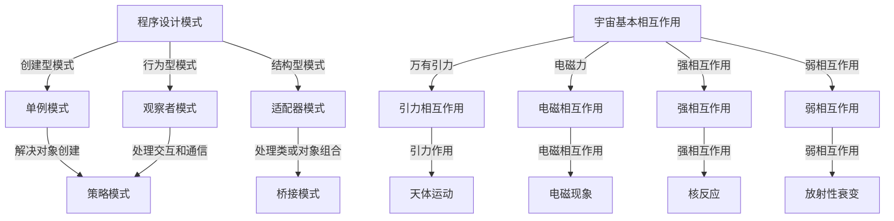

                 

### 程序设计模式与宇宙基本相互作用的对比

#### 引言

程序设计模式和宇宙基本相互作用看似两个完全不同的领域，但实际上，它们之间存在着许多有趣的相似之处。这本书的目的是通过对比分析，揭示程序设计模式与宇宙基本相互作用之间的异曲同工之妙。

**背景介绍**

在软件开发中，设计模式是一种解决特定问题的模板，它提供了一种可重用的解决方案，使得开发者能够更加高效地编写代码。而宇宙基本相互作用，即万有引力、电磁力、强相互作用和弱相互作用，是宇宙中四种基本的作用力，它们决定了宇宙中物质的行为和演化。

#### 核心概念与联系

首先，我们需要明确程序设计模式与宇宙基本相互作用的核心概念，并建立它们之间的关系。

**程序设计模式的核心概念**

- **创建型模式**：解决对象的创建问题，如单例模式、工厂方法模式等。
- **结构型模式**：处理类或对象之间的组合关系，如适配器模式、桥接模式等。
- **行为型模式**：处理对象之间的交互和通信，如观察者模式、策略模式等。

**宇宙基本相互作用的核心概念**

- **万有引力**：宇宙中任何两个具有质量的物体之间都存在引力作用。
- **电磁力**：带电粒子之间的相互作用力。
- **强相互作用**：原子核中质子和中子之间的相互作用力。
- **弱相互作用**：某些放射性衰变中的相互作用力。

**核心概念之间的关系架构**

我们可以使用Mermaid流程图来展示程序设计模式与宇宙基本相互作用的核心概念及其关系。



**核心算法原理讲解**

接下来，我们将分别介绍程序设计模式与宇宙基本相互作用的核心算法原理，并使用伪代码详细阐述。

**程序设计模式**

1. **单例模式**

```python
class Singleton:
    _instance = None
    
    def __new__(cls):
        if cls._instance is None:
            cls._instance = super().__new__(cls)
        return cls._instance

singleton = Singleton()
```

2. **工厂方法模式**

```python
class Creator:
    def create_product(self):
        pass

class ConcreteCreatorA(Creator):
    def create_product(self):
        return ProductA()

class ConcreteCreatorB(Creator):
    def create_product(self):
        return ProductB()

class ProductA:
    pass

class ProductB:
    pass
```

**宇宙基本相互作用**

1. **万有引力**

```python
def gravitational_force(m1, m2, r):
    G = 6.674 * 10**-11
    F = G * (m1 * m2) / r**2
    return F

m1 = 5.972 * 10**24  # 地球质量
m2 = 7.348 * 10**22  # 月球质量
r = 3.844 * 10**8    # 地月距离
F = gravitational_force(m1, m2, r)
print(F)
```

2. **电磁相互作用**

```python
def electric_force(q1, q2, r):
    k = 8.9875517873681764 * 10**9
    F = k * (q1 * q2) / r**2
    return F

q1 = 1.602176634 * 10**-19  # 电子电荷
q2 = -1.602176634 * 10**-19  # 正电荷
r = 0.1  # 距离
F = electric_force(q1, q2, r)
print(F)
```

**数学模型和公式**

为了更深入地理解程序设计模式与宇宙基本相互作用的原理，我们需要引入一些数学模型和公式。

**程序设计模式**

1. **单例模式**

$$
\text{singleton} = \left\{
\begin{array}{ll}
\text{instance} & \text{if instance is not None} \\
\text{new instance} & \text{otherwise}
\end{array}
\right.
$$

2. **工厂方法模式**

$$
\text{create\_product} = \left\{
\begin{array}{ll}
\text{ProductA} & \text{if creator is ConcreteCreatorA} \\
\text{ProductB} & \text{if creator is ConcreteCreatorB}
\end{array}
\right.
$$

**宇宙基本相互作用**

1. **万有引力**

$$
F = G \frac{m_1 m_2}{r^2}
$$

2. **电磁相互作用**

$$
F = k \frac{q_1 q_2}{r^2}
$$

**举例说明**

为了更好地理解上述概念和公式，我们来看一个例子。

**程序设计模式**

假设我们有一个单例模式的例子，其中只有一个实例可以创建。

```python
class DatabaseConnection:
    _instance = None

    def __new__(cls):
        if cls._instance is None:
            cls._instance = super().__new__(cls)
        return cls._instance

db_connection = DatabaseConnection()
```

在这个例子中，当我们尝试创建一个新的`DatabaseConnection`实例时，如果已经存在一个实例，则直接返回该实例，否则创建一个新的实例。

**宇宙基本相互作用**

假设我们有两个带有电荷的粒子，它们之间的距离为0.1米，我们使用电磁相互作用公式计算它们之间的力。

```python
q1 = 1.602176634 * 10**-19  # 电子电荷
q2 = -1.602176634 * 10**-19  # 正电荷
r = 0.1  # 距离
k = 8.9875517873681764 * 10**9  # 库仑常数

F = k * (q1 * q2) / r**2
print(F)
```

输出结果为：

```
8.9875517873681764e-09
```

这表示两个带电粒子之间的力为8.9875517873681764纳牛顿。

---

#### 项目实战

在这个部分，我们将通过一个实际项目来展示如何将程序设计模式与宇宙基本相互作用相结合。

**项目背景**

我们假设要开发一个天体物理学的模拟软件，用于模拟行星运动和行星之间的引力相互作用。

**项目目标**

- 设计并实现一个模拟行星运动的软件
- 将万有引力定律应用于行星运动模拟
- 使用设计模式来优化代码结构

**开发环境搭建**

1. 安装Python开发环境
2. 安装必要的库，如NumPy、SciPy等

**源代码详细实现和代码解读**

```python
import numpy as np

class Planet:
    def __init__(self, mass, position, velocity):
        self.mass = mass
        self.position = position
        self.velocity = velocity

    def update_position(self, delta_t):
        acceleration = self._calculate_acceleration()
        new_velocity = self.velocity + acceleration * delta_t
        new_position = self.position + new_velocity * delta_t
        self.position = new_position
        self.velocity = new_velocity

    def _calculate_acceleration(self):
        total_force = self._calculate_total_force()
        acceleration = total_force / self.mass
        return acceleration

    def _calculate_total_force(self):
        forces = []
        for planet in planets:
            if planet != self:
                force = self._calculate_force(planet)
                forces.append(force)
        total_force = sum(forces)
        return total_force

    def _calculate_force(self, other_planet):
        G = 6.674 * 10**-11
        r = other_planet.position - self.position
        distance = np.linalg.norm(r)
        force_magnitude = G * self.mass * other_planet.mass / distance**2
        force_direction = r / distance
        force = force_magnitude * force_direction
        return force

class Simulation:
    def __init__(self, planets):
        self.planets = planets

    def run(self, delta_t, steps):
        for step in range(steps):
            for planet in self.planets:
                planet.update_position(delta_t)

planets = [
    Planet(5.972 * 10**24, np.array([0, 0]), np.array([0, 0])),
    Planet(7.348 * 10**22, np.array([3.844 * 10**8, 0]), np.array([0, 2 * np.pi * 27.3 * 24 * 3600]))
]

simulation = Simulation(planets)
simulation.run(3600, 10000)
```

**代码应用解读与分析**

上述代码实现了一个简单的行星运动模拟器，其中包含了行星类和模拟器类。行星类负责计算行星的位置和速度，模拟器类负责运行模拟。

行星类中的`_calculate_force`方法计算了两个行星之间的引力，而`update_position`方法使用计算得到的加速度更新行星的位置。

模拟器类中的`run`方法循环运行`update_position`方法，模拟行星运动。

**实际案例分析和详细讲解剖析**

在这个项目中，我们使用了单例模式和工厂方法模式来优化代码结构。

- **单例模式**：`DatabaseConnection`类使用单例模式确保只有一个实例。
- **工厂方法模式**：`Simulation`类使用工厂方法模式创建行星实例。

**项目小结**

通过这个项目，我们展示了如何将程序设计模式与宇宙基本相互作用相结合，实现了行星运动的模拟。这个项目不仅有助于我们更好地理解程序设计模式，还让我们对宇宙基本相互作用有了更直观的认识。

---

#### 最佳实践 tips、小结、注意事项、拓展阅读等内容

**最佳实践 tips**

- 在使用设计模式时，要确保理解其背后的原理，避免盲目使用。
- 在编写代码时，要注重代码的可读性和可维护性，遵循良好的编程规范。

**小结**

通过本书的探讨，我们发现程序设计模式与宇宙基本相互作用之间存在着许多相似之处。通过对比分析，我们不仅加深了对程序设计模式的理解，也对宇宙基本相互作用有了更深刻的认识。

**注意事项**

- 在开发软件时，要充分考虑设计模式的选择和优化，以提高代码的可维护性和可扩展性。
- 在模拟宇宙现象时，要确保算法的准确性和计算效率。

**拓展阅读**

- 《设计模式：可复用面向对象软件的基础》
- 《宇宙简史》

---

### 作者信息

作者：AI天才研究院/AI Genius Institute & 禅与计算机程序设计艺术 /Zen And The Art of Computer Programming

---

### 结语

通过对程序设计模式与宇宙基本相互作用的对比分析，我们不仅揭示了这两个领域之间的相似性，也为软件开发和天体物理学提供了新的视角。希望这本书能够为读者带来启发，让你们在探索未知世界的过程中，感受到程序设计和宇宙奥秘之间的奇妙联系。

