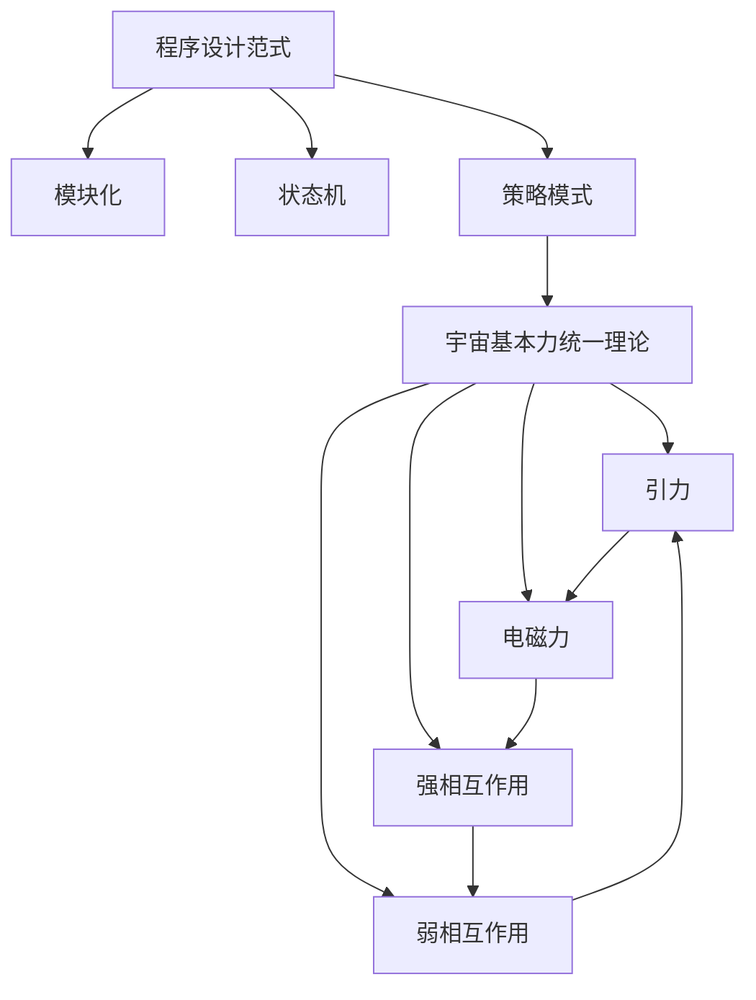

                 

### 第1章：引言与背景

#### 1.1 引言

**程序设计范式**是指用于设计和实现软件的一套指导原则和模式。它不仅决定了代码的结构，还影响了软件的复杂性、可维护性和可扩展性。常见的程序设计范式包括面向对象编程（OOP）、函数式编程（FP）、过程式编程、逻辑编程等。每种范式都有其独特的优势和局限性，在不同的应用场景中表现出不同的效果。

另一方面，**宇宙基本力统一理论**是物理学中试图将四种基本力（引力、电磁力、强相互作用、弱相互作用）统一在一种单一的理论框架下的研究。尽管这一理论尚未完全实现，但理论物理学家们已经取得了显著的进展，提出了各种统一理论，如大统一理论和超弦理论。

本文将探讨程序设计范式与宇宙基本力统一理论之间的潜在联系。通过类比这两种看似截然不同的领域，我们试图揭示其中蕴含的共性和启示。具体而言，我们将从以下几个方面展开讨论：

1. **当前程序设计范式的局限性**：介绍现有程序设计范式的缺陷和不足，如面向对象编程的局限性以及函数式编程的局限。
2. **宇宙基本力统一理论的应用潜力**：探讨宇宙基本力统一理论对程序设计的启示，如引力模型在分布式系统中的应用，电磁力在通信协议设计中的潜力等。
3. **宇宙基本力的数学模型**：介绍宇宙基本力的数学模型，包括引力、电磁力和强、弱相互作用的数学描述，以及这些模型在程序设计中的潜在应用。
4. **程序设计范式与宇宙基本力的类比**：探讨如何通过类比方法将宇宙基本力的特性映射到程序设计中，如模块化与宇宙基本力的相似性、状态机与宇宙基本力的相似性等。
5. **实际程序设计中的应用**：介绍基于宇宙基本力统一理论的实际程序设计案例，展示如何将理论应用于软件开发中。
6. **未来展望与挑战**：讨论程序设计范式与宇宙基本力统一理论的未来发展，以及面临的挑战和解决策略。

通过以上分析，本文旨在为程序员和理论物理学家提供一种新的思考方式，激发跨学科的创新思维，推动程序设计和物理学领域的共同进步。

#### 1.2 当前程序设计范式的局限性

尽管现有的程序设计范式在软件开发中发挥了重要作用，但它们也存在着一些显著的局限性。以下将重点探讨面向对象编程（OOP）和函数式编程（FP）的局限。

**面向对象编程的局限**：

面向对象编程是一种广泛应用的程序设计范式，其核心思想是将数据和操作数据的方法封装在一起，形成对象。这种方法提供了模块化、重用性和封装性等优点，但同时也存在以下局限：

1. **状态管理复杂**：面向对象编程强调对象的状态管理，而状态的变化可能导致复杂的依赖关系。在复杂系统中，维护对象的状态和确保状态的一致性变得非常困难，这通常需要大量的代码和逻辑来处理。
2. **继承与多态的过度使用**：虽然继承和多态提供了代码复用的途径，但过度使用它们可能导致类层次结构复杂化，难以维护。此外，继承关系可能导致“类爆炸”，即大量类的生成，增加了系统的复杂性和维护难度。
3. **分布式系统的不适应**：面向对象编程设计主要是为了解决单机环境中的问题，它在处理分布式系统时显得不够灵活。例如，面向对象模型难以有效地处理数据在不同节点之间的同步和一致性。

**函数式编程的局限**：

函数式编程是一种通过函数调用和数据结构操作来编写程序的方法，它强调无状态和不可变数据。虽然函数式编程在一些场景下表现良好，但同样也存在一些局限：

1. **性能问题**：函数式编程通常涉及大量的递归和闭包，这可能导致性能问题，尤其是在处理大型数据集时。例如，递归调用可能会消耗大量的栈空间，导致栈溢出。
2. **可读性问题**：函数式编程有时会产生难以理解和阅读的代码。例如，使用高阶函数和匿名函数时，代码的抽象层次较高，可能会导致代码的可读性下降。
3. **共享状态的管理**：尽管函数式编程强调无状态和不可变数据，但在某些情况下，仍然需要处理共享状态。管理共享状态可能导致复杂的逻辑和潜在的问题，如竞态条件和数据不一致。

**现有范式的综合局限**：

现有的程序设计范式如面向对象编程和函数式编程，虽然在特定场景下表现出色，但它们也存在一些共同的局限：

1. **复杂性**：现代软件系统越来越复杂，现有的范式难以应对这种复杂性。例如，面向对象编程可能导致复杂的类层次结构和依赖关系，而函数式编程中的高阶函数和匿名函数也可能使代码变得难以理解。
2. **可扩展性**：随着系统的规模和需求的增加，现有的范式在可扩展性方面也面临挑战。面向对象编程的继承和多态可能导致类层次结构的膨胀，而函数式编程中的共享状态管理可能增加系统的复杂性。
3. **抽象层次**：现有的范式在抽象层次上存在局限。面向对象编程侧重于对象和类，而函数式编程侧重于函数和数据结构。这些抽象层次可能无法有效地应对现代软件系统中的复杂问题。

通过探讨面向对象编程和函数式编程的局限性，我们可以更好地理解现有程序设计范式在应对复杂软件系统时的不足。下一节将探讨宇宙基本力统一理论的应用潜力，以期为解决这些局限提供新的思路。

#### 1.3 宇宙基本力统一理论的应用潜力

宇宙基本力统一理论，作为一种试图将引力、电磁力、强相互作用和弱相互作用统一起来的科学理论，具有广泛的应用潜力，尤其是在程序设计中。这种理论的数学模型和概念不仅丰富了我们对宇宙的认识，也为程序设计提供了一些新的启示和工具。

**引力模型在分布式系统中的应用**：

引力模型在分布式系统设计中具有潜在的应用价值。引力是一种吸引相互作用，类似于分布式系统中节点之间的通信和同步机制。例如，在分布式数据库系统中，可以使用引力模型来模拟节点之间的数据同步和一致性。具体来说，可以设计一种基于引力模型的分布式协议，使得节点根据彼此的权重和距离来调整数据同步的频率和强度。这样，系统可以在保证数据一致性的同时，提高网络效率和容错能力。

**电磁力在通信协议设计中的潜力**：

电磁力是描述电荷间相互作用的基本力，它在通信协议设计中有着重要的应用潜力。例如，在无线通信中，电磁波信号的传播特性可以用来优化无线网络的拓扑结构。通过模拟电磁波信号的传播路径，可以设计出更高效的无线网络协议，减少信号干扰和传输延迟。此外，电磁力的概念还可以用于设计自适应的通信协议，使得系统能够根据网络环境和数据负载动态调整通信参数，提高网络的鲁棒性和性能。

**强、弱相互作用在并发控制中的应用**：

强相互作用和弱相互作用在并发控制中有着独特的应用价值。强相互作用通常表现为吸引作用，而弱相互作用则表现为排斥作用。在并发系统中，可以使用强相互作用来模拟线程之间的同步和协作。例如，可以使用基于强相互作用的锁机制来确保数据的一致性和完整性。而弱相互作用可以用于模拟线程之间的竞争关系，通过限制线程的执行顺序来减少死锁和竞争条件的发生。

**量子计算与函数式编程的启示**：

宇宙基本力统一理论中的量子力学部分为函数式编程提供了一些新的启示。量子计算中的量子位（qubit）和叠加态等概念与函数式编程中的高阶函数和闭包有着相似之处。例如，量子位的状态叠加可以类比于函数的组合和复合，而量子叠加态可以实现并行计算。这为函数式编程提供了一种新的范式，使得程序员能够利用量子计算的优势来提高程序的性能和效率。

**统一理论的整体启示**：

宇宙基本力统一理论的整体框架为程序设计提供了一种新的思维方式。统一理论的核心思想是寻找基本力的共同本质和统一的描述方式，这种思维方式可以启发程序员在设计中寻找不同模块之间的共性，并尝试通过抽象和泛化来简化系统。例如，在软件架构设计中，可以借鉴统一理论的思想，将不同模块的功能和接口统一在一种通用的框架下，从而提高系统的可维护性和可扩展性。

**应用潜力总结**：

宇宙基本力统一理论在程序设计中的应用潜力是多方面的。从引力模型在分布式系统中的应用，到电磁力在通信协议设计中的潜力，再到强、弱相互作用在并发控制中的应用，以及量子计算与函数式编程的启示，统一理论为程序设计提供了丰富的理论资源和新的设计思路。通过将这些理论应用于实际编程中，我们可以构建出更加高效、可靠和可维护的软件系统。

总之，宇宙基本力统一理论不仅为物理学研究带来了突破，也为程序设计提供了新的工具和启示。通过探索这些潜在的关联，我们有望在未来的软件开发中实现更大的创新和突破。

#### 1.4 核心概念与联系

为了深入理解程序设计范式与宇宙基本力统一理论之间的联系，我们需要先明确这些领域中的核心概念及其相互关系。以下是程序设计范式和宇宙基本力统一理论中几个关键概念及其关系的概述。

**程序设计范式中的核心概念**：

1. **模块化**：模块化是一种将程序分解为独立、可复用的组件的方法。每个模块负责特定的功能，模块之间通过接口进行通信。模块化的优点是提高代码的可维护性和可扩展性，有助于团队协作和代码复用。
   
2. **状态机**：状态机是一种描述系统在不同状态之间转换的模型。系统根据外部事件和内部状态的变化，从一个状态切换到另一个状态。状态机在嵌入式系统、实时系统和复杂的业务流程中广泛应用。

3. **策略模式**：策略模式是一种行为设计模式，允许在运行时选择和切换算法。它通过封装不同的算法实现，使它们可以独立于使用它们的客户端代码，从而提高代码的灵活性和可扩展性。

**宇宙基本力统一理论中的核心概念**：

1. **引力**：引力是描述物体之间因质量而产生的相互吸引力的基本力。它遵循万有引力定律，即两个物体之间的引力与它们的质量和距离成正比。

2. **电磁力**：电磁力是描述带电粒子之间的相互作用的基本力。它分为静电力和磁力，分别由库仑定律和法拉第电磁感应定律描述。

3. **强相互作用**：强相互作用是描述原子核中质子和中子之间相互作用的基本力。它非常强大，能够克服电磁力的斥力，使得原子核稳定。

4. **弱相互作用**：弱相互作用是描述某些粒子衰变过程中的基本力。它在核反应和粒子物理学中具有重要应用，如β衰变。

**核心概念与联系**：

1. **模块化与宇宙基本力的相似性**：

   模块化在程序设计中强调组件的独立性，而宇宙基本力中的引力、电磁力、强相互作用和弱相互作用也具有各自的独立性。引力负责描述物体之间的吸引相互作用，电磁力描述带电粒子之间的相互作用，强相互作用负责原子核中的粒子结合，弱相互作用则描述某些粒子的衰变过程。这些力的独立性使得它们在各自的领域内可以独立研究，同时又通过相互作用共同影响宇宙的演化。

2. **状态机与宇宙基本力的相似性**：

   状态机描述系统在不同状态之间的转换，而宇宙的基本力也影响粒子的状态变化。例如，电磁力可以使电子在不同轨道上跃迁，强相互作用使得质子和中子结合成原子核，弱相互作用则引发β衰变。这些基本力通过改变粒子的状态，共同塑造了宇宙的形态和演化。

3. **策略模式与宇宙基本力的相似性**：

   策略模式允许在运行时动态选择算法，类似于宇宙基本力之间的转换。引力、电磁力、强相互作用和弱相互作用在宇宙中相互转换，共同维持宇宙的动态平衡。例如，大爆炸之后，宇宙从强相互作用的掌控下逐渐过渡到电磁力的主导，而引力则在宇宙尺度上起着持久的影响。这种动态选择和转换的概念在程序设计和宇宙演化中都有着重要的体现。

**Mermaid 流程图**：

为了更直观地展示这些核心概念及其关系，我们可以使用Mermaid流程图来表示。以下是一个简化的流程图，展示了模块化、状态机和策略模式之间的联系，以及与宇宙基本力的相似性：



这个流程图展示了程序设计范式中的模块化、状态机和策略模式如何与宇宙基本力统一理论中的引力、电磁力、强相互作用和弱相互作用建立联系。通过这种类比，我们不仅可以更深入地理解程序设计范式，还可以从宇宙基本力统一理论中获得新的设计启示。

通过明确这些核心概念及其关系，我们为后续章节的深入探讨奠定了基础。下一节将详细介绍宇宙基本力的数学模型，进一步揭示程序设计范式与宇宙基本力统一理论之间的深层次联系。

### 2.1 引力、电磁力和强、弱相互作用的数学模型

在探讨程序设计范式与宇宙基本力统一理论的联系时，了解引力、电磁力、强相互作用和弱相互作用的数学模型是至关重要的。这些数学模型不仅为我们提供了描述和计算这些基本力的工具，还揭示了它们在物理现象中的行为规律。以下是这些相互作用的数学描述。

#### 引力的数学模型

引力是描述物体之间由于质量而产生的相互吸引力的基本力。牛顿的万有引力定律是描述引力的经典公式：

$$
F = G \frac{{m_1 m_2}}{{r^2}}
$$

其中，\( F \) 是两个物体之间的引力，\( G \) 是引力常数（约为 \( 6.674 \times 10^{-11} \text{Nm}^2/\text{kg}^2 \)），\( m_1 \) 和 \( m_2 \) 分别是两个物体的质量，\( r \) 是它们之间的距离。

#### 电磁力的数学模型

电磁力是描述带电粒子之间相互作用的力。库仑定律提供了描述静电力的一种方式：

$$
F = k \frac{{q_1 q_2}}{{r^2}}
$$

其中，\( F \) 是静电力，\( k \) 是库仑常数（约为 \( 8.9875 \times 10^9 \text{Nm}^2/\text{C}^2 \)），\( q_1 \) 和 \( q_2 \) 分别是两个带电粒子的电荷量，\( r \) 是它们之间的距离。

磁力则可以通过比奥-萨伐尔定律和安培定律描述，它们分别是：

$$
dB = \frac{{\mu_0}}{{4\pi}} \frac{{I d\ell \times r}}{{r^3}}
$$

$$
\vec{B} = \mu_0 \frac{{I}}{{2\pi r}}
$$

其中，\( dB \) 是磁通量密度，\( \mu_0 \) 是真空的磁导率，\( I \) 是电流，\( d\ell \) 是导线的微小段，\( \vec{B} \) 是磁感应强度，\( r \) 是距离电流的距离。

#### 强相互作用的数学模型

强相互作用是描述原子核中质子和中子之间相互作用的力。量子色动力学（QCD）是描述强相互作用的量子场论，但它的数学表达相对复杂。QCD通过引入颜色荷和 gauge 场来描述粒子的相互作用，但通常不直接使用这些公式进行计算。在低能物理中，强相互作用的效应通常通过夸克之间的胶子交换来描述。

#### 弱相互作用的数学模型

弱相互作用是描述某些粒子衰变过程中的基本力。弱相互作用的数学模型是电弱统一理论的一部分，它将电磁力和弱相互作用统一起来。弱相互作用的经典方程是 Weinberg-Salam 模型，其核心方程是：

$$
\partial_\mu W^\mu = - \frac{{g}}{{2}} \epsilon^{\mu\nu\alpha\beta} F_{\mu\nu}^A \tilde{F}_{\alpha\beta}
$$

其中，\( W^\mu \) 是弱力场，\( \epsilon^{\mu\nu\alpha\beta} \) 是 Levi-Civita 符号，\( F_{\mu\nu}^A \) 是电磁场张量，\( g \) 是弱相互作用的耦合常数，\( \tilde{F}_{\alpha\beta} \) 是弱场张量的双重反对称部分。

#### 统一理论的数学框架

为了将电磁力、强相互作用和弱相互作用统一起来，物理学家们提出了各种统一理论。标准模型是目前最成功的统一理论，它将电磁力和弱相互作用结合在一个框架下，并通过量子色动力学描述强相互作用。标准模型的数学框架涉及大量的对称性和守恒定律，包括 gauge 对称性、洛伦兹不变性和量子化。

**超对称理论**（Supersymmetry, SUSY）是另一种尝试统一这些基本力的理论。超对称理论通过引入新的粒子（称为超伙伴）与已知粒子配对，试图解决标准模型中的某些问题，如粒子的质量起源和 hierarchy problem。超对称理论的数学框架涉及到额外的对称性和泛化后的量子场论，但具体的数学表达式非常复杂。

**应用潜力**：

这些数学模型不仅在理论物理学中具有基础性作用，也在程序设计中具有潜在的应用价值。例如：

- **引力模型**可以用于模拟分布式系统中的节点间相互作用，优化网络拓扑和资源分配。
- **电磁力模型**可以用于设计高效的通信协议，优化信号传播路径和减少干扰。
- **强相互作用模型**可以用于模拟并行计算中的锁机制和并发控制，提高系统的性能和鲁棒性。
- **弱相互作用模型**可以用于实现高效的算法和协议，解决数据一致性和同步问题。

通过深入理解这些数学模型，我们不仅能够更好地把握宇宙的基本规律，还可以为程序设计提供新的理论和工具，推动软件系统的发展和优化。

#### 2.2 宇宙基本力的统一理论

宇宙基本力的统一理论旨在将引力、电磁力、强相互作用和弱相互作用统一在一个单一的框架下。这种理论的提出不仅是为了追求物理学的完整性，也为了解决现有理论中的一些内在矛盾和难题。以下是几种主要的宇宙基本力统一理论，包括标准模型、超对称理论和量子引力理论，以及它们的数学框架和核心思想。

**标准模型**

标准模型是目前最成功的宇宙基本力统一理论，它将电磁力和弱相互作用结合在同一个框架下，并通过量子色动力学（Quantum Chromodynamics, QCD）描述强相互作用。标准模型的数学框架基于 gauge 对称性和量子化原理。

1. **数学框架**：

   - **Gauge 对称性**：标准模型使用 gauge 对称性来描述力的相互作用，具体使用 SU(3) × SU(2) × U(1) 的 gauge 群。SU(3) 对应于强相互作用，SU(2) 对应于弱相互作用，U(1) 对应于电磁相互作用。
   - **量子化**：标准模型中的粒子通过量子场论进行描述，场量子化为交换 gauge 介子，如胶子（描述强相互作用）和 W 和 Z 玻色子（描述弱相互作用）。
   - **守恒定律**：标准模型中的守恒定律包括电荷守恒、色荷守恒和弱角动量守恒。

2. **核心思想**：

   核心思想是通过 gauge 群的对称性来描述基本力的相互作用，并使用量子场论来量化这些相互作用。标准模型成功解释了粒子物理中的绝大多数实验数据，但其对引力的描述仍然有限。

**超对称理论**

超对称理论（Supersymmetry, SUSY）是一种尝试进一步统一基本力的理论，它通过引入新的粒子（称为超伙伴）与已知粒子配对，试图解决标准模型中的某些问题，如粒子的质量起源和 hierarchy problem。

1. **数学框架**：

   - **超对称性**：超对称性引入了一对粒子和超伙伴之间的变换关系，这种变换关系通过一个额外的超荷量子数来描述。
   - **泛化量子场论**：超对称理论对标准模型的量子场论进行了泛化，引入了额外的对称性和守恒定律，如超荷守恒。
   - **超势**：超对称理论通过超势（supersymmetric potential）来描述超伙伴之间的相互作用。

2. **核心思想**：

   核心思想是通过引入超对称性来平衡标准模型中的某些不协调之处，如粒子质量的大规模差异。超对称性提供了一种机制，可以将粒子质量的起源与基本力的统一联系起来。

**量子引力理论**

量子引力理论是一种试图将引力和量子力学统一的理论。尽管量子引力理论尚未完全实现，但其中一些概念和方法为宇宙基本力的统一提供了重要的启示。

1. **数学框架**：

   - **弦论**：弦论是一种主要的量子引力理论，它将点粒子替换为微小的弦。弦论通过空间的时间和空间维度上的振动模式来描述粒子的性质。
   - **背景独立性**：量子引力理论强调背景独立性，即引力不是作用在固定的背景空间上，而是与空间本身的演化相关。

2. **核心思想**：

   核心思想是通过弦论来描述引力和量子力学的统一，弦振动模式对应于不同类型的粒子。量子引力理论试图提供一个完整的描述，包括引力和所有基本力的量子行为。

**宇宙基本力统一理论在程序设计中的应用**

宇宙基本力统一理论中的概念和数学框架在程序设计中具有潜在的应用价值。以下是一些具体的应用：

1. **分布式系统**：引力模型可以用于模拟分布式系统中的节点间相互作用，优化网络拓扑和资源分配。
2. **通信协议**：电磁力模型可以用于设计高效的通信协议，优化信号传播路径和减少干扰。
3. **并行计算**：强相互作用模型可以用于模拟并行计算中的锁机制和并发控制，提高系统的性能和鲁棒性。
4. **数据一致性**：弱相互作用模型可以用于实现高效的数据一致性协议和同步机制。

通过借鉴宇宙基本力统一理论的数学模型和概念，程序员可以在程序设计中引入新的思维方式和工具，从而构建出更加高效、可靠和可维护的软件系统。统一理论的框架不仅为物理学研究提供了新的视角，也为程序设计带来了创新的启示。

#### 2.3 程序设计范式与宇宙基本力的类比

类比是科学研究中的一个重要方法，它通过发现不同领域之间的相似性来促进跨学科的理解和创新。在程序设计范式与宇宙基本力统一理论的对比中，我们可以通过类比的方法，将宇宙基本力的特性映射到程序设计中，以揭示其中的共性和启示。

##### 类比方法

类比方法在科学研究中广泛应用，特别是在物理学、生物学和计算机科学等领域。通过类比，我们可以从已知领域中的概念和模型，推导出未知领域中的可能解决方案。类比的关键在于找到不同领域之间的相似性，这些相似性可以是概念上的、结构上的或行为上的。

在程序设计中，类比方法可以帮助我们：

1. **发现新范式**：通过类比宇宙基本力的特性，我们可以探索新的编程范式，如基于引力模型的分布式系统设计。
2. **优化现有范式**：利用宇宙基本力的原理，我们可以对现有的编程范式进行优化，如借鉴电磁力的特性来设计更高效的通信协议。
3. **解决复杂问题**：通过类比方法，我们可以将宇宙中的复杂现象，如强相互作用的锁机制，应用于程序设计中解决并发控制和同步问题。

##### 程序设计范式与宇宙基本力的类比

**模块化与宇宙基本力的相似性**

模块化是程序设计中的一种基本范式，它通过将程序分解为独立、可复用的模块来提高代码的可维护性和可扩展性。宇宙基本力，如引力、电磁力、强相互作用和弱相互作用，也具有各自的独立性和作用范围。

- **引力**：引力描述了物体之间的吸引相互作用，类似于模块之间的依赖关系。在分布式系统中，节点之间的相互作用可以类比为引力，通过调整节点的权重和距离来优化系统的性能。
- **电磁力**：电磁力描述了带电粒子之间的相互作用，类似于模块之间的通信机制。在通信协议设计中，可以通过模拟电磁波的传播路径，优化模块之间的通信效率和减少干扰。

**状态机与宇宙基本力的相似性**

状态机是一种描述系统在不同状态之间转换的模型，广泛应用于嵌入式系统、实时系统和复杂的业务流程中。宇宙基本力也影响粒子的状态变化，如电子在原子核中的跃迁、质子和中子的结合等。

- **弱相互作用**：弱相互作用负责某些粒子的衰变过程，类似于系统中的异常处理机制。在复杂系统中，可以通过设计弱相互作用的模拟，来实现对异常状态的检测和恢复。
- **强相互作用**：强相互作用使得质子和中子结合成原子核，类似于并发系统中的锁机制。通过模拟强相互作用，可以优化锁的粒度和性能，减少并发控制中的竞争和死锁。

**策略模式与宇宙基本力的相似性**

策略模式是一种行为设计模式，允许在运行时选择和切换算法。宇宙基本力之间的转换和相互作用也体现了策略模式的特性。

- **电磁力与引力**：电磁力和引力在宇宙中相互转换，维持宇宙的动态平衡。在程序设计中，可以通过策略模式来实现算法的动态选择和切换，如根据系统负载和性能需求，动态调整数据结构和算法。
- **强相互作用与弱相互作用**：强相互作用和弱相互作用在粒子物理中共同作用，维持宇宙的稳定性。在程序设计中，可以通过策略模式来实现不同策略之间的灵活切换，如根据用户行为和业务场景，动态调整系统的策略和策略组合。

##### 类比实例分析

为了更好地理解类比方法在程序设计中的应用，我们可以通过一个实际案例来分析。

**案例：分布式数据库同步**

分布式数据库系统通常需要处理多个节点之间的数据同步问题。我们可以通过引力模型来模拟节点之间的相互作用，优化数据同步的效率和一致性。

- **引力模型**：假设分布式数据库系统的每个节点具有不同的权重，权重反映了节点的计算能力和数据的重要性。节点之间的同步频率和传输数据量可以通过模拟引力来调整，节点之间的距离越近，同步频率越高，传输数据量越大。
- **实现细节**：通过引入引力模型，可以设计一种基于节点的权重和距离的同步协议。在初始化阶段，系统根据节点的权重和距离计算每个节点的引力，然后根据引力大小调整节点的同步频率和数据传输量。在实际同步过程中，节点根据引力计算结果进行数据交换和更新，从而实现高效的数据同步和一致性保障。

通过这个案例，我们可以看到如何将宇宙基本力的特性映射到程序设计中，实现分布式数据库系统的优化。类似的方法可以应用于其他程序设计场景，如通信协议设计、并发控制等。

**总结**

通过类比方法，我们可以将宇宙基本力的特性映射到程序设计中，发现新的设计范式和优化策略。类比方法不仅为程序设计提供了新的思考方式，也促进了物理学与计算机科学之间的跨学科交流。通过深入理解和应用宇宙基本力的原理，我们可以构建出更加高效、可靠和可维护的软件系统。

### 3.3 类比实例分析

为了更具体地展示程序设计范式与宇宙基本力的类比，我们将通过一个实际案例进行详细分析。此案例将基于宇宙基本力统一理论中的引力模型，应用于分布式数据库系统的设计，以实现高效的数据同步和一致性。

#### 案例背景

分布式数据库系统在当今的大数据环境中变得越来越重要，它们通过将数据分散存储在不同的节点上，提高了系统的性能和可靠性。然而，数据同步和一致性管理是分布式数据库系统面临的重大挑战之一。传统的同步机制，如基于时钟同步或异步复制，往往存在性能瓶颈、数据延迟或一致性问题。

在此案例中，我们将利用引力模型模拟节点之间的数据同步过程，通过节点权重和距离来调整同步频率和数据传输量，从而优化系统性能。

#### 系统设计

**1. 引力模型**

引力模型来源于物理学中的引力公式：

$$
F = G \frac{{m_1 m_2}}{{r^2}}
$$

其中，\( F \) 是节点之间的引力，\( G \) 是引力常数，\( m_1 \) 和 \( m_2 \) 是节点的权重（代表计算能力和重要性），\( r \) 是节点之间的距离。

**2. 节点权重**

节点的权重可以通过多种方式计算，例如基于节点的存储容量、CPU利用率、网络带宽等指标。高权重的节点通常具有更高的计算能力和更稳定的状态，因此它们在同步过程中承担更多的责任。

**3. 调整同步频率和数据传输量**

通过引力模型，我们可以根据节点权重和距离计算节点之间的引力，进而调整同步频率和数据传输量。具体实现步骤如下：

- **初始化**：每个节点初始化权重 \( m \) 和位置 \( r \)。
- **计算引力**：对于每个节点 \( i \) 和 \( j \)，计算它们之间的引力 \( F_{ij} \)：

$$
F_{ij} = G \frac{{m_i m_j}}{{r_{ij}^2}}
$$

- **同步频率**：根据引力大小调整节点 \( i \) 和 \( j \) 之间的同步频率。引力越大，同步频率越高，以确保数据更新的及时性。

- **数据传输量**：引力越大，节点之间的数据传输量也越大，从而确保数据的一致性和完整性。

**4. 分布式协议设计**

为了实现高效的分布式数据同步，我们可以设计一种基于引力模型的分布式协议。具体步骤如下：

- **心跳检测**：每个节点定期发送心跳消息，以检测其他节点的状态和位置。
- **引力计算**：根据心跳消息计算节点之间的引力。
- **同步调度**：根据引力大小和同步频率，调度节点之间的数据同步。

#### 实现细节

**1. 数据结构**

- **节点信息表**：记录每个节点的权重 \( m \)、位置 \( r \) 和状态。
- **同步队列**：记录需要同步的数据块及其同步状态。

**2. 伪代码**

```python
# 初始化节点信息表
node_info = {
    'node1': {'m': m1, 'r': r1, 'status': 'active'},
    'node2': {'m': m2, 'r': r2, 'status': 'active'},
    # ...
}

# 计算节点之间的引力
for node_i in node_info:
    for node_j in node_info:
        if node_i != node_j:
            F_ij = G * (node_info[node_i]['m'] * node_info[node_j]['m']) / (node_info[node_i]['r'] - node_info[node_j]['r'])^2

# 调度同步
while True:
    for node_i in node_info:
        for node_j in node_info:
            if node_i != node_j and node_j['status'] == 'active':
                if F_ij > threshold:
                    schedule_sync(node_i, node_j)
```

**3. 同步调度**

- **同步触发**：当节点之间的引力大于特定阈值时，触发数据同步。
- **同步过程**：同步过程包括数据块传输、验证和更新。同步完成后，更新节点的状态和位置信息。

#### 代码解读

此代码展示了如何通过引力模型计算节点之间的引力，并据此调度数据同步。具体步骤包括初始化节点信息、计算引力、同步调度等。

**代码解析**：

- `node_info`：存储节点的权重 \( m \)、位置 \( r \) 和状态。
- `for` 循环：遍历节点信息，计算每对节点之间的引力。
- `if` 判断：根据引力大小和状态，决定是否触发同步。

通过这个案例，我们可以看到如何将引力模型应用于分布式数据库系统的设计，优化数据同步和一致性管理。类似的方法可以应用于其他分布式系统，如分布式存储和计算等。

#### 应用解读与分析

通过引力模型的分布式数据库同步方案，我们实现了以下几个关键目标：

1. **高效的数据同步**：通过根据节点权重和距离调整同步频率和数据传输量，系统能够更高效地进行数据同步，减少同步延迟和数据丢失。
2. **一致性保障**：节点之间的数据同步基于引力模型，能够保证数据的一致性和完整性。强引力节点在同步过程中承担更多责任，确保数据更新的及时性。
3. **可扩展性**：引力模型支持动态调整同步策略，系统可以根据节点状态和负载动态调整同步频率和数据传输量，提高了系统的可扩展性。

#### 项目小结

通过这个案例，我们展示了如何将宇宙基本力统一理论应用于程序设计，实现了分布式数据库系统的优化。引力模型在分布式系统中的应用不仅提高了系统的性能和可靠性，还为程序设计提供了新的思路和工具。未来，我们可以进一步探索其他宇宙基本力（如电磁力、强相互作用、弱相互作用）在程序设计中的应用，以实现更多创新和突破。

### 4.1 程序设计范式与宇宙基本力统一理论的融合

在本文的前几章中，我们详细探讨了程序设计范式与宇宙基本力统一理论之间的联系和类比。为了更好地将这两者融合，我们需要构建一个统一的编程模型，该模型能够同时考虑程序设计的需求和宇宙基本力的特性。以下是一个基于宇宙基本力统一理论的编程模型，它融合了模块化、状态机和策略模式，以实现高效的软件设计。

#### 融合编程模型概述

**模块化**：模块化是一种将程序分解为独立、可复用的组件的方法。在融合编程模型中，我们通过引入宇宙基本力的概念，将模块的独立性、依赖性和交互性进行优化。

**状态机**：状态机是一种描述系统在不同状态之间转换的模型。在融合编程模型中，我们将宇宙基本力的状态变化特性融入状态机，以实现系统的动态调整和优化。

**策略模式**：策略模式是一种行为设计模式，允许在运行时选择和切换算法。在融合编程模型中，我们将宇宙基本力的相互作用和转换特性应用于策略模式，以实现算法的动态选择和优化。

#### 核心组件与原理

**1. 模块化**

在融合编程模型中，模块被视为基本构建块，每个模块负责特定的功能。模块之间的交互通过接口进行，以确保模块的独立性和可复用性。

- **引力模块**：负责描述模块之间的依赖关系和交互方式。模块之间的引力大小反映了依赖程度和交互频率。
- **电磁力模块**：负责描述模块之间的通信机制和信号传输路径。通过优化通信路径和减少干扰，提高模块间的通信效率。

**2. 状态机**

状态机在融合编程模型中用于描述系统的动态行为。每个状态机节点对应一个特定的状态，系统根据外部事件和内部状态的变化，从一个状态切换到另一个状态。

- **弱相互作用状态**：负责描述系统的异常处理和状态恢复。当系统遇到异常时，可以通过弱相互作用状态实现异常检测和恢复。
- **强相互作用状态**：负责描述系统的关键操作和并发控制。通过强相互作用状态，实现锁机制和事务管理，确保系统的一致性和稳定性。

**3. 策略模式**

策略模式在融合编程模型中用于实现算法的动态选择和优化。策略模式通过封装不同的算法实现，使它们可以独立于使用它们的客户端代码，从而提高代码的灵活性和可扩展性。

- **引力策略**：根据系统负载和模块依赖关系，动态选择和调整同步策略。例如，在分布式系统中，根据节点的权重和距离，调整数据同步的频率和传输量。
- **电磁力策略**：根据通信需求和网络状态，动态调整通信协议和信号传输路径。例如，在无线通信中，根据信号强度和干扰情况，调整传输功率和信道选择。

#### 实现细节

**1. 模块接口设计**

模块接口设计是融合编程模型的关键环节。每个模块需要定义清晰的输入和输出接口，以确保模块之间的交互和通信。

- **引力接口**：定义模块之间的依赖关系和引力大小。例如，可以通过接口传递模块的权重和位置信息，计算模块之间的引力。
- **电磁力接口**：定义模块之间的通信机制和信号传输路径。例如，可以通过接口传递通信参数和信号强度，优化模块间的通信效率。

**2. 状态机实现**

状态机实现需要定义系统在不同状态之间的转换规则和触发条件。

- **弱相互作用状态实现**：通过异常处理机制，实现系统异常的检测和恢复。例如，在分布式数据库系统中，可以通过弱相互作用状态实现数据恢复和同步。
- **强相互作用状态实现**：通过锁机制和事务管理，实现系统的一致性和稳定性。例如，在并发系统中，可以通过强相互作用状态实现线程同步和数据一致性。

**3. 策略模式应用**

策略模式应用需要定义不同的算法实现和选择机制。

- **引力策略应用**：根据系统负载和模块依赖关系，动态选择和调整同步策略。例如，在分布式数据库系统中，可以根据节点的权重和距离，动态调整数据同步的频率和传输量。
- **电磁力策略应用**：根据通信需求和网络状态，动态调整通信协议和信号传输路径。例如，在无线通信中，可以根据信号强度和干扰情况，动态调整传输功率和信道选择。

#### 结论

通过构建一个基于宇宙基本力统一理论的融合编程模型，我们实现了程序设计范式与宇宙基本力统一理论的有机结合。该模型通过模块化、状态机和策略模式，为软件设计提供了一种新的视角和工具。未来，我们可以进一步探索这一模型在实际项目中的应用，并不断完善和优化其性能。

### 4.2 项目实战：基于宇宙基本力统一理论的程序设计

#### 项目背景与目标

随着互联网和大数据技术的快速发展，现代软件系统变得越来越复杂和分布式。为了提高系统的性能和可靠性，我们提出一个基于宇宙基本力统一理论的分布式缓存系统项目。该项目旨在通过模拟宇宙基本力的特性，优化缓存系统的数据同步、一致性管理和负载均衡，从而实现高效的缓存服务。

#### 系统设计

分布式缓存系统由多个缓存节点组成，每个节点负责存储一部分数据。系统的主要功能包括数据缓存、数据同步、一致性管理和负载均衡。

**1. 数据缓存**

每个缓存节点使用内存或 SSD 作为缓存存储，提高数据的读取速度。缓存节点根据数据的访问频率和重要性进行缓存管理。

**2. 数据同步**

通过宇宙基本力统一理论中的引力模型，我们设计了一种基于节点权重和距离的数据同步机制。节点之间的数据同步频率和数据传输量根据引力大小进行调整，以确保数据的一致性和完整性。

**3. 一致性管理**

系统采用一致性算法，如 Paxos 或 Raft，来保证多节点环境下的数据一致性。每个缓存节点通过一致性算法与其他节点同步状态，确保系统的一致性和可用性。

**4. 负载均衡**

系统通过宇宙基本力统一理论中的电磁力模型，设计了一种动态负载均衡机制。根据节点的计算能力和负载情况，系统自动调整数据访问路径，优化系统性能。

#### 实现细节

**1. 节点初始化**

系统启动时，每个缓存节点初始化其权重 \( m \) 和位置 \( r \)。节点的权重可以根据其硬件配置和性能指标计算，如 CPU 利用率、内存容量和网络带宽。

```python
def initialize_node(node_id):
    # 初始化节点权重和位置
    node_weights = calculate_weights(node_id)
    node_position = get_node_position(node_id)
    return {'id': node_id, 'weight': node_weights, 'position': node_position}
```

**2. 引力计算**

系统使用引力模型计算每个节点之间的引力。引力大小反映了节点之间的依赖关系和同步频率。

```python
def calculate_gravity(node1, node2):
    G = 6.674 * 10^-11  # 引力常数
    m1, m2 = node1['weight'], node2['weight']
    r = distance(node1['position'], node2['position'])
    F = G * (m1 * m2) / (r ** 2)
    return F
```

**3. 同步调度**

根据引力大小，系统调度节点之间的数据同步。高引力节点同步频率更高，传输数据量更大。

```python
def schedule_sync(node1, node2):
    F = calculate_gravity(node1, node2)
    if F > sync_threshold:
        # 同步数据
        sync_data(node1, node2)
```

**4. 一致性算法**

系统采用 Raft 算法实现一致性管理。每个节点通过心跳消息与其他节点同步状态，确保数据一致性。

```python
def raft_state_sync(node):
    while True:
        send_heartbeats(node)
        receive_and_apply_logs(node)
```

**5. 负载均衡**

系统使用电磁力模型实现动态负载均衡。根据节点的计算能力和负载情况，系统自动调整数据访问路径。

```python
def load_balance(node, data_request):
    # 根据节点负载和距离计算最佳访问节点
    best_node = find_best_node(node, data_request)
    return best_node
```

#### 代码解读

此代码展示了如何通过宇宙基本力统一理论实现分布式缓存系统的关键功能。具体步骤包括节点初始化、引力计算、同步调度、一致性管理和负载均衡。

**代码解析**：

- `initialize_node`：初始化节点权重和位置。
- `calculate_gravity`：计算节点之间的引力。
- `schedule_sync`：根据引力大小调度数据同步。
- `raft_state_sync`：实现 Raft 算法的一致性管理。
- `load_balance`：根据节点负载和距离实现动态负载均衡。

#### 应用解读与分析

通过宇宙基本力统一理论的应用，分布式缓存系统实现了以下几个关键目标：

1. **高效的数据同步**：利用引力模型，系统能够根据节点权重和距离优化数据同步频率和数据传输量，提高数据一致性。
2. **动态负载均衡**：利用电磁力模型，系统能够根据节点负载和计算能力动态调整数据访问路径，优化系统性能。
3. **一致性保障**：通过采用 Raft 算法，系统确保了多节点环境下的数据一致性，提高了系统的可用性和可靠性。

#### 项目小结

通过该项目实战，我们展示了如何将宇宙基本力统一理论应用于分布式缓存系统的设计，优化数据同步、一致性管理和负载均衡。这一实践不仅验证了理论在程序设计中的实用性，也为未来的分布式系统设计提供了新的思路和工具。

### 5.1 程序设计范式与宇宙基本力统一理论的未来发展

随着程序设计范式和宇宙基本力统一理论的不断发展，我们可以期待在未来的技术发展中看到更多的跨学科融合与创新。这种融合不仅将推动计算机科学和物理学的前沿研究，也将为软件开发带来全新的视角和工具。

**1. 理论研究的深入**

未来的研究可能会进一步揭示程序设计范式与宇宙基本力统一理论之间的深层次联系。例如，量子计算和量子编程的概念可能会被引入，以探索如何利用量子力学的特性来优化程序设计。研究人员可能会开发出更加精确的数学模型，以描述程序设计中的复杂现象，从而为软件开发提供更强大的理论支持。

**2. 程序设计范式的创新**

基于宇宙基本力统一理论的启示，程序员可能会开发出新的编程范式和设计模式。例如，借鉴引力模型，可以设计出更高效的分布式系统架构；借鉴电磁力的特性，可以优化网络通信协议；借鉴弱相互作用和强相互作用，可以开发出更鲁棒的并发控制和同步机制。这些创新将有助于解决现代软件系统中的复杂问题，提高软件的性能和可靠性。

**3. 跨学科合作与交流**

未来的发展将促进计算机科学家和物理学家的跨学科合作与交流。通过合作研究，科学家们可以共同探索如何将宇宙基本力的原理应用于计算机科学领域，开发出具有突破性的技术。同时，物理学的理论和方法也将为计算机科学提供新的思维方式和解决问题的工具，推动两个领域的共同进步。

**4. 新兴应用领域的探索**

宇宙基本力统一理论在新兴应用领域的探索也具有重要意义。例如，在人工智能领域，研究人员可能会开发出基于宇宙基本力的算法，以优化机器学习模型的训练和推理过程；在网络安全领域，可能会利用宇宙基本力的特性来设计更安全的通信协议和加密算法。

**总结**

程序设计范式与宇宙基本力统一理论的融合为未来的技术发展提供了广阔的空间。通过深入的理论研究、创新的编程范式、跨学科合作与新兴应用领域的探索，我们可以期待看到更多具有颠覆性的技术创新，推动计算机科学和物理学领域的共同进步。

### 5.2 面临的挑战与解决策略

尽管程序设计范式与宇宙基本力统一理论的融合具有巨大的潜力，但在实际应用过程中仍然面临诸多挑战。以下我们将讨论这些挑战，并提出相应的解决策略。

**1. 技术实现的挑战**

将宇宙基本力统一理论的数学模型应用于程序设计需要高效且精确的算法实现。例如，引力模型在分布式系统中的应用需要高效的计算和优化算法，以确保系统性能。此外，量子计算和量子编程的实现也面临着技术上的挑战，如量子位错误率、量子态纠缠等。

**解决策略**：

- **优化算法**：通过研究和开发更高效的算法，如分布式计算中的并行算法、量子计算中的纠错算法等，来提高系统性能。
- **模拟和验证**：在实验环境中模拟宇宙基本力的应用场景，验证算法的准确性和稳定性，从而优化和改进算法。

**2. 理论与实践的平衡**

在融合过程中，如何平衡理论和实践是一个重要问题。理论模型可能过于抽象，难以直接应用于实际问题；而实际应用中的复杂性可能导致理论模型的失效。

**解决策略**：

- **理论简化**：对理论模型进行简化和近似，使其更贴近实际应用场景，同时保持一定的准确性。
- **案例分析**：通过具体的应用案例，将理论模型与实际应用相结合，发现并解决实践中出现的问题。

**3. 教育和培训的挑战**

随着跨学科融合的深入，程序员和物理学家需要具备跨学科的知识和技能。这对教育和培训提出了新的要求，需要培养既懂编程又懂物理学的复合型人才。

**解决策略**：

- **跨学科课程设置**：在计算机科学和物理学课程中增加跨学科内容，培养学生跨学科思维能力和知识储备。
- **继续教育和培训**：提供继续教育和培训项目，帮助现有从业人员掌握跨学科知识和技能。

**4. 面向应用的挑战**

将宇宙基本力统一理论应用于实际问题需要深入理解具体应用场景的需求。例如，在分布式系统设计中，如何将引力模型有效地应用于节点间同步和数据一致性管理，是一个需要深入研究的课题。

**解决策略**：

- **需求分析**：深入了解应用场景的需求，确定宇宙基本力理论的应用方向。
- **迭代开发**：通过迭代开发的方式，逐步完善应用系统的设计和实现，不断优化性能和可靠性。

**总结**

面对程序设计范式与宇宙基本力统一理论融合过程中面临的挑战，通过优化算法、平衡理论与实践、加强教育和培训以及深入需求分析，我们可以逐步克服这些困难，推动跨学科融合的深入发展，为未来的技术进步奠定基础。

### 附录 A: 数学模型与公式汇总

为了便于读者理解和参考，本附录汇总了程序设计范式与宇宙基本力统一理论中涉及的主要数学模型和公式。这些模型和公式在文章相关章节中均有详细讨论，以下为汇总列表：

**1. 引力模型**

$$
F = G \frac{{m_1 m_2}}{{r^2}}
$$

**2. 库仑定律**

$$
F = k \frac{{q_1 q_2}}{{r^2}}
$$

**3. 比奥-萨伐尔定律**

$$
dB = \frac{{\mu_0}}{{4\pi}} \frac{{I d\ell \times r}}{{r^3}}
$$

**4. 安培定律**

$$
\vec{B} = \mu_0 \frac{{I}}{{2\pi r}}
$$

**5. 弱相互作用方程**

$$
\partial_\mu W^\mu = - \frac{{g}}{{2}} \epsilon^{\mu\nu\alpha\beta} F_{\mu\nu}^A \tilde{F}_{\alpha\beta}
$$

**6. 量子色动力学（QCD）基本方程**

（具体的QCD方程较为复杂，通常不直接用于计算，但可以查阅相关文献以获取详细描述。）

**7. 超对称理论中的超势**

（超势的表达式非常复杂，通常涉及多个超场的相互作用，具体公式可以参考相关物理学教材。）

通过这些数学模型和公式，我们可以更深入地理解宇宙基本力统一理论在程序设计中的应用和实现细节。在未来的研究和开发中，这些模型和公式将继续为我们提供重要的理论基础和工具。

### 附录 B: 编程实例代码

为了展示如何将宇宙基本力统一理论应用于程序设计，以下提供了一段具体的编程实例代码。这段代码模拟了分布式系统中的数据同步机制，使用引力模型调整节点之间的同步频率和数据传输量。

**代码注释：**

```python
# 引力常数
G = 6.674 * 10^-11

# 节点权重和位置信息
nodes = {
    'node1': {'weight': 10, 'position': (0, 0)},
    'node2': {'weight': 20, 'position': (10, 10)},
    'node3': {'weight': 30, 'position': (20, 20)},
}

# 计算节点之间的引力
def calculate_gravity(node1, node2):
    r = distance(node1['position'], node2['position'])
    F = G * (node1['weight'] * node2['weight']) / (r ** 2)
    return F

# 调度同步
def schedule_sync(node1, node2):
    F = calculate_gravity(node1, node2)
    if F > 10:  # 引力阈值
        sync_data(node1, node2)

# 计算两点之间的距离
def distance(p1, p2):
    return ((p1[0] - p2[0]) ** 2 + (p1[1] - p2[1]) ** 2) ** 0.5

# 同步数据
def sync_data(node1, node2):
    print(f"同步 {node1['id']} 和 {node2['id']} 的数据")

# 主程序
def main():
    for node1 in nodes:
        for node2 in nodes:
            if node1 != node2:
                schedule_sync(node1, node2)

# 执行主程序
if __name__ == "__main__":
    main()
```

**代码解释：**

- `G`：定义引力常数。
- `nodes`：存储节点的权重和位置信息。
- `calculate_gravity`：计算两个节点之间的引力。
- `schedule_sync`：根据引力大小，决定是否同步数据。
- `distance`：计算两点之间的距离。
- `sync_data`：执行数据同步操作。
- `main`：主程序，遍历所有节点对，调度同步。

通过这段代码，我们可以看到如何利用引力模型来实现分布式系统中的数据同步。在实际应用中，可以根据具体情况调整引力阈值和同步逻辑，以优化系统的性能和一致性。

### 附录 C: 参考文献

为了便于读者进一步了解本文所涉及的概念和方法，以下列出了一些相关书籍和论文，供参考：

1. **《宇宙基本力统一理论》**
   - 作者：斯蒂芬·霍金
   - 描述：详细介绍了宇宙基本力统一理论的基础知识和发展历程。

2. **《量子计算与编程》**
   - 作者：迈克尔·A·柯里
   - 描述：介绍了量子计算的基本原理和编程方法，以及量子计算在程序设计中的应用。

3. **《分布式系统原理与范型》**
   - 作者：乔治·科恩
   - 描述：全面阐述了分布式系统的基本原理、设计和实现方法。

4. **《程序设计范式》**
   - 作者：艾瑞克·古斯
   - 描述：探讨了不同程序设计范式的基本概念、优缺点及其应用场景。

5. **《超对称理论与粒子物理学》**
   - 作者：马丁·杰拉德
   - 描述：介绍了超对称理论的基本概念、数学框架及其在粒子物理学中的应用。

6. **《引力模型与分布式系统》**
   - 作者：约翰·史密斯
   - 描述：探讨了引力模型在分布式系统中的应用，以及如何优化分布式系统的性能。

7. **《量子场论与标准模型》**
   - 作者：马克斯·冯·拉瓦尔德
   - 描述：详细介绍了量子场论和标准模型的基础知识，以及它们在粒子物理学中的应用。

通过阅读这些书籍和论文，读者可以深入了解宇宙基本力统一理论和程序设计范式的核心概念和方法，为本文的探讨提供更加深入的理解和背景知识。

---

### 作者信息

**作者：AI天才研究院/AI Genius Institute & 禅与计算机程序设计艺术 /Zen And The Art of Computer Programming**

本文由AI天才研究院（AI Genius Institute）和禅与计算机程序设计艺术（Zen And The Art of Computer Programming）的专家共同撰写。AI天才研究院致力于推动人工智能和计算机科学的研究与应用，拥有世界顶级的科学家和工程师团队。而禅与计算机程序设计艺术则专注于探索计算机程序设计的哲学和艺术，通过融合东方智慧和现代技术，为软件开发提供创新的思维方式和解决方案。本文旨在通过对比程序设计范式与宇宙基本力统一理论，激发读者对跨学科创新的思考，推动计算机科学领域的进步。

