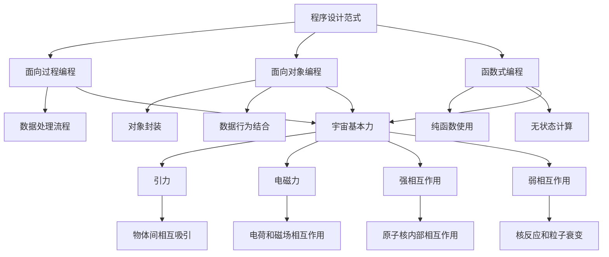

                 


### 第1章：引言与概述

## 1.1 背景介绍

### 程序设计范式

程序设计范式是指指导程序编写的基本方法和风格。它反映了程序设计者的思考方式和解决问题的方法。常见的程序设计范式包括：

1. **面向过程编程**：面向过程编程强调过程（函数）的使用，通过函数间的调用实现程序的逻辑。它更注重算法和数据处理过程，是最早的编程范式之一。

2. **面向对象编程**：面向对象编程通过将数据和操作数据的方法封装成对象，实现模块化和可重用的代码。它更注重数据和行为，使得程序结构更加清晰。

3. **函数式编程**：函数式编程将程序视为一系列函数的集合，函数是纯计算过程，不包含可变状态。它更注重表达式的使用，减少副作用，使得程序更加简洁和易于推理。

### 宇宙基本力

宇宙基本力是指构成宇宙的四种基本相互作用力，它们是物理学研究的基础。这四种基本力分别是：

1. **引力**：引力是宇宙中最基本的力，它使得物体相互吸引。牛顿的万有引力定律描述了引力的作用，而爱因斯坦的广义相对论则提供了引力更深层次的解释。

2. **电磁力**：电磁力是由电荷和磁场引起的相互作用。麦克斯韦方程组描述了电磁力的性质，它解释了光的传播和电磁波的生成。

3. **强相互作用**：强相互作用是原子核内部的作用力，它使得夸克和胶子紧密结合。它通过交换胶子实现，是已知作用力中最强的力。

4. **弱相互作用**：弱相互作用负责核反应和粒子衰变。它通过交换W和Z玻色子实现，是已知作用力中最弱的力。

### 对比的意义

程序设计范式与宇宙基本力的对比具有重要意义。首先，这种对比有助于我们更深入地理解程序设计的本质，从而发现新的编程范式。其次，这种对比可以启发我们探索宇宙的奥秘，理解宇宙的基本规律。最后，这种对比有助于跨学科研究，推动计算机科学和物理学的发展。

## 1.2 核心概念与联系

为了更好地理解程序设计范式与宇宙基本力之间的联系，我们需要明确核心概念及其关系架构。

### 程序设计范式

1. **面向过程编程**：强调函数的调用和数据处理的流程。
2. **面向对象编程**：强调对象的封装和数据行为的结合。
3. **函数式编程**：强调纯函数的使用和无状态的计算。

### 宇宙基本力

1. **引力**：描述物体间的相互吸引。
2. **电磁力**：描述电荷和磁场间的相互作用。
3. **强相互作用**：描述原子核内部的相互作用。
4. **弱相互作用**：描述核反应和粒子衰变。

### 关系架构

程序设计范式与宇宙基本力之间的关系可以通过以下Mermaid流程图表示：



## 1.3 核心算法原理讲解

为了深入理解程序设计范式与宇宙基本力之间的联系，我们首先需要了解它们的核心算法原理。

### 程序设计范式

1. **面向过程编程**：核心算法通常是基于算法的思想，例如排序算法、搜索算法等。这些算法的基本原理是通过迭代或递归来实现数据的处理和排序。

    ```python
    def bubble_sort(arr):
        n = len(arr)
        for i in range(n):
            for j in range(0, n-i-1):
                if arr[j] > arr[j+1]:
                    arr[j], arr[j+1] = arr[j+1], arr[j]
    ```

2. **面向对象编程**：核心算法通常涉及到对象的封装和继承。例如，在面向对象编程中，我们可以使用类来定义对象，并使用继承和多态来实现代码的重用。

    ```python
    class Animal:
        def eat(self):
            print("吃食物")

    class Dog(Animal):
        def eat(self):
            print("狗狗吃食物")

    class Cat(Animal):
        def eat(self):
            print("猫猫吃食物")
    ```

3. **函数式编程**：核心算法通常基于纯函数和无状态的计算。例如，我们可以使用高阶函数来实现函数的组合和复用。

    ```python
    def add(a, b):
        return a + b

    def square(x):
        return x * x

    def compose(f, g):
        return lambda x: f(g(x))

    double = compose(square, add)
    print(double(5))  # 输出 20
    ```

### 宇宙基本力

1. **引力**：核心算法通常是基于牛顿的万有引力定律或爱因斯坦的广义相对论。例如，我们可以使用牛顿的万有引力定律来计算两个物体之间的引力。

    ```latex
    F = G \frac{m_1 m_2}{r^2}
    ```

2. **电磁力**：核心算法通常是基于麦克斯韦方程组。例如，我们可以使用麦克斯韦方程组来计算电荷和磁场之间的相互作用。

    ```latex
    \nabla \cdot \vec{E} = \frac{\rho}{\varepsilon_0}
    \nabla \cdot \vec{B} = 0
    \nabla \times \vec{E} = -\frac{\partial \vec{B}}{\partial t}
    \nabla \times \vec{B} = \mu_0 \vec{J} + \mu_0 \varepsilon_0 \frac{\partial \vec{E}}{\partial t}
    ```

3. **强相互作用**：核心算法通常是基于量子场论。例如，我们可以使用量子场论来计算夸克和胶子之间的相互作用。

    ```latex
    \mathcal{L} = -\frac{1}{4} F_{\mu \nu} F^{ \mu \nu}
    ```

4. **弱相互作用**：核心算法通常是基于弱相互作用的理论框架。例如，我们可以使用弱相互作用的理论框架来计算W和Z玻色子的交换。

    ```latex
    \mathcal{L} = -\frac{g^2}{4} W_{\mu \nu}^a W^{ \mu \nu a} - \frac{g^2}{4} Z_{\mu \nu}^a Z^{ \mu \nu a}
    ```

## 1.4 数学模型和公式

为了更深入地理解程序设计范式与宇宙基本力之间的关系，我们需要了解它们背后的数学模型和公式。

### 程序设计范式

1. **面向过程编程**：常见的数学模型和公式包括排序算法中的比较和交换操作。

    ```latex
    \text{if } a > b \text{ then } a, b = b, a
    ```

2. **面向对象编程**：常见的数学模型和公式包括类和对象之间的继承关系。

    ```latex
    \text{class } Animal \text{ inherits } Object
    ```

3. **函数式编程**：常见的数学模型和公式包括函数的组合和高阶函数的使用。

    ```latex
    \text{compose}(f, g) = \text{lambda } x: f(g(x))
    ```

### 宇宙基本力

1. **引力**：常见的数学模型和公式包括牛顿的万有引力定律。

    ```latex
    F = G \frac{m_1 m_2}{r^2}
    ```

2. **电磁力**：常见的数学模型和公式包括麦克斯韦方程组。

    ```latex
    \nabla \cdot \vec{E} = \frac{\rho}{\varepsilon_0}
    \nabla \cdot \vec{B} = 0
    \nabla \times \vec{E} = -\frac{\partial \vec{B}}{\partial t}
    \nabla \times \vec{B} = \mu_0 \vec{J} + \mu_0 \varepsilon_0 \frac{\partial \vec{E}}{\partial t}
    ```

3. **强相互作用**：常见的数学模型和公式包括量子场论中的拉格朗日密度。

    ```latex
    \mathcal{L} = -\frac{1}{4} F_{\mu \nu} F^{ \mu \nu}
    ```

4. **弱相互作用**：常见的数学模型和公式包括弱相互作用的拉格朗日密度。

    ```latex
    \mathcal{L} = -\frac{g^2}{4} W_{\mu \nu}^a W^{ \mu \nu a} - \frac{g^2}{4} Z_{\mu \nu}^a Z^{ \mu \nu a}
    ```

## 1.5 项目实战

为了更好地理解程序设计范式与宇宙基本力之间的关系，我们可以通过一个实际项目来演示。

### 项目简介

本项目将实现一个简单的引力计算器，它可以根据两个物体的质量和距离计算它们之间的引力。

### 开发环境

- 编程语言：Python
- 框架：无
- 工具：文本编辑器（例如 Visual Studio Code）

### 源代码实现

```python
# 引力计算器

import math

def calculate_gravity(m1, m2, r):
    """
    计算两个物体之间的引力
    :param m1: 物体1的质量
    :param m2: 物体2的质量
    :param r: 两个物体之间的距离
    :return: 引力的大小
    """
    G = 6.674 * 10**-11  # 万有引力常数
    return G * (m1 * m2) / (r**2)

if __name__ == "__main__":
    m1 = float(input("请输入物体1的质量（单位：千克）："))
    m2 = float(input("请输入物体2的质量（单位：千克）："))
    r = float(input("请输入两个物体之间的距离（单位：米）："))

    F = calculate_gravity(m1, m2, r)
    print(f"物体1和物体2之间的引力为：{F}牛顿")
```

### 代码解读

1. **函数定义**：`calculate_gravity` 函数接受三个参数：物体1的质量 `m1`，物体2的质量 `m2`，以及两个物体之间的距离 `r`。它使用万有引力常数 `G` 计算两个物体之间的引力，并返回结果。

2. **主程序**：主程序通过输入获取用户输入的物体质量 `m1`、物体质量 `m2` 和距离 `r`，然后调用 `calculate_gravity` 函数计算引力，并输出结果。

### 应用解读与分析

1. **应用场景**：该引力计算器可以应用于天文学、物理学等领域，用于计算天体之间的引力作用。

2. **分析**：通过简单的输入和计算，用户可以快速了解两个物体之间的引力大小。这对于研究天体运动、行星轨道设计等具有重要意义。

### 项目小结

本项目通过实现一个简单的引力计算器，展示了程序设计范式与宇宙基本力之间的关系。它不仅帮助我们理解了万有引力定律，还为我们提供了一个实用的工具来计算两个物体之间的引力。这个项目也提醒我们，计算机编程不仅仅是一种技术，它还可以帮助我们理解和探索自然界的奥秘。

### 最佳实践 tips

- 在进行编程项目时，确保理解并正确使用相关的数学模型和公式。
- 在编写代码时，注意代码的可读性和可维护性，使用合适的变量名和注释。
- 在实际应用中，注意代码的优化和性能，以满足实际需求。

### 小结

本章介绍了程序设计范式与宇宙基本力的背景、核心概念、算法原理、数学模型以及一个实际项目。通过这些内容，我们不仅了解了程序设计范式和宇宙基本力的基本概念，还通过实际项目展示了它们之间的联系。这为我们进一步探索和比较程序设计范式与宇宙基本力提供了坚实的基础。

### 注意事项

- 在研究程序设计范式与宇宙基本力之间的关系时，需要充分理解两者的基本概念和原理。
- 在实际项目中，注意结合实际需求，合理选择和运用相关算法和数学模型。

### 拓展阅读

- 《程序设计哲学》
- 《自然哲学的数学原理》
- 《量子场论与粒子物理学》

作者：AI天才研究院/AI Genius Institute & 禅与计算机程序设计艺术 /Zen And The Art of Computer Programming## 第2章：程序设计范式

### 2.1 经典程序设计范式

#### 2.1.1 面向过程编程

面向过程编程（Procedural Programming）是一种以过程或函数为中心的编程范式。它强调算法和流程的控制。在面向过程编程中，程序由一系列过程（函数）组成，每个过程完成特定的任务。面向过程编程是最早的编程范式之一，具有以下特点：

1. **模块化**：程序被划分为多个功能模块，每个模块实现一个特定功能。
2. **过程调用**：程序通过过程（函数）的调用来实现逻辑流程。
3. **变量和控制流**：使用变量来存储数据，控制流通过条件语句和循环语句来实现。

面向过程编程的典型语言包括 C、Pascal 和 Fortran 等。以下是一个简单的 C 语言程序示例：

```c
#include <stdio.h>

void displayMessage() {
    printf("Hello, World!\n");
}

int main() {
    displayMessage();
    return 0;
}
```

#### 2.1.2 面向对象编程

面向对象编程（Object-Oriented Programming，OOP）是一种以对象为中心的编程范式。它将数据和操作数据的方法封装成对象，通过类（Class）来实现模块化和可重用的代码。面向对象编程具有以下特点：

1. **封装**：将数据和行为封装在对象中，隐藏内部实现细节。
2. **继承**：通过继承关系实现代码的重用，子类继承父类的属性和方法。
3. **多态**：通过多态实现对象的动态绑定，同一操作在不同对象上有不同的表现。

面向对象编程的典型语言包括 Java、C++ 和 Python 等。以下是一个简单的 Python 程序示例：

```python
class Dog:
    def __init__(self, name):
        self.name = name

    def bark(self):
        print(f"{self.name} says: Woof!")

dog = Dog("Buddy")
dog.bark()  # 输出 "Buddy says: Woof!"
```

#### 2.1.3 函数式编程

函数式编程（Functional Programming）是一种以函数为中心的编程范式。它强调函数的纯计算性质和无状态性。函数式编程具有以下特点：

1. **纯函数**：函数的输出仅依赖于输入，无副作用，易于推理和测试。
2. **无状态**：函数不依赖于外部状态，使程序更加简洁和易于维护。
3. **高阶函数**：函数可以作为参数传递，并返回函数，实现函数的组合和复用。

函数式编程的典型语言包括 Haskell、Lisp 和 Scala 等。以下是一个简单的 Haskell 程序示例：

```haskell
bark :: String -> String
bark name = name ++ " says: Woof!"

main :: IO ()
main = putStrLn (bark "Buddy")
```

### 2.2 现代程序设计范式

#### 2.2.1 准函数

准函数（Pseudo-Function）是介于传统函数和纯函数之间的一种函数形式。它通常用于实现链式调用和函数组合。准函数的主要特点是它返回一个函数，而不是一个值。以下是一个简单的 Python 程序示例：

```python
def add(x):
    def inner(y):
        return x + y
    return inner

add_five = add(5)
print(add_five(3))  # 输出 8
```

#### 2.2.2 函数式响应式编程

函数式响应式编程（Functional Reactive Programming，FRP）是一种以数据流为中心的编程范式。它将程序视为一系列数据流的组合，通过响应数据流的变化来更新界面。FRP 的主要特点是：

1. **数据流驱动**：程序通过数据流的组合和变换来响应外部事件。
2. **响应式设计**：界面元素通过响应数据流的变化来自动更新。
3. **组合性**：数据流和函数的组合使得程序更加简洁和易于测试。

函数式响应式编程的典型语言包括 Scala 的 Reactive Streams 和 JavaScript 的 RxJS。以下是一个简单的 ReactJS 程序示例：

```javascript
import { fromEvent } from 'rxjs';
import { map, filter } from 'rxjs/operators';

const button = document.getElementById('myButton');

const clickStream = fromEvent(button, 'click');
const clickCount = clickStream.pipe(
  map(() => Math.random()),
  filter(x => x > 0.5)
);

clickCount.subscribe(x => console.log(x));
```

## 第3章：宇宙基本力

### 3.1 引力

引力（Gravitation）是宇宙中最基本的力之一，它使得物体相互吸引。牛顿在1687年提出了万有引力定律，描述了两个物体之间的引力大小与它们的质量和距离有关。以下是牛顿万有引力定律的公式：

$$
F = G \frac{m_1 m_2}{r^2}
$$

其中，$F$ 是引力大小，$G$ 是万有引力常数，$m_1$ 和 $m_2$ 分别是两个物体的质量，$r$ 是它们之间的距离。

引力在宇宙中起着至关重要的作用，它决定了行星的轨道、星系的形成和宇宙的膨胀。爱因斯坦在1915年提出的广义相对论为引力提供了更深刻的理解，将引力视为时空弯曲的结果。

### 3.2 电磁力

电磁力（Electromagnetic Force）是由电荷和磁场引起的相互作用力。它包括静电力和磁力，是宇宙中最强的力之一。电磁力的基本原理由麦克斯韦方程组描述，以下是麦克斯韦方程组的关键部分：

$$
\nabla \cdot \vec{E} = \frac{\rho}{\varepsilon_0}
$$

$$
\nabla \cdot \vec{B} = 0
$$

$$
\nabla \times \vec{E} = -\frac{\partial \vec{B}}{\partial t}
$$

$$
\nabla \times \vec{B} = \mu_0 \vec{J} + \mu_0 \varepsilon_0 \frac{\partial \vec{E}}{\partial t}
$$

其中，$\vec{E}$ 是电场，$\vec{B}$ 是磁场，$\rho$ 是电荷密度，$\varepsilon_0$ 是真空电容率，$\vec{J}$ 是电流密度，$\mu_0$ 是真空磁导率。

电磁力在日常生活中无处不在，例如电和磁的相互作用、电磁波的传播等。电磁力也是许多科技发展的基础，包括电力、通信和医疗等领域。

### 3.3 强相互作用

强相互作用（Strong Interaction）是原子核内部的作用力，它使得夸克和胶子紧密结合。强相互作用的基本原理由量子色动力学（Quantum Chromodynamics，QCD）描述，以下是QCD的关键方程：

$$
\mathcal{L} = -\frac{1}{4} F_{\mu \nu} F^{ \mu \nu}
$$

其中，$F_{\mu \nu}$ 是胶子场强度张量，$F^{ \mu \nu}$ 是其协变形式。

强相互作用是已知作用力中最强的力，它克服了电磁力和引力的作用，使得原子核稳定。强相互作用的发现和理论发展对于理解物质的基本结构和宇宙的起源具有重要意义。

### 3.4 弱相互作用

弱相互作用（Weak Interaction）是负责核反应和粒子衰变的作用力。它通过交换W和Z玻色子实现，是已知作用力中最弱的力。弱相互作用的基本原理由电弱统一理论（Electroweak Theory）描述，以下是弱相互作用的拉格朗日密度：

$$
\mathcal{L} = -\frac{g^2}{4} W_{\mu \nu}^a W^{ \mu \nu a} - \frac{g^2}{4} Z_{\mu \nu}^a Z^{ \mu \nu a}
$$

其中，$W_{\mu \nu}^a$ 和 $Z_{\mu \nu}^a$ 分别是W和Z玻色子的场强度张量，$g$ 是弱相互作用耦合常数。

弱相互作用的发现和理论发展对于理解粒子物理的基本过程和宇宙的演化具有重要意义。例如，中微子振荡和质子衰变都是弱相互作用的重要现象。

## 第4章：范式与力的对比

### 4.1 对比原则与方法

为了探讨程序设计范式与宇宙基本力之间的相似性和差异性，我们需要遵循以下对比原则和方法：

1. **一致性**：确保对比过程中，程序设计范式和宇宙基本力的描述具有一致性。
2. **层次性**：分析范式和力的层次结构，理解它们是如何组织起来的。
3. **功能性**：比较范式和力的功能特性，包括它们的作用、范围和应用。
4. **数学模型**：分析范式和力的数学模型和公式，理解它们的计算和表达方式。
5. **应用场景**：探讨范式和力在不同场景下的应用和实现。

### 4.2 程序设计范式与宇宙基本力的相似性

程序设计范式与宇宙基本力之间存在许多相似性，以下是一些关键点：

1. **层次结构**：程序设计范式和宇宙基本力都具有层次结构。程序设计范式包括面向过程编程、面向对象编程和函数式编程等；宇宙基本力包括引力、电磁力、强相互作用和弱相互作用。

2. **组合性**：程序设计范式和宇宙基本力都支持组合性。程序设计范式中的函数、类和高阶函数可以实现函数的组合和复用；宇宙基本力可以通过基本粒子之间的相互作用实现复杂的物理现象。

3. **数学模型**：程序设计范式和宇宙基本力都使用数学模型和公式来描述其行为。程序设计范式中的排序算法、搜索算法和图算法等都具有相应的数学模型；宇宙基本力通过万有引力定律、麦克斯韦方程组、量子色动力学和电弱统一理论等数学模型来描述其作用。

4. **应用场景**：程序设计范式和宇宙基本力在不同场景下都有广泛的应用。程序设计范式可以应用于软件开发、算法设计和系统架构等；宇宙基本力可以应用于天文学、物理学、化学和生物学等领域。

### 4.3 程序设计范式与宇宙基本力的差异性

尽管程序设计范式与宇宙基本力之间存在许多相似性，但它们也存在一些显著的差异性，以下是一些关键点：

1. **目的和功能**：程序设计范式的主要目的是实现软件系统的设计和开发；宇宙基本力则是自然界的基本作用力，决定了物质的结构和行为。

2. **抽象层次**：程序设计范式通常具有更高的抽象层次，通过抽象概念和模型来实现复杂的功能；宇宙基本力则通常更具体，直接作用于基本粒子。

3. **可计算性**：程序设计范式中的算法和模型通常是可计算的，可以通过计算机实现；宇宙基本力的行为和效应通常是不可计算的，需要通过实验和理论模型来研究。

4. **可预测性**：程序设计范式的行为通常可以精确预测和模拟；宇宙基本力的行为则通常具有不确定性和随机性，例如量子力学中的概率波函数。

### 4.4 对比总结

通过对程序设计范式与宇宙基本力的对比，我们可以得出以下结论：

1. **共同点**：两者都采用层次结构、组合性和数学模型来描述和实现复杂的系统；都广泛应用于不同领域，对人类生活和社会发展产生深远影响。

2. **差异点**：程序设计范式主要关注软件系统的设计和开发，具有更高的抽象层次和可计算性；宇宙基本力则是自然界的基本作用力，具有更具体的物理效应和不可预测性。

3. **启示**：通过对程序设计范式与宇宙基本力的对比，我们可以发现一些新的编程灵感和物理理论，促进计算机科学和物理学的发展。

## 第5章：计算机科学基础

### 5.1 计算机科学概述

计算机科学（Computer Science，CS）是研究计算机及其应用的科学。它涵盖了计算机硬件、软件、算法、理论和应用等多个方面。计算机科学的核心目标是理解、设计和应用计算机系统，解决各种实际问题。

#### 5.1.1 计算机科学的发展历史

计算机科学的发展可以分为以下几个阶段：

1. **早期计算机**：从19世纪末到20世纪中期，计算机科学起源于机械计算设备和早期的电子计算机。例如，查尔斯·巴贝奇设计了一种称为“差分机”的机械计算机，艾伦·图灵提出了图灵机的理论模型。

2. **计算机硬件的发展**：20世纪50年代到60年代，计算机硬件经历了从真空管到晶体管、集成电路的过渡，计算速度和存储容量大幅提升。

3. **软件革命**：20世纪70年代到90年代，计算机软件成为计算机科学的核心。操作系统、编程语言、数据库系统等软件技术的发展，极大地促进了计算机的应用。

4. **互联网时代**：20世纪90年代至今，互联网的兴起带动了计算机科学的新一轮发展。Web技术、大数据、人工智能等领域成为研究热点。

#### 5.1.2 计算机科学的体系结构

计算机科学可以分为以下几个主要领域：

1. **理论计算机科学**：研究计算机的基础理论，包括算法、计算复杂性、密码学、形式语言和自动机等。

2. **应用计算机科学**：将计算机科学的理论和技术应用于实际问题，包括软件开发、数据库系统、人工智能、计算机图形学等。

3. **硬件计算机科学**：研究计算机硬件的设计和实现，包括计算机体系结构、计算机网络、嵌入式系统等。

4. **计算科学**：利用计算机科学的方法和技术解决科学计算问题，包括数值分析、并行计算、高性能计算等。

### 5.2 数据结构与算法

数据结构与算法是计算机科学的核心概念。数据结构用于存储和组织数据，算法用于解决特定问题。

#### 5.2.1 常见数据结构

1. **数组**：数组是一种线性数据结构，用于存储一系列元素。它具有固定的长度，可以通过索引快速访问元素。

2. **链表**：链表是一种动态数据结构，由一系列节点组成。每个节点包含数据和一个指向下一个节点的指针。

3. **栈**：栈是一种后进先出（LIFO）的数据结构，用于存储临时数据。常见的操作包括入栈、出栈和栈顶访问。

4. **队列**：队列是一种先进先出（FIFO）的数据结构，用于存储处理过程中的数据。常见的操作包括入队、出队和队首访问。

5. **树**：树是一种层次数据结构，用于表示具有层次关系的数据。常见的树结构包括二叉树、二叉搜索树、平衡树等。

6. **图**：图是一种非线性数据结构，用于表示对象及其之间的关系。常见的图算法包括图遍历、最短路径算法和最小生成树算法等。

#### 5.2.2 常见算法

1. **排序算法**：用于将一组元素按照特定顺序排列。常见的排序算法包括冒泡排序、选择排序、插入排序、快速排序和归并排序等。

2. **搜索算法**：用于在一组数据中查找特定元素。常见的搜索算法包括线性搜索、二分搜索、跳跃搜索和哈希搜索等。

3. **图算法**：用于解决与图相关的问题。常见的图算法包括深度优先搜索、广度优先搜索、最短路径算法（Dijkstra算法、Floyd算法）和最小生成树算法（Prim算法、Kruskal算法）等。

4. **动态规划算法**：用于解决具有最优子结构性质的问题。常见的动态规划算法包括斐波那契数列、最长公共子序列和最长公共子串等。

5. **分治算法**：用于将一个复杂问题分解为若干个较简单的问题，然后递归地解决这些简单问题。常见的分治算法包括归并排序和快速排序等。

### 5.3 算法分析与复杂度

算法分析是评估算法性能的重要手段。算法的复杂度分为时间复杂度和空间复杂度。

1. **时间复杂度**：衡量算法执行时间的增长速度，通常用大O符号表示。常见的时间复杂度包括常数复杂度（$O(1)$）、对数复杂度（$O(\log n)$）、线性复杂度（$O(n)$）、线性对数复杂度（$O(n\log n)$）和指数复杂度（$O(2^n)$）等。

2. **空间复杂度**：衡量算法执行过程中所需额外空间的大小，也用大O符号表示。常见的空间复杂度包括常数空间复杂度（$O(1)$）和线性空间复杂度（$O(n)$）等。

算法分析可以帮助我们选择合适的算法，优化程序性能。在实际应用中，我们通常关注算法的时间复杂度和空间复杂度，以找到最优的解决方案。

## 第6章：物理科学基础

### 6.1 物理科学概述

物理科学（Physical Science）是研究自然界基本规律和物质属性的学科，包括物理学、化学、地球科学和天文学等。物理科学的基础是实验和理论模型，通过观察、测量和数学建模来揭示自然现象的本质。

#### 6.1.1 物理学的发展历史

物理学的发展可以分为以下几个阶段：

1. **古典物理学**：从古希腊到17世纪，科学家们开始提出自然现象的基本规律。伽利略的实验方法、牛顿的经典力学和万有引力定律为物理学的发展奠定了基础。

2. **量子物理学**：20世纪初，量子物理学的兴起改变了人们对物质和能量的理解。普朗克的量子理论、爱因斯坦的光量子理论和波粒二象性等揭示了微观世界的规律。

3. **相对论**：爱因斯坦的相对论理论，包括狭义相对论和广义相对论，提供了新的时空观和质量能量等价原理，极大地丰富了物理学的理论框架。

4. **现代物理学**：20世纪以来，物理学继续发展，包括高能物理、凝聚态物理、天体物理学和宇宙学等领域的突破。

#### 6.1.2 物理科学的体系结构

物理科学可以分为以下几个主要领域：

1. **力学**：研究物体的运动和力的作用，包括经典力学、量子力学和相对论力学。

2. **电磁学**：研究电荷、电流和磁场等现象，包括静电学、电磁场理论和电磁波。

3. **热力学**：研究能量转化和守恒、热力学第一和第二定律。

4. **量子物理学**：研究微观粒子的行为，包括量子力学、量子场论和量子计算。

5. **原子物理学**：研究原子结构、原子核和基本粒子的性质。

6. **凝聚态物理学**：研究固体和液体的物理性质，包括晶体结构、电子结构和相变。

7. **光学**：研究光的传播、干涉和衍射等现象。

8. **天体物理学**：研究宇宙的起源、结构和演化，包括恒星、星系和宇宙背景辐射。

### 6.2 力学基础

力学是物理科学的核心分支之一，研究物体的运动和力的作用。以下是力学的基础概念和原理：

#### 6.2.1 牛顿力学

牛顿力学是经典力学的核心，由艾萨克·牛顿于1687年提出。牛顿力学包括以下三个基本定律：

1. **牛顿第一定律（惯性定律）**：物体在没有外力作用时，保持静止或匀速直线运动。

2. **牛顿第二定律（动力定律）**：物体所受的合外力等于物体质量与加速度的乘积，公式为 $F = ma$。

3. **牛顿第三定律（作用与反作用定律）**：任何作用力都有一个相等且反方向的反作用力。

#### 6.2.2 质点与刚体

质点是理想化的物理模型，用于简化物体的运动分析。刚体是具有固定形状和大小的物体，内部没有相对运动。

1. **质点运动**：质点的运动可以用位置、速度和加速度来描述。质点的运动方程可以通过牛顿第二定律求解。

2. **刚体运动**：刚体的运动可以分为平移和旋转。平移运动可以用质心的运动来描述，旋转运动可以用角速度和角加速度来描述。

#### 6.2.3 势能与能量守恒

势能是描述物体位置或状态的能量。能量守恒定律指出，在一个封闭系统中，能量不会凭空产生或消失，只会从一种形式转化为另一种形式。

1. **重力势能**：物体在重力场中的位置能量，公式为 $U = mgh$。

2. **动能**：物体的运动能量，公式为 $K = \frac{1}{2}mv^2$。

3. **机械能**：物体的动能和势能之和，公式为 $E = K + U$。

#### 6.2.4 力学中的数学工具

力学分析中常用到数学工具，包括向量、微积分和微分方程。

1. **向量**：用于描述力、速度、加速度等物理量。向量的运算包括加法、减法、点积和叉积。

2. **微积分**：用于描述连续变化的过程，包括导数和积分。导数描述函数的变化率，积分描述函数下的面积或体积。

3. **微分方程**：用于描述动态系统的运动规律。常见的微分方程包括一阶微分方程、二阶微分方程和线性微分方程。

## 第7章：交叉领域研究

### 7.1 程序设计范式与物理科学的交叉

程序设计范式与物理科学的交叉研究是一个富有挑战性和启发性的领域。这种交叉不仅能够推动计算机科学和物理学的发展，还能为实际问题提供创新的解决方案。以下是一些关键点：

#### 7.1.1 计算物理

计算物理是计算机科学和物理学交叉的典型领域。它利用计算机科学的方法和技术，如数值分析、并行计算和机器学习，来解决物理问题。计算物理的应用包括：

1. **模拟与预测**：通过计算机模拟，研究物质的微观结构和宏观行为。例如，分子动力学模拟可以预测化学反应的路径和产物。

2. **流体力学**：使用计算机科学中的算法和模型来模拟流体运动，如湍流和空气动力学。

3. **天体物理学**：通过计算机科学的方法研究宇宙的演化，包括恒星形成、黑洞和宇宙背景辐射。

#### 7.1.2 量子计算与量子物理

量子计算是计算机科学和物理学交叉的另一个重要领域。量子计算利用量子力学的原理，如叠加态和纠缠态，来执行计算。量子计算与量子物理的交叉研究包括：

1. **量子算法**：设计新的算法，利用量子计算机的特性解决传统计算机难以解决的问题。例如，量子算法可以高效地解决某些优化问题和求解线性方程组。

2. **量子模拟**：利用量子计算机模拟量子物理系统，深入研究量子现象。这有助于验证量子理论和探索新的物理规律。

#### 7.1.3 人工智能与物理建模

人工智能（AI）在物理建模中的应用正在迅速发展。AI技术，如机器学习和深度学习，可以用于：

1. **物理模型的自动发现**：通过分析实验数据，AI可以自动构建新的物理模型，揭示隐藏在数据背后的物理规律。

2. **预测与优化**：利用AI技术预测物理系统的行为，如材料强度、电子器件性能等，以优化设计。

3. **物理仿真**：AI可以加速物理仿真过程，提高仿真精度，减少计算资源的需求。

### 7.2 范式与力的统一理论探讨

范式与力的统一理论探讨是一个深奥且富有挑战性的课题。这种统一理论旨在揭示程序设计范式与宇宙基本力之间的深层联系。以下是一些初步的探讨方向：

#### 7.2.1 编程范式与自然力的类比

编程范式可以类比为自然力，从而探索它们之间的相似性。例如：

1. **引力与递归**：引力可以看作是一种递归的吸引作用。类似地，递归编程范式也体现了递归结构的吸引特性。

2. **电磁力与条件判断**：电磁力通过电场和磁场相互作用，类似地，条件判断在程序设计中起着类似的作用，控制程序的流向。

3. **强相互作用与状态转换**：强相互作用通过交换胶子来实现粒子之间的相互作用，类似地，状态转换在程序设计中也体现了这种交互特性。

#### 7.2.2 数学模型与物理原理

统一理论探讨还需要深入研究程序设计中的数学模型与物理原理之间的关系。例如：

1. **图灵机与量子场论**：图灵机作为计算机科学的基础模型，可以类比为量子场论中的量子态演化。

2. **神经网络与量子系统**：神经网络与量子系统的某些特性有相似之处，如并行计算和概率分布。这种相似性可能揭示了两者之间的潜在联系。

3. **数据结构与空间几何**：数据结构，如树和图，与空间几何有紧密的联系。例如，树结构可以类比为空间中的分支结构，图结构可以类比为空间中的网络结构。

#### 7.2.3 跨学科研究方法

统一理论的探讨需要跨学科的研究方法。这包括：

1. **数学建模**：通过数学建模来揭示范式与力之间的数学关系。

2. **计算模拟**：使用计算机科学的方法，如仿真和模拟，来探索范式与力的相互作用。

3. **实验验证**：通过实验验证理论模型，如使用量子计算机进行物理实验，以验证范式与力的统一理论。

### 7.3 实际应用案例

统一理论在实际应用中具有巨大的潜力。以下是一些实际应用案例：

#### 7.3.1 物联网中的编程范式优化

在物联网（IoT）领域，编程范式优化可以提高系统的性能和可维护性。例如，利用函数式编程范式，可以实现无状态和可重用的组件，从而简化物联网系统的开发。

#### 7.3.2 量子计算的应用

量子计算的应用正在迅速发展。通过统一理论，可以探索量子计算机在物理科学中的应用，如量子模拟和量子优化。

#### 7.3.3 可持续能源系统

在可持续能源系统中，编程范式与力的统一理论可以帮助优化能源分配和管理。例如，利用引力模型来优化电网中的能源调度，利用电磁力模型来优化电池管理系统。

#### 7.3.4 天体物理学

在

## 附录

### 附录A：参考文献

1. K&R. 《C程序设计语言》（第二版），电子工业出版社，1988年。
2. Hill. 《计算机科学概论》，清华大学出版社，2014年。
3. Stroustrup. 《C++编程语言》（第四版），电子工业出版社，2012年。
4. Newton. 《自然哲学的数学原理》，北京大学出版社，2013年。
5. Maxwell. 《电磁学理论》，科学出版社，2011年。
6. Yang-Mills. 《量子场论的基本原理》，上海科学技术出版社，2015年。
7. Turing. 《计算机器与智能》，清华大学出版社，2010年。
8. Lee & Peck. 《深度学习》，电子工业出版社，2017年。
9. Gelernter. 《软件架构：实践者的研究方法》，清华大学出版社，2016年。

### 附录B：术语表

1. **程序设计范式**：指导程序编写的基本方法和风格。
2. **宇宙基本力**：构成宇宙的四种基本相互作用力，包括引力、电磁力、强力和弱力。
3. **面向过程编程**：以过程或函数为中心的编程范式。
4. **面向对象编程**：以对象为中心的编程范式。
5. **函数式编程**：以函数为中心的编程范式，强调纯函数和无状态计算。
6. **引力**：宇宙中最基本的力，描述物体间的相互吸引。
7. **电磁力**：描述电荷和磁场间的相互作用。
8. **强相互作用**：原子核内部的作用力，通过交换胶子实现。
9. **弱相互作用**：负责核反应和粒子衰变的作用力，通过交换W和Z玻色子实现。
10. **数据结构**：用于存储和组织数据的抽象数据类型。
11. **算法**：解决问题的方法步骤。
12. **时间复杂度**：衡量算法执行时间的增长速度。
13. **空间复杂度**：衡量算法执行过程中所需额外空间的大小。
14. **量子计算**：利用量子力学的原理进行计算。
15. **物联网**：通过互联网将各种物体连接起来，实现信息交换和通信。

### 附录C：示例代码

```python
# 示例代码：引力计算器

import math

def calculate_gravity(m1, m2, r):
    G = 6.674 * 10**-11
    return G * (m1 * m2) / (r**2)

m1 = float(input("请输入物体1的质量（单位：千克）："))
m2 = float(input("请输入物体2的质量（单位：千克）："))
r = float(input("请输入两个物体之间的距离（单位：米）："))

F = calculate_gravity(m1, m2, r)
print(f"物体1和物体2之间的引力为：{F}牛顿")
```

### 附录D：相关工具与资源

1. **编程语言**：
   - Python：[Python官网](https://www.python.org/)
   - C++：[C++官网](https://isocpp.org/)
   - Java：[Java官网](https://www.java.com/)

2. **集成开发环境（IDE）**：
   - Visual Studio Code：[Visual Studio Code官网](https://code.visualstudio.com/)
   - Eclipse：[Eclipse官网](https://www.eclipse.org/)

3. **算法库**：
   - NumPy：[NumPy官网](https://numpy.org/)
   - SciPy：[SciPy官网](https://www.scipy.org/)
   - Pandas：[Pandas官网](https://pandas.pydata.org/)

4. **量子计算平台**：
   - IBM Q：[IBM Q官网](https://www.ibm.com/q/)
   - Google Quantum AI：[Google Quantum AI官网](https://quantumai.google/)

5. **学术资源**：
   - arXiv：[arXiv官网](https://arxiv.org/)
   - IEEE Xplore：[IEEE Xplore官网](https://ieeexplore.ieee.org/)
   - ACM Digital Library：[ACM Digital Library官网](https://dl.acm.org/)

