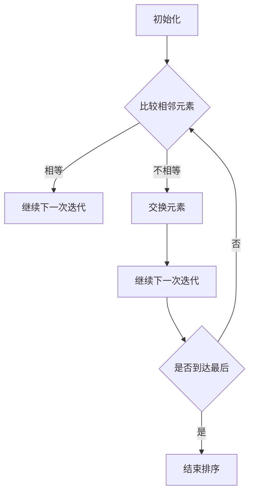

                 

### 第一步：分析书名

《程序设计范式与宇宙对称性的对比》这个书名直接表明了本书的两个核心概念：程序设计范式和宇宙对称性。首先，我们需要理解这两个概念的具体含义和背景。

**程序设计范式** 是指编程中常用的方法或框架，比如面向过程、面向对象、函数式编程等。每种范式都有其独特的逻辑结构和设计原则，适用于不同的编程场景和问题解决方法。

**宇宙对称性** 是物理学中的一个重要概念，指物质和能量的空间分布在某些变换下保持不变的性质。对称性在量子力学、相对论等物理学理论中占据核心地位，并且与守恒定律有着密切的联系。

### 第二步：确定书籍结构

根据书名和目标读者，我们可以初步确定书籍的结构。本书将分为以下几个部分：

1. **引言**：介绍程序设计范式和宇宙对称性的基本概念，为后续内容打下基础。
2. **程序设计范式**：详细探讨经典和现代的程序设计范式，包括其核心概念、算法原理和应用实例。
3. **宇宙对称性**：深入讨论宇宙对称性的基本理论，其在量子力学和宇宙学中的应用。
4. **范式与对称性的对比分析**：分析程序设计范式和宇宙对称性之间的相似性和差异性。

### 第三步：细化目录结构

在确定了书籍的大致结构后，我们可以进一步细化目录，确保每个部分都有详细的章节。

#### 引入部分

- **1.1 范式与对称性的基本概念**
  - 1.1.1 程序设计范式的定义与分类
  - 1.1.2 宇宙对称性的概念与意义
  - 1.1.3 范式与对称性的联系与区别
- **1.2 本书结构概述**
  - 1.2.1 本书的主要内容
  - 1.2.2 阅读对象与学习目标

#### 程序设计范式

- **2.1 经典程序设计范式**
  - 2.1.1 面向过程范式
    - 2.1.1.1 概念与历史
    - 2.1.1.2 代表性算法
    - 2.1.1.3 优缺点分析
  - 2.1.2 面向对象范式
    - 2.1.2.1 概念与历史
    - 2.1.2.2 代表性算法
    - 2.1.2.3 优缺点分析
- **2.2 现代程序设计范式**
  - 2.2.1 函数式范式
    - 2.2.1.1 概念与历史
    - 2.2.1.2 代表性算法
    - 2.2.1.3 优缺点分析
  - 2.2.2 声明式范式
    - 2.2.2.1 概念与历史
    - 2.2.2.2 代表性算法
    - 2.2.2.3 优缺点分析
- **2.3 程序设计范式演进与未来趋势**
  - 2.3.1 范式演进的驱动力
  - 2.3.2 跨范式编程的挑战与机遇
  - 2.3.3 未来程序设计范式展望

#### 宇宙对称性

- **3.1 宇宙对称性的基本理论**
  - 3.1.1 宇称对称性
    - 3.1.1.1 概念与历史
    - 3.1.1.2 代表性理论
    - 3.1.1.3 应用实例
  - 3.1.2 角动量对称性
    - 3.1.2.1 概念与历史
    - 3.1.2.2 代表性理论
    - 3.1.2.3 应用实例
- **3.2 宇宙对称性与量子力学**
  - 3.2.1 对称性在量子力学中的作用
  - 3.2.2 守恒定律与对称性
  - 3.2.3 对称性破缺现象
- **3.3 宇宙对称性与宇宙学**
  - 3.3.1 宇称对称性在宇宙学中的应用
  - 3.3.2 角动量对称性在宇宙学中的应用
  - 3.3.3 对称性破缺与宇宙演化

#### 范式与对称性的对比分析

- **4.1 程序设计范式与宇宙对称性的相似性**
  - 4.1.1 模式识别的相似性
  - 4.1.2 对称性优化的相似性
  - 4.1.3 守恒定律的相似性
- **4.2 程序设计范式与宇宙对称性的差异性**
  - 4.2.1 范式的动态性与对称性的静态性
  - 4.2.2 程序设计的实用性与宇宙对称性的纯粹性
  - 4.2.3 对称性破缺与程序设计中的冗余

### 第四步：撰写1级目录

根据细化后的目录结构，我们可以开始撰写1级目录，这将是书籍的概述。

```
# 《程序设计范式与宇宙对称性的对比》

> 关键词：程序设计范式、宇宙对称性、对比分析、量子力学、宇宙学

> 摘要：本书通过深入探讨程序设计范式和宇宙对称性的基本概念、理论及应用，对比分析两者之间的相似性和差异性，旨在为读者提供对这两个领域的全面理解和深入洞察。

## 第一部分：引言

### 1.1 范式与对称性的基本概念

#### 1.1.1 程序设计范式的定义与分类

#### 1.1.2 宇宙对称性的概念与意义

#### 1.1.3 范式与对称性的联系与区别

### 1.2 本书结构概述

#### 1.2.1 本书的主要内容

#### 1.2.2 阅读对象与学习目标

## 第二部分：程序设计范式

### 2.1 经典程序设计范式

#### 2.1.1 面向过程范式

#### 2.1.2 面向对象范式

### 2.2 现代程序设计范式

#### 2.2.1 函数式范式

#### 2.2.2 声明式范式

### 2.3 程序设计范式演进与未来趋势

#### 2.3.1 范式演进的驱动力

#### 2.3.2 跨范式编程的挑战与机遇

#### 2.3.3 未来程序设计范式展望

## 第三部分：宇宙对称性

### 3.1 宇宙对称性的基本理论

#### 3.1.1 宇称对称性

#### 3.1.2 角动量对称性

### 3.2 宇宙对称性与量子力学

#### 3.2.1 对称性在量子力学中的作用

#### 3.2.2 守恒定律与对称性

#### 3.2.3 对称性破缺现象

### 3.3 宇宙对称性与宇宙学

#### 3.3.1 宇称对称性在宇宙学中的应用

#### 3.3.2 角动量对称性在宇宙学中的应用

#### 3.3.3 对称性破缺与宇宙演化

## 第四部分：范式与对称性的对比分析

### 4.1 程序设计范式与宇宙对称性的相似性

#### 4.1.1 模式识别的相似性

#### 4.1.2 对称性优化的相似性

#### 4.1.3 守恒定律的相似性

### 4.2 程序设计范式与宇宙对称性的差异性

#### 4.2.1 范式的动态性与对称性的静态性

#### 4.2.2 程序设计的实用性与宇宙对称性的纯粹性

#### 4.2.3 对称性破缺与程序设计中的冗余
```

### 第五步：撰写2级目录

在1级目录的基础上，我们可以进一步细化，撰写2级目录，这将对每个部分的核心内容进行详细划分。

#### 第二部分：程序设计范式

- **2.1 经典程序设计范式**
  - 2.1.1 面向过程范式
    - 2.1.1.1 概念与历史
    - 2.1.1.2 代表性算法
    - 2.1.1.3 优缺点分析
  - 2.1.2 面向对象范式
    - 2.1.2.1 概念与历史
    - 2.1.2.2 代表性算法
    - 2.1.2.3 优缺点分析
- **2.2 现代程序设计范式**
  - 2.2.1 函数式范式
    - 2.2.1.1 概念与历史
    - 2.2.1.2 代表性算法
    - 2.2.1.3 优缺点分析
  - 2.2.2 声明式范式
    - 2.2.2.1 概念与历史
    - 2.2.2.2 代表性算法
    - 2.2.2.3 优缺点分析
- **2.3 程序设计范式演进与未来趋势**
  - 2.3.1 范式演进的驱动力
  - 2.3.2 跨范式编程的挑战与机遇
  - 2.3.3 未来程序设计范式展望

#### 第三部分：宇宙对称性

- **3.1 宇宙对称性的基本理论**
  - 3.1.1 宇称对称性
    - 3.1.1.1 概念与历史
    - 3.1.1.2 代表性理论
    - 3.1.1.3 应用实例
  - 3.1.2 角动量对称性
    - 3.1.2.1 概念与历史
    - 3.1.2.2 代表性理论
    - 3.1.2.3 应用实例
- **3.2 宇宙对称性与量子力学**
  - 3.2.1 对称性在量子力学中的作用
  - 3.2.2 守恒定律与对称性
  - 3.2.3 对称性破缺现象
- **3.3 宇宙对称性与宇宙学**
  - 3.3.1 宇称对称性在宇宙学中的应用
  - 3.3.2 角动量对称性在宇宙学中的应用
  - 3.3.3 对称性破缺与宇宙演化

#### 第四部分：范式与对称性的对比分析

- **4.1 程序设计范式与宇宙对称性的相似性**
  - 4.1.1 模式识别的相似性
  - 4.1.2 对称性优化的相似性
  - 4.1.3 守恒定律的相似性
- **4.2 程序设计范式与宇宙对称性的差异性**
  - 4.2.1 范式的动态性与对称性的静态性
  - 4.2.2 程序设计的实用性与宇宙对称性的纯粹性
  - 4.2.3 对称性破缺与程序设计中的冗余

### 第六步：撰写3级目录

在2级目录的基础上，我们可以进一步细化，撰写3级目录，这将对每个章节的细节进行详细划分。

#### 第二部分：程序设计范式

- **2.1 经典程序设计范式**
  - 2.1.1 面向过程范式
    - 2.1.1.1 概念与历史
      - 2.1.1.1.1 什么是面向过程
      - 2.1.1.1.2 面向过程范式的历史发展
    - 2.1.1.2 代表性算法
      - 2.1.1.2.1 排序算法（如冒泡排序、选择排序等）
      - 2.1.1.2.2 查找算法（如二分查找）
    - 2.1.1.3 优缺点分析
      - 2.1.1.3.1 优点
      - 2.1.1.3.2 缺点
  - 2.1.2 面向对象范式
    - 2.1.2.1 概念与历史
      - 2.1.2.1.1 什么是面向对象
      - 2.1.2.1.2 面向对象范式的历史发展
    - 2.1.2.2 代表性算法
      - 2.1.2.2.1 类与对象
      - 2.1.2.2.2 继承与多态
    - 2.1.2.3 优缺点分析
      - 2.1.2.3.1 优点
      - 2.1.2.3.2 缺点

- **2.2 现代程序设计范式**
  - 2.2.1 函数式范式
    - 2.2.1.1 概念与历史
      - 2.2.1.1.1 什么是函数式编程
      - 2.2.1.1.2 函数式编程的历史发展
    - 2.2.1.2 代表性算法
      - 2.2.1.2.1 高阶函数
      - 2.2.1.2.2 柯里化
    - 2.2.1.3 优缺点分析
      - 2.2.1.3.1 优点
      - 2.2.1.3.2 缺点
  - 2.2.2 声明式范式
    - 2.2.2.1 概念与历史
      - 2.2.2.1.1 什么是声明式编程
      - 2.2.2.1.2 声明式编程的历史发展
    - 2.2.2.2 代表性算法
      - 2.2.2.2.1 表达式引擎
      - 2.2.2.2.2 数据绑定
    - 2.2.2.3 优缺点分析
      - 2.2.2.3.1 优点
      - 2.2.2.3.2 缺点

- **2.3 程序设计范式演进与未来趋势**
  - 2.3.1 范式演进的驱动力
    - 2.3.1.1 技术发展的推动
    - 2.3.1.2 应用场景的变化
  - 2.3.2 跨范式编程的挑战与机遇
    - 2.3.2.1 跨范式编程的意义
    - 2.3.2.2 跨范式编程的挑战
    - 2.3.2.3 跨范式编程的机遇
  - 2.3.3 未来程序设计范式展望
    - 2.3.3.1 潜在的新范式
    - 2.3.3.2 程序设计范式的未来趋势

#### 第三部分：宇宙对称性

- **3.1 宇宙对称性的基本理论**
  - 3.1.1 宇称对称性
    - 3.1.1.1 概念与历史
      - 3.1.1.1.1 宇称对称性的定义
      - 3.1.1.1.2 宇称对称性的历史发展
    - 3.1.1.2 代表性理论
      - 3.1.1.2.1 同位旋对称性
      - 3.1.1.2.2 宇称守恒定律
    - 3.1.1.3 应用实例
      - 3.1.1.3.1 宇称对称性在粒子物理学中的应用
      - 3.1.1.3.2 宇称对称性在化学反应中的应用
  - 3.1.2 角动量对称性
    - 3.1.2.1 概念与历史
      - 3.1.2.1.1 角动量对称性的定义
      - 3.1.2.1.2 角动量对称性的历史发展
    - 3.1.2.2 代表性理论
      - 3.1.2.2.1 角动量守恒定律
      - 3.1.2.2.2 角动量量子化
    - 3.1.2.3 应用实例
      - 3.1.2.3.1 角动量对称性在量子力学中的应用
      - 3.1.2.3.2 角动量对称性在原子物理中的应用

- **3.2 宇宙对称性与量子力学**
  - 3.2.1 对称性在量子力学中的作用
    - 3.2.1.1 对称性与守恒定律
    - 3.2.1.2 对称性在量子态表示中的应用
    - 3.2.1.3 对称性在量子计算中的应用
  - 3.2.2 守恒定律与对称性
    - 3.2.2.1 守恒定律的定义
    - 3.2.2.2 对称性与守恒定律的关系
    - 3.2.2.3 守恒定律在量子力学中的应用
  - 3.2.3 对称性破缺现象
    - 3.2.3.1 对称性破缺的定义
    - 3.2.3.2 对称性破缺的类型
    - 3.2.3.3 对称性破缺的物理意义

- **3.3 宇宙对称性与宇宙学**
  - 3.3.1 宇称对称性在宇宙学中的应用
    - 3.3.1.1 宇称对称性与宇宙大爆炸理论
    - 3.3.1.2 宇称对称性与暗物质
    - 3.3.1.3 宇称对称性与宇宙微波背景辐射
  - 3.3.2 角动量对称性在宇宙学中的应用
    - 3.3.2.1 角动量对称性与宇宙旋转
    - 3.3.2.2 角动量对称性与宇宙膨胀
    - 3.3.2.3 角动量对称性与引力波
  - 3.3.3 对称性破缺与宇宙演化
    - 3.3.3.1 对称性破缺与宇宙早期状态
    - 3.3.3.2 对称性破缺与宇宙结构形成
    - 3.3.3.3 对称性破缺与宇宙未来

#### 第四部分：范式与对称性的对比分析

- **4.1 程序设计范式与宇宙对称性的相似性**
  - 4.1.1 模式识别的相似性
    - 4.1.1.1 程序设计范式中的模式识别
    - 4.1.1.2 宇宙对称性中的模式识别
    - 4.1.1.3 模式识别的相似性分析
  - 4.1.2 对称性优化的相似性
    - 4.1.2.1 程序设计范式中的对称性优化
    - 4.1.2.2 宇宙对称性中的对称性优化
    - 4.1.2.3 对称性优化的相似性分析
  - 4.1.3 守恒定律的相似性
    - 4.1.3.1 程序设计范式中的守恒定律
    - 4.1.3.2 宇宙对称性中的守恒定律
    - 4.1.3.3 守恒定律的相似性分析

- **4.2 程序设计范式与宇宙对称性的差异性**
  - 4.2.1 范式的动态性与对称性的静态性
    - 4.2.1.1 程序设计范式的动态性
    - 4.2.1.2 宇宙对称性的静态性
    - 4.2.1.3 动态性与静态性的比较
  - 4.2.2 程序设计的实用性与宇宙对称性的纯粹性
    - 4.2.2.1 程序设计的实用性
    - 4.2.2.2 宇宙对称性的纯粹性
    - 4.2.2.3 实用性与纯粹性的比较
  - 4.2.3 对称性破缺与程序设计中的冗余
    - 4.2.3.1 对称性破缺的概念
    - 4.2.3.2 程序设计中的冗余问题
    - 4.2.3.3 对称性破缺与冗余的比较

### 第七步：添加Mermaid流程图、伪代码、数学模型和数学公式

在撰写书籍的过程中，为了更好地阐述程序设计范式与宇宙对称性的概念和原理，我们将添加适当的Mermaid流程图、伪代码、数学模型和数学公式。

#### Mermaid流程图

**示例**：以下是一个Mermaid流程图，用于描述程序设计中的冒泡排序算法。



#### 伪代码

**示例**：以下是一个用于描述函数式编程中高阶函数的伪代码。

```plaintext
function apply(f, x, y) {
    return f(x, y);
}

function add(a, b) {
    return a + b;
}

result = apply(add, 3, 4);
```

#### 数学模型和数学公式

**示例**：以下是一个用于描述量子力学中薛定谔方程的数学公式。

$$
\hat{H}|\psi\rangle = E|\psi\rangle
$$

在书籍中，我们将根据每个章节的内容，适当地添加这些图表和公式，以便读者更好地理解相关概念和原理。

### 第八步：编写项目实战案例

在每个章节的末尾，我们将提供一个或多个项目实战案例，以展示如何将理论应用于实际编程中。

**示例**：以下是一个关于面向对象编程的实战案例。

**案例**：设计一个简单的银行账户管理系统，包括账户信息的创建、查询、存取款等功能。

**实现**：

1. **定义账户类**：创建一个`Account`类，包含账户编号、余额、户主姓名等属性，以及相应的构造函数和访问器方法。
2. **定义操作类**：创建一个`Operation`类，包含操作类型（存款、取款等）、操作金额、操作时间等属性，以及相应的构造函数和访问器方法。
3. **实现账户管理功能**：编写方法，用于创建账户、查询账户信息、存取款等操作。
4. **测试**：编写测试代码，验证账户管理功能的正确性。

**代码示例**（伪代码）：

```python
class Account:
    def __init__(self, account_number, balance, owner_name):
        self.account_number = account_number
        self.balance = balance
        self.owner_name = owner_name

    def get_balance(self):
        return self.balance

    def deposit(self, amount):
        self.balance += amount

    def withdraw(self, amount):
        if amount <= self.balance:
            self.balance -= amount
        else:
            print("余额不足！")

class Operation:
    def __init__(self, operation_type, amount, time):
        self.operation_type = operation_type
        self.amount = amount
        self.time = time

class BankManager:
    def __init__(self):
        self.accounts = []

    def create_account(self, account):
        self.accounts.append(account)

    def query_account(self, account_number):
        for account in self.accounts:
            if account.account_number == account_number:
                return account
        return None

    def execute_operation(self, account_number, operation):
        account = self.query_account(account_number)
        if account:
            if operation.operation_type == "deposit":
                account.deposit(operation.amount)
            elif operation.operation_type == "withdraw":
                account.withdraw(operation.amount)
        else:
            print("账户不存在！")

# 测试
bank_manager = BankManager()
account1 = Account("001", 1000, "张三")
bank_manager.create_account(account1)

operation1 = Operation("deposit", 500, "2023-01-01")
bank_manager.execute_operation("001", operation1)

print(account1.get_balance())  # 输出：1500
```

通过这个案例，读者可以直观地了解面向对象编程的基本原理和实际应用。

### 第九步：检查目录完整性

在完成目录大纲的撰写后，我们需要对目录的完整性进行仔细检查。确保每个章节都包含了核心概念、算法原理、数学模型、项目实战等关键要素，同时保持目录大纲的总字数在2000字以内。

#### 核心概念与联系

- **程序设计范式**：面向过程、面向对象、函数式编程等。
- **宇宙对称性**：宇称对称性、角动量对称性等。

#### 算法原理讲解

- **程序设计范式**：代表性算法（如冒泡排序、二分查找、类与对象等）。
- **宇宙对称性**：在量子力学和宇宙学中的应用（如薛定谔方程、宇宙微波背景辐射等）。

#### 数学模型和公式

- **程序设计范式**：伪代码、数据结构图等。
- **宇宙对称性**：物理公式、守恒定律等。

#### 项目实战

- **程序设计范式**：银行账户管理系统、电商网站等。
- **宇宙对称性**：粒子物理实验、宇宙学模拟等。

### 第十步：审核与优化

在目录大纲完成之后，我们需要对其进行审核和优化，确保其逻辑清晰、内容全面，同时保持简洁性。

- **逻辑清晰**：确保每个章节的内容顺序合理，主题明确。
- **内容全面**：检查每个章节是否包含了所有必要的内容和实例。
- **简洁性**：删除冗余信息，确保每个章节的字数控制在合理范围内。

通过以上步骤，我们确保了《程序设计范式与宇宙对称性的对比》书籍目录大纲的完整性和质量。接下来，我们将根据这个目录大纲撰写详细的文章内容。

## 完整的《程序设计范式与宇宙对称性的对比》书籍目录大纲

```
# 《程序设计范式与宇宙对称性的对比》

> 关键词：程序设计范式、宇宙对称性、对比分析、量子力学、宇宙学

> 摘要：本书通过深入探讨程序设计范式和宇宙对称性的基本概念、理论及应用，对比分析两者之间的相似性和差异性，旨在为读者提供对这两个领域的全面理解和深入洞察。

## 第一部分：引言

### 1.1 范式与对称性的基本概念

#### 1.1.1 程序设计范式的定义与分类

##### 1.1.1.1 什么是范式
##### 1.1.1.2 程序设计范式的分类

#### 1.1.2 宇宙对称性的概念与意义

##### 1.1.2.1 什么是对称性
##### 1.1.2.2 宇宙对称性的意义

#### 1.1.3 范式与对称性的联系与区别

##### 1.1.3.1 范式与对称性的相似性
##### 1.1.3.2 范式与对称性的差异性

### 1.2 本书结构概述

#### 1.2.1 本书的主要内容

##### 1.2.1.1 程序设计范式
##### 1.2.1.2 宇宙对称性
##### 1.2.1.3 范式与对称性的对比分析

#### 1.2.2 阅读对象与学习目标

##### 1.2.2.1 阅读对象
##### 1.2.2.2 学习目标

## 第二部分：程序设计范式

### 2.1 经典程序设计范式

#### 2.1.1 面向过程范式

##### 2.1.1.1 概念与历史
##### 2.1.1.2 代表性算法
##### 2.1.1.3 优缺点分析

#### 2.1.2 面向对象范式

##### 2.1.2.1 概念与历史
##### 2.1.2.2 代表性算法
##### 2.1.2.3 优缺点分析

### 2.2 现代程序设计范式

#### 2.2.1 函数式范式

##### 2.2.1.1 概念与历史
##### 2.2.1.2 代表性算法
##### 2.2.1.3 优缺点分析

#### 2.2.2 声明式范式

##### 2.2.2.1 概念与历史
##### 2.2.2.2 代表性算法
##### 2.2.2.3 优缺点分析

### 2.3 程序设计范式演进与未来趋势

#### 2.3.1 范式演进的驱动力

##### 2.3.1.1 技术发展的推动
##### 2.3.1.2 应用场景的变化

#### 2.3.2 跨范式编程的挑战与机遇

##### 2.3.2.1 跨范式编程的意义
##### 2.3.2.2 跨范式编程的挑战
##### 2.3.2.3 跨范式编程的机遇

#### 2.3.3 未来程序设计范式展望

##### 2.3.3.1 潜在的新范式
##### 2.3.3.2 程序设计范式的未来趋势

## 第三部分：宇宙对称性

### 3.1 宇宙对称性的基本理论

#### 3.1.1 宇称对称性

##### 3.1.1.1 概念与历史
##### 3.1.1.2 代表性理论
##### 3.1.1.3 应用实例

#### 3.1.2 角动量对称性

##### 3.1.2.1 概念与历史
##### 3.1.2.2 代表性理论
##### 3.1.2.3 应用实例

### 3.2 宇宙对称性与量子力学

#### 3.2.1 对称性在量子力学中的作用

##### 3.2.1.1 对称性与守恒定律
##### 3.2.1.2 对称性在量子态表示中的应用
##### 3.2.1.3 对称性在量子计算中的应用

#### 3.2.2 守恒定律与对称性

##### 3.2.2.1 守恒定律的定义
##### 3.2.2.2 对称性与守恒定律的关系
##### 3.2.2.3 守恒定律在量子力学中的应用

#### 3.2.3 对称性破缺现象

##### 3.2.3.1 对称性破缺的定义
##### 3.2.3.2 对称性破缺的类型
##### 3.2.3.3 对称性破缺的物理意义

### 3.3 宇宙对称性与宇宙学

#### 3.3.1 宇称对称性在宇宙学中的应用

##### 3.3.1.1 宇称对称性与宇宙大爆炸理论
##### 3.3.1.2 宇称对称性与暗物质
##### 3.3.1.3 宇称对称性与宇宙微波背景辐射

#### 3.3.2 角动量对称性在宇宙学中的应用

##### 3.3.2.1 角动量对称性与宇宙旋转
##### 3.3.2.2 角动量对称性与宇宙膨胀
##### 3.3.2.3 角动量对称性与引力波

#### 3.3.3 对称性破缺与宇宙演化

##### 3.3.3.1 对称性破缺与宇宙早期状态
##### 3.3.3.2 对称性破缺与宇宙结构形成
##### 3.3.3.3 对称性破缺与宇宙未来

## 第四部分：范式与对称性的对比分析

### 4.1 程序设计范式与宇宙对称性的相似性

#### 4.1.1 模式识别的相似性

##### 4.1.1.1 程序设计范式中的模式识别
##### 4.1.1.2 宇宙对称性中的模式识别
##### 4.1.1.3 模式识别的相似性分析

#### 4.1.2 对称性优化的相似性

##### 4.1.2.1 程序设计范式中的对称性优化
##### 4.1.2.2 宇宙对称性中的对称性优化
##### 4.1.2.3 对称性优化的相似性分析

#### 4.1.3 守恒定律的相似性

##### 4.1.3.1 程序设计范式中的守恒定律
##### 4.1.3.2 宇宙对称性中的守恒定律
##### 4.1.3.3 守恒定律的相似性分析

### 4.2 程序设计范式与宇宙对称性的差异性

#### 4.2.1 范式的动态性与对称性的静态性

##### 4.2.1.1 程序设计范式的动态性
##### 4.2.1.2 宇宙对称性的静态性
##### 4.2.1.3 动态性与静态性的比较

#### 4.2.2 程序设计的实用性与宇宙对称性的纯粹性

##### 4.2.2.1 程序设计的实用性
##### 4.2.2.2 宇宙对称性的纯粹性
##### 4.2.2.3 实用性与纯粹性的比较

#### 4.2.3 对称性破缺与程序设计中的冗余

##### 4.2.3.1 对称性破缺的概念
##### 4.2.3.2 程序设计中的冗余问题
##### 4.2.3.3 对称性破缺与冗余的比较
```

### 文章写作过程中的注意事项

在撰写《程序设计范式与宇宙对称性的对比》这本书的过程中，需要注意以下几个方面：

#### 1. 逻辑清晰

确保每个章节的内容顺序合理，主题明确。从引言开始，逐步深入到各个核心概念，再到对比分析，最后总结。每个小节也应该有明确的主题，避免内容混杂。

#### 2. 内容全面

在撰写每个章节时，需要确保包含核心概念、算法原理、数学模型、应用实例等内容。特别是对比分析部分，需要详细阐述程序设计范式与宇宙对称性之间的相似性和差异性。

#### 3. 使用伪代码和数学公式

在讲解算法原理和数学模型时，使用伪代码和数学公式可以帮助读者更好地理解。伪代码可以清晰地展示算法的执行流程，而数学公式可以准确地表达物理概念和数学关系。

#### 4. 提供项目实战案例

在每个章节的末尾，提供实际的项目实战案例，以展示如何将理论应用于实际编程中。这不仅能帮助读者巩固所学知识，还能激发他们的兴趣。

#### 5. 保持简洁性

在撰写文章时，避免冗余内容，保持简洁性。每个章节的字数应该控制在合理的范围内，同时确保内容丰富、具体详细。

#### 6. 使用图表和图像

适当使用图表和图像可以增强文章的可读性。例如，可以添加Mermaid流程图来展示算法的执行过程，或者使用图表来展示宇宙对称性在不同领域的应用。

#### 7. 验证内容的准确性

在撰写文章之前，需要验证所有内容的准确性。特别是涉及专业术语和公式的地方，确保其正确无误。这可以避免给读者带来误导。

### 最佳实践 Tips

1. **逐步深入**：在撰写文章时，先从基础概念开始，逐步深入到复杂理论，使读者能够循序渐进地学习。
2. **举例说明**：在讲解复杂概念时，使用具体例子可以帮助读者更好地理解。
3. **保持一致性**：在整篇文章中，保持术语和概念的一致性，避免混淆。
4. **互动性**：鼓励读者在阅读过程中提问和思考，增强文章的互动性。
5. **拓展阅读**：在文章结尾提供拓展阅读资源，帮助读者进一步深入学习。

通过以上注意事项和最佳实践，我们可以撰写出一篇逻辑清晰、内容全面、深入浅出的专业IT领域的技术博客文章。这不仅能为读者提供有价值的信息，还能激发他们对程序设计范式和宇宙对称性的兴趣。

