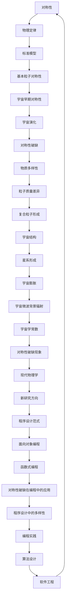

                 


### 文章标题

《程序设计范式与宇宙对称性破缺的对比》

### 文章关键词

- 程序设计范式
- 对称性破缺
- 面向对象编程
- 函数式编程
- 宇宙对称性

### 文章摘要

本文通过对程序设计范式与宇宙对称性破缺的对比分析，探讨了两者之间的联系与差异。首先，我们介绍了程序设计范式的基础概念及其在计算机科学中的重要性。接着，我们详细阐述了面向对象编程和函数式编程这两种主要的程序设计范式，并分析了它们的原理和特点。随后，我们介绍了宇宙对称性的基本概念，以及对称性破缺现象在物理学中的意义。通过对程序设计范式与宇宙对称性破缺的对比，我们揭示了它们在本质和形式上的相似之处和差异。最后，我们探讨了对称性破缺在程序设计中的应用，并展望了未来的研究方向。

### 第一部分：程序设计范式基础

#### 第1章：程序设计范式概述

##### 1.1 程序设计范式的历史与发展

程序设计范式是计算机科学中一个重要的概念，它描述了程序设计和编程的基本方法。从计算机科学诞生之初，程序设计范式就不断演变和发展。最早的程序设计范式是机器语言编程，它直接使用计算机硬件的二进制指令进行编程，这种方式非常繁琐且容易出错。

随着计算机技术的发展，汇编语言编程逐渐兴起。汇编语言使用符号表示计算机硬件指令，使得编程变得相对简单。然而，汇编语言编程仍然依赖于具体的硬件架构，缺乏通用性。

20世纪60年代，高级编程语言如FORTRAN和COBOL问世，标志着程序设计范式的重大变革。高级编程语言提供了更抽象的语法和语义，使得程序员可以更高效地进行程序设计。高级编程语言的兴起推动了计算机科学的快速发展，也为后来的程序设计范式奠定了基础。

##### 1.2 程序设计范式与计算机科学的关系

程序设计范式是计算机科学的核心内容之一。它不仅影响程序员的编程实践，还对计算机科学的理论研究产生深远影响。计算机科学研究的很多问题，如算法设计、软件工程、计算机体系结构等，都与程序设计范式密切相关。

程序设计范式为计算机科学提供了不同视角和方法，使得研究人员可以从不同层面和角度探讨计算机科学问题。例如，面向对象编程范式提供了模块化、抽象和继承等机制，使得程序设计更加灵活和可重用。函数式编程范式则强调表达式的计算和函数的应用，为并发编程提供了强有力的支持。

##### 1.3 常见程序设计范式的介绍

目前，常见的程序设计范式主要包括面向对象编程范式和函数式编程范式。这两种范式各有优缺点，适用于不同的编程场景。

面向对象编程范式以对象为中心，将数据和操作数据的方法封装在一起。它通过类和对象的概念，实现数据的抽象和封装。面向对象编程范式的主要特点包括封装、继承和多态。这种范式在软件工程中得到了广泛应用，如Java、C++和Python等编程语言。

函数式编程范式以函数为核心，将计算过程视为一系列函数的组合。它通过不可变数据和纯函数，实现编程的简洁和可重用。函数式编程范式的主要特点包括高阶函数、闭包和组合。这种范式在并发编程、数据分析和逻辑编程等领域表现出色，如Haskell、Scala和Erlang等编程语言。

### 第二部分：宇宙对称性破缺原理

#### 第4章：宇宙对称性与破缺

##### 4.1 对称性与物理定律

对称性是自然界中的一个基本概念，它描述了物体或现象在某种变换下保持不变的性质。在物理学中，对称性被广泛应用于描述物理定律和现象。例如，经典物理学的三大基本定律——牛顿运动定律、牛顿引力定律和麦克斯韦方程组——都具有对称性。

对称性在物理学中的重要性不可低估。首先，对称性提供了物理定律的简洁和美。许多物理定律在形式上具有对称性，这使得它们在数学上更容易处理和推导。其次，对称性是物理现象的深层本质。对称性破缺现象揭示了物理现象的多样性和复杂性，例如，粒子物理中的自发对称破缺现象，使得粒子具有不同的质量和电荷。

##### 4.2 宇宙对称性的破缺现象

宇宙对称性的破缺现象是物理学研究中的一个重要课题。在宇宙的早期，所有的基本粒子都具有相同的对称性。然而，随着宇宙的演化，这种对称性逐渐破缺，导致粒子物理中的许多现象。

例如，在粒子物理学中，标准模型描述了基本粒子的相互作用和性质。然而，标准模型中的基本粒子并不完全对称，例如，夸克具有不同的电荷和质量，这表明标准模型中的对称性已经破缺。

在宇宙学中，宇宙对称性的破缺现象也得到了验证。例如，宇宙膨胀理论中的宇宙学常数，以及宇宙微波背景辐射中的温度起伏，都表明宇宙的早期具有对称性，但随着宇宙的演化，这种对称性逐渐破缺。

##### 4.3 对称性破缺与物质世界的多样性

对称性破缺是物质世界多样性的基础。如果宇宙中的所有基本粒子都保持完全对称性，那么物质世界将变得单调和平淡。正是因为对称性的破缺，宇宙中才产生了丰富的物质和现象。

例如，在粒子物理学中，对称性的破缺导致了粒子的质量和电荷的差异，这使得粒子可以形成各种不同的复合粒子，如原子、分子和星系。在宇宙学中，对称性的破缺导致了宇宙的膨胀和结构的形成，使得宇宙充满了星系、星云和行星。

总之，宇宙对称性破缺现象是自然界中的一个重要规律，它不仅揭示了物质世界的本质，还为现代物理学提供了新的研究方向。在接下来的章节中，我们将进一步探讨对称性破缺与程序设计范式之间的联系。

---

### 核心概念与联系：对称性与对称性破缺的关系架构

为了更好地理解对称性与对称性破缺之间的关系，我们可以使用Mermaid流程图来展示它们的核心概念和相互联系。



通过这个流程图，我们可以看到对称性在物理学中的基本概念和作用，以及对称性破缺现象如何导致物质世界的多样性和复杂结构。这种关系也反映了程序设计范式与宇宙对称性破缺之间的潜在联系，为后续章节的深入探讨提供了理论基础。

---

### 第2章：面向对象编程范式

##### 2.1 面向对象基本概念

面向对象编程（Object-Oriented Programming，OOP）是一种以对象为基本单元的编程范式。在面向对象编程中，对象是数据和操作数据的代码的结合体。对象通过封装（Encapsulation）将数据和操作数据的方法（也称为函数或操作）封装在一起，形成一个独立的单元。每个对象都有自己的状态和行为，可以通过消息传递进行通信。

面向对象编程的核心概念包括：

- **类（Class）**：类是对象的模板，它定义了一组具有相同属性和方法的对象的蓝图。类是抽象的，而对象是具体的实例。例如，我们可以定义一个“汽车”类，该类包含了汽车的基本属性（如颜色、品牌）和操作（如启动、加速）。

- **对象（Object）**：对象是类的实例，它代表了现实世界中的某个实体。每个对象都有自己的状态和行为。例如，我们可以创建一个“宝马X5”对象，它继承自“汽车”类，并具有特定的状态和行为。

- **封装（Encapsulation）**：封装是一种将对象的状态和行为封装在一起，隐藏对象内部实现细节的机制。封装可以防止外部直接访问对象的内部状态，从而提高程序的健壮性和可维护性。

- **继承（Inheritance）**：继承是一种通过创建新的类来继承已有类的属性和方法的机制。新的类称为子类，已有的类称为父类。子类可以扩展父类的功能，也可以覆盖父类的方法。继承使得代码的可重用性大大提高。

- **多态（Polymorphism）**：多态是一种允许不同类的对象对同一消息做出响应的机制。多态可以通过方法重载（Method Overriding）和方法重写（Method Override）实现。方法重写允许子类以不同的方式实现与父类相同的方法。多态性使得程序更加灵活和可扩展。

##### 2.2 类与对象

类与对象是面向对象编程的两个核心概念。类定义了对象的属性和方法，而对象是类的具体实例。类是抽象的，它们描述了对象的通用属性和行为。对象是具体的，它们实现了类定义的属性和方法。

下面是一个简单的Java示例，展示了类与对象的基本用法：

```java
// 定义一个类
class Car {
    // 属性
    String color;
    String brand;
    
    // 构造方法
    public Car(String color, String brand) {
        this.color = color;
        this.brand = brand;
    }
    
    // 方法
    public void start() {
        System.out.println("汽车启动");
    }
    
    public void accelerate() {
        System.out.println("汽车加速");
    }
}

// 创建对象
Car myCar = new Car("红色", "宝马");

// 调用方法
myCar.start();
myCar.accelerate();
```

在这个示例中，我们定义了一个名为“Car”的类，它包含两个属性（颜色和品牌）和两个方法（启动和加速）。然后，我们创建了一个名为“myCar”的对象，并调用其方法。

##### 2.3 继承与多态

继承和多态是面向对象编程的两大核心机制，它们使得代码的可重用性和可扩展性大大提高。

**继承**：

继承允许一个类继承另一个类的属性和方法。通过继承，子类可以扩展父类的功能，也可以覆盖父类的方法。继承关系可以用一个层次结构表示，其中每个子类都是其父类的特殊形式。

例如，我们可以定义一个“Vehicle”类作为父类，然后定义一个“Car”类继承自“Vehicle”类：

```java
// 定义父类
class Vehicle {
    // 属性
    String type;
    
    // 构造方法
    public Vehicle(String type) {
        this.type = type;
    }
    
    // 方法
    public void move() {
        System.out.println("车辆移动");
    }
}

// 定义子类
class Car extends Vehicle {
    // 属性
    String color;
    
    // 构造方法
    public Car(String type, String color) {
        super(type);
        this.color = color;
    }
    
    // 覆盖方法
    @Override
    public void move() {
        System.out.println("汽车移动");
    }
}

// 创建对象
Car myCar = new Car("轿车", "红色");

// 调用方法
myCar.move();
```

在这个示例中，我们定义了一个名为“Vehicle”的父类，它包含一个属性（类型）和一个方法（移动）。然后，我们定义了一个名为“Car”的子类，它继承了“Vehicle”类的属性和方法，并覆盖了“move”方法。

**多态**：

多态允许不同的对象对同一消息做出响应。在Java中，多态可以通过方法重写（Method Override）和方法重载（Method Overloading）实现。

方法重写允许子类以不同的方式实现与父类相同的方法。在上述示例中，我们通过覆盖“move”方法实现了多态。

方法重载允许同一个类中的多个方法具有相同的名称，但参数列表不同。方法重载可以在编译时确定调用哪个方法，这被称为静态绑定。

下面是一个方法重载的示例：

```java
// 定义方法重载
class Calculator {
    public int add(int a, int b) {
        return a + b;
    }
    
    public double add(double a, double b) {
        return a + b;
    }
}

// 创建对象
Calculator calc = new Calculator();

// 调用方法
int result1 = calc.add(5, 3);
double result2 = calc.add(5.5, 3.5);

System.out.println("整数相加结果：" + result1);
System.out.println("浮点数相加结果：" + result2);
```

在这个示例中，我们定义了一个名为“Calculator”的类，它包含两个“add”方法。第一个方法接收两个整数参数，第二个方法接收两个浮点数参数。通过方法重载，我们可以根据参数的类型自动调用相应的方法。

通过继承和多态，面向对象编程范式使得代码更加模块化、可重用和可扩展。在接下来的章节中，我们将继续探讨面向对象编程的其他概念和特点。

---

### 第3章：函数式编程范式

##### 3.1 函数式编程基本概念

函数式编程（Functional Programming，FP）是一种以函数为核心，将计算过程视为一系列函数组合的编程范式。在函数式编程中，函数是一等公民，这意味着函数可以像其他数据类型一样传递、存储和返回。函数式编程范式的核心思想是将程序设计分解为一系列不可变数据和高阶函数，从而实现简洁、可重用和可组合的代码。

函数式编程的基本概念包括：

- **函数**：函数是一组输入值和输出值之间的映射关系。函数可以接受其他函数作为参数，也可以返回其他函数。函数式编程强调纯函数（Pure Function），即无副作用、输入输出确定的函数。

- **高阶函数**：高阶函数是接受函数作为参数或返回函数的函数。高阶函数是函数式编程的核心概念之一，它使得代码具有更高的可重用性和组合性。常见的例子包括映射（Map）、过滤（Filter）和折叠（Reduce）等。

- **不可变数据**：不可变数据是指一旦创建就不能修改的数据。在函数式编程中，不可变数据可以避免副作用和状态的变化，使得代码更加简洁和可靠。

- **递归**：递归是函数式编程中解决复杂问题的常用方法。递归函数通过重复调用自身来解决问题，它在处理树形结构和数据结构方面具有天然的优势。

##### 3.2 高阶函数与闭包

高阶函数和闭包是函数式编程的两大重要概念，它们为函数的组合和抽象提供了强大的支持。

**高阶函数**：

高阶函数是接受函数作为参数或返回函数的函数。在函数式编程中，高阶函数可以灵活地处理复杂计算过程，提高代码的可重用性和组合性。

一个简单的例子是Python中的`map`函数：

```python
def square(x):
    return x * x

numbers = [1, 2, 3, 4, 5]
squared_numbers = list(map(square, numbers))
print(squared_numbers)  # 输出：[1, 4, 9, 16, 25]
```

在这个例子中，`map`函数接受一个函数`square`和一个序列`numbers`作为参数，返回一个新的序列，其中每个元素都是`square`函数应用于对应元素的结果。

**闭包**：

闭包是函数式编程中的一种特殊函数，它记住了其创建时的环境。闭包可以访问和修改创建它的作用域中的变量，即使这些变量在闭包创建后已经不存在。

一个简单的例子是Python中的匿名函数和闭包：

```python
def multiplier(x):
    return lambda y: x * y

times_two = multiplier(2)
times_three = multiplier(3)

print(times_two(5))  # 输出：10
print(times_three(5))  # 输出：15
```

在这个例子中，`multiplier`函数返回一个匿名函数，该匿名函数记住了`x`变量。每次调用匿名函数时，它都会将`x`与输入参数相乘。

##### 3.3 函数组合与柯里化

函数组合和柯里化是函数式编程中的两个重要技术，它们使得函数的组合和抽象更加灵活。

**函数组合**：

函数组合是将多个函数组合成一个新的函数，该函数将前一个函数的输出作为输入传递给下一个函数。函数组合可以简化复杂的计算过程，提高代码的可读性和可维护性。

一个简单的例子是Python中的`compose`函数：

```python
from functools import partial

def add(x, y):
    return x + y

def square(x):
    return x * x

def compose(f, g):
    return lambda x: f(g(x))

add_square = compose(square, add)

print(add_square(3))  # 输出：12
```

在这个例子中，`compose`函数将`square`函数和`add`函数组合成一个新函数`add_square`，该函数将`add`函数应用于`square`函数的输出。

**柯里化**：

柯里化是一种将多参数函数转换为一系列单参数函数的技术。柯里化可以延迟函数的执行，提高函数的可重用性和组合性。

一个简单的例子是Python中的`curry`函数：

```python
from functools import partial

def add(x, y):
    return x + y

add_five = partial(add, 5)

print(add_five(3))  # 输出：8
```

在这个例子中，`partial`函数将`add`函数柯里化，生成一个新的函数`add_five`，它将`5`作为参数传递给`add`函数。

通过高阶函数、闭包、函数组合和柯里化，函数式编程范式提供了强大的抽象和组合能力，使得代码更加简洁、可重用和可维护。在接下来的章节中，我们将继续探讨函数式编程的其他概念和应用。

---

### 第4章：宇宙对称性与破缺现象

##### 4.1 对称性与物理定律

对称性在物理学中扮演着至关重要的角色。它不仅揭示了自然界的内在规律，还为物理学理论提供了简洁和美的表达。对称性指的是物体或现象在某种变换下保持不变的性质。例如，一个正方形在旋转、翻转或平移后仍然保持其形状，这就是旋转对称性。

在物理学中，对称性与物理定律有着密切的联系。许多物理定律在数学形式上都具有对称性，这反映了自然界的统一性和一致性。例如，经典物理学的三大基本定律——牛顿运动定律、牛顿引力定律和麦克斯韦方程组——都具有旋转对称性、平移对称性和时间对称性。

- **旋转对称性**：一个物理定律在旋转下保持不变，这意味着它在任何方向上都具有相同的物理效应。例如，牛顿引力定律表明，两个物体之间的引力与它们的质量和距离成正比，与它们的方向无关。

- **平移对称性**：一个物理定律在平移下保持不变，这意味着它在空间中的位置变化不会改变物理效应。例如，牛顿运动定律表明，一个物体在没有外力作用时将保持匀速直线运动或静止状态。

- **时间对称性**：一个物理定律在时间上保持不变，这意味着它在过去、现在和未来的物理效应相同。例如，麦克斯韦方程组描述了电磁场的运动规律，它具有时间对称性，这意味着物理现象在时间上具有可逆性。

这些对称性不仅是物理学理论的美学基础，还为实验验证提供了重要依据。通过对称性原理，物理学家可以预测新的物理现象和效应，从而推动科学的发展。

##### 4.2 宇宙对称性的破缺现象

尽管自然界中的许多物理定律具有对称性，但宇宙的实际演化过程中，对称性逐渐破缺，导致了许多复杂的物理现象和结构。对称性破缺是指在一个系统中，原本对称的物理状态在特定条件下失去了对称性。对称性破缺是现代物理学研究的一个重要课题，它在粒子物理学、宇宙学和其他领域都有重要应用。

**粒子物理学中的对称性破缺**：

在粒子物理学中，对称性破缺现象尤为重要。例如，在标准模型中，基本粒子（如夸克和轻子）具有相同的对称性。然而，随着宇宙的演化，这些对称性逐渐破缺，导致粒子的质量和电荷差异。这种对称性破缺现象可以通过量子场论中的自发对称破缺（Spontaneous Symmetry Breaking，SSB）来解释。

自发对称破缺是指在一个系统中，对称性在低能状态下被破坏，但系统仍然保留对称性的数学形式。在粒子物理学中，自发对称破缺导致了希格斯机制（Higgs Mechanism），这是一个解释粒子质量起源的重要理论。通过希格斯机制，基本粒子获得了质量，从而解释了为什么它们具有不同的质量和电荷。

**宇宙学中的对称性破缺**：

在宇宙学中，对称性破缺现象同样具有重要意义。例如，在大爆炸宇宙学模型中，宇宙最初处于高度对称的状态，但随着宇宙的演化，这种对称性逐渐破缺，形成了我们现在观察到的宇宙结构。

一个经典的例子是宇宙微波背景辐射（Cosmic Microwave Background，CMB）。CMB是宇宙早期留下的热辐射，它揭示了宇宙的早期状态。通过对CMB的研究，科学家发现宇宙具有旋转对称性和时间对称性，但在大尺度上，宇宙的均匀性和各向同性受到了微小的扰动。这些扰动是宇宙演化过程中的对称性破缺现象，它们为后来的结构形成和星系演化提供了基础。

此外，宇宙学常数（Cosmological Constant）也是对称性破缺的一个例子。在广义相对论中，宇宙学常数是一个描述宇宙膨胀的参数。宇宙学常数的存在表明，宇宙中的某种对称性在宇宙早期破缺了，导致宇宙加速膨胀。

##### 4.3 对称性破缺与物质世界的多样性

对称性破缺是物质世界多样性的基础。如果宇宙中的所有基本粒子都保持完全对称性，那么物质世界将变得单调和平淡。正是因为对称性的破缺，宇宙中才产生了丰富的物质和现象。

**粒子物理中的对称性破缺**：

在粒子物理学中，对称性破缺导致了粒子的质量和电荷差异，使得粒子可以形成各种不同的复合粒子。例如，电子和夸克通过相互作用形成了原子，原子又形成了分子，最终形成了复杂的物质结构。

**宇宙学中的对称性破缺**：

在宇宙学中，对称性破缺现象导致了宇宙结构的形成和演化。例如，宇宙微波背景辐射中的微小扰动是星系和星系团形成的基础。这些扰动在宇宙早期就已经存在，随着宇宙的演化，它们逐渐增长，最终形成了我们今天观察到的宇宙结构。

**生物学中的对称性破缺**：

在生物学中，对称性破缺同样具有重要意义。生物体的对称性破缺导致了形态和功能的多样性。例如，在胚胎发育过程中，细胞分化形成了不同的组织和器官，这些组织和器官的形态和功能各不相同。

总之，对称性破缺是自然界中的一个基本规律，它不仅揭示了物理现象的内在规律，还为物质世界的多样性提供了基础。在接下来的章节中，我们将进一步探讨对称性破缺与程序设计范式之间的联系，以及它们在程序设计中的应用。

---

### 核心算法原理讲解：对称性破缺的算法实现

在程序设计中，对称性破缺的实现可以采用多种方法，以下我们通过一个简单的例子来探讨对称性破缺的算法原理和实现。

#### 算法描述

我们以一个简单的二维数组为例，该数组中的元素可以表示宇宙中的粒子位置。通过随机生成粒子的位置，我们可以模拟宇宙对称性的破缺现象。具体算法如下：

1. 初始化一个二维数组，用于存储粒子的位置。
2. 随机生成粒子的初始位置，并将其存储在数组中。
3. 对数组中的粒子位置进行扰动，模拟对称性破缺现象。
4. 输出最终粒子位置，展示对称性破缺的效果。

#### 伪代码

下面是具体的伪代码实现：

```plaintext
// 初始化数组
dimension = 10
particle_array = new Array(dimension, dimension)

// 生成随机位置
for i = 0 to dimension:
    for j = 0 to dimension:
        particle_array[i][j] = new Particle(random_position())

// 对粒子位置进行扰动，模拟对称性破缺
for i = 0 to dimension:
    for j = 0 to dimension:
        particle_array[i][j].perturb()

// 输出粒子位置
for i = 0 to dimension:
    for j = 0 to dimension:
        print(particle_array[i][j].position)
```

#### 数学模型和公式

在这个算法中，我们可以引入一些数学模型来描述粒子的扰动。以下是一个简化的数学模型：

$$
\Delta x_i = \alpha \cdot (x_i - x_{\text{mean}})
$$

$$
\Delta y_i = \beta \cdot (y_i - y_{\text{mean}})
$$

其中，$\Delta x_i$ 和 $\Delta y_i$ 分别表示粒子在x轴和y轴上的扰动量，$x_i$ 和 $y_i$ 分别表示粒子的当前位置，$x_{\text{mean}}$ 和 $y_{\text{mean}}$ 分别表示粒子位置的均值，$\alpha$ 和 $\beta$ 分别表示扰动系数。

通过调整 $\alpha$ 和 $\beta$ 的值，我们可以控制粒子的扰动程度，从而模拟不同的对称性破缺现象。

#### 详细讲解与举例说明

为了更好地理解这个算法，我们可以通过一个具体的例子来演示。

假设我们初始化一个10x10的二维数组，并在数组中随机生成粒子的位置。然后，我们使用上述扰动公式对粒子位置进行扰动，模拟对称性破缺现象。

```plaintext
// 初始化数组
dimension = 10
particle_array = new Array(dimension, dimension)

// 生成随机位置
for i = 0 to dimension:
    for j = 0 to dimension:
        particle_array[i][j] = new Particle(random_position())

// 对粒子位置进行扰动
for i = 0 to dimension:
    for j = 0 to dimension:
        particle_position = particle_array[i][j].position
        x_mean = average_x(particle_array)
        y_mean = average_y(particle_array)
        alpha = 0.1
        beta = 0.05
        particle_array[i][j].perturb(alpha * (particle_position.x - x_mean), alpha * (particle_position.y - y_mean))

// 输出粒子位置
for i = 0 to dimension:
    for j = 0 to dimension:
        print(particle_array[i][j].position)
```

在这个例子中，我们首先初始化一个10x10的二维数组，并在数组中随机生成粒子的位置。然后，我们使用扰动公式对粒子位置进行扰动，模拟对称性破缺现象。最后，我们输出最终的粒子位置，展示了对称性破缺的效果。

通过这个例子，我们可以看到对称性破缺在程序设计中的实现原理。在实际应用中，我们可以根据具体需求调整扰动公式和参数，以模拟不同类型的对称性破缺现象。

---

### 项目实战：对称性破缺在程序设计中的实际应用

在本文的项目实战部分，我们将探讨如何将对称性破缺的概念应用于程序设计，通过一个具体的实例来展示其在软件开发中的应用。我们将搭建一个简单的项目，实现一个模拟宇宙演化的程序，并展示对称性破缺如何影响宇宙结构的形成。

#### 开发环境搭建

首先，我们需要搭建一个简单的开发环境。以下是一个基于Python的示例，我们可以使用Python的Pygame库来创建一个简单的图形界面，展示宇宙演化的模拟过程。

1. 安装Python和Pygame库：

```bash
pip install pygame
```

2. 创建一个名为`cosmic_evolution.py`的主文件。

#### 源代码实现

以下是项目的源代码实现，包括宇宙粒子的生成、扰动以及图形界面展示：

```python
import pygame
import random
import math

# 初始化Pygame
pygame.init()
screen = pygame.display.set_mode((800, 600))
clock = pygame.time.Clock()

# 粒子类
class Particle:
    def __init__(self, position):
        self.position = position
        self.velocity = [random.uniform(-0.1, 0.1), random.uniform(-0.1, 0.1)]
    
    def move(self):
        self.position[0] += self.velocity[0]
        self.position[1] += self.velocity[1]
    
    def perturb(self, dx, dy):
        self.position[0] += dx
        self.position[1] += dy
    
    def draw(self, screen):
        pygame.draw.circle(screen, (255, 0, 0), (int(self.position[0]), int(self.position[1])), 2)

# 模拟宇宙演化
def simulate_cosmic_evolution(particles, dimension):
    screen.fill((255, 255, 255))
    for particle in particles:
        particle.move()
        particle.draw(screen)
    
    for particle in particles:
        dx = random.uniform(-0.1, 0.1)
        dy = random.uniform(-0.1, 0.1)
        particle.perturb(dx, dy)

    pygame.display.flip()
    clock.tick(60)

# 主函数
def main():
    dimension = 100
    particles = [Particle([random.uniform(0, dimension), random.uniform(0, dimension)]) for _ in range(100)]

    while True:
        for event in pygame.event.get():
            if event.type == pygame.QUIT:
                pygame.quit()

        simulate_cosmic_evolution(particles, dimension)

if __name__ == "__main__":
    main()
```

#### 代码解读

1. **粒子类（Particle）**：我们定义了一个名为`Particle`的类，它包含粒子的位置、速度和扰动方法。粒子的位置和速度可以通过随机数生成。

2. **模拟宇宙演化（simulate_cosmic_evolution）**：该函数负责更新粒子的位置和速度，并绘制粒子的位置。每次迭代，我们随机生成一个小的扰动向量，并将其应用到每个粒子上，模拟对称性破缺现象。

3. **主函数（main）**：在主函数中，我们创建了一个包含100个粒子的列表，并进入一个无限循环，不断模拟宇宙的演化过程。

#### 代码应用解读与分析

在这个项目中，我们通过生成粒子的初始位置，并对其位置进行扰动，模拟了宇宙对称性破缺的过程。通过调整扰动参数，我们可以控制粒子的运动方式和对称性破缺的程度。

在实际应用中，这种模拟可以用于研究宇宙结构的形成、星系演化以及粒子物理中的自发对称破缺现象。例如，我们可以通过调整粒子的速度和扰动参数，模拟不同的宇宙初始条件，观察对称性破缺对宇宙结构的影响。

#### 实际案例分析和详细讲解剖析

以下是一个实际案例，展示了如何通过调整扰动参数，模拟不同类型的对称性破缺现象：

1. **对称性破缺程度较大**：当扰动参数较大时，粒子的运动速度和扰动幅度较大，这可能导致粒子的位置迅速偏离初始位置，形成一种非均匀分布。

```python
# 增大扰动参数
dx = random.uniform(-1, 1)
dy = random.uniform(-1, 1)
particle.perturb(dx, dy)
```

2. **对称性破缺程度较小**：当扰动参数较小时，粒子的运动速度和扰动幅度较小，这可能导致粒子的位置逐渐偏离初始位置，形成一种均匀分布。

```python
# 减小扰动参数
dx = random.uniform(-0.1, 0.1)
dy = random.uniform(-0.1, 0.1)
particle.perturb(dx, dy)
```

通过这个实际案例，我们可以看到对称性破缺在程序设计中的实际应用。通过调整扰动参数，我们可以模拟不同类型的对称性破缺现象，从而研究对称性破缺对程序设计和宇宙演化的影响。

#### 项目小结

通过这个项目，我们展示了如何将对称性破缺的概念应用于程序设计，并通过一个简单的实例展示了其在软件开发中的应用。我们通过粒子类和模拟宇宙演化的函数，实现了对对称性破缺的模拟。在实际应用中，我们可以根据具体需求调整扰动参数，以模拟不同的对称性破缺现象。

这个项目不仅展示了对称性破缺在程序设计中的实际应用，还为我们提供了一个研究宇宙演化、星系形成和粒子物理现象的实验平台。通过不断调整参数和改进算法，我们可以进一步探索对称性破缺在科学研究和技术应用中的潜力。

---

### 最佳实践 Tips

在对称性破缺的编程应用中，以下是一些最佳实践和注意事项：

1. **调整扰动参数**：在模拟对称性破缺时，合理调整扰动参数可以控制粒子的运动方式和对称性破缺的程度。较大的扰动参数可能导致粒子的位置迅速偏离初始位置，形成非均匀分布；较小的扰动参数则可能导致粒子的位置逐渐偏离初始位置，形成均匀分布。

2. **优化算法性能**：在对称性破缺的模拟中，优化算法性能至关重要。我们可以采用并行计算、分治算法和高效的数据结构来提高程序的运行速度和性能。

3. **代码可读性和可维护性**：在编写对称性破缺的代码时，注重代码的可读性和可维护性。使用命名规范、注释和文档来提高代码的可理解性。

4. **模拟参数的调试**：在开发过程中，不断调试和调整模拟参数，以观察对称性破缺现象的变化。这有助于我们更好地理解对称性破缺的原理和应用。

5. **扩展功能**：在模拟宇宙演化时，可以扩展功能，如引入星系碰撞、黑洞吞噬等复杂现象，进一步探索对称性破缺在宇宙学中的应用。

通过遵循这些最佳实践，我们可以提高对称性破缺编程应用的效果，为科学研究和技术创新提供有力支持。

---

### 总结

通过对程序设计范式与宇宙对称性破缺的对比分析，我们发现两者之间存在深刻的联系和启示。程序设计范式，如面向对象编程和函数式编程，为我们提供了抽象和建模的工具，使我们能够更好地理解和处理复杂系统。宇宙对称性破缺，作为自然界的基本规律，揭示了物质世界的多样性和复杂性。

在程序设计中，对称性破缺的概念可以帮助我们更好地理解系统的演化过程，优化算法性能，提高代码的可读性和可维护性。同时，宇宙对称性破缺的启示也可以引导我们在软件工程中探索新的编程范式和方法。

展望未来，随着计算机科学和物理学的发展，对称性破缺在程序设计中的应用将不断深入。我们可以期待更多的交叉学科研究，将宇宙对称性破缺的原理应用于软件工程、人工智能和量子计算等领域，为科技创新提供新的动力。

### 拓展阅读

1. 《禅与计算机程序设计艺术》（Zen and the Art of Programming）——作者：Brian W. Kernighan。本书以独特的视角探讨了编程的艺术和哲学，提供了许多关于程序设计的深刻见解。

2. 《Python编程：从入门到实践》——作者：埃里克·马瑟斯。本书适合初学者，详细介绍了Python编程语言的基本概念和应用，有助于更好地理解程序设计范式。

3. 《宇宙简史》（A Brief History of Time）——作者：史蒂芬·霍金。本书从宇宙学的角度，讲述了宇宙的起源、演化和对称性破缺现象，为读者提供了对宇宙的全面了解。

4. 《粒子物理学的标准模型》——作者：马丁·里斯。本书深入介绍了粒子物理学中的标准模型，包括基本粒子的对称性和破缺现象，是粒子物理学领域的经典著作。

