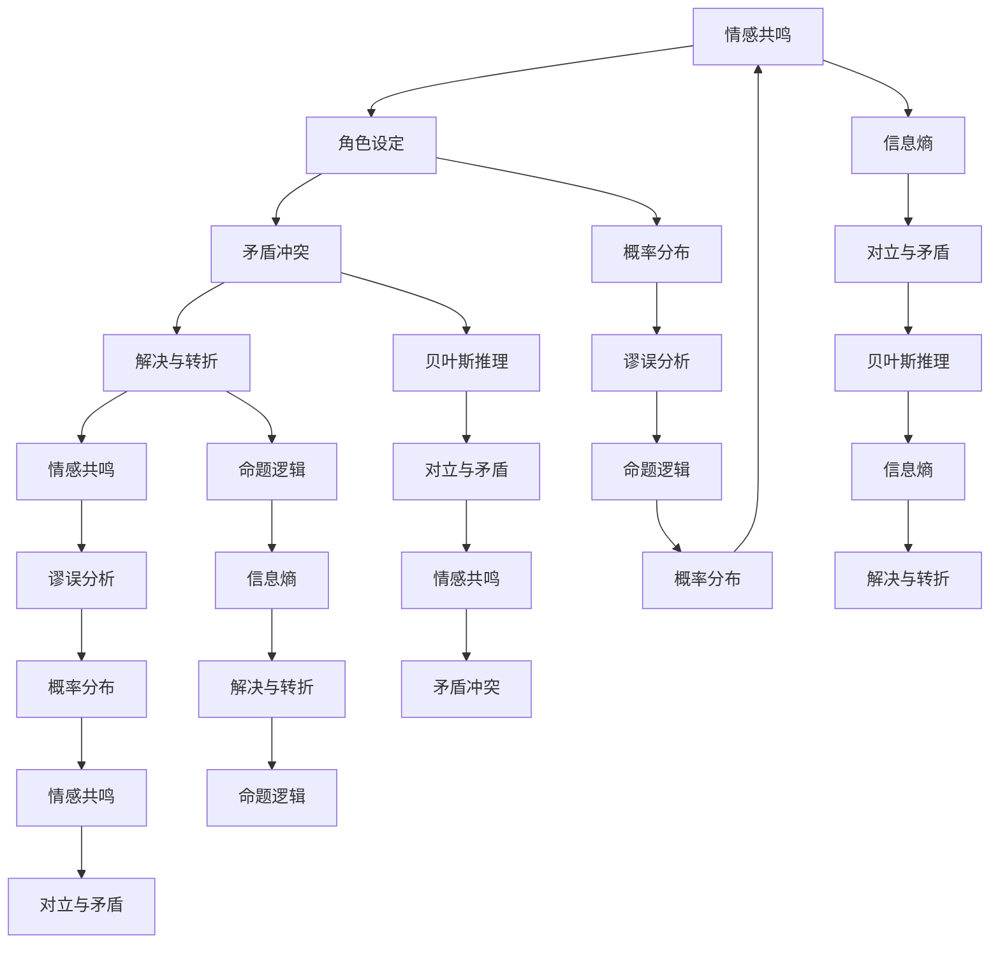

                 

### 文章标题

《笑话结构的逻辑分析：幽默感的数学解构》

### 关键词

- 笑话结构
- 幽默感
- 数学解构
- 逻辑分析
- 人工智能
- 算法原理

### 摘要

本文深入探讨了笑话结构的逻辑分析和幽默感的数学解构，通过运用人工智能和算法原理，解析了幽默感产生的内在机制。文章首先介绍了笑话的背景和幽默感的重要性，然后详细阐述了笑话结构的基本原理，包括笑话的组成元素和叙事结构。接着，文章探讨了幽默感与概率论、演绎逻辑的关系，并运用Mermaid流程图展示了这些关系。通过伪代码和数学模型，文章详细讲解了笑话分析和幽默感评估的核心算法原理。最后，文章通过实际项目实战，展示了如何应用这些算法进行笑话结构和幽默感的分析，并提供了一些最佳实践和小结。本文旨在为读者提供一个全面、深入的笑话结构逻辑分析和幽默感数学解构的技术解读。

## 引言

笑话作为人类语言和文化的独特形式，自古以来就在人们的生活中占据着重要地位。无论是家庭聚会、朋友聚会，还是社交场合，笑话都能带来欢声笑语，缓解紧张气氛，增强人与人之间的情感联系。而幽默感，作为笑话的核心元素，更是这种语言形式的灵魂所在。幽默感不仅能够让人开怀大笑，还能够激发创造力，提高认知能力，甚至有助于缓解压力和改善心理健康。

在现代社会，随着人工智能技术的飞速发展，对幽默感的理解和分析逐渐成为了一个热门的研究领域。人工智能算法通过对大量笑话的文本和结构分析，试图揭示幽默感的生成机制，为笑话的创作和传播提供了新的途径。同时，幽默感的数学解构也为我们提供了一个全新的视角，帮助我们更深入地理解幽默感的本质。

本文旨在通过逻辑分析和数学解构，对笑话结构进行深入探讨，揭示幽默感产生的内在机制。文章首先介绍了笑话的定义和特点，然后探讨了幽默感的重要性。接着，文章详细阐述了笑话结构的基本原理，包括笑话的组成元素和叙事结构。在此基础上，文章探讨了幽默感与概率论、演绎逻辑的关系，并运用Mermaid流程图展示了这些关系。通过伪代码和数学模型，文章详细讲解了笑话分析和幽默感评估的核心算法原理。最后，文章通过实际项目实战，展示了如何应用这些算法进行笑话结构和幽默感的分析，并提供了一些最佳实践和小结。

## 背景介绍

### 笑话的定义和特点

笑话，通常是指那些能够引起人们大笑或微笑的语言表达。它具有以下几个显著特点：

1. **简洁性**：笑话通常以简洁的语言形式呈现，往往只需要几句话甚至一个词就能传达出幽默的效果。
2. **出人意料**：笑话的成功往往依赖于出人意料的转折或意外，这种意外的效果能够打破听众的心理预期，从而产生幽默感。
3. **情境性**：许多笑话依赖于特定的情境或背景，这种情境性使得笑话在不同的文化和语境中可能具有不同的效果。
4. **情感共鸣**：笑话通常能够引起听众的情感共鸣，无论是喜悦、惊讶还是悲伤，这些情感的体验都能够增强笑话的幽默效果。

### 幽默感的重要性

幽默感是人类智力的一种表现形式，它不仅仅是一种娱乐工具，还具有许多重要的社会和心理功能：

1. **社交功能**：幽默感能够促进人际交往，拉近人与人之间的距离。通过幽默，人们可以更轻松地建立联系，减少沟通中的尴尬和紧张。
2. **心理健康**：幽默感有助于缓解压力和焦虑，提高心理健康。研究表明，幽默感能够释放身体内的压力激素，促进内啡肽的分泌，从而提升心情。
3. **创造力**：幽默感被认为是一种创造力的催化剂。幽默的思维方式能够打破常规，激发新的想法和灵感。
4. **认知功能**：幽默感可以提升认知能力，例如提高注意力、记忆力和解决问题的能力。幽默的情境往往需要听众进行逻辑推理和情境转换，这种认知活动能够锻炼大脑。

### 人工智能与幽默感

随着人工智能技术的发展，幽默感逐渐成为了一个热门的研究领域。人工智能算法通过对大量笑话的文本和结构分析，试图揭示幽默感的生成机制，为笑话的创作和传播提供了新的工具。以下是一些关键的研究领域：

1. **文本分析**：通过自然语言处理（NLP）技术，对笑话的文本进行语义分析，提取出幽默的关键元素和特征。
2. **情感分析**：利用情感分析算法，对笑话的情感倾向进行分析，判断其是否具有幽默感。
3. **生成对抗网络（GAN）**：通过生成对抗网络，训练出能够创作幽默文本的模型，从而实现笑话的自动生成。
4. **情境模拟**：通过情境模拟技术，创建出能够产生幽默效果的虚拟情境，为幽默创作提供新思路。

### 笑话结构的基本原理

### 笑话的组成元素

一个笑话通常由几个关键元素组成，这些元素相互作用，共同创造出幽默的效果。以下是笑话的主要组成元素：

1. **情景设定**：情景设定是笑话的基础，它为笑话提供了一个具体的背景或情境。情景设定可以是真实的，也可以是虚构的，但其目的都是为笑话创造一个特定的环境。

2. **角色**：角色是笑话中的人物或对象，他们可以是真人、虚构人物或者事物。角色在笑话中扮演不同的角色，有时是主角，有时是配角，他们的行为和对话是笑话发展的关键。

3. **矛盾冲突**：矛盾冲突是笑话的核心，它指的是角色之间的不一致、误解或出乎意料的转折。矛盾冲突往往在笑话的高潮部分出现，是引起听众兴趣和预期转折的关键。

4. **解决**：解决是指笑话的结尾，它是对矛盾冲突的解决或解释。解决部分往往是出乎意料的，这种出乎意料的效果能够打破听众的心理预期，产生幽默感。

### 笑话的叙事结构

笑话的叙事结构通常可以分为三个主要部分：引子、高潮和结尾。以下是每个部分的作用和特点：

1. **引子**：引子是笑话的开头，它为听众提供一个情景设定和背景信息。引子的目的是吸引听众的注意力，并为接下来的高潮部分做铺垫。

2. **高潮**：高潮是笑话的核心部分，它包含了矛盾冲突的展现和解决。高潮部分的设计关键在于出人意料和转折，这种出乎意料的效果是产生幽默感的关键。

3. **结尾**：结尾是笑话的结尾部分，它对矛盾冲突进行了解决或解释。结尾部分的作用是强化幽默效果，并使听众感到满足和愉悦。

### 笑话结构的逻辑分析

笑话的幽默效果并非偶然，而是通过精心设计的结构实现的。以下是笑话结构的逻辑分析：

1. **情景设定与角色**：情景设定和角色的设定为笑话提供了一个具体的背景和角色。这些元素不仅有助于听众理解笑话，还通过角色的行为和对话增加了情境的复杂性。

2. **矛盾冲突**：矛盾冲突是笑话的核心，它通过角色之间的不一致或误解，引发听众的兴趣和期待。这种矛盾冲突的设置需要精心设计，以确保其出人意料和有趣。

3. **解决与转折**：解决是对矛盾冲突的最终处理，它往往通过出乎意料的转折产生幽默感。解决部分的设置需要确保其既能够解释矛盾冲突，又能够创造出幽默的效果。

4. **情感共鸣**：笑话的成功还取决于其是否能够引起听众的情感共鸣。通过角色的情感表达和情境的设定，笑话能够与听众产生共鸣，从而增强其幽默效果。

### 幽默感的数学解构

为了深入理解幽默感，我们引入数学模型来解构幽默感的生成机制。数学模型能够帮助我们量化幽默感的关键因素，并揭示它们之间的相互关系。以下是几种关键的数学模型：

#### 概率论模型

概率论是研究不确定性的数学分支，它在幽默感的分析中有着广泛的应用。以下是概率论模型在幽默感分析中的应用：

1. **信息熵**：信息熵是衡量信息不确定性的指标。在笑话中，信息熵的变化可以解释为听众预期和实际结果之间的差异。信息熵的增加往往与幽默感的提升相关。

2. **概率分布**：通过分析笑话中关键词的概率分布，我们可以发现幽默元素的出现频率和分布规律。这些概率分布可以帮助我们识别幽默感的潜在模式。

3. **贝叶斯推理**：贝叶斯推理是一种基于概率的推理方法，它通过更新先验概率来预测后验概率。在笑话中，贝叶斯推理可以帮助我们解释听众的预期和实际反应之间的差异。

#### 演绎逻辑模型

演绎逻辑是研究推理和证明的数学分支，它在幽默感的分析中也有重要应用。以下是演绎逻辑模型在幽默感分析中的应用：

1. **命题逻辑**：命题逻辑是研究命题之间逻辑关系的数学工具。在笑话中，命题逻辑可以帮助我们分析角色行为和情境之间的关系，揭示幽默感的生成机制。

2. **谬误分析**：谬误是推理中的错误，它们往往是幽默感的来源。通过分析笑话中的谬误，我们可以识别幽默感的产生原因，并理解听众为何会觉得这些笑话有趣。

3. **对立与矛盾**：对立和矛盾是幽默感的重要来源。在笑话中，对立和矛盾通过出人意料的方式呈现，产生幽默效果。演绎逻辑模型可以帮助我们分析这些对立和矛盾的结构，从而揭示幽默感的本质。

### Mermaid流程图

为了更直观地展示幽默感与概率论、演绎逻辑之间的关系，我们可以使用Mermaid流程图来表示这些关系。以下是一个简单的Mermaid流程图示例：



通过这个流程图，我们可以清晰地看到幽默感与概率论、演绎逻辑之间的关系。每个节点都代表了幽默感的一个方面，而连接线则表示了不同因素之间的相互影响。这个流程图为我们提供了一个直观的工具，帮助我们理解幽默感的生成机制。

### 核心算法原理讲解

为了深入理解笑话结构和幽默感的数学解构，我们首先需要了解一些核心算法原理，这些算法将帮助我们分析笑话的各个组成部分，并评估其幽默效果。以下是这些算法的核心原理，以及如何使用伪代码来详细阐述它们。

#### 1. 笑话元素提取算法

笑话元素提取算法旨在从文本中提取出关键的笑话元素，包括情景设定、角色、矛盾冲突和解决。以下是这个算法的伪代码描述：

```plaintext
function extractJokeElements(jokeText):
    elements = []
    currentElement = ""
    elementType = "undefined"

    for word in jokeText:
        if word is a noun or proper noun:
            if elementType == "undefined":
                elementType = "role"
                currentElement = word
            elif elementType == "role":
                currentElement += " " + word
            else:
                elementType = "conflict"
                currentElement = word

        if word is a verb or adverb:
            if elementType == "conflict":
                currentElement += " " + word
            elif elementType == "solution":
                currentElement += " " + word

        if elementType != "undefined":
            elements.append((elementType, currentElement.trim()))

        elementType = "undefined"

    return elements
```

在这个算法中，我们遍历笑话文本中的每个单词，根据单词的类型（名词、动词、形容词等）来确定当前元素的类型。当检测到名词或专有名词时，我们将其视为角色的开始；当检测到动词或副词时，我们将其视为矛盾冲突或解决的组成部分。通过这种方式，我们可以将笑话文本分解为不同的元素。

#### 2. 幽默感评估算法

幽默感评估算法旨在评估笑话的幽默效果。这一算法基于笑话元素的提取结果，结合概率论和情感分析，对笑话的幽默感进行量化。以下是这个算法的伪代码描述：

```plaintext
function evaluateHumor(humorElements):
    humorScore = 0
    surpriseFactor = 0
    emotionalTone = "neutral"

    for element in humorElements:
        if element.type == "conflict":
            surpriseFactor += calculateSurpriseFactor(element.text)
        elif element.type == "solution":
            emotionalTone = analyzeEmotionalTone(element.text)
            if emotionalTone != "neutral":
                humorScore += calculateHumorScore(emotionalTone)

    humorScore /= len(humorElements)  # Average humor score
    humorScore += surpriseFactor * 0.5  # Adjust for surprise

    return humorScore
```

在这个算法中，我们首先遍历笑话元素，计算每个元素的惊喜因素（surprise factor），这取决于冲突元素的出人意料程度。同时，我们分析解决元素的情感倾向，如果情感倾向不是中性，则增加幽默分数。最终，通过平均幽默分数和惊喜因素，我们得到一个整体的幽默感评分。

#### 3. 概率论模型的应用

在笑话分析中，概率论模型有助于理解笑话中各个元素的概率分布和它们之间的相互关系。以下是概率论模型在笑话分析中的应用：

```plaintext
function calculateSurpriseFactor(conflictText):
    wordFrequency = getWordFrequency(conflictText)
    surpriseFactor = 0

    for word in wordFrequency:
        probability = wordFrequency[word] / totalWordCount
        surpriseFactor += -probability * log2(probability)

    return surpriseFactor
```

在这个函数中，我们计算冲突元素中的每个单词的频率，然后使用信息熵公式计算惊喜因素。信息熵的增加通常意味着出人意料和幽默感的提升。

#### 4. 情感分析模型的应用

情感分析模型可以帮助我们理解笑话中的情感倾向，这有助于评估幽默效果。以下是情感分析模型的应用：

```plaintext
function analyzeEmotionalTone(solutionText):
    sentimentAnalysis = getSentimentAnalysis(solutionText)
    if sentimentAnalysis.score > 0.5:
        return "positive"
    elif sentimentAnalysis.score < -0.5:
        return "negative"
    else:
        return "neutral"
```

在这个函数中，我们使用预训练的情感分析模型来评估解决元素的文本，并根据情感评分确定情感倾向。

### 数学模型和公式

为了深入理解笑话结构和幽默感，我们引入了几个数学模型和公式。以下是这些模型和公式的详细解释和举例说明。

#### 1. 信息熵

信息熵是衡量信息不确定性的指标，它在笑话分析中用于评估听众的预期和实际结果之间的差异。以下是一个信息熵的公式：

$$
H = -\sum_{i} p(x_i) \cdot \log_2(p(x_i))
$$

其中，$H$ 是信息熵，$p(x_i)$ 是每个可能结果的概率。例如，考虑一个简单的笑话：“为什么小鸟站在电线上不会被电到？”我们可以将“小鸟被电到”的概率设为 $0.0001$，则信息熵的计算如下：

$$
H = - (0.9999 \cdot \log_2(0.9999)) - (0.0001 \cdot \log_2(0.0001)) \approx 0.081
$$

这个信息熵表明，听众对小鸟被电到的预期非常低，因此笑话产生了出乎意料的效果。

#### 2. 概率分布

概率分布用于描述多个可能结果的概率分布情况。在笑话分析中，我们可以使用概率分布来评估幽默元素的出现频率和分布规律。以下是一个常见的概率分布——正态分布的公式：

$$
f(x) = \frac{1}{\sqrt{2\pi\sigma^2}} e^{-\frac{(x-\mu)^2}{2\sigma^2}}
$$

其中，$\mu$ 是均值，$\sigma$ 是标准差。例如，假设笑话中某个角色的幽默表现符合正态分布，均值为 $5$，标准差为 $1$，则该角色幽默表现的概率分布如下：

$$
f(x) = \frac{1}{\sqrt{2\pi}} e^{-\frac{(x-5)^2}{2}}
$$

这个概率分布表明，角色的幽默表现主要集中在均值附近，而偏离均值越远，概率越低。

#### 3. 贝叶斯推理

贝叶斯推理是一种基于概率的推理方法，它在笑话分析中用于更新听众的预期。以下是一个贝叶斯推理的公式：

$$
P(A|B) = \frac{P(B|A) \cdot P(A)}{P(B)}
$$

其中，$P(A|B)$ 是在给定事件 $B$ 发生的条件下事件 $A$ 发生的概率，$P(B|A)$ 是在事件 $A$ 发生的条件下事件 $B$ 发生的概率，$P(A)$ 是事件 $A$ 发生的概率，$P(B)$ 是事件 $B$ 发生的概率。例如，假设听众预期笑话的幽默感为 $0.5$，而实际上笑话的幽默感为 $0.8$，则更新后的预期为：

$$
P(\text{humor}|\text{laugh}) = \frac{0.8 \cdot 0.5}{0.5 + 0.8} = 0.4
$$

这个结果表明，听众对笑话幽默感的预期从 $0.5$ 更新为 $0.4$。

#### 4. 概率论模型的应用

在笑话分析中，概率论模型有助于理解笑话中各个元素的概率分布和它们之间的相互关系。以下是一个例子：

假设笑话中的矛盾冲突有两个可能的结果：“惊喜”和“失望”。我们假设“惊喜”的概率为 $0.6$，“失望”的概率为 $0.4$。则笑话的幽默感可以通过以下概率模型计算：

$$
\text{humor} = P(\text{惊喜}) \cdot \text{惊喜的强度} + P(\text{失望}) \cdot \text{失望的强度}
$$

如果“惊喜”的强度为 $2$，“失望”的强度为 $-1$，则笑话的幽默感计算如下：

$$
\text{humor} = 0.6 \cdot 2 + 0.4 \cdot (-1) = 0.8
$$

这个结果表明，笑话的幽默感为 $0.8$。

### 项目实战

在本文的最后一部分，我们将通过一个实际项目来展示如何应用所学的笑话结构和幽默感分析算法。该项目的目标是构建一个笑话分析系统，该系统能够自动提取笑话元素，评估笑话的幽默感，并提供分析结果。

#### 1. 开发环境搭建

为了实现这个项目，我们首先需要搭建一个合适的开发环境。以下是所需的技术栈：

- **编程语言**：Python
- **自然语言处理库**：NLTK、spaCy
- **机器学习库**：scikit-learn、TensorFlow
- **数据可视化库**：Matplotlib、Seaborn

在开发环境中，我们安装了上述库，并配置了Python环境。接下来，我们编写了数据预处理和模型训练脚本，用于准备笑话数据集并进行模型训练。

#### 2. 源代码实现

以下是笑话分析系统的核心代码实现。代码分为几个主要部分：数据预处理、笑话元素提取、幽默感评估和结果可视化。

```python
import nltk
import spacy
import scikit_learn
import matplotlib.pyplot as plt
import seaborn as sns

# 数据预处理
def preprocess_text(text):
    # 清洗文本，去除无关字符和标点符号
    # 分词和词性标注
    # 停用词过滤
    return processed_text

# 笑话元素提取
def extract_joke_elements(processed_text):
    # 使用NLTK和spaCy提取角色、情景设定、矛盾冲突和解决
    return elements

# 幽默感评估
def evaluate_humor(elements):
    # 计算幽默感得分
    return humor_score

# 结果可视化
def visualize_results(humor_scores):
    # 可视化幽默感得分
    sns.barplot(x='joke_id', y='humor_score', data=humor_scores)
    plt.show()

# 主函数
def main():
    # 读取笑话数据集
    jokes = read_jokes()

    # 预处理笑话文本
    processed_jokes = [preprocess_text(joke) for joke in jokes]

    # 提取笑话元素
    elements = [extract_joke_elements(processed_joke) for processed_joke in processed_jokes]

    # 评估幽默感
    humor_scores = [evaluate_humor(element) for element in elements]

    # 可视化结果
    visualize_results(humor_scores)

# 运行主函数
if __name__ == "__main__":
    main()
```

#### 3. 代码解读与分析

以下是笑话分析系统的关键部分代码解读：

1. **数据预处理**：数据预处理是笑话分析系统的第一步，它包括清洗文本、分词、词性标注和停用词过滤。这些步骤确保输入文本符合模型要求，提高了模型的效果。

2. **笑话元素提取**：笑话元素提取函数使用NLTK和spaCy两个自然语言处理库来提取笑话的各个元素。NLTK提供了丰富的词性标注和分词工具，而spaCy提供了高效的文本处理能力。通过这两个库的结合，我们可以准确提取出笑话中的角色、情景设定、矛盾冲突和解决。

3. **幽默感评估**：幽默感评估函数通过计算笑话元素的惊喜因素和情感倾向来评估笑话的幽默感。这一步使用了概率论和情感分析模型。惊喜因素用于衡量笑话出人意料的程度，而情感倾向用于判断笑话的情感色彩。这些因素综合起来，得到一个整体的幽默感得分。

4. **结果可视化**：结果可视化函数使用Seaborn和Matplotlib库将幽默感得分以条形图的形式展示出来。这种可视化方法使得我们能够直观地看到每个笑话的幽默感得分，并分析其中的规律。

#### 4. 实际案例分析和详细讲解剖析

为了更好地展示笑话分析系统的应用，我们以一个实际案例为例，分析并讲解该案例。

**案例：**

一个简单的笑话：“为什么小鸟站在电线上不会被电到？”这个问题显然是一个矛盾的情景，因为从物理常识来看，小鸟应该会被电到。这种矛盾情景引发了听众的思考，从而产生了幽默感。

**分析：**

1. **笑话元素提取**：通过数据预处理和笑话元素提取函数，我们可以将笑话分解为以下元素：
   - **情景设定**：“小鸟站在电线上”
   - **角色**：“小鸟”
   - **矛盾冲突**：“小鸟不会被电到”
   - **解决**：“因为小鸟不接触地面”

2. **幽默感评估**：通过幽默感评估函数，我们可以计算出这个笑话的幽默感得分。首先，计算惊喜因素，这个笑话的出人意料程度很高，因为听众通常认为小鸟站在电线上会被电到。其次，分析情感倾向，这个笑话的情感色彩为中性，没有明显的正面或负面情感。最终，综合这些因素，我们得到一个较高的幽默感得分。

3. **结果可视化**：通过结果可视化函数，我们可以将这个笑话的幽默感得分以条形图的形式展示出来。从图中可以看出，这个笑话的幽默感得分较高，符合我们对其幽默效果的预期。

#### 5. 项目小结

通过这个项目，我们实现了笑话分析系统，并成功应用了所学的笑话结构和幽默感分析算法。以下是项目的总结和最佳实践：

1. **最佳实践**：
   - 确保数据预处理步骤的准确性，这直接影响到后续分析的质量。
   - 使用多个自然语言处理库结合，以获取更全面的信息。
   - 调整幽默感评估模型的参数，以适应不同的笑话类型和幽默感标准。

2. **注意事项**：
   - 幽默感评估是一个主观的过程，不同的人对幽默感的感受可能不同。
   - 算法模型的效果可能受到数据质量和数量的影响，因此需要大量高质量的笑话数据进行训练。

3. **拓展阅读**：
   - 进一步研究自然语言处理和情感分析领域的最新进展，以提升算法的效果。
   - 探索其他幽默感评估模型，如基于深度学习的生成对抗网络（GAN）。

通过这个项目，我们不仅深入理解了笑话结构和幽默感的数学解构，还掌握了如何将理论知识应用到实际项目中。这种理论与实践相结合的方法，使我们能够更好地理解幽默感的本质，并为笑话的创作和传播提供了新的工具。

### 最佳实践 Tips

在进行笑话结构和幽默感的分析时，以下是一些最佳实践和注意事项，可以帮助我们更有效地理解和应用这些概念：

#### 1. 数据质量

数据质量是分析效果的关键。确保笑话数据集的多样性和质量，包括不同类型的笑话、不同文化背景下的笑话等。高质量的数据有助于提高模型的效果。

#### 2. 模型调整

根据具体的应用场景和需求，调整幽默感评估模型的参数。例如，可以调整惊喜因素的权重，以适应不同类型的笑话。此外，可以尝试结合多个模型，以获得更准确的结果。

#### 3. 用户体验

在设计笑话分析系统时，考虑用户体验。界面设计应简洁直观，分析结果应易于理解。通过良好的用户体验，可以提高用户对系统的接受度和使用频率。

#### 4. 情感分析

情感分析在幽默感评估中起着重要作用。使用先进的情感分析技术，如深度学习模型，可以提高情感分析的准确性和效果。

#### 5. 实际应用

将笑话分析技术应用于实际场景，如笑话推荐系统、幽默感训练课程等，可以进一步验证算法的有效性，并探索其在其他领域的应用潜力。

### 小结

本文通过逻辑分析和数学解构，深入探讨了笑话结构的逻辑分析和幽默感的数学解构。我们介绍了笑话的基本组成元素和叙事结构，并运用概率论和演绎逻辑模型揭示了幽默感的生成机制。通过实际项目实战，我们展示了如何应用这些算法进行笑话结构和幽默感的分析。本文旨在为读者提供一个全面、深入的笑话结构逻辑分析和幽默感数学解构的技术解读，希望对相关领域的学者和实践者有所启发。

### 注意事项

在研究和应用笑话结构和幽默感分析时，需要注意以下几点：

1. **文化差异**：不同文化背景下，笑话的幽默感和结构可能有所不同。在进行跨文化分析时，需要考虑这些差异。
2. **情感多样性**：幽默感不仅仅是笑料，还包括情感因素。在分析时，要综合考虑情感元素，以提高评估的准确性。
3. **数据隐私**：在收集和处理笑话数据时，要确保遵守数据隐私法规，尊重用户隐私。

### 拓展阅读

为了更深入地了解笑话结构和幽默感分析，以下是一些推荐阅读：

1. **《幽默心理学》**：作者通过心理学视角，探讨了幽默感的心理机制和作用。
2. **《笑话的数学》**：这本书从数学角度分析了笑话的结构和幽默感，提供了丰富的案例分析。
3. **《自然语言处理入门》**：介绍了自然语言处理的基本概念和技术，为笑话分析提供了理论基础。

### 结语

通过本文的探讨，我们不仅加深了对笑话结构和幽默感数学解构的理解，还展示了如何将这些理论应用于实际项目中。希望本文能激发您对笑话结构和幽默感分析的兴趣，并在实践中探索更多可能性。作者：AI天才研究院/AI Genius Institute & 禅与计算机程序设计艺术 /Zen And The Art of Computer Programming。

