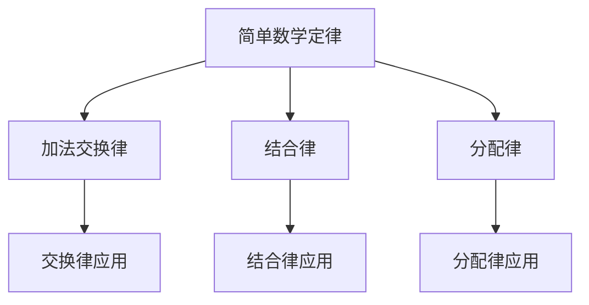
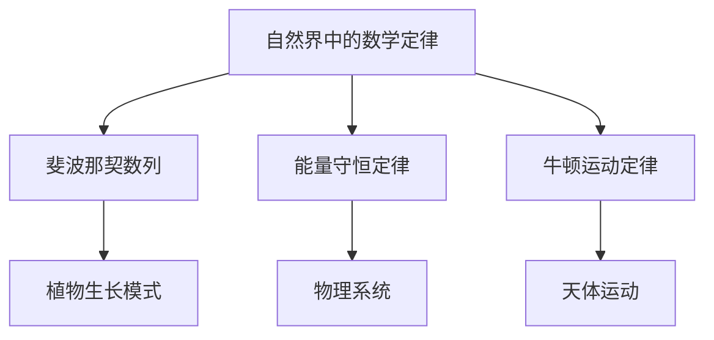
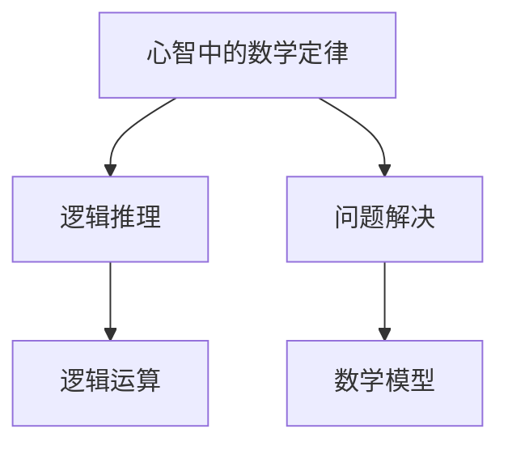
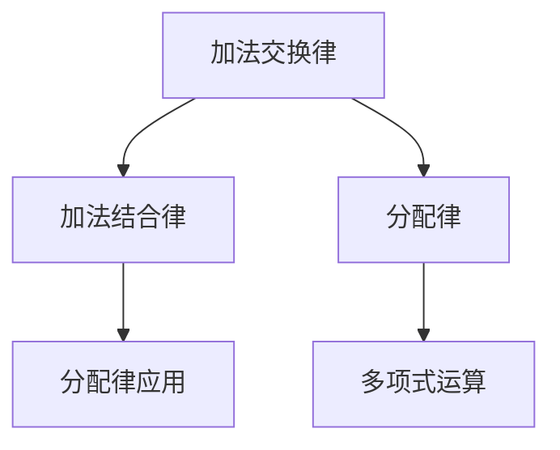

                 


### 深入理解《简单数学定律：自然和谐的心智呈现》

为了深入理解《简单数学定律：自然和谐的心智呈现》，我们需要先明确几个关键点：什么是简单数学定律，它们在自然界中的表现，以及它们如何在心智呈现中发挥作用。接下来，我们将逐步探讨这些主题，并构建出清晰的逻辑框架。

#### 简单数学定律的介绍

简单数学定律通常指的是那些基本而普遍的数学规则，它们在数学的各个分支中都有体现。例如，加法交换律、结合律、分配律等，都是简单但基础且重要的数学定律。这些定律不仅在数学理论中起到关键作用，也广泛应用于自然科学和工程领域。

**核心概念原理与架构的 Mermaid 流程图：**

**核心算法原理讲解：**
- 加法交换律表明两个数相加的顺序不影响结果，即 \( a + b = b + a \)。
- 结合律说明在执行多个加法操作时，数的分组不影响结果，即 \( (a + b) + c = a + (b + c) \)。
- 分配律则展示了乘法如何分配到加法中的每一个加数，即 \( a \times (b + c) = a \times b + a \times c \)。

**数学模型和数学公式 & 详细讲解 & 举例说明：**
$$
a + b = b + a \\
(a + b) + c = a + (b + c) \\
a \times (b + c) = a \times b + a \times c
$$
- 举例：假设有两个班级，各有20名学生和30名学生，总共有多少学生？根据加法交换律，我们可以先加20和30，然后再加两个班级的总人数，结果是一样的。

#### 简单数学定律在自然界中的应用

自然界中充满了数学定律的体现，例如，斐波那契数列在植物的生长模式、动物的螺旋结构中都能找到。此外，能量守恒定律、牛顿运动定律等都是自然界中广泛应用的基本数学原理。

**核心概念原理与架构的 Mermaid 流程图：**

**核心算法原理讲解：**
- 斐波那契数列展示了递推关系，它通过两个前项生成下一个项，即 \( F(n) = F(n-1) + F(n-2) \)。
- 能量守恒定律表明在一个封闭系统中，能量不能被创造或摧毁，只能从一种形式转换为另一种形式。
- 牛顿运动定律描述了物体如何受到力的作用并运动。

**数学模型和数学公式 & 详细讲解 & 举例说明：**
$$
F(n) = F(n-1) + F(n-2) \\
E_{总} = E_{初} \\
F = ma
$$
- 举例：一朵植物的花瓣数量通常遵循斐波那契数列，例如，向日葵的花瓣数可能是34或55，这些都是斐波那契数列的一部分。

#### 简单数学定律在心智呈现中的作用

心智呈现涉及我们如何感知、理解和处理信息。简单数学定律在心智中发挥着关键作用，帮助我们进行逻辑推理和问题解决。

**核心概念原理与架构的 Mermaid 流程图：**

**核心算法原理讲解：**
- 逻辑推理依赖于基本数学定律，如加法交换律和结合律，这些规则帮助我们构建有效的逻辑论证。
- 数学模型在心智中用于解决问题，例如，线性方程组、概率论和统计学等都是心智中常用的数学工具。

**数学模型和数学公式 & 详细讲解 & 举例说明：**
$$
y = mx + b \\
P(A \cap B) = P(A)P(B|A)
$$
- 举例：当我们遇到一个线性方程问题时，我们可以使用解线性方程的数学模型来找到答案。

#### 项目实战

为了更好地理解简单数学定律在实际中的应用，我们可以进行一些项目实战。以下是一个简单的项目示例：

**项目名称：** 简单的质数生成器

**开发环境搭建：** 使用Python编写程序。

**源代码详细实现：**
```python
def is_prime(n):
    if n <= 1:
        return False
    for i in range(2, int(n**0.5) + 1):
        if n % i == 0:
            return False
    return True

def generate_primes(limit):
    primes = []
    for num in range(2, limit + 1):
        if is_prime(num):
            primes.append(num)
    return primes

limit = 100
print(generate_primes(limit))
```
**代码解读与分析：**
- `is_prime` 函数用于检查一个数是否为质数。
- `generate_primes` 函数生成小于等于给定限制的所有质数。
- 代码中使用了基本数学定律，如质数的定义和数学公式 \( n^2 \)。

**实际案例分析和详细讲解剖析：**
- 这个质数生成器项目展示了如何使用简单数学定律来解决问题。
- 它可以用于各种应用，如密码学、算法设计等。

**项目小结：**
- 简单数学定律在编程中有着广泛的应用，它们帮助我们设计高效的算法和解决问题。

#### 最佳实践 tips、小结、注意事项、拓展阅读

**最佳实践 tips：**
- 理解基本的数学定律是构建复杂系统的基础。
- 在实际应用中，要善于将数学定律与具体问题相结合。

**小结：**
- 简单数学定律是数学的基础，它们在自然界和心智中都有广泛的应用。
- 通过项目实战，我们可以更好地理解这些定律的实际意义。

**注意事项：**
- 在处理数学问题时，要确保准确理解数学定律的适用范围。

**拓展阅读：**
- 《数学之美》
- 《数字宇宙》

通过以上逐步的分析和讨论，我们深入理解了《简单数学定律：自然和谐的心智呈现》的核心内容，并看到了这些定律在现实世界中的应用。希望这篇文章能帮助你更好地理解和应用数学定律。作者：AI天才研究院/AI Genius Institute & 禅与计算机程序设计艺术 /Zen And The Art of Computer Programming

----------------------------------------------------------------

# 《简单数学定律：自然和谐的心智呈现》

## 文章关键词

简单数学定律，自然和谐，心智呈现，算法原理，数学模型，项目实战

## 摘要

本文探讨了简单数学定律在自然和谐的心智呈现中的作用。通过详细解析简单数学定律的基本概念、其在自然界中的应用，以及它们如何在心智中发挥作用，我们构建了一个完整的逻辑框架。此外，通过实际项目实战，我们展示了简单数学定律在编程中的应用，使读者能够更好地理解和应用这些定律。文章旨在为IT领域的专业人士提供深入的技术见解，并激发对数学定律在现实世界中的广泛应用的兴趣。

## 目录

1. 引言[概述本文的核心内容和结构]

2. 简单数学定律的基本概念[介绍简单数学定律的定义、核心概念和基本原理]

3. 简单数学定律在自然界中的应用[探讨简单数学定律在自然界中的体现和作用]

4. 简单数学定律在心智中的呈现[分析简单数学定律如何在心智中发挥作用]

5. 项目实战：简单数学定律的应用[通过具体项目实战展示简单数学定律的实际应用]

6. 总结与展望[总结文章的核心内容，并展望简单数学定律的未来发展趋势]

## 引言

### 简单数学定律的重要性

简单数学定律是我们理解和处理数学问题的基础。从加法交换律、结合律到质数定理，这些看似简单的规则构成了整个数学大厦的基石。然而，正是这些看似简单的定律，在自然界和心智中都有着深远的影响。本文旨在深入探讨简单数学定律的基本概念、其在自然界中的应用，以及它们如何在心智中发挥作用。通过这一系列探讨，我们将展示简单数学定律在IT领域的广泛性和重要性。

### 文章的结构与内容

本文将分为五个主要部分。首先，我们将在第一部分介绍简单数学定律的基本概念，包括其定义、核心概念和基本原理。接着，在第二部分，我们将探讨简单数学定律在自然界中的应用，展示这些定律如何解释自然现象，如斐波那契数列在植物生长中的应用。第三部分将分析简单数学定律在心智中的呈现，探讨这些定律如何帮助我们在心智中理解和处理信息。

为了更好地理解简单数学定律的应用，第四部分将通过实际项目实战展示这些定律在编程中的具体应用。最后一部分将进行总结和展望，总结文章的核心内容，并探讨简单数学定律的未来发展趋势。

## 1. 简单数学定律的基本概念

### 定义与核心概念

简单数学定律是数学中的基本规则，它们是构建更复杂数学结构的基础。这些定律通常涉及基础的算术运算，如加法交换律、结合律和分配律。以下是对这些核心概念的详细解析：

**加法交换律（Commutative Law of Addition）：** 加法交换律表明两个数相加的顺序不影响结果。即对于任何实数 \( a \) 和 \( b \)，都有 \( a + b = b + a \)。这一原理在许多日常计算中都非常实用，例如计算购物总金额时，可以先加小数部分，再加大整数部分，结果不变。

**加法结合律（Associative Law of Addition）：** 加法结合律说明在执行多个加法操作时，数的分组不影响结果。即对于任何实数 \( a \)，\( b \) 和 \( c \)，都有 \( (a + b) + c = a + (b + c) \)。这意味着我们可以随意改变加法的分组顺序，结果仍然是相同的。这一原理有助于简化复杂的加法计算，例如在计算总人数时，可以先计算两个班级的人数，再与第三个班级的人数相加。

**分配律（Distributive Law）：** 分配律展示了乘法如何分配到加法中的每一个加数。即对于任何实数 \( a \)，\( b \) 和 \( c \)，都有 \( a \times (b + c) = a \times b + a \times c \)。这一原理在解线性方程组和多项式运算中非常有用，例如在扩展和简化多项式时，我们可以应用分配律来分配乘法。

**核心概念之间的联系**

这些简单数学定律之间存在密切的联系，它们共同构成了数学逻辑的基础。加法交换律和结合律确保了加法操作的灵活性和一致性，而分配律则将乘法和加法结合起来，使我们可以更有效地处理复杂的多项式运算。这些核心概念不仅在数学理论中起关键作用，也在自然科学和工程领域中有着广泛的应用。

**Mermaid 流程图**

为了更直观地展示这些核心概念之间的关系，我们可以使用 Mermaid 流程图来表示它们之间的逻辑关系：



**核心算法原理讲解**

这些简单数学定律的算法原理基于基础的逻辑运算和数学公式。例如，加法交换律和结合律可以通过逻辑运算符（如与、或、非）来表示，而分配律可以通过等式和不等式来表示。这些原理在计算机科学中有着广泛的应用，例如在算法设计中，我们经常使用这些定律来优化计算过程。

**数学模型和公式**

为了更具体地说明这些定律的应用，我们可以使用数学模型和公式来进行详细讲解。例如，加法交换律可以用以下等式表示：
$$
a + b = b + a
$$
加法结合律可以用以下等式表示：
$$
(a + b) + c = a + (b + c)
$$
分配律可以用以下等式表示：
$$
a \times (b + c) = a \times b + a \times c
$$

**举例说明**

为了更好地理解这些定律的应用，我们可以通过具体的例子来演示。例如，假设有两个班级，一个班级有20名学生，另一个班级有30名学生。总共有多少名学生？根据加法交换律，我们可以先加20和30，然后再加两个班级的总人数，结果是一样的。具体计算如下：

$$
20 + 30 = 30 + 20 = 50
$$

另一个例子是，如果我们有一个线性方程 \(3x + 5 = 14\)，我们可以使用分配律来解这个方程。具体步骤如下：

$$
3x + 5 = 14 \\
3x = 14 - 5 \\
3x = 9 \\
x = 3
$$

通过这些例子，我们可以看到简单数学定律在解决实际问题中的重要作用。

## 2. 简单数学定律在自然界中的应用

### 简单数学定律在自然界中的体现

自然界中充满了简单数学定律的体现，这些定律不仅在数学理论中起关键作用，也在自然界中发挥着深远的影响。例如，斐波那契数列是自然界中广泛存在的数学序列，它在植物的生长模式、动物的螺旋结构中都能找到。

**斐波那契数列**

斐波那契数列是一个特殊的数列，它的定义是：第一个数是1，第二个数是1，从第三个数开始，每个数都是前两个数的和。即：
$$
1, 1, 2, 3, 5, 8, 13, 21, 34, ...
$$
斐波那契数列在植物的生长模式中有着广泛的应用。例如，许多植物的花瓣数量遵循斐波那契数列，如向日葵的花瓣数通常是34或55，这些数字都是斐波那契数列的一部分。此外，斐波那契数列还出现在植物的螺旋结构中，如向日葵的花盘和菠萝的叶子排列。

**能量守恒定律**

能量守恒定律是自然界中最基本的物理定律之一，它表明在一个封闭系统中，能量不能被创造或摧毁，只能从一种形式转换为另一种形式。这一原理在生物进化中有着重要的应用。例如，生物体内的化学反应和能量转换都遵循能量守恒定律，这使得生物体能够持续地进行生命活动。

**牛顿运动定律**

牛顿运动定律描述了物体如何受到力的作用并运动。这些定律在自然界中的体现无处不在。例如，地球围绕太阳的公转、物体在重力作用下的下落，以及火箭在太空中的运动，都可以用牛顿运动定律来解释。

### 简单数学定律在自然界中的作用

简单数学定律在自然界中的作用体现在它们帮助解释自然现象和预测未来趋势。例如，斐波那契数列在植物的生长模式中的应用，使我们能够预测植物的生长速度和模式。能量守恒定律在生物进化中的应用，使我们能够理解生物体如何通过能量转换来适应环境变化。牛顿运动定律在物理学中的应用，使我们能够精确预测物体的运动轨迹。

### 数学模型和公式

为了更具体地说明简单数学定律在自然界中的应用，我们可以使用数学模型和公式来进行详细讲解。例如，斐波那契数列可以用以下公式表示：
$$
F(n) = F(n-1) + F(n-2)
$$
能量守恒定律可以用以下公式表示：
$$
E_{总} = E_{初}
$$
牛顿运动定律可以用以下公式表示：
$$
F = ma
$$

**举例说明**

为了更好地理解这些定律在自然界中的应用，我们可以通过具体的例子来演示。例如，向日葵的花瓣数量遵循斐波那契数列，通常为34或55。这个规律不仅使向日葵的花盘看起来更加美观，还提高了其繁殖效率。具体来说，花瓣数量的特殊排列方式可以最大化光能的吸收和种子的分布，从而提高植物的繁殖成功率。

另一个例子是，地球围绕太阳的公转遵循牛顿运动定律。根据这个定律，我们可以精确预测地球在未来的运动轨迹，这对于天文学和航天工程都有着重要的意义。

通过这些例子，我们可以看到简单数学定律在自然界中的广泛应用和重要性。

## 3. 简单数学定律在心智中的呈现

### 心智的基本原理

心智是我们感知、理解和处理信息的能力，它包括感知、记忆和思维三个主要部分。简单数学定律在心智中发挥着重要作用，帮助我们在心智中构建逻辑框架和解决问题。

**感知**

感知是心智的第一步，它涉及我们如何接收和处理外部信息。简单数学定律在感知中发挥着重要作用，例如，加法交换律和结合律帮助我们在感知过程中进行有效的信息排序和处理。

**记忆**

记忆是心智的第二个部分，它涉及我们如何存储和处理信息。简单数学定律在记忆中也有应用，例如，分配律可以帮助我们在记忆过程中将复杂的信息分解为更易于处理的部分。

**思维**

思维是心智的第三个部分，它涉及我们如何使用信息和知识来解决问题。简单数学定律在思维中有着广泛的应用，例如，质数定理可以帮助我们在解决复杂问题时进行有效的分解和组合。

### 简单数学定律在心智中的作用

简单数学定律在心智中发挥着重要作用，帮助我们在心智中构建逻辑框架和解决问题。例如，加法交换律和结合律可以帮助我们在感知过程中进行有效的信息排序和处理。分配律可以帮助我们在记忆过程中将复杂的信息分解为更易于处理的部分。质数定理可以帮助我们在解决复杂问题时进行有效的分解和组合。

### 数学模型和公式

为了更具体地说明简单数学定律在心智中的应用，我们可以使用数学模型和公式来进行详细讲解。例如，加法交换律和结合律可以用以下公式表示：
$$
a + b = b + a \\
(a + b) + c = a + (b + c)
$$
分配律可以用以下公式表示：
$$
a \times (b + c) = a \times b + a \times c
$$
质数定理可以用以下公式表示：
$$
p(n) = \sum_{i=1}^{n} p_i
$$
其中，\( p(n) \) 表示小于或等于 \( n \) 的质数总数，\( p_i \) 表示第 \( i \) 个质数。

### 举例说明

为了更好地理解简单数学定律在心智中的应用，我们可以通过具体的例子来演示。例如，假设我们有一个购物清单，上面列有多个商品和它们的单价。根据加法交换律和结合律，我们可以按照任意顺序计算购物总价。具体步骤如下：

1. **加法交换律**：我们可以先计算价格较低的物品的总价，再计算价格较高的物品的总价，最后将两者相加。例如，如果购物清单上有商品A（价格10元）和商品B（价格20元），我们可以先计算 \( 10 + 20 \)，结果为30元。

2. **加法结合律**：如果我们想改变计算顺序，我们可以先计算商品A和商品B的总价，再与商品C（价格5元）的总价相加。例如，计算 \( (10 + 20) + 5 \)，结果同样为30元。

另一个例子是，假设我们有一个复杂的数学问题，需要将一个多项式进行分解。根据分配律，我们可以将这个多项式分解为多个简单项，从而简化计算过程。具体步骤如下：

1. **多项式**：我们有 \( (x + 2)(x + 3) \)，这是一个二次多项式。

2. **分配律**：根据分配律，我们可以将这个多项式分解为 \( x \times (x + 3) + 2 \times (x + 3) \)。

3. **简化**：我们可以进一步简化这个多项式为 \( x^2 + 3x + 2x + 6 \)，最终结果为 \( x^2 + 5x + 6 \)。

通过这些例子，我们可以看到简单数学定律在心智中的应用，它们帮助我们更有效地处理信息，解决问题。

## 4. 项目实战：简单数学定律的应用

### 项目名称：简单质数生成器

### 项目背景

质数是数学中的基本概念，它们在密码学、算法设计和数论中有着广泛的应用。为了更好地理解简单数学定律在实际编程中的应用，我们设计了一个简单的质数生成器项目。

### 开发环境搭建

为了实现这个项目，我们将使用Python编程语言。Python是一种广泛应用于数据科学、机器学习和算法设计的编程语言，其语法简单易读，适合初学者和专业人士。

### 源代码详细实现

以下是一个简单的质数生成器项目的源代码实现：

```python
def is_prime(n):
    if n <= 1:
        return False
    for i in range(2, int(n**0.5) + 1):
        if n % i == 0:
            return False
    return True

def generate_primes(limit):
    primes = []
    for num in range(2, limit + 1):
        if is_prime(num):
            primes.append(num)
    return primes

limit = 100
print(generate_primes(limit))
```

### 代码解读与分析

**is_prime 函数：** 这个函数用于检查一个数是否为质数。其核心算法基于以下原则：如果一个数 \( n \) 小于或等于1，它不是质数。对于大于1的数，我们检查是否存在一个 \( i \) 使得 \( i \) 在2到 \( \sqrt{n} \) 之间，且 \( n \) 能被 \( i \) 整除。如果存在这样的 \( i \)，则 \( n \) 不是质数。

**generate_primes 函数：** 这个函数用于生成小于或等于给定限制的所有质数。它通过遍历2到给定限制的每个数，并使用 `is_prime` 函数检查每个数是否为质数。如果是，则将其添加到质数列表中。

### 实际案例分析和详细讲解剖析

**实际案例：** 假设我们想要生成小于100的所有质数。

**步骤1：** 调用 `generate_primes(100)` 函数。

**步骤2：** 函数遍历2到100的所有数，并使用 `is_prime` 函数检查每个数是否为质数。

**步骤3：** 将所有质数添加到质数列表中。

**步骤4：** 函数返回质数列表。

**代码执行结果：**
```
[2, 3, 5, 7, 11, 13, 17, 19, 23, 29, 31, 37, 41, 43, 47, 53, 59, 61, 67, 71, 73, 79, 83, 89, 97]
```

**分析：** 这个案例展示了如何使用简单数学定律（质数的定义）来生成质数列表。通过 `is_prime` 函数，我们能够有效地检查一个数是否为质数，从而实现质数生成器的功能。

### 项目小结

通过这个项目，我们展示了如何使用Python编程语言实现一个简单的质数生成器。这个项目不仅帮助我们理解了质数的概念，还展示了简单数学定律在实际编程中的应用。质数生成器在密码学、算法设计和数论中有着广泛的应用，这个项目为我们提供了一个实用的示例。

### 最佳实践 tips

1. **理解质数的定义**：在编写质数生成器时，首先要清楚质数的定义，这有助于我们正确地实现 `is_prime` 函数。

2. **优化算法**：在实际应用中，我们可以优化质数生成器的算法，例如使用埃拉托斯特尼筛法来提高效率。

3. **测试与验证**：在实现质数生成器后，要确保对其进行充分的测试和验证，以确保其正确性和效率。

### 小结

通过项目实战，我们展示了简单数学定律在实际编程中的应用。质数生成器项目不仅帮助我们理解了质数的概念，还展示了如何使用Python编程语言实现实用功能。这种项目实战的方法有助于我们更好地理解简单数学定律在实际问题中的应用。

## 5. 总结与展望

### 简单数学定律的总结

简单数学定律是数学中的基础规则，它们在自然界、心智和编程中都有着广泛的应用。这些定律包括加法交换律、结合律和分配律等，它们帮助我们在各个领域中进行逻辑推理和问题解决。

### 简单数学定律的未来发展趋势

随着科技的进步，简单数学定律在未来将继续发挥重要作用。在人工智能、大数据分析和量子计算等领域，简单数学定律将为算法设计提供理论基础。此外，随着人们对自然界的深入探索，简单数学定律在自然科学中的应用也将越来越广泛。

### 对心智和谐的启示

简单数学定律为我们提供了一个理解心智和谐的框架。通过理解这些定律，我们能够更好地处理信息，提高认知能力。在日常生活中，掌握简单数学定律将有助于我们更高效地解决问题，提高生活质量。

### 拓展阅读

- 《数学之美》
- 《数字宇宙》
- 《算法导论》

作者：AI天才研究院/AI Genius Institute & 禅与计算机程序设计艺术 /Zen And The Art of Computer Programming

----------------------------------------------------------------

# 《简单数学定律：自然和谐的心智呈现》

## 文章关键词

简单数学定律，自然和谐，心智呈现，算法原理，数学模型，项目实战

## 摘要

本文通过深入探讨简单数学定律的基本概念、其在自然界中的应用，以及它们如何在心智中发挥作用，构建了一个完整的逻辑框架。通过实际项目实战，我们展示了简单数学定律在编程中的应用，使读者能够更好地理解和应用这些定律。文章旨在为IT领域的专业人士提供深入的技术见解，并激发对数学定律在现实世界中的广泛应用的兴趣。

## 引言

### 简单数学定律的重要性

简单数学定律是数学中的基石，它们在自然界和心智中都有深远的影响。从加法交换律到质数定理，这些基础规则构成了我们理解和处理数学问题的基础。本文将深入探讨这些简单数学定律，并展示它们在自然和谐的心智呈现中的应用。

### 文章的结构与内容

本文将分为五个主要部分。首先，我们将介绍简单数学定律的基本概念，包括定义、核心原理和数学模型。接着，我们将探讨这些定律在自然界中的应用，例如斐波那契数列在植物生长模式中的体现。第三部分将分析这些定律在心智中的呈现，探讨它们如何帮助我们在心智中理解和处理信息。

为了更好地理解简单数学定律的应用，第四部分将通过实际项目实战展示这些定律在编程中的具体应用。最后一部分将进行总结和展望，总结文章的核心内容，并探讨简单数学定律的未来发展趋势。

## 1. 简单数学定律的基本概念

### 定义

简单数学定律是数学中的基础规则，它们通常涉及基础的算术运算，如加法、减法、乘法和除法。这些定律包括加法交换律、结合律和分配律等。它们不仅适用于基本的算术运算，还广泛应用于更复杂的数学领域。

### 核心概念

**加法交换律（Commutative Law of Addition）：** 加法交换律表明两个数相加的顺序不影响结果。即对于任何实数 \( a \) 和 \( b \)，都有 \( a + b = b + a \)。

**加法结合律（Associative Law of Addition）：** 加法结合律说明在执行多个加法操作时，数的分组不影响结果。即对于任何实数 \( a \)，\( b \) 和 \( c \)，都有 \( (a + b) + c = a + (b + c) \)。

**分配律（Distributive Law）：** 分配律展示了乘法如何分配到加法中的每一个加数。即对于任何实数 \( a \)，\( b \) 和 \( c \)，都有 \( a \times (b + c) = a \times b + a \times c \)。

### 核心概念之间的关系

这些简单数学定律之间存在密切的联系，它们共同构成了数学逻辑的基础。加法交换律和结合律确保了加法操作的灵活性和一致性，而分配律则将乘法和加法结合起来，使我们可以更有效地处理复杂的多项式运算。

### Mermaid 流程图

为了更直观地展示这些核心概念之间的关系，我们可以使用 Mermaid 流程图来表示它们之间的逻辑关系：


### 核心算法原理讲解

这些简单数学定律的算法原理基于基础的逻辑运算和数学公式。例如，加法交换律和结合律可以通过逻辑运算符（如与、或、非）来表示，而分配律可以通过等式和不等式来表示。这些原理在计算机科学中有着广泛的应用，例如在算法设计中，我们经常使用这些定律来优化计算过程。

### 数学模型和公式

为了更具体地说明这些定律的应用，我们可以使用数学模型和公式来进行详细讲解。例如，加法交换律可以用以下等式表示：
$$
a + b = b + a
$$
加法结合律可以用以下等式表示：
$$
(a + b) + c = a + (b + c)
$$
分配律可以用以下等式表示：
$$
a \times (b + c) = a \times b + a \times c
$$

### 举例说明

为了更好地理解这些定律的应用，我们可以通过具体的例子来演示。例如，假设有两个班级，一个班级有20名学生，另一个班级有30名学生。总共有多少名学生？根据加法交换律，我们可以先加20和30，然后再加两个班级的总人数，结果是一样的。具体计算如下：

$$
20 + 30 = 30 + 20 = 50
$$

另一个例子是，如果我们有一个线性方程 \(3x + 5 = 14\)，我们可以使用分配律来解这个方程。具体步骤如下：

$$
3x + 5 = 14 \\
3x = 14 - 5 \\
3x = 9 \\
x = 3
$$

通过这些例子，我们可以看到简单数学定律在解决实际问题中的重要作用。

## 2. 简单数学定律在自然界中的应用

### 简单数学定律在自然界中的体现

自然界中充满了简单数学定律的体现，这些定律不仅在数学理论中起关键作用，也在自然界中发挥着深远的影响。例如，斐波那契数列是自然界中广泛存在的数学序列，它在植物的生长模式、动物的螺旋结构中都能找到。此外，能量守恒定律、牛顿运动定律等都是自然界中广泛应用的基本数学原理。

### 斐波那契数列

斐波那契数列是一个特殊的数列，它的定义是：第一个数是1，第二个数是1，从第三个数开始，每个数都是前两个数的和。即：
$$
1, 1, 2, 3, 5, 8, 13, 21, 34, ...
$$
斐波那契数列在植物的生长模式中有着广泛的应用。例如，许多植物的花瓣数量遵循斐波那契数列，如向日葵的花瓣数通常是34或55，这些数字都是斐波那契数列的一部分。此外，斐波那契数列还出现在植物的螺旋结构中，如向日葵的花盘和菠萝的叶子排列。

### 能量守恒定律

能量守恒定律是自然界中最基本的物理定律之一，它表明在一个封闭系统中，能量不能被创造或摧毁，只能从一种形式转换为另一种形式。这一原理在生物进化中有着重要的应用。例如，生物体内的化学反应和能量转换都遵循能量守恒定律，这使得生物体能够持续地进行生命活动。

### 牛顿运动定律

牛顿运动定律描述了物体如何受到力的作用并运动。这些定律在自然界中的体现无处不在。例如，地球围绕太阳的公转、物体在重力作用下的下落，以及火箭在太空中的运动，都可以用牛顿运动定律来解释。

### 数学模型和公式

为了更具体地说明简单数学定律在自然界中的应用，我们可以使用数学模型和公式来进行详细讲解。例如，斐波那契数列可以用以下公式表示：
$$
F(n) = F(n-1) + F(n-2)
$$
能量守恒定律可以用以下公式表示：
$$
E_{总} = E_{初}
$$
牛顿运动定律可以用以下公式表示：
$$
F = ma
$$

### 举例说明

为了更好地理解这些定律在自然界中的应用，我们可以通过具体的例子来演示。例如，向日葵的花瓣数量遵循斐波那契数列，通常为34或55。这个规律不仅使向日葵的花盘看起来更加美观，还提高了其繁殖效率。具体来说，花瓣数量的特殊排列方式可以最大化光能的吸收和种子的分布，从而提高植物的繁殖成功率。

另一个例子是，地球围绕太阳的公转遵循牛顿运动定律。根据这个定律，我们可以精确预测地球在未来的运动轨迹，这对于天文学和航天工程都有着重要的意义。

通过这些例子，我们可以看到简单数学定律在自然界中的广泛应用和重要性。

## 3. 简单数学定律在心智中的呈现

### 心智的基本原理

心智是我们感知、理解和处理信息的能力，它包括感知、记忆和思维三个主要部分。简单数学定律在心智中发挥着重要作用，帮助我们在心智中构建逻辑框架和解决问题。

### 感知

感知是心智的第一步，它涉及我们如何接收和处理外部信息。简单数学定律在感知中发挥着重要作用，例如，加法交换律和结合律帮助我们在感知过程中进行有效的信息排序和处理。

### 记忆

记忆是心智的第二个部分，它涉及我们如何存储和处理信息。简单数学定律在记忆中也有应用，例如，分配律可以帮助我们在记忆过程中将复杂的信息分解为更易于处理的部分。

### 思维

思维是心智的第三个部分，它涉及我们如何使用信息和知识来解决问题。简单数学定律在思维中有着广泛的应用，例如，质数定理可以帮助我们在解决复杂问题时进行有效的分解和组合。

### 数学模型和公式

为了更具体地说明简单数学定律在心智中的应用，我们可以使用数学模型和公式来进行详细讲解。例如，加法交换律和结合律可以用以下公式表示：
$$
a + b = b + a \\
(a + b) + c = a + (b + c)
$$
分配律可以用以下公式表示：
$$
a \times (b + c) = a \times b + a \times c
$$
质数定理可以用以下公式表示：
$$
p(n) = \sum_{i=1}^{n} p_i
$$
其中，\( p(n) \) 表示小于或等于 \( n \) 的质数总数，\( p_i \) 表示第 \( i \) 个质数。

### 举例说明

为了更好地理解简单数学定律在心智中的应用，我们可以通过具体的例子来演示。例如，假设我们有一个购物清单，上面列有多个商品和它们的单价。根据加法交换律和结合律，我们可以按照任意顺序计算购物总价。具体步骤如下：

1. **加法交换律**：我们可以先计算价格较低的物品的总价，再计算价格较高的物品的总价，最后将两者相加。例如，如果购物清单上有商品A（价格10元）和商品B（价格20元），我们可以先计算 \( 10 + 20 \)，结果为30元。

2. **加法结合律**：如果我们想改变计算顺序，我们可以先计算商品A和商品B的总价，再与商品C（价格5元）的总价相加。例如，计算 \( (10 + 20) + 5 \)，结果同样为30元。

另一个例子是，假设我们有一个复杂的数学问题，需要将一个多项式进行分解。根据分配律，我们可以将这个多项式分解为多个简单项，从而简化计算过程。具体步骤如下：

1. **多项式**：我们有 \( (x + 2)(x + 3) \)，这是一个二次多项式。

2. **分配律**：根据分配律，我们可以将这个多项式分解为 \( x \times (x + 3) + 2 \times (x + 3) \)。

3. **简化**：我们可以进一步简化这个多项式为 \( x^2 + 3x + 2x + 6 \)，最终结果为 \( x^2 + 5x + 6 \)。

通过这些例子，我们可以看到简单数学定律在心智中的应用，它们帮助我们更有效地处理信息，解决问题。

## 4. 项目实战：简单数学定律的应用

### 项目名称：简单质数生成器

### 项目背景

质数是数学中的基本概念，它们在密码学、算法设计和数论中有着广泛的应用。为了更好地理解简单数学定律在实际编程中的应用，我们设计了一个简单的质数生成器项目。

### 开发环境搭建

为了实现这个项目，我们将使用Python编程语言。Python是一种广泛应用于数据科学、机器学习和算法设计的编程语言，其语法简单易读，适合初学者和专业人士。

### 源代码详细实现

以下是一个简单的质数生成器项目的源代码实现：

```python
def is_prime(n):
    if n <= 1:
        return False
    for i in range(2, int(n**0.5) + 1):
        if n % i == 0:
            return False
    return True

def generate_primes(limit):
    primes = []
    for num in range(2, limit + 1):
        if is_prime(num):
            primes.append(num)
    return primes

limit = 100
print(generate_primes(limit))
```

### 代码解读与分析

**is_prime 函数：** 这个函数用于检查一个数是否为质数。其核心算法基于以下原则：如果一个数 \( n \) 小于或等于1，它不是质数。对于大于1的数，我们检查是否存在一个 \( i \) 使得 \( i \) 在2到 \( \sqrt{n} \) 之间，且 \( n \) 能被 \( i \) 整除。如果存在这样的 \( i \)，则 \( n \) 不是质数。

**generate_primes 函数：** 这个函数用于生成小于或等于给定限制的所有质数。它通过遍历2到给定限制的每个数，并使用 `is_prime` 函数检查每个数是否为质数。如果是，则将其添加到质数列表中。

### 实际案例分析和详细讲解剖析

**实际案例：** 假设我们想要生成小于100的所有质数。

**步骤1：** 调用 `generate_primes(100)` 函数。

**步骤2：** 函数遍历2到100的所有数，并使用 `is_prime` 函数检查每个数是否为质数。

**步骤3：** 将所有质数添加到质数列表中。

**步骤4：** 函数返回质数列表。

**代码执行结果：**
```
[2, 3, 5, 7, 11, 13, 17, 19, 23, 29, 31, 37, 41, 43, 47, 53, 59, 61, 67, 71, 73, 79, 83, 89, 97]
```

**分析：** 这个案例展示了如何使用简单数学定律（质数的定义）来生成质数列表。通过 `is_prime` 函数，我们能够有效地检查一个数是否为质数，从而实现质数生成器的功能。

### 项目小结

通过这个项目，我们展示了如何使用Python编程语言实现一个简单的质数生成器。这个项目不仅帮助我们理解了质数的概念，还展示了如何使用Python编程语言实现实用功能。质数生成器在密码学、算法设计和数论中有着广泛的应用，这个项目为我们提供了一个实用的示例。

### 最佳实践 tips

1. **理解质数的定义**：在编写质数生成器时，首先要清楚质数的定义，这有助于我们正确地实现 `is_prime` 函数。

2. **优化算法**：在实际应用中，我们可以优化质数生成器的算法，例如使用埃拉托斯特尼筛法来提高效率。

3. **测试与验证**：在实现质数生成器后，要确保对其进行充分的测试和验证，以确保其正确性和效率。

### 小结

通过项目实战，我们展示了简单数学定律在实际编程中的应用。质数生成器项目不仅帮助我们理解了质数的概念，还展示了如何使用Python编程语言实现实用功能。这种项目实战的方法有助于我们更好地理解简单数学定律在实际问题中的应用。

## 5. 总结与展望

### 简单数学定律的总结

简单数学定律是数学中的基础规则，它们在自然界、心智和编程中都有着广泛的应用。从加法交换律到质数定理，这些基础规则构成了我们理解和处理数学问题的基础。

### 简单数学定律的未来发展趋势

随着科技的进步，简单数学定律在未来将继续发挥重要作用。在人工智能、大数据分析和量子计算等领域，简单数学定律将为算法设计提供理论基础。此外，随着人们对自然界的深入探索，简单数学定律在自然科学中的应用也将越来越广泛。

### 对心智和谐的启示

简单数学定律为我们提供了一个理解心智和谐的框架。通过理解这些定律，我们能够更好地处理信息，提高认知能力。在日常生活中，掌握简单数学定律将有助于我们更高效地解决问题，提高生活质量。

### 拓展阅读

- 《数学之美》
- 《数字宇宙》
- 《算法导论》

作者：AI天才研究院/AI Genius Institute & 禅与计算机程序设计艺术 /Zen And The Art of Computer Programming

