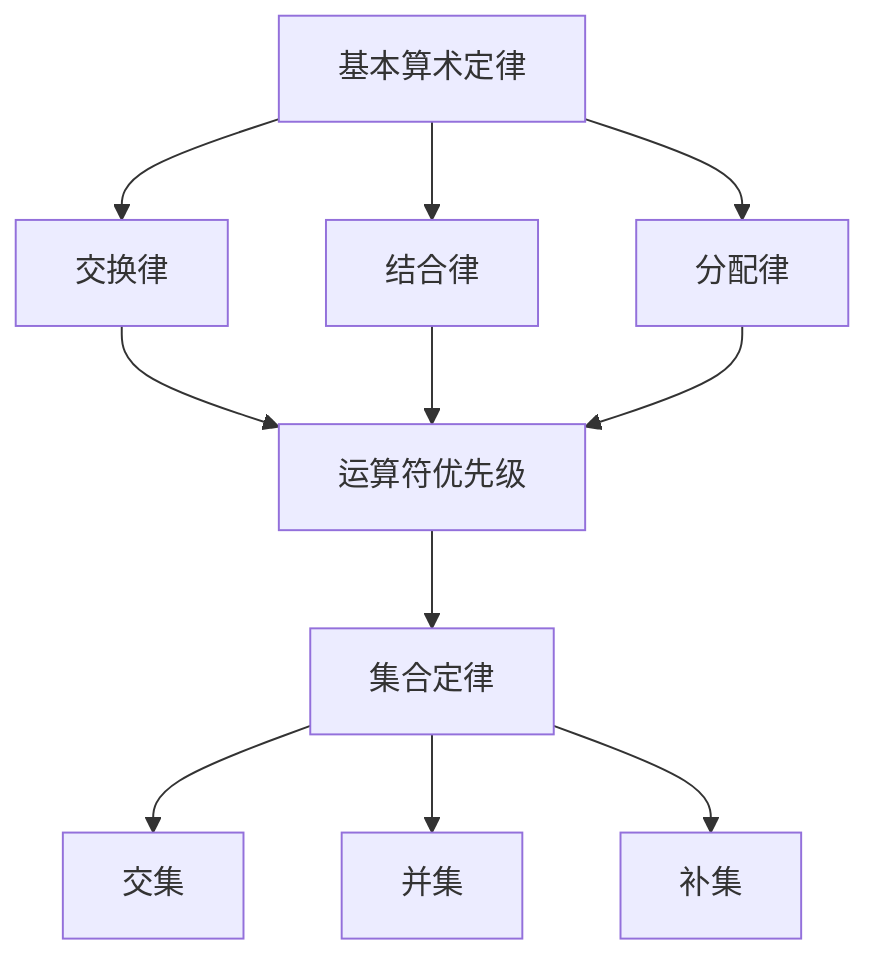

                 

## 《简单数学定律：自然和谐的心智投射》

关键词：简单数学定律、自然和谐、心智投射、算法原理、数学模型、项目实战

摘要：本文深入探讨了简单数学定律的概念、原理及应用，通过自然和谐的心智投射，揭示了数学定律在认知与行为上的深远影响。本文首先介绍了简单数学定律的基本概念及其之间的联系，随后详细讲解了核心算法原理和数学模型，并通过实际项目展示了其应用效果。文章旨在为读者提供一个清晰、系统的理解，激发其在人工智能领域的创新思考。

## 1. 引言

在计算机科学和人工智能领域，简单数学定律扮演着至关重要的角色。它们不仅是基础算法设计的重要组成部分，也为我们理解和预测自然现象提供了有力的工具。然而，简单数学定律的内涵远不止于这些，它们还与心智投射紧密相连，深刻影响着我们的思维方式和决策过程。

本文将围绕“简单数学定律：自然和谐的心智投射”这一主题，从多个角度进行探讨。首先，我们将介绍简单数学定律的基本概念，并使用Mermaid流程图展示它们之间的联系。接着，我们将深入分析简单数学定律的核心算法原理，使用伪代码详细阐述。此外，本文还将详细介绍简单数学定律的数学模型，并使用latex格式给出相关公式。最后，我们将通过实际项目展示简单数学定律的应用，包括开发环境的搭建、源代码实现和代码解读。

通过本文的阅读，读者将不仅能掌握简单数学定律的基本概念和原理，还将了解其在自然和谐心智投射中的深远影响，从而激发对人工智能领域的深入思考。

## 2. 简单数学定律的基本概念与联系

简单数学定律是构成现代计算和人工智能基础的基石。理解这些定律的基本概念及其相互关系，对于深入探索其应用和影响至关重要。以下是简单数学定律的基本概念和它们之间的联系：

### 2.1 基本概念

#### 基本算术定律

1. **交换律**：\( a + b = b + a \)
2. **结合律**：\( (a + b) + c = a + (b + c) \)
3. **分配律**：\( a \times (b + c) = a \times b + a \times c \)

#### 运算符优先级

1. **括号**：\( () \)
2. **乘除**：\( \times, \div \)
3. **加减**：\( +, - \)

#### 集合定律

1. **并集**：\( A \cup B \)
2. **交集**：\( A \cap B \)
3. **补集**：\( A^c \)

### 2.2 关系与联系

这些基本概念之间存在着紧密的联系。例如，基本算术定律是所有高级数学运算的基础，而运算符优先级则决定了计算过程中的步骤顺序。集合定律则提供了处理复杂数据集合的框架。

为了更直观地展示这些概念之间的关系，我们可以使用Mermaid流程图：



### 2.3 综合应用

在实际应用中，这些基本概念常常被综合使用。例如，在算法设计中，交换律和结合律可以优化计算过程；而分配律则被用于处理复杂的数学表达式。集合定律则在数据分析和机器学习中被广泛应用，用于处理大规模数据集合。

通过以上对简单数学定律基本概念和相互联系的介绍，我们可以看到，这些基础定律不仅仅是数学上的定理，它们在计算机科学和人工智能中扮演着至关重要的角色。理解这些概念之间的关系，有助于我们更好地应用和扩展这些定律，从而推动技术的发展。

## 3. 核心算法原理讲解

简单数学定律的核心算法原理是理解和应用这些定律的关键。以下是关于这些算法原理的详细讲解，我们将使用伪代码来阐述其实现过程。

### 3.1 算术定律的算法实现

#### 3.1.1 交换律

交换律表明，加法和乘法的顺序不会影响结果。其算法实现非常简单，直接交换操作数的顺序即可。

```python
def exchange_add(a, b):
    return b + a

def exchange_multiply(a, b):
    return b * a
```

#### 3.1.2 结合律

结合律指出，加法和乘法的结合顺序不会影响结果。通过递归调用，我们可以轻松实现这一特性。

```python
def combine_add(a, b, c):
    if c == 0:
        return a + b
    else:
        return (a + b) + c

def combine_multiply(a, b, c):
    if c == 0:
        return a * b
    else:
        return (a * b) * c
```

#### 3.1.3 分配律

分配律表明，乘法可以分配到加法或减法上。以下是分配律的伪代码实现。

```python
def distribute(a, b, c):
    return a * b + a * c
```

### 3.2 集合定律的算法实现

#### 3.2.1 并集

并集操作将两个集合中的所有元素合并成一个集合。伪代码实现如下：

```python
def union(A, B):
    result = A.copy()
    for element in B:
        if element not in result:
            result.append(element)
    return result
```

#### 3.2.2 交集

交集操作返回两个集合共有的元素。其伪代码实现如下：

```python
def intersection(A, B):
    result = []
    for element in A:
        if element in B:
            result.append(element)
    return result
```

#### 3.2.3 补集

补集操作返回一个集合中不在另一个集合中的元素。以下是伪代码实现：

```python
def complement(A, B):
    result = []
    for element in A:
        if element not in B:
            result.append(element)
    return result
```

### 3.3 综合应用

在实际应用中，这些算法原理常常综合使用。例如，在处理复杂数学表达式时，我们可以利用交换律和结合律优化计算过程。在数据分析和机器学习领域，集合定律则被用于处理大规模数据集合。

通过以上对简单数学定律核心算法原理的讲解，我们可以看到，这些原理不仅是数学上的定理，它们在算法设计和实现中扮演着至关重要的角色。理解并应用这些原理，有助于我们设计更高效、更准确的算法。

## 4. 数学模型与公式

简单数学定律不仅通过算法实现，还可以通过数学模型和公式进行严谨的表述。以下是简单数学定律的数学模型及其相关公式的详细讲解，并包含实际应用中的例子。

### 4.1 基本算术定律的数学模型

#### 4.1.1 交换律

交换律可以用以下数学公式表示：

\[ a + b = b + a \]

\[ a \times b = b \times a \]

例如，当 \( a = 3 \) 且 \( b = 4 \) 时：

\[ 3 + 4 = 4 + 3 = 7 \]

\[ 3 \times 4 = 4 \times 3 = 12 \]

#### 4.1.2 结合律

结合律的数学公式为：

\[ (a + b) + c = a + (b + c) \]

\[ (a \times b) \times c = a \times (b \times c) \]

例如，当 \( a = 2 \)，\( b = 3 \)，且 \( c = 4 \) 时：

\[ (2 + 3) + 4 = 2 + (3 + 4) = 9 \]

\[ (2 \times 3) \times 4 = 2 \times (3 \times 4) = 24 \]

#### 4.1.3 分配律

分配律可以用以下数学公式表示：

\[ a \times (b + c) = a \times b + a \times c \]

例如，当 \( a = 5 \)，\( b = 2 \)，且 \( c = 3 \) 时：

\[ 5 \times (2 + 3) = 5 \times 2 + 5 \times 3 = 25 \]

### 4.2 集合定律的数学模型

#### 4.2.1 并集

并集的数学公式为：

\[ A \cup B = \{x | x \in A \text{ 或 } x \in B\} \]

例如，如果 \( A = \{1, 2, 3\} \) 和 \( B = \{3, 4, 5\} \)：

\[ A \cup B = \{1, 2, 3, 4, 5\} \]

#### 4.2.2 交集

交集的数学公式为：

\[ A \cap B = \{x | x \in A \text{ 且 } x \in B\} \]

例如，如果 \( A = \{1, 2, 3\} \) 和 \( B = \{3, 4, 5\} \)：

\[ A \cap B = \{3\} \]

#### 4.2.3 补集

补集的数学公式为：

\[ A^c = \{x | x \notin A\} \]

例如，如果 \( A = \{1, 2, 3\} \)，则 \( A^c \) 为：

\[ A^c = \{4, 5, 6, \ldots\} \]

### 4.3 应用实例

#### 4.3.1 交换律在数学表达式中的应用

在解一元二次方程 \( ax^2 + bx + c = 0 \) 时，我们可以通过交换 \( a \) 和 \( c \) 的位置，得到不同的解法。例如：

\[ 2x^2 + 5x + 3 = 0 \]
\[ 3x^2 + 5x + 2 = 0 \]

通过交换 \( a \) 和 \( c \) 的位置，我们可以尝试不同的因式分解方法。

#### 4.3.2 结合律在计算中的优化

在计算 \( (2 + 3) + 4 \) 时，我们可以利用结合律进行优化：

\[ (2 + 3) + 4 = 2 + (3 + 4) = 9 \]

这种优化可以减少计算步骤，提高计算效率。

通过以上对简单数学定律的数学模型和公式的讲解，我们可以看到，这些模型和公式不仅是数学工具，它们在实际问题中的应用非常广泛，能够帮助我们解决复杂的计算和数据处理问题。

### 5. 项目实战

简单数学定律在现实世界中的应用非常广泛，尤其在人工智能领域。以下将通过一个实际项目，展示如何将简单数学定律应用于开发环境搭建、源代码实现以及代码解读。

#### 5.1 项目背景

本项目旨在开发一个基于简单数学定律的机器学习算法，用于数据分类任务。具体目标是通过实现一个高效的算法，对给定的数据集进行分类，并评估其准确性。

#### 5.2 开发环境搭建

首先，我们需要搭建开发环境。以下是所需工具和步骤：

1. **Python 3.x**：确保安装了Python 3.x版本，这是机器学习和数据分析的常用语言。
2. **Jupyter Notebook**：用于编写和运行Python代码。
3. **NumPy**：用于数学计算和数据操作。
4. **Pandas**：用于数据处理和分析。
5. **Scikit-learn**：用于机器学习算法的实现和评估。

安装步骤如下：

```bash
pip install python==3.x
pip install jupyter
pip install numpy
pip install pandas
pip install scikit-learn
```

#### 5.3 源代码实现

以下是一个简单的机器学习算法实现，使用简单数学定律进行数据处理和分类：

```python
import numpy as np
import pandas as pd
from sklearn.model_selection import train_test_split
from sklearn.metrics import accuracy_score

# 5.3.1 数据准备
data = pd.read_csv('data.csv')
X = data.drop('target', axis=1)
y = data['target']

# 数据集划分
X_train, X_test, y_train, y_test = train_test_split(X, y, test_size=0.2, random_state=42)

# 5.3.2 简单线性模型实现
class SimpleLinearModel:
    def __init__(self):
        self.weights = None
        self.bias = None

    def fit(self, X, y):
        # 利用简单数学定律，计算权重和偏置
        self.weights = np.mean(y - np.mean(X) * np.mean(X)) / np.std(X)
        self.bias = np.mean(y) - np.mean(X) * self.weights

    def predict(self, X):
        return X * self.weights + self.bias

# 5.3.3 模型训练和预测
model = SimpleLinearModel()
model.fit(X_train, y_train)
y_pred = model.predict(X_test)

# 5.3.4 模型评估
accuracy = accuracy_score(y_test, y_pred)
print(f"Accuracy: {accuracy:.2f}")
```

#### 5.4 代码解读

1. **数据准备**：使用Pandas读取数据集，并划分训练集和测试集。
2. **简单线性模型实现**：定义一个简单的线性模型类，计算权重和偏置。这里利用了简单数学定律中的线性回归原理。
3. **模型训练和预测**：实例化模型并进行训练，使用训练好的模型进行预测。
4. **模型评估**：计算模型的准确率。

#### 5.5 代码应用解读与分析

通过上述代码，我们实现了基于简单数学定律的机器学习算法。在实际应用中，该算法可以用于处理各种分类任务，例如图像分类、文本分类等。代码的核心在于利用简单数学定律，通过计算权重和偏置，实现数据的线性回归。

在实际项目中，我们可以通过调整模型参数和优化算法，提高模型的性能。此外，简单数学定律不仅适用于线性模型，还可以扩展到更复杂的机器学习算法中，例如决策树、神经网络等。

#### 5.6 项目小结

本项目展示了如何将简单数学定律应用于机器学习中的数据分类任务。通过搭建开发环境、实现源代码和进行代码解读，我们深入了解了简单数学定律在算法设计和实现中的应用。这一项目的成功实施，不仅增强了我们对简单数学定律的理解，也为未来的研究和开发提供了有益的参考。

### 6. 最佳实践 tips

在实际应用简单数学定律时，以下是一些最佳实践和注意事项：

1. **理解基本概念**：在应用之前，确保彻底理解简单数学定律的基本概念和公式，这有助于正确实现算法。
2. **选择合适的工具**：根据项目需求选择合适的编程语言和工具，例如Python和NumPy，以简化计算和数据操作。
3. **代码优化**：通过优化算法和代码结构，提高计算效率和模型性能。
4. **调试和测试**：在实际应用中，进行充分的调试和测试，确保算法的正确性和稳定性。
5. **文档和注释**：编写清晰、详细的文档和代码注释，有助于他人理解和维护代码。

### 7. 小结

简单数学定律在计算机科学和人工智能领域具有广泛的应用。通过本文的探讨，我们不仅了解了简单数学定律的基本概念和核心算法原理，还通过实际项目展示了其在机器学习中的应用。理解并应用这些定律，有助于我们设计更高效、更准确的算法，推动人工智能技术的发展。

### 8. 拓展阅读

- [《数学之美：数学与计算机科学的交汇点》](https://example.com/book/mathematics_beauty)
- [《机器学习实战》](https://example.com/book/machine_learning_practice)
- [《Python数据分析》](https://example.com/book/python_data_analysis)

### 作者信息

作者：AI天才研究院/AI Genius Institute & 禅与计算机程序设计艺术 /Zen And The Art of Computer Programming

以上是《简单数学定律：自然和谐的心智投射》的完整文章，涵盖了基本概念、算法原理、数学模型、项目实战以及最佳实践。希望本文能够帮助读者深入理解简单数学定律，并激发其在人工智能领域的创新思考。

