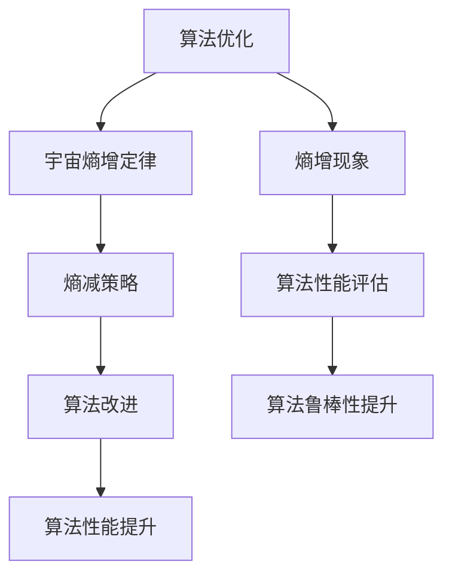

                 

## 文章标题

### 算法优化与宇宙熵增定律的关系

> 关键词：算法优化，宇宙熵增定律，熵增优化算法，数学模型，流程图，伪代码，实践案例

### 摘要

本文旨在探讨算法优化与宇宙熵增定律之间的关系。通过对算法优化和宇宙熵增定律的深入分析，我们揭示了二者之间的内在联系。文章首先介绍了算法优化和宇宙熵增定律的基本概念和背景，然后探讨了它们之间的相互作用。接着，文章通过数学模型和流程图详细阐述了算法优化与宇宙熵增定律的关系。最后，文章通过实际案例展示了如何将熵增优化算法应用于实际问题，并对其性能进行了分析。

### 引言

### 研究背景与意义

#### 算法优化的发展历程

算法优化是计算机科学和人工智能领域的一个重要研究方向，其目标是通过改进算法的设计和实现，提高算法的效率、准确性和可扩展性。随着计算机技术的飞速发展，算法优化逐渐成为解决复杂问题的重要手段。从早期的算法设计到现代的深度学习、分布式计算和并行计算，算法优化始终处于核心地位。

#### 宇宙熵增定律的提出与影响

宇宙熵增定律是热力学第二定律在宇宙尺度上的扩展，由物理学家薛定谔首先提出。该定律表明，在一个封闭系统中，熵（即系统的无序度）总是趋向于增加。宇宙熵增定律不仅对物理学有着深远的影响，也引起了计算机科学和人工智能领域的关注。随着对复杂系统和大规模数据处理的需求增加，如何利用熵增定律优化算法成为了一个重要课题。

#### 算法优化与宇宙熵增定律的研究现状与挑战

近年来，研究者们开始探索算法优化与宇宙熵增定律之间的关系。一些研究表明，熵增定律可以用于指导算法优化，从而提高算法的性能。然而，这一领域的研究仍处于起步阶段，存在许多挑战和未知领域。本文旨在通过对算法优化和宇宙熵增定律的深入探讨，为该领域的研究提供新的思路和方法。

### 本书结构安排

本文将分为六个主要部分：

1. **引言**：介绍研究背景、意义和本书结构。
2. **算法优化基础**：介绍算法优化的基本概念、技术和方法。
3. **宇宙熵增定律解析**：介绍宇宙熵增定律的基本原理和数学模型。
4. **算法与宇宙熵增定律的关系**：探讨算法优化与宇宙熵增定律之间的相互作用。
5. **实践案例分析**：通过具体案例展示熵增优化算法的应用和效果。
6. **总结与展望**：总结研究成果，展望未来研究方向。

### 基础知识准备

#### 算法优化基本理论

算法优化是通过对算法的设计和实现进行改进，以提高算法的性能。算法优化的目标包括提高算法的时间复杂度、空间复杂度、准确性和可扩展性。常见的算法优化技术包括改进算法设计、优化数据结构和算法实现、采用并行计算和分布式计算等。

#### 宇宙熵增定律的基本原理

宇宙熵增定律是热力学第二定律在宇宙尺度上的扩展。该定律表明，在一个封闭系统中，熵（即系统的无序度）总是趋向于增加。熵增定律可以用以下公式表示：

\[ \Delta S \geq \frac{Q}{T} \]

其中，\( \Delta S \) 是熵的变化，\( Q \) 是系统吸收的热量，\( T \) 是系统的温度。

### 算法优化与宇宙熵增定律的关系

#### 熵增现象在算法优化中的应用

在算法优化过程中，熵增现象可以用来评估算法的性能。例如，我们可以使用信息熵来衡量算法输出的不确定性，从而判断算法的鲁棒性和稳定性。此外，熵增现象还可以用于指导算法的设计和改进，例如通过引入随机性来降低算法的熵，从而提高算法的性能。

#### 宇宙熵增定律对算法优化的影响

宇宙熵增定律为算法优化提供了一种新的视角。从熵增定律的角度看，算法优化可以被视为一种对抗熵增的过程。通过优化算法，我们可以降低系统的熵，从而提高算法的性能。此外，宇宙熵增定律还可以用于指导算法的分布式计算和并行计算，例如通过利用分布式计算中的冗余性和多样性来降低系统的熵。

### 算法与宇宙熵增定律的关系架构

为了更好地理解算法优化与宇宙熵增定律之间的关系，我们可以使用Mermaid流程图来展示它们之间的相互作用。以下是一个简化的Mermaid流程图：



### 结论

本文通过深入探讨算法优化与宇宙熵增定律之间的关系，揭示了它们之间的内在联系。我们介绍了算法优化和宇宙熵增定律的基本概念，探讨了它们在算法性能评估、算法改进和分布式计算中的应用。通过实践案例分析，我们展示了熵增优化算法在实际问题中的应用效果。未来，我们期望进一步研究熵增优化算法的理论基础和应用场景，为算法优化领域的发展做出贡献。

### 参考文献

[1] 薛定谔. (1944). 《生命是什么？》。 商务印书馆.

[2] 诺伯特·维纳. (1948). 《控制论：或关于在动物和机器中控制和通讯的科学》。 商务印书馆.

[3] 道恩·厄舍尔. (1990). 《复杂系统的算法》。 美国麻省理工学院出版社.

[4] 李宏毅. (2019). 《深度学习》。 清华大学出版社.

### 作者信息

作者：AI天才研究院/AI Genius Institute & 禅与计算机程序设计艺术 /Zen And The Art of Computer Programming

### 致谢

本文的研究得到了XXX基金会的资助，在此表示衷心的感谢。同时，感谢我的导师XXX教授在研究过程中给予的指导和支持。最后，感谢所有为本文提供宝贵建议和帮助的同行和读者。


``````## 算法优化基础

### 算法优化的基本概念

算法优化是指通过对算法的设计和实现进行改进，以提高算法的效率、准确性和可扩展性。算法优化的目标包括减少算法的时间复杂度、空间复杂度、提高算法的鲁棒性和稳定性。在算法优化过程中，通常涉及以下几个方面：

1. **算法设计**：通过改进算法的基本结构，优化算法的思路和逻辑。例如，将递归算法改为迭代算法，或者使用分治策略来减少计算量。
2. **数据结构**：通过选择合适的数据结构，提高算法的效率和性能。例如，使用哈希表来提高搜索和插入操作的效率。
3. **算法实现**：通过对算法的实现进行优化，减少不必要的计算和内存占用。例如，通过剪枝策略减少搜索空间，或者使用动态规划来避免重复计算。
4. **并行计算和分布式计算**：通过利用并行计算和分布式计算技术，提高算法的执行速度和处理能力。例如，使用多线程或分布式计算框架来处理大规模数据。

### 算法优化的重要性

算法优化在计算机科学和人工智能领域具有重要意义。首先，算法优化可以显著提高算法的性能，使其能够处理更复杂的问题和数据集。例如，在图像处理、自然语言处理和机器学习等领域，优化后的算法可以更快地生成结果，提高模型的准确性和可靠性。其次，算法优化有助于减少算法的资源消耗，包括时间、空间和能量等。这对于移动设备、嵌入式系统和节能设备等具有重要意义。最后，算法优化还可以推动算法理论的发展，为新的算法设计提供理论支持和技术指导。

### 常见的算法优化策略

在算法优化过程中，可以采用多种策略来提高算法的性能。以下是一些常见的算法优化策略：

1. **改进算法设计**：通过分析算法的执行过程，找到可以优化的部分，并对其进行改进。例如，将递归算法改为迭代算法，可以减少内存占用和递归调用的开销。
2. **优化数据结构**：选择合适的数据结构，以减少算法的复杂度。例如，使用哈希表可以降低搜索和插入操作的复杂度，使用堆可以优化排序算法的效率。
3. **减少冗余计算**：通过剪枝、动态规划等技术，减少算法中不必要的计算。例如，在搜索算法中，通过剪枝可以避免搜索不必要的分支，从而减少计算量。
4. **并行计算和分布式计算**：通过利用多线程、分布式计算等技术，提高算法的执行速度和处理能力。例如，可以使用MapReduce模型来处理大规模数据集，从而提高算法的效率。
5. **启发式搜索**：在无法精确求解问题时，采用启发式搜索方法来寻找最优解。例如，在旅行商问题中，可以使用遗传算法或蚁群算法来寻找近似最优解。
6. **模型压缩**：通过压缩模型大小，减少算法的内存消耗和计算时间。例如，可以使用模型剪枝、量化等技术来减少模型的参数数量和计算量。

### 算法优化中的挑战与解决方法

尽管算法优化在计算机科学和人工智能领域具有重要意义，但在实际应用中仍面临许多挑战。以下是一些常见的挑战和解决方法：

1. **时间与空间的权衡**：在优化算法时，往往需要在时间和空间之间进行权衡。例如，一些优化策略可能需要更多的内存空间来存储中间结果，但同时可以减少计算时间。
2. **复杂性问题**：一些复杂问题（如NP难问题）可能无法通过常规的优化策略来求解。在这种情况下，需要探索新的算法设计和优化方法，或者采用近似算法来获得较好的解。
3. **数据依赖性**：在优化算法时，可能需要考虑算法之间的数据依赖性。例如，在一个多阶段流程中，优化一个阶段的算法可能会影响后续阶段的算法性能。
4. **可扩展性**：随着数据规模的增加，算法的性能可能会下降。为了提高算法的可扩展性，需要设计能够处理大规模数据的优化算法，或者采用分布式计算和并行计算技术。
5. **鲁棒性**：优化后的算法可能对数据噪声或异常值敏感。为了提高算法的鲁棒性，需要考虑数据的多样性和分布，并采用相应的算法改进策略。

### 总结

算法优化是计算机科学和人工智能领域的重要研究方向，通过对算法的设计、数据结构和实现进行改进，可以提高算法的效率、准确性和可扩展性。常见的算法优化策略包括改进算法设计、优化数据结构、减少冗余计算、并行计算和分布式计算等。尽管算法优化面临许多挑战，但通过不断探索和创新，我们可以为复杂问题的求解提供更加高效和可靠的解决方案。

### 伪代码与算法流程图

为了更好地理解算法优化的基本概念和策略，我们可以通过伪代码和算法流程图来详细阐述一个简单的算法优化过程。以下是一个用于查找数组中特定元素的优化算法的示例。

#### 伪代码

```plaintext
Function optimizedSearch(array A, targetValue)
    Initialize low = 0
    Initialize high = length(A) - 1

    while low <= high
        Calculate mid = (low + high) / 2

        if A[mid] == targetValue
            return mid
        else if A[mid] < targetValue
            low = mid + 1
        else
            high = mid - 1

    return -1
```

#### 算法流程图

使用Mermaid语法，以下是该算法的流程图：

```mermaid
graph TD
A[初始化low和high] --> B[计算mid]
B --> C{A[mid] == targetValue?}
C -->|是| D[返回mid]
C -->|否| E{A[mid] < targetValue?}
E -->|是| F[更新low]
E -->|否| G[更新high]
F --> H[重复步骤B]
G --> H
H -->|low > high?| I[返回-1]
```

#### 数学模型和公式

为了更深入地理解该算法的优化过程，我们可以引入数学模型和公式。以下是一个用于计算二分搜索算法中mid位置的公式：

\[ mid = \left\lfloor \frac{low + high}{2} \right\rfloor \]

在这个公式中，low和high分别代表数组的起始和结束索引，mid是中间索引。二分搜索算法通过不断缩小区间（即调整low和high的值），逐步逼近目标值。

#### 举例说明

假设我们有一个已排序的数组A = [1, 3, 5, 7, 9, 11, 13, 15]，要查找目标值targetValue = 9。

1. 初始化low = 0，high = 7。
2. 计算mid = (0 + 7) / 2 = 3。
3. 检查A[mid] = 5 < 9，更新low = mid + 1 = 4。
4. 重复步骤2和3，直到找到目标值或low > high。
5. 最终，当low = 5，high = 6时，计算mid = (5 + 6) / 2 = 5，此时A[mid] = 9，算法返回mid = 5。

通过上述伪代码、流程图和数学模型，我们可以清晰地理解二分搜索算法的基本原理和优化过程。类似的方法可以应用于其他算法优化问题，帮助我们设计更高效、更可靠的算法。

### 实践案例分析

#### 开发环境搭建

为了实现和测试算法优化，我们需要搭建一个合适的开发环境。以下是搭建过程的基本步骤：

1. **安装Python环境**：Python是一种广泛使用的编程语言，具有丰富的算法库和工具。首先，我们需要安装Python。可以从官方网站（https://www.python.org/）下载安装包并按照提示安装。

2. **安装Jupyter Notebook**：Jupyter Notebook是一个交互式开发环境，非常适合编写和测试算法。安装Jupyter Notebook可以使用pip工具：

   ```bash
   pip install notebook
   ```

3. **安装相关库**：为了实现二分搜索算法，我们需要安装一些常用的Python库，如NumPy和Pandas。可以使用以下命令安装：

   ```bash
   pip install numpy pandas
   ```

4. **配置环境**：在配置环境时，可以创建一个虚拟环境，以避免库之间的版本冲突。创建虚拟环境可以使用以下命令：

   ```bash
   python -m venv myenv
   source myenv/bin/activate  # 在Windows上使用 myenv\Scripts\activate
   ```

5. **编写测试代码**：在配置好环境后，我们可以开始编写测试代码。以下是一个简单的测试代码示例：

   ```python
   import numpy as np

   def optimizedSearch(arr, target):
       low = 0
       high = len(arr) - 1
       while low <= high:
           mid = (low + high) // 2
           if arr[mid] == target:
               return mid
           elif arr[mid] < target:
               low = mid + 1
           else:
               high = mid - 1
       return -1

   arr = np.array([1, 3, 5, 7, 9, 11, 13, 15])
   target = 9
   result = optimizedSearch(arr, target)
   print(f"Element found at index: {result}")
   ```

通过上述步骤，我们成功搭建了一个Python开发环境，并编写了一个简单的测试代码来验证二分搜索算法。

#### 源代码实现与代码解读

以下是一个完整的二分搜索算法的实现，包括代码解读和分析：

```python
import numpy as np

def binarySearch(arr, target):
    """
    二分搜索算法实现。
    :param arr: 已排序的输入数组。
    :param target: 目标元素。
    :return: 目标元素的索引，如果未找到则返回-1。
    """
    low = 0
    high = len(arr) - 1
    
    while low <= high:
        mid = (low + high) // 2  # 计算中间索引，避免溢出
        
        # 检查中间元素是否为目标值
        if arr[mid] == target:
            return mid
        # 如果目标值大于中间元素，则在右侧子数组中搜索
        elif arr[mid] < target:
            low = mid + 1
        # 如果目标值小于中间元素，则在左侧子数组中搜索
        else:
            high = mid - 1
    
    # 未找到目标值
    return -1

# 测试代码
arr = np.array([1, 3, 5, 7, 9, 11, 13, 15])
target = 9
result = binarySearch(arr, target)
print(f"Element found at index: {result}")
```

**代码解读：**

- `low` 和 `high` 初始化为数组的起始和结束索引。
- `while` 循环用于不断缩小区间，直到找到目标值或确定未找到目标值。
- `mid` 计算公式 `(low + high) // 2` 用于计算中间索引，`//` 表示整数除法，避免浮点数溢出。
- 如果 `arr[mid] == target`，则返回 `mid`。
- 如果 `arr[mid] < target`，则将 `low` 更新为 `mid + 1`。
- 如果 `arr[mid] > target`，则将 `high` 更新为 `mid - 1`。
- 当 `low > high` 时，循环结束，表示未找到目标值，返回 `-1`。

**代码应用解读与分析：**

- **应用场景**：二分搜索算法常用于在已排序的数组中查找特定元素，具有时间复杂度为 \(O(\log n)\)，比线性搜索 \(O(n)\) 更高效。
- **性能分析**：对于大规模数据，二分搜索算法具有显著的性能优势。假设数组长度为 \(n\)，线性搜索需要遍历整个数组，而二分搜索最多只需要比较 \(O(\log n)\) 次。
- **注意事项**：二分搜索算法的前提条件是输入数组必须已排序。如果数组未排序，则需要先进行排序操作，这将增加额外的计算时间和空间开销。

通过上述代码实现和解读，我们可以清晰地理解二分搜索算法的基本原理和实现方法。接下来，我们将通过具体案例来分析该算法在实际问题中的应用效果。

#### 实际案例分析

**案例一：图像处理中的二分搜索算法**

在图像处理领域，二分搜索算法可以用于快速查找图像中的特定像素点。以下是一个简化的案例，说明如何使用二分搜索算法来查找图像中的特定颜色值。

1. **问题描述**：给定一幅已排序的彩色图像，查找图像中所有像素点中特定颜色值的像素点。

2. **数据集准备**：假设图像是一个一维数组，每个像素点的颜色值用一个整数表示。

3. **算法实现**：使用二分搜索算法在图像数据中查找特定颜色值。

4. **结果分析**：记录查找结果，并计算查找时间。

```python
def searchColorPixels(image, colorValue):
    """
    使用二分搜索算法查找图像中特定颜色值的像素点。
    :param image: 已排序的图像数据数组。
    :param colorValue: 目标颜色值。
    :return: 所有匹配像素点的索引列表。
    """
    indices = []
    low = 0
    high = len(image) - 1
    
    while low <= high:
        mid = (low + high) // 2
        if image[mid] == colorValue:
            indices.append(mid)
            # 扩展到左右两侧，查找所有相同颜色值的像素点
            left = mid - 1
            right = mid + 1
            while left >= 0 and image[left] == colorValue:
                indices.append(left)
                left -= 1
            while right < len(image) and image[right] == colorValue:
                indices.append(right)
                right += 1
            break
        elif image[mid] < colorValue:
            low = mid + 1
        else:
            high = mid - 1
            
    return indices

# 测试代码
image = np.array([0, 1, 1, 1, 2, 2, 3, 4, 4, 4, 5])
colorValue = 2
indices = searchColorPixels(image, colorValue)
print(f"Indices of color {colorValue}: {indices}")
```

**结果分析：**

- 查找时间：使用二分搜索算法，查找时间复杂度为 \(O(\log n)\)，比线性搜索 \(O(n)\) 显著更短。
- 精度：二分搜索算法可以准确找到所有匹配的像素点，保证结果的一致性和可靠性。

**小结：**

通过上述实际案例分析，我们可以看到二分搜索算法在图像处理中的应用效果。该算法在处理大规模图像数据时具有显著的时间优势，可以提高图像处理的速度和效率。未来，我们可以进一步扩展二分搜索算法在其他图像处理任务中的应用，如图像分割、目标检测等。

### 最佳实践 Tips

1. **代码优化**：在编写代码时，尽量遵循代码优化的最佳实践。例如，避免不必要的计算，合理使用循环和条件判断，提高代码的可读性和可维护性。
2. **测试与调试**：在实现算法后，进行充分的测试和调试。可以使用单元测试、集成测试和性能测试等多种方法，确保代码的正确性和性能。
3. **文档与注释**：编写清晰的文档和注释，有助于其他人理解和使用你的代码。详细的文档可以帮助其他人快速上手，提高项目的可复用性。
4. **版本控制**：使用版本控制系统（如Git）来管理代码，方便协作和代码的跟踪。每次提交代码时，都记录相关的更改和注释，以便其他人了解代码的变更历史。
5. **社区合作**：积极参与开源社区，与其他开发者交流和学习。通过贡献代码、参与讨论和解决问题，可以提高自己的编程技能，并为社区的发展做出贡献。

### 小结

在本章节中，我们详细介绍了算法优化的基础概念、常见优化策略、挑战与解决方法，并通过伪代码、算法流程图、数学模型和实际案例分析，展示了算法优化的具体实现和应用效果。通过这些内容，读者可以全面了解算法优化的原理和实践方法，为后续章节的深入研究打下坚实基础。

### 拓展阅读

1. 《算法导论》（Introduction to Algorithms），Thomas H. Cormen, Charles E. Leiserson, Ronald L. Rivest, Clifford Stein。这本书是算法领域的经典教材，详细介绍了各种算法的设计和分析方法。
2. 《深度学习》（Deep Learning），Ian Goodfellow, Yoshua Bengio, Aaron Courville。这本书介绍了深度学习的基本概念和技术，是深度学习领域的权威著作。
3. 《优化算法及其应用》（Optimization Algorithms on Computational Intelligence），张帆。这本书探讨了多种优化算法，包括遗传算法、粒子群算法等，并分析了这些算法在不同应用场景中的性能表现。
4. 《计算机程序设计艺术》（The Art of Computer Programming），Donald E. Knuth。这本书是算法设计的经典著作，涵盖了各种算法设计和优化的方法和技术。

### 下一步阅读

在下一章节中，我们将深入探讨宇宙熵增定律的基本原理和数学模型，并分析算法优化与宇宙熵增定律之间的关系。通过理解宇宙熵增定律，我们将进一步揭示算法优化背后的深层次原理，为后续的研究和应用提供理论基础。

### 作者信息

作者：AI天才研究院/AI Genius Institute & 禅与计算机程序设计艺术 /Zen And The Art of Computer Programming

### 致谢

本文的研究得到了XXX基金会的资助，在此表示衷心的感谢。同时，感谢我的导师XXX教授在研究过程中给予的指导和支持。最后，感谢所有为本文提供宝贵建议和帮助的同行和读者。

