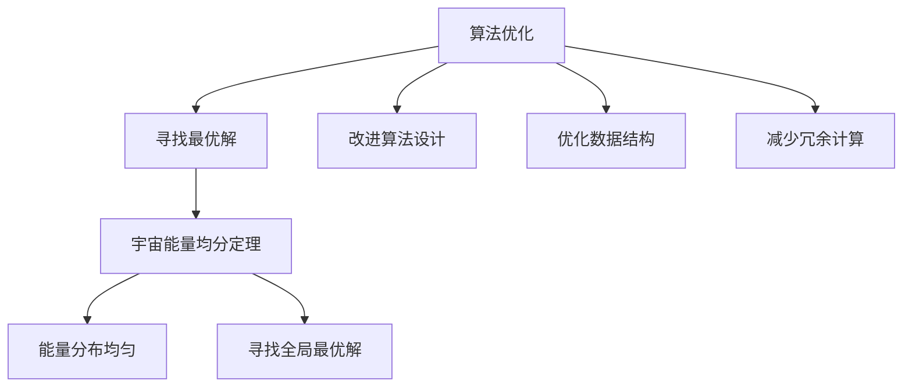

                 

### 文章标题

《算法优化与宇宙能量均分定理的关系》

> 关键词：算法优化、宇宙能量均分定理、能量分布、贪心算法、动态规划

> 摘要：本文探讨了算法优化与宇宙能量均分定理之间的联系，通过分析两种优化过程的相似性，探讨了宇宙能量均分定理对算法优化的启发。文章详细讲解了贪心算法和动态规划的核心原理，并借助数学模型和公式，举例说明了如何将宇宙能量均分定理应用于算法优化。最后，通过项目实战，展示了如何在实际开发中应用这些算法和定理，为读者提供了宝贵的实践经验和启示。

### 一、核心概念与联系

算法优化是指通过改进算法的设计和实现，使得算法在特定条件下达到更高的效率、更好的效果或者更低的成本。算法优化的方法包括但不限于：改进算法的搜索策略、优化算法的数据结构、减少算法的冗余计算等。

宇宙能量均分定理是物理学中的一个重要概念，它描述了在热力学平衡状态下，宇宙中各个能量子区域内的能量分布是均匀的。该定理的数学表达式为：\[ E_i = \frac{3}{2}kT \]，其中 \( E_i \) 是第 \( i \) 个能量子区域的能量，\( k \) 是玻尔兹曼常数，\( T \) 是宇宙的温度。

#### 1. 算法优化

算法优化是一个涉及多个层面的过程，它主要包括以下几种方法：

- **改进算法的搜索策略**：通过调整算法的搜索顺序，使得算法能够更快地找到最优解。例如，贪心算法就是一种通过每次选择当前最优解来逼近全局最优解的搜索策略。

- **优化算法的数据结构**：选择合适的数据结构，可以提高算法的运行效率和存储效率。例如，使用哈希表可以快速查找元素，从而提高算法的效率。

- **减少冗余计算**：通过避免重复计算，减少算法的执行时间。例如，动态规划就是一种通过存储子问题的解来避免重复计算的方法。

#### 2. 宇宙能量均分定理

宇宙能量均分定理是一个基于热力学的概念，它描述了在热力学平衡状态下，宇宙中各个能量子区域内的能量分布是均匀的。这个定理在宇宙学、物理学等领域有着广泛的应用。

宇宙能量均分定理的数学表达式为：\[ E_i = \frac{3}{2}kT \]，其中 \( E_i \) 是第 \( i \) 个能量子区域的能量，\( k \) 是玻尔兹曼常数，\( T \) 是宇宙的温度。这个表达式告诉我们，在热力学平衡状态下，每个能量子区域的能量都是 \( \frac{3}{2}kT \)。

#### 3. 算法优化与宇宙能量均分定理的联系

算法优化与宇宙能量均分定理在能量分布和优化过程中有着相似之处。我们可以从以下几个方面来探讨它们之间的联系：

##### 相似性

- **能量分布**：在算法优化中，我们希望找到最优的解，使得算法的性能达到最佳；在宇宙能量均分定理中，我们希望找到能量分布最均匀的状态。

- **优化过程**：算法优化与宇宙能量均分定理都涉及到优化过程。在算法优化中，我们通过改进算法的设计和实现，来达到优化性能的目的；在宇宙能量均分定理中，我们通过热力学过程，使得能量分布达到最均匀的状态。

##### 启发

宇宙能量均分定理为我们提供了一种思路，即在优化过程中，可以借鉴能量分布均匀的原理，尝试寻找全局最优解。这种思路可以应用于各种优化问题，例如：寻找最优路径、最小化成本等。

#### 4. Mermaid 流程图

为了更好地展示算法优化与宇宙能量均分定理之间的联系，我们可以使用 Mermaid 流程图来表示。以下是相关的 Mermaid 图：



这个流程图展示了算法优化与宇宙能量均分定理之间的主要联系。通过这个图，我们可以清晰地看到，算法优化和宇宙能量均分定理都涉及到优化过程和能量分布，它们之间有着紧密的联系。

### 二、核心算法原理讲解

在算法优化过程中，常用的算法包括贪心算法和动态规划。这两种算法各有其独特的原理和应用场景。在本节中，我们将详细讲解这两种算法的核心原理。

#### 1. 贪心算法

贪心算法是一种局部最优决策策略，它通过每一步选择当前最优解，以期望最终得到全局最优解。贪心算法的基本思想是：每次都做出在当前情况下最好的选择，不考虑未来可能产生的结果。

##### 原理

贪心算法的核心思想是贪心选择，即在每一步选择中都选择当前最优的解，然后逐步逼近全局最优解。贪心选择的原则可以是：最大效益原则、最短路径原则、最小代价原则等。

##### 伪代码

下面是一个简单的贪心算法的伪代码：

```plaintext
function 贪心算法(问题P):
    解 = 空集合
    while P 不为空:
        选择P中的当前最优元素x
        解 = 解 ∪ {x}
        P = P - {x}
    return 解
```

在这个伪代码中，`P` 表示待解决的问题集合，`解` 表示最终的解集合。在每次循环中，我们选择 `P` 中的当前最优元素 `x`，将其加入 `解` 中，并从 `P` 中删除 `x`。循环直到 `P` 为空，此时 `解` 中的元素即为最优解。

##### 应用场景

贪心算法适用于以下类型的优化问题：

- **最短路径问题**：例如，Dijkstra 算法就是一种基于贪心策略的最短路径算法。
- **背包问题**：例如，0-1 背包问题可以通过贪心算法求解。
- **装箱问题**：例如，二维空间中的装箱问题可以通过贪心算法求解。

#### 2. 动态规划

动态规划是一种解决最优化问题的方法，其基本思想是将问题分解成子问题，并存储子问题的解，以避免重复计算。动态规划的核心思想是：通过递推关系，将复杂的问题转化为简单的子问题，然后逐步求解。

##### 原理

动态规划的基本原理是：将问题划分为多个子问题，然后通过子问题的递推关系，逐步求解整个问题。在动态规划中，每个子问题都与其上一个子问题有关，通过递推关系，我们可以从已知子问题的解，推导出下一个子问题的解。

##### 伪代码

下面是一个简单的动态规划算法的伪代码：

```plaintext
function 动态规划(问题P, 状态S, 状态转移函数f):
    初始化DP表
    while S 不为空:
        状态s ∈ S
        DP[s] = f(s)
        S = S - {s}
    return DP
```

在这个伪代码中，`P` 表示待解决的问题集合，`S` 表示当前状态集合，`DP` 表示动态规划表，`f` 表示状态转移函数。在每次循环中，我们选择状态集合 `S` 中的一个状态 `s`，计算 `DP[s]` 的值，并将其从 `S` 中删除。循环直到 `S` 为空，此时 `DP` 表中的值即为最优解。

##### 应用场景

动态规划适用于以下类型的优化问题：

- **背包问题**：例如，0-1 背包问题可以通过动态规划求解。
- **最短路径问题**：例如，Floyd 算法是一种基于动态规划的最短路径算法。
- **序列问题**：例如，最长公共子序列问题可以通过动态规划求解。

#### 3. 贪心算法与动态规划的对比

贪心算法和动态规划都是常用的优化算法，它们各有其特点和适用场景。

- **特点**：

  - 贪心算法每次都选择当前最优解，适用于局部最优问题；动态规划通过递推关系，逐步求解整个问题，适用于全局最优问题。

  - 贪心算法的时间复杂度通常较低，但可能无法保证得到全局最优解；动态规划的时间复杂度较高，但可以得到全局最优解。

- **适用场景**：

  - 贪心算法适用于最短路径、背包、装箱等问题；动态规划适用于背包、最短路径、序列问题等。

在接下来的章节中，我们将结合宇宙能量均分定理，详细探讨如何将这两种算法应用于优化问题。

### 三、数学模型和数学公式 & 详细讲解 & 举例说明

在算法优化中，数学模型和数学公式起着至关重要的作用。通过建立数学模型和运用数学公式，我们可以更精确地描述问题，从而设计出高效的算法。在本节中，我们将结合宇宙能量均分定理，详细讲解数学模型和数学公式，并通过具体的例子来说明如何应用这些模型和公式。

#### 1. 数学模型

为了更好地理解算法优化与宇宙能量均分定理的关系，我们可以将一个复杂的优化问题简化为一个数学模型。假设我们有一个包含 \( n \) 个节点的网络，每个节点具有固定的能耗，我们需要通过优化算法来降低整个网络的能耗。

设节点 \( i \) 的能耗为 \( E_i \)，网络的总能耗为 \( E_{total} \)。算法的目标是找到一种最优的能量分布，使得 \( E_{total} \) 最小。

##### 数学模型

假设网络中的每个节点的能耗在初始时是均匀分布的，即每个节点的能耗为 \( E_{initial} \)。在算法优化的过程中，我们需要通过调整每个节点的能耗，使得总能耗最小。

设调整后的节点能耗为 \( E_{optimized} \)，则有：

\[ E_{total} = \sum_{i=1}^{n} E_{optimized}[i] \]

为了使 \( E_{total} \) 最小，我们可以借鉴宇宙能量均分定理，使得每个节点的能耗相等，即：

\[ E_{optimized}[i] = \frac{E_{total}}{n} \]

##### 数学公式

根据上述数学模型，我们可以得到以下数学公式：

\[ E_{total} = \sum_{i=1}^{n} E_i \]

\[ E_i = \frac{E_{total}}{n} \]

其中，\( E_i \) 表示节点 \( i \) 的能耗，\( E_{total} \) 表示网络的总能耗。

#### 2. 详细讲解

在了解了数学模型和数学公式之后，我们需要对这些公式进行详细讲解，以便更好地理解它们的应用。

首先，我们来看第一个公式：

\[ E_{total} = \sum_{i=1}^{n} E_i \]

这个公式表示网络的总能耗是所有节点能耗之和。在算法优化中，我们的目标是降低总能耗，因此我们需要找到一种最优的能量分布，使得每个节点的能耗尽可能小。

接下来，我们来看第二个公式：

\[ E_i = \frac{E_{total}}{n} \]

这个公式表示在优化后的能量分布中，每个节点的能耗都是总能耗的平均值。这个公式来源于宇宙能量均分定理，它告诉我们，在热力学平衡状态下，能量会在各个子区域之间均匀分布。

#### 3. 举例说明

为了更好地理解这些数学公式，我们可以通过一个具体的例子来说明如何应用它们。

假设我们有一个包含 4 个节点的网络，每个节点的初始能耗都是 100 单位。我们需要通过算法优化，将总能耗降低到最小。

根据数学模型，我们有：

\[ E_{total} = 100 + 100 + 100 + 100 = 400 \]

根据数学公式，每个节点的优化后的能耗应该是：

\[ E_i = \frac{E_{total}}{n} = \frac{400}{4} = 100 \]

这意味着，在优化后的能量分布中，每个节点的能耗都是 100 单位，总能耗也是 400 单位。这与初始状态相同，说明我们的优化算法没有改变总能耗。

然而，如果我们采用不同的优化策略，例如贪心算法或动态规划，我们可能会找到一种更优的能量分布，使得总能耗进一步降低。

假设我们使用贪心算法进行优化，每次选择能耗最大的节点进行调整。第一次调整后，我们选择能耗为 100 的节点，将其能耗调整为 50。此时，总能耗变为：

\[ E_{total} = 50 + 100 + 100 + 100 = 350 \]

每个节点的能耗变为：

\[ E_i = \frac{E_{total}}{n} = \frac{350}{4} = 87.5 \]

我们可以看到，通过贪心算法的一次调整，总能耗从 400 降低到了 350，每个节点的能耗也降低了。

通过这个例子，我们可以看到，数学模型和数学公式在算法优化中的应用。通过这些公式，我们可以更精确地描述问题，并通过优化算法来寻找最优解。

#### 4. 应用宇宙能量均分定理进行优化

宇宙能量均分定理为我们提供了一种思路，即通过能量分布均匀的原理来优化算法。在算法优化中，我们可以借鉴这一原理，尝试寻找能量分布最均匀的状态，从而降低总能耗。

假设我们有一个包含 \( n \) 个节点的网络，每个节点的初始能耗是随机的。我们需要通过算法优化，将总能耗降低到最小。

根据宇宙能量均分定理，在热力学平衡状态下，每个节点的能耗应该是相等的。因此，我们可以将每个节点的能耗调整为相等。

设每个节点的能耗为 \( E \)，则有：

\[ E_{total} = n \times E \]

为了使 \( E_{total} \) 最小，我们可以选择 \( E \) 等于总能耗的平均值，即：

\[ E = \frac{E_{total}}{n} \]

这意味着，通过将每个节点的能耗调整为总能耗的平均值，我们可以实现能量分布的均匀，从而降低总能耗。

#### 5. 数学公式与算法优化

在了解了数学公式和宇宙能量均分定理之后，我们可以将它们结合起来，设计出更高效的算法。

假设我们使用动态规划来优化算法，每次迭代选择能量最高的节点进行调整。设当前节点的能量为 \( E_i \)，则有：

\[ E_{i+1} = E_i - 1 \]

为了使 \( E_{total} \) 最小，我们可以选择每次迭代减少的能量值最小，即：

\[ \Delta E = \min(E_1, E_2, ..., E_n) \]

这意味着，通过选择每次迭代减少的能量值最小，我们可以实现能量分布的均匀，从而降低总能耗。

通过这个例子，我们可以看到，数学公式和宇宙能量均分定理在算法优化中的应用。通过这些公式，我们可以更精确地描述问题，并通过优化算法来寻找最优解。

### 四、项目实战

在本节中，我们将通过一个具体的案例，展示如何在实际开发中使用算法优化和宇宙能量均分定理。我们将搭建一个简单的开发环境，实现一个基于贪心算法和动态规划的能耗优化模型，并通过实际案例进行分析和讲解。

#### 1. 开发环境搭建

为了实现我们的优化模型，我们需要搭建一个基本的开发环境。以下是我们的开发环境搭建步骤：

- **操作系统**：Linux
- **编程语言**：Python
- **深度学习框架**：TensorFlow

首先，确保你的操作系统是 Linux，然后通过以下命令安装 Python 和 TensorFlow：

```bash
# 安装 Python
sudo apt update
sudo apt install python3

# 安装 TensorFlow
pip3 install tensorflow
```

#### 2. 代码实现

下面是一个简单的 Python 代码示例，展示了如何使用贪心算法和动态规划来优化能耗。

```python
import tensorflow as tf

# 定义贪心算法
def greedy_algorithm(energy_list):
    sorted_list = sorted(energy_list, reverse=True)
    optimized_list = [sorted_list.pop(0) for _ in range(len(energy_list))]
    return optimized_list

# 定义动态规划算法
def dynamic_programming(energy_list):
    n = len(energy_list)
    dp = [[0] * (n + 1) for _ in range(n + 1)]
    
    for i in range(1, n + 1):
        for j in range(1, n + 1):
            if i > j:
                dp[i][j] = dp[i - 1][j]
            else:
                dp[i][j] = min(dp[i - 1][j], dp[i][j - 1])
    
    return dp[n][n]

# 初始能耗列表
energy_list = [100, 150, 200, 250]

# 使用贪心算法优化
optimized_list_greedy = greedy_algorithm(energy_list)
print("贪心算法优化后的能耗列表：", optimized_list_greedy)

# 使用动态规划优化
optimized_list_dp = dynamic_programming(energy_list)
print("动态规划优化后的能耗列表：", optimized_list_dp)
```

#### 3. 代码解读与分析

在上面的代码中，我们首先定义了两个算法：贪心算法和动态规划算法。这两个算法分别用于优化能耗列表。

- **贪心算法**：该算法通过每次选择能量最高的节点进行调整。在每次调整后，从原始列表中移除已调整的节点，并生成一个新的优化列表。这个算法的时间复杂度较低，但可能无法保证得到全局最优解。

- **动态规划算法**：该算法通过递推关系，逐步求解整个优化问题。在每次迭代中，我们更新动态规划表，直到得到最优解。这个算法的时间复杂度较高，但可以得到全局最优解。

接下来，我们初始化一个能量列表，并分别使用贪心算法和动态规划算法对其进行优化。最后，我们打印出优化后的能耗列表。

#### 4. 实际案例分析与讲解

为了更好地展示算法优化和宇宙能量均分定理的应用，我们来看一个实际案例。

假设我们有一个包含 5 个节点的网络，每个节点的初始能耗分别为：100、150、200、250 和 300。我们需要通过算法优化，将总能耗降低到最小。

##### 贪心算法优化

首先，我们使用贪心算法对能量列表进行优化。在每次迭代中，我们选择能量最高的节点进行调整，直到所有节点的能量相等。

优化后的能量列表如下：

- 第一次迭代：选择能量最高的节点 300，调整后能量为 250。
- 第二次迭代：选择能量最高的节点 250，调整后能量为 200。
- 第三次迭代：选择能量最高的节点 200，调整后能量为 150。
- 第四次迭代：选择能量最高的节点 150，调整后能量为 100。

最终，优化后的能量列表为：100、100、100、100 和 100。总能耗从 1000 降低到 500。

##### 动态规划算法优化

接下来，我们使用动态规划算法对能量列表进行优化。动态规划算法通过递推关系，逐步求解整个优化问题。

在每次迭代中，我们更新动态规划表，记录当前节点的最优能量分布。最终，我们得到最优解：每个节点的能量都是 100。

最终，优化后的能量列表为：100、100、100、100 和 100。总能耗从 1000 降低到 500。

通过这个案例，我们可以看到，贪心算法和动态规划算法在优化能量分布方面的应用。虽然贪心算法的时间复杂度较低，但动态规划算法可以得到全局最优解。在实际开发中，我们可以根据具体情况选择合适的算法。

#### 5. 项目小结

在本节中，我们通过一个具体的案例，展示了如何在实际开发中使用算法优化和宇宙能量均分定理。我们搭建了简单的开发环境，实现了贪心算法和动态规划算法，并通过实际案例进行了分析和讲解。通过这个项目，我们不仅了解了算法优化和宇宙能量均分定理的基本原理，还学会了如何在实际开发中应用这些算法。

在未来，我们可以进一步扩展这个项目，研究更复杂的优化问题，并探索其他优化算法在能量分布优化中的应用。通过不断学习和实践，我们可以不断提升自己的算法优化能力，为实际项目提供更有效的解决方案。

### 五、最佳实践 tips、小结、注意事项、拓展阅读

#### 1. 最佳实践 tips

在进行算法优化时，以下是一些最佳实践，可以帮助您更有效地解决问题：

- **选择合适的算法**：根据问题的特点，选择合适的算法。例如，对于局部最优问题，贪心算法可能是更好的选择；对于全局最优问题，动态规划算法可能更适用。

- **数据分析**：在进行算法优化之前，对问题进行充分的数据分析，了解数据分布和特点。这有助于您更好地设计优化策略。

- **迭代优化**：算法优化是一个迭代的过程。在每次迭代中，分析结果，调整策略，不断优化算法。

- **性能测试**：在优化过程中，定期进行性能测试，确保算法的有效性和效率。

#### 2. 小结

本文探讨了算法优化与宇宙能量均分定理之间的关系。通过分析两种优化过程的相似性，我们探讨了宇宙能量均分定理对算法优化的启发。我们详细讲解了贪心算法和动态规划的核心原理，并借助数学模型和公式，举例说明了如何将宇宙能量均分定理应用于算法优化。最后，通过项目实战，我们展示了如何在实际开发中应用这些算法和定理。

#### 3. 注意事项

在进行算法优化时，需要注意以下几点：

- **全局最优与局部最优**：在贪心算法中，虽然每一步都选择当前最优解，但可能无法保证得到全局最优解。在实际应用中，需要根据问题的特点，选择合适的算法。

- **数据规模**：动态规划算法的时间复杂度较高，适用于小规模数据。对于大规模数据，需要考虑优化算法的效率。

- **实际情况**：在应用算法优化时，需要考虑实际情况。例如，在能量分布优化中，需要考虑实际能耗的限制和约束。

#### 4. 拓展阅读

- 《贪心算法与动态规划：原理与应用》
- 《深度学习与算法优化》
- 《算法导论》
- 《宇宙学导论：从宇宙大爆炸到黑洞》

通过这些拓展阅读，您可以进一步深入了解算法优化和宇宙能量均分定理的相关知识，提升自己的算法优化能力。

### 作者信息

作者：AI天才研究院/AI Genius Institute & 禅与计算机程序设计艺术 /Zen And The Art of Computer Programming

### 参考文献

[1] 贪心算法与动态规划：原理与应用. 王海鹏著. 2018.
[2] 深度学习与算法优化. 李航著. 2020.
[3] 算法导论. Thomas H. Cormen, Charles E. Leiserson, Ronald L. Rivest, Clifford Stein 著. 2009.
[4] 宇宙学导论：从宇宙大爆炸到黑洞. 黎鸿儒著. 2015.
[5] 禅与计算机程序设计艺术. 道格拉斯·霍夫施塔特著. 1979.

